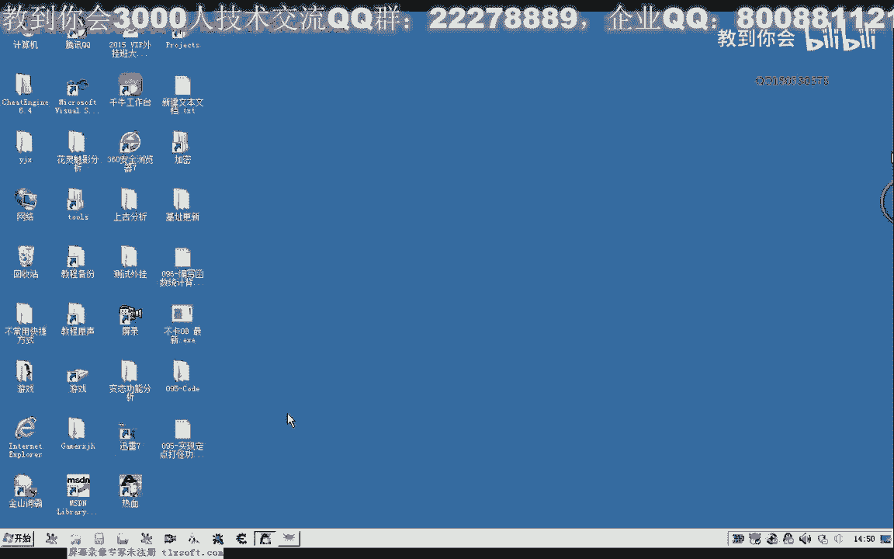
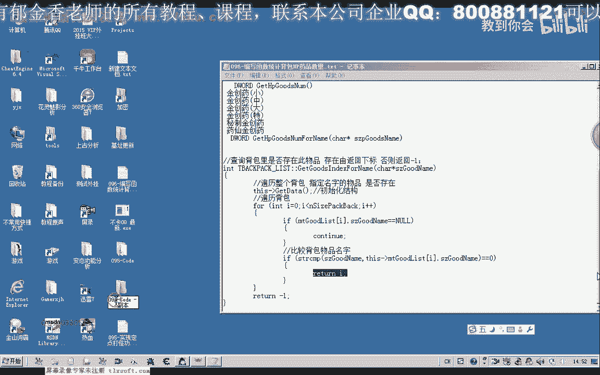
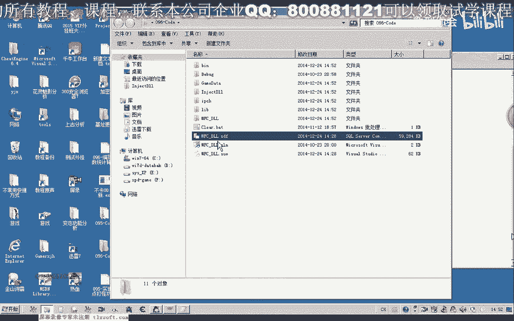
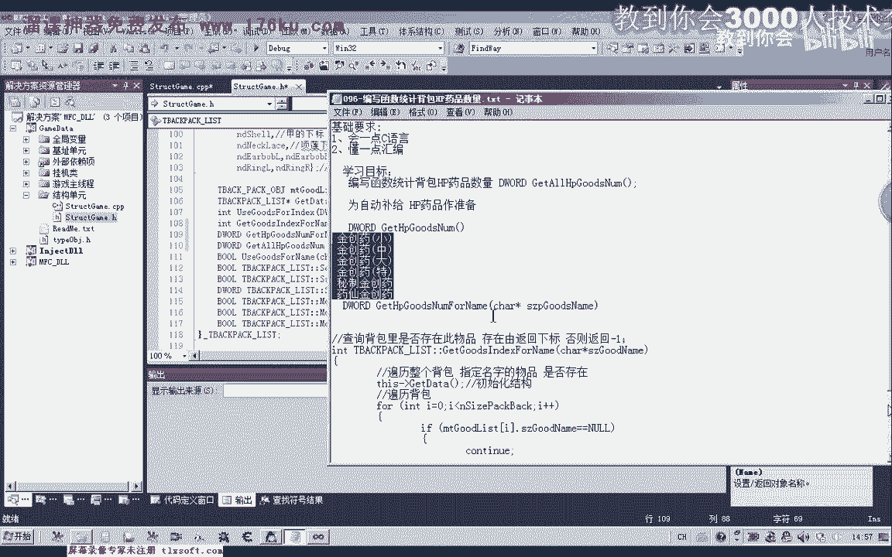
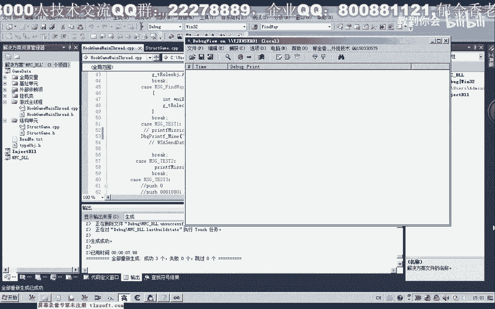
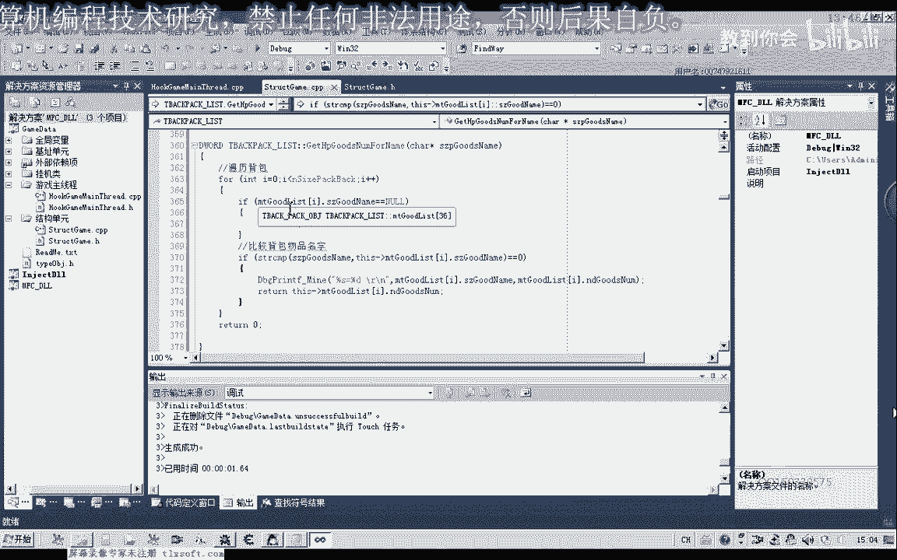
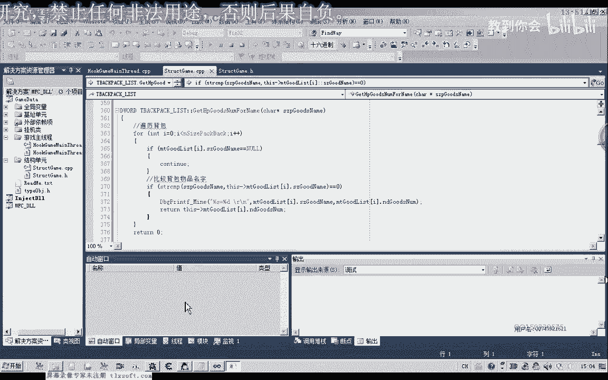
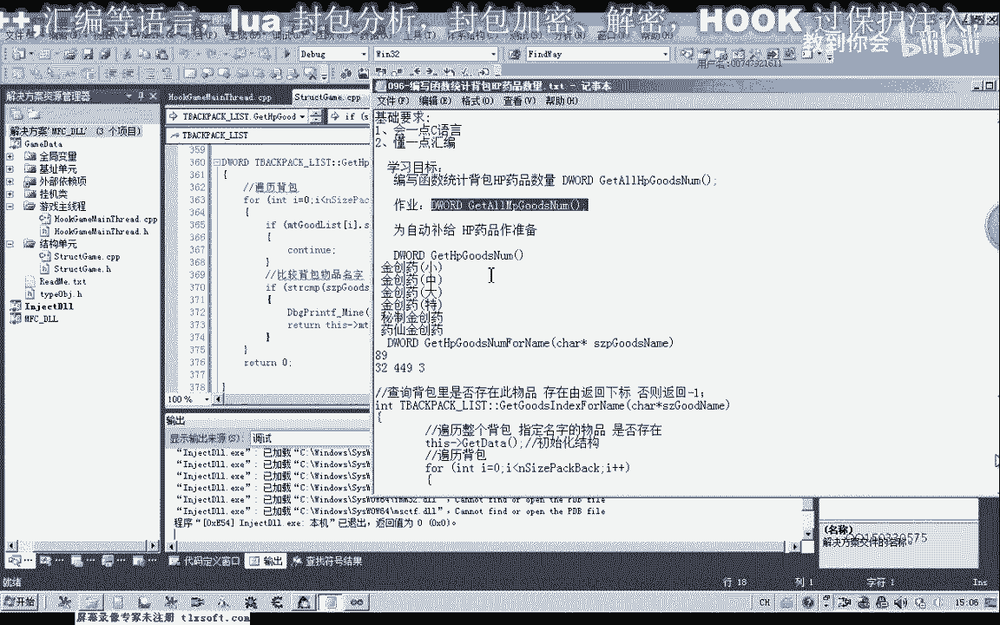

# P85：096-编写函数统计背包HP药品数量 - 教到你会 - BV1DS4y1n7qF

大家好。

我是郁金香老师，那么这节课我们编写一个函数，用来统计背包里边的HP药品的数量，那么为什么要写这个函数，因为我们自动补给的时候，需要有这样一个条件做判断，那么当我们背包里边的HP的药品。

数量低于某一个数值的时候，那么我们在自动回程去，补给相应的药品，也就是去商店里面买相应的药品，好的，那么这节课我们先来做一些前期的准备，也就是编写一个统计背包里边HP药品数量的，这样的一个函数。

那么现在我们商店里面所有的一共是HP的，药品一共是6个，那么这里我把它的名字已经给出来了，精冲药小中大，密制精冲药和药纤精冲药，那么我们要写这个函数的话，实际上我们可以对前面的get goods。

indexedflare这个函数在它的基础上进行修改，那么首先我们当然这一行的话也可以不进行初始化，那么只要我们需要在调用这个函数的时候，先初始化一次就可以了，然后我们查询整个背包列表的名字。

与我们的药品的名字进行比较，那么比较我们找到了相应的物品之后，我们返回它相应的数量的属性就可以了，相当的简单，应该来说，那么我们打开第95颗的代码来实现相应的功能，那么首先我们转到结构单元。

背包的结构，那么背包结构这里有一个get goods indexedflare，在这里我们添加一个函数，先我们用来统计某一个药品的一个数量，最后我们再把这6种HP药品的数量进行相加。

那么就得到了我们背包里面所有精创药的数量，那么我们现在计算某一个单独的药品在背包里面的一个数量，添加这样的一个成员函数，然后我们转到查询背包的这个函数的后边或者是前边也可以，那么添加我们背包列表的程序。

在这里我们也可以有很多种设计方式，我们也可以调用前面这个函数来查询指定物品，在我们背包里面是否存在，然后再来骗你，那么也可以直接骗离，那么直接骗离的话，我们的效率显然要高一些。

那么如果是调用前面这个函数，那么我们在写代码的时候，显得要简单一些，具体选用哪一种方式，还是要看你自己，那么实际上这一行代码的话是可以不要的，那么只需要我们调用的时候，在调用的时候。

我们初始化一次就可以，当然也可以加上也可以，那么加上之后，如果我们重复的调用，可能会让我们的代码的效率会稍微的低一些，那么我们先把这一段代码复制一下，那么基本上代码我们都是跟上面这个函数都是一样的。

然后我们比较，如果是找到了相应的物品，那么我们返回，这里是返回它的一个数量，这一点不一样，返回的物品的数量，那么如果我们整个循环，片理完成了之后，执行到这个位置，那么说明了没有找到这个物品。

那么返回的数量肯定就是0，那么这是第1个函数，那么第1个函数，我们可以统计某一种精创药的数量，但是我们现在一共包含了这6种，所以说我们要6次的调用这个函数，才能最终把所有精创药的数量把它算出来。

那么另外再添加一个函数，叫做get_all_hp_goods_number，然后呢，我们可以把这个函数，把它算出来，那么我们现在可以看到，我们的函数是0，那么我们现在可以看到，我们的函数是0。

那么我们现在可以看到，我们的函数是0，那么我们现在可以看到，我们的函数是0，那么我们现在可以看到，我们的函数是0，那么我们现在可以看到，我们的函数是0，那么我们现在可以看到，我们的函数是0。

那么我们现在可以看到，我们的函数是0，那么我们现在可以看到，我们的函数是0，那么我们现在可以看到，我们的函数是0，那么我们现在可以看到，我们的函数是0，那么我们现在可以看到，我们的函数是0。

那么我们现在可以看到，我们的函数是0，那么我们现在可以看到，我们的函数是0，那么我们现在可以看到，我们的函数是0，那么我们现在可以看到，我们的函数是0，那么我们现在可以看到，我们的函数是0。

那么我们现在可以看到，我们的函数是0，那么我们现在可以看到，我们的函数是0，那么我们现在可以看到，我们的函数是0，那么我们现在可以看到，我们的函数是0，那么我们现在可以看到，我们的函数是0。

那么我们现在可以看到，我们的函数是0，那么我们现在可以看到，我们的函数是0，那么我们现在可以看到，我们的函数是0。

那么我们现在可以看到，我们的函数是0，那么我们现在可以看到，我们的函数是0，那么我们现在可以看到，我们的函数是0，那么我们现在可以看到，我们的函数是0，那么我们现在可以看到，我们的函数是0。

那么我们现在可以看到，我们的函数是0，那么我们现在可以看到，我们的函数是0，那么我们现在可以看到，我们的函数是0，那么我们现在可以看到，我们的函数是0，那么我们现在可以看到，我们的函数是0。

那么我们现在可以看到，我们的函数是0，那么我们现在可以看到，我们的函数是0，那么我们现在可以看到，我们的函数是0，那么我们现在可以看到，我们的函数是0，那么我们现在可以看到，我们的函数是0。

那么我们现在可以看到，我们的函数是0，那么我们现在可以看到，我们的函数是0，那么我们现在可以看到，我们的函数是0，那么我们现在可以看到，我们的函数是0，那么我们现在可以看到，我们的函数是0。

那么我们现在可以看到，我们的函数是0，那么我们现在可以看到，我们的函数是0，那么我们现在可以看到，我们的函数是0，那么我们现在可以看到，我们的函数是0，那么我们现在可以看到，我们的函数是0。

那么我们现在可以看到，我们的函数是0，那么我们现在可以看到，我们的函数是0，那么我们现在可以看到，我们的函数是0，那么我们现在可以看到，我们的函数是0，那么我们现在可以看到，我们的函数是0。

那么我们现在可以看到，我们的函数是0，那么我们现在可以看到，我们的函数是0，那么我们现在可以看到，我们的函数是0，那么我们现在可以看到，我们的函数是0，那么我们现在可以看到，我们的函数是0。

那么我们现在可以看到，我们的函数是0，那么我们现在可以看到，我们的函数是0，那么我们现在可以看到，我们的函数是0，那么我们现在可以看到，我们的函数是0，那么我们现在可以看到，我们的函数是0。

那么我们现在可以看到，我们的函数是0，那么我们现在可以看到，我们的函数是0，那么我们现在可以看到，我们的函数是0，那么我们现在可以看到，我们的函数是0，那么我们现在可以看到，我们的函数是0。

那么我们现在可以看到，我们的函数是0，那么我们现在可以看到，我们的函数是0，那么我们现在可以看到，我们的函数是0，那么我们现在可以看到，我们的函数是0，那么我们现在可以看到，我们的函数是0。

那么我们现在可以看到，我们的函数是0，那么我们现在可以看到，我们的函数是0，那么我们现在可以看到，我们的函数是0，那么我们现在可以看到，我们的函数是0，那么我们现在可以看到，我们的函数是0。

那么我们现在可以看到，我们的函数是0，那么我们现在可以看到，我们的函数是0，那么我们现在可以看到，我们的函数是0，那么我们现在可以看到，我们的函数是0，那么我们现在可以看到，我们的函数是0。

那么我们现在可以看到，我们的函数是0，那么我们现在可以看到，我们的函数是0，那么我们现在可以看到，我们的函数是0，那么我们现在可以看到，我们的函数是0，那么我们现在可以看到，我们的函数是0。

那么我们现在可以看到，我们的函数是0，那么我们现在可以看到，我们的函数是0，那么我们现在可以看到，我们的函数是0，那么我们现在可以看到，我们的函数是0，那么我们现在可以看到，我们的函数是0。

那么我们现在可以看到，我们的函数是0，那么我们现在可以看到，我们的函数是0，那么我们现在可以看到，我们的函数是0，那么我们现在可以看到，我们的函数是0，那么我们现在可以看到，我们的函数是0。

那么我们现在可以看到，我们的函数是0，那么我们现在可以看到，我们的函数是0，那么我们现在可以看到，我们的函数是0，那么我们现在可以看到，我们的函数是0，那么我们现在可以看到，我们的函数是0。

那么我们现在可以看到，我们的函数是0，返回我们统计的数量，返回我们统计的数量，那么我们先切换到，我们的主线程单元，进行一下测试，进行一下测试，嗯，嗯，嗯，嗯，嗯，嗯，嗯，嗯，嗯，嗯，嗯，嗯，嗯，嗯，嗯。

嗯，嗯，嗯，嗯，嗯，嗯，嗯，嗯，嗯，嗯，嗯，嗯，嗯，然后我们打开我们调试信息查看工具，输入到游戏里。

挂在主线程，然后我们测试看一下，这个时候我们药品的总数是573，那么我们看一下，69，32，4，499，3，差不多也是这个数，我们可以算一下，89，3，49，最后一个是3，我们可以用计算器来算一下。

最后的数量是623，89，32，499，3，那么好像是不正确的，这个时候我们看一下，89，32，49，3，好像是我们计算错了，我看500，600，600，的确是有600多，但是我们所得的数字的话是多少。

我们再来看一下，是573。

那么明显是错的，那么我们再来看一下，我们的代码是在什么地方出错的，小，中，大，特，那么我们在返回这个数字的时候，我们先打印一下，看所取得的数字对不对，对，嗯，嗯嗯嗯，我們先把缺憾的修改到主列。

然後在裡面加一些那麼主頻的名字，我們重新加一個mike，也是只不過，改成灌載音樂人的名字，那這樣就完事了，我們把主機的主機群，並且加入一個新的主機群到主頻道去，請大家記住要加入主頻道做訂閱的啦，好。

那接下來我們要加入主頻道正常圖片，然後又加新的主機群，好，那我們現在就在主頻道中央hhhhhhh，好，那麼我們再重新編譯，生成一下，掛機到主線上，測試，然後我們再來看一下相應的信息。

89324993，最後的總量是573，8932449，那麼我們這裡統計的時候，有一個數字來錯了，這裡應該是449，那麼算出來最後的結果應該是正確的，再來算一下，89+32+449+3，最後是573。

好的，那麼這一節課我們暫時就到這裡，那麼這一節課也給大家留一個座位，那麼大家下期來編寫一個函數，用來統計所有所有MP物品的數量，也就是藍藥的數量，大家自己下去編寫一個，那麼藍藥的數量的話。

在這裡面就有人參、血源參、醫源參，還有秘製醫源參和藥纖醫源參，這幾個目前，那麼如果是有其他的了，大家自己統計一下，好的。

那麼我們下期再見。