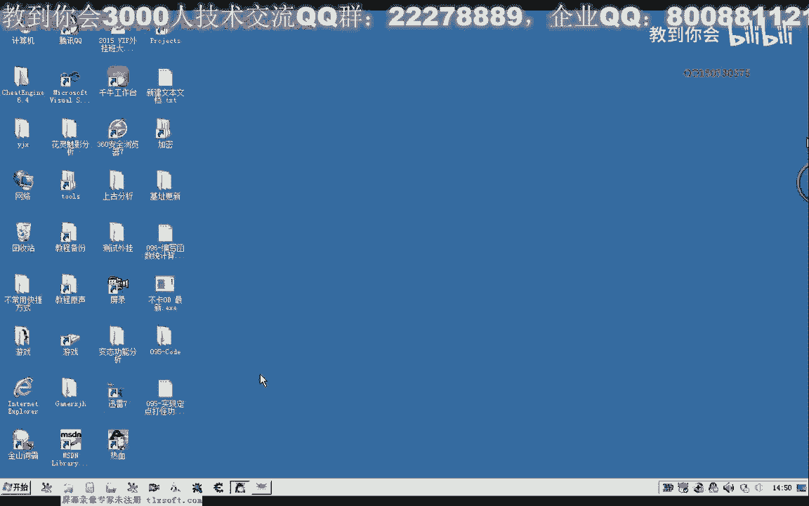
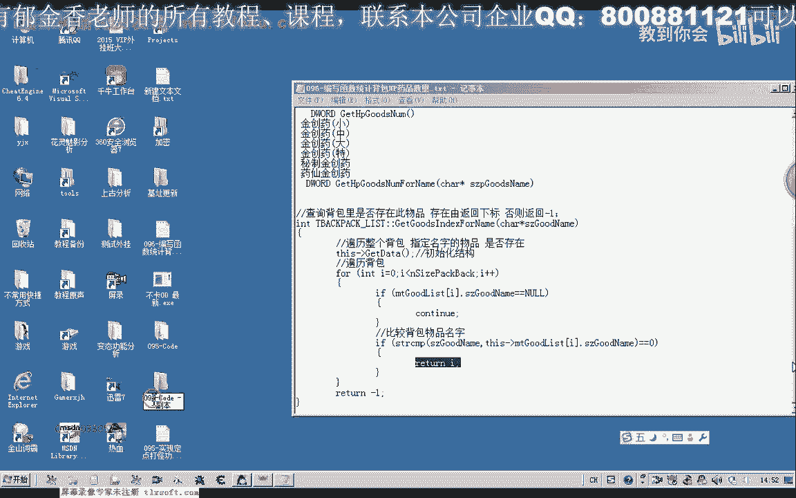
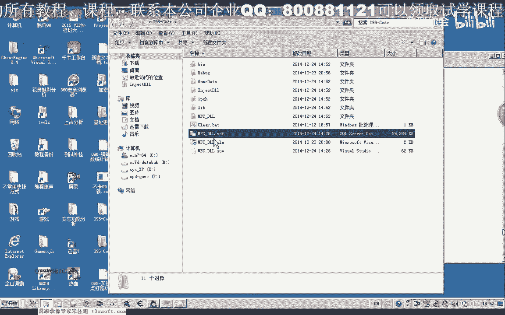
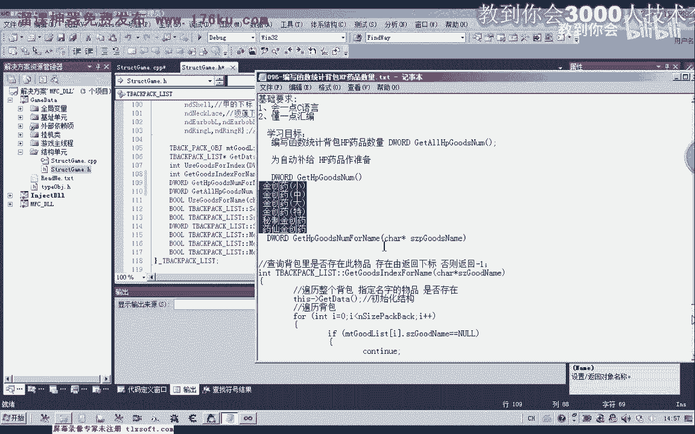
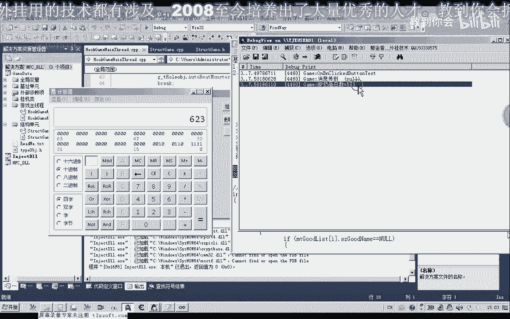
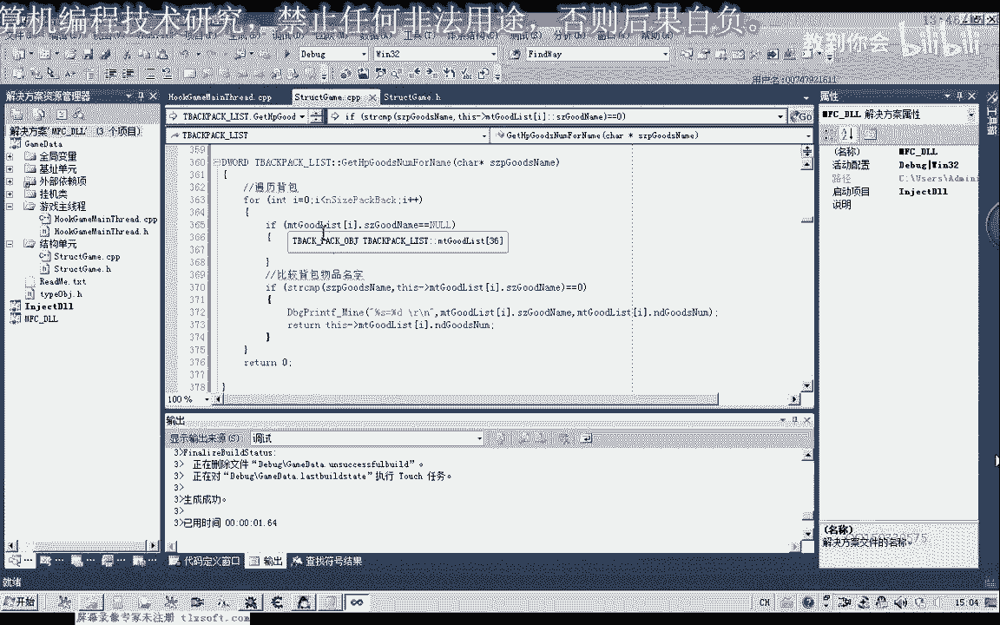
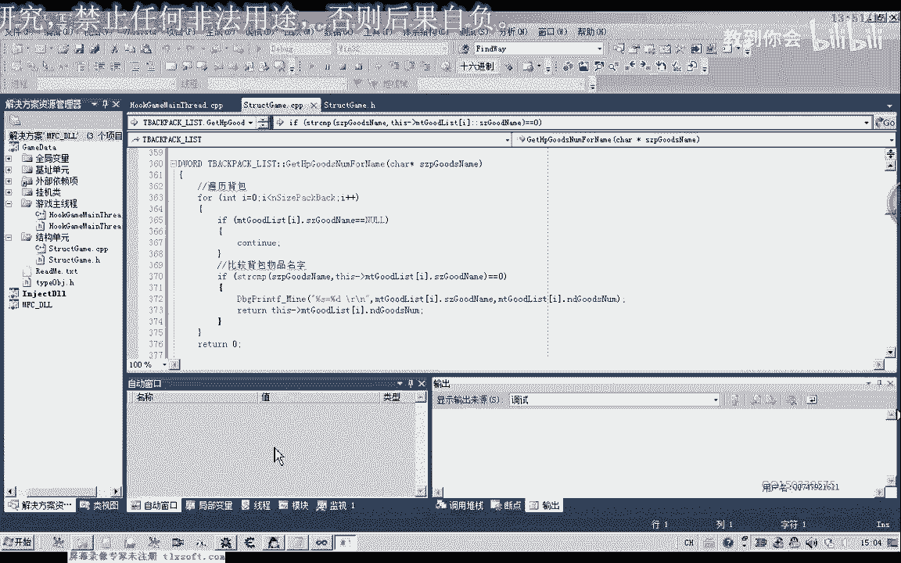
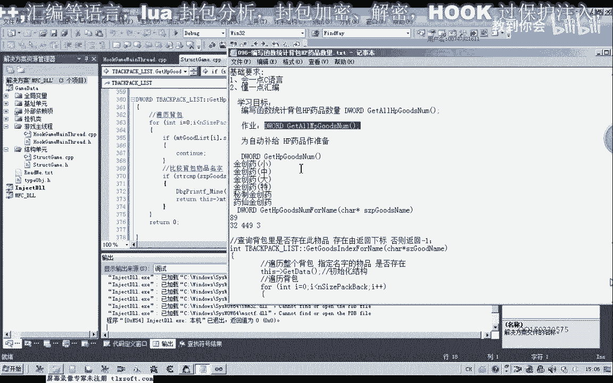

# 课程 P85：096 - 编写函数统计背包HP药品数量 📦💊

在本节课中，我们将学习如何编写一个函数，用于统计游戏背包中所有HP（生命值）药品的总数量。这个功能是实现自动补给逻辑的关键部分，当药品数量低于某个阈值时，程序可以自动回城购买。

## 概述与目标





上一节我们学习了如何查询背包中特定物品的信息。本节中，我们将在其基础上进行扩展，编写一个能统计所有HP药品数量的函数。我们将通过遍历药品列表并累加数量的方式来实现。

## 前期准备与思路分析

游戏商店中目前共有6种HP药品，分别是：精冲药（小）、精冲药（中）、精冲药（大）、密制精冲药、药纤精冲药和特制精冲药。

我们的实现思路分为两步：
1.  首先，编写一个函数，用于统计背包中**某一种**指定药品的数量。
2.  然后，编写另一个函数，循环调用第一步的函数，累加所有6种HP药品的数量。

我们将基于已有的 `get_goods_indexedflare` 函数进行修改。

## 第一步：统计单种药品数量

我们首先在背包结构体中添加一个成员函数，用于查询指定名称的药品在背包中的数量。

以下是该函数的实现思路：
*   遍历背包物品列表。
*   将每个物品的名称与目标药品名称进行比较。
*   如果找到匹配项，则返回该物品的 `数量` 属性。
*   如果遍历结束仍未找到，则返回 `0`。



```cpp
int TBag::get_specific_hp_goods_number(const std::string& goods_name) {
    // 可选：初始化背包列表。若在外部已初始化，此行可省略。
    // update_bag_list();

    for (const auto& item : bag_list) {
        if (item.name == goods_name) {
            return item.count; // 找到物品，返回其数量
        }
    }
    return 0; // 未找到该物品，数量为0
}
```

## 第二步：统计所有HP药品总数量

接下来，我们创建第二个函数，用于计算所有HP药品的总和。我们需要定义一个包含所有HP药品名称的列表，然后循环调用上一步的函数。

以下是该函数的实现代码：

```cpp
int TBag::get_all_hp_goods_number() {
    // 定义所有HP药品的名称列表
    std::vector<std::string> hp_goods_names = {
        "精冲药（小）",
        "精冲药（中）",
        "精冲药（大）",
        "密制精冲药",
        "药纤精冲药",
        "特制精冲药"
    };

    int total_number = 0;
    for (const auto& name : hp_goods_names) {
        total_number += get_specific_hp_goods_number(name);
    }
    return total_number; // 返回统计的总数量
}
```

## 功能测试与调试

编写完函数后，我们需要在主线程单元进行测试，以确保其正确性。

1.  将函数调用集成到主逻辑中。
2.  运行程序并挂载到游戏进程。
3.  打开调试信息查看工具，输出 `get_all_hp_goods_number()` 函数的返回值。
4.  手动核对背包中各类HP药品的数量，验证程序计算结果是否正确。

在测试过程中，如果发现统计数字错误，应检查以下方面：
*   药品名称字符串是否与游戏内完全一致。
*   在累加过程中是否有逻辑错误或笔误。
*   背包列表是否在调用前被正确初始化。

例如，若发现总数不对，可以在 `get_specific_hp_goods_number` 函数中打印每次找到的物品名称和数量，进行逐步排查。

## 课程总结


本节课中，我们一起学习了如何编写函数来统计背包中HP药品的总数量。我们首先实现了查询单一药品数量的基础函数，然后通过遍历药品列表并累加，实现了整体统计功能。

这个功能是构建自动化游戏脚本（如自动补给）的重要基石。



## 课后练习

为了巩固所学知识，请大家独立完成以下练习：





**编写一个函数，用于统计背包中所有MP（魔法值）药品的数量。**

目前游戏中的MP药品包括：人参、血源参、医源参、秘制医源参和药纤医源参。请参考本节课的方法，实现相应的统计函数。



---
**下节课再见！** 👋