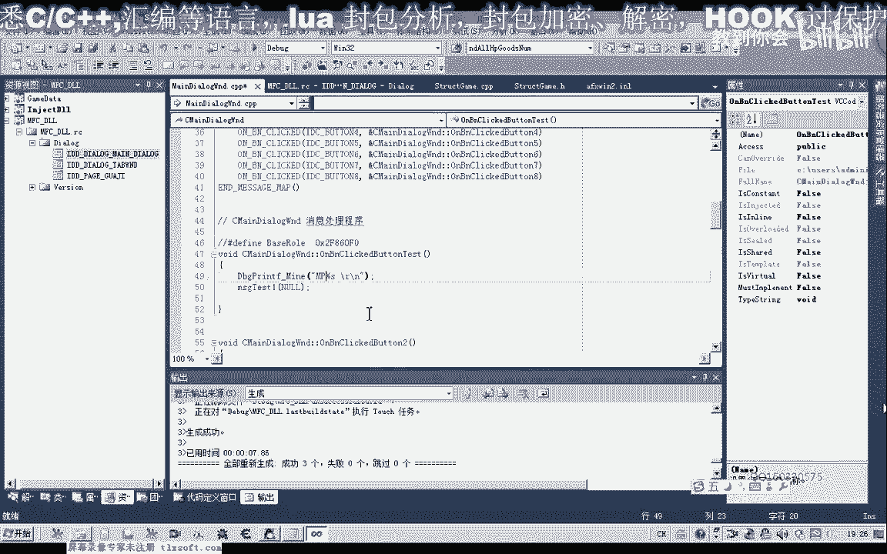

# 课程 P86：097-Mp药品数量统计与背包状态判断 🎒

在本节课中，我们将完成上一节课的作业，即统计MP药品的数量，并编写一个新函数来判断游戏背包是否已满。

---

## 完成上节课作业：统计MP药品数量 💊

上一节我们介绍了如何统计金创药的数量，本节中我们来看看如何统计MP药品的数量。

我们首先打开第96课的代码。

然后，我们转到背包的结构单元。在统计金创药数量的代码后面，添加统计MP药品数量的函数。

我们复制前面统计药品的函数，并将其名称改为 `mp`。

以下是需要统计的MP药品名称列表：
*   人参
*   雪原参
*   一元参
*   秘制人参
*   药仙
*   野山参

其中，野山参在三邪关和领证官才有相应的MP药品。

变量名可以修改，也可以保持不变。

保存代码。完成这个作业只需对原有代码进行少量修改。

---

## 编写新函数：判断背包是否已满 📦

接下来，我们需要添加一个新函数，用于判断背包是否已满。当背包满时，我们通常需要执行回城、补给、清理垃圾物品出售给商店等操作。

我们在MP药品统计函数的后面添加这个新函数，然后转到相应位置编写代码。

如果背包的每一格都存放了物品对象，则返回 `true`，表示背包已满。

这里我们需要使用一个循环来遍历背包。背包的大小由一个名为 `in size` 的成员变量定义。

我们需要为这个变量添加前缀，以表明它是背包结构的成员，这样才能使用其内部的成员变量。

在循环中，我们对每一格物品的数量进行判断。如果某个格子的物品数量等于零，表示该格子没有物品，我们直接返回 `false`。

如果整个循环遍历完成，从下标0到35共36个格子，所有格子的物品数量都不为零，则说明背包已满，返回 `true`。

如果中途发现某一格数量为零，则返回 `false`，表示背包未满。

---

## 测试与验证 ✅

现在，我们来测试一下MP药品数量的统计功能。

启动测试，查看药品数量的统计结果。

我们也可以在游戏中购买一些其他药品进行测试。

再次执行统计。结果显示：人参数量、雪原参数量、一元参数量、药仙数量等，共计30个。

核对结果：取原生10个，人参4个，一元32个，秘制一元3个，药仙1个，野山参3个，总计30个。统计正确。

---

## 课程总结与作业 📝

本节课内容比较简单。我们一起学习了如何统计MP药品数量，以及如何编写函数判断背包是否已满。

下一节课我们将继续分析相关数据。

这里留一个作业：当金创药的总数小于某个特定数值（例如小于10）时，让角色自动回城并购买指定数量（例如100个）的金创药。这是一个助力练习，大家有时间可以尝试完成。

好的，本节课就到这里。