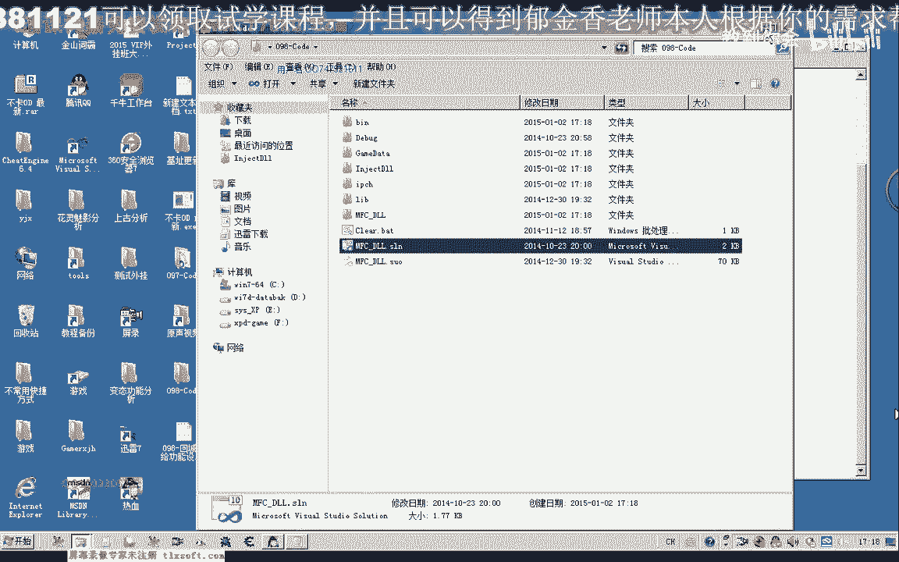
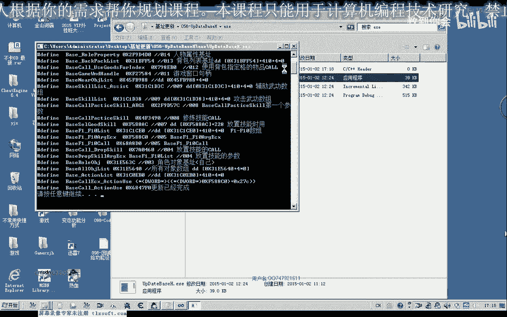

# P87：098-回城补给功能设计与补给条件检测IsRequireSupply - 教到你会 - BV1DS4y1n7qF

大家好，我是郁金香老师，那么这节课呢我们一起来看一下啊，回程普及功能的一个设计啊，以及相关的数据的一些准备，那么我们在玩游戏的时候啊，嗯挂机的时候呢，我们背包里面的某些物品嗯，比如说它的数量啊。

那随着这个在野外打怪的时候呢，这些金创药啊，我们说的hp这些药品呢会消耗，那么当达到某一个数值的时候啊，低于某一个数值的时候呢，我们就需要来啊回到城里的商店里面补充相应的这个物品，那么这个补充物品的话。

回城补气的这个功能呢，它的设计呢要比我们之前的嗯这些功能的设计呢要显得要复杂一点，那么我把它整理了一下呃，大致的思路是这样，那么首先呢我们要看一下，看一下这个补补剂的一个条件是否成立。

那么嗯以这个游戏为例，比如说我们的所有的这个hp的啊，补充我们血量的这个药品，它的总数小于某一个数量啊，比如说是小于数量一或者是小于数量十的时候呢，我们就需要回到城里边来进行补充啊。

那么首先呢是这个条件的这个判断，那么这个条件的判断的话，我们之前呢也写了两个函数，用来统计我们的hp的药品以及m p的这个药品的数量啊，那么这个数量与我们另外的一个是嗯一个数值进行比较的时候啊。

那么我们就能够呃确定这个条件，比如说有一个最低的一个数量啊，保有量啊，我们的hp药品，比如说这个数值我们设置为啊一时，那么总的hp药品数量小于十的时候呢，我们就要执行下面的这个啊武器的这个功能。

那么补剂药品的这个功能呢，我们首先呢因为补剂之后呢，我们涉及到要返回到当前的挂机挂机的一个地点，所以说我们首先做的是要保存当前的一个坐标，第二个呢我们要寻路到啊，也就是说我们嗯调用了这个寻路的课。

还要让他不断的在这里呢啊，主赛啊不能够如果没有到达目的地坐标的话，我们不能够执行后面的这些动作啊，那么我们必须呢在寻路的同时呢要加一个循环进行判断，要他到达了这个指定的这个坐标才可以。

然后比如说这个坐标是游戏里边啊，这个平时这个n p c的这个坐标，那么必须要到了这个坐标地点之后呢，我们才能够执行打开n p c对话的这些功能啊，不然的话可能会出现一些异常的错误啊。

或者是达不到我们所要所要的这个嗯效果，那么打开npc之后呢，我们还需要来一个延迟，让他把这个数据呢传送给我们的服务器啊，那么这个呢我们呃延迟的话我们可以用sleep来实现啊，然后再次打开我们的商店啊。

最后呢主机物品啊，当然了嗯，就是购买指定数量的这个嗯相应的物品让它保持在一个数量啊，比如说这个是最大值，比如说我们需要这个hp的啊，清创要小要保持在200这个数量，那么比如说现在有五个啊。

那么需要了再到我们的第二里边了，购买195个加起，现加上现有的不可能达到200，这个数值达到200这个数值，那么在购买之前呢，一般呢我们会有一些垃圾物品需要出售给商店啊。

那么这里呢我们都是一个啊顺序的一个执行啊，一样一样的执行，出售了所有的垃圾物品之后呢，那么我们在购买资金数量的啊这个药品啊，这些呢我们在后面的课程呢，最近的这几个里边呢，我们可以一步一步的来完善。

那么所有的我们物品补充完完了之后呢，我们要关闭商店啊，关闭pc对话，最后呢再返回到之前保存的这个坐标，那么之前嗯还有一个环境的一个变量，之前如果是在某一个地方是在挂机打怪。

那么呢我们还需要返回到某一个坐标之后呢，实现挂机的一个功能好，那么大概呢就是这样的一个流程，那么所以说那么接下来的课程里边的话，我们就要呃首先是一个啊补给条件的一个判例判断啊。

需要来写一个函数来判断这个补给的条件是否成立，那么成立了之后呢，我们再啊写一个空来执行呢，这下边的啊这些相关的这个功能的一个实现，好的，那么我们首先打开第97课的代码。

这一节课呢我们先把呃这个补给的条件啊的一个判断呢，做一个初步的一个封装。

好的，那么这个时候呢我们需要来次来，最好的是把这个机制来都更新一次。

更新一次，然后把这个头文件不是一下。

然后移到我们的挂记录里面，然后呢添加我们相应的一个判断，嗯，那么这个回程补给的这个条件的话，它可以有很多啊，比如说我们某一样物品啊使用完了，或者是我们的包裹满了。

或者是操纵这些人都可以做一个啊回程的这个条件啊，那么我们先呢呃就来检测一下我们的这个mp和hp这个药品的啊，根据它的一个数量来来计算这个回程的一个条件，那么呢要计算的话。

我们还需要添加几个层面的一个变量啊，那么我们一样平移呃，你这个药品为例，那么首先呢我们也需要来设置一个开关啊，这个开关表示了我们是否开启这个功能。

在这个药品当前的这个hp的这个药品低于某一个数值的时候呢，我们是否就是说执行这个非常普系，那么这个是回城补给的这个函数啊，这个我们先定义一个这这个函数在这里，那么具体的功能呢我们需要在后边来实现啊。

那么这个呢我们是hp的这个药品低于某个数值的时候呢，回城补给的一个开关，那么这个mp的这个药品呢，它同样的需要这样一个开关啊，这个设置，那么这里呢我们把它改一下，看个p。

那么这个数值呢是呃就是我们mp这个物品的数量呃，最最低的一个数值啊，那么当达到这个数值的时候的话，当前的这个mp的这个药品的总量，它低于这个数字的时候，那么我们的回程的条件呢也是成立的啊。

那么在后边这一个呢是我们mp药品呢需要回城补给的时候，需要的一个保有量啊，就是一个最大的一个数字，那么这个呢是我们回程的时候记的这个mp药品的种类，比如说人生或者是血缘生这一类的。

那么在这里呢我们可以调用一个背包的啊，一个药品检测啊，数量检测的一个函数，一二，那么这里呢可以获得它相应的一个数量，在这里头我们可以定义两个局部变量用来存放啊，当前的，hp药品的总数。

那么下面这个呢我们把它改一下，就是所有mp啊，这个物品啊，也就是我们魔力啊，补充魔力的嗯，这个药品的总量，然后呢我们与呃设置的啊与窗口界面嗯，设置的这个当前的这个数值来进行一个比较，那么这个最小值啊。

如果当前我们的这个当前的hp，和这个物品的值小于小于这个最低的这个数量的时候呢，那么我们这里的条件就成立了，就直接return好处，那么就直接就可以回城补给相应的这个物品。

那么后边的也是我们把这个复制一下啊，那么这里呢是mp，这个是hp，那么如果这两个都通过了检测哈，都发现了嘟嘟嘟嘟条件不成立啊，那么执行到最后的时候呢，我们法庭的它就是f就是说不需要回城补气。

那么后边的话我们还可以加上我们的啊负重的一个判断，那么如果是负重，那么超过了啊，比如说99%也是有一个呃数值，比如说超过了90%，那么这个时候呢也可以做一个作为一个回城补气的一个条件。

那么另外一个就是我们的背包啊，背包是否满意啊，那么在背包满的时候呢，我们也可以做一个回程的一个条件，咳咳咳，那么如果这里我们发现这个背包它是满的吧，那么这里呢我们也直接去看，这个时候呢我们就是回程了。

清理我们的背包，当然了，顺便就记我们的这个相应的这个物品，好那么我们来看一下我们是是否这个相应的这个机子呢没有会更新，这里我们先少加一个下划线，那么我们就用新的这种方式，替换，那么再重新编译一下，好的。

那么这一节课我们的内容呢大致就是如此啊，那么下一节课呢我们来写这个寻路道的这个函数啊，那么寻路的函数已经有了，我们只需要了另外写一个循环啊，呃来判断是否达到这个目的地的一个坐标就可以了。

然后呢我们分别完成这后边的这些功能，打开npc打开商店，当然这些功能呢我们之前都已经找到了相关的这个空，只需要再进一步的封装啊，呃提供给我们调用就可以了。

那么当这些下边的这些呃小的这些部分我们都完成之后呢，然后我们把它组合在一起，那么我们最后呢就能够呃写成一个我们的这个回城补给的这个一个，相应的一个功能，好的，那么这个寻路到的这个函数的一个封装呢。

作为一个坐垫啊，大家先去完成一下。

