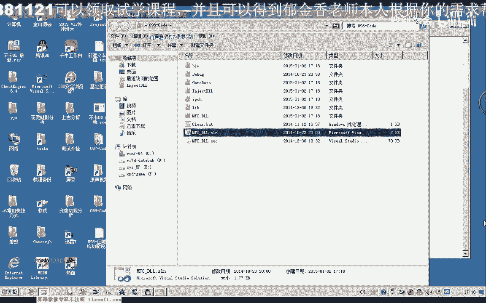
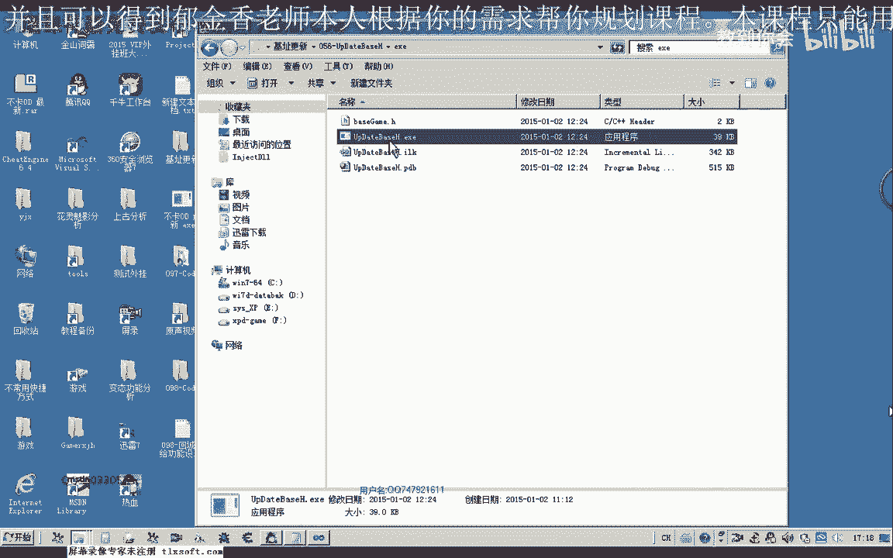
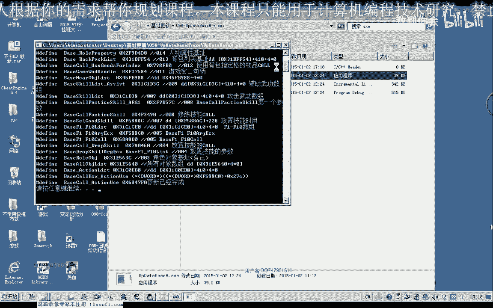
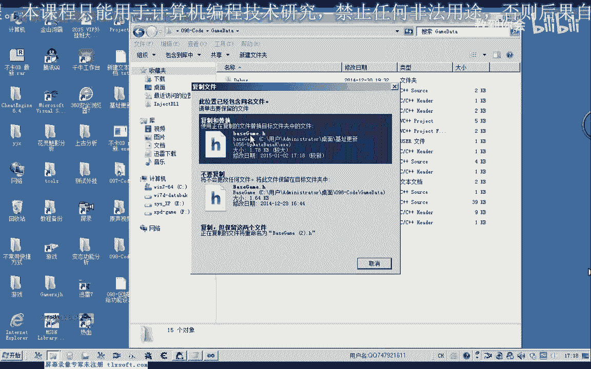
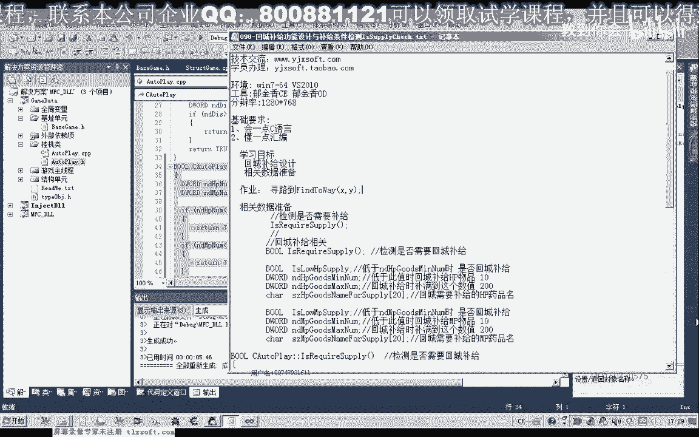

# 课程 P87：098 - 回城补给功能设计与补给条件检测 IsRequireSupply 🧳

在本节课中，我们将学习如何设计一个自动回城补给的功能，并重点完成补给条件的检测逻辑。这个功能是游戏自动化中较为复杂的一环，涉及到状态判断、路径导航和物品交互等多个步骤。

## 概述

在游戏挂机过程中，背包中的药品等消耗品会逐渐减少。当物品数量低于某个阈值时，角色需要自动返回城镇商店进行补充。本节课，我们将首先梳理整个回城补给的流程，然后实现核心的补给条件检测函数 `IsRequireSupply`。

## 回城补给功能设计思路

上一节我们介绍了功能的目标，本节中我们来看看实现它的整体流程。回城补给功能比之前的功能更为复杂，其大致执行顺序如下：

1.  **判断补给条件**：检测背包中特定物品（如HP/MP药品）的数量是否低于预设的最低保有量。
2.  **保存当前位置**：记录角色当前的坐标，以便补给完成后能返回。
3.  **寻路至商店NPC**：调用寻路功能，导航至城镇中商店NPC所在的坐标。
4.  **与NPC交互**：到达指定坐标后，打开与NPC的对话，并打开商店界面。
5.  **出售垃圾物品**：将背包中的无用物品出售给商店。
6.  **购买补给品**：计算并购买所需数量的药品，使其达到预设的最大保有量。
7.  **关闭界面并返回**：关闭商店和NPC对话框，使用保存的坐标寻路返回挂机地点。

接下来，我们将从第一步“判断补给条件”开始实现。

## 实现补给条件检测函数



以下是实现 `IsRequireSupply` 函数的核心步骤，我们将逐一封装这些逻辑。






首先，我们需要定义一些配置变量来控制补给行为。这些变量可以在游戏界面中设置。




```cpp
// 补给功能开关与配置
bool g_bAutoSupplyHP;      // HP药品低于阈值时，是否启用回城补给
int  g_nHPMinThreshold;    // HP药品的最低保有量（触发补给的阈值）
int  g_nHPMaxCount;        // HP药品的最大保有量（补给后达到的数量）
int  g_nHPItemID;          // 需要补给的HP药品ID

bool g_bAutoSupplyMP;      // MP药品低于阈值时，是否启用回城补给
int  g_nMPMinThreshold;    // MP药品的最低保有量
int  g_nMPMaxCount;        // MP药品的最大保有量
int  g_nMPItemID;          // 需要补给的MP药品ID
```

接着，我们实现核心的 `IsRequireSupply` 函数。该函数会检查各种条件，只要满足其一，就返回 `true`，表示需要回城。

```cpp
bool IsRequireSupply()
{
    // 1. 检查HP药品是否需要补给
    if (g_bAutoSupplyHP) {
        int nCurrentHPCount = GetItemCountByID(g_nHPItemID); // 获取当前HP药品总数
        if (nCurrentHPCount < g_nHPMinThreshold) {
            return true; // 条件成立，需要回城
        }
    }

    // 2. 检查MP药品是否需要补给
    if (g_bAutoSupplyMP) {
        int nCurrentMPCount = GetItemCountByID(g_nMPItemID); // 获取当前MP药品总数
        if (nCurrentMPCount < g_nMPMinThreshold) {
            return true; // 条件成立，需要回城
        }
    }

    // 3. 检查负重是否过高（作为扩展条件）
    // if (GetBurdenPercent() > 90) {
    //     return true; // 负重超过90%，需要回城清理
    // }

    // 4. 检查背包是否已满（作为扩展条件）
    // if (IsBagFull()) {
    //     return true; // 背包已满，需要回城清理
    // }

    // 所有条件均不满足
    return false;
}
```

**代码说明**：
*   `GetItemCountByID(int itemID)`：这是一个假设已存在的函数，用于根据物品ID统计其在背包中的总数量。
*   函数按顺序检查HP补给条件、MP补给条件。未来还可以轻松扩展，加入负重检测 (`GetBurdenPercent`) 和背包满检测 (`IsBagFull`) 等逻辑。
*   只要任一条件满足，函数会立即返回 `true`，表示需要执行回城补给流程。

## 在挂机循环中集成检测

最后，我们需要在主挂机逻辑中调用这个条件检测函数。

```cpp
void MainLoop()
{
    while (true) {
        // ... 其他挂机逻辑，如打怪、拾取 ...

        // 检测是否需要回城补给
        if (IsRequireSupply()) {
            ExecuteSupplyRoutine(); // 执行回城补给流程（下节课实现）
        }

        Sleep(100); // 适当延迟，避免循环过紧
    }
}
```

## 总结

本节课中，我们一起学习了回城补给功能的整体设计思路，并完成了最基础的补给条件检测函数 `IsRequireSupply`。我们定义了控制补给行为的配置变量，并实现了通过比较当前物品数量与预设阈值来判断是否需要回城的逻辑。



下一节课，我们将着手实现 `ExecuteSupplyRoutine` 函数，具体完成寻路至NPC、打开商店、买卖物品等一系列操作，将整个补给流程串联起来。