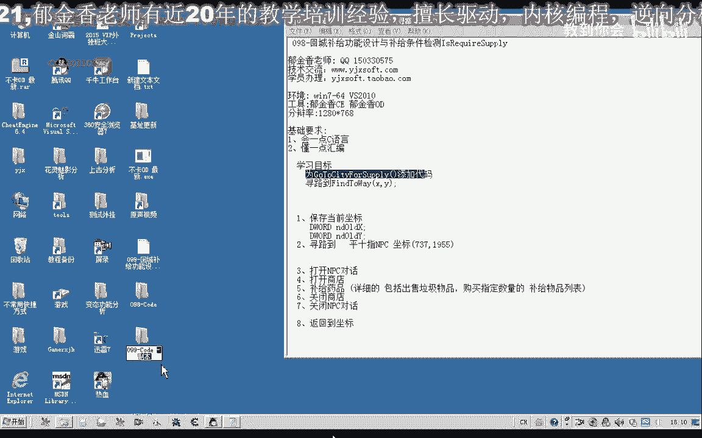
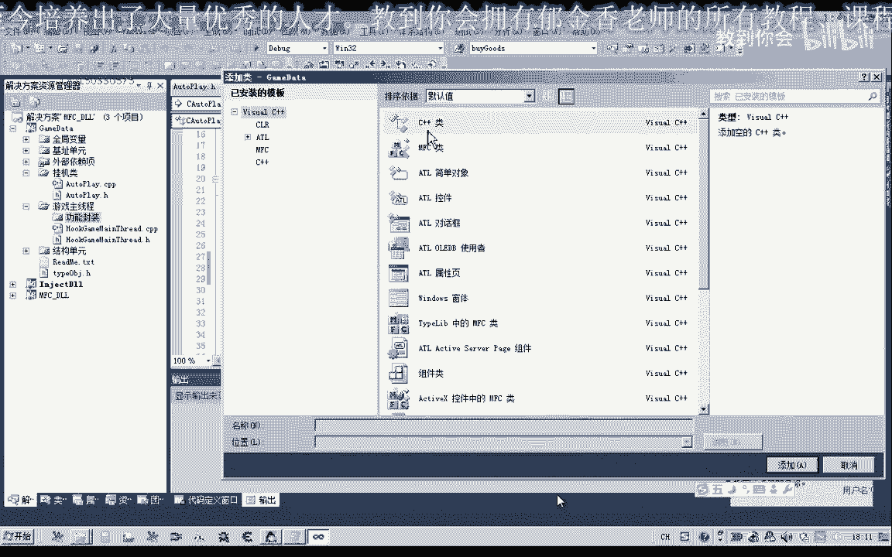
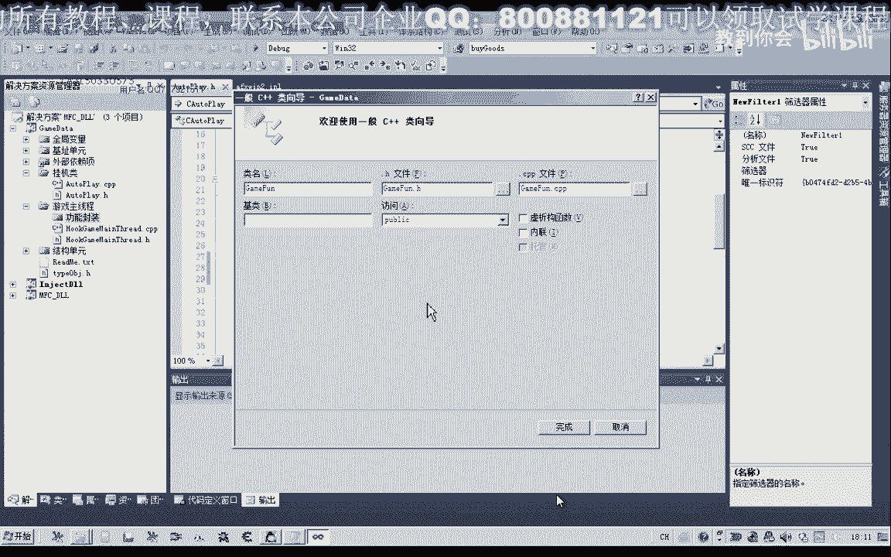

# 课程 P88：099 - 回城补给功能设计相关函数寻路到 FindToWay 🧭

在本节课中，我们将学习如何封装一个“寻路到”功能函数，并将其集成到回城补给功能的设计中。我们将创建新的头文件和源文件来组织代码，并确保其与主线程模块正确交互。




---




## 概述

上一节我们讨论了寻路功能的基础。本节中，我们将把寻路逻辑封装成一个独立的函数，并为回城补给功能（GoTo 设定或计划）添加部分代码。首先，我们需要在开始寻路前保存当前坐标。


## 第一步：添加成员变量

由于第一步需要在执行寻路前保存当前坐标，我们先添加两个与补给相关的成员变量。


## 第二步：创建功能封装模块

接下来，我们需要编写“寻路到”功能。我们将在游戏主线程项目中创建一个新目录，用于实现功能封装。然后添加一个头文件和一个源文件。

在创建时，可以直接选择“C++ 类”，它会自动添加对应的头文件和源文件，完成函数或游戏功能的封装。点击“完成”。


将新建的两个文件移到“功能封装”目录内。


也可以将其独立放在外部。本功能封装模块的约定是：所有涉及游戏扩展的功能都不直接调用，而是通过调用主线程模块中的功能来实现。这意味着这里的函数最终可以被直接调用来实现功能。

## 第三步：配置头文件依赖

由于该模块依赖于我们的主线程单元，因此需要包含相应的头文件。同时，它也会用到基础单元和全局变量单元。

我们将这些依赖写在头文件中。为了防止头文件被重复包含，我们可以使用一段宏定义来进行封装。

```cpp
#ifndef FUNCTION_ENCAPSULATION_H
#define FUNCTION_ENCAPSULATION_H

// 包含必要的头文件
#include "MainThreadUnit.h"
#include "BaseUnit.h"
#include "GlobalVariables.h"

// 函数声明将放在这里

#endif // FUNCTION_ENCAPSULATION_H
```

这样就能保证头文件只被包含一次。

## 第四步：定义寻路函数

现在，我们在头文件中定义相应的“寻路到”函数。可以为其添加一个特定的前缀，以便未来可以不挂接主线程而直接调用，因为其内部实现依赖于主线程单元的函数。

函数原型可能类似于：
```cpp
bool FindToWay(int targetX, int targetY);
```

## 第五步：切换到资源视图进行测试

首先，我们需要在测试代码中包含相关的头文件，然后调用我们的`FindToWay`函数。这里我们使用一个预设的坐标进行测试。

重新编译项目。

## 第六步：挂接主线程并测试

输入测试代码，首先挂接主线程。


查看当前坐标，然后点击测试。观察相关的信息输出，此时应显示相应的时间信息。

重新测试一次。如果之前有一段错误消息，可能是因为传递的参数类型不正确。我们需要到主线程代码中检查。

发现在打印信息时，传入的参数不是字符串类型，导致了一段错误。我们可以这样修改：
```cpp
// 将参数正确转换为字符串或使用正确的格式说明符
printf("坐标信息: %d, %d\n", x, y);
```

## 总结


本节课中，我们一起学习了如何将寻路逻辑封装成独立的`FindToWay`函数，并为其创建了专门的模块。我们添加了必要的成员变量，配置了头文件依赖和防重复包含机制，并进行了初步的测试与调试。

下一节课，我们将继续完善回城补给功能，并进一步集成这个寻路函数。

---
*字幕由 Amara.org 社区提供，感谢大家的支持。*