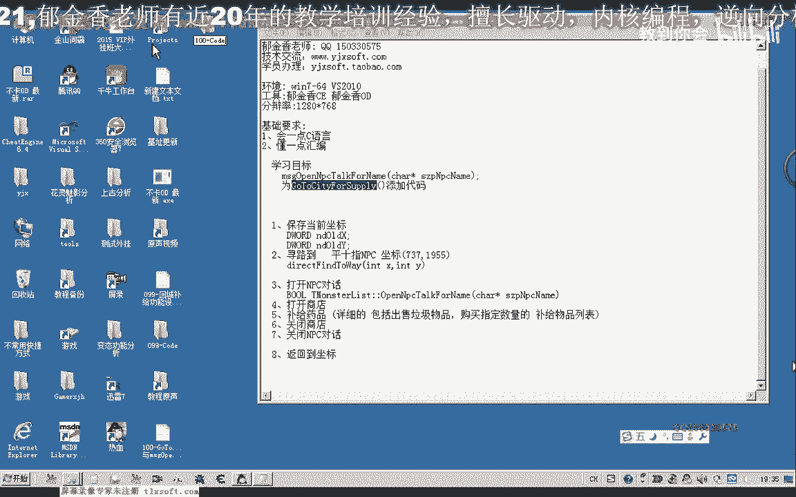
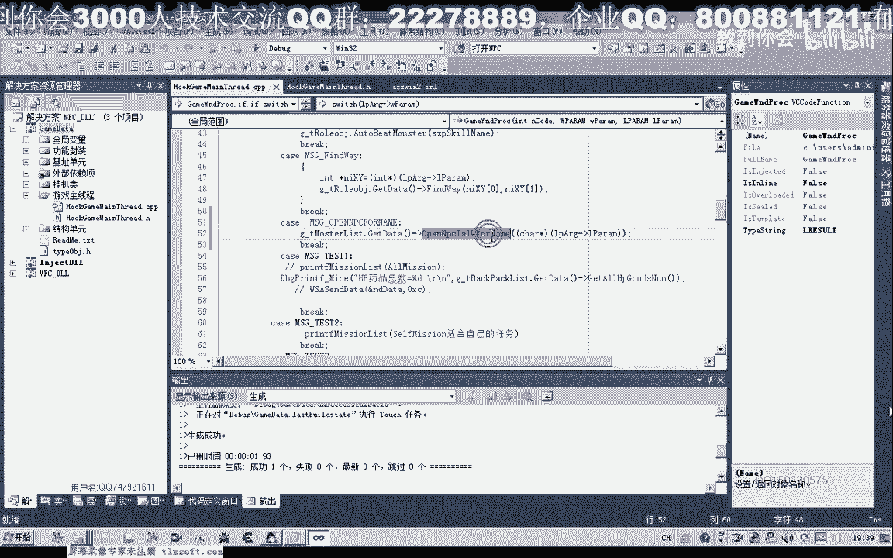
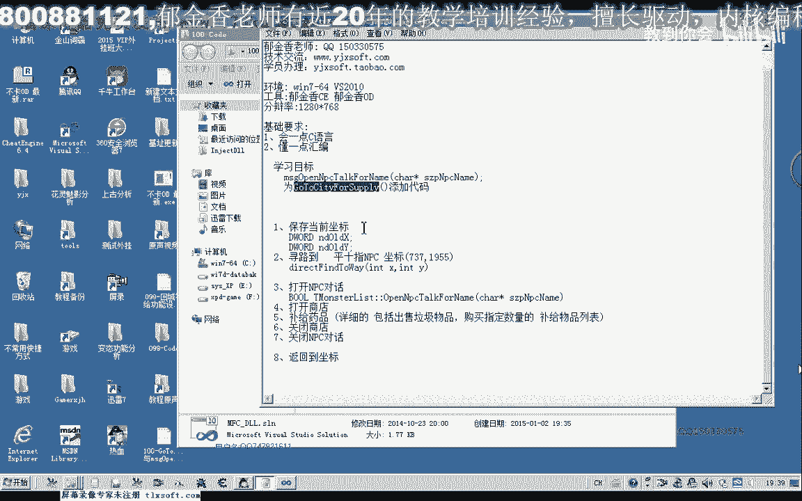
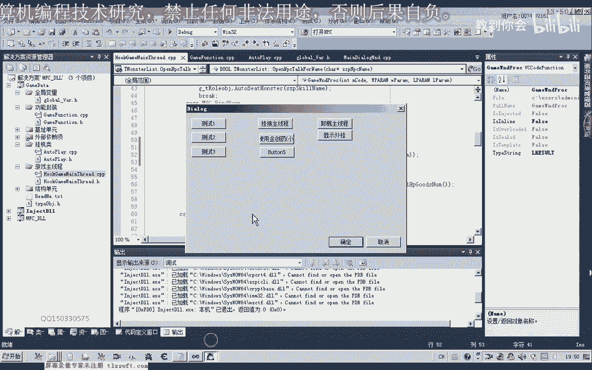
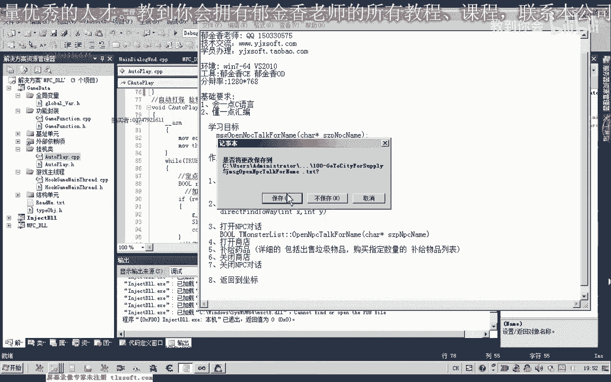

# P89：100-GoToCityForSupply与msgOpenNpcTalkForName - 教到你会 - BV1DS4y1n7qF

大家好，我是郁金香老师，那么这节课呢我们一起来完善回城补剂的这个函数啊，那么首先呢我们打开第99课的代码。

那么打开之后呢，首先让我们切换到游戏的主线程单元，那么首先呢我们封装这个打开npc的这个函数，很多定义啊，然后我们嗯，然后我们添加相应的代码，把前面的代码呢进行一下复制。

那么在这里呢我们需要传送的只有一个npc的名字，那么把它的这个指针的地址传送过去，那么在这里呢我们还要定义一下相关的这个消息的这个红，那么在寻路后边呢，我们再定义一下，npc不累，打开npc的这个消息。

那么这里呢我们为了与前面的进行区分呢，我们可以呢123456啊，这样进行编号就可以了，然后这里的消息类型呢我们把它改为我们的呃这个打开b c的类型，然后呃切换到我们的主线程单元啊。

在这里呢进行我们的消息的一个处理，哒哒哒，那么在这里呢我们调用这个相应的这个函数啊，怪物列表里面的它的一个成员函数，打开pc，先进行初始化啊，然后呢调用一下o p n p c啊。

这个open m p c f类，然后呢我们这里呢需要取出它的相应的这个参数，那么取出来之后呢，我们还需要来把这个指针的类型呢进行一下转换，转换成我们的这个字符指针的类型啊，然后呢我们进行相应的一个调用。

先编译一下。

好那我们再来看一下，呃打开npc的这个功能完成了之后呢，我们就可以了，呃添加这个回程补气的这个函数呢，对它的代码来进行一些完善。

那么这个时候我们移到，我们的功能封装啊，这个单元，那么在这里的话，我们呢呃回城古迹我看一下，那应当是在挂机类里面添加这个回程补剂的这个函数，为什么补剂啊，直到要到达这个城里边，那么我们添加相应的代码。

在这个回调函数的前边，我们添加相应的代码，哈，那么回程补剂我们把这里的相关的这些我们的设计啊，设计的一个思路啊，复制到这里，然后注释掉，那么首先呢我们是要保存一下啊，当前的一个坐标。

那么这里呢实际上我们的类型呢还需要改变一下，这个nt呢需要改成flo啊，表示是否点类型，我们看一下它的定义啊，那么在定义里边呢我们是定义成的整形哈，这种类型是错误的。

那么或者我们在这里呢可以把它定义成带符号类型的啊，印度，那么只有这个带符号的位置呢才可以表示这个负的这个坐标，那么在这里我们再把变量的名字啊改一下，或者直接定义成佛典类型，这样的话不用转化。

效率的话更高一些，好那么这个坐标保存好了之后呢，我们最后的时候啊，估计完了之后呢，我们在这里呢需要返回到这个坐标，返回到指定的坐标去，我们来看一下，那么在这里呢我们需要呢首先呢执行一个寻路道啊。

那么巡逻到这个位置，那么在这里呢我们也需要包含相应的头文件，嗯，好那么我们再次编译一下，然后呢我们再次打开我们的这个npc对话，走，最后呢在这个地方呢我们需要关闭这个npc的对话。

那么我们看一下有没有封装相应的这个函数啊，转到森林，那么在这里的话，我们还要需要呢在下一节课来添加这个关闭npc的这个相应的这个功能，控，把上边这一行啊复制一下，那么这这一段相应的代码呢。

我们需要了在下一节课啊做相应的分析之后呢，再添加相应的这个扩，那么我们再回到我们的挂机类里面，那么这个时候呢我们可以调用一下回程屏息的呃，做一下啊相应的测试。

那么这个时候的话我们就是他会跑到我们的npc旁边，然后打开npc对话，当然这个打开商店这一步呢，我们需要了在下一节课啊，给它添加相应的一个代码，以及我们关闭这个商店，关闭mp 3对话。

那么最后呢才是返回到我们指定的这个坐标，那么也就是说在这最后的话我们要返回，这个坐标，啊这个之前我们保存的这个作品啊，我们到这里，当然目前的这个测试的话，我们用不到，那么这个地方的话。

打开npc的这个代码的话，那我们需要来调用这个m，我跟你是不，好的，那么我们先做一下测试，在这里呢，我们把这个回程补给的代码添加到我们的相应的测试按钮上面，测试一这，那么这个回程补剂的话。

它是属于我们的呃，自动玩的这个单元c g，我们看一下全局变量单元，water play啊，这个对象通过它来调用，好的我们再次编译一下，要先挂接到我们的主线程里。

那么这个时候呢由于呢它没有挂接到这个主线层，所以说呢它造成了一个死循环在这里啊，所以说我们一定要注意在调用这个函数的时候呢，我们一定要先挂机到主线层。

不然的话它会一直呢在这里呢啊循环这个窗口呢它肯定会被卡住，被卡住，好的，那么我们重新再打开游戏测试一下，那我们再重新注入一下啊，这个时候。

那么先挂接到我们的主线层，然后呢再进行这个测试，好那么这个时候呢我们所有的测试都是成功的，它将跑到这个npc这个地方呢，然后呢打开我们的这个窗口，因为我们的这个循环所处的这个线程呢。

是呃在于这个窗口的一个线程有一些关系，那么所以说我们在测试的时候呢，呃在循环判断的时候呢，这个窗口呢会被卡住，因为与我们的游戏主线程相关不相关了。

所以说游戏的主线程不会被卡住啊，因为我们的这个循环我们再来看一下我们的循环设计，主要是这个寻路到这个函数呢，这里呢它会啊不断的循环会卡住，那么我们来接，下来看一下这个相应的单元，因为我们的测试啊。

测试的按钮呢是，那么这里的所处的限制呢是在我们的呃这个，测试窗口的这个线程里面啊，那么如果我们在测试的时候，是把它放到我们的自动玩的这个绿的回调函数里面。

那么窗口呢他应当来说就不会出现这个卡住的这个问题啊，因为他在另外的一个县城里面，比如说在我们的这个自动打怪里面，来调用我们刚才的这个卫生补齐的这个函数呢，就不会被卡住，因为在这里呢它是另外属于一个线程。

它只是这个线程被卡住了，与我们的这个窗口界面里没有关系啊，好的，那么这节课呢我们就简单的呢就讨论到这个地方，那么下一节课呢我们，在为打开商店以及关闭商店，关闭n p c啊。

相应的一些函数进行一些封装以及分析啊，那么现在呢这后边的这四步呢都做一个坐垫啊，反正下去完成一下，好的。

