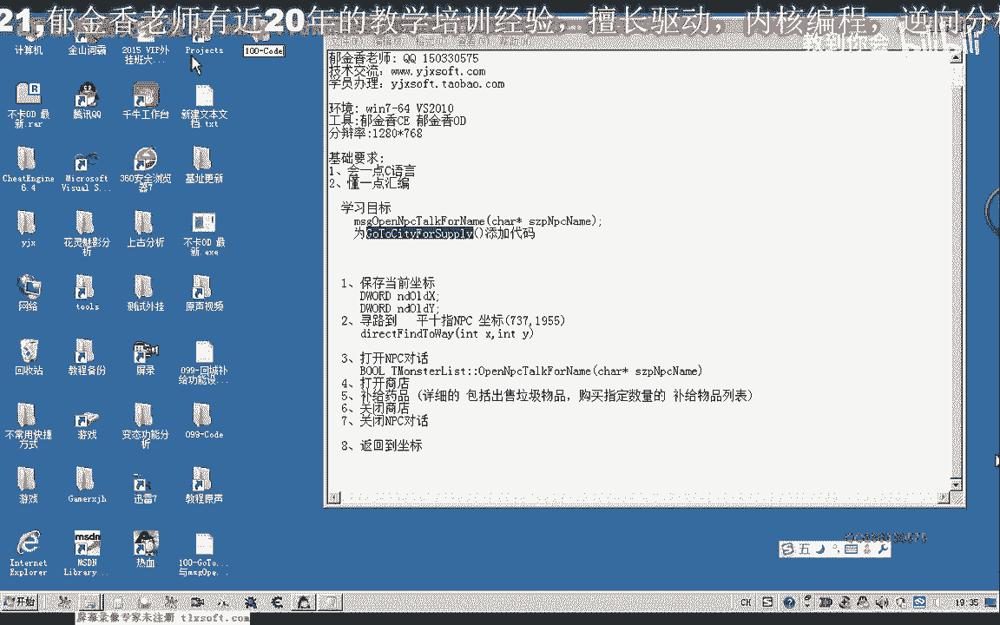
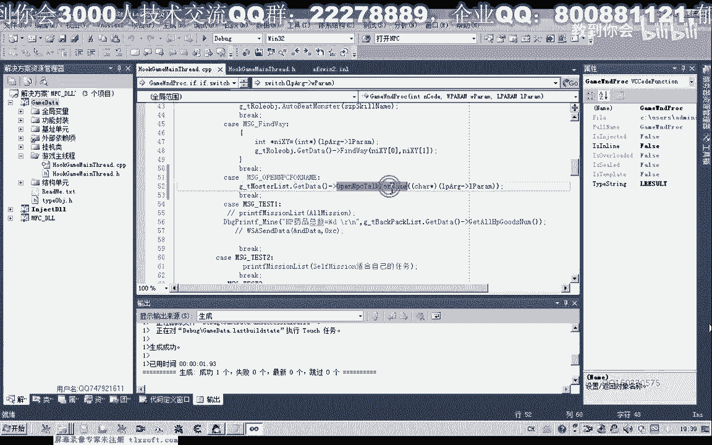
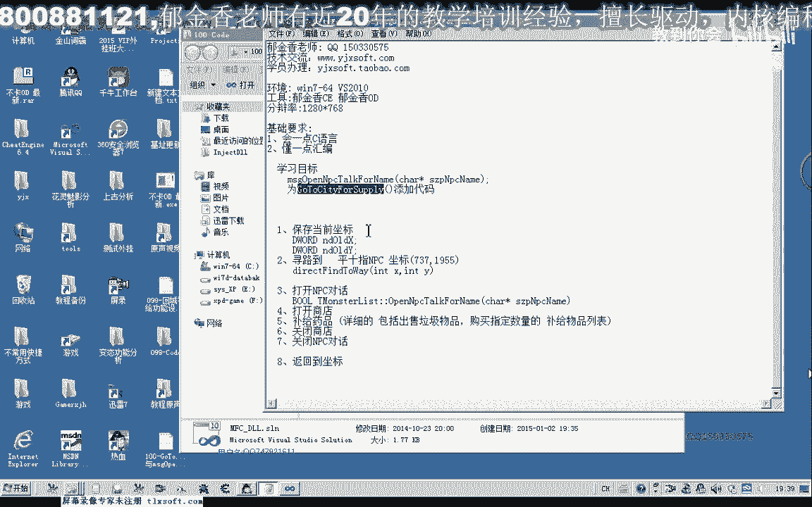
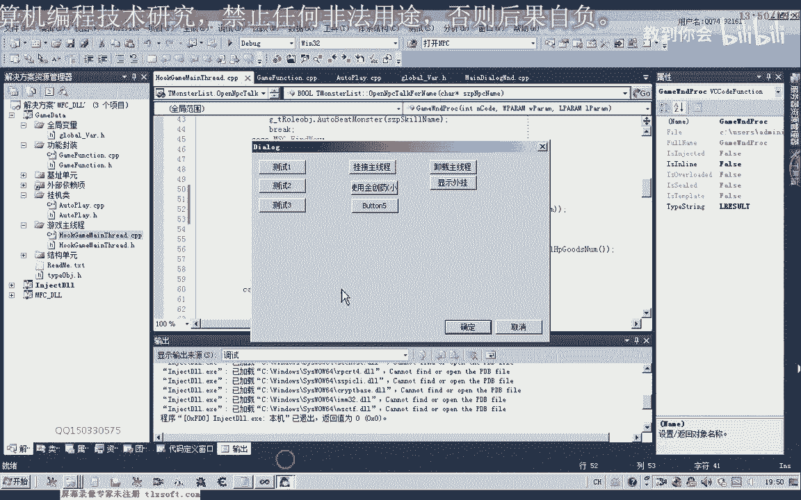
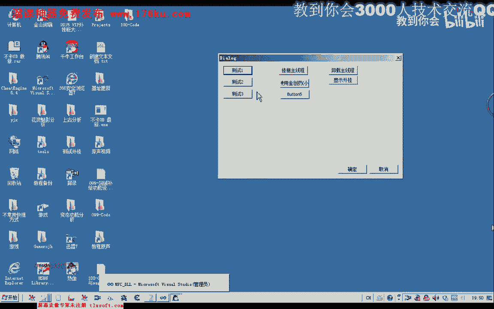

# 课程 P89：100-GoToCityForSupply与msgOpenNpcTalkForName 🛒➡️🏙️

在本节课中，我们将学习如何完善游戏辅助功能中的“回城补给”函数。我们将重点封装打开NPC对话的功能，并初步构建回城补给的逻辑流程。

---

## 封装打开NPC对话的函数

上一节我们回顾了基础代码，本节中我们来看看如何封装打开NPC对话的核心函数。

首先，切换到游戏的主线程单元，开始封装打开NPC的函数。需要定义相关参数和消息。

以下是封装步骤：

1.  复制前序课程的相关代码作为基础。
2.  函数只需传送一个参数：NPC的名字。需要传送该名字指针的地址。
3.  定义相关的消息宏。在寻路相关的消息定义之后，添加一条用于打开NPC对话的新消息。
4.  为与之前的消息区分，新消息的编号可以延续序列，例如使用123456。
5.  将新消息的类型改为打开NPC对话的特定类型。

接着，切换到主线程单元，处理新定义的消息。

以下是消息处理逻辑：

1.  调用怪物列表对象中相应的成员函数来打开NPC。
2.  首先对相关对象进行初始化。
3.  然后调用 `OpenNpc` 或 `OpenNpcForName` 函数。
4.  从消息参数中取出NPC的名字。
5.  将参数指针类型转换为字符指针类型。
6.  完成函数调用。

完成代码编写后，首先进行编译，确保没有语法错误。

## 完善回城补给函数

打开NPC对话的功能完成后，我们就可以开始完善回城补给函数的代码。

现在，移动到功能封装的单元。回城补给函数应当添加到挂机类中。

在挂机类的回调函数前，添加回城补给的代码。首先，将设计思路的注释复制到该位置。

以下是回城补给的核心步骤：

1.  **保存当前坐标**：记录角色回城前的坐标位置。坐标变量类型应使用浮点数（`float`）或有符号整数（`int`），以确保能表示负坐标。直接使用浮点类型效率更高。
2.  **执行寻路到城**：调用寻路函数，让角色移动到指定的城市坐标。这需要包含相应的头文件。
3.  **打开NPC对话**：角色到达NPC身边后，调用之前封装的函数打开NPC对话窗口。
4.  **进行补给操作**：此步骤涉及打开商店、购买物品等，将在下节课实现。
5.  **关闭NPC对话**：补给完成后，需要关闭NPC对话窗口。我们将在下节课封装此功能。
6.  **返回原坐标**：最后，使用保存的坐标，让角色寻路返回原来的位置。

代码初步完善后，再次进行编译。

## 功能测试与线程注意事项

现在，我们可以在挂机类中调用回城补给函数进行测试。

将回城补给的测试代码关联到测试按钮上。回城补给功能属于自动玩单元 `cg`，通过全局变量 `waterPlay` 对象来调用。

测试前，**必须**先将功能挂接到游戏的主线程。如果不这样做，测试代码中的循环（特别是寻路函数的循环判断）会卡住测试窗口所在的线程，导致界面无响应。这是因为测试按钮的代码运行在界面线程中。

如果将该函数放在自动打怪的回调函数中调用，则不会卡住界面，因为自动打怪运行在另一个独立的线程中。

重新注入游戏进行测试。先挂接到主线程，然后点击测试按钮。测试成功时，角色会跑到NPC身边并打开对话窗口。

---

本节课中我们一起学习了如何封装打开NPC对话的函数，并构建了回城补给功能的基本框架。我们实现了坐标保存、寻路进城和打开NPC对话的步骤，同时强调了多线程环境下调用函数的注意事项。下一节课，我们将继续完善打开商店、购买物品以及关闭NPC对话的功能。