# 课程P9：020-分析怪物对象属性 🔍

在本节课中，我们将学习如何修正上一节课中发现的怪物属性分析错误，并深入分析怪物对象的更多关键属性，例如对象类型和死亡状态。我们将通过对比数据、修改代码结构来完成这一过程。


---

## 修正怪物死亡状态分析

上一节我们分析了怪物列表和怪物对象的基本属性，但在测试代码时发现部分属性（如死亡状态）分析有误。


首先，我们需要打开调试工具并加载游戏进程。


这是上一节课分析的对象结构。在怪物列表中，下标为3的位置出现了玩家角色的名字，这表明对象列表中包含了玩家自身。

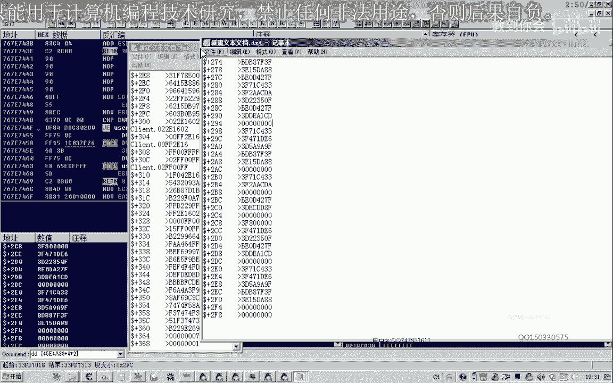

现在，我们使用相对地址表示，并复制一段数据出来进行比较。


同时，我们选择一个怪物对象（例如狂牛），也用相对地址表示并复制一段数据。


调整数据大小后，我们进行对比。


观察不同之处。偏移`+8`和`+C`的位置存在差异。对于怪物，`+8`处的值常为`0x21`，而玩家此处为`0x31`。`+C`处的值则是变动的编号。

这表明`+8`位置极有可能是对象的分类编号。

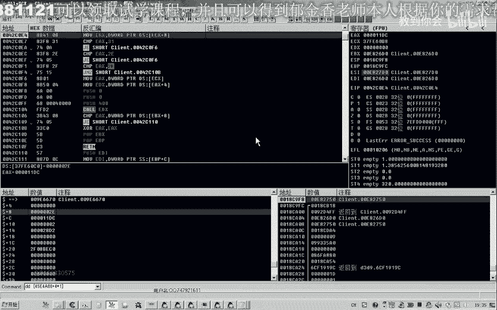


我们暂时记录：`+8`偏移处为**对象类型分类编号**。


---

## 分析玩家对象属性


在分析怪物属性的同时，我们也可以顺便解析玩家对象的部分属性。

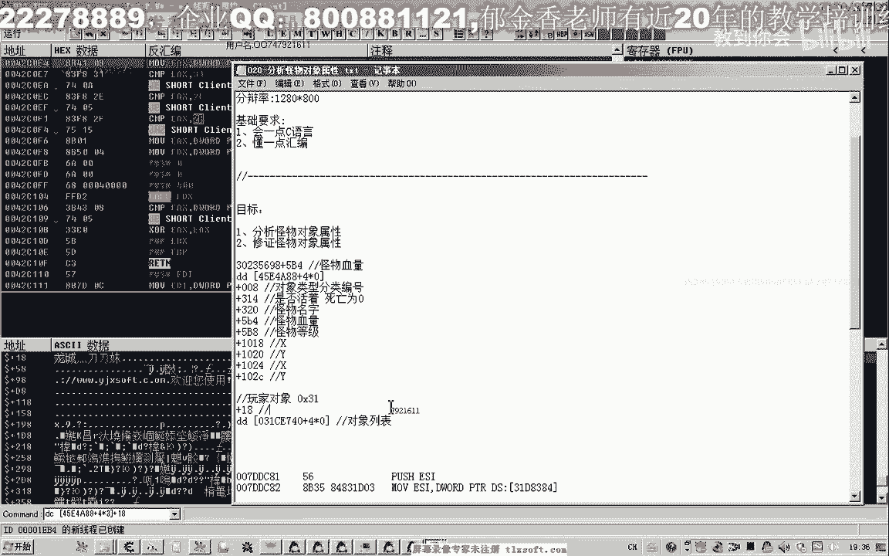

`+18`偏移处看起来是玩家名字的指针。


`+18`偏移处是**玩家对象的名字**。


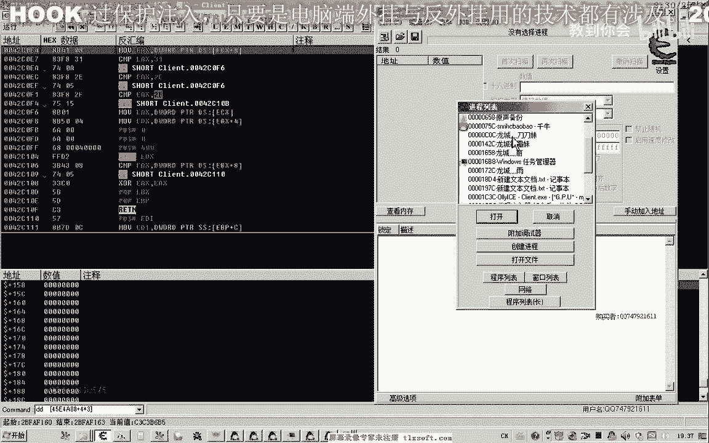

后面可能还有喊话内容等数据，目前用不到。其他如等级等属性，我们后续再分析。


---

## 确定怪物死亡状态

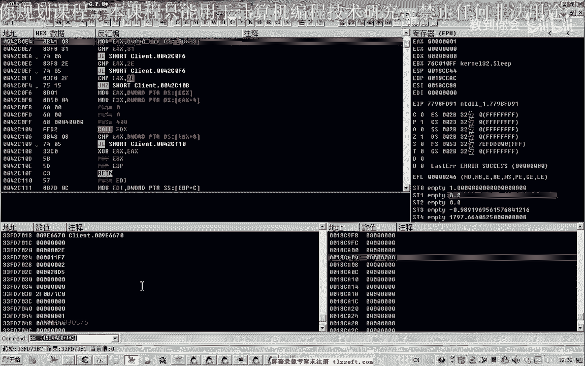

在制作自动打怪功能时，需要判断怪物是否死亡，以避免攻击已死亡的怪物。

首先，我们选中一个怪物并修改其名字，以便于追踪。


找到当前选中怪物的地址后，我们从偏移`+70`附近开始搜索其死亡状态。通常，状态值可能用`0`（死亡）和`1`（存活）表示。

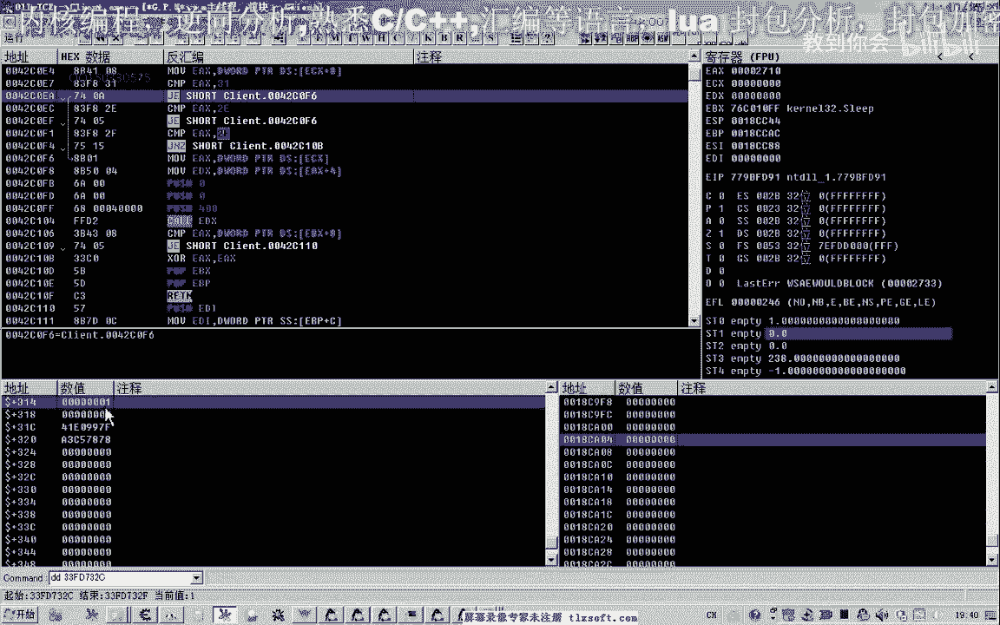

攻击该怪物使其死亡，观察数值变化。


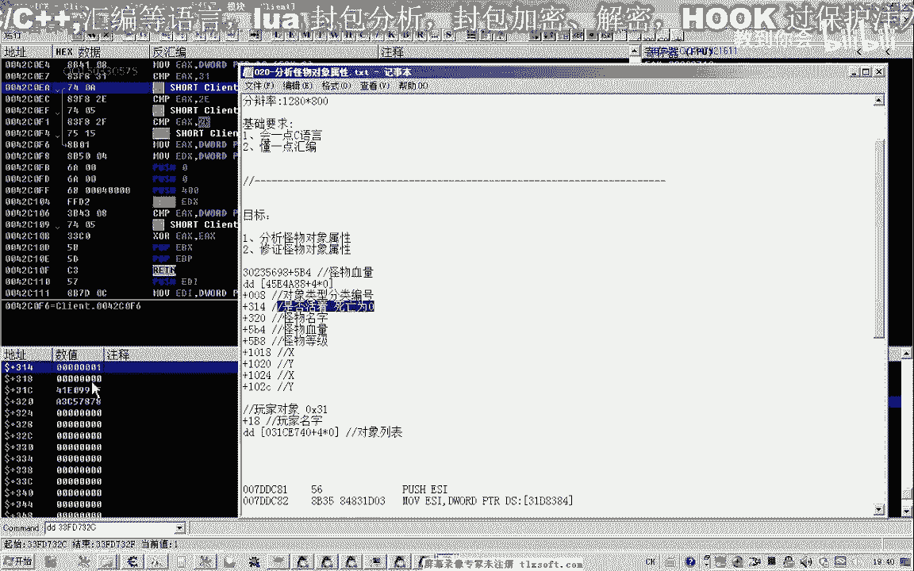

怪物刷新后，存活状态值恢复为`1`。


我们发现，之前分析的偏移`+314`处的值，实际上表示的是**是否被选中**或**是否显示血条**，而非死亡状态。


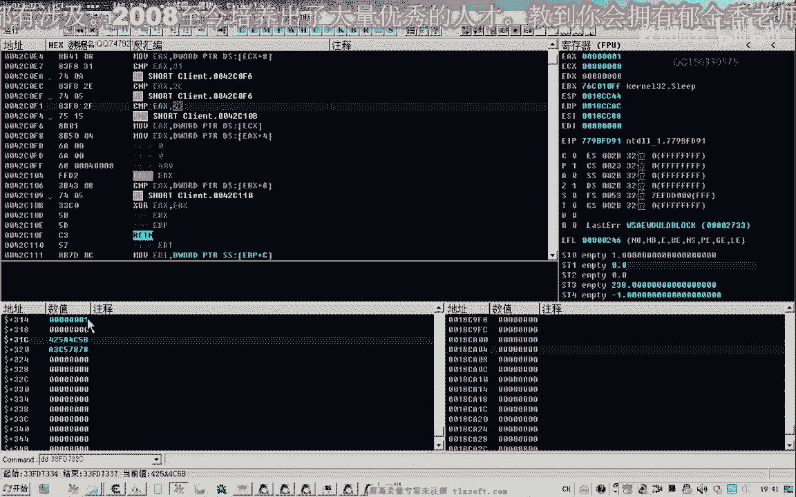


我们需要换一种方式搜索。搜索`0`和`1`，攻击怪物使其死亡，然后搜索变化的值。

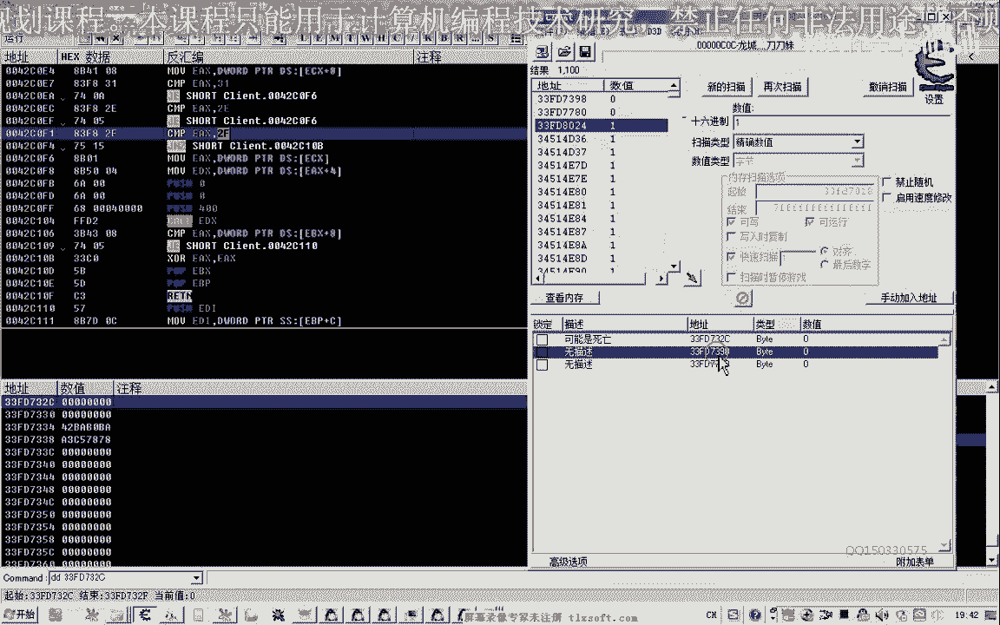


最终，我们定位到偏移`+398`处的值能准确反映死亡状态：死亡时为`1`，存活时为`0`。

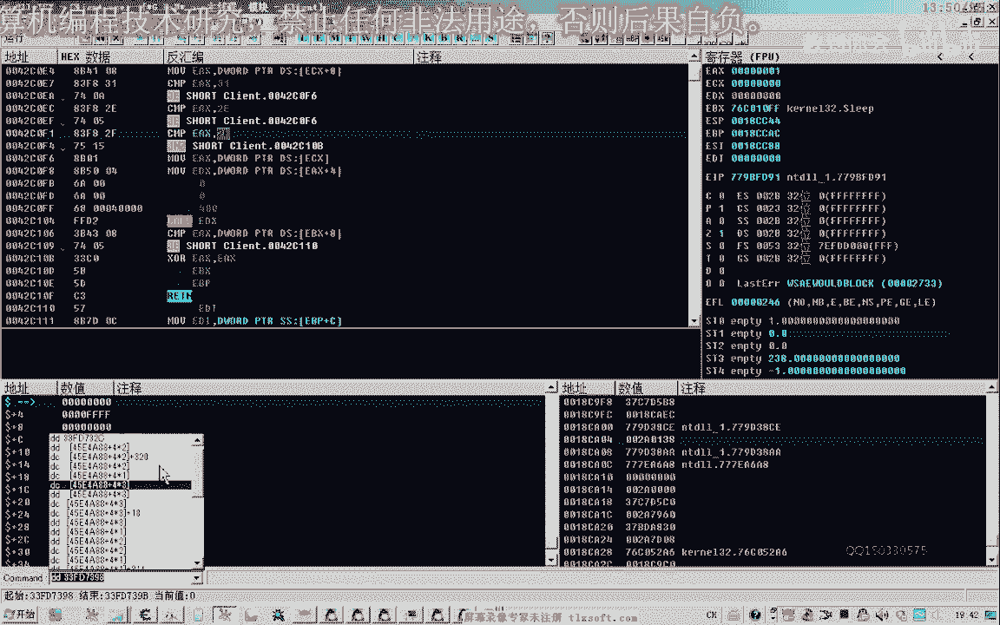


另一个偏移`+768`处也可能相关，但测试表明`+398`更稳定。

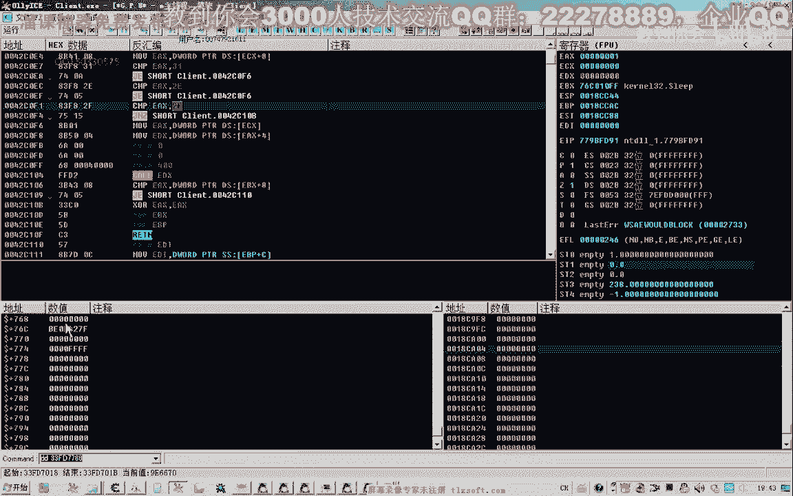


总结分析结果：
*   `+8`偏移：**对象分类编号**（怪物为`0x21`，玩家为`0x31`）。
*   `+398`偏移：**死亡状态**（1为死亡，0为存活）。

---

## 修改代码结构


根据以上分析，我们需要修改上一节课的代码结构。

打开上一课的代码，切换到结构体单元进行修改。

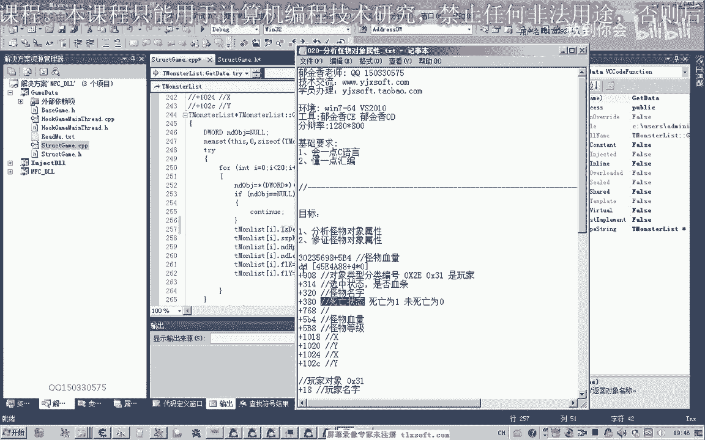


以下是需要修改的核心部分：

1.  在结构体中添加死亡状态属性，偏移为`+398`。
    ```c
    // 怪物对象结构体示例
    typedef struct {
        // ... 其他属性
        BYTE deathStatus; // 偏移 +0x398，1=死亡，0=存活
        // ... 其他属性
    } MonsterObject;
    ```

2.  在初始化代码中，为`+398`偏移赋值。
    

3.  在遍历怪物列表时，增加条件判断：仅当对象分类编号（`+8`偏移）等于`0x21`（怪物）时，才处理该对象。
    ```c
    if (pObject->typeClass == 0x21) { // 0x21 代表怪物
        // 处理怪物逻辑，如读取死亡状态、坐标等
        if (pObject->deathStatus == 1) {
            // 怪物已死亡，跳过攻击
        }
    }
    ```

4.  对象分类编号的偏移`+8`可以定义为宏，方便后续使用。
    ```c
    #define OFFSET_OBJECT_TYPE 0x8
    ```

进行这些修改后，重新编译并测试代码。


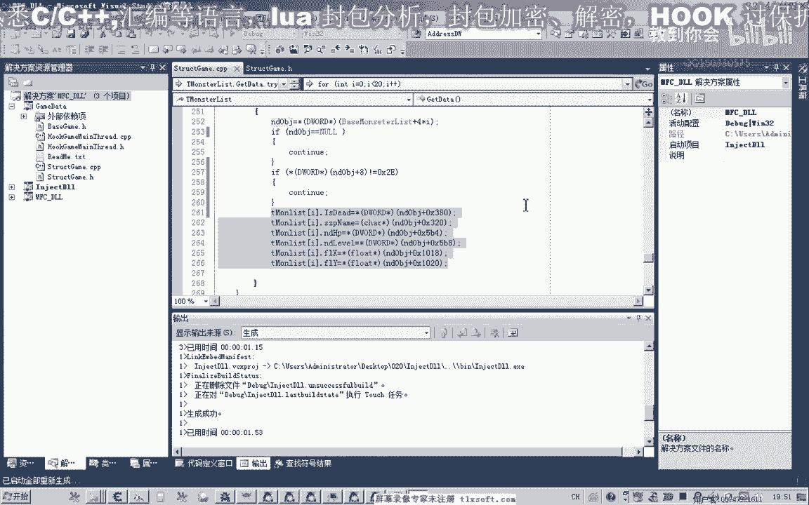

打开调试信息接收工具，查看输出。此时，消息应清晰显示怪物的坐标、等级、血量及死亡状态，且没有乱码。


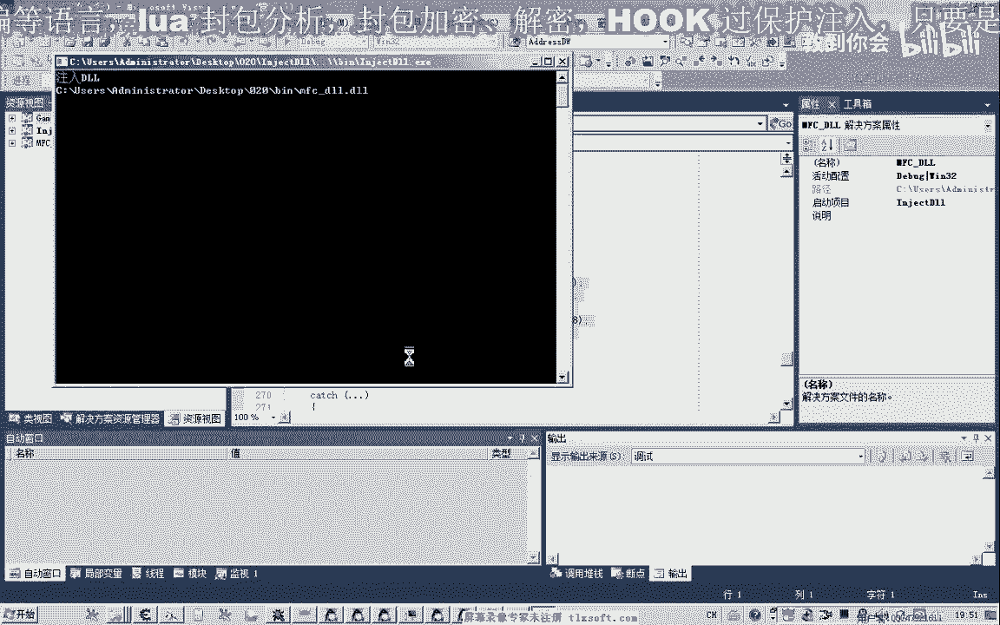


---

## 总结与下节预告

本节课中，我们一起学习了：

1.  **修正了分析错误**：明确了偏移`+314`处是选中/血条显示状态，而非死亡状态。
2.  **发现了关键属性**：
    *   `+8`偏移处的**对象类型分类编号**（`0x21`=怪物，`0x31`=玩家）。
    *   `+398`偏移处的**死亡状态**（`1`=死亡，`0`=存活）。
3.  **修改了代码结构**：在结构体中添加了新属性，并在逻辑中增加了对象类型判断，使代码更健壮。

通过本课的学习，我们完善了怪物对象属性的分析，为后续实现自动打怪等功能打下了基础。

下节课，我们将开始分析如何攻击怪物、使用技能以及选中怪物等交互逻辑。


