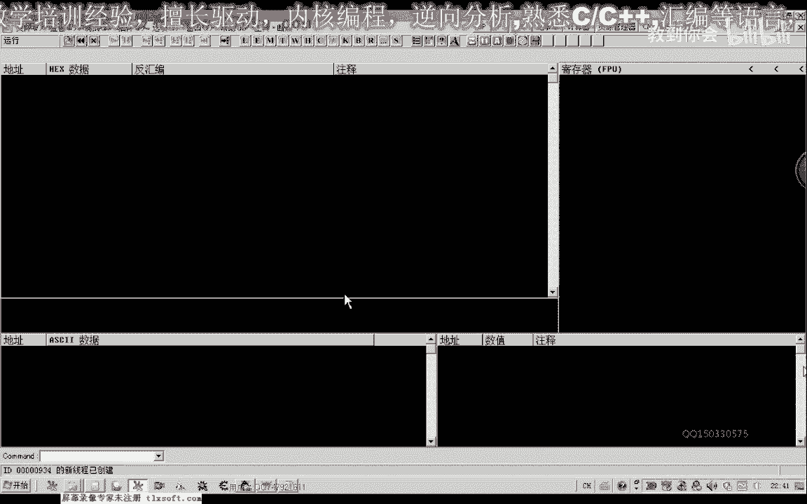
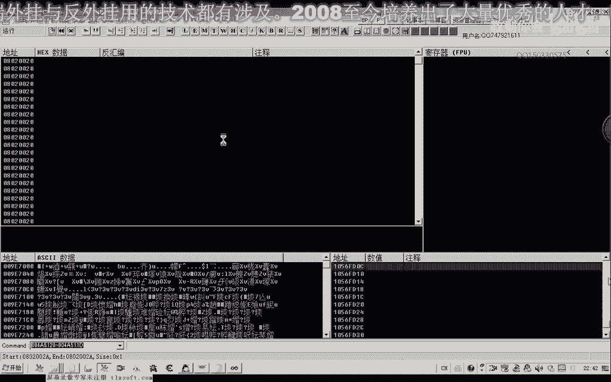
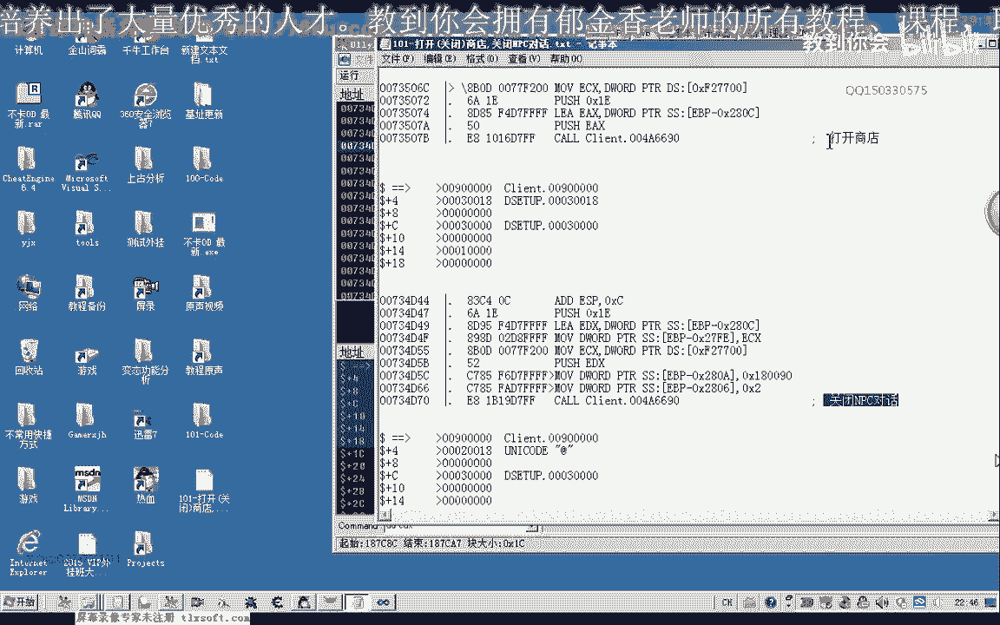
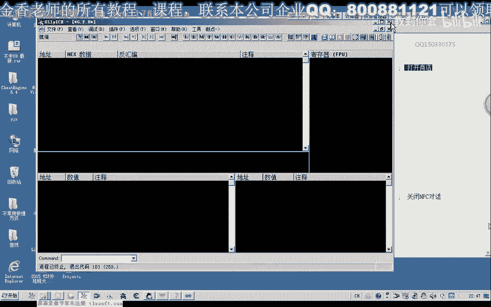
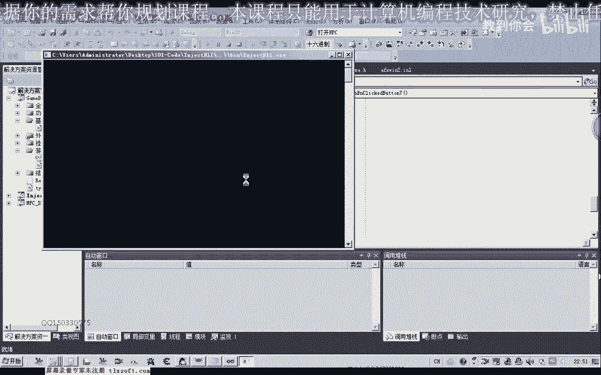
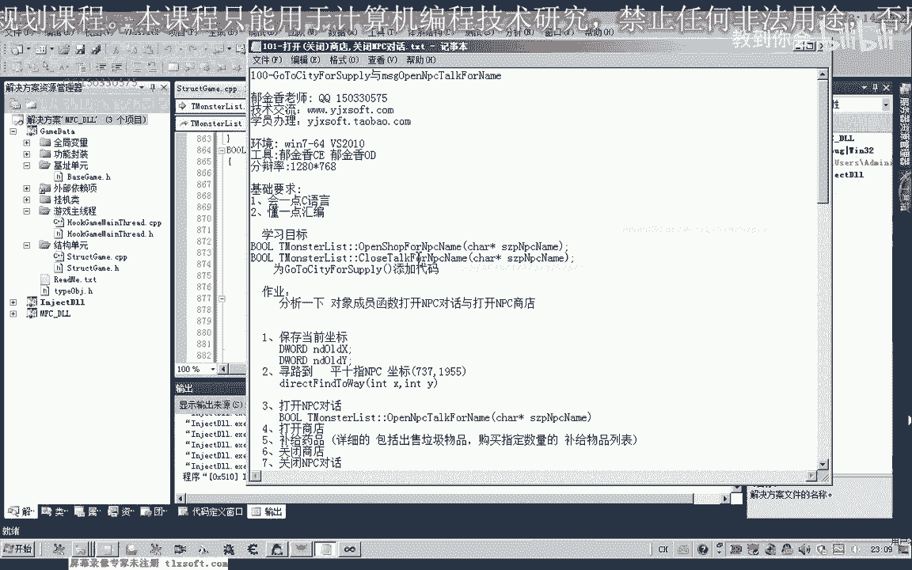

# 课程P90：101-打开/关闭商店与关闭NPC对话 🛒

在本节课中，我们将学习如何分析并实现游戏内打开商店、关闭商店以及关闭NPC对话的功能。我们将通过分析网络数据包，找到关键代码，并将这些功能封装成易于使用的函数。

---

## 分析打开商店功能

上一节我们介绍了课程目标，本节中我们来看看如何分析打开商店的功能。

首先，打开调试工具并附加到游戏进程。

通过之前的网络分析，我们知道打开NPC商店时需要向服务器发送特定数据包。发送数据包的函数在代码中有相应的机制。

我们转到发包函数所在的单元。这是最新的发包函数。

我们转到发包函数处，并在打开商店时下断点。先与NPC对话，准备打开买卖商店，然后在此处下断点，并切换回游戏。

此时未点击商店，断点未触发。现在点击打开商店，断点触发。在调用堆栈中按回车键，返回到发包的地址。

此处就是打开商店的代码。现在`EAX`寄存器指向数据缓冲区。数据较少时，可以直接用`DWORD`形式查看。

我们将缓冲区的参数提取出来。后面是大片的零，无需关注。有数据的前20个字节（十六进制0x14）是我们需要的。

以下是打开商店的分析结果，包括其缓冲区和相关代码。先让程序继续运行。

---

## 分析关闭NPC对话功能

上一节我们分析了打开商店，本节中我们来看看关闭功能。

同样在发包函数处下断点，但尝试关闭商店时断点未触发。接下来分析结束NPC对话。

在代码中查找关闭NPC对话的部分。此处是关闭NPC对话的代码。查看缓冲区，地址在`EDX`。

从这里看，前面一共12个字节（十六进制0x0C）。

这段数据就是关闭NPC对话的代码。我们将其复制出来。这里的参数也是赋给了`EAX`。

---

## 功能测试

接下来，我们对打开商店和关闭NPC对话进行测试。理论上，关闭NPC对话会自动关闭商店。

我们先退出调试分析。然后编辑相应代码进行测试。

在主线程单元中，`Txt3`部分有一个提交任务的数据发送缓冲区。我们可以在此基础上修改，只需将缓冲区设置得更大一些。

我们将缓冲区大小设为`0x868`。因为`DWORD`类型每个元素占4字节，除以4后大约为538，缓冲区足够大。但实际有用的只是前面一段数据。

我们将分析得到的数据移植到这个缓冲区中进行测试。首先注释掉原来的测试代码。

以下是测试步骤：

1.  将打开商店的缓冲区数据复制进去。参数是`1E`。
2.  在它的基础上，再修改出关闭NPC对话的缓冲区。这里只需改为`0C`，其他数据如`03`和后面的`00`只需少量修改。

接下来进行关联测试。编译这段代码，并设置调试目录。

挂接到主线程，然后进入游戏。先打开NPC对话，再打开商店。最后测试关闭NPC对话，主要观察它是否能关闭商店。测试成功，说明我们的数据是正确的。

---

## 封装功能函数

测试成功之后，我们将其封装成函数形式。

回到主线程单元。因为不同的NPC，其打开对话的代码可能有所区别，所以关闭NPC的代码需要与NPC名字关联。

我们先封装打开商店的函数。打开商店的代码可以单独成函数，也可以关联到外部列表。理论上通过对象的成员函数操作也能实现相同目的。

我们添加相应代码。当时打开NPC对话时，调用了NPC对象`+4`位置的函数。关闭NPC时可能也会调用此函数，但本节课暂不深入分析。我们先对已分析好的数据进行封装测试。

接着封装关闭NPC对话的函数。可以在上面代码的基础上修改。

编译生成。这里还需要定义相应的局部变量。

生成成功后，在主线程单元中进行代码封装。我们先定义这两个函数：一个是打开商店，一个是关闭NPC对话。

同时定义两个可调用的接口：一个是关闭商店（通过NPC名字），另一个是打开NPC对话。我们在其基础上进行修改。

然后转到主线程单元，添加对这两个消息的响应。这里应该是关闭NPC。转到NPC的定义处。

在调用相应函数的地方，参数都是NPC的名字。我们在原有代码基础上修改。

再次测试时，调用新定义的这两个函数进行测试：打开NPC、打开商店、关闭商店。这三个函数再进行相应测试。

目前，NPC的名字参数尚未被实际利用。这是为后续预留接口。如果后续仍通过发送数据包方式实现NPC打开，可以建立一个结构，根据不同的NPC名字判断并填充不同的缓冲区数据。具体实现将在后续课程中完成。

我们再次进行相关测试，重新编译并挂接到主线程。然后依次执行：打开NPC、打开商店、关闭NPC对话。

至此，我们只差卖出商品和买入所需物品这两个步骤。关闭商店和关闭NPC对话是同一过程，关闭NPC对话时就关闭了商店。

基本上所需功能已经完成。出售物品和购买物品时还需要一个循环过程。

---

## 课后作业与总结

本节课中我们一起学习了如何分析并封装打开/关闭商店以及关闭NPC对话的功能。

布置一个作业：大家可以尝试分析，不通过发送封包的形式，而是通过调用对象内部成员函数的形式，看能否实现对话的关闭以及商店的打开。这只是一种尝试，不一定成功，但有很大可能性可以通过向成员函数传递不同参数来实现。如果这种方式可行，封装函数会更加方便，代码量也会更少。

还有一个任务：将今天相关的代码添加到自动挂机逻辑中。这可以在挂机单元中完成。在设计时，可以在执行前加上条件判断，如果条件不成立则直接返回，后面就不执行。这样，在挂机逻辑中直接调用函数即可，函数内部会自动进行条件检测。

我们下节课再见。本节课就讨论到这里。