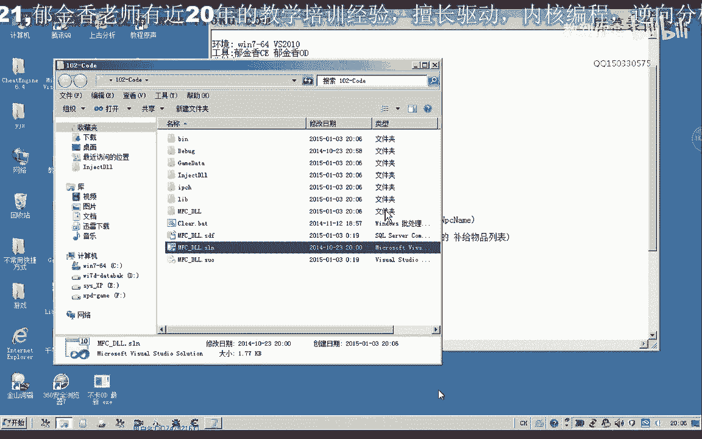
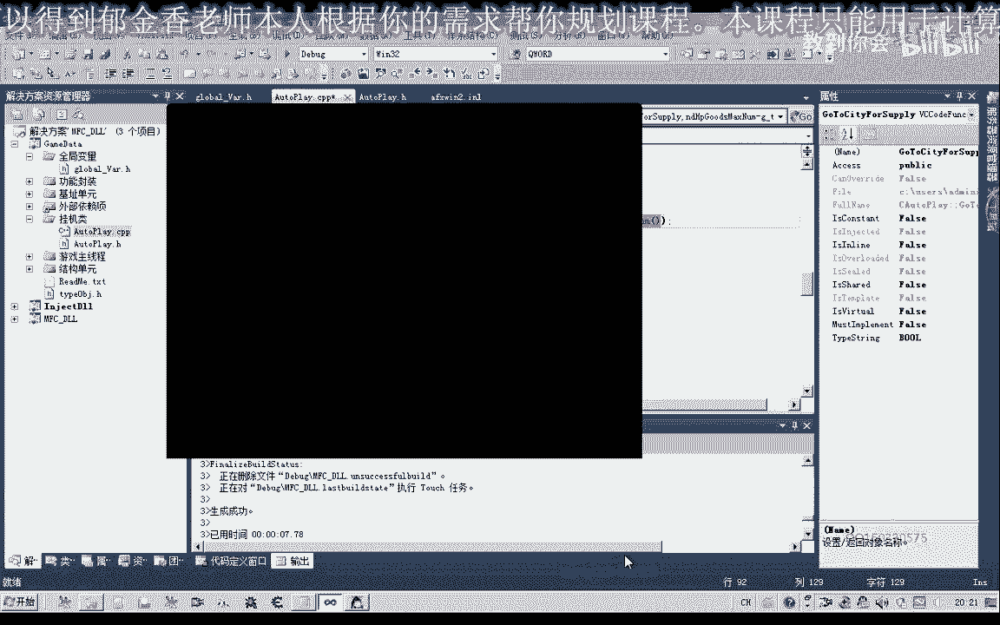
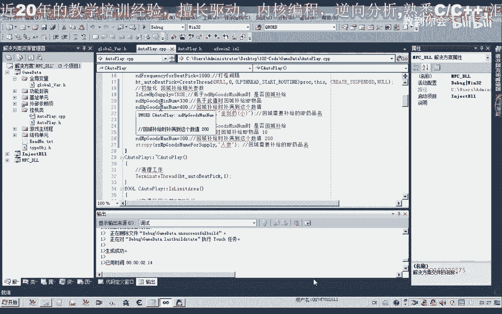
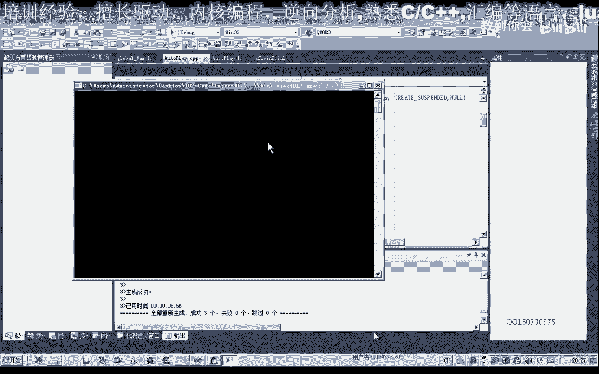

# 课程 P91：102-完善回城补给功能 GoToCityForSupply 🛒



在本节课中，我们将继续完善自动挂机系统中的“回城补给”功能。我们将重点实现根据药品数量判断是否需要补给、计算购买数量、执行购买流程以及返回挂机点等逻辑。

---

## 概述

上一节我们完成了打开商店的功能。本节中，我们将在此基础上，实现完整的回城补给流程。这包括判断补给条件、计算购买数量、执行购买、关闭商店窗口以及返回原坐标。

---


## 完善回城补给函数


首先，我们打开第101课的代码，并定位到挂机类中的回城补给函数 `GoToCityForSupply`。

以下是实现该功能的核心步骤：

1.  **判断补给条件**：检查当前HP药品数量是否低于预设的最低保有量。
2.  **计算购买数量**：如果需要补给，则计算需要购买的数量（目标保有量减去当前数量）。
3.  **执行购买**：调用之前封装的打开商店和购买物品函数。
4.  **关闭界面**：购买完成后，关闭商店和NPC对话窗口。
5.  **返回挂机点**：使用寻路功能，让角色返回之前的坐标点。

以下是关键代码逻辑的实现：

```cpp
void HangUpClass::GoToCityForSupply()
{
    // 1. 判断是否需要补给
    if (!NeedSupply())
    {
        return; // 条件不满足，直接返回
    }

    // 2. 计算需要购买的药品数量
    int currentHPItemCount = GetCurrentHPItemCount(); // 获取当前HP药品总量
    int supplyCount = m_maxHPItemCount - currentHPItemCount; // 计算差值

    // 3. 执行回城、打开商店、购买物品
    GoToCity();
    Sleep(500); // 等待动作响应
    OpenShop();
    Sleep(500);
    BuyItem(m_hpItemName, supplyCount); // 传入药品名称和需要购买的数量

    // 4. 关闭商店/NPC窗口
    CloseShop();
    Sleep(100); // 短暂延迟确保窗口关闭

    // 5. 返回原挂机坐标
    ReturnToOriginalPosition();
}
```

---

## 补给条件判断函数

我们需要一个函数来判断当前是否达到了需要回城补给的条件。

以下是 `NeedSupply` 函数的一个简单实现示例：

```cpp
bool HangUpClass::NeedSupply()
{
    // 获取当前身上指定HP药品的总数量
    int currentCount = GetItemCount(m_hpItemName);

    // 判断当前数量是否低于要求的最低保有量
    // 如果低于，则需要补给
    if (currentCount < m_minHPItemCount)
    {
        return true;
    }
    return false;
}
```


**公式说明**：
补给条件可以表示为：
**当前药品数量 < 预设最低保有量**
当此条件为真时，触发回城补给流程。



---

## 参数初始化与测试

为了使功能正常运行，我们需要在类的构造函数中初始化相关变量。

以下是需要初始化的成员变量示例：

```cpp
HangUpClass::HangUpClass()
{
    // 回城补给相关参数初始化
    m_minHPItemCount = 330;  // 当药品低于330个时，触发补给
    m_maxHPItemCount = 400;  // 补给后，药品持有量目标为400个
    m_hpItemName = "金创药(小)"; // 要补给的药品名称
    // ... 其他初始化代码
}
```

在测试时，可以暂时调整 `m_minHPItemCount` 的值（例如设为比当前数量稍高的值），以便快速触发补给逻辑进行功能验证。



---



## 集成到自动挂机循环

最后，我们需要将回城补给判断集成到主挂机循环中。

在挂机的主逻辑函数（例如一个循环或定时器回调）中，定期调用条件判断：


```cpp
void HangUpClass::MainHangUpLoop()
{
    while (m_isHangingUp)
    {
        // 1. 判断是否需要进行回城补给
        if (NeedSupply())
        {
            GoToCityForSupply();
            // 补给完成后，继续挂机循环
            continue;
        }

        // 2. 正常的打怪逻辑
        AttackMonster();
        // ... 其他挂机操作

        Sleep(100); // 短暂休眠，防止CPU占用过高
    }
}
```

---


## 调试与问题处理

在测试过程中，可能会遇到寻路被卡住、条件判断不准等问题。以下是常见的解决思路：

1.  **添加调试信息**：在关键步骤（如寻路开始、购买完成、返回时）输出日志，方便追踪执行流程。
2.  **调整延迟时间**：适当增加 `Sleep` 的等待时间，确保游戏客户端有足够时间响应操作。
3.  **处理寻路超时**：为寻路过程设置超时机制。如果超过一定时间（如30秒）仍未到达目标点，则判定为寻路失败，执行备用逻辑（如记录日志或尝试重新寻路）。
4.  **确保坐标正确**：仔细检查返回的坐标值是否正确，并确认游戏内该坐标点是否可达。

---

## 总结

本节课中，我们一起学习了如何完善自动挂机系统的回城补给功能。我们实现了从条件判断、数量计算、购买执行到返回原地的完整闭环。通过将这部分逻辑集成到主挂机循环，我们的脚本现在具备了基本的自我补给能力，能够更长时间地自动运行。


需要注意的是，在实际应用中，还需要考虑网络延迟、游戏环境变化（如被其他玩家阻挡）等因素，并增加更多的异常处理和容错机制，才能使功能更加稳定可靠。我们将在后续课程中继续对这些细节进行优化。