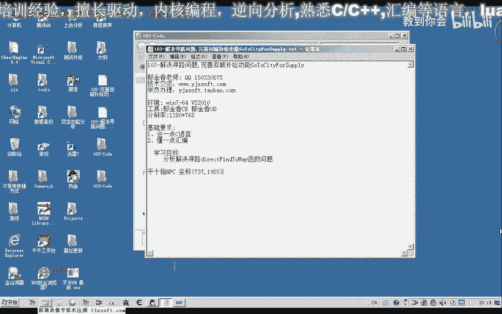
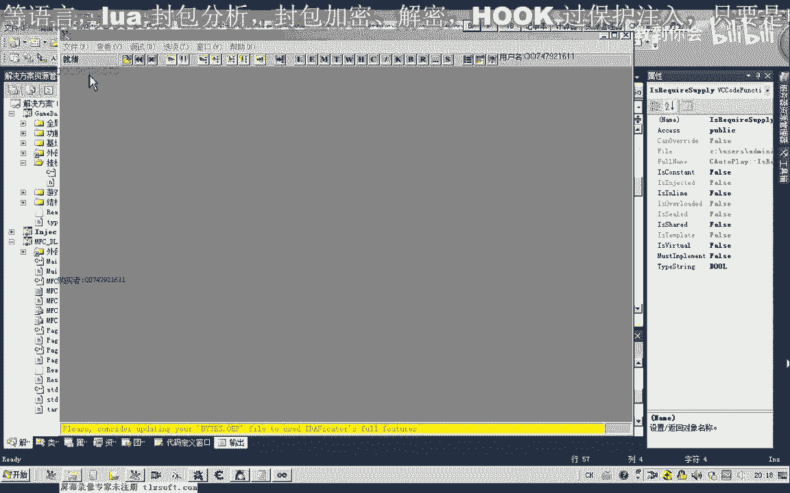
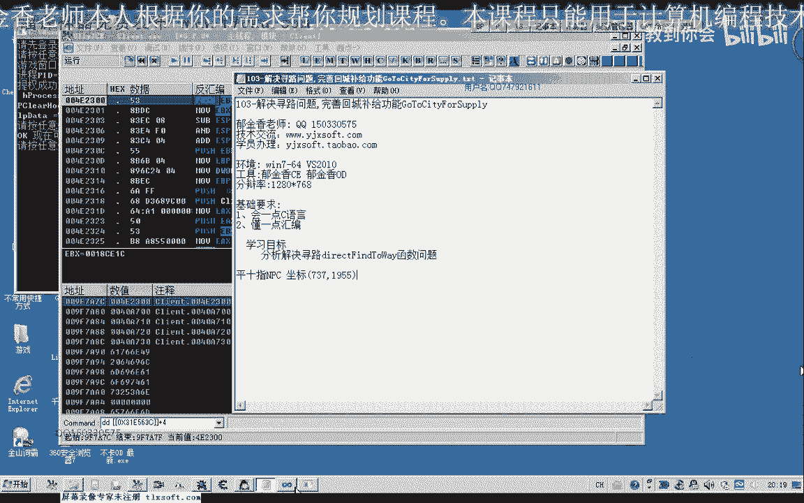
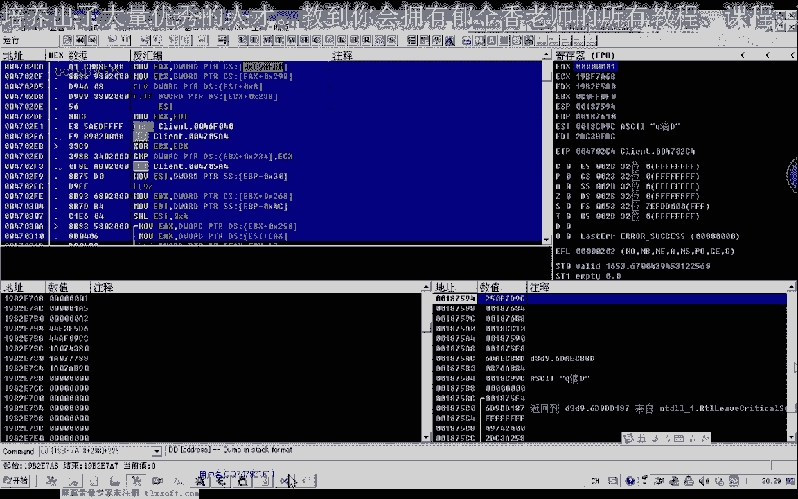
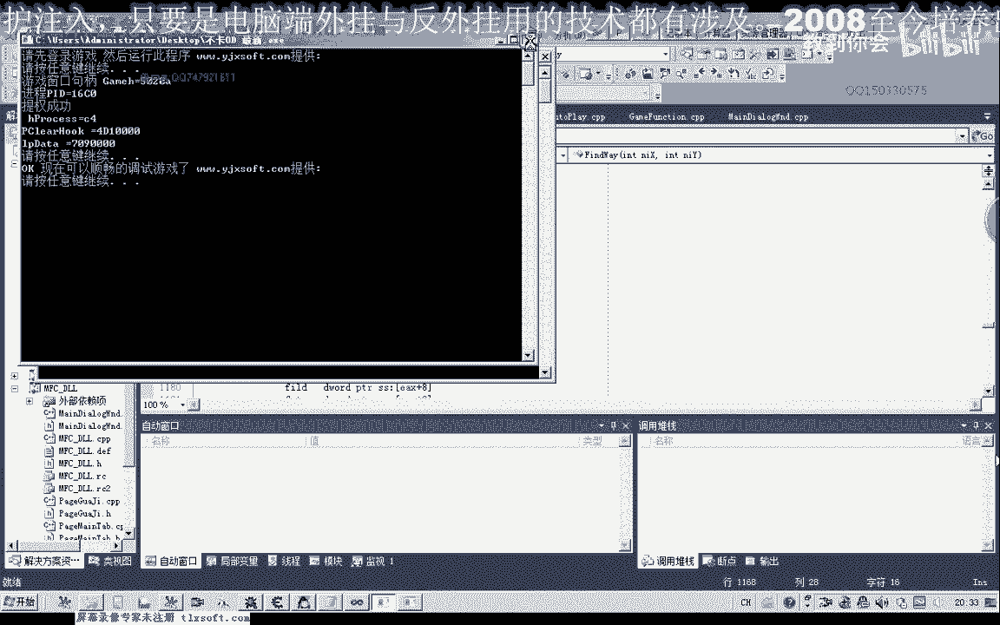
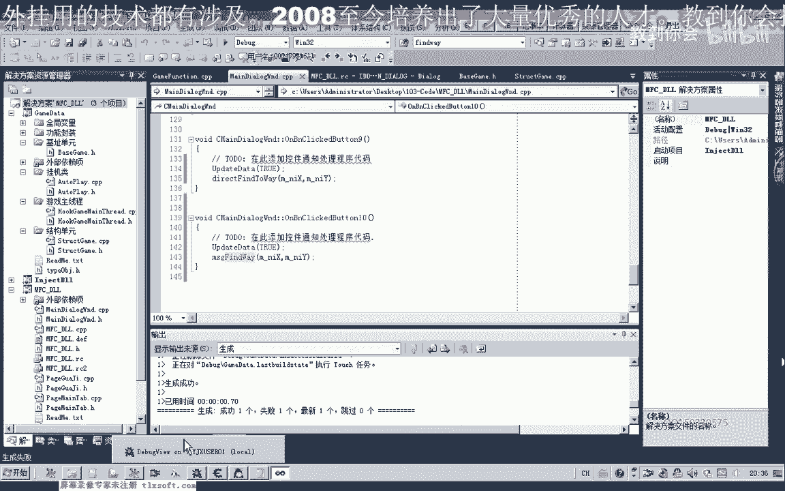
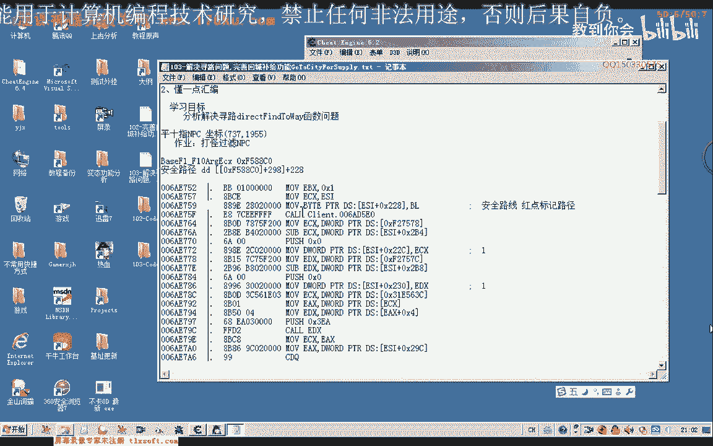

# 课程P92：103-解决寻路问题，完善回城补给功能GoToCityForSupply 🧭

在本节课中，我们将要学习如何诊断和修复寻路函数的问题，并完善自动回城补给的功能。我们将通过分析代码、调试测试以及修改逻辑，确保角色能够正确寻路并完成补给。

---

## 概述



上一节我们测试了回城补给函数 `GoToCityForSupply`，发现它无法到达目的地。本节中，我们来看看问题出在哪里，并着手修复寻路功能。

---

## 测试寻路函数

首先，我们打开第102课的代码，单独测试寻路相关的函数。我们在测试窗口上添加一个按钮和两个坐标输入框，用于验证寻路功能。

以下是测试按钮的点击事件代码：



```cpp
// 假设变量定义
float targetX, targetY;
// 从UI控件更新目标坐标
targetX = GetFloatFromEditControl("editTargetX");
targetY = GetFloatFromEditControl("editTargetY");


// 调用寻路函数
bool result = PathFindTo(targetX, targetY);


// 输出调试信息
float distance = CalculateDistance(GetCurrentX(), GetCurrentY(), targetX, targetY);
DebugPrint("寻路结果: %d, 当前距离: %f, 目标坐标: (%f, %f)", result, distance, targetX, targetY);
```



编译并运行后，我们观察调试信息。初始测试显示寻路成功，角色移动到了指定坐标。

---

## 发现寻路卡住问题

然而，当角色移动到某些特定位置时，寻路会被卡住。调试信息显示距离不再减少，程序陷入循环。

通过观察游戏画面，我们发现角色被障碍物阻挡。寻路算法在遇到无法绕过的障碍时，会持续尝试，导致循环超时（默认60秒）。

---

## 分析并显示寻路路径

为了更直观地分析问题，我们尝试在小地图上显示寻路路径（红色标记点）。通过逆向分析，我们找到了控制路径显示的代码位置。


关键的内存写入指令如下：


```assembly
; 示例汇编代码，标记路径显示
mov byte ptr [esi+0x228], 0x01
```

这段代码将特定内存地址的值设为1，从而激活小地图上的路径显示。我们通过修改此值（例如设为0）验证了其功能：路径显示消失。

因此，我们确定此机制用于控制寻路路径的可视化。

---

## 定位路径标记的内存来源

我们需要找到 `esi` 寄存器中地址的来源，以便在我们的代码中控制路径显示。通过回溯调用栈和分析数据流，我们发现该地址来源于一个全局的游戏对象管理结构。



最终，我们找到了一个相对稳定的基址偏移：

```
基址: 0x00F8840
偏移: +0x298
```




通过访问 `[基址 + 0x298]` 可以获得控制路径显示的关键指针。我们在寻路函数调用前，手动向该地址写入1，以启用路径显示。

```cpp
// 启用小地图路径显示
*(BYTE*)(*(DWORD*)(0x00F8840) + 0x298) = 0x01;
```

---

## 解决循环调用导致的卡顿

测试发现，在循环中频繁调用寻路函数 `PathFindTo` 容易导致角色在复杂地形卡住。一个解决方案是减少调用频率，或者只调用一次并依赖游戏内部的寻路AI完成剩余路径。




我们修改了 `GoToCityForSupply` 函数中的逻辑：

1.  在开始寻路前，只调用一次 `PathFindTo`。
2.  不再在循环中反复调用，而是等待角色移动或通过距离判断是否到达。

```cpp
// 修改后的寻路逻辑片段
void GoToCityForSupply() {
    // 1. 停止当前所有动作（如打怪）
    StopAllActions();

    // 2. 启用路径显示
    EnablePathDisplay();

    // 3. 单次调用寻路到目标坐标
    PathFindTo(targetX, targetY);

    // 4. 等待到达或超时
    WaitForArrivalOrTimeout(30000); // 等待30秒
}
```

---

## 完善回城补给功能

在测试回城补给时，我们发现两个新问题：

1.  **坐标传递错误**：传入 `PathFindTo` 的目标坐标不正确，导致角色走向错误位置。
2.  **NPC误判为怪物**：在寻路过程中，如果靠近NPC，自动战斗逻辑可能将其选中为攻击目标。

对于第一个问题，我们检查并修正了补给函数中目标坐标的赋值。对于第二个问题，我们需要在自动战斗逻辑中增加NPC过滤。

在开始补给前，必须清除当前选中的目标：

```cpp
// 在补给函数开始时，清除选中目标
ClearSelectedTarget();
```

同时，在自动战斗的选怪逻辑中，需要排除NPC类型的对象：

```cpp
// 修改后的选怪逻辑，需判断对象类型
GameObject* target = FindNearestMonster();
if (target != nullptr && target->type != OBJECT_TYPE_NPC) {
    SelectTarget(target);
}
```

---

## 测试与验证

完成上述修改后，我们重新编译并进行测试。

1.  角色在药品不足时，成功触发回城补给逻辑。
2.  寻路过程顺畅，小地图正确显示路径。
3.  角色能够到达补给NPC处，完成购买后返回挂机点。
4.  自动战斗逻辑不再攻击NPC。

测试结果表明，寻路卡住问题和补给功能的主要缺陷已得到解决。

---

## 总结

本节课中我们一起学习了如何诊断寻路函数的问题，通过逆向分析找到了控制路径显示的机制，并修正了寻路逻辑以减少卡顿。同时，我们完善了回城补给功能，解决了坐标错误和NPC误攻击的问题。

关键点总结：
*   **寻路调试**：通过输出距离和坐标信息定位问题。
*   **路径显示**：通过内存写入 `*(BYTE*)(*(DWORD*)(0x00F8840) + 0x298) = 0x01` 控制小地图路径。
*   **逻辑优化**：将循环寻路改为单次调用，避免卡死。
*   **功能完善**：在补给前清除目标，在战斗逻辑中过滤NPC。



下节课，我们将进一步优化自动战斗系统，确保其稳定性和效率。