# P93：104-打怪过滤NPC - 教到你会 - BV1DS4y1n7qF

大家好，我是预期香老师，那么这一节课我们主要是分析出npc与怪物的区别啊，那么如果不能够分清n p c或与这个怪物的区别的话，那么我们在怪物的周围有这个n p c的时候，那么如果去攻击这个npc的话。

那么我们的呃这个辅助呢就不能够正常的工作，就会卡在这里好的，那么这节课呢我们嗯主要是先分析一下他们的区别，然后呢再去改动一下哈，自动选怪的啊，这这个函数在里边呢我们加上一个n p c的一个判断。

那么如果是npc的话，我们就要跳过它好的，那么我们打开o d请附加到游戏里面。

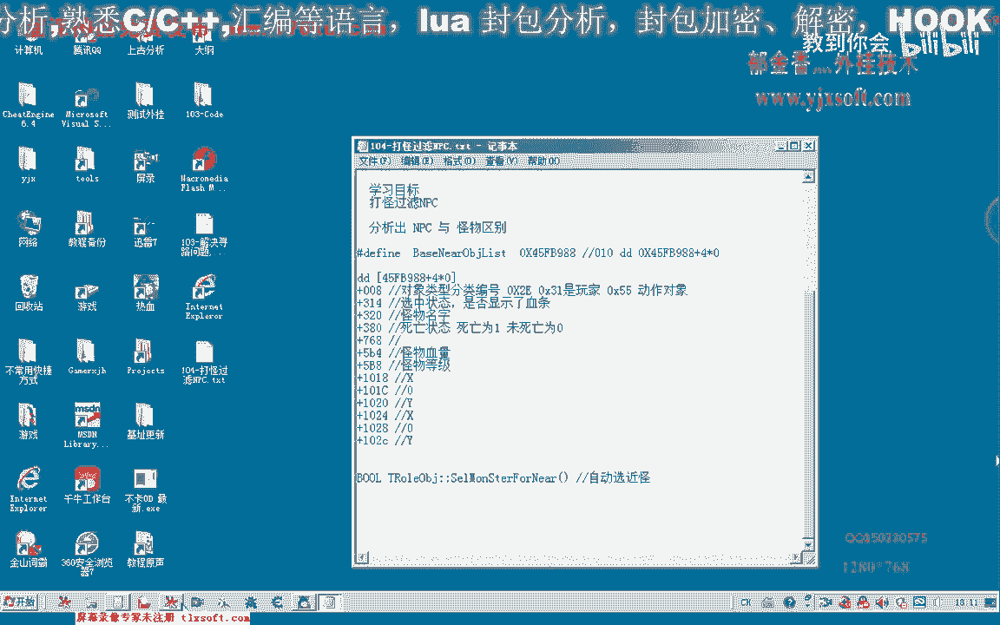

嗯，嗯那么然后呢。

我们，那么这是最新的哈这个公司啊，我们附近对象的这个公式包括了玩家npc以及怪物。

那么还有我们掉落在地上的物品，那么都在这个列表里面，那么这个的话加零八这个位置呢是三幺啊，表示的是玩家，那么我们再来看一下第二个，那么我们先找一个怪物，那么这个是怪物，那么我们看一下怪物的名字是多少。

这个是n p c啊，实际上呃我们是在城里边啊，这个是n p c，那么我们看一下n p c的过项属性里边嗯，先看一下呃，768这个位置现在不知道啊，我们先看一下怪物的血量，还有没有，零比四这句。

那么它的血量呢这个时候我们看到他的血量的话是32000比较大啊，但是这个时候呢它并不能够作为一个区分我们啊怪物与pc的一个区分。

那么我们再来看一下怪物等级。

这里，那么我们发现了这个地方呢怪物的等级来为零为零，那么我们再来看一下其他的地方，那么我们再来看一下，好那我们再来看一下呃，首先来看一下它的路径，这个呢也是一个怪物，那么我们来看一下怪物类型的。

那么我们来看一下它的名字，那么这也这也是一个npc的名字，那么我们来看一下它的血量和等级，那么这是它的血量也是比较大啊，3200，那么五比八这个位置，那么这个地方应该是它的等级啊，呃等级呢那是文明啊。

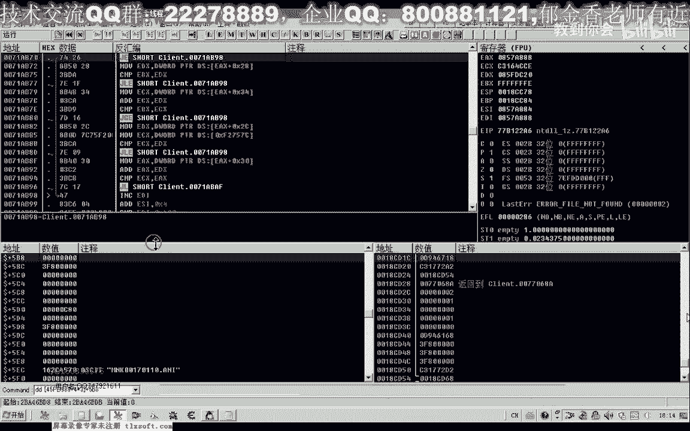

那么这里的话就可以做一个与我们呃怪物区分的一个偏移，那么怪怪物的等级的话肯定是大于零的，嗯n p c等于几呢，那么是等于零，嗯那么也也有可能这个偏移呢它已经发生了变化，这个呃我们这个对象的等级。

那么我们再跑到有怪物的地方来查看一下。

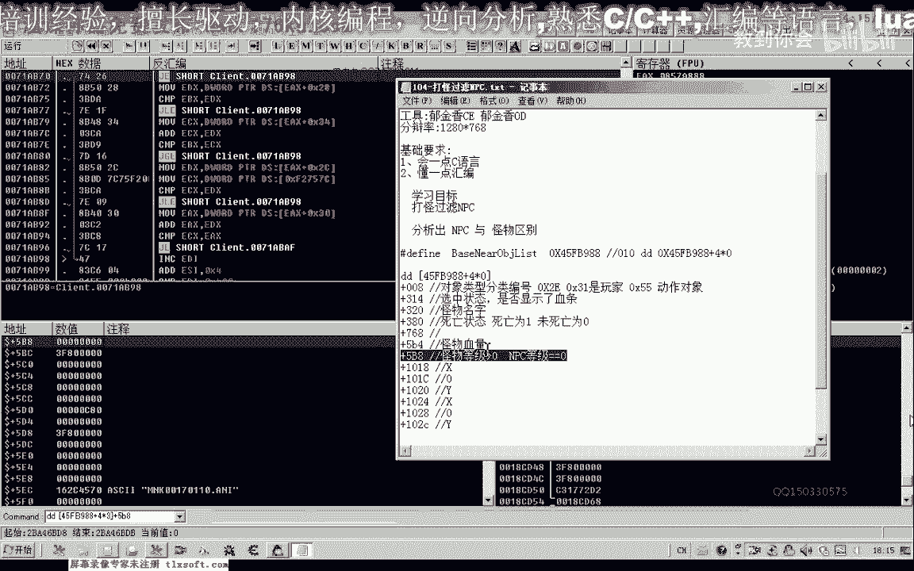

那么我们去这个被挖过的菜田，这里，好那么这里呢有一些野猪和这个黄牛，那么我们再来看一下这个地方的啊，怪物那么同样的，但是这个地方呢它怪物呢已经发生了变化啊，这个地方的话我们看一下320这个位置啊。

那么这个是野猪，那么我们再来看5。4，五比四，这里是他的血量是160，那么它的等级是12级，也就那么我们发现的话。

这个怪物等级的偏移呢，它是没有变化的，同样的视频平方，那么np设备等级的四零，那么通过这一点的话。

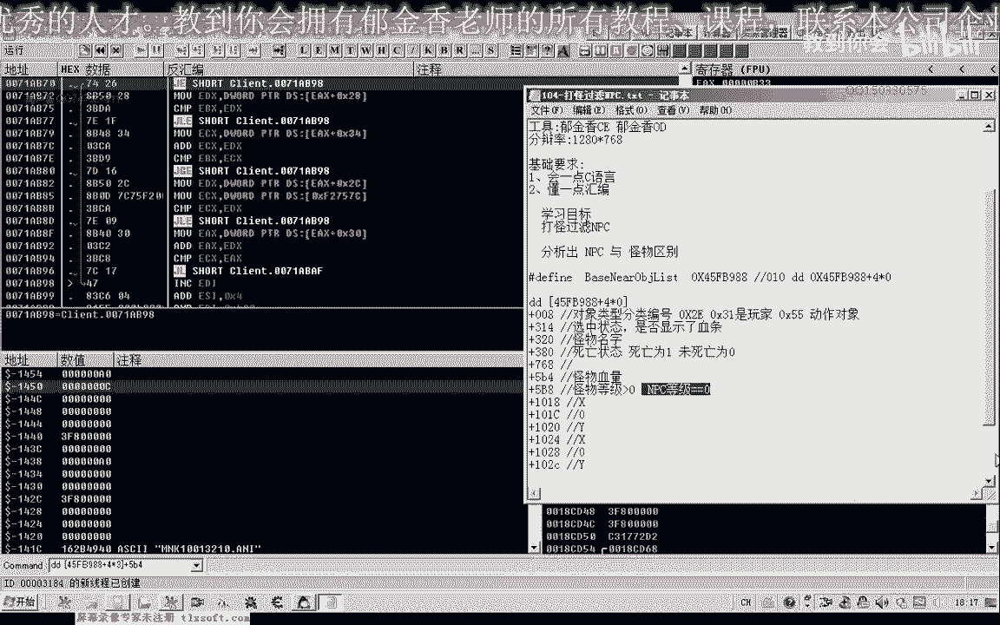

我们就可以做一个判断哈，那么如果怪物等级为零的话，我们就不选择他，他那么不选择他的话，那么最终呢它也不会攻击他，好的，我们打开第103课的代码，啊，好那么我们找到自动选怪这里。

那么这里呢他会选最近的怪啊，那么如果我们在这里呢需要再加上一个条件，如果怪物的等级为零的话，我们也需要跳过它啊啊，啊，那么这一项呢是它的等级，那么如果这个等级等于零，表明了是n p c。

那么我们就跳过一，那么继续来啊，进行下一个怪物的一个判断，嗯嗯嗯嗯嗯嗯嗯嗯嗯好的，那么我们重新编译一下，那么我们看一下现在他的这个刚好是400个啊，那么400个我们的回程补剂的要求的话是390个啊。

我们再改一下啊，进入挂机位子。

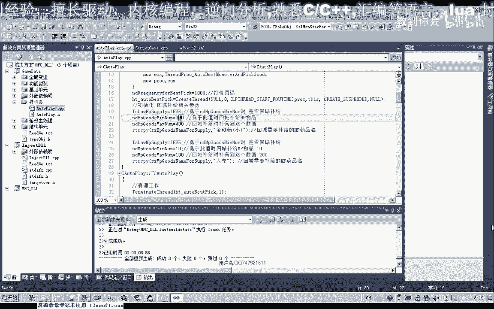

那么300 398个啊，我们低于这个数量的时候呢，就回城补剂，好那么我们注入一下啊，先把我们的o d来退出来，这样我们可以注入的速度呢可以快一些好。

那么输入进去之后呢，先挂接主线长，然后呢我们显示外挂或者当前的坐标，然后呢应用设置开始挂机，那么过去之后呢，我们这个时候呃使用一下这个金创药，让它的数量变少，那么变少了之后呢，我们可以看到啊。

还在继续的打断，好，那么这个时候我们可以从这个线路图里边可以看到他往这个npc，平时指这个地方呢进行了移动啊，五，那么这个时候呢他应当是回城去买这个相应的呃，药品去了，我们可以看一下这里的调试信息。

好那么这个时候呢他买到了这个药品，然后呢开始返回挂机的这个地点，好这个时候呢返回的吧，挂机地点的，返回到之后呢，再次它进行巡逻啊，看来是刚才的这个药品的话啊，没有买成功，我们看一下60。

那么这个药品的话，我们呢呃这个基本的过程呢我们已经ok了，但是呢就是买的过程当中呢啊没有成功，那么我们再来检测一下我们的代码，那么出现这种情况的话，肯定是我们这个补剂的这个函数呢啊出现了这个问题。

那么我们转到补给的这个函数里面，那么我们在这里哈是打开npc，打开商店嗯，然后呢再是我们从这里呢买这个药品，最后来关闭这个商店，那么我们来看一下它的这个相关的信息，那么在这里的话。

他根本就没有买这个药品的这个信息啊，那么我们再来检测一下我们的代码是什么地方出现了问题，那么这里的这个名字呢，我们可能呢呃我们再来看一下调试信息啊，这个时候调试信息呢已经被我们清掉了。

那么也就是这个物品的名字可能出现了错误，或者是这个物品的这个数量出现的错误，这是当前的这个数量，那么我们在这里呢打印出在购买的时候呢，我们打印出这个它的物品以及它的这个数量，2021061，哈哈哈。

当着，好的后面我们把药品的名字以及它的数量传递性能，那么我们看我们的参数是否传递到了这个位置，好再重新编译生成一下，那还有另外一种情况呢，也就是我们打开这个窗口的这个时间还不够长啊。

呃也就是说我们在这里呢，在我们打开商店之后，这个延迟的时间太太太少了，那么我们这里呢把它赏赐改为1000啊，1500，这里改为改为1500，那么可能是在这两个地方都有可能出现问题。

好的我们再次注入到游戏里面，然后我们挂接主线程显示外挂，获取当前的坐标啊，然后呢应用设置嗯，主要我们就来看一下调试信息啊，嗯开始挂机，那么这个时候呢应该是被卡住了，我们看一下。

那么我们自己跑跑到这个地方来看一下他能不能够购买成功，那么我们发现的话，这个时候呢他没有购买成功啊，这里的也是金窗，要小数量的话也对，那么是不是我们嗯已经购买的购买经创业的这个函数的机子。

是不是有了这个相应的这个变化，那么我们再来做一个单独的一个测试，嗯，而且这里的话我们应当是呃挂在主线程里面买买这个物品，嗯，应该是调用这里边购买物品的这个函数，你看有没有，那还要把这个函数的封装一下啊。

再退回，那么然后呢我们再转到这个主线程单元这里了，对吧，转到这里之后呢，我们再为它添加相应的代码，复制这段函数的说明，转到这个存放物品这个函数这里，那么这个函数的话看来也是没有定义。

那么我们就通过寻路的啊，这个函数呢在它的基础上进行一个修改啊，这一段代码复制一下，因为这段代码的话，它也是有两个参数，这里x y和y，那么这里呢我们传送呢嗯我们的物品名以及物品的数量这两个啊。

这里我们强制的把滤芯的把它转换一下，好然后呢我们把这里我们需要来另外注册一个消息的类型，那么这个类型呢我们按照这个顺序来设为九，然后复制一下这个红转到定义这里，那么我们把这个相应的参数传递进去。

当然这个变量名的话也可以改一下，也可以不改，那么我们这里就叫对体，可是，好了，我们再转到这个相应的课时去这里，在这里呢我们再调用这个商店里面的这个函数，然后呢我们再取出啊相应的这个数值，啊。

然后这里呢取出来的是它的这个数量啊，那么这里的话我们取出来呢，我们需要转换一下，把这个数值需要转换成我们的呃物品的名字类型，那么这里呢是下标一下标一好的，我们编译一下。

那么这里呢我们需要把它当成一个整体，还需要加上一层括号，那么才能够用这种数字的方式，当然为了更清晰的表达的话，可以借鉴这个寻路的这种方式，这种方式的话啊更简洁一些了，那么这里呢我们只讨论一下这种写法啊。

当然这种写法要难以理解一点啊，但是呢大家可以做一个参考，嗯，好成功之后呢，我们再次进行一下测试，看我们购买物品的这个货有没有问题，那么我们在这里呢也购买这个金创药箱。

那么在这里呢我们就把我们嗯这个自动啊p里面的这段代码，把它复制出来，你，啊，然后初始化这里我们把它的这个数据来看复制出来，那么这里呢我们购买，购买三个啊，作为一个城市，挂件主线程啊，然后呢我们呃打开。

看一下，然后呢我们购买清仓一下线，那么这个时候呢我们发现呢呃这个清创要小的话，他购买不了啊，再来看一下，那么说明是我们的这个函数呢，它本身出现了这个问题，那么我们再来看一下我们的代码。

但是这里的话他也没有出现相应的这个异常，购买精装要想呃执行到了这个地方，好，这里是路行啊，这里是塑料，然后呢这里也是看到一个类型，最后呢我们调用这个空，那么我们看一下这里的机子是否发生了这个变化。

那么我们再切换到我们的vs里面，首先来看一下4a6690 这个，生的代替，4a6691 f2077 ，这个零零，436690，那么这两个扩的话，从括来说的话都没有变化。

那么有可能出现的就是我们的这个参数呢，它发生了一些变化，可能是我们传入的这个参数呢不正确，那么我们在这个地方呢，嗯让它断下啊，我们分析一下这个参数，那么我们可以在这前面呢用一个message box。

好那么我们再重新编译一下，然后呢我们用ot啊附加进去看一下，然后我们下一个断点cp。

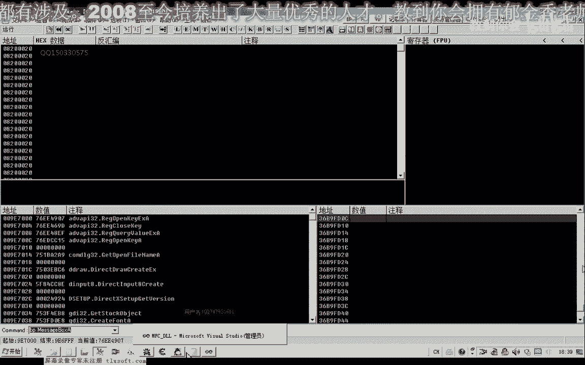

好那么注入成功的时候，我们挂接我们的主线程，然后呢呃这里呢购买我们的精装要小。

再来看一下调试信息，当然这个时候我们发现的话，我们的这个呃mebook呢，这里呢它并没有断下，就是这个地方它并没有断下，那么可能是我们的这个代码能需要重新编译，那么还有一种可能呢。

也就是这个货这里呢它并没有被执行到，也就是说我们的这个药品的名字可能错了啊，有可能是这种情况，嗯那么我们再退回来看一下，因为在这里的话，他需要查询这个名字，那么如果我们的名字呃在这里传送错了的话。

那么呃也会造成我们最终购买这个物品失败的金疮药小啊，然后我们再来看一下药店里的名字，金疮药，其经常要向看起来是没有错啊，嗯但是为什么我们就是说可能他是这里返回的这个数值呢，它等于零零啊。

那么我们再重新退出一下啊，现在掉我们的主线程，那么这个时候呢好像它是没有发送这个相应的这个数据包，我们把这个调试去了，直到下边这里了，那么打印出它的一个数值来看一下，好那么再重新编译一下。

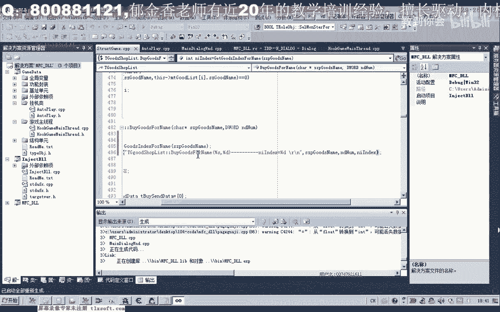

嗯嗯。

好的，那么我们再次挂接我们的主线程，在清空调试信息，那么在使用我们的金创药嗯，我们看一下最后的数值，那么这里呢他最终呢我们的这个数字版，为什么最终是写的这个ut不值封印dex，那么使用了我们的精创。

要想，嗯传送的这个信息好像不对，这里对吧，这个时候呢我们发现呢它最终是没有查询到这个金疮药小的这个名字，在这个商店背包里面，那么所以说他最终返回了返回的这个数值呢是-1，嗯那么我们的错误的原因的话。

基本上已经找到了，那么我们再来看一下，那么我们看一下商店列表，现在它的机制是多少。

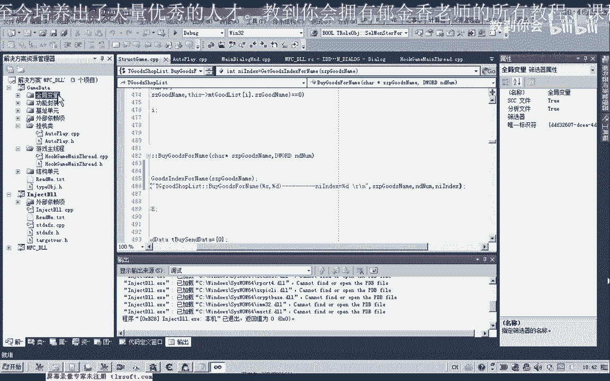

收藏一下吧，那么也就是这个机制，那么我们先来看一下它里边的这个名字，那么我们发现呢应当是这个机子的话他失失效了哈，也就是说呃这里边的话他找不到这个对象啊。

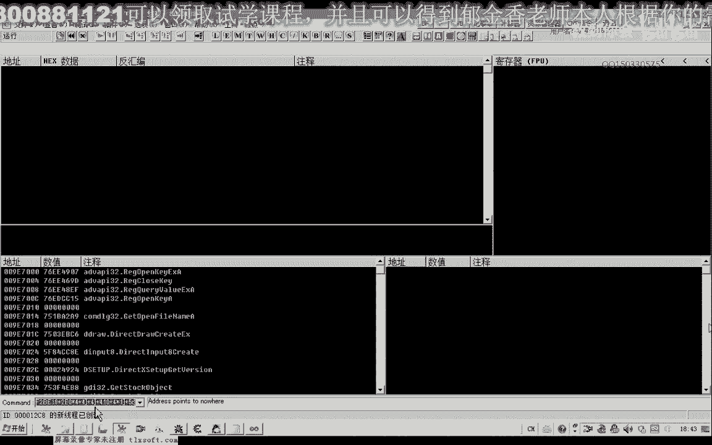

是这个机子的问题在这里。

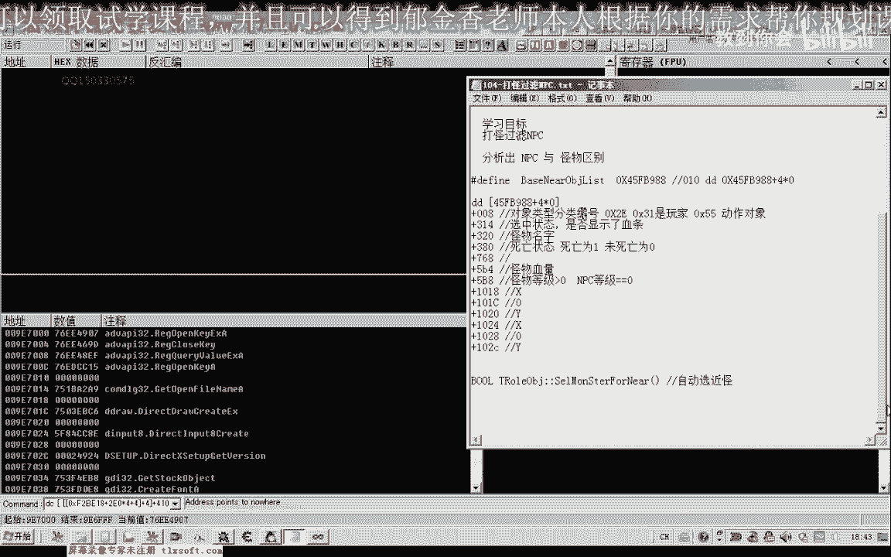

白色固体你说过，那么我们先看一下这个机子。

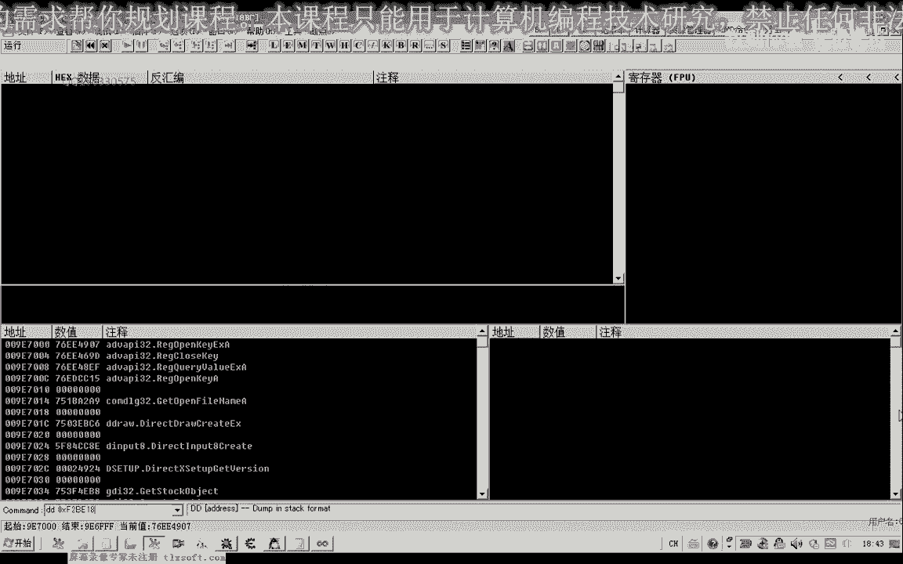

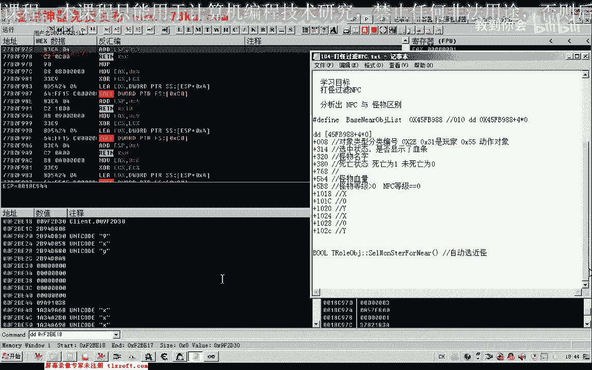

先看一下最最底层，他的访问，啊，七八，再加四，再加上我们的410，那么这一片的话都是为零的啊，我们看一下是不是中间某一个地方出错了，再加一层括号试一下，那再加上c0 。

那么这些数字呢它也也不像是我们的对象。

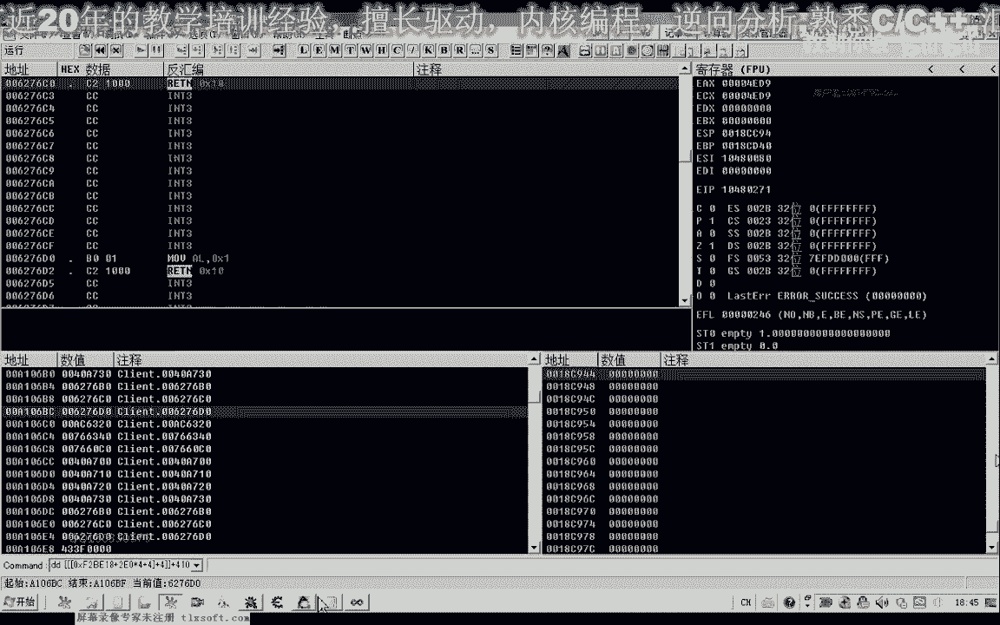

呃那么我们既然找到了这个原因呢，那么下一节课呢我们再想办法来更新一下这个商店的一个机制，那么这个公式好的，那么这节课我们就到这里，那么我们下节课再见。

那么这节课的重量同样能力就是去啊更新这个商店列表的这个机制，嗯嗯嗯啊，好的。

