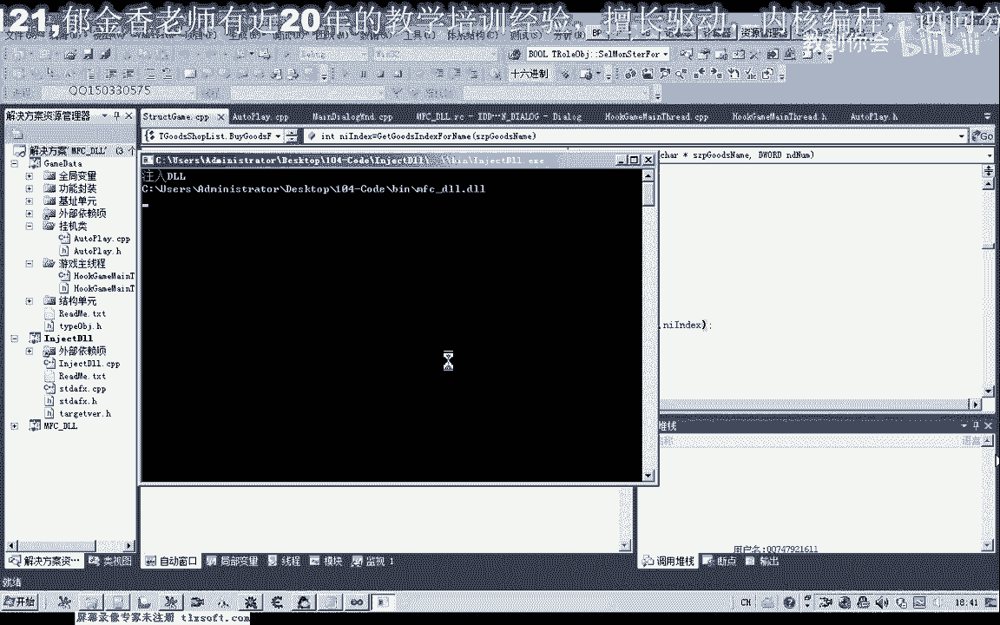

# 课程 P93：104-打怪过滤NPC 🎯


在本节课中，我们将学习如何区分游戏中的NPC与怪物，并修改自动选怪逻辑，使其能够正确过滤NPC，避免辅助功能在NPC附近卡住。


---


## 分析NPC与怪物的区别 🔍


上一节我们介绍了自动选怪功能。本节中，我们来看看如何区分NPC和怪物。如果无法区分，当怪物周围存在NPC时，辅助可能会错误地攻击NPC，导致功能异常。


以下是分析过程：


1.  首先，我们打开调试工具并附加到游戏进程。
2.  游戏中的附近对象列表包含了玩家、NPC、怪物以及地面物品。其数据结构中有一个偏移量用于标识对象类型。
3.  为了找到区分特征，我们分别查看怪物和NPC的对象属性。
4.  通过对比发现，怪物对象的等级偏移量（例如 `+0x54`）存储的值大于零，而NPC的同一偏移量存储的值为零。


**核心判断逻辑**：可以通过检查对象的等级值来区分。如果 `对象等级 == 0`，则该对象是NPC，应被跳过。


---

## 修改自动选怪函数 ⚙️

在分析了区别之后，我们需要修改自动选怪的代码，加入NPC判断逻辑。

以下是修改步骤：

1.  打开第103课的代码，找到自动选择最近怪物的函数。
2.  在遍历附近对象并选择目标的循环中，添加一个条件判断。
3.  判断条件为：如果当前遍历到的对象的等级等于0，则使用 `continue` 语句跳过该对象，继续检查下一个。
4.  修改完成后，重新编译并注入到游戏中进行测试。

**关键代码修改示例**：
```cpp
// 伪代码示例
for (每个附近对象) {
    int monsterLevel = 读取对象等级偏移量();
    if (monsterLevel == 0) {
        continue; // 跳过NPC
    }
    // ... 原有的选怪逻辑 ...
}
```

---

## 测试与问题排查 🐛


修改代码后，我们进行了挂机测试，并触发了自动回城补给功能。但在测试过程中，发现购买药品的功能未能成功执行。


以下是问题排查过程：


1.  检查补给函数的代码，发现其调用了“打开NPC商店”和“购买物品”的函数。
2.  通过输出调试信息，发现购买函数未能正确找到商店中的物品，返回了无效索引（-1）。
3.  怀疑问题出在传递的物品名称参数或商店列表的基址上。
4.  进一步检查发现，用于定位商店物品列表的**内存基址可能已经失效**，导致无法正确查询物品。


**结论**：当前补给功能失败的主要原因是商店列表的基址需要更新。我们将在下一节课中解决这个问题。



---


## 总结 📝


本节课中我们一起学习了：
1.  **如何区分NPC与怪物**：通过分析游戏内存，发现NPC的等级值为0，而怪物的等级值大于0。
2.  **修改自动选怪逻辑**：在选怪循环中加入等级判断，成功过滤掉NPC，避免了误攻击。
3.  **遇到了新问题**：在测试自动补给功能时，发现由于商店列表基址失效，导致无法购买药品。


核心收获是掌握了通过内存属性区分游戏对象类型的方法，并实践了代码修改。下一节课，我们将重点更新商店列表的基址，以修复自动补给功能。