# 课程 P94：105-获取商店列表基址 GetShopListBase 🛒

在本节课中，我们将学习如何动态获取游戏商店列表的基址。我们将分析现有代码的不足，探索通过内存访问和条件判断来稳定定位商店列表基址的方法，并最终编写一个可靠的函数来实现此功能。

---

## 回顾上节课内容

上一节我们介绍了在商店列表中查询物品并返回其对象ID的基本方法。我们来看一下104课中的相关代码。

在结构单元中有一个函数，用于在商店列表中查询物品栏是否存在特定物品，并返回其具体信息。

以下是该函数在购买物品时被调用的代码片段，它需要一些特定的数值作为参数。

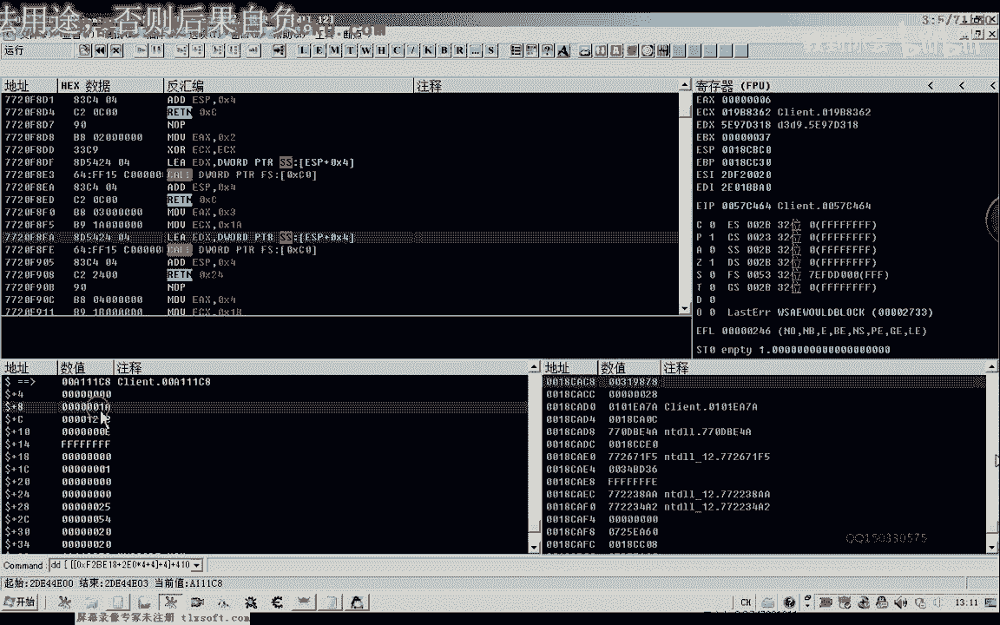

---

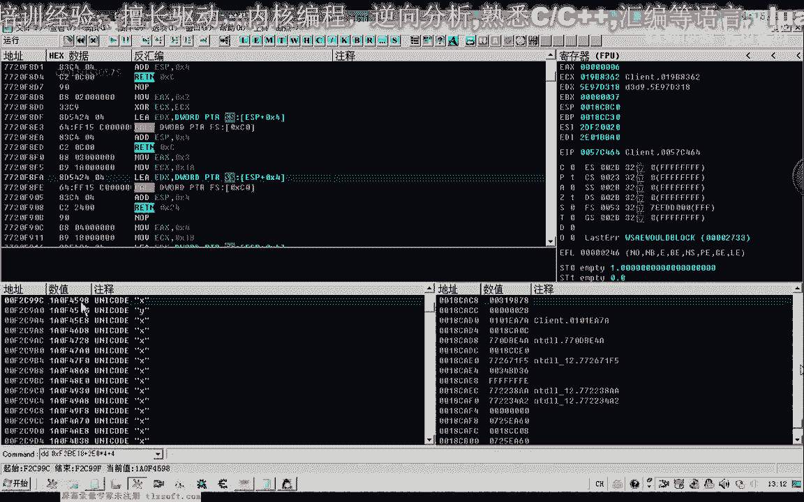

## 现有方法的不足与目标

现在我们需要找到一种方法来准确获取商店列表的基址。上一节课中使用的计算公式在某些情况下会失效，无法正确偏移出有效数据。

我们先回顾一下这个公式。

有时这个公式有效，但有时它无法偏移出正确的基址。首先，我们需要分析其相关属性。

我们需要记录这些属性，并理解如何计算出地址的前半部分。复制整个数据进行分析。

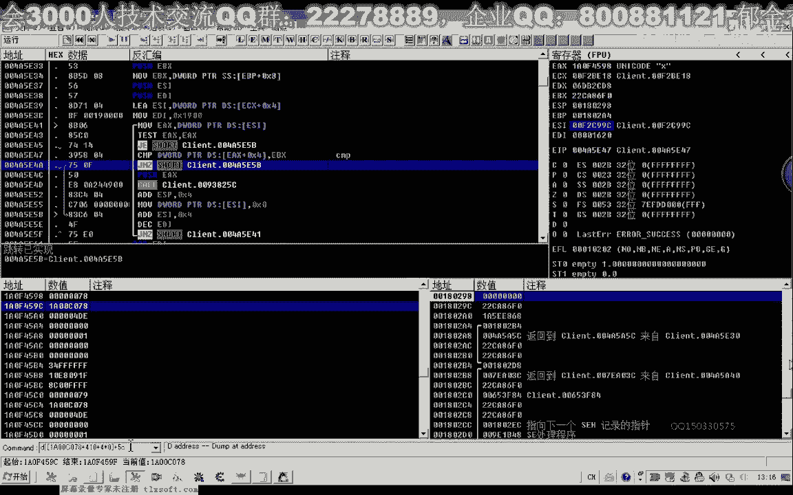

最终计算出的位置是一个相对基址。

通过这个地址，加上偏移量 `0x412`、`+4` 和 `0x410`，组成了商店列表的完整公式。

---

## 尝试通过内存访问定位基址

我们查找访问该地址的代码。观察 `ESI` 寄存器的值 `0xF299C`。代码通过一个循环不断偏移 `ESI` 的值，像是在遍历一个大小为 `0x1900` 的数组。

分析另一处代码，它没有条件判断指令，也没有 `CALL` 指令，最终取出数值。

我们尝试关闭商店，观察何时访问这个关键数字（即加上 `0x410` 偏移后的地址）。为此，我们添加一个内存访问断点。

首先用 CE 工具查找。理论上，打开商店时会访问这个数字。我们先取出这个数值。

因为该数值加上 `0x410` 偏移，再加上 `4 * 下标`，就对应商店里的物品。

因此，我们需要找到这个对象的来源，并分析其判断条件，看它是如何取出这个数字的。由于之前的公式不稳定，我们先用 CE 尝试，同时退出 OD 调试器。

在所有对象列表中也可能存在该对象，我们也可以通过偏移对象列表来实现。最新的所有对象基址是 `0x640` 这个数值。但偏移对象列表需要其属性作为判断依据。

我们先尝试其他方法。这里有很多列表，我们观察打开商店时的访问情况。

打开商店时没有立即访问，但有一个比较指令。然而，这个地址的访问并非只在打开商店时触发，因此可以排除。

我们将所有相关地址添加进来观察。有些地址在打开商店时没有反应，有些则被频繁访问。我们复制一个可能相关的地址 `0x22C`（EDI 寄存器的值）备用。

删除无关地址，对可疑地址下断点，然后打开商店。如果没有反应，则删除该地址。

我们发现很多数据都断在同一个代码地址 `0x626A39`。这些地址都很相似，通过它们分析出其他基址或偏移的可能性较小。

我们尝试之前可能性较大的那个地址，查看其 EDI 数值，并搜索该对象，看是否能找到指向商店列表的其他基址或偏移。

搜索从 `0x311` 开始，这可能是所有对象数组的基址，因此不予考虑。从 `0x17` 开始的数据是堆栈数据，也不予考虑。

我们查看后续数字，尝试找到其他基址。打开商店列表，从第一个地址找到一个 `0x28` 的偏移，记录下来。同时复制 EDX 的数值。

继续从 EDI 查找，可以看到 ESP 和 EBP 从 `0x17` 开始，因此之前两个数据不需要。关闭商店，这个数据可能比较重要。

从 EDX 查找对其的访问，发现也有从 `0x311` 开始的访问。我们以之前的偏移 `0x22C` 命名，找到了 EDI 的数字。

将这些新对象添加进来，数量较多。然后查找对这些对象的访问，打开商店，对没有访问的地址做标记。

每个地址段都可以尝试标记。观察其 EDX，发现它跳转到另一个数组里去了，这样查找比较复杂。

我们寻找更简单的方法，能否直接找出偏移。这一串地址都从 `0x1A` 开始，找一个不同的可能性更大。结果又跳转到 `0x66A39` 这个对象里去了。

所有查找都进入了同一个循环。因此，除了之前分析的基址可能有用外，当前这种查找基址的方法作用不大。

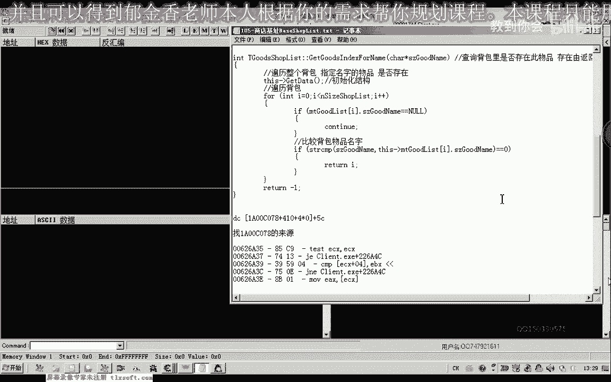

我们需要另想办法来获得商店对象的基址，即 `0x1030` 和 `0x78` 这两个数字。此时游戏卡死了，需要重新启动。

重新打开游戏后，用 OD 附加到进程。

---

## 通过条件判断和偏移获取基址

既然不能直接找到偏移或基址，我们可以通过现有列表进行偏移，但需要加上一些条件判断来确认正确的基址。

再次打开商店列表。

回顾公式。

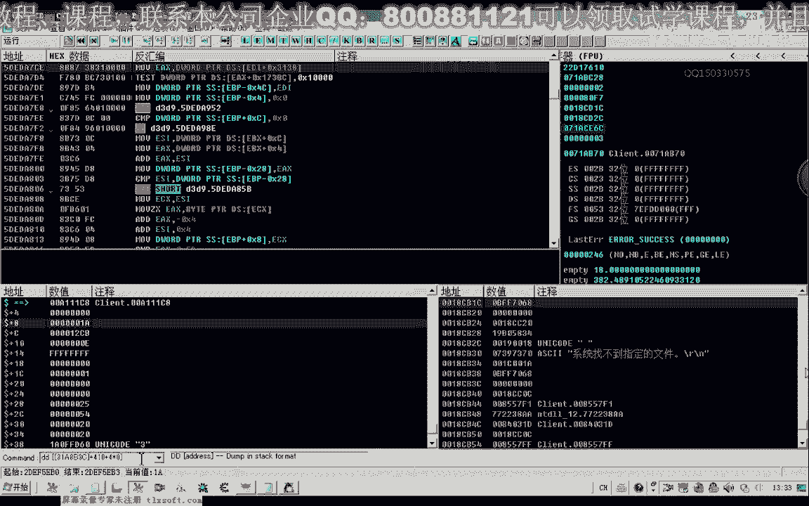

目前这个公式又可以使用了。我们可以先使用这个公式，同时准备一个备用方案。

备用方案是直接从下标开始进行偏移，但需要附加条件判断。例如，判断商店第一个物品是否是“金创药小”。或者，因为不同 NPC 的第一个商品可能不同，我们可以通过物品类型来判断。

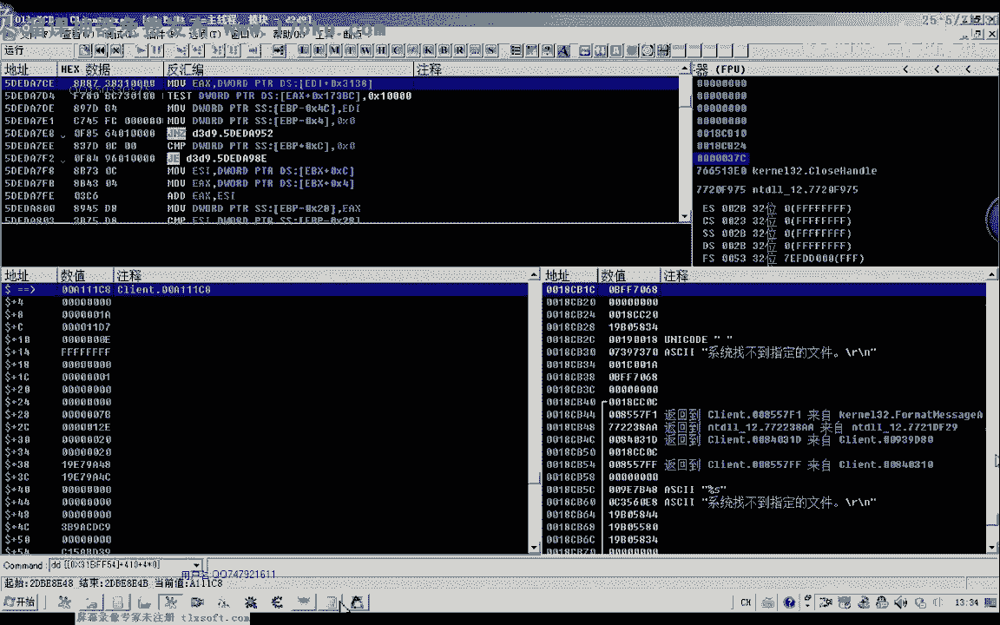

物品类型偏移是 `+0x08`，判断其值是否为 `0x1A`（代表物品）。我们还需要判断该对象是商店物品、背包物品还是地面物品，这可能需要一个特定的标志位。

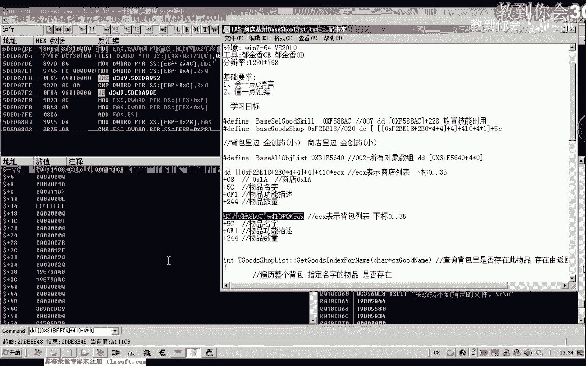

先看看背包物品的情况。打开背包，查看其最新基址。

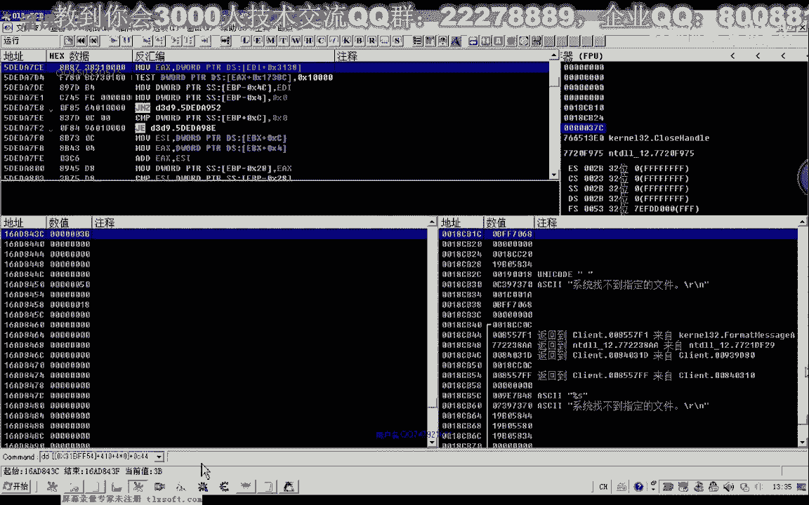

查看背包最新基址。

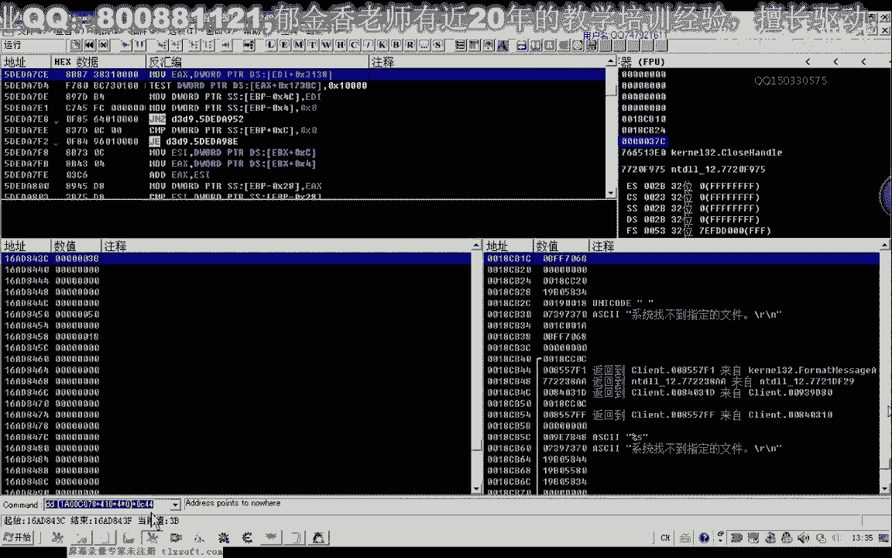

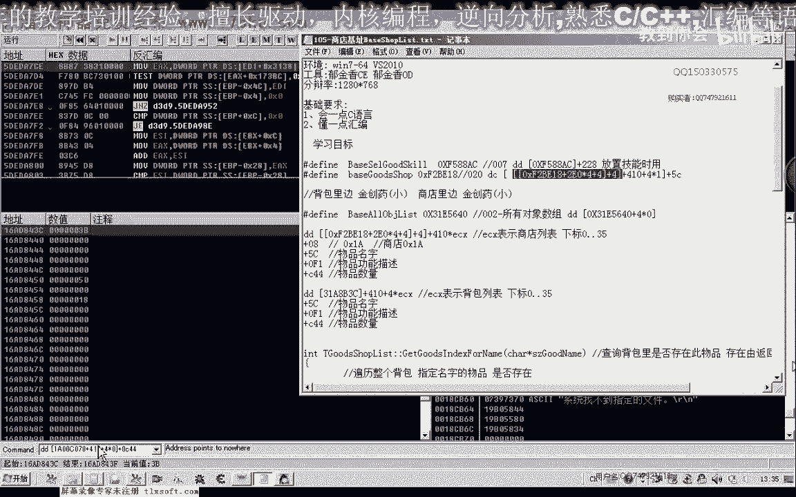

发现背包物品的 `+0x08` 偏移也是 `0x1A`。我们需要找出它们的区别。将“金创药小”放到背包第一个，比较相同物品间的差异。

区别可能在数量上。

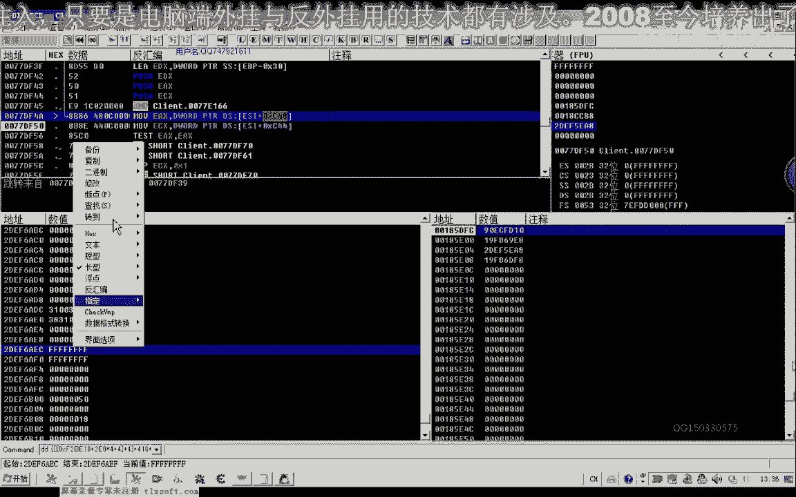

背包物品数量不同，查看偏移 `0x244` 处。

背包中“金创药小”的数量是 59。

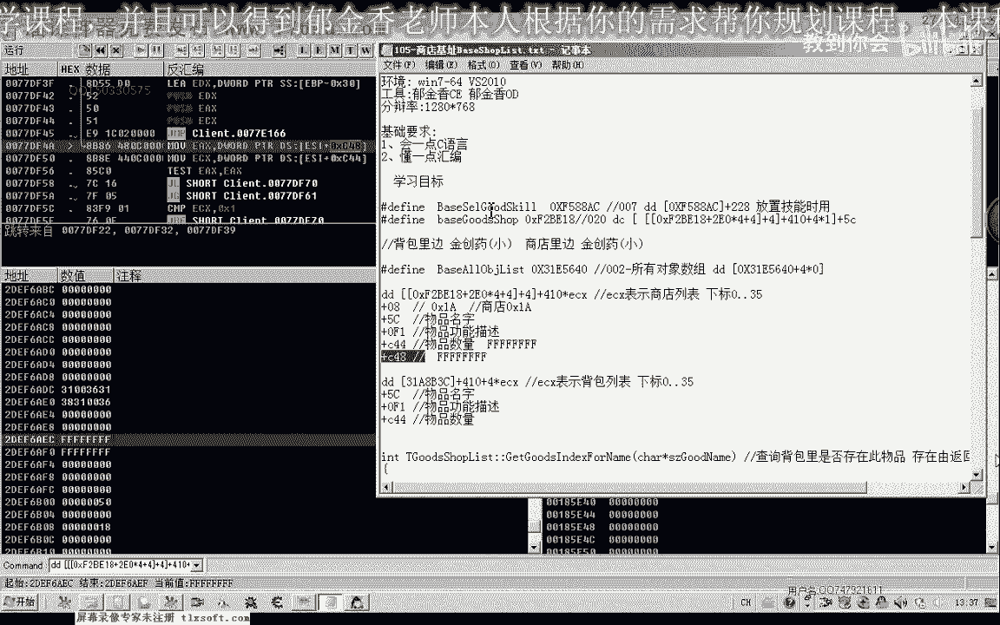

商店物品的 `+0xC4` 偏移是 `0xC40`。

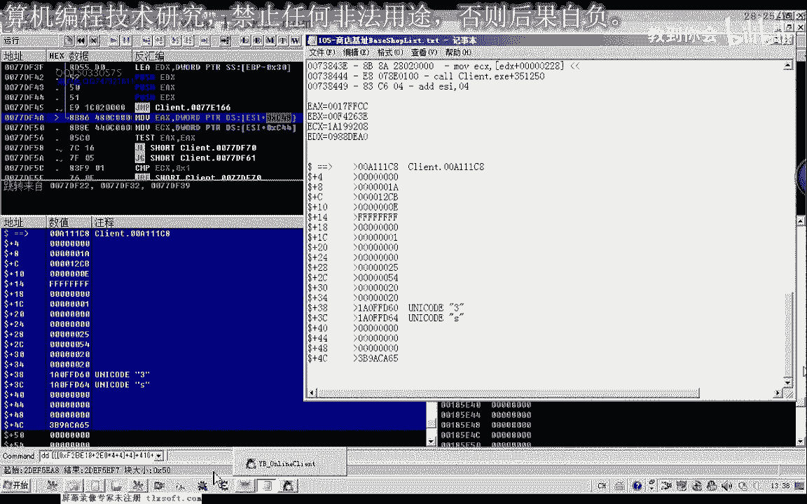

查看 `+0xC4` 偏移。

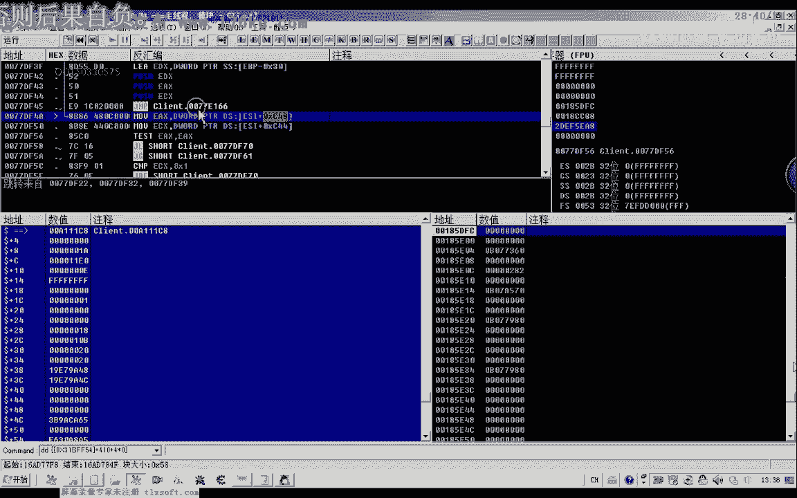

商店物品的数量显示为 `0xFF`（即 -1）。`+0xC8` 偏移也是 `-1`。我们可以利用这两个属性进行判断。

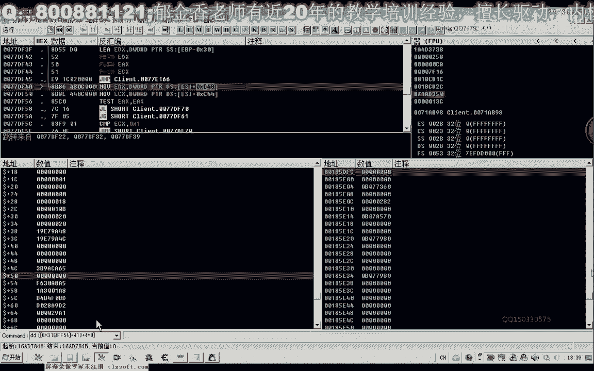

对于商店物品，`+0xC4` 和 `+0xC8` 偏移都等于 `-1`。因此，判断条件可以是：`+0x08` 等于 `0x1A`，且 `+0xC4` 和 `+0xC8` 都等于 `-1`。

可能还有其他属性（如所属关系）来区分对象位置，但这需要更深入的分析。目前利用现有数据已可进行区分。

复制商店物品和背包物品的数据进行比较。

这是背包物品数据。

这是商店物品数据。

比较发现，第一个数值相同，但 `0x28` 偏移处不同。`0x1C`、`0x20`、`0x24` 可能是坐标，`0x38` 和 `0x3C` 也不同。`0x44` 偏移处相同，这是物品的分类编号 ID。

物品类型在 `+0x08` 偏移处，肯定相同。

有了这些条件，我们可以编写一个函数来偏移并获取商店列表基址。

---

## 编写获取商店列表基址的函数

打开第104课的代码，在其基础上进行优化修改。

在结构单元的商店模块中添加一个新函数 `GetShopListBase`，用于获取商店基址。

我们所说的商店列表基址，就是公式中的那个数字。复制该公式，转到相关成员函数前添加代码。

我们需要一个循环来进行偏移。参考现有公式，但可以简化。

首先，需要一个 `for` 循环。因为坐标在 `0x210` 附近变化，我们暂时将范围设大一些，例如 `0x310`，或者从 `Base - 0x100` 到 `Base + 0x100` 进行搜索。

定义循环变量 `i`，起始值为 `-100`，结束值为 `100`，实现前后搜索。

开始进行偏移。首先需要取出公式中的数值。定义指针指向对象。

基址需要加上 `i * 4`。公式中的 `+4` 可以省略，因此偏移是 `0x211`。简化后，公式为 `*(DWORD*)(Base + i*4)`，这样可以取出里面的对象地址。

取出对象后，需要判断它是否指向商店列表。

首先将取出的数值转换为指针类型，并加上 `+4` 偏移（也可以在后面实现）。然后读取该地址的值。

判断该值是否为空。如果为空，则继续下一次循环。

如果不为空，则继续判断。此时我们已经读取出前半段地址。

然后需要加上 `0x410` 偏移来获取商店列表中的对象。公式为 `*(DWORD*)(Address + 0x410 + 4*Index)`。为了可读性，我们取第一个物品（`Index = 0`）。

取出数据后，再次判断对象是否为空。如果为空，继续下一次循环。

如果不为空，则分别读取 `+0x08`（类型）和 `+0xC4`（数量）的值进行比较。

定义变量 `Type` 和 `Count`，初始化为0。

如果对象不为空，则尝试读取其类型和数量。这些指针操作可能引发异常，需要进行异常处理。出现异常则继续下一次循环，也可以打印调试信息。

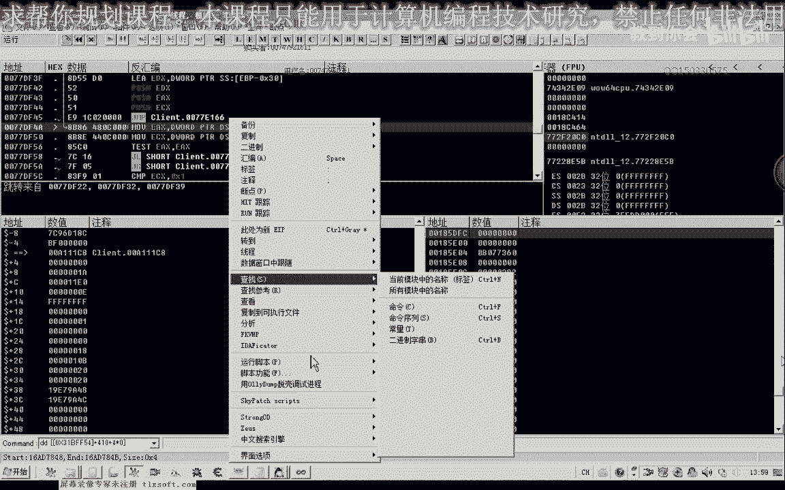

正常情况下，读取类型（`+0x08`）和数量（`+0xC4`）。可以定义宏来代表这些偏移。

判断条件：如果对象类型等于 `0x1A`（物品），且数量等于 `-1`（`0xFFFFFFFF`），则返回该对象的基址（注意，是基址，不是对象地址）。

如果循环结束仍未找到，则返回 `NULL`，表示获取失败。

先编译测试，打印出获取的数值，检查是否正确。

在主线程单元进行测试。

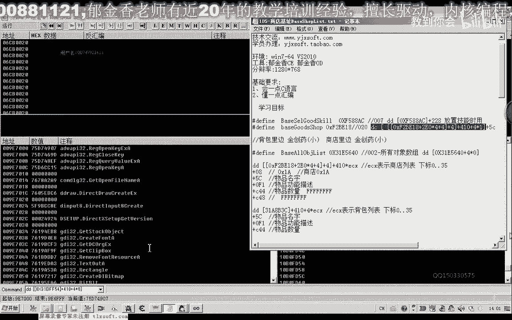

注入游戏进行测试。

测试失败。

首先挂起主线程测试。最终得到的基址是 `0x19FB6918`。

检查该对象是否正确。有可能偏移到了仓库或背包（但背包物品数量不为-1）。仓库物品有数量，也可能被偏移到。

附加到游戏进程。

用旧公式验证。

基址 `0x19FB6918` 加上 `0x410`，再根据下标 `i` 加上偏移 `0xC`，可以找到“金创药小”等物品。

基本正确。

接下来，利用这个基址修改商店相关函数，主要是购买物品函数 `BuyItem`。

可能还需要修改 `GetItem` 函数的初始化部分，用新函数 `GetShopListBase` 返回的基址替代原来的计算。

恢复主线程，退出。

测试是否可以购买物品。使用购买“金创药小”功能测试。卸载主线程模块，重新注入。

挂起主线程，购买“金创药小”。发现没有反应，返回结果仍是 `-1`，说明还有问题。

查看代码，发现获取基址时出现了异常，但最后返回的基址是正确的。可能是条件判断不够准确。

缩小搜索范围，前后各10个对象进行偏移。卸载主线程模块。

检查购买物品函数 `BuyItem` 和 `GetItem`。在调用时已经初始化，但代码中可能仍有问题。

转到 `GetItem` 的初始化函数查看。显示其获取的基址是否正确。

代码中再次将基址加了4，然后加上 `0x410`。实际上，`ForestCoBase` 应该等于我们获取的基址（即 `0x410` 之前的部分），这一步应该省略。

重新编译测试。挂起主线程，购买“金创药小”。仍然不正确。

返回的下标是正确的，但出现了异常。异常可能出现在 `BuyItem` 函数内部。添加调试语句，定位异常发生的位置。

在可能出错的代码段前后添加编号输出，观察执行流程。重新编译注入测试。

通过调试信息发现，异常发生在某个消息框代码附近。注释掉消息框代码，重新测试。

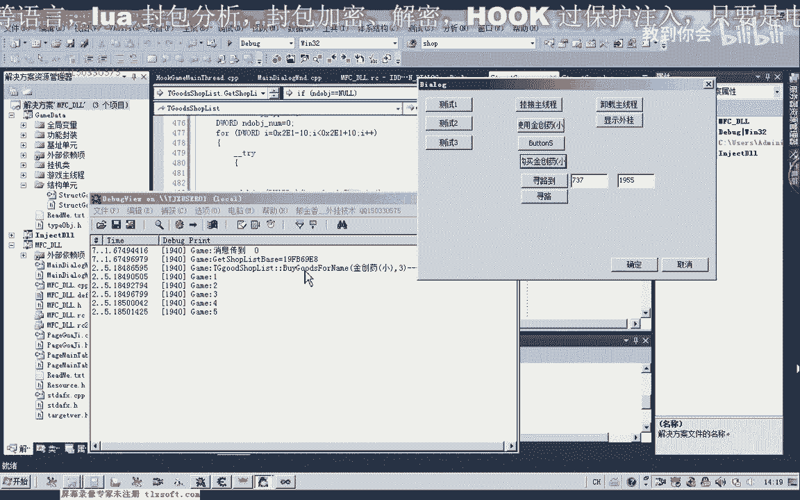

还需要添加一个判断，当读出的对象为空时，忽略异常。

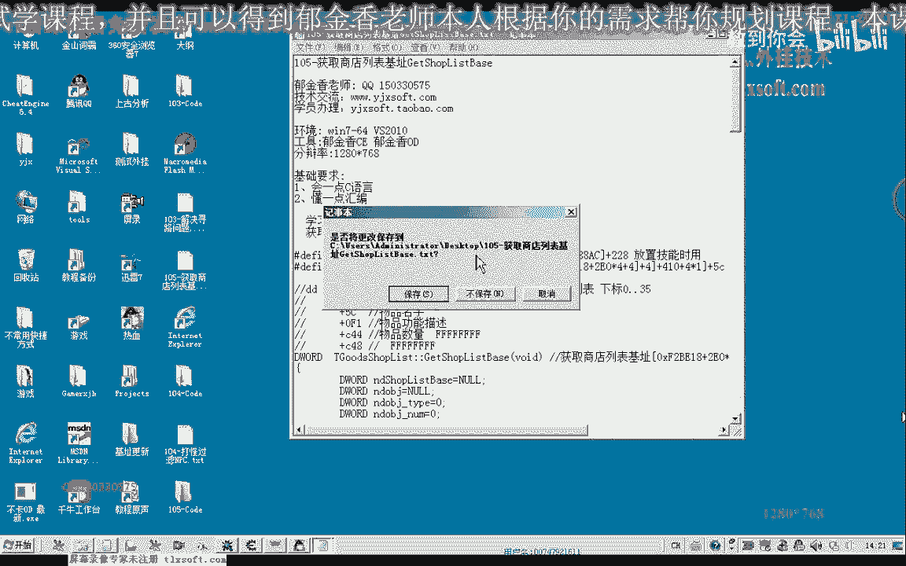

---

## 总结

本节课中，我们一起学习了如何动态获取游戏商店列表的基址。我们分析了直接计算公式的不稳定性，探索了通过内存访问断点和条件判断来定位基址的方法。最终，我们编写了一个 `GetShopListBase` 函数，通过循环偏移和属性验证（类型为物品、数量为-1）来可靠地获取商店基址，并尝试将其集成到购买物品的功能中。虽然过程中遇到了异常处理等问题，但为后续稳定调用奠定了基础。