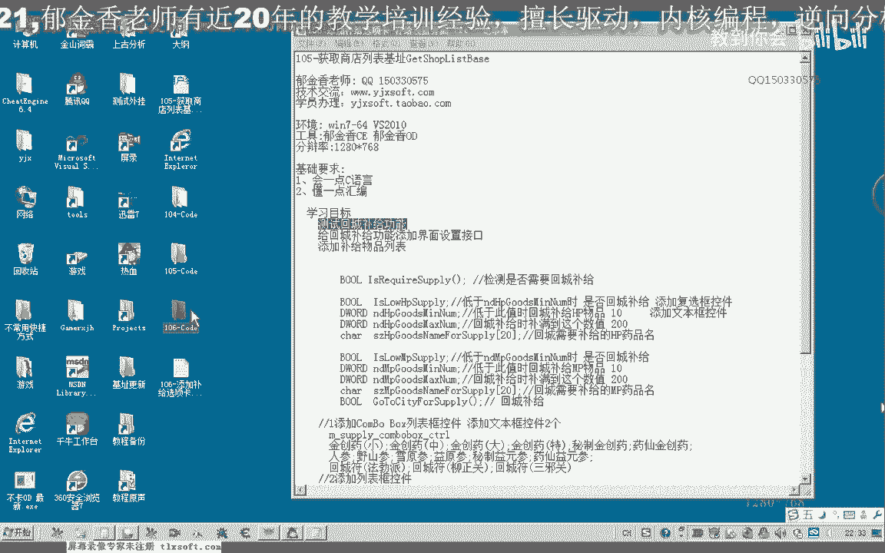
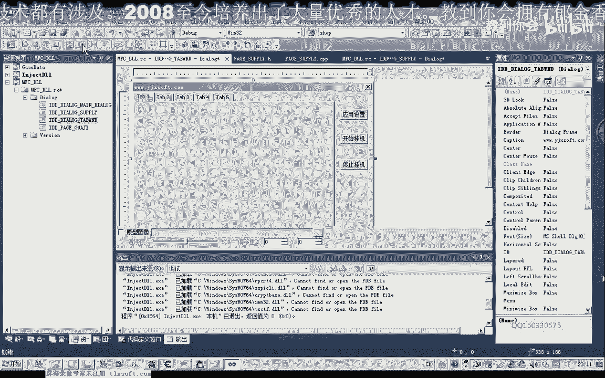
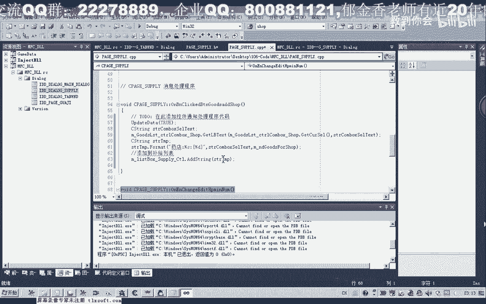

# 课程P95：106-回城补给功能测试与补给选项卡界面添加 🛠️



在本节课中，我们将首先测试上一节课修改的回城补给功能，然后为这个功能添加一个专门的设置界面，即“补给”选项卡。我们将学习如何创建新的对话框资源、关联控件变量，并将其集成到主界面的选项卡控件中。

---

## 功能测试 🧪

上一节课我们修改了回城补给的功能，并修正了商店列表的机制。现在，我们先来测试一下这个功能。

首先，我们查看游戏内角色的药品数量。当前数量是418。为了触发回城补给，我们需要将补给条件设置为一个较大的数值，例如410。这意味着当药品数量低于410时，角色会执行回城补给。

接下来，我们挂接主线程并获取当前坐标。确认周围有怪物存在后，应用设置并开始挂机。然后，我们使用快捷键（如按F键）消耗药品，模拟药品数量减少。

此时，我们观察到角色已经生成了回城路径，准备返回城镇购买物品。打开调试信息查看器，可以看到角色购买了7个金创药，然后返回了挂机地点。

现在，角色已经开始打怪，并且系统正在统计药品数量并进行判断。从购买7个金创药的结果来看，回城补给功能基本可以正常运行。

---

## 添加补给选项卡界面 🖥️

测试通过后，我们为补给功能添加一个专门的设置页面。首先，停止挂机，卸载主线程并退出。

目前，补给相关的参数（如成员变量）存储在代码中，我们需要一个窗口界面来提供设置接口，就像已有的“挂机”选项卡一样。在“挂机”选项卡中，我们可以设置坐标、打怪模式、低血保护等参数，这些设置最终会修改代码中的成员变量。

本节的目标就是创建一个类似的“补给”选项卡。

### 创建对话框资源

1.  在资源视图中插入一个新的对话框。
2.  更改其ID，例如改为 `IDD_SUPPLY`。
3.  调整窗口大小，并将窗口样式设置为无边框。

### 设计界面控件

我们需要提供以下设置接口：
*   两个复选框：用于选择是否在HP或MP药品数量低于阈值时触发回城补给。
*   两个编辑框：用于输入HP和MP药品的触发阈值。
*   一个列表框：用于管理需要补给的物品列表（考虑到不同NPC出售不同物品，如药品、弓箭、回城符等）。
*   相关静态文本标签用于说明。

以下是具体操作步骤：

1.  **添加复选框和编辑框**：
    *   添加两个复选框控件，文本分别为“HP药品数量低于”和“MP药品数量低于”。
    *   在每个复选框旁边添加一个编辑框，用于输入具体的数值阈值。
    *   添加静态文本“时回城补给”作为说明。

2.  **添加补给物品列表**：
    *   首先添加一个分组框控件，将其文本设置为“补给列表”。
    *   在分组框内，添加静态文本标签，如“药店”和“仓库”，代表不同的补给地点。
    *   在每个地点标签后，添加一个组合框（ComboBox），用于选择要补给的物品（如“金创药”、“魔法药”）。
    *   在组合框右侧，添加一个编辑框，用于输入需要购买的数量。
    *   最后，添加一个“添加”按钮，用于将当前选择的物品和数量加入到下方的列表框中。
    *   添加一个列表框（ListBox）控件，用于显示所有已添加的补给物品信息。

### 关联控件变量

在关联变量之前，需要为这个新对话框创建一个类（例如 `CSupplyPage`）。

创建类完成后，为各个控件关联成员变量：
*   HP药品阈值编辑框：关联一个 `DWORD` 类型的变量，如 `m_dwHpThreshold`。
*   MP药品阈值编辑框：关联一个 `DWORD` 类型的变量，如 `m_dwMpThreshold`。
*   “药店”物品组合框：关联一个 `CComboBox` 类型的控件变量，如 `m_ctlDrugStoreCombo`。
*   “药店”数量编辑框：关联一个 `DWORD` 类型的变量，如 `m_dwDrugStoreQty`。
*   “仓库”物品组合框和数量编辑框同理。
*   补给列表列表框：关联一个 `CListBox` 类型的控件变量，如 `m_ctlSupplyList`。

### 初始化与数据添加

在对话框类的 `OnInitDialog` 函数中，我们需要进行初始化：
*   为HP/MP阈值编辑框设置默认值（例如10）。
*   为“药店”和“仓库”的组合框添加默认物品选项（如“金创药”、“魔法药”、“回城符”）。
*   其他数值初始化为0。

“添加”按钮的响应函数需要执行以下操作：
1.  调用 `UpdateData(TRUE)` 将界面数据更新到关联的成员变量中。
2.  从组合框中获取选中的物品名称。
3.  从数量编辑框中获取数量。
4.  将物品名称和数量格式化为一个字符串（例如“金创药 x 10”）。
5.  使用 `m_ctlSupplyList.AddString(strItemInfo)` 将该字符串添加到列表框中。

### 集成到主选项卡

界面设计好后，需要将其显示在主窗口的选项卡控件中。

1.  **在主对话框头文件中**：
    *   包含新创建的 `CSupplyPage` 类的头文件。
    *   添加一个 `CSupplyPage` 类型的成员变量，如 `m_pageSupply`。

2.  **在主对话框的初始化函数中**：
    *   创建选项卡页。复制类似“挂机”选项卡的创建代码并进行修改。
    *   关键代码示例：
        ```cpp
        m_pageSupply.Create(IDD_SUPPLY, &m_tabCtrl);
        m_tabCtrl.InsertItem(1, _T("补给")); // 假设索引1是补给页
        CRect rect;
        m_tabCtrl.GetClientRect(&rect);
        rect.DeflateRect(2, 30, 2, 2); // 调整位置
        m_pageSupply.MoveWindow(&rect);
        m_pageSupply.ShowWindow(SW_HIDE); // 初始隐藏
        ```

3.  **处理选项卡切换事件**：
    *   在选项卡控件的选择改变事件处理函数（如 `OnTcnSelchangeTab`）中，根据当前选中的选项卡索引，显示或隐藏对应的页面。
        ```cpp
        int nSel = m_tabCtrl.GetCurSel();
        m_pageSupply.ShowWindow(nSel == 1 ? SW_SHOW : SW_HIDE); // 假设索引1是补给页
        // 同时隐藏其他页面...
        ```

### 界面调整与后续工作

编译并运行程序，点击“补给”选项卡，检查界面显示。可能需要进一步调整对话框和控件的大小以适应选项卡。

目前，列表框中的数据是以字符串形式存储的（如“金创药 x 10”）。在实际功能中，我们需要解析这些字符串，提取出物品名和数量。

因此，我们需要设计一个结构体来存储补给信息，例如：
```cpp
struct SupplyItem {
    CString strItemName; // 物品名称
    DWORD dwQuantity;    // 物品数量
};
```
并创建一个该结构体的列表（如 `CList<SupplyItem, SupplyItem&>` 或 `std::vector<SupplyItem>`）。在“添加”按钮点击时，不仅要将字符串加入列表框，还要将解析后的数据存入这个结构体列表。同时，也需要编写函数将列表框中的字符串解析回结构体数据。

这些内容我们将在下一节课中详细设计和实现。




---

## 总结 📝

本节课中，我们一起完成了以下工作：
1.  **测试了回城补给功能**，确认其基本逻辑运行正常。
2.  **设计并创建了“补给”选项卡界面**，包括阈值设置和补给物品列表管理。
3.  **为界面控件关联了变量**，并实现了初步的数据添加功能。
4.  **将新页面成功集成到主窗口的选项卡控件中**。



通过本节学习，我们掌握了为外挂功能添加配置界面的基本流程。下一节课，我们将完善补给功能的数据结构，实现列表数据的解析与同步，使补给设置能够真正生效。