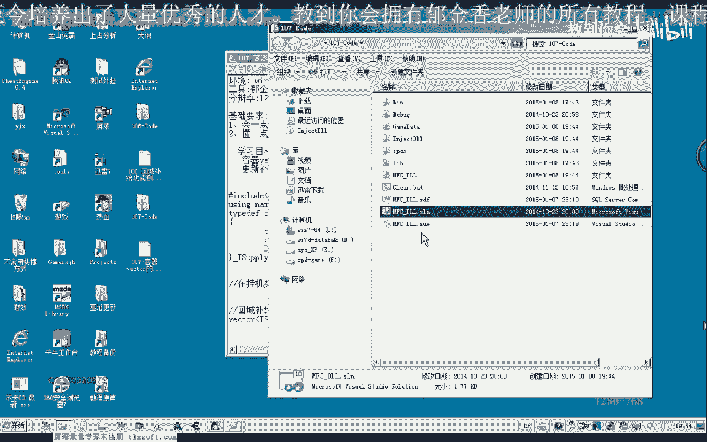
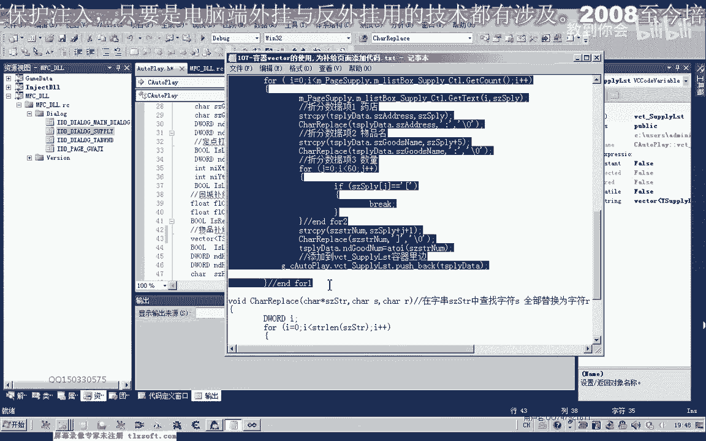
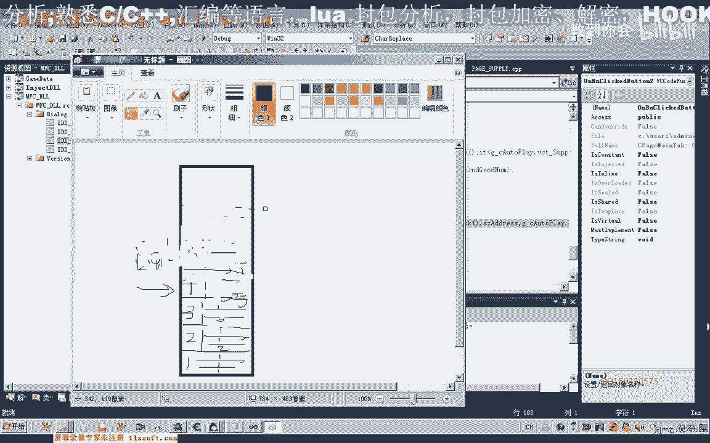

# 课程P96：容器vector的使用与补给页面代码实现 🧰

在本节课中，我们将学习C++标准库中的容器`vector`，并利用它来重构游戏外挂中补给物品列表的数据存储方式。我们将设计一个结构体来存放补给信息，并实现从UI界面到内存数据的转换与存储。



---

## 设计补给物品的数据结构

上一节我们介绍了项目的基本框架，本节中我们来看看如何设计一个合适的数据结构来存放补给物品的信息。

一个补给物品通常包含以下核心信息：
1.  **补给地点**：例如“仓库”或“药店”，甚至可以细化到具体NPC的坐标或名称。
2.  **物品名称**：需要购买的药品或物品的名字。
3.  **补给数量**：需要购买该物品的数量。

因此，我们可以定义一个结构体 `SupplyItem` 来封装这些信息：

```cpp
struct SupplyItem {
    char location[64];  // 补给地点
    char name[64];      // 物品名称
    DWORD count;        // 补给数量
};
```



---

## 使用vector容器存储动态列表

在之前的代码中，我们可能使用了固定大小的数组来存储补给列表。但补给物品的数量是不固定的，使用固定数组要么浪费空间，要么可能溢出。本节我们将引入 `vector` 容器来解决这个问题。

`vector` 是C++标准模板库(STL)中的一个动态数组容器。它可以根据需要自动调整大小，非常适合存储数量不定的数据集合。

要使用 `vector`，首先需要在文件开头包含头文件并指定命名空间：

```cpp
#include <vector>
using namespace std;
```

接着，我们可以在挂机类的成员变量中，用 `vector` 来替换旧的固定数组：

```cpp
// 旧的成员变量（将被替换）
// char supplyHPName[64];
// char supplyMPName[64];

// 新的成员变量：使用vector存储补给物品列表
vector<SupplyItem> supplyList;
```

这样，`supplyList` 就成了一个可以动态增删 `SupplyItem` 结构体的容器。

---

## 从UI界面读取并转换数据

设计好数据结构后，我们需要将用户在补给选项卡中设置的信息，转换并存储到 `vector` 容器中。这个过程在用户点击“应用设置”按钮时触发。

以下是实现该功能的核心步骤：

首先，我们需要一个辅助函数来替换字符串中的特定字符，以便于后续分割字符串。

```cpp
// 函数功能：将字符串str中第一个出现的字符ch替换为结束符'\0'
void ReplaceCharWithZero(char* str, char ch) {
    char* pos = strchr(str, ch); // 查找字符ch的位置
    if (pos != nullptr) {
        *pos = '\0'; // 将其替换为字符串结束符
    }
}
```

接下来，在“应用设置”按钮的响应函数中，编写数据转换与填充的逻辑：

```cpp
// 1. 清空现有的补给列表，准备装入新数据
supplyList.clear();

// 2. 获取UI中补给列表控件的行数
int itemCount = m_supplyList.GetItemCount();

// 3. 临时变量，用于存储从每行文本中解析出的数据
SupplyItem tempItem;
char szText[256]; // 存储从列表控件中获取的一行文本
char tempBuffer[256]; // 临时字符串缓冲区

// 4. 循环遍历列表的每一行
for (int i = 0; i < itemCount; ++i) {
    // 获取第i行的文本
    m_supplyList.GetItemText(i, 0, szText, sizeof(szText));

    // 示例文本格式："药店;金创药(小);(11)"

    // 4.1 解析“补给地点”
    strcpy(tempBuffer, szText);
    ReplaceCharWithZero(tempBuffer, ';'); // 找到第一个分号并截断
    strcpy(tempItem.location, tempBuffer); // 复制到结构体的location字段

    // 4.2 解析“物品名称”
    // 跳过“地点”部分（中文字符占2字节，分号占1字节）
    strcpy(tempBuffer, szText + strlen(tempItem.location) + 3); // +3 跳过两个中文字符和一个分号
    ReplaceCharWithZero(tempBuffer, ';'); // 截断第二个分号
    strcpy(tempItem.name, tempBuffer); // 复制到结构体的name字段

    // 4.3 解析“补给数量”
    // 找到左括号'('的位置
    int j = 0;
    for (j = 0; szText[j] != '\0'; ++j) {
        if (szText[j] == '(') {
            break;
        }
    }
    // 从左括号的下一个字符开始复制
    strcpy(tempBuffer, &szText[j + 1]);
    // 将右括号')'替换为结束符
    ReplaceCharWithZero(tempBuffer, ')');
    // 将字符串形式的数字转换为整数
    tempItem.count = atoi(tempBuffer);

    // 5. 将解析好的结构体数据“压入”vector容器
    supplyList.push_back(tempItem);
}
```

**关键操作解析**：`supplyList.push_back(tempItem)`
`push_back()` 是 `vector` 的成员函数，其作用是将一个元素添加到容器的末尾。你可以将其想象为向一个“栈”的顶部压入数据。随着我们不断解析新的行，新的 `SupplyItem` 会被依次压入 `vector`。

---

## 访问vector中的数据

数据存入 `vector` 后，我们需要知道如何将其取出并使用。以下是两种常见的访问方式。

### 方式一：使用迭代器遍历（推荐）

这种方式不会破坏容器内的数据，适合常规的读取操作。

```cpp
// 定义一个指向SupplyItem的迭代器it，它从vector的起始位置开始
for (vector<SupplyItem>::iterator it = supplyList.begin(); it != supplyList.end(); ++it) {
    // 通过‘->’操作符访问结构体成员
    // 例如：打印补给地点和物品名
    printf("补给地点：%s， 物品：%s， 数量：%d\n", it->location, it->name, it->count);
}
```
*   `begin()`: 返回指向容器第一个元素的迭代器。
*   `end()`: 返回指向容器**最后一个元素之后**的迭代器，作为循环结束的标志。
*   迭代器 `it` 每次递增 (`++it`)，就会指向容器中的下一个元素。

### 方式二：结合back()和pop_back()访问（栈式操作）

这种方式会从容器末尾取出并移除元素，适用于需要消耗数据的场景（在本例中仅作演示）。

```cpp
// 当容器不为空时循环
while (supplyList.size() > 0) {
    // 1. 获取容器末尾的元素（栈顶元素）
    SupplyItem& topItem = supplyList.back();
    printf("取出：地点-%s, 物品-%s, 数量-%d\n", topItem.location, topItem.name, topItem.count);

    // 2. 将末尾元素从容器中移除
    supplyList.pop_back();
}
```
**重要提示**：`pop_back()` 会永久移除数据。在我们的补给系统中，数据需要被反复使用，因此**不应采用此方法**，这里仅用于展示 `vector` 的栈操作特性。

---

## 测试与验证

为了验证代码是否正确工作，我们可以在界面上添加一个测试按钮，并在其响应函数中写入遍历 `supplyList` 的代码（使用第一种迭代器方式）。

测试步骤：
1.  在补给选项卡UI中，添加几条补给信息（例如：药店 -> 金创药(小) -> 5）。
2.  点击“应用设置”按钮，数据将被转换并存入 `vector`。
3.  点击“测试”按钮，观察输出窗口是否按顺序正确打印出所有已添加的补给信息。

如果输出结果与UI设置一致，则证明我们的 `vector` 容器和数据转换逻辑工作正常。

---

## 课程总结

本节课中我们一起学习了以下核心内容：
1.  **设计数据结构**：定义了 `SupplyItem` 结构体，合理规划了补给物品的信息单元。
2.  **引入vector容器**：使用 `vector<SupplyItem>` 替代固定数组，实现了补给列表的动态、安全存储。
3.  **实现数据转换**：编写了从UI控件文本中解析并填充结构体的逻辑，关键点是字符串的分割与转换。
4.  **掌握数据访问**：学会了使用**迭代器**安全遍历 `vector`，也了解了 `back()` 和 `pop_back()` 的栈式操作及其适用场景。



通过本课实践，你将 `vector` 这一重要的STL容器应用到了实际项目中，解决了动态数据存储的需求，为后续实现自动补给功能打下了坚实的数据基础。