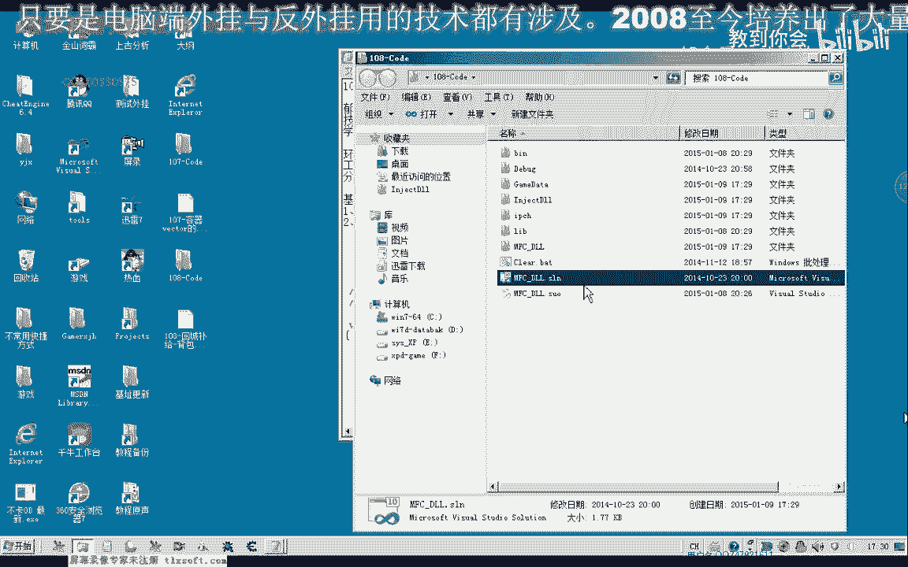
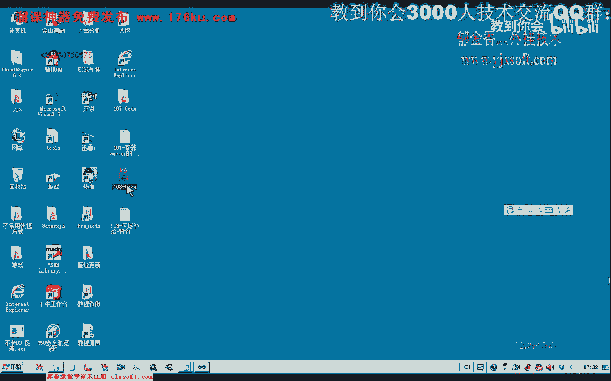
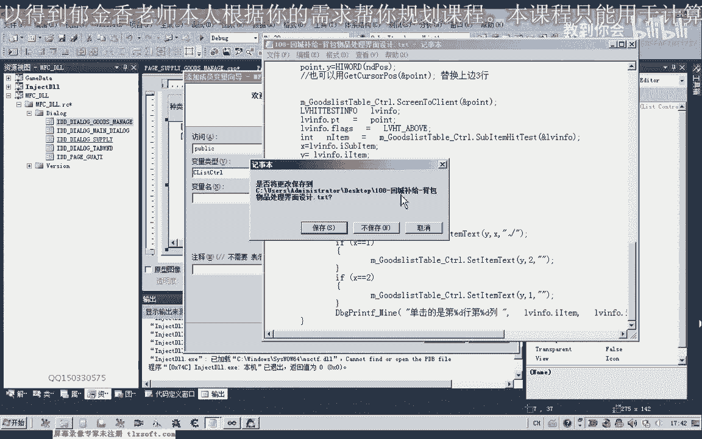
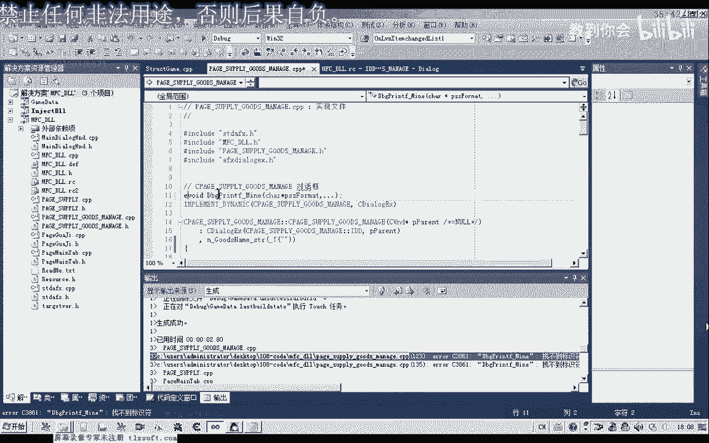

# 课程 P97：108-回城补给-背包物品处理界面设计 📦➡️🎒



在本节课中，我们将学习如何设计游戏外挂中的两个关键界面：仓库补给列表和背包物品处理界面。我们将从修改现有代码开始，逐步添加新的界面元素和功能，最终实现一个能够管理物品来源（仓库或商店）和去向（出售或存放）的完整系统。


---




## 仓库补给列表的修改与初始化 🏪

上一节我们完成了基础界面的搭建，本节中我们来看看如何为仓库添加补给功能。

首先，我们需要打开第107课的代码，并在其基础上进行修改。核心任务是初始化仓库物品列表，并添加从仓库补给的选项。

以下是初始化仓库物品（如精创药）的关键代码片段：

```cpp
// 假设的初始化代码，将物品添加到仓库列表
m_warehouseList.AddItem("精创药");
m_warehouseList.AddItem("生命药水");
// ... 添加其他物品
```



接着，我们需要复制之前为商店补给编写的代码结构，并修改其“去向”关键字。将原来的“从商店购买”改为“从仓库补给”，并关联到仓库的成员变量。


修改后的代码逻辑如下：
1.  从界面获取选中的物品。
2.  设置其来源为 **`仓库`**。
3.  将其添加到补给执行列表中。

完成代码修改后，我们编译并测试。运行游戏，注入外挂，打开界面。此时在补给列表中，除了“从药店”的选项，应该能看到新增的“从仓库”补给选项，这表明数据已成功添加到补给列表。

---

## 设计背包物品处理界面 🗂️

在实现了基础补给功能后，我们发现背包中常有许多待处理的物品（例如垃圾装备）。这些物品可能需要存回仓库或出售给商店。因此，我们需要设计一个独立的界面来处理这些操作。

由于原界面空间不足，我们决定新增一个窗口。在资源编辑器中，插入一个新对话框，将其ID命名为“物品处理”。

在这个新窗口中，我们将使用 `CListCtrl` 控件（而非简单的 `ListBox`）来以表格形式更清晰地展示物品，因为它支持网格线等更丰富的格式。

以下是界面布局的核心组件列表：

*   **物品分类**：一个静态文本和一个 `ComboBox` 下拉框，用于筛选物品类型（如武器、防具、药品）。
*   **物品名称**：一个静态文本和一个编辑框，用于输入或显示具体物品名。
*   **功能按钮**：包括“添加”、“删除选中项”和“返回”按钮。

布局完成后，我们需要在代码中创建对应的类（例如 `CItemProcessDlg`）来管理这个新窗口。

---

## 实现列表控件与窗口管理 ⚙️

界面设计好后，我们需要编写代码使其工作。首先，要在 `CItemProcessDlg` 类的初始化函数中，对 `CListCtrl` 控件进行设置，使其显示为报表（网格）样式。

以下是初始化 `CListCtrl` 核心样式的关键代码：

```cpp
// 获取当前样式并添加报表视图和网格线
DWORD dwStyle = m_listCtrl.GetExtendedStyle();
dwStyle |= LVS_EX_REPORT; // 设置为报表视图
dwStyle |= LVS_EX_GRIDLINES; // 添加网格线
dwStyle |= LVS_EX_FULLROWSELECT; // 设置整行选择
m_listCtrl.SetExtendedStyle(dwStyle);

// 然后插入列，如“名称”、“类型”、“操作”等
m_listCtrl.InsertColumn(0, _T("物品名称"), LVCFMT_LEFT, 100);
m_listCtrl.InsertColumn(1, _T("物品类型"), LVCFMT_LEFT, 80);
// ... 插入其他列
```

接下来，需要管理这个新窗口的显示与隐藏。
1.  在主补给界面类（如 `CSupplyDlg`）中，添加 `CItemProcessDlg` 类型的成员变量 `m_dlgItemProcess`。
2.  在主窗口初始化时，创建 `m_dlgItemProcess` 对话框，并设置其父窗口为主窗口的选项卡控件，以确保它们在同一层级显示。
3.  为“背包物品处理”按钮添加事件处理函数，在其中调用 `m_dlgItemProcess.ShowWindow(SW_SHOW)` 来显示处理窗口。
4.  在处理窗口的“返回”按钮事件中，调用 `ShowWindow(SW_HIDE)` 隐藏自身。

经过这些步骤，我们就实现了一个弹出式的背包物品处理界面，它可以与主补给界面协同工作。

---

## 总结 📝

本节课中我们一起学习了如何扩展游戏外挂的界面功能。

我们首先**修改并完善了仓库补给列表**，使程序能够识别并从仓库获取补给物品。



接着，我们**设计并实现了一个新的背包物品处理界面**，使用 `CListCtrl` 控件以表格形式管理物品，并提供了分类、添加、删除等操作功能。

最后，我们**完成了新窗口的创建、显示与隐藏逻辑**，将其集成到现有的主界面框架中。

通过本课的学习，你应该掌握了为程序添加复杂子界面并实现其基本交互逻辑的方法。