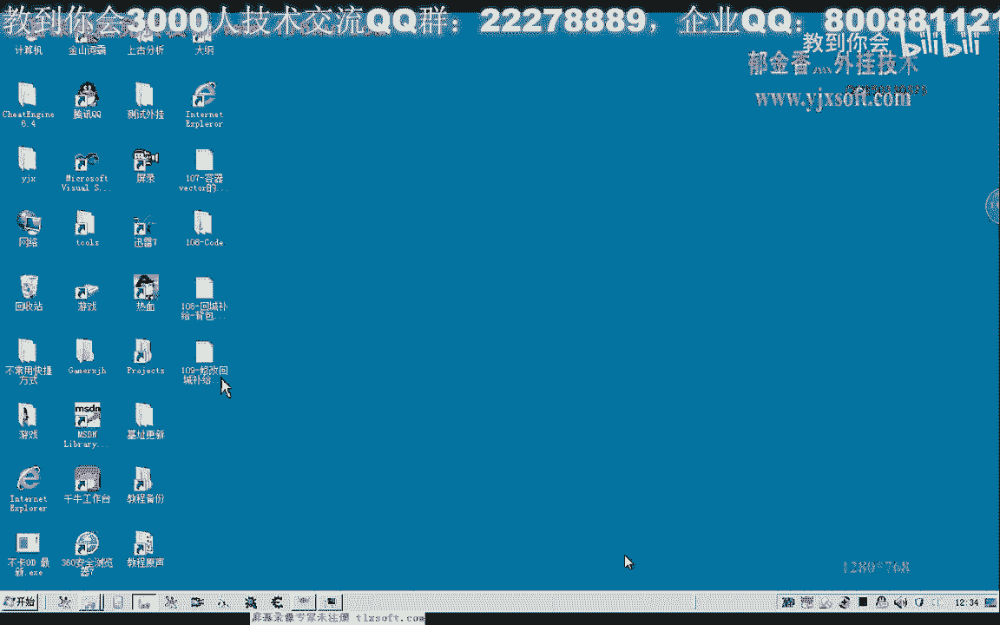
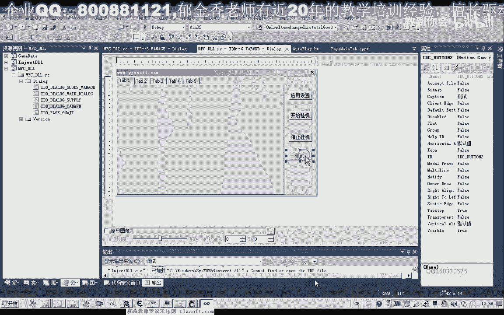
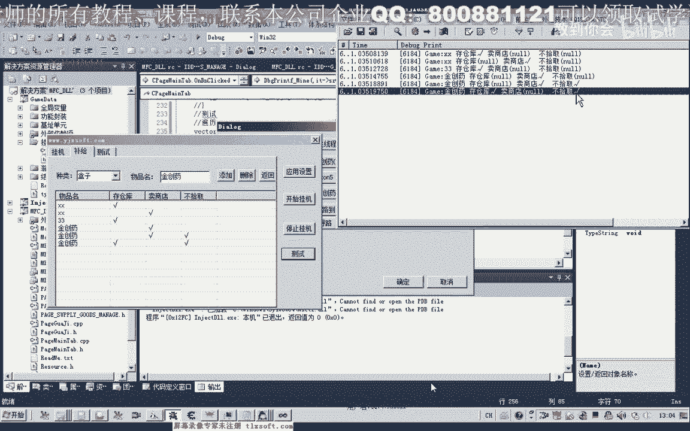

# 课程 P98：109 - 修改回城补给界面和更新窗口数据到对象列表 🛠️📋


在本节课中，我们将学习如何修复一个程序错误，并设计一个物品处理结构。核心任务是将回城补给界面（NIST country控件）中的数据，更新到玩家挂机位的一个动态对象列表中。

---

## 查找并修复错误 🔍

上一节我们介绍了物品处理界面的基本操作。本节中，我们来看看如何定位并修复上一课代码中的一个潜在错误。

首先，我们打开第109课的代码。错误可能出现在处理NIST country控件的函数中。经过分析，大部分API函数调用没有参数或指针访问，出错概率低。最可能出错的地方是涉及坐标访问的代码段，它可能导致数组下标越界。

为了验证，我们先将可能出错的代码段注释掉（使用`return`提前返回），并修复一些编译器警告，例如添加强制类型转换和使用安全版本的函数。这样可以使调试信息更清晰。

测试显示，当我们单击列表中的某一项时，相关处理函数会被执行多次（例如三次），这既不高效，也可能因重复执行导致异常。因此，我们需要优化事件关联。

以下是优化步骤：
1.  将处理逻辑从`LVN_ITEMCHANGED`消息迁移到`NM_CLICK`（鼠标左键单击）消息中。
2.  在单击事件的处理函数中，获取当前点击的单元格坐标。
3.  添加边界检查，确保坐标不越界，并且X坐标大于0（避免修改第一列的物品名标签）。

经过这些修改，代码执行效率得到提升，且错误得以修复。

---

## 设计物品处理数据结构 🧱

修复错误后，我们需要设计一个结构，用于存储界面中设置的物品处理方式。

这个结构需要包含物品名和一个`DWORD`类型的标记变量。标记变量利用二进制位来表示不同的处理方式：
*   **0**：不处理
*   **1**：存仓库（二进制第1位）
*   **2**：卖商店（二进制第2位）
*   **4**：不拾取（二进制第3位）

其原理是利用位运算。例如，数字 **5**（二进制`101`）表示同时选择了“存仓库”(1)和“不拾取”(4)。这种方式可以高效地在一个整数中组合多种状态。

我们定义结构体和动态数组（Vector）来存储这些数据：

```cpp
// 定义物品处理结构
struct ItemProcess {
    TCHAR szItemName[256]; // 物品名
    DWORD dwFlag;          // 处理方式标记
};

// 在玩家挂机位数据中，添加一个动态数组成员
std::vector<ItemProcess> m_vItemProcessList;
```

---

## 将界面数据更新到对象列表 🔄

上一节我们设计了数据结构，本节中我们来看看如何将NIST country控件中的每一行数据，提取并保存到我们刚创建的`std::vector`容器中。

逻辑是在用户点击“应用设置”时触发。我们需要遍历控件中的所有行，提取每行的物品名和三个复选框的状态，然后组合成一个`DWORD`标记，最后将整个结构体存入Vector。

以下是核心代码逻辑：
1.  获取NIST country控件的指针。
2.  循环遍历控件的每一行（`i < pList->GetItemCount()`）。
3.  对于第`i`行：
    *   取出第0列（物品名）的文本，存入结构体的`szItemName`。
    *   初始化`dwFlag`为0。
    *   取出第1列（存仓库）的文本，如果是“勾选”状态，则执行 `dwFlag |= 1`。
    *   取出第2列（卖商店）的文本，如果是“勾选”状态，则执行 `dwFlag |= 2`。
    *   取出第3列（不拾取）的文本，如果是“勾选”状态，则执行 `dwFlag |= 4`。
4.  将填充好的`ItemProcess`结构体通过 `m_vItemProcessList.push_back(item)` 加入容器。

这样，界面上的所有设置就被完整地转换并存储到了内存中的对象列表里。

---

## 测试数据读取功能 ✅




数据保存完成后，我们需要验证是否能正确地从Vector中读取并还原出设置信息。

测试方法是通过一个循环遍历`m_vItemProcessList`，对每个元素的`dwFlag`进行位与运算(&)，检查特定位是否为1，从而判断当初勾选了哪些选项。

以下是测试代码的关键片段：
```cpp
for (auto& it : m_vItemProcessList) {
    CString strStorage = (it.dwFlag & 1) ? _T("勾选") : _T("");
    CString strSell = (it.dwFlag & 2) ? _T("勾选") : _T("");
    CString strNoPickup = (it.dwFlag & 4) ? _T("勾选") : _T("");
    // 输出或记录 strStorage, strSell, strNoPickup
}
```
通过此测试，我们可以确认从界面设置到数据存储，再到数据读取的整个流程是正确无误的。这为后续根据这些设置自动处理背包物品的去向（存仓库、卖商店、丢弃）打下了基础。

---

## 总结 📝

本节课中我们一起学习了：
1.  **调试与优化**：定位并修复了因事件重复触发和数组越界导致的错误，将处理逻辑关联到更高效的鼠标单击事件。
2.  **数据结构设计**：创建了`ItemProcess`结构体，利用**位运算**在一个整数中紧凑地表示多种物品处理状态。
3.  **数据同步**：实现了将图形界面（NIST country控件）中的数据遍历、解析，并更新到内存中的`std::vector<ItemProcess>`动态数组。
4.  **功能验证**：通过位运算读取存储的标志，成功测试了数据保存与还原的正确性。



这些工作为自动化游戏角色物品管理功能实现了核心的数据支撑。下一节课，我们将基于这些数据，实现具体的物品处理逻辑。