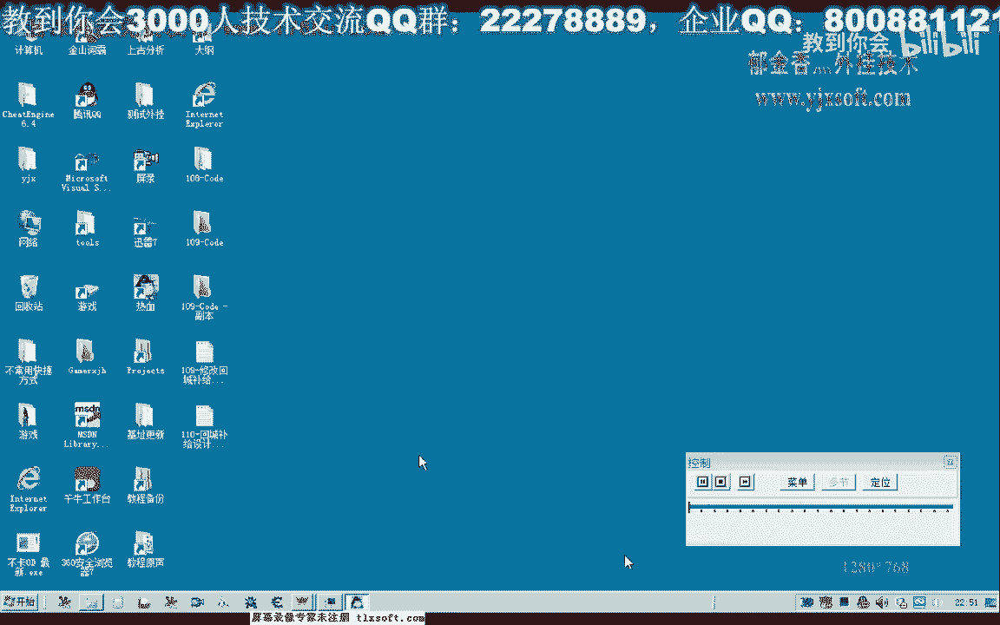
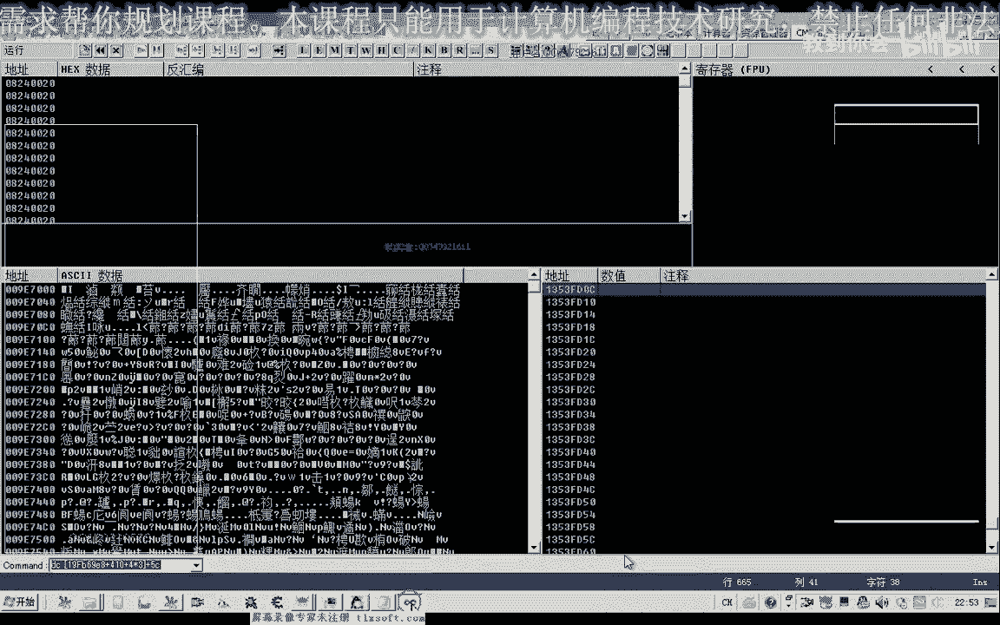
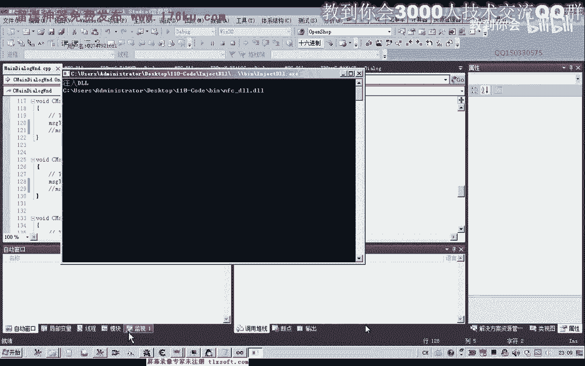
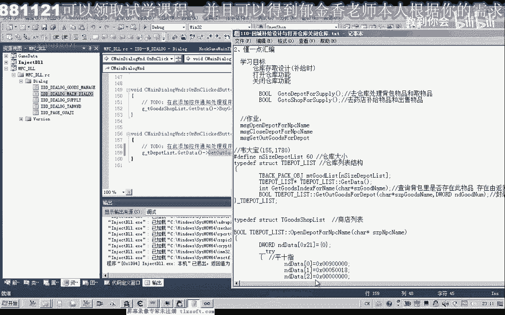

# 课程 P99：110 - 回城补给设计与打开/关闭仓库 🧳



在本节课中，我们将学习如何设计游戏中的回城补给功能，并重点封装打开仓库和关闭仓库这两个核心操作。

## 概述

回城补给功能可以划分为两个主要部分。第一部分是访问仓库，进行物品的存取操作。第二部分是访问商店，进行物品的购买与出售。本节课我们将专注于仓库部分的设计与实现。


上一节我们介绍了回城补给的整体设计思路，本节中我们来看看如何具体实现打开和关闭仓库的功能。


## 分析打开/关闭仓库的数据包



首先，我们需要分析游戏客户端与服务器通信时，打开和关闭仓库所发送的数据包。

以下是分析步骤：

1.  附加调试器到游戏进程。
2.  在发包函数地址处设置断点。
3.  在游戏中执行打开仓库和关闭仓库的操作，触发断点。
4.  记录下断点触发时，传递给发包函数的缓冲区数据。

通过分析，我们得到了关键数据：

*   **打开仓库**的缓冲区数据：`55 00 18 00 01 00 00 00`
*   **关闭仓库**的缓冲区数据：`02 00 18 00 01 00 00 00`

## 封装打开仓库函数

有了缓冲区数据，我们可以参照之前封装“打开商店”函数的代码，来封装“打开仓库”函数。

以下是封装 `OpenWarehouse` 函数的代码示例：

```cpp
// 函数声明 (头文件中)
BOOL OpenWarehouse(DWORD dwBase, const char* szNpcName);

// 函数定义 (源文件中)
BOOL OpenWarehouse(DWORD dwBase, const char* szNpcName) {
    // 构造打开仓库的数据包
    BYTE aOpenWarehouse[] = {0x55, 0x00, 0x18, 0x00, 0x01, 0x00, 0x00, 0x00};
    
    // 调用通用的发包函数，这里假设 SendPacket 是已封装的底层函数
    BOOL bRet = SendPacket(dwBase, aOpenWarehouse, sizeof(aOpenWarehouse));
    
    // 异常处理与日志记录
    if (!bRet) {
        // 记录错误信息：打开仓库失败
    }
    return bRet;
}
```

## 封装关闭仓库函数

同样地，我们封装关闭仓库的函数。

以下是封装 `CloseWarehouse` 函数的代码示例：

```cpp
// 函数声明 (头文件中)
BOOL CloseWarehouse(DWORD dwBase);

// 函数定义 (源文件中)
BOOL CloseWarehouse(DWORD dwBase) {
    // 构造关闭仓库的数据包
    BYTE aCloseWarehouse[] = {0x02, 0x00, 0x18, 0x00, 0x01, 0x00, 0x00, 0x00};
    
    // 调用通用的发包函数
    BOOL bRet = SendPacket(dwBase, aCloseWarehouse, sizeof(aCloseWarehouse));
    
    // 异常处理与日志记录
    if (!bRet) {
        // 记录错误信息：关闭仓库失败
    }
    return bRet;
}
```

## 功能测试

函数封装完成后，我们需要编写测试代码来验证其功能是否正常。

以下是测试流程：

1.  初始化游戏对象列表（例如怪物列表）。
2.  与仓库NPC对话。
3.  调用 `OpenWarehouse` 函数打开仓库。
4.  执行仓库物品存取操作（例如，调用已封装的 `GetItemFromDepot` 函数）。
5.  调用 `CloseWarehouse` 函数关闭仓库。

测试代码示例如下：

```cpp
void TestWarehouseFunctions() {
    // 1. 初始化
    GetNpcList(); // 假设此函数用于初始化NPC列表
    
    // 2. 与NPC对话 (需要先定位到仓库NPC)
    // OpenNpcDialog(dwNpcId); 
    
    // 3. 打开仓库
    OpenWarehouse(g_dwGameBase, "仓库管理员");
    
    // 4. 从仓库取物品 (例如：金创药(小)，每次取2个)
    GetItemFromDepot(g_dwGameBase, "金创药(小)", 2);
    
    // 5. 关闭仓库
    CloseWarehouse(g_dwGameBase);
}
```


通过多次执行取物品操作，可以观察背包内物品数量的变化，从而验证整个流程是否畅通。



## 总结

本节课中我们一起学习了回城补给功能中仓库模块的实现。我们首先分析了打开和关闭仓库的网络数据包，然后基于这些数据封装了 `OpenWarehouse` 和 `CloseWarehouse` 两个关键函数，并完成了功能测试。

目前我们封装的是直接调用的函数版本。下一节课，我们将把这些功能进一步封装成通过**窗口消息**触发的形式，以便更好地集成到自动化主线程中，使代码结构更清晰、更易于管理。

## 课后作业



请尝试完成以下练习：
1.  根据示例，在您的工程中成功实现并测试打开与关闭仓库的功能。
2.  （进阶）思考并尝试将 `GetItemFromDepot`（从仓库取物）函数也改造成通过发送消息来调用的形式。