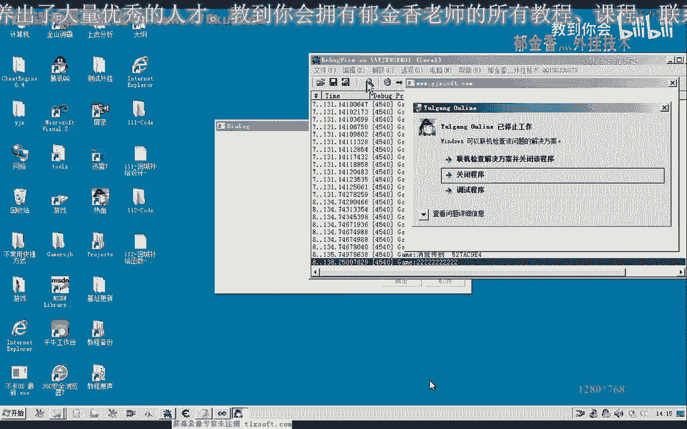

# P101：112-回城补给函数-仓库存取部分GotoDepotForSupply() - 教到你会 - BV1DS4y1n7qF

大家好，我是俞其鑫老師，這集我們一起封裝一下去倉庫，記得這個函數，那麼也就是處理我們相應的列表裡面的一些東西，包括我們列表裡面要處理的這些物品，它的一個去向，比如說金創要小，比如說我們要存放到倉庫裡面。

或者是其他的物品要存放到倉庫裡面，還有往我們的倉庫裡面取物品出來，那麼這些都在我們倉庫補給的函數裡面實現，那麼回程補給我們把它分為兩部分，另外一部分就是去商店進行補給或出售物品，那麼這裡因為存備包物品。

我取倉庫物品出來，這兩部分，好的，那麼我們具體我們打開第111課的代碼，那麼我們通過代碼來說明我們要做什麼，那麼首先我們轉到掛情侶這個單元裡面。

那麼在回程補給的函數前邊，我們添加相應的說明，那麼一個就是去倉庫補給的，那麼另外一個函數的說明也可以把它添加進來，當然了，這個的話暫時來作為一個作例，大家下去完成，好把這兩個函數複製一下。

轉到回程補給這裡，那麼在這上邊，它的前邊添加這兩個函數的定義聲明，那麼執行完之後，成功了，我們返回一個增值，複製這一部分，下面的也是這樣來完成，那麼這樣我們就定義了兩個空函數。

那麼接下來我們就要在裏邊實現我們的功能，那麼我們的功能主要是針對這兩個，WCAT的這兩個列表來實現，也就是這兩個變量來實現，那麼我們首先是處理我們的物品補給的，這個數據，另外是處理物品續項的一個數據。

當然前面我們要跟它加上一個作用率的限定，這樣才是我們內部的一個成員函數，那麼首先我們處理第一個補給的數據，那麼它從我們的界面窗口來更新到我們補給數據之後，這裏面它包括幾個部分。

那麼一部分是去商店補充的物品，它也在這裏面，那麼這裏是去商店我們要出售的物品，也在這個裏面，那麼包括我們要存放到倉庫的數據，也在這裏面，在這裏面的話，我們只取存倉庫的這一部分，取存倉庫的數據。

那麼在這裏的話，我們只取了在倉庫補給的物品，那麼我們要把這些物品取出來之後，然後再到我們的倉庫裏面進行我們的存放操作，那麼首先我們肯定要尋入到我們的倉庫裏面去，然後我們倉庫的相應的座標，我們看一下。

當然這個我們後邊我們還要把倉庫的座標，NPC的名字與我們的地圖的ID進行一個關聯，這樣我們才可以因為不同的地圖的話，它的倉庫的座標的話肯定是不一樣的，那麼這個我們在後邊再進行細化完善。

那麼暫時我們就用現成的座標直接來實現，那麼這是去偉大堡的座標，那麼我們再對這個函數來進行一些修改優化，在這裏的話，我們執行了尋路，本來看著是沒有什麼問題的，那麼如果我們沒有人為的一個干預的話。

這樣執行是沒有問題的，但是有時候我們在動手錶的時候，它影響到了它最終的一個目的地，那麼就導致了我們的尋路會被中斷，那麼所以說我們在這裏邊距離還沒有到達的時候，這裏我們也可以修改大一點，距離判斷的時候。

沒有到達目的地的時候，我們可以多次的調用這個尋路系統，那麼這裏的時間我們可以給它設置大一點，好的，按下抗摧解放退回，那麼我們尋路完成了之後，然後我們再次我們打開NPC對話。

那麼這裏的話實際上我們可以根據，因為不同的地圖，通過不同的地圖的ID來關聯一下，寫一個結構，那麼這個結構的話，裏邊有這兩項，當然這是後期的一個設計，這裏邊一個是NPC名字，倉庫NPC名字。

那麼還有一項應該是我們的，那麼這個結構的話，倉庫NPC名字，第一個應該是地圖的ID，地圖ID倉庫NPC名字，另外就是我們的倉庫NPC座標，那麼應該包括這三個項。

那麼到時候我們可以通過當前地圖的ID去查詢，查詢到相應的一個訴訟裏面，那麼我們就獲得NPC的名字，我們寫的座標，到時候我們可以寫一個函數來完成，當然這個我們後期再設計，先提一下。

那麼暫時我們就用固定的數字來實現，這裏就用我們大寶，那麼打開之後，這裏我們要緩衝一段時間，讓我們的服務器有一個反應的動作，那麼這裏我們一秒鐘的時間讓他做一個反應，然後再次我們打開NPC對話之後。

然後再打開我們的倉庫，這裏也是通過他的名字，那麼後期的話，在這裏面的函數，我們都還要進行一個細化，因為名字不同的話，表示了我們的地圖也不一樣，那麼我們也要根據這個還要需要來根據。

我們的NPC的名字去查到，他相應的地圖的ID，或者是其他的一些關聯的一些數據，要去查詢，好的，那麼我們先暫時我們就可以這樣設計，那麼打開倉庫對話之後，這裏我們再給他一段時間。

然後再開始我們的物品的存取的一個操作，那麼物品我們究竟要存放什麼物品，要取什麼物品出來，那麼這些信息都在這兩個Wikipedia容器裏面，那麼接下來我們在這裏定義一個。

用來遍擬這兩個Wikipedia容器，相當於是列表，那麼我們先定義相關的數據，那麼第一個我們是倉庫裏面，記的這個數據，那麼在這裏來定義一個變量，然後要對他進行一個複出值，他的一個出值的話。

就從這裏面來取，那麼他的出值就等於他的begin，他的起始位置過去，那麼然後再來進行一個後續化，他的出值部分我們就不需要了，然後我們直接做一個條件判斷，那麼他小於我們的Wikipedia，小於的。

那麼每次要同意了，加一下，然後我們在裏面再對整個這個，對他的相進行一些處理，那麼首先我們要明確他的一個去向，那麼是不是我們的倉庫的，也就是他的一個地址，那麼他在這個地址就是我們當時的，倉庫或者是要店。

那麼在這裏我們要用一個，支算比較的函數來進行一個比較，那麼如果他裏面取出來的地址是倉庫，那麼我們再進行接下來的一個操作，如果是倉庫的話，接下來就進行一個操作，那麼進行什麼操作。

那麼在這裏我們就取出相應的物品，但是我們應該是先存放這個物品在前面，先遍離這個數據，那麼成了之後，我們再去這樣我們的背包的話，他可以多放一些東西，因為我們清理了相應的背包的數據。

當然最好是我們存放了物品之後，又出售了這個物品，然後再來補給這個物品，這樣的流程是最恰當的，那麼我們還是先存放物品，那麼在這裏我們另外的用Vector，定一個相應的指針，當然注意這個類型他又不一樣了。

那麼這裏我們改為就是IT，這裡我們是一體一，那麼他也需要附一個儲值，那麼在這裏也需要用一個活詢化，那麼對他進行遍離的時候，這裏我們處理的方式有一點不一樣，因為他的結構不一樣。

那麼下面我們直接是用字串來判斷的，這上面我們為了節省空間就沒有字串，而是用一個Dword的標記來進行判斷的，那麼首先我們就要取出這個標記，那麼這個標記的話是。

NP-Word-Blogger-Manager，那麼這個標記的話，我們要取出裏面的一個數字，那麼他裏面的數字，我們就要看，那麼是不是要去倉庫進行操作，要把這一項取出來，那麼如果這一項取出來的值。

它是大於也就是不等於0的，因為他取出來就只有兩個數值，一個是等於0，另外一個也就是大於0的這兩種情況，那麼這個時候我們對他進行一個判斷，那麼如果這個數值是大於0的，那麼表示的話就要去倉庫。

表示列表裏面的物品去向的話，就是什麼呢，要去倉庫進行操作，也就是我們裏面打了一個勾，要存放到倉庫，這裏，那麼我們先編譯一下，那麼我們先注入一下，看一下這個例子，當然這個時候我們可以掛機，這個屬性程序。

我們就來看一下這個物品處理，比如說我們要到倉庫裏面去取精創藥小，取110個出來，好，那麼這裏另外的還有一個物品的一個處理，當然這個種類我們暫時可以不分它，那麼這裏也是如果有精創藥小。

背包裏面所有精創藥小的物品，那麼我們存放到倉庫，那麼另外的精創藥大，那麼比如說這個我們賣給商店，那麼我們比如說這樣設計，然後比如說另外的強化石，也把它存到倉庫，那麼另外我們還有比如說有羅漢富士。

那麼這個我們要把它存到倉庫，那麼比如說我們還有一個機器，那麼這個我們的去向也是存倉庫，那麼所以說在這裏的話，我們在編成的時候就要判斷，這裏它是否打了勾，那麼打了勾的話，它相應的標記，這裏就有一個標記。

那麼這個物品如果是標記了，要存放到倉庫，那麼我們還需要在背包裏面查詢這個物品，它究竟在背包裏面有沒有，有的話我們才往到倉庫裏面傳，如果這個時候背包裏面它不存在這個物品，那麼我們就直接進行下一次循環。

那麼所以說這裏我們還需要來通過背包來查詢，然後來查詢，那麼在這裏我們也要定義一個變量來查詢，那麼如果查詢的數值它是大於或者是等於零的，就表示了是我們的查詢到了相應的座標，如果它返回的數值的話是負1的話。

就表示這個物品它是不存在的，那麼所以說在這裏我們也要加上一個判斷，那麼如果這個數值它小於零，也就是說等於負1了，或者是直接等於負1，那麼這裏我們就continue，繼續下一次循環。

那麼如果這個數值它是大於1的，也就是我們只有在大於1的情況下來，我們才會執行到最後一遍，就在大於等於零的情況下，就執行到這裏，那麼執行到這裏的話，我們才開始存放我們的物品。

那麼我們存放我們的物品到我們的倉庫，那這裏還有一個問題，那麼我們在存放的時候，我們還需要有一個物品的數量，那麼我們究竟存放多少的數量，那麼這個數量的話，我們也需要在背包裏面查詢。

那麼在這裏我們再另外定義一個函數，那麼這個函數，我們就可以通過下標來遍離這個數值，獲得它的相應的一個數量，那麼也是背包相關的一個數值，好，那麼我們的數值，然後是數值的一個下標，那麼下標取出來之後。

它裏面有很多屬性，這個解析度裏面有很多相應的一個數值，那麼我們取相應的數量，數量出來之後，那麼在這裏我們就可以直接傳入了，當然也可以直接把這一句寫在這個地方，但是這樣的話，我們代碼看著太長了。

我們在閱讀的時候不是很方便，那麼所以說這樣寫的話，我們可圖性要高一些，好的，這裏我們可以退出來了，也就是這個列表的一個處理，那麼還有也就是這個補給列表的一個處理，那麼上面的列表處理完了。

我們接下來就要處理補給的列表，先退出來，好，沒有錯誤了，我們再進行下一步，那麼下一步的話就是這裏的一個片尼，它的一個片尼的一個數據的話，我們也可以參照上面的來執行，那麼這裏我們應該是取物品出來。

那麼取物品出來之後，我們也需要了裏邊的話也差不多，先要查詢一下它的一個下標，但是這個時候我們不是查詢背包了，而是要查詢我們的倉庫，那麼這句我們也把它放置下來，做一下修改，那麼在這裏的話。

我們查詢的將不再是背包，而是查詢的倉庫，那麼查詢了之後，也要看紙巾的物品在倉庫裏面是否存在，那麼如果這個物品不存在，那麼再繼續，那麼如果物品存在的話，就取出物品，那麼如果物品存在的話。

我們也需要獲得這個物品的相應的一個數量，那麼它的方法也與我們上面這段類似，那麼這應該是倉庫的背包，那麼這裏我們也需要改變，那麼這裏我們取的倉庫裏面，它在倉庫裏面的一個存量，那麼取出來之後。

我們再進行物品的取出的一個操作，取出相應的物品，然後再是我們的物品的名字，然後再是我們的數量，當然這個數量的話，因為這裏我們的數量，它是查詢的一個數量，那麼具體取出的數量，它也有一個數量。

那麼這兩個數量，我們究竟使用哪一個數量，如果我們指定的要從倉庫裏面取出100個金創藥小，但是倉庫裏面只有50個，那麼你取100個的話，這個時候就不成功，就最多只能取50個，那麼所以說這兩個數量。

我們要進行一個比較，進行一個比較，那麼哪一個數字小了，我們就取哪一個，應當來說的話，我們要取小的一個數字，那麼如果這個數字小於我們的，這個Wicker結構裏面的數量的話，我們來看一下。

這裏Wicker的結構，這裏是1：1，我們不應該再用這個1：1的話，就是錯誤的，因為這兩個結構它也不一樣，也不能夠用錯，那麼這裏有一個物品的數量，那麼如果它應該說這個數量，物品的成量，它要比我們的大。

比這個大的時候，我們就直接把這個數量，或者為小的一個，那麼我們就進行一下複習，那麼如果它本身就比它小，那麼我們也是取了小的數字，小的這個數字，那麼我們就保證我們能夠，從倉庫裏面取得相應的數據出來。

相應的物品出來，所以說這裏要加上判斷，不然的話有可能倉庫裏面的，這個存量不足的時候，那麼我們就取不出來這個物品，好的，我們邏輯上大概就是這樣，那麼我們編譯生成一下，再檢查一下有沒有相關的錯誤。

那麼最後我們這裏操作完了之後，我們需要再關掉NPC，關閉我們的NPC對話，應該是關閉倉庫，這個對話的產品，然後這裏寫上它的名字，好的，那麼接下來我們就可以進行相應的測試，那麼我們還需要在這個。

注意測試的話，我們應當是要不要直接測試，也不要掛接在主線程，我們應當是在這個，我們在現成的回調函數裏面，來執行操作，應當才是正確的，那麼我們再看一下有沒有需要修改的地方，那麼這些取得數據的話。

理論上可能不會出錯，那麼調用Core的時候，沒有掛接到主線程，沒有掛接到我們的主線程的話，它是容易出錯的，那麼像這種情況，它也有一些很小的安全的一些情況，可能這個數據會出現一些衝突。

因為我們如果是直接在現成裏面用的話，畢竟我們這些數據它沒有掛接到主線程，那麼我們到時候需要把這個函數，單獨的還需要封裝一下，為了解決數據衝突的問題的話，當然如果是短時間的運行的話，它應當是沒有這個問題。

那麼我們先測試一下功能上完不完善，那麼完善了，我們在後期的時候，可以把這些函數單獨的再封裝，掛接到我們的主線程上邊，對了，這兩個操作之間，我們最後再跟他加上一個延遲，那麼也就是說，如果沒有延遲的話。

可能我們那邊的相應的物品，存放到倉庫裏面，倉庫裏面的數量可能還沒有更新，那麼在這裏我們取的時候，可能就是說他取的數字可能會造成不對，那麼在這裏我們可以加上一個延遲，這個時候因為他把數據發到服務器之後。

服務器有一個反饋的過程，那麼這裏需要給他一點時間來反應，那麼比如說我們這裏倉庫裏面，比如說沒有金創藥箱，那麼我們這裏存放了97個進去，但是由於數據沒有更新，那麼可能的話在查詢倉庫的時候。

它不存在金創藥箱，所以說這裏我們需要給他一段時間來反應，好的，那麼我們輸入到裏面，掛機出現程，對了，我們還需要在測試裏面，添加我們的測試代碼，或者是直接的放到我們，應該是直接放到我們的回調函數裏面。

掛機錄影，回調函數裏面進行，不然的話放在窗口裏面，單獨的測試的話，它會把窗口會就是說卡死，會造成窗口的一個卡死的狀態，那麼在前面我們就單獨的測試一下，go to，deploy，BossPlay。

這個是回倉庫補給，那麼回倉庫補給完成之後，這邊我們因為是為了做測試，那麼我們就直接返回，不讓他反復的循環做這個動作，注意這一點的話，一定要放在現成裏面，才能夠完成測試，如果是放在窗口裏面的話。

他可能因為這裏面用了Sleep的這些函數的話，他可能就會造成我們窗口的一個卡死的狀態，記住一定要放在現成裏面，好的，掛機組建成，然後我們顯示一下補給的窗口，那麼到要店的這個，我們暫時沒有處理。

這段肯定都是過濾的，所以說添加的這些數據會被過濾掉，那麼我們要添加的是等於倉庫的，比如說我們從倉庫，補給58個，這個金創要小，但是現在倉庫裏面還沒有藥品，我們要當這只是為了做測試，我們需要在裏面先存放。

在這個列表裏面，我們先把金創要小，背包裏面的金創要小，先存放到我們的倉庫裏面，那麼他的去向我們選倉庫，那麼還有一點，在存放倉庫的時候，我們看一下他的一個數量，存取倉庫，應該有兩個動作，一個是存放到倉庫。

下方的是從倉庫裏面取的，存放的時候，我們看他的一個數量是偏離背包來實現的，這個是正確的，好了，那麼我們繼續添加我們的物品，那麼我們看一下背包裏面還有一些什麼，還有一個輕易短切，我們也把它存放到倉庫裏面。

這個也存倉庫，那麼我們再測試一下，有一部分物品，我們比如說人參，還有強化石不需要存倉庫，那麼我們也把它添加在這個列表裏面，強化石，他的去向，我們比如說應該是賣商店，還有就是我們的人參。

那麼人參這個我們就不處理它，主要是我們看這些邏輯上有沒有錯誤，會不會我們沒有勾選他，他也把它存到我們的倉庫裏面去，然後我們應用設置，查看相關的調試信息，然後再看一下，他的一個走向，開始掛機。

那麼這裏有一個錯誤，我們看一下，他說Wikr在70行裏面，這個Wikr，應該是Wikr相關的出了錯誤，我們先復頁掉，然後推出出錯了，那麼我看一下我們的代碼說明有問題，Wikr相關的，他開始沒有出錯。

那麼後來出錯的可能是在這個位置出現的，這個錯誤，那麼我們檢測一下，還是從最前面的我們開始檢測，那麼這裏首先是一頭，複製為PK，是++，最後它的值應該是小於它的N的，那麼我們再看一下，下面有關Wikr。

這裏，sizeboost，那麼這裏應該是錯的，會執行到這裏，那麼倉庫裏面保存物品的時候，我們應當是neat。sizeboost，那麼還有它的一個數量的話，應當是背包裏面的數量，這個是沒有錯。

這裏有去錯誤，neat，那麼我們再看一下下面，檢測一下這裏的代碼，neat，spline，這個這裡條件的話都看不出錯誤，然後我們在這裏看一下，neat。size，那麼我們主要是看一下有沒有用錯。

這裏的Wikr，那麼暫時的話，我們沒有看出錯誤，那麼我們在這裏來給它添加一個相應的異常處理，那麼如果出現了異常之後，我們把相應的neat的值來給它打印出來，那麼我們在這裏添加一個數據。

那麼如果執行到這裏的話，就說明的話是後面的Wikr造成的，那麼我們就能夠縮小它的一個範圍，好了，重新編譯一下，那麼再次我們打開遊戲。

好的那麼我們再次輸入我們的代碼，再看一下有沒有錯誤，那麼首先掛接處顯示外掛，那麼首先我們是去倉庫，從精裝藥行，然後比如說這裏我們從110一個，然後藥店裏面去補充其他的物品。

然後在這裏我們看一下背包裏面還有些什麼東西，輕易短缺或強化食物，那麼我們把他們都存倉庫，嗯嗯嗯嗯，好，(音量注意)，(音量注意)，(音量注意)，(音量注意)，(音量注意)，再看一下有什么物品。

还有这个一元身，那么这个一元身我们不处理它，还有一个钥匙，那么这个我们把它存到仓库，好的，应用设置，然后开始挂机，相应的物品我们都存放到了仓库里面，虽然说存放到了，但是这里它出现了一段错误。

那么这个错误是打印了这段消息之后再出现的，(音量注意)，那么说明这个异常的话，应当说是在后边产生的，那么我们来看一下它有没有取出相应的物品，那么这个时候的话。

游戏已经推出了，那么我们再来看一下后边这段代码，它有没有错误，Getting a Dexframe Name，Vector，它报的是Vector相关的一个错误，(音量注意)，对了，这里我们用了一个异体。

因为这个的话，在这上面的话，它已经就是片里完成了，完成了之后的话，这里的@++，它肯定指向了，就是说我们这个时候，它已经指向了最后了，指向了一个未知的一个位置，那么这个时候，在后边再来访问它的话。

肯定就会出错，从仓库取物品的时候，(音量注意)，那么这应该是一体一，所以说在取名字的时候，在取变量名的时候，也要注意，最好是不用这种什么，IT1，2这样来命名，那么我们最后来另外给它取一个名字。

可能要好一些，当然这里我们就不做修改，那么可能就是因为是这个错误，在这里的造成的这一局，好的，那么可能的话应当来说没有其他的错误，那么我们再次进行游戏，再进行做一次测试。

那么这次成功的话，那么今天的课程我们就到这里，好的。

那么游戏打开之后，我们再次进行测试，挂接主页层显示外挂，然后要键这里，那么这里的话是不会被处理的，因为在判断关键时的时候，它就被过滤了，它现在只处理仓库相关的，好的，那么我们在这里再加上精装药箱。

精装药袋，再补气一点，也可以多次，好的，那么在物品处理列表里面，我们在这里再加上，很残酷的物品，然后我们再看一下背包里面，有些什么东西，罗汉附送，轻易短信，好的，这些东西我们全部存放到仓库里面。

那么人身，这位的我们不管它，还有义元身，那么还有一些什么，看一下，还有一个血缘身，那么我们把所有的义元身，存到我们的仓库，那么人身卖给商店，血缘身我们不管它，好的，那么我们应用一下，应用一下设置。

当然这里，这些代码我们还没有添加，网上，那么下一节，我们再修正一些错误，把这里的代码再给它补上一笔，那么这一节，如果是测试成功的话，我们就到这里，那么我们进入先看一下，应用设置，那么所有操作。

这个时候都是完全的，一格中存放物品的上限为多少，多少个，那么可能是某一个物品的超限了，还有一些在存放物品的时候，可能出现了一些错误，也不是什么大的错误，数量上可能出了一点错误。

那么这里要取出来的物品也取出来了，那么没有大的错误了，那么这一节看我们就到这里，那么它的错误的话，我想的话，可能是我们的Vector，这里初始化还有一些问题，这个地方，我们来看一下应用这里。

那么应用设置这里，因为我们每次它都会向里面不断的添加物品，但是Vector的相应的数字，它每次没有做一个初始化，没有清空，那么我们需要在相应的数字这里，需要做一些清空的一些操作，那么我们把这段复制一下。

那么补给列表的话，它在每次的再往列表里面添加，从我们的空降里面，每次向里面添加数据，那么在添加数据之前的话，我们在片尾之前，那么跟他做一个清空的操作，不然的话，它同样的列表数据的话。

它在那边的话是越积累越多，那么后面的还有一个列表，我们也需要给它做一个清空的操作，物品去向的一个列表，好的，那么这里我们就不再做测试了，那么这期我们就暂时就到这里，那么下去之后，大家可以尝试一下。

把这相应的这些代码给它添加完善，更加完善一点，比如说我们的物品处理，这里的我们删除某一行的数据，这一类的，那么另外还有一个作例，也就是回去下去之后来写一个，到我们药店补给物品的函数。

那么这个函数来要求我们，要往商店里面出售物品，还有在商店里面买物品来补给，也是通过刚才的这两个容器列表，那么它的写法的话也基本上是类似的，就如对大家练练一下手，好的，那么我们下一节课再见。

