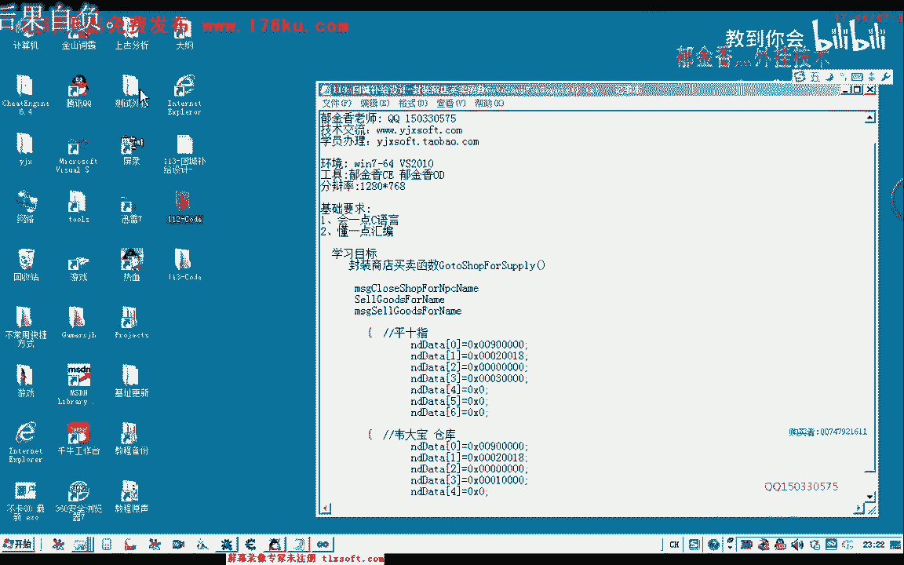
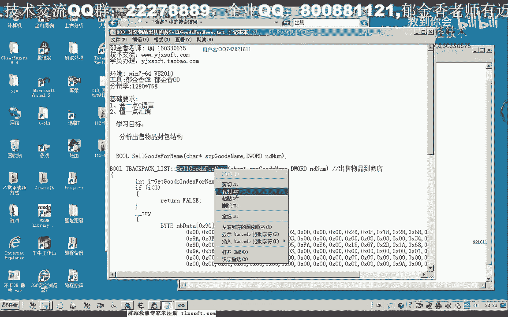
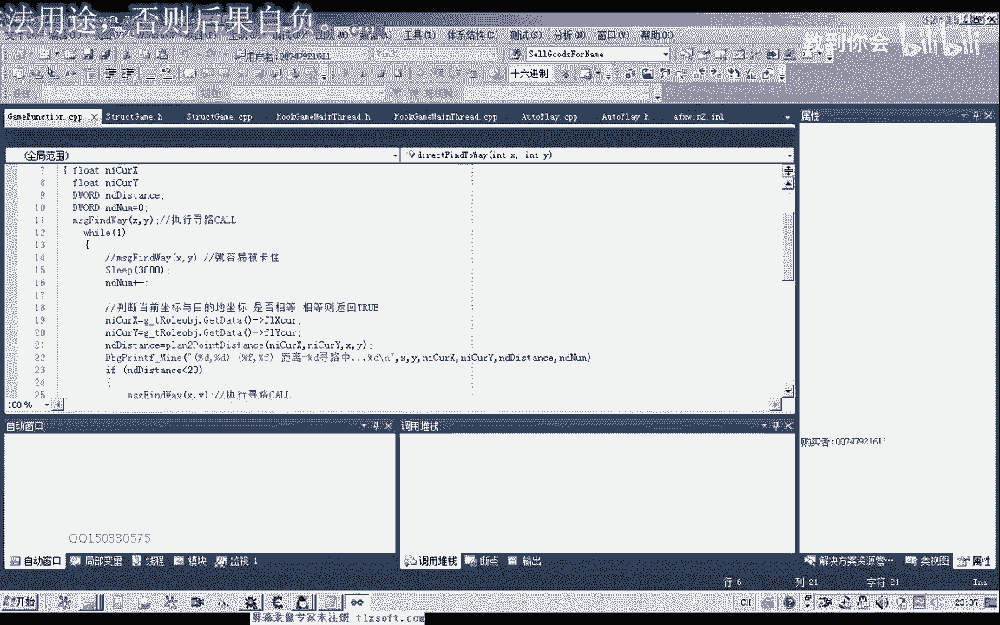
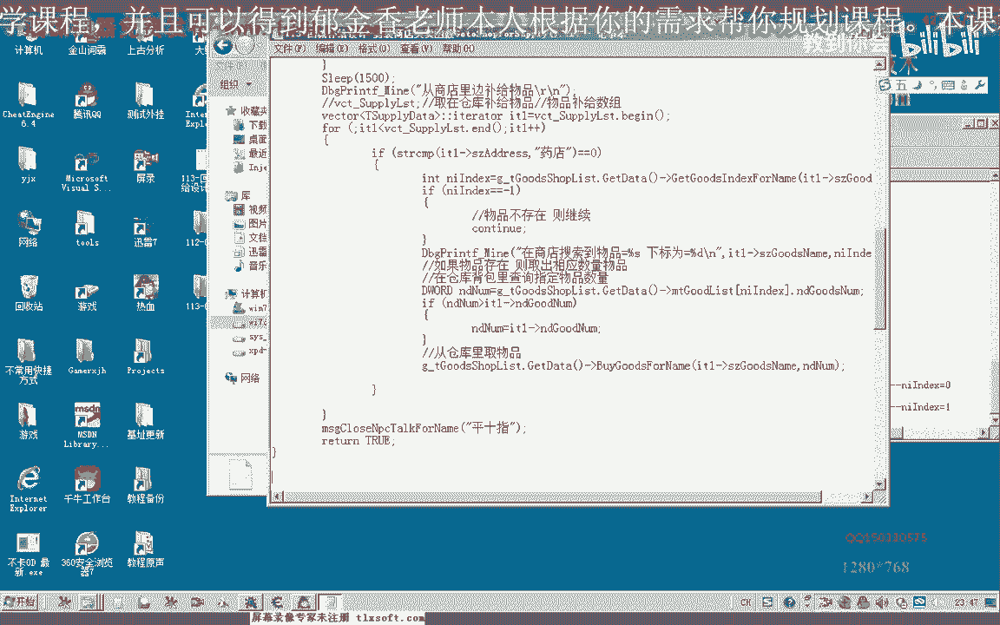

# P102：113-回城补给设计-封装商店买卖函数GotoShopForSupply() - 教到你会 - BV1DS4y1n7qF

大家好，我是郁金香老师，那么之前我们写过一个回城补给的这个函数呢，它的这个功能的话也类似于我们的这个去商店普及啊，因为当时的话我们就是去药店啊进行这个呃药品和补剂，当然现在我们还多了一些东西。

要把我们没有用的这些物品呢要出售给我们的商店啊，多了一个流程，那么好的，我们在112课的这个代码上来进行一些修改。

那么因为我们有了前面的这个基础的话，我们可以直接的在这个回到仓库补给的这个函数呢，在它的基础上呢，我们进行修改的话可以很方便，那么我们先找到相应的这个函数，那么我们先移到去仓库补贴的这个函数这里。

哦哦那么到了这里之后的话，我们来看一下啊，当时失去五大宝，那么我们把这里边的代码把它复制一下，那么该改的地方呢，我们把它改一下就可以，那么复制复制好了之后呢，我们这里呢是去商店啊进行一个服务器。

当然这个代码的话与我们下边的这个回城补给的话也有一些相似之处，那么因为我们在这里呢，首先寻路的这个坐标的话，我们需要了寻路到平时指这个地方，我们把这个回程补剂的这个函数的话。

这一部分呢我们把它复制到上边来，那么这个是平时值，那么去商店的话，我们现在呢就是去这个平时指这个地方，那么最后呃这里补给完了之后呢，我们再来看一下最后的这嗯，这里我们当时要关闭的也是pc值，pc。

当然在这里的话我们应该是关闭商店，就但是这个函数好像是没有的，我们看一下有没有这个函数，嗯那么没有这个函数的话，我们还需要来封装一个这个函数，close说，那我们看一下前面的一个函数的命名方式。

在它的基础上，那么我们进行修改，那么在这里我们需要做的第一步流程呢，也就是封装这个函数啊，那么除了这个函数之外，我们看一下前面的这个打开mp 4，这里呢我们也是pc，那么这里我们也先把它改为p40 。

但是这里呢也是打开我们商店的话，也是呃服装到这个函数数啊，那么这个函数呢我们有封装啊，有封装的话，我们直接切换到这个地方来，添加一个关闭mp 3的这个函数的一个定义啊，转到森林这里。

那么这里有一个msg close npc或类，那么这个函数我们看有没有定义，再看一下它相应的一个处理，那么当时呢这个呢是以平时只作为一个例子呃。

这里的话我们还没有跟它添加相应的关闭m p c的这个操作的话，我们还没有添加一个相应的开始结构，那么实际上我们也可以把它写在一起啊，这里的话呃可能是出口放p c v嗯，那么我们来看一下啊。

这里的话它本身就是关掉这个平时指的这个操作啊，当然我们可以把韦大宝的这个关闭呢也把它添加到这里，那么这两个的话我们看一下啊，可以把它的数据那么复制出来做一下对比，那么这是平时指的，那么另外一个的话。

我们来看一下关闭仓库的这个，线程单元，那么这个是关闭仓库的，那么我们查找一下这个的开始处理，那么这里的话仓库呢它的这个缓冲区不一样，但是它们的结构的话都是一样的，两个n p c。

那么我们看一下它们的结构的话，前面的啊这个代码可能呢这一段代码的话就是表示我们关闭仓库，然后在前面这一段啊，那么这里呢他是三，这里是一，那么我们可以这样理解啊，这在这里的话。

这里我们可以把后面的这一段删除掉，那么也就是说我们可以定义一个结构的话，那么如果npc的名字是嗯，是平时指的话，就是三，是仓库的话，就是一，那么我们可以建立这样一个结构啊，通过这个平四指的一个判断。

或者说通过一个平时指的判断来为这个nt代替代替三，这里来进行一个复制啊，好的，那么我们可以先把可以另外的封装一个函数，也可以呢，在我们的呃关闭这个n p c或类这个函数上面进行一个修改。

那么我们先在这里边啊添加相应的这个，功能做一个开始的一个结构，在这个close token和pc内这里，那么这是平时值，那么当然还有另外一种方式呢，我们直接啊，这里呢表示仓库为大宝。

我关闭五大宝的这个操作，那么实际上它就只有一个nt代替三类不一样啊，那么我们在这前面呢可以给它附一个这样的一个数值，当然这前面的这个数值的话，我们就可以不要了，这个nt dt。

那么在这里我们直接给它复制一点就可以啊，这前面的都可以不要这样写的话更简单一些，然后呢我们用一个开始结构或者是做一个这个相应的这个判断是tt，因为这个开始结构的话，它不支持我们字串尺寸的一个判断。

那么在这里呢我们直接对这个npc的名字进行判断，那么如果是平时，那么在这里呢我们就改变它的这个相应的这个数值，那么实际上我们在这里的话还有另外的一种写法啊，那么我们可以看一下，那么如果我们这里。

这里加三的话，我们可以直接对这个nt代替了，把它转换一下类型，当然我们最最容易理解的话，如果是平时指啊，那么在这里呢我们就等于三，那么如果是其他的一个数值20，你那么如果是韦大宝的话，就不足为一。

那么这个地方呢不止为一，我们看一下是不是这样的，韦大宝，这里是一个，好的，那么我们在在这里的话，123的话，实际上呢我们还有另外的一种写法，那么我们可以前面的八个字节来加上低位的这两个字节呃。

然后的话它就是多少呢，就是9a然后这个地方的话呃应当是0p好像施工再来计算一下啊，这前面的占八个字节啊，从这里这位应该是，这里应该是零碎了，这里应该第一个词也是零碎的冥币，然后呢，这里是冥帝啊。

应该是冥帝，那么这个地方的话我们可以这样再写，另外定义一个指针指向它，恰皮的，那么这个p得体的话，我们复制为nt大体，指向这个数字，在这里呢我们强制的把类型给他转换一下，然后呢我们定位到这个位置。

那么我们说的啊这里的话应该应当是0c啊，这个自己0b，那么这个季节的话是从平地开始的，那么如果我们是从数组来计算的话，我们还可以来把这里的定义成啊word的这个类型也可以。

那么word的话这里的我们看一下这里的话我们叫什么事啊，那么这里应该是012345，那么这里呢应当是下标为六啊，这里的话下标应当是为七，这样才对啊，你再数一下音12346，那么这里是v7 啊。

那么我们在这里的话就可以写为呃p代替七，那么我们复制为三啊，这样就可以了，那么这种方式的话可能更简单一些，那那么这两个应当是等价的p的t那么七负值为三，那么这一句与前面这一句呢它是等价的。

但是我们表示的话啊，更方便一些，好的，那么我们暂时就用这种纸巾的方式来进行一个访问操作啊，因为他这个word它是在两次节的下标不一样，那么从这里呢他这两个字节它代表的是零下标啊，在高位的下边是一啊。

然后呢这里是2346啊，这里呢这两个字节的话就是我们看下标题，好的，那么我们直接来这个关闭m p c的这个操作的话，我们就直接调用这个怪物列表的来实现啊。

这样当然现在我们只添加了一个平时只和一个伟大宝的一个操作，那么但是呢我们如果是在这里边没有找到这两个npc的时候呢，它也会调用这个默认的这个关闭，那么这个默认的关闭的话，我们之前的操作的话。

好像它也可以啊，关闭其他的这个n p c操作，那么与这个数据的话好像关系也不是很大啊，但是如果是有关系的话，我们就可以用这种方式来处理好的，那么我们这里呢我们就啊不其他再封装相应的这个函数。

就直接调用这个m s t close npc脱口或定，那么我们再转到这个主线程单元啊，在这里的话我们就会调用专门的这个关闭商店的这个函数，那么我们仔细的调用啊，呃cos n p c或平行时好的。

那么我们再接着看下边的，再编译一下，那么这个时候没有错误，我们再来看一下这个流程的一个处理，那么这里呢同样的我们是先是一个呃到商店之后的话，我们寻路到商店之后呢，然后呢我们打开这个商店啊买卖。

然后来骗你这个物品处理的列表，然后呢我们取出呃勾选了这里肯定不是勾选仓库的，那么这里呢我们肯定是勾选了我们商店的go to shop的话，是这里的，我们取出这个标志。

然后呢表示就是说它的物品的一个去向呢是要出售给我们的商店啊，要出售给我们商店，不是存到仓库，那么这里呢是要如何出售物品给商店，那么首先呢也是需要在在背包里面查询相应的这个物品，那么获得这个下标之后呢。

也是要做一个判断，那么最后呢那在这里呢也是需要查询它的一个数量，最后呢只是它的一个去向呢，不是我们的这个仓库，可是我们的商店，那么在这里呢期货，list，然后我们在里边的话应该是挺大，最后呢应当是出售。

ceo，那么当然我们这里来只有买这个物品啊，从商店里面买物品，但是我们出售这个物品的这个函数的话，这里面没有封装啊，在这里的话没有封装相应的这个物品，当然还不要说我们的呃，所以说在这里的话。

我们也需要封装一个相应的这个函数，那么首先需要封装一个啊出售物品和3d的这个函数，然后呢我们再次分钟一个啊与主线程挂钩的一个函数，最后是，出售物品找商店，买s级。

那么出售到商店呢也是呃通过物品的一个名字，好的，那么我们先来看一下相应的函数，那么这里既然没有出售的，那么有买这个物品的，我们先转到这个声明看一下，转到定义。

那么这是前面调试的内容，我们可以暂时把它删掉啊，那么当时我记得的话，我们在之前呢有过这个测试的内容，只是被我们删掉了这一部分，当时呢我们没有把它封装成相应的这个函数。

那么我们在之前的这个教程里面来找一下。

那么找一下商店相关的，那么当时封装了一个相应的啊say gol，那么这个函数我们看一下为什么现在没义务再来看一下。

有这个函数，但是这个函数呢呃应当是没有在我们的这个头文件里面，进行一个相应的一个声明，那么我们再转到这个背包里面，看它有没有它的一个声明，啊这个呢他没有在仓库里面，而是在我们背包里面。

因为是我们背包里面的这个物品的出售到商店里面，那么我们在这个商店列表里面呢，那再给它封装一个同龄的函数，好的，那么这个同名的函数的话，我们再转到它的后边来执行，复制一下，这挺大的。

那么这个时候应当不是骗离我们的背包啊，我们看一下，那么这里呢我们还需要一些改动，是出售我们的物品，应当只是嗯然后呢所有勾指不累啊，直接传参数进来就行了，因为我们这个物品的列表的话，它应当是在我们仓库。

在在背包里面的啊，所以说这里我们初始化肯定是背包的一个数据，然后呢把后面的这个参数呢直接传进来就可以，最后来返回它的这个相应的数值，retur，好的，我们先编辑生成一下。

当然在这里呢我们也可以来暂时来直接调用这个函数来实现啊，嗯当然这个最好是挂件在我们主线程里面好一些啊，这个相应的我们再封装一下这个函数，m s t i c e fla。

那么在前面呢我们需要来定义相应的呃这个红，啊，二，那就去冲动，然后复制这段话，再买买这个物品的这个函数后边哈，我们转到这个定义的这一部分，然后呢复制一下我们的刚才的这个函数的说明，复制一下它下面的代码。

因为这个参数的话是不一样的，那么在这里呢我们把这个消息的类型改变一下啊，其他的不变，然后呢我们参数传递过去之后，转到我们的主线程单元进行处理，那么我们在它的基础上进行一些改动，那么出售物品的话。

我们也是商店里面啊，co这样子是sale was fully，那么你们只是这里的名字改一下就可以了，然后我们编译生成，那么助理啊，这里有一个很好，我们要把它去掉好的，然后呢我们再转到这里哈。

把这个函数的名字替换一下，m s t，行不是佛累啊，然后是物品的名字，物品的数量啊，这样就可以了，然后这里呢是从仓库里面哈取物品，那么在这里的话这个列表的话，那么我们是要从商店里面买的这个物品。

那么这里我们也需要改动，接受，那么这里呢我们是bbc，好再编一下，大致就是做这些修改，那么我们再来检测一下我们的流程，那么首先是寻路到平时纸的坐标哈，打开这个mp c对话，然后是打开商店。

打开商店之后呢，我们在这里呢进行我们的列表的判断，看是否我们物品处理的去向，是不是我们卖给商店啊，去商店，那么如果是的话，那么我们在背包里面查询啊，查询这个物品，那么如果在背包里面存在这个物品的话。

那么呢我们就取出它的一个数量啊，就出示给我们的商店，好的，那么这里呢应该是从商店里面买的物品，然后呢这里我们的判断呢，我们需要的是一个商店，这里我们需要做一个改变啊判断，那么如果是它的一个趋向的话。

是从商店里面补剂，而不是去仓库补剂的，那么我们在这里呢也是呃，在商店里面应该是查询这个物品的一个下标，那么这里的话我们也需要看，具体说对对对，然后我们是从这个商店里面的来查询有没有这个指定的物品啊。

那么商店里面有这个物品的话，我们才能够呢就是说重了，那么这里呢他直接是查询的这个数量，那么还有这里的话也是从商店里面来查询，那么我们看商店里面有没有这个物品，那么如果商店里面有这个物品存在的话。

那么呢我们才购买这个物品，那么这里呢我们也打印，为了防止出错了，我们也打印出一个调试信息，嗯嗯，好的，那么我们再次编译生成，那么大致的话可能就是在写哈，有没有错的话，我们需要来来进行测试才知道。

那么我们把这个相应的代码去商店补，记得这个代码添加到我们的主线程里面来呃，应应当是这个回调函数的变量进行测试，转到定义，那么在这里的话，我们来仓库补其他，那么测试的话去商店，哈哈。

与商店五星之后直接对碳，这样呢就直接只测试一次，那么在后边呢就不会被执行了，好的，那么我们再次生成。

好那么先挂接到主线程显示我们的外挂，那么这里的话我们就是药店里边要去买的这个物品，那么这个呢我们补充一个，然后呢经常要中文补充两个，然后我们看一下还有没有其他的这个物品，那么当然在后面的这些呢。

他肯定就是去仓库普及的，这里普及不到啊，那么我们看一下还有金疮要大，我们一起11个，那么物品的一个去向我们看一下背包里面有一些什么东西嗯，那么这里有一个初级的啊，奇遇时，那么我们把它卖给商店。

还有这个血缘上，当我们也把它卖给商店，那么这个呢我们不管他或者另外一个清创医药，行，那么这个呢我们不管他不选择做任何的选择，那么我们先应用设置，好的，那么我们再开始挂机，看一下它的一个趋向。

那么这个时候呢开始寻路，但是这个时候呢被卡住了啊，感觉是吧，那么我们来看一下，那么这个时候呢许诺呢他没有任何的这个动作，那么我们停止挂机嗯，然后呢再重新输入一下，看一下检测我们寻路的这一部分。

那么可能是我们在鼠标在动作的时候呢，它会停止这个行动啊，所以说我们在点击的时候，最好是在这个窗口上面在做测试，那么我们再重新测试一遍啊。

应该不是我们代码的这个问题。

打开这个，好了，大概就是这些，我们再次做一下测试，挂接主线程，那么在这里呢我们应用设置开始挂机，那么这个时候的话应当是我们的寻路呢出现了这个问题，7371955，那么我们看一下相应的信息。

如果是群众没有出现问题的话，呃卖出了两个奇遇时，但是呢没有买进，从商店里面补习这个物品的话，嗯没有补习正确，那我们再来看一下，应当是正确的，补气的话应当是要呃补习这个金创要小或清仓要中才对。

那么这两个数据的话可能是没有取正确，那么我们先退出我们的游戏，再来看一下我们的代码，那么一个是雄鹿的这个地方呢，好像是出了错误啊，那我们在这里呢稍微走远一点，嗯然后我们看一下我们的这个围城计的这个函数。

再次看一下，去商店武器，那么我们出售物品，这里的话是没有问题，这个奇遇时的什么的，也是一次性出售的，啊这里的不是商店，这里是要点啊，这几个字我们写错了，这里是要点注意，好的再次保存一下。

那么寻路的我们单独的做一下测试啊，呃这个直接寻路啊，那么我们看一下这个寻路究竟有没有被调用到，好像是这个信息，相应的信息呢没有传过去翻走位，那么在这里呢我们输出一道调试信息，老大，那么好的。

我们再重新编译生成一下，那么先挂接到主线程显示外挂，估计他需要垫记，这个青春要写死一个，然后青春要中13个嗯，后面的这些让我们当然这些呢我们随便添加几个物品处理，这里呢我们看一下还有什么物品可以出售。

就是这个秘制一原声，我要先原声啊，这两个我们把它出售掉，那么这两个呢我们都卖给商店啊，嗯其他的比如说人生呢这些不管他有没有他去查询就行了，那么这个存仓库，那其他的比如说我们强化使用，啊这些呢我们不选。

然后呢我们应用设置再来看一下它的一个趋向，开始挂机啊，那么这个时候的话应该是正常，好然后我们的任务呢是从这个记录的信息来看的话，是完成的啊，嗯跟我来清创药11个，清仓庙中13个。

然后呢要先医院生以及其他的这个励志医院生的都被卖出啊，好的，那么这几个呢我们测试就在这里了啊，应当说没有这个大的问题，好的，那么我们下一节课了再见，那么这里边呢还有一些要注意的就是什么呢。

呃因为我们的这里面用到了一些函数呢，它没有挂机在我们的主线程上，那么这这前面的这些函数的话肯定不会出错啊，那么可能出错的数据容易产生出错了，就是我们这里啊。

那么这里的话它获取相应的这个下标的话是直接调用的，这个函数呢没有挂接处线程，那么在这里的话功能上来说没有什么错误，但是有可能的话就是说呃这个多线程之间呢，它数据的一个访问的一个冲突。

有可能出现了一些不可预料的一些错误，所以说呢那么这些功能的话，最好呢我们都把它封装成msg版开头的这位置，把它推送到相应的这个单元，那么这个呢暂时我们做一个坐垫，大家先去完成一下，啊。

把这些功能呢我们都瓦解到主线层，那么或者呢还有另外一种处理的方法，但是这种方法的话可能会卡掉我们的游戏界面，那么这种方法呢也就是把这个go to shop for supply。

把这整个函数来把它封装成化解到我们的主线程，封装成这样的函数，但是这样的话也可能出问题，那么这样出问题呢，它主要是在于这个史蒂夫这里，他可能会把我们的游戏储存可能会卡掉啊，会卡掉，那么这样也不是很好。

那么最好的方法的话，在这里呢我们还是把前面的这个函数来单独的空调啊，这样做更好一些，所以说我们要要注意区分哈，哪些函数呢我们能够单独的封装挂机主线程，那么哪些功能的函数呢，我们不能够挂在主线程。

要区分一下，那么一般来说这个sleep用的比较多的话，那么我们不建议这种函数呢挂机到主线程啊，好的，那么大家呢下去呢都可以做一下相应的这个尝试。

那么还有这个函数啊，这节课我们有相应的这个改动。

好的。