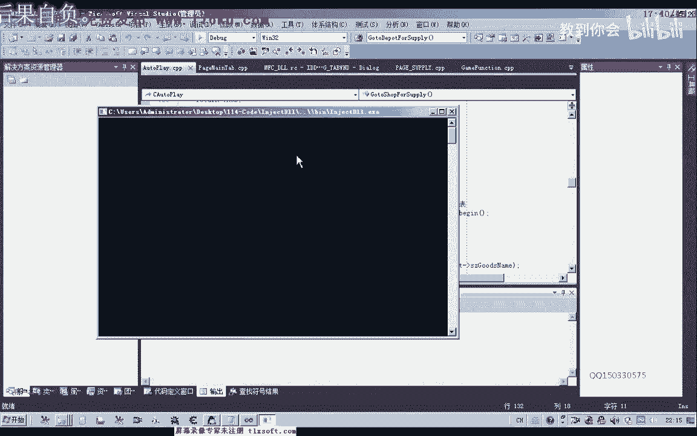
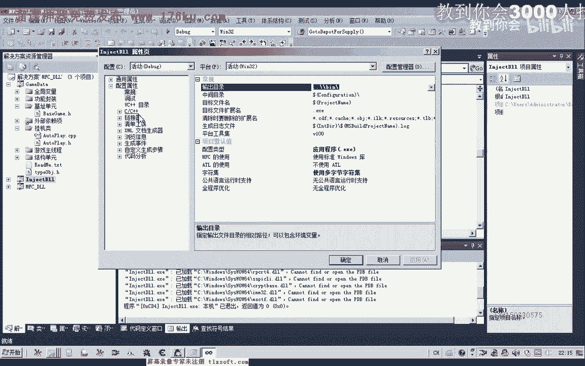

# 郁金香老师C／C++纯干货 - P103：114-重新设计挂机代码-防移动卡死-完善回城补给 - 教到你会 - BV1DS4y1n7qF

大家好，我是俞京香老師，這幾個我們主要來完善一下回聲普及的代碼，以及我們還有掛機重新設計一下掛機的代碼，好的，我們首先打開113克的代碼，那麼之前的代碼的話，我們邏輯上有一些錯誤。

那麼我們需要處理的進行一個修改。

那麼在修改之前。

我們先更新一下遊戲的機制，那麼這個遊戲它也已經有一個更新機制發生了變化，首先我們展開機制單元，然後打開機制更新的56克的工具，好的，更新完成了之後，我們比對一下機制，那麼我們發現的話。

這個機制的話的確已經有變化了，那麼我們把之前的機制刪掉，這裡的機制輻射過來，然後重新編譯一下，那麼首先我們做一些數據的一些初始化修改，移到回聲普及的選項上，要電，那麼我們把這裡的數據複製一下。

那麼還有一個倉庫這裡的代碼，那麼我們也把它刪掉，重新的初始化一下，那麼然後我們移到掛機單元，掛機率的代碼進行一下完善，那麼移到掛機率這裡邊的話，我們把前面的這一段可以說全部都可以把它刪掉，那麼刪掉的話。

我們在這裡重新進行一個設計，那麼首先我們是一個低學的一個，低學保護，然後我們再是一個回聲普及，那麼接下來這是自動打快，自動打快或自動任務的話，自動打快或定點，定點自動打快是一起。

還有我們的自動任務也應該放在這裡，應該放在自動打快的前面，那麼除了這一些的話，我們暫時就是這幾樣，大概是這樣的設計，那麼我們把相應的代碼先把它粘貼進來，那麼這是我們的低學保護。

那麼這是我們回聲普及的這個函數，那麼這裡是自動打快，當然，這裡的話我們還需要對低學保護的函數來進行書寫，那麼我們看一下沒有準備這個低學保護的代碼，那麼我們先退回去，低學保護的代碼的話，實際上這裡邊寫。

那麼我們直接把它取出來，低學保護的話代碼就是這一段，那麼我們就把這個代碼寫進去，那麼我們就把這個代碼寫進去，那麼我們就把這個代碼寫進去，那麼我們就把這個代碼寫進去，那麼我們就把這個代碼寫進去。

那麼我們就把這個代碼寫進去，那麼我們就把這個代碼寫進去，那麼我們就把這個代碼寫進去，那麼，嗯，嗯，嗯，嗯，嗯，嗯，嗯，嗯，嗯，嗯，好的，我们先添加低血保护的代码，当然这一段的话。

我们需要添加在他的文件的说明里面，那么有一个低血保护的，我们找一下，就是这里，相应的，自动使用物品，继续保护的，接下来，我们再修改一下我们的回程图形，自动打怪的挂机的这一部分循环里面。

我们把这里的相应的代码就可以把它删掉，那么定点打怪，我们需要移动到自动打怪里面去，那么在这里的话，我们还需要设计一个自动打怪的一个行数，那我们找一下是否自动打怪的，那么自动打怪的这一段。

我们就把挂机的这一段把它添加进去，还有也就是我们的之前的定点的也给它加进去，定点打怪的这一段，那么这样的设计的话，我们看起来的话，考读性会更高一些，结构会更活力一些，那么剪物的我们在另外再设计，好。

那么我们再回过头来，把前面的这一段都可以注释掉，首先我们就是一个回程补给，那么回程补给之后，我们再是前面的再是一个低血保护，好，我们直接把相应的代码把它复制进来，那么这就是循环里面的这一段。

那么以后就分为三部分，低血保护，回程补给，那么自动剪物的我们后边我们再进行设计，好的，我们先便于生成一下，那么除了这里的话，我们还需要对我们的寻路这个框来进行一些修改，那么寻路的我们移到回程补给里面。

它有调用，那么寻路这里我们有一个问题，就是经常容易在某一个地方会卡死，那么卡死了之后，我们可以跟他增加一下，还有这里的我们的逻辑也有一个错误，小于的时候，我们再继续执行一个寻路，这是错误的。

那么我们应该是大于这个距离的时候，我们才是继续寻路，这里我们需要修改，那么如果是小于的话，我们直接才是寻路成功，那么另外一种情况，小于等于的时候才是寻路成功，然后直接返回，那么我们还要考虑到一个。

就是我们的需要有一个防卡的一个移动，那么如果卡在这里，那么这个距离的话，它就不会变化，那么所以说我们可以在这前面再定一个变量，NDO的Distance，那么就是保持了上一次的距离。

那么这个距离的最先我们也可以出示，包围0，或者是其他的任意数字都可以，这个地方，0或者是任意数字都可以，那么初始化了之后，我们在寻路之后，在这里我们就把它的数字进行保存，上一次的数字。

那么保存这个距离之后，在这前面我们再给它加一个判断，那么如果两次的距离它都相等，如果这个order上一次的距离也有事，它等于我们当前的距离的话，就证明了它卡住了，没有移动，那么没有移动的这种情况下。

我们就可以了，因为卡住了之后，它是找不到寻路的计算点，它计算不出来，那么我们可以把当前的坐标位置，给它传进去，让它进行一个寻路，这样一周的距离的话，它就一般不会被卡住，但是这种移动的时候。

我们可以把它的x坐标，或者是y坐标加一定的数字就可以了，或者是一个随机的加一个1~10的，这种数字更好一些，最好是一个随机的，这种数字我们就能够有一个防卡的移动，但是移动之后。

我们也要给它一段时间来达到目的地，这个地方，好的，我们再次编译生成，我们看一下还有哪些地方，还有我们的，补记的这里的一个相应的数据，我们可以因为列表里面的数据，它并不是很全面。

那么所以说我们有的时候需要在编辑框里面，输入我们的相应的数据，如果要把编辑框的数据添加到这里面的话，我们就不能够添加的，就不能够是选择的某个数字，这里我们是添加的，先获得的文本的话。

是我们当前选中列表里面的，然后这样去取的数字，那么所以说在这里的话，我们也需要做一下修改，那么我们需要先取得相应的文本，这里是我们的要件，然后，Edit Windows Text，那么首先是一个缓冲区。

我们之前听一会，然后再是缓冲区的大小，Size O，好，那么这样取得的话，就是我们当前在文本框里面的数据，不能是选择的，还是我们输入的，它都可以添加到相应的列表里面去，那么同样的下面仓库相关的代码。

这样修改，这两行先注释掉，那么这里是仓库相关的，那么这里可以用，Size O，那么或者是直接是20，当然编译之后的话，这里它实际是一样的，编译之后，它实际上编译器，它会先计算这里的数字的一个大小。

它会计算出来是20，所以说这里最终会被20这个长量所代替，无论怎么写都可以，当然这种写法的话更便于理解一些，好的，那么这里我们进行了修改之后，再次编译一下，那么另外一个地方我们还需要修改。

也就是这里的这些数据的话，还有编辑框的数据，我们需要把它更新到我们的相应的，挂线率里面的变量里面去，那么我们在应用设置的时候，应该添加到我们的补给选项卡，那么我们需要在补给选项卡里面添加，下载代码。

那么这里我们是把窗口的数据更新到成员，变量，那么也就是更新在后面这几个变量里面去，那么保存到这窗口界面的数据，更新到这几个变量去了之后，最后要把它更新到挂机对象里面去，那么它才有这些相应的一个数字。

好的，那么我们再次保存一下，那么另外一个还有就是一个巡路的，这两个我们也需要进行一下修改，那么因为在这里巡路，那么我们巡路到了这个位置之后，NPC它实际上还没有马上就刷新出来，如果我们直接去执行操作。

那么就有可能失败，那么这里我们需要给它留一段时间，来让它进行一个反应，一秒钟或者是两秒钟，那么还有另外一个地方就是去平时指这个地方，那么这个地方的刷新的速度的话实际上要慢一点，那么这里我们选择2。

6秒的时间给它反应，好的，再保存一下，那么大致的话就是这几个地方我们需要修改，好的，那么我们先来进行一下相关的测试，我们先测试一下测试器的功能，测试器功能中。

首先挂接主线材，然后在这里我们选择药品数量，这里我们数字可以稍微是大一点，然后去药店补充青葱药小，充11个，然后去仓库取青葱药小，青葱药中过去一个，但是不知道有没有，没有的话肯定就取不成功。

然后我们再看一下背包里面有些什么药品，药鲜青葱药，那么这个药鲜青葱药我们把它输入到，保存到仓库里面，那么我们把它存仓库，那么还有一个人参，也存仓库，那么还有一个青葱药中。

我们看一下有没有什么可以卖商店的，卖商店的话，青葱药中，青葱药中卖商店，这个我们输送给商店，好的，应用设置，然后我们看一下调试信息，开始挂机，那么这个时候的话。

它应当是要往的药店方向跑。

这里我们可以看到是去平时指示的地方，那么我们可以在购买物品，这里来添加一些调试信息，看它是否进入到我们的购买物品，相应的函数是否也没有被执行到，然后我们再进入到购买物品的这个地方。

然后我们就在这里选一个购买物品的地址，选一个购买物品的地址，然后选一个购买物品的地址，然后选一个购买物品的地址，选一个购买物品的地址，然后选一个购买物品的地址，选一个购买物品的地址。

然后选一个购买物品的地址，选一个购买物品的地址，选一个购买物品的地址，选一个购买物品的地址，选一个购买物品的地址，然后选一个购买物品的地址，选一个购买物品的地址，选一个购买物品的地址。

选一个购买物品的地址，选一个购买物品的地址，选一个购买物品的地址，选一个购买物品的地址，选一个购买物品的地址，选一个购买物品的地址，选一个购买物品的地址，选一个购买物品的地址，选一个购买物品的地址。

选一个购买物品的地址，选一个购买物品的地址，选一个购买物品的地址，选一个购买物品的地址，选一个购买物品的地址，选一个购买物品的地址，选一个购买物品的地址，选一个购买物品的地址，选一个购买物品的地址。

选一个购买物品的地址，选一个购买物品的地址，选一个购买物品的地址，选一个购买物品的地址，选一个购买物品的地址，选一个购买物品的地址，选一个购买物品的地址，选一个购买物品的地址，选一个购买物品的地址。

选一个购买物品的地址，选一个购买物品的地址，选一个购买物品的地址，选一个购买物品的地址，选一个购买物品的地址，选一个购买物品的地址，选一个购买物品的地址，选一个购买物品的地址，选一个购买物品的地址。

选一个购买物品的地址，选一个购买物品的地址，选一个购买物品的地址，选一个购买物品的地址，选一个购买物品的地址，选一个购买物品的地址，选一个购买物品的地址，选一个购买物品的地址，选一个购买物品的地址。

选一个购买物品的地址，选一个购买物品的地址，选一个购买物品的地址，选一个购买物品的地址，选一个购买物品的地址，选一个购买物品的地址，选一个购买物品的地址，选一个购买物品的地址，选一个购买物品的地址。

因为这个坐标它是在我们的00点去，购买的时候，购买的时候，好的，那么我们再重新来测试一下，那么我们再次来看一下，刚才的一个执行的一个流程，那么我们在调试信息里面的话，刚才没有看到购买物品的动作。

我们再来看一下我们挂机录里面的一个设置，那么在这里，我们再添加一些相应的测试信息，那么首先是一个回程补给的，那么在这里我们进行一下判断，这里的话我们就是不需要补给，返回，这条件不属于。

那么这下面的话就是开始这个补给，那么直到最后的话，肯定就是我们的补给完成，那么再来看一下回程补给相关的，那么这里是取得当前的坐标，那么这个我们可以跟他释放的大一点，这个数字，给他两秒的时间做一个反应。

好的我们再次编译来检测一下我们的错误，首先挂接主线程，显示外挂，我们把当前的坐标过去一下，因为防止定点挂机跑到坐标的命运点去了，然后这里我们勾上料品的数量，这里我们是大一点，然后这里的人生。

我们根本110个，120，那么我们看一下有没有东西可以存倉库，这个要先清充药，那么我们存倉库，那么物品处理，这里我们选一个人生，出售，卖给商店，然后我们看一下存倉库的，当然不知道背包里面有没有。

那么我们运用一下测试，然后开始刷新，看一下这个时候好像又卡住了，那么我们看一下为什么会资金不足，因为当背包里面还有很多钱，是不是买的数量超限，这里的金创药小，我们购买的是负的48。

那么这里传递的数量的话，传递的不对，所以说我们金创药的数量，购买物品的时候，那么所以说没有成功，还有金创药查询的时候，金创药小，他也没有查询到相应的地址，那么我们退回来再看一下，錯誤錄影中。錯誤錄影中。

錯誤錄影中。錯誤錄影中。錯誤錄影中。錯誤錄影中。錯誤錄影中。錯誤錄影中。錯誤錄影中。那麼還有一個是在我們應用設置的時候，它為什麼會有一個負數存在，負的46，那麼我們來看一下。

這個藥品購買的這個列表的一個計算，物品補進，那麼這裡應該是我們物品的數量，好的我們再進行一下測試，錯誤錄影中。那麼這個時候的話，應當是我們的詢錄系統出現了問題，它不走路，錯誤錄影中。錯誤錄影中。

那麼這裡的話，我們當然有一個行卡的一個移動，錯誤錄影中。那麼在這裡的話，我們看一下，它的一個移動，錯誤錄影中。那麼看一下這裡有沒有被執行到，錯誤錄影中。那麼還卡移動之後，我們繼續執行這個循環就可以了。

那麼如果我們在這裡，這個循路的話，大於這個距離的話，我們也是進行一個判斷，這裡我們需要，加上一個Continue，繼續下一次的一個循環，那麼這個循路中的話，我們應當把它移到這裡。

MSFindTheWay，錯誤錄影中。好了，那麼我們再次給您測試一下，我們還有一個地方需要進行一個修改，就是我們回程去這個地方，錯誤錄影中。那麼在這裡的話，之前這裡是保存座標，那麼在後面這段。

我們全部都要進行一個修改，錯誤錄影中。那麼在這裡的話，我們是直接調一個去倉庫，錯誤錄影中。錯誤錄影中。好的，那麼我們再次給您申請一下，錯誤錄影中。這裡最好過去一下，當前的座標，那麼我們看一下背包裏面。

MP要品的數量，那麼我們好在這裡設置一個，回程補給的一個條件，讓它達成，那麼這個時候，它的數量只有24，那麼我們這裡設置為25，那麼補充這個人數11個，然後金窗要小，這裡我們補充兩個，金窗要中。

金窗要大，補充一個，那麼因為這裡的我們改了它的代碼，所以說我們可以直接在這裡修改，這個相應的一個數據，那麼這個金窗要，我們把它存到從倉庫裏面取一個，看能不能夠取出來，那麼金窗要中，存倉庫，金窗要小。

那麼也存倉庫，應用一下設置，開始，那麼我們來看一下它執行的一個情況，先把藥品存放到了我們的倉庫裏面，然後我們看一下背包，這個時候補去了相應的物品，然後的話它就自動開始打怪，那麼自動開始打怪的時候。

就把我們的NPC給選中了，那麼這裡我們暫停一下，然後取消掉，我們之前有一個NPC的過濾，那麼可能還沒有成功，那麼我們再來看一下我們自動打怪，這一部分，那麼在這裡的話，我們之前自動打怪這裡。

應該還有一個要跑到自動選怪裏面去，進行一個處理，自動打怪的這一塊找一下，那麼在這裡的話，我們之前應當有一個NPC的過濾，那麼應該有一個判斷，我忘了是哪一刻，我們先進到選怪裏面去看一下，那麼這裡的話。

我們實際上是已經添加了相應的判斷，那麼之所以會出出來，因為我們在打開商店的時候，它選擇了NPC，那麼還有另外一個關係的話，也就是我們什麼呢，之前的掛機的地點的話，就在NPC的附近。

那麼NPC它沒有取消選中，那麼所以說的話，會有這樣的一個錯誤，那麼如果是我們在關閉NPC的時候，我們取消它的一個選中的話，那麼這個問題就能夠解決，那麼今天我們可以不解決它，那麼基本上大致的問題都完善了。

那麼如果現在是在城外的話，應該就不會有這些問題，如果我們之前的一個掛機的地點，是在城外的話，它也不會去打開這個NPC，那麼比如說是在這個地點，應當就不會存在這種情況，好的，那麼我們來看一下。

還有沒有其他地方我們需要修改，那麼另外這裡有一個座列，就是我們機械寶庫的，我們看一下有沒有進行設計，那麼機械寶庫的也不用設計了，那麼我們需要的設計的，應當是自動解庫的還需要一個，自動解庫。

還需要一個設置，那麼除了這個函數，另外也就是把我們的這些設置，保存到我們的一個配置文件，那麼不然的話，我們每次在使用這個物品的時候，那麼這些相關的，裏面的這些信息的話，我們每次都要來設置的話。

肯定很麻煩，還有也就是我們的這個列表裏面的這些信息，那麼我們也是每次都要來設置的話，也是比較麻煩，當然這裡還有一個地方需要修改，那麼也就是我們在當第二次點下它的時候，如果是選中的話。

我們第二次點下這個位置，應該是未選中，所以說這裡我們也有一些代碼需要修改的，那麼我們先把它修改一下，在它的這個單機操作裏面，那麼我們在前面還要進行一個判斷，就是判斷我們所單機的單元格。

那麼它是不是已經有這個選中的標誌，如果是有的話，我們就把相應的這一行把它設置為空，那麼我們需要先取出它的一個文本，那麼我們先來看一下，這個相應空間取出它的下標，然後再是我們的，它的一個大小。

這裡我們設置為一時就足夠了，那麼在前面我們定義一下，那麼取出來之後，我們在這裡來做一個判斷，那麼由我們勾選的符號來做一個判斷，那麼如果我們已經勾選了，那麼在這裡的話就是等於0，那麼等於0的這種情況。

我們直接就把這個地方的數字，表示是第二次單機這個地方，那麼我們直接把它清空，把相應的單元搞，那麼如果是這種情況的話，我們直接執行了之後就放，當然它沒有參數，那麼另外一種情況的話，就是在後面的這種情況。

那麼我們也可以用一個二次，把後面的整行把它擴起來，當然這種寫法的話，我覺得更加的簡潔一些，那麼只有它等於空的時候，在後面的數據才會被執行，那麼這裡再做一個相應的判斷。

那麼當然這裡我們還需要加上一個條件名單，把這一段的名單，把它加在這裡邊，這樣才更華麗，我們也需要對它的一個座標進行一個判斷，然後再這樣設計，好的我們再來重新編譯一下，那麼首先我們顯示一下。

補習的一個窗口，那麼這樣的話我們就可以了，反覆的就是說也可以取消掉相應的選中的符號，那麼這樣的話會更完善一些，好的那麼這一期，可能我們暫時就寫到這裡，那麼另外還有我們所說的。

就是在我們的NPC的打開了之後，在關閉它的時候來取消它的一個選擇，那麼這個的話，大家可以下去把它完善一下，在關閉NPC的時候，那麼這個我們需要在關閉NPC的。

這個裏邊進行一個設置，取消它的一個選項，好的，好的，那么这个大家自己下去完成一下，那么这期课我们暂时就到。

