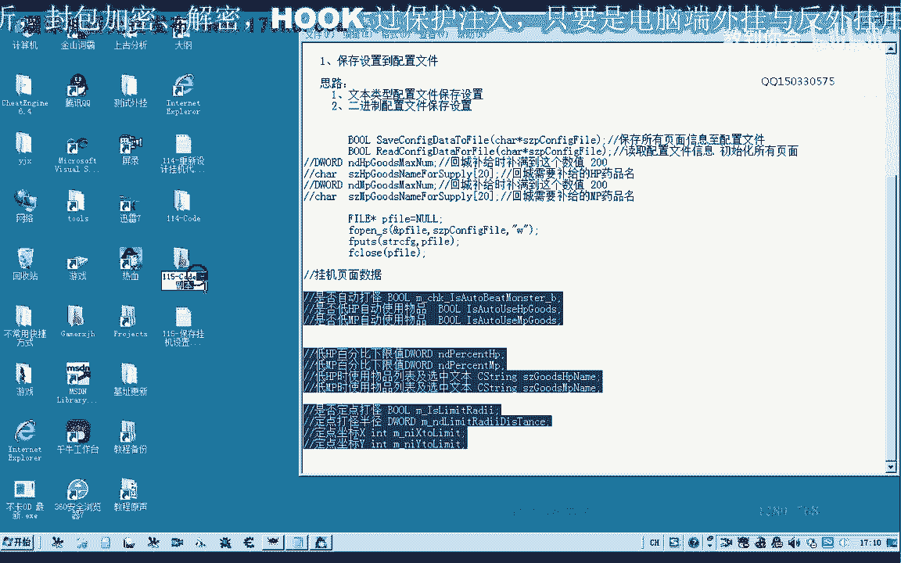
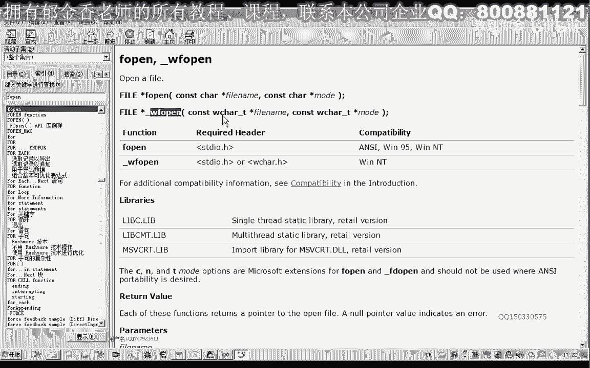
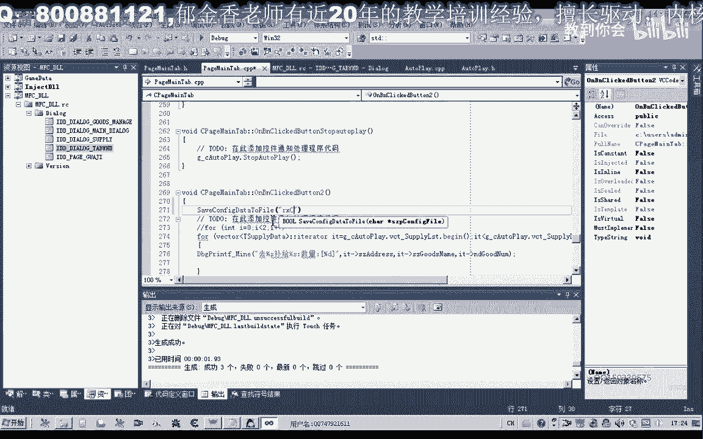
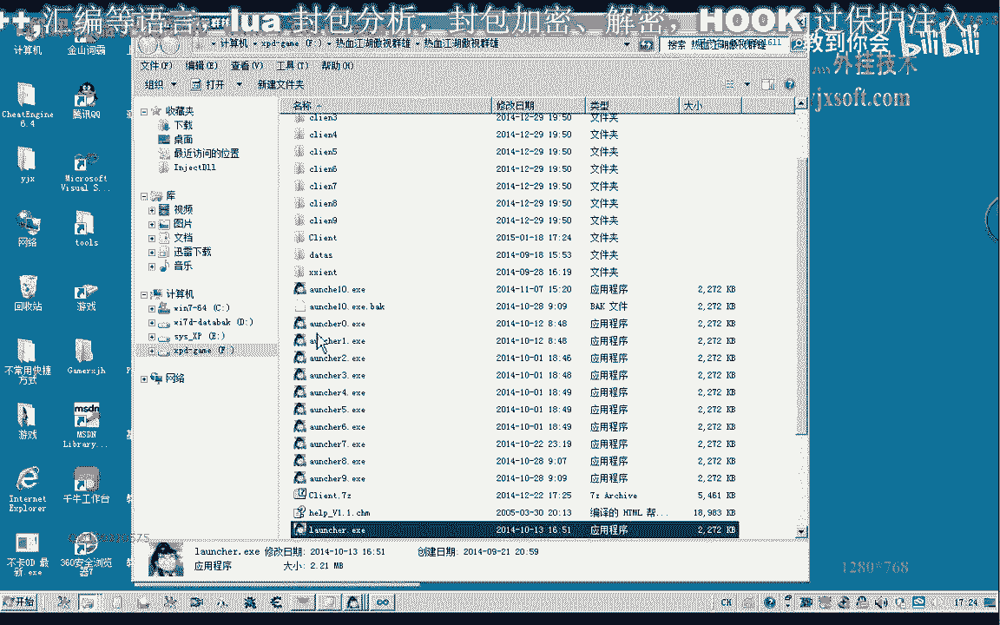
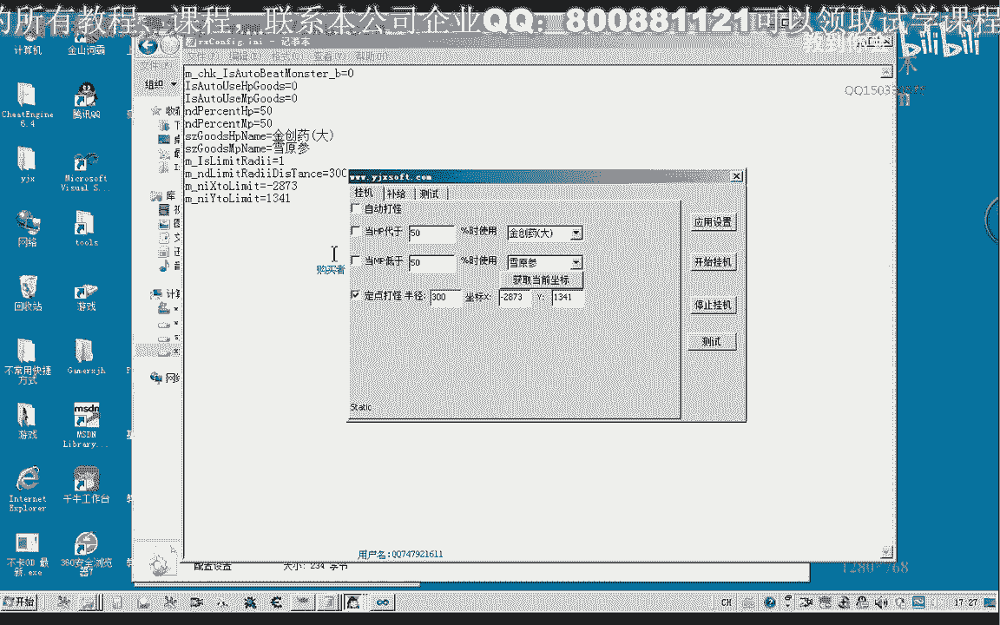

# P104：115-保存挂机设置到配置文件SaveConfigDataToFile - 教到你会 - BV1DS4y1n7qF

大家好，我是郁金香老师，那么这节课呢我们来谈一下涉及自己的配置文件啊，把我们窗口界面的一些数据保存到我们的文件里面呃，当然除了我们自己写的，我们也可以通过调用。

调用我们系统的这个配置文件的相关api函数来实现啊，那么这节课呢我们先讨论自己怎么写这个配置文件，以及自己怎么从配置文件把我们的这个数据解析出来，那么我们先来看一下。

我们把就以这个挂机页面的这些变量数据为例啊，看一下怎么把它的数据来保存到我们的这个配置文件里面，然后我们在下一节课呢在来讨论一下，怎么把我们的配置文件里面的数据啊，更新到我们的窗口上面，好的。

那么我们先打开114克的代码。

当然我们保存自己的这个设置的话，它的方法呢肯定有很多。

那么如果我们呃这个相应的这个数据是一个啊结构啊，或者不是内，那么如果是连续连续的这个内存空间的话，我们甚至可以把它保存到啊二进制的这个配置文件当中啊，也就是相当于把我们这个内存里面的一块这个结构数据啊。

一下子移到文件里面，那么我们下次呃需要这个读取这个配置的时候呢，就直接把文件里面呢再回60，这个数据呢就一直到内存相应的这个结构里面进行一个复制就行了，当然如果我们用文本类型的话。

这样的话它的一个呃操作呢嗯要简单一些，比如说我们要更改一些这个配置文件的数据的话，那这样呢要简单一些，可以自己修改操作哈，那么这个过于过的这个优点啊，那么今天呢我们先来看一下。

怎么把我们的窗口里面的这个这些设置的数据，更新到我们的这个文件里面。

那么我们以挂机的这个页面比例，那么这个页面的话我们就这些啊选项啊，也就是我们的过人类型的啊，是否选中，那么还有呢文本类型啊，那么这些呢都可以说是呃，那么这些呢应该是整形的坐标的一个数值。

但是呢我们都可以把它看成是一个在这里的话，我们就可以把它看成是一个呃文本类型的这样的更新法都是可以的，那么大概就是两种类型，一种是字符串类型，那么另外一种呢我们啊这个布尔类型和这个坐标类型呢。

我们都可以把它看成是整形的那么一控啊，就是这一片12347个八个九个十个。

一共是11个这个数据项啊，那么也就是这11个数据项，那么我们要把它保存到文件里面，那么在这之前呢，我们先把之前的一些无用的数据先把它删除一下，那么回程不记的话。

记录里面有一些数据呢，我们需要删除，请把双手向，因为这个项的话它实际上已经保存在我们的嗯，相应的这个系列表里面去了，还有这个武器的名字呢也在这个图系列表里面去了，那么所以说这几项呢我们需要能把它删掉。

那么删掉之后呢，他也不用再初始化相应，那么在相应的位置的话，我们就把它初始掉，好的，那么接下来呢我们就回到我们的，这个窗口单元在它的这个应用设置里边，那我们呢就把我们的这些窗口。

这些所有的这个配置数据来保存到我们的文件里面啊，这样的话我们就不用了，每次在使用这个外挂的时候，都要来设置一次啊，这样就会很方便一些，那么我们可以跳到他的这个声明这里，为它添加两个函数。

那么一个函数呢我们是用来保存啊，所有页面啊，是配置文件，第二个函数呢，我们来读取这个配置功能信息，和初始化这些，相应的，这个页面，那么这节课呢我们先设计这一个函数，转动初始化单元测。

那么首先的话我们要对这11个啊成员变量呢呃进行处理，那么我们要写入文本文件的话，因为不是我们日进制文件啊，二进制文件的话我们直接写入这个数据就可以了，面上还要方便一点，但是我们后期配置的时候啊。

自己修改的时候很不方便，嗯那么所以说在这里呢我们用文本文件来处理。

那么首先呢我们把这些相应的数据来把它全部都转换成我们的嗯，嗯文本文件啊，也就是字串的类型，然后呢呃把它保存在一个变量里面，最终呢我们把它写入文件就行了，打开来就是这样一个思路。

那么像我们建一个啊csc的类型，用来保存这个配置文件，那么另外呢我们再，建一个临时文件来写啊，延迟变量s t r类型t，那么这个称呼呢我们就对它相应的这个变量呢制出来做一个格式化。

那么我们首先把这个变量啊复制镜头，后边呢是它相应的一个数值，我们给它加进，然后呢后边是它的这个数值，我们把它给式化一下，那么这样呢我们就形成了一段有效的信息。

然后我们再把这一串信息来给它加上一个换行图啊，这样我们配置文件呢会更加清晰一些，那然后我们把它呃进度加大，我们的这个前面的这个字串里面，那么后面的这个操作呢，我们也进行类似的操作，把这一行呢复制一下。

那么复制之后呃，注意这里呢它是我们挂机页面里面的，所以说在这里呢我们还需要加上一个前缀，然后这里的变量的语音有变化，我们再把前面点进行修改，进行替换，好那么后边呢我们也进行类似的操作。

因为都是可以把它当成是一个整形来处理，啊在后面也进行替换，然后再进行复制，那么这里的话要注意哈，这里呢它本身就是一个字串的一个类型，那么在这里的话我们呃直接把它加进去进去就可以了，就这个地方。

那么这里的话我们就不需要进行一个格式化，那么在这里格式化，或者我们直接用百分之s格式化，好的这里呢我们再复制一下，然后呢在后边呢又是九级的整形了，我们复制前面的这个类型，那么这是打怪的半径。

好的最后这几个呢我们再进行相应的修改，好那么我们再次编译生成，那么最后呢我们需要把这段信息来写入到文件里面，那么文件呢这里我们也可以选一个相对路径或者是一个绝对路径。

那么相对路径的话肯定他就是当前的目录的话，应该是游戏的呃，游戏的这个主程序的这个目录，那么如果我们要取这个绝对路径的话，也可以取这个模块，我们dl这个模块的这个路径来保存我们的配置文件。

那么具体选哪一种方式的，这个看自己啊，那么在这里呢我们就去游戏的啊，这个目录的这个相对路径，那么首先呢我们打开文件，嗯。

那么文件名呢我们传进来的这个配置名，那么后边呢是打开的这个模式，那么在在这里呢我们啊协助打开的这个模式，那么我们可以看一下这个函数呢，在我们的dna里面也是有说明的。

当然这个老版的msd呢他没有带这个下划线啊，s那么这里呢他有读写啊，以及我们的追加这一类的属性操作，那么这是文件名可以来带一个路径啊，也可以后边呢也就是我们这个类型操作的一个模式。

支创当然也有宽字符的这个版本。

打步枪啊，那两个版本好的，那么在这里的话，我们接下来呢就把我们的这个数据了啊，进行一个写入，那么写入的时候呢，我们可以用f主题是发型为字串啊，你可以来写入一行，也可以写入整个这个字串。

那么这样的话我们就把我们的这个字串呢，写入到我们相应的这个文件里面去，最后呢我们操作完成之后来用f close关掉我们的这个文件，那么这些函数的话，在之前我们呃更新特征码的时候，已经有使用过，对吧。

在后边呢我们还需要跟一个文件的指针，那么在操作之前的话，这里呢我们还需要有一项操作，就是要把我们嗯这个窗口的这个数据呢要更新到我们的变量里边去，好的，那么在这里呢我们先调用一下这个，我们先来做一下测试。

这测试待遇，这里，那么这里呢我们建议呢用这个人物角色的这个名字来做一个配置，可能比较好一些，也可以自己加自己的这个文件配置里都可以。

好那么我们在这边进行一下测试，测试的离开，好的，那么我们看一下，那么在这里呢我们点一下测试啊，那么测试之后的话，他就应应当是我们这个程序的呃。

相应的这个步骤，这个所在的目录，那么我们来找一下吧，嗯那么这里的话它就把我们相关的数据来写进来，那么我们看一下相关的这个数值，对不对，我们一起来看一下，然后就能，那么关掉之后我们再重新应用一下设置啊。

测试一下，再来看一下我们的相应的这个配置好的，那么这样的话我们就建立了一个相应的一个配置文件啊，相当于那么下一节课呢，我们再来讨论怎么把这个配置文件里面的这些数据呢，嗯在载入的时候呢更新到我们的窗口里。

嗯那么这节课呢我们就到这里。

