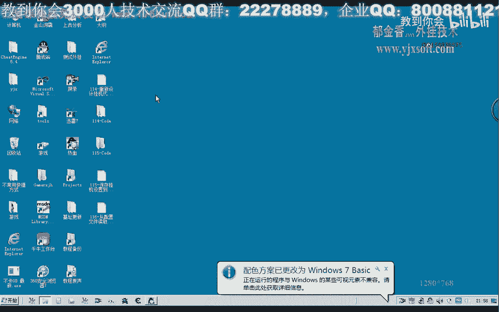
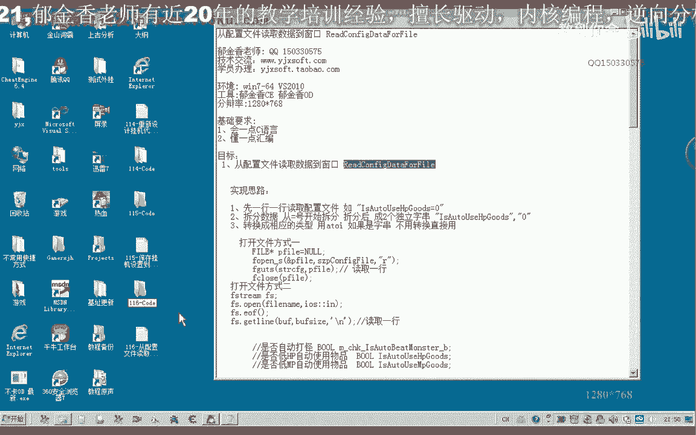
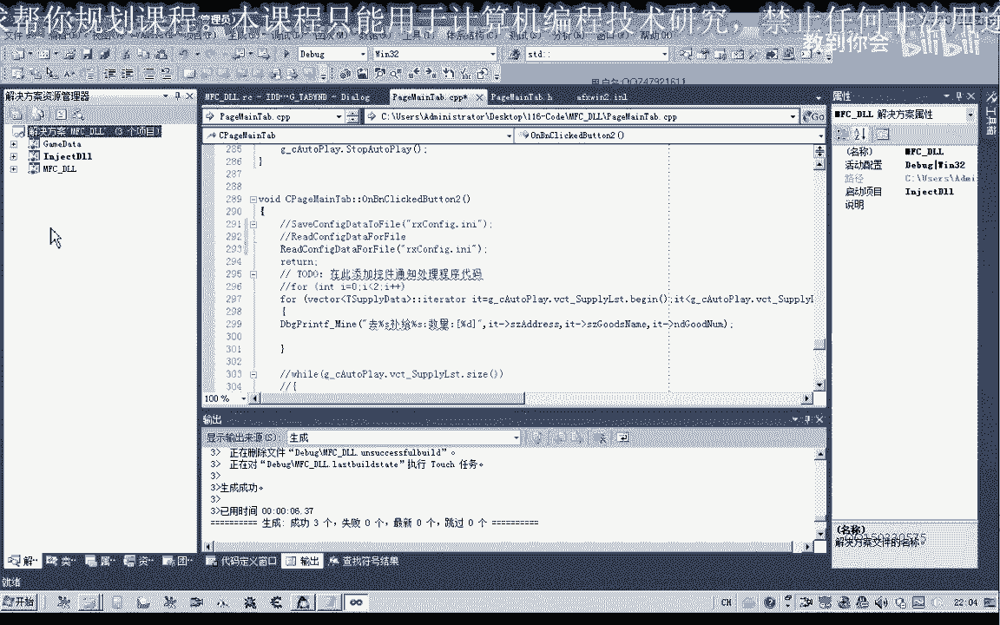
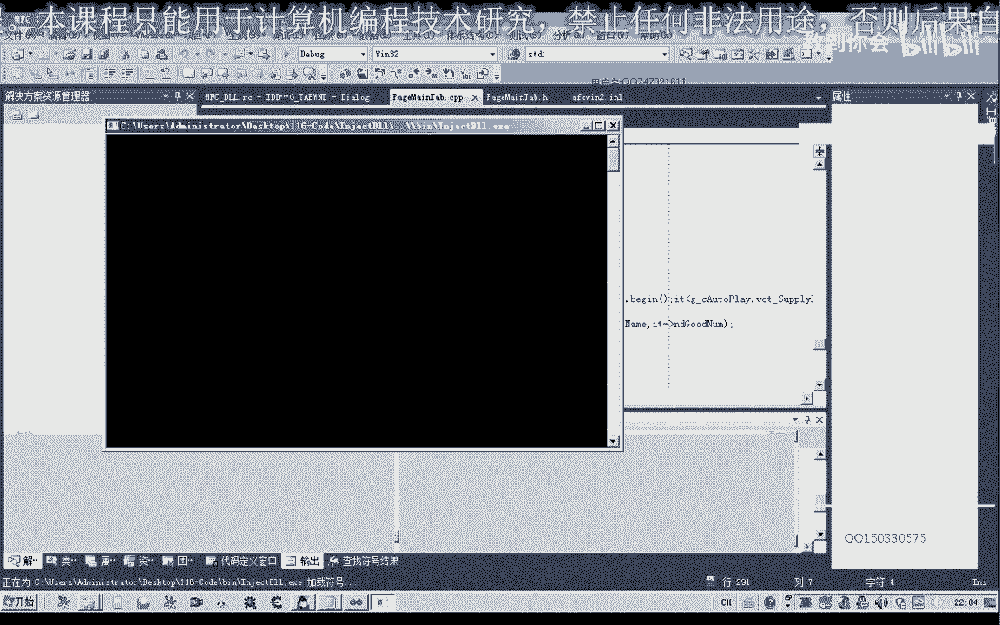
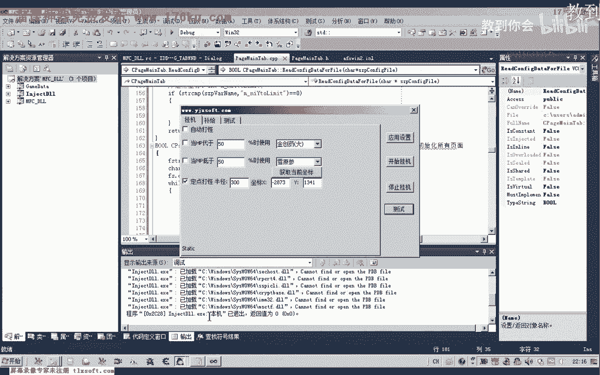
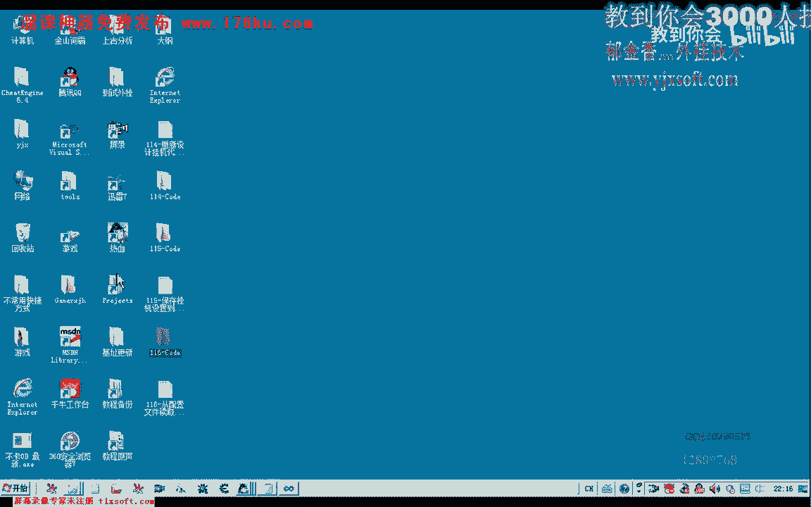
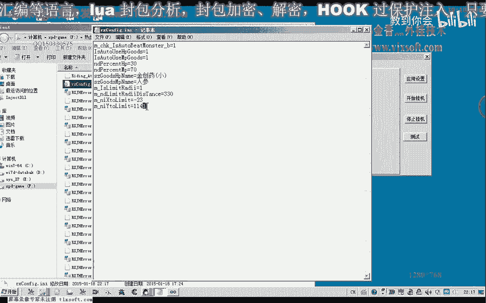
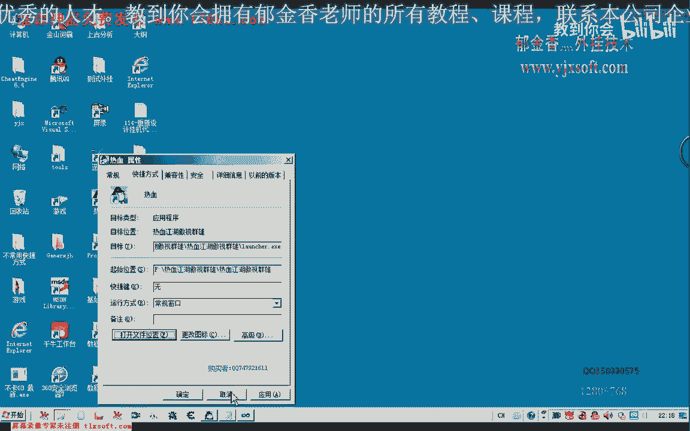
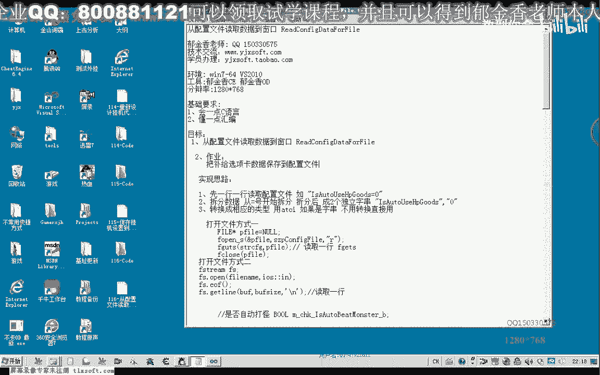
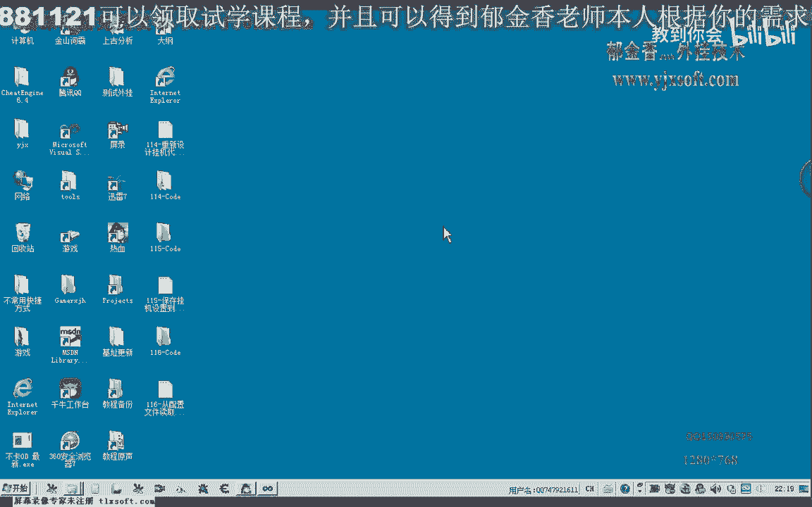

# 郁金香老师C／C++纯干货 - P105：116-从配置文件读取数据到窗口 - 教到你会 - BV1DS4y1n7qF

大家好，我是郁金香老师嗯，那么这节课我们主要的内容呢，是把我们上一节课保存在配置文件里面的数据呃，那么读取出来更新到我们的窗口里边，那么首先我们打开第115克的代码。

那么我们把代码打开之后呢，首先我们添加相应的说明，然后在这个读取配置文件的后边哈，添加我们的相应的这个类的成员函数，对，那么在读取这个文件的时候呢，我们有很多种这个方法可以用对呃，也可以用这个数据流啊。

文件流的方式来操作，那么另外也可以通过我们嗯同样的是通过fo opens来来打开它，也就是我们上一节课用的方法，但是呢这里呢它打开的方式呢，我们要改变一下，用这个r的这个模式读取，比如我们上一节课。

这里呢我们在写字的时候呢，是用的f改s啊，那么我们是写入这个字符串，但是读取的时候呢，他遇到这个换换行图啊这一类的呢，他就会结束哈，就会终止，所以说呢它读取的时候只能够读取一行，而不能够读取整个文件。

那么这里的话啊，另外一种方式呢是用礼物的方式来操作哈，那么我认为呢这种方式来更加的简单一些，那么读取出来之后呢，我们可以这样的啊经历这样的一个步骤，那么每读取一行呢，我们就把它的数据来进行嗯拆分。

那么拆分成两个数据段啊，一个是我们的字符串变量的名字这一部分，另一个呢是变量的数据这一部分，那么如果它的数据类型不是字串类型的呢，我们就用这个函数来把它转换成薄点类型或者是整数的类型啊。

如果是布置类型的话，我们也可以把它用这个整数的类型呢来表示好的，那么我们就用第二种方式来来打开这个文件，啊，那么再用电力总这种文件流的操作方式呢，我们需要包含一个头文件，啊，那么这个头文件的生命呢。

我们还是把它放在文件的头部，那么放在头部的时候呢，第一个呢我们是要打开的这个文件名，那么我们从这里呢把它传进来，那么第二个是操作方式，那么如果我们是要读取的话，这里呢就是ios软硬啊。

art来表示输出啊，另外呢我们如果我们也可以用它来来写入文件，就是out，那么这个呢我们是用来判断我们文件的这个结束的啊，这个结束的，那么我们在这里呢我们可以通用一个y循环来读取整个文件。

然后呢我们在判断的时候的话，如果呢他读到了这个文件的结束啊，那么我们就退出，那么如果文件结束了，当然了，我们就退出这个循环，那么没有结束之前呢，我们就对它的每一行呢进行操作，那么我们读取一行，就是。

那么我们可以用这个get line来读取，那么用get on读取的时候呢，我们需要一个缓冲区，啊，那么这里呢我们把缓冲区的大小来定义成200啊，那么就差不多应该是够了30，然后呢我们放出去的一个大小。

真的，那么这样的话我们就能够读取一行，那么读取一行之后呢，我们可以打印出相应的调试信息来看一下，好的，那么我们首先编辑最好，那么然后呢我们在测试啊代码里边呢，添加我们的这个读取配置文件的函数。

那么同样的是在这个类里边啊，那么把前面这一行呢我们先注释掉嗯，再次编译。

那么我们查看一下相应的调试信息，那么这个时候呢我们就把嗯这个相应的行呢就读取出来了，但最后这里呢由于文件结束了啊，他多读出来也行，那么我们这里呢我们再添加相应的代码处理，那么这个呢我们把它放在前边。

那么如果我们读到了文件的末尾的话，那么我们就直接就跳出来，那么最后一行呢就不会被打印出来啊，未读取成功的这一行四，那么然后我们把每一行的数据来读取出来之后呢，呃另外写一个函数来来对它进行拆分。

那么拆分成两部分，我们就是再对它进行判断，在对我们相应的变量进行一个赋值，那么这里呢我们可以另外再写一个成员函数对它进行处理，嗯嗯，那么首先呢我们定义两个指针啊。

那么这两个子质量分别指向我们拆分后的这两个字串，那么比如说我们在行测算，那么拆分之后呢，那么就会成这两个字法字串，我们从等号这里来开始拆分啊替换，然后呢我们第一个呢指向变量的名字，进入个指向变量的数据。

嗯，那么我们就把它进行初始化，指向我们传进来的这个字串，那么第二个呢我们指向我们的数据部分，然后呢我们需要来进行替换啊，那么数据部分部分的话，我们需要来查找啊，s t r c h。

那么查找的话我们就查找的是这个等号，三匹马，那么我们在这个等号里边查找这个等号这个字符，那么查找找到之后呢，我们再对它进行一个替换，那么我们把它替换成了一个呃这个字符串的一个结束的一个标志，也就是零。

那么这样经过这样替换之后呢，它就成了两个独立的这个字符串了，一个就会拆分成两个了，因为在这里的话，第一个字符串呢就结束了，那么这里是一个新的开始，那么新的开始的话，但是呢他现在呢是指向这个结束符的啊。

那么也就是相当于是等号这个位置，那么第二个字符串的位置的话，实际上还要在它的基础上加一，也就是要加等号这一个字节才能够指向这个数据集的字符串，那么所以说执行这个操作之后呢。

我们还要塞是p where r代替了，还要4+1啊，啊还要在原有的基础上加一，那么这样呢我们就把它拆分成两个字符串，那么之前的这个size vr类啊，它本来直接指向的是整个字符串。

但是自从这个等号哈会替换成一个结束标志，是后来，那么他之前呢就指向这个呃计算的文件名字，算的名字，那么这里的话是变量的名字呢，我们就可以通过变量的名字来来进行一个区分啊，然后呢进行一个相应的一个赋值。

那么在这里的话我们可以做一个比较，那么以后呢它有11个变量，我们把这11个变量来复制进来，那么第一个变量呢我们对它进行从配置文件里拆分之后呢，对它进行一个复制。

那么首先呢我们在这里呢就要进行一个字串的一个判断，ctrl啊，变量名，然后呢这个变量值呢是我们上边的这个变量里面进行一个比较，那么如果它们相等的话，我们就对它进行一个复制，那么相等的话。

但是我们后边的这个呃数据部分的话，它是一个字串的类型，所以说我们可以图案来进行一个转换，啊这样的话我们就能够对它进行一个相应的复制的一个操作，当然呢它是属于这个挂机的这个单元。

那么这里呢我们还要给它加上一个呃作用域的一个限定啊，这这个对象的一个成员，那么而且执行这个成功之后的话，后边的呢我们就不用去判断了，直接没看点出，那么这一段呢我们把它复制一下。

那么后边的话我们也进行类似的一个操作就可以了，那么我们到这个成员变量的时候，我们也对它的名字来进行一个判断，那么判断之后呢，我们对它的这个数字来进行一个复制啊，这两部分呢我们就都进行一个修改。

那么后边呢也是一样，然后后面的每个数字呢我们都照着这样的模式来进行修改，那么这个呢因为它本身就是一个字串类型啊，那么这里的话还要特殊一些，那么他在赋值的时候的话。

我们就直接用这个相应的那变量进行一个赋值就可以了，那么直接进行这样的一个副词嗯，也是可以的，那么这里呢也需要进行一个比较啊，嗯，啊直接对这个代替部分的进行复制，那么这里的话我们就不需要进行相应的转换。

那么同样的这个物品里啊，p的这个变量啊，物品使用的名字呢，我们也照着这样进行一个修改，那么后边的话这几个呢也是我们进行的啊，或者英特类型的话，那么我们全部用这个f i来进行一个转换。

然后呢我们再进行相应的替换，好那么我们在深成解决方案再看一下，那么这里呢我们还需要在这个图文件里边啊，进行一个说明才可以转到生命，那这个声明里边啊，然后呢添加这个函数的一个说明哦，哦哦。

好再次我们编译生成影响，好的再退回来，那么这里我们这个函数写好之后呢，我们可以来通过这个字字串里面的这个信息，来对相应的这个变量来进行赋值，那么这个函数的话。

我们还需要在这个读取的这个读取配置文件的这个函数里面，来进行一个调用啊，那么也就是在这个地方进行一个调用，啊，对相应的变量图纸，那么复制成功之后的话，我们还要进行一个操作啊，也就是我们的这个关系单位呢。

我们的up dp，那么要把变量的数据来要更新到我们的窗口上面，好的，那么我们再次测试，那么这个时候呢我们可以对这里进行一些改动啊，然后呢在测试，那么我们可以看到呃。

这里的话它这个相应的这些数字的话好像都是还原了，这个是青春要大学名声，那么我们看下这里的数字会不会还原，那么这几个好像还有一些问题，啊这前三个是为领导。

那么我们把这个配置文件打开看一下，那么是不是我们呃有没有读取正确。

那么前三个这里是为零，那么我们可以在这里呢呃对它进行修改，那么比如说只有这个自动使用我们这个模拟的这个数值的呃为零，那么其他的呢我们都选中，那么我们再次读取啊，那么这个时候呢。

他就可以通过这个配置文件呢来控制我们的这个这个边变量，窗口的这个相应的这个数据，那么比如说这里呢我们就可以改，这里呢我们可以轻松要小，这里我们可以改为自己生啊，这个变量的范围我们可以改为330啊。

都都是可以的好的，那么我们再次进行测试，这里的话我们也可以不改啊，那么我们可以更改之，后来所有都选中，那我们再来看一下啊，测试一下，那么所有的都选中了，那么当然那坐标的话肯定也是可以改的。

那么坐标我们改为23 3146。

没有26啊，都可，啊那么这里呢也会做一个相应的这个更改，那么这样的话我们就能够把我们的呃界面的信息呢，呃初始化到我们的这个文件里面，也可以把文件的数据来更新到我们的窗口，那么这里呢就给大家一个做对啊。

这个补给界面的啊，这些呃这些数据的话要相应要复杂一点啊，那么比如说我们这个5g列表啊，它涉及到一个v k的一个操作，那么这个列表的呃这个数据的一个分析的话要复杂一些啊，那么大家可以先去测试一下。

那么这个就是做一个作业啊，大家再去完成，那么今天呢我们就分析到这里，下一节课我们再见。

