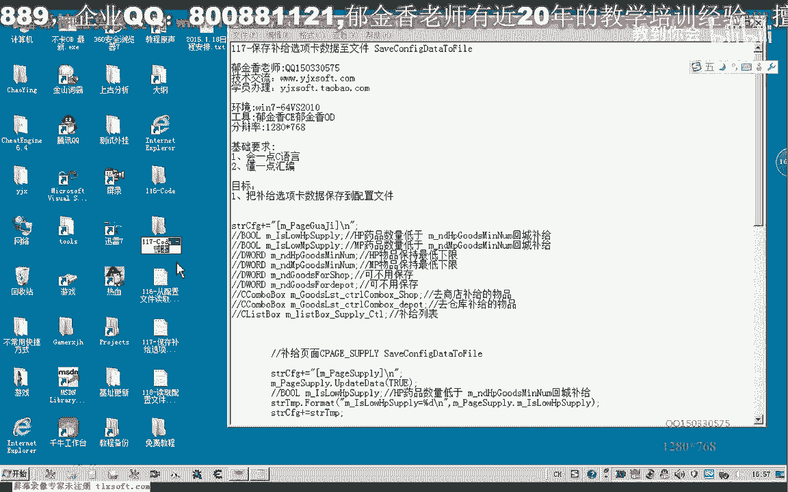
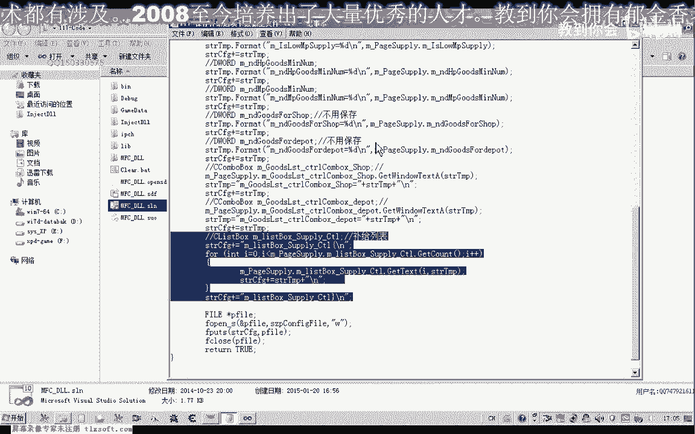
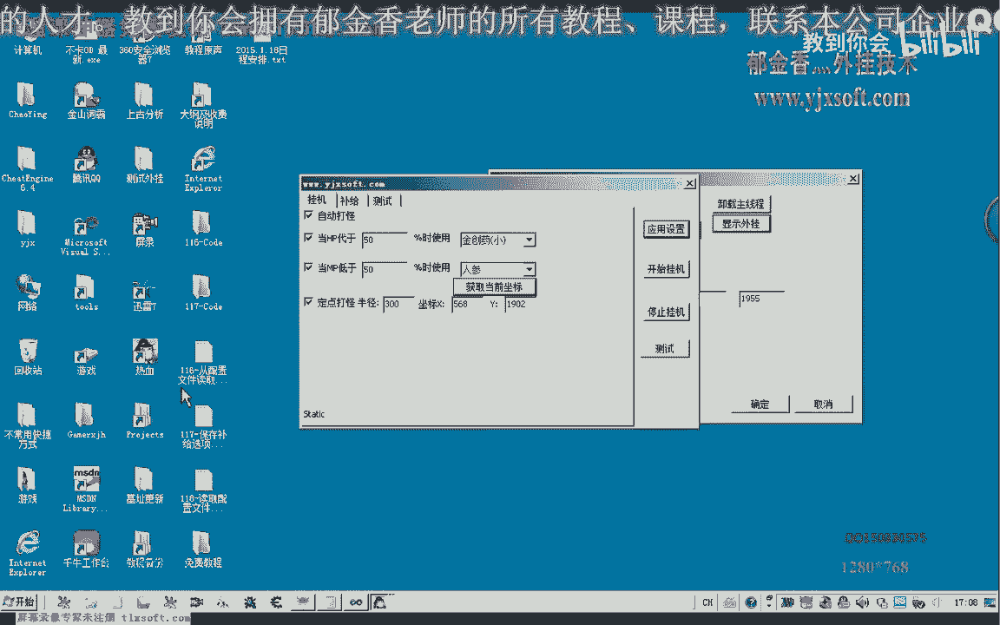
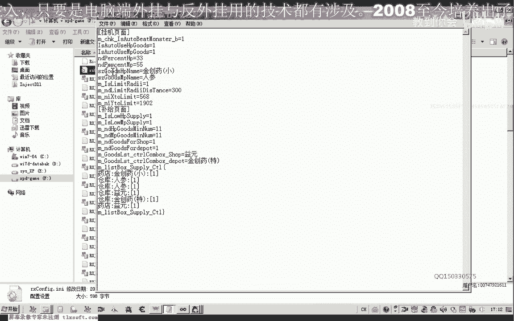

# 郁金香老师C／C++纯干货 - P106：117-保存补给选项卡数据至文件 - 教到你会 - BV1DS4y1n7qF

大家好，我是郁金香老师，那么我们这节课呢我们是把116课啊，呃补剂选项卡的这个相关的这个数据保存到我们的配置文件里面，那么我们首先来看一下我们的这个武器界面。

打开第116课的代码，那么不去选项卡呢，其他的这些控件的话，它的一个保存方式来与我们上一节课都是一样的哈，像这里哈药店我们选中的某一项药啊，这后边的数值啊都是整数类型的啊，那么我们都可以了。

很方便的保存到我们的配置文件，然后根据变量的名字来呃，到时候在读取的时候，根据变量的名字来来定位啊，读取我们相关的数据嗯，但是呢我们的这个补剂列表的话，这一个控件一个变量它里面呢就包含了多项呃。

多项这个字符串的内容，那么在这一点上呢与我们上一节课有一些不同啊，那么所以说我们这节课的主要的也就是重点，也就是讲一下这个补给界面该怎么保存，保存了之后。

到时候到时候我们在读取配置文件的时候又怎么样来读取啊，那么这个是我们这节课的一个重点，好的那么一共有多少个变量呢，一共大概也就是六个七个八个，一共是九个变量啊，123456789。

那么我们就依次来来对这几个变量来进行操作，那么我们转到绿里面，然后转到我们的这个mtable里面啊，这里有一个save configure dt file，也就是保存我们的配置文件啊。

那么我们在保存的时候呢，在这里前面的这一段呢就是我们上一节课的呃，保存的话也就是我们上一节课，上一节课的话，这里呢也就是我们挂机的这个页面，那么这里我们把它稍微改动一下。

方便我们之后呢呃来就是说来读取我们的一个配置文件，还有一个配置文件的一个可读性啊，因为配置文件的话，我们就是在配置的时候呢，就是为了方便我们留一个接口给用户呢，方便来修改这个配置文件啊。

如果不是考虑到这一点的话，我们可以来把它写成二进制的文件啊，直接把里面的这个空间的这个数据呢啊，用二进制的方式来保存也是可以的啊，但是那样的话我们在修改的时候就没有这样方便。

那么在这里呢我们再给它加上一句，啊那么这里呢我们给他设计一下挂机页面嗯，好那么在后边呢我们就是我们的五器页面设计一下，在这个位置，嗯，那么这里呢我们也可以首先呢写一个5g页面啊。

这样方便我们在读取的时候定位，当然也可以不用到它啊，这个看你怎么设计，那么后面呢就是对我们的这几个呃变量，来进行相应的一个值的一个存储，那么前面这一段的话与我们前面的存取的话都是一样的啊。

那么图层补剂的，那么我们在这里呢也复制一段啊，数据下来，然后来替换它相应的一个变量属性，那么替换变量之后呢，前面的呃这个作用域的限定呢，我们也要给他换一个类名，换成我们界面的这个变量。

那么后边的呢我们依次啊这样操作就可以了，那么这一段代码呢我们就直接把它复制进来，那么最后呢我们主要讲的最后一个啊，补给列表，那么这一段的话啊，都是同样的一个操作，那么我们从这个地方看。

好那么补给页面呢我们首先呢也是应该是第一句的，也应该要更新我们补给页面的这些呃数据到我们的变量里边啊，更新了之后，那么在后边呢我们就把这些相应的变量呢啊，是如果是我们的整数化类型的。

我们全部把它格式化为相应的这个数值，然后呢化成字符串的形式来保存啊，那么如果是我们的啊这个combo嗯这个列表框里面的哈，组合框到这个列表框里面的呢，我们是直接去他选中的这个数据啊进行一个保存。

那么有关的也就是最后一个哈，那么最后一个这个估计列表的话，因为它里面呢可能含了多项这个数字啊，所以说这里呢我们需要用一个循环来解决啊，那么我们主要来看一下他是怎么解决的。

那么这里的话首先呢我们也要给它定位一个开始的一个位置，一个结束的一个位置啊，那么中间呢我们是一个循环，那么循环的次数我们有这个get抗体来获取它究竟有多少个列表象啊，那么我们就循环多少次。

那么在这里呢我们就取它某一个啊从零开始的这个啊，取它相应的这个列表的这个字串啊，字串，那么取出来之后呢，我们把它加到我们的这个字符串里面去啊，然后呢进行一个换行，那么处理完了之后，比如说有三行数据的。

第一行的数据，比如说是一，第二行的数据是二，第三行的这个字串23的话，那么处理完了之后呢，呃整个循环完成之后，那么在这里呢我们给它加上一个啊nest box啊，这个武器列表呃完成。

那么我们这里用一个大括号来表示它完成，那么这里呢我们设计的时候呢是一个啊呃左大括号表示开始，当然你用其他的关键字来表示他开始也是可以的，那么后面是换行，那么到时候我们在读取文件的时候。

那么如果我们读取到这一行，那么我们就可以加一个条件的一个判断啊，那么读到这一行的时候，我们就知道我们是读取的这个补剂列表了，那么到时候我们在读取的时候呢，我们也可以用一个类似的一个循环。

当然我们肯定不能够用波循环了，到时候到时候呢这个呢就是我们循环的一个开始的一个条件，相当于是那么我们结束的一个条件呢啊就是这个条件啊，那么我们就退出我们的结束啊，那么一行一行的，那么读取一行之后呢。

我们再来添加一行数据到我们的这个列表框就行了，用我们的a dt啊啊添加我们相应的一行数据到我们的这个列表框里面，就能够完成我们配置文件的一个读取啊，那么这节课呢我们先进行相应的一个测试。

那么最后呢当然我们也是把这个数据来写到这个配置文件，那么我们先编译生成一项，好保存一下，然后呢我们打开游戏来开始进行测试。

好那么我们注入之后啊，看一下写入配置文件的一个效果，那么首先呢我们转到我们游戏的呃这个目录下边。

那么我们先把这个文件呢可以先把它清空一下啊，等一下等一会看一下写入的一个结果，然后我们在这里呢点名测试嘛，对了在测试之前我们还要看一下我们的代码呃，测试的代码是怎么写的。

那么这里呢我们应当写成save computer代替to file，那么这里呢我们需要关掉重新的编译一下，啊然后呢这里我们都可以做一些修改，呃这里呢当然我们也要做一些修改，当然这个e原神呢是错误的。

到时候我们还要修改一下嗯，这里我们做了一个下线的一个要求，所以说呢那我们就，对了这里这个百分比的话，我们输错了啊，啊这样就可以了，那么我们再来看一下啊写入的配置文件，那么这就是我们所有的配置文件啊。

这就是我们的列表的一个开始，那么到时候我们偏离到这里的时候呢，我们就可以用一个循环来做一个判断啊，如果偏离到这个地方，然后呢依次读取下面的所有行进行一个初始化，然后来读到这个地方的时候呢。

我们呃循环了就结束啊，当然在定位的时候呢，我们要快速的读取一个页面的时候呢，我们也可以写一个快速定位的一个函数啊，那么先搜索这个笔记的页面啊，如果读出来的字出来等于补器页面了，那么再做啊后边的这些啊。

相应的一个呃读取的一个赋值，当然这个需要另外写一个函数啊，当然看自己的一个设计啊，那么我在这里呢只是一个抛砖引玉的一个作用啊，给大家做一个例子，好的，那么今天呢我们就讨论到这里，那么下一节课呢。

我们在讨论怎么把这个界面的所有数据来把它读取出来啊。

