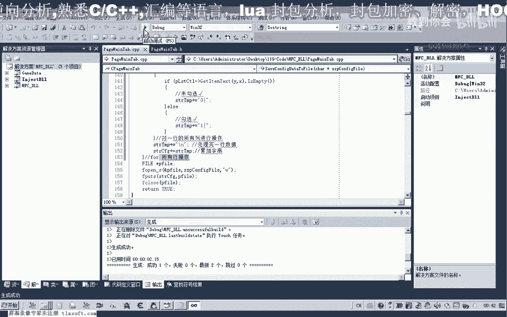
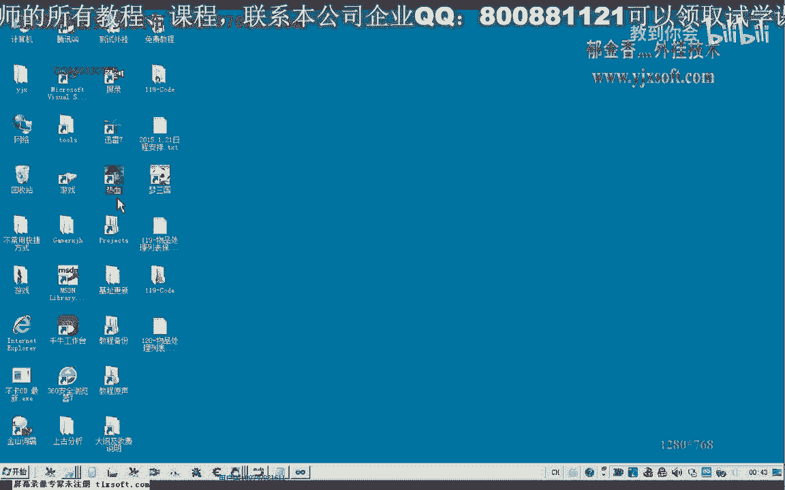
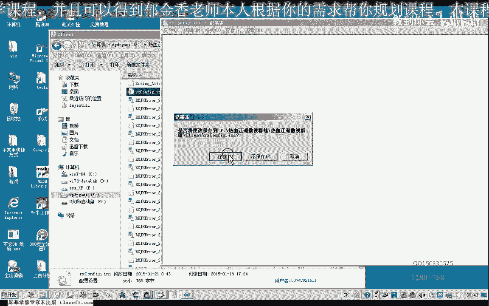
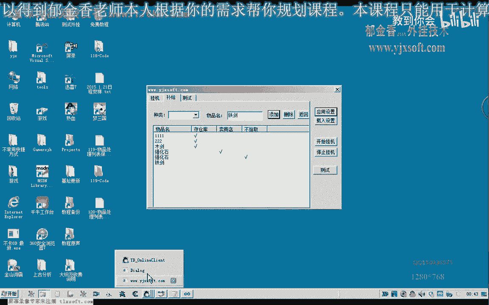
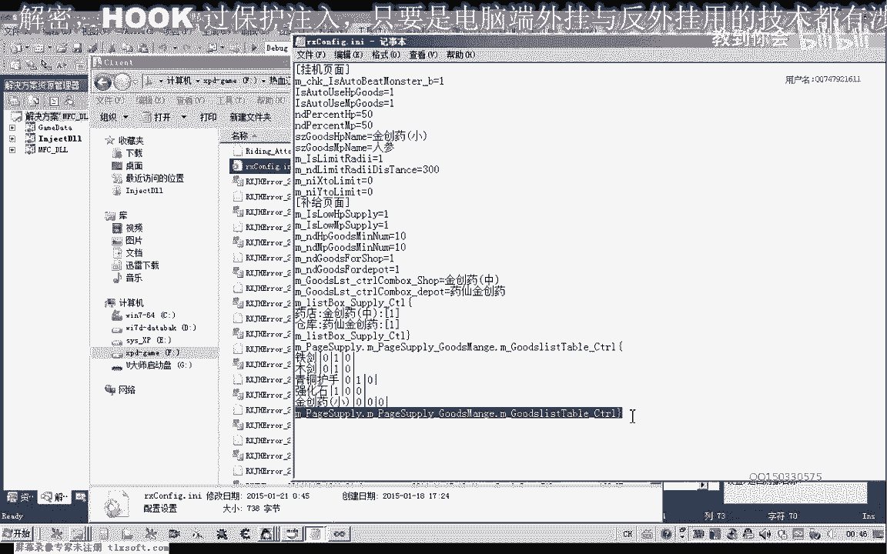

# P108：119-物品处理列表保存 - 教到你会 - BV1DS4y1n7qF

大家好，我是郁金香老师，那么这节课呢，我们一起来把我们这个物品列表的信息保存到我们的配置文件里面，那么首先呢我们打开118克的代码，那么首先我们来看一下我们的表格啊，物品处理的列表。

那么这些的话我们都有一个相应的初始化啊，那在这个物品物品列表里面的话，在这些呢我们每次都需要去添加啊，啊，嗯，那么对于这些物品的一个处理的话，我们呢最好是把它保存到我们的配置文件里边啊。

那么在载入的时候呢，我们就自动的在载入啊，那么所以说在设计的时候呢，我们可以这样设计啊，那么首先呢我们是物品的名字，然后是一个风格服，中间呢我们这里呢就是如果这里勾选的，那么我们这里呢就写入一啊。

未勾选的，那么我们就写出相应的数据零，那么要读取的时候呢，我们就根据前面的啊这个开始与结束啊，这个由我们上一节课，上一节课的这个补剂的列表框里边的设计了类似啊，在读取的时候，那么我们在写入的时候呢。

首先我们就对这个表格进行操作的时候呢，前面我们加入这样一个字串，表示它的开始，那么结束的时候呢，我们加上一个呃尾部来加上一个右括号表示它的结束，那么在读取的时候的话，我们可以找到第一个分隔符呢。

在把它替换成一个结束的一个呃符号，那么如果这里的话是用多个字符表示的，那么我们就把后面的这里呢全部替换成啊我们字串结束的标志，那么这样呢我们就可以把这三个字出来，把它分离出来，然后一项一项的啊进行设计。

那么好的，我们先来设计一下啊，按照这种格式来把我们的这个表格的数据来啊，写入到我们的配置文件里边去，然后呢save configure，dt to fire这里，然后我们移到最后。

那么这里呢我们是古迹列表的一个处理，那么我们移到这个地方来处理我们的物品列表，那么这个物品列表的话，在这里呢我们把这一段代码呃复制进去，按照这个格式格式来存放到我们的配置文件里面，好的。

那么首先呢我们呃到这个位置的话，首先呢我们写入这样一个字串，这是tier complego啊，我们把它进行一个累加，然后呢进行一个换行，这样呢我们表示了这个循环的一个开始，那么然后呢我们写一个循环。

对我们的这个表格啊，也就是我们的这个列表list count来进行操作，但是这个历史ctrl的话，它数据也是比较长，我们需要通过排挤啊，是blg，然后呢再是我们的。

ph lagoon my manager里边才是我们的这个list country，那么所以说这样很长的一段的话，我们用来操作它的这个成员的话，就不是很好操作。

那么在这里呢我们因为这个控件的话是viscontrol控件，那么我们可以的用list count的空间的一个指针来指向它，然后取它的一个地址，那么这个时候的话。

我们就可以用这个尺寸来来操作这一长串的一个变量啊，相当于是那么首先呢我们也是对他整个列表来进行偏离啊，哎多少行啊，这是行号用来表示，那么从零开始当然小于它的这个所有的函数啊，项目数。

com那么这就是它最终这个表格的函数，然后呢y加加，然后在这里呢我们首先呢取出一行的内容，那么取出一行的内容的话，我们首先呢是取出物品，然后呢再说我们啊是否存仓库啊这一类的。

那么因为后面的呢我们都是a组的存仓库，还有去药店是否拾取都是挨着的，所以说这里呢我们可以另外的取出物品名字，后来后边这三项呢我们可以用另外一个循环来表示，哈哈哈哈，那么这个x的话。

因为我们之前取了一个物品，那么这里呢它的下标是从零开始，x小于0=3啊，后面一共有三项是1~3x加加，那么首先呢我们从这里呢先取出它的物品名，保存在这个s t r temple里边。

那么首先这里是它的y坐标，第一个指向呢是零啊，这个指向指向我们的列数啊，实际上是表格的，那么这个get item text它一共有两种形式，我们选的是这个cs的这种形式，它只带两个参数。

最后呢返回的是cs的这个类型，好的这样我们就取出了物品名，那么这个物品名取出来之后呢，我们再给它加上一个嗯中调服务，哒哒哒哒，好，那么我们首先编译生成一下，那么这里呢我们把它定义成int边图形，好的。

那么接下来呢我们是要去除它相应的项啊，那么在取出之前呢，我们这里这里的做一个判断，只要把它取出来的这个项，那么首先呢这里我们也是p miss啊，get，泰克斯顿，那么首先呢我们是他的行号。

然后是它的指向x，那么取出来之后呢，我们是一个cs寸的一个类型啊，那么这个类型呢我们首先来判断它是否为空相应的这个项，那么如果是为空的话，就证明它相应的这个表格里面是空的，没有数据。

那么另外一种不为空的情况下呢，我们就是勾选的啊，呃为空的话，这里呢就是未勾选，也就是没有打这个勾，没有歌的话，那么另外一种情况的话，肯定它不为空，那么就是勾选的，就只有这两种情况，那么如果是勾选的话。

我们再在这个s t r temple后面再加上一个我们的领，再加上一个分隔符，那么另外一种情况呢，我们写一在这里，那么勾选择呢，我们就选g，当然还有一种设计方法，这里我们用一个空格啊，这里我们直接勾选。

这样也可以，那么这样的话到时候我们就直接往里面写就可以了啊，嗯但是呢我还是觉得这种零和一的这种方式的好一点，因为这个这个勾选的话，它的这个宽度的话呃，是占一个汉字的一个宽度啊，这种表示的不是很好表示。

那么我们和零或一呢是x码的话，是占一个字符的一个宽度啊，好那么这样勾选了之后的话，呃，异能的循环完成之后呢，我们在这个位置呢再给它加上一个换行的一个标志，好这样呢我们就对一行处理完了啊。

那么处理完一行数据之后呢，我们把这个数据把它加到我们的t r config里面，那么直到了我们前面的这个整个外层的这个循环来完成，那么这这一层的话相当于是我们的对行的一个操作。

那么这里呢我们这个for语句呢是对我们所有列的一个啊，这个是所有的一个操作，那么这个是对一行的所有列啊进行操作啊，或者是对一行的所有指向来进行一个操作，那么这个这个这里呢是对所有行进行操作好的。

那么这样的话我们就可以完成我们数据的一个保存了，那么我们来看一下测试一下。

那么在这里呢我们添加111221键，强化石，啊，添加它相应的一个处理，当然在添加的时候，实际上我们还有一些代码呢需要完善，那么就是说在添加的时候，如果他要建立整个列表，如果有同名的话呃。

它要进行一个提示，或者是添加不了的情况，或者是定位到香味的哈，相应的行，因为我们像这种情况的话，应当是不允许出现的，当然这里呢我们在这个留到后边啊，再完善，好再添加一个铁剑啊，这个呢我们什么都不处理。

然后呢我们应用设置，然后我们跑到游戏的目录看一下。

我们也没有正确的写入，当然我们还少了一个部分啊，如果是这样写入的话，我们就没有办法判断它的一个结束了，因为我们还要再在后边写出一个结束的一个标志啊，这样才可以好的，我们把这个数据给删掉。

删掉之后呢，我们再把代码来做一下修改。

那么完成之后呢，我们在这里呢还要加上你好，表示我们的所有的这个操作和这个列表的操作完成，那么在下一节课的时候呢，我们在读取我们这个数据的时候呢，我们才有一个结束的一个条件，好的我们再次做测试。

啊因为在这个时候的话，我们这些数据呢都没有了哈，呃因为刚才被我们删掉了，那么这里呢我们添加两个数据，下载到我们前进，然后在路径，那青铜特色，强化死亡，嗯然后再是金创药，好的。

那么我们就对这几个物品来进行操作，那么这个铁剑我这个部件呢我们都卖给我们的商店，那么青铜副手的话呃，我们也卖给商店啊，强化死了我们村仓库，那这个不进行操作，好的，那么我们应用设置，好的。

那么这个时候的话，所有的写入都是成功的，那么这里是开始，那么现这里也有结束的一个标志，那么下一节课呢我们就通过这个标志来来，循环的出去这个一行一行的读取，然后读取一行之后呢，我们再来这个分解相应的数据。

然后呢再对我们的这个list看出来进行复制，那么读到这个位置的时候呢，我们就跳出循环好，然后就返回就可以了好的。

那么这节课呢我们就到这里啊。