# 郁金香老师C／C++纯干货 - P109：120-物品过滤列表信息读取 - 教到你会 - BV1DS4y1n7qF

大家好，我是郁金香老师，那么上一节课呢，我们把我们录屏处理列表的信息保存到了我们的这个配置文件里面啊，那么这节课呢我们从配置文件里面再来读取，好的，那么我们先打开119克的代码。

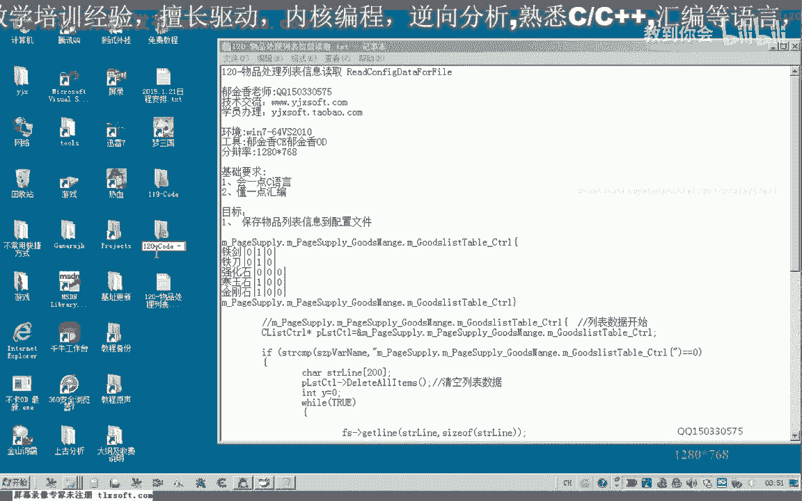

那么首先呢我们转到内里面。

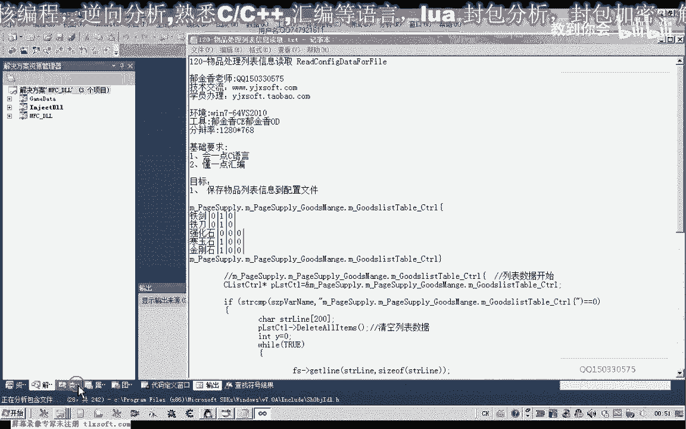

呃转到我们的city啊，we are config代替，这里边呢是我们对每一行读取出来的数据的来进行相应的处理，那么我们移到最后，那么实际上它的这个操作的话呃。

与我们之前的这个列表里面的数据呢有一些类似的地方，那么所以说我们可以来把之前的这一段列表啊，这段代码呢，复制过来。

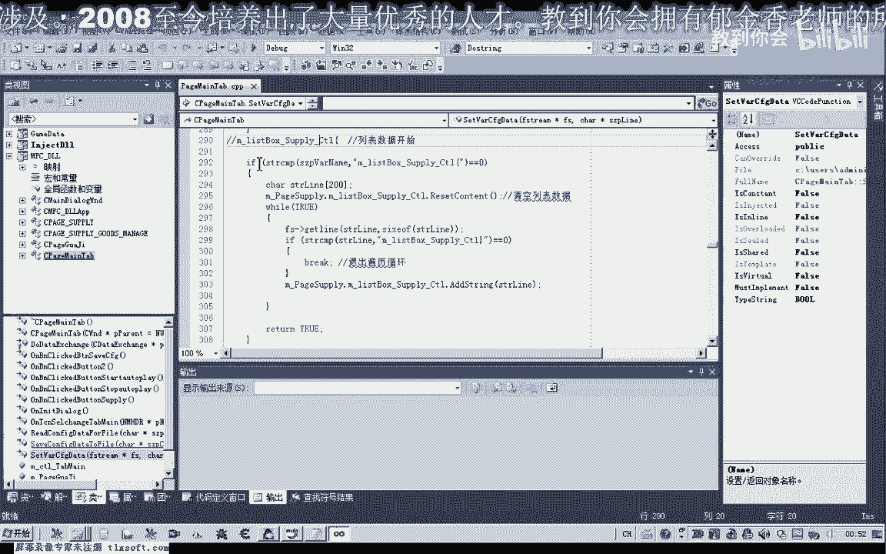

那这个return的话应该要取消掉，好的，那么我们把前面的这个数据来啊复制一下，那么在这里呢我们按照我们这个格式来来进行一些改动。

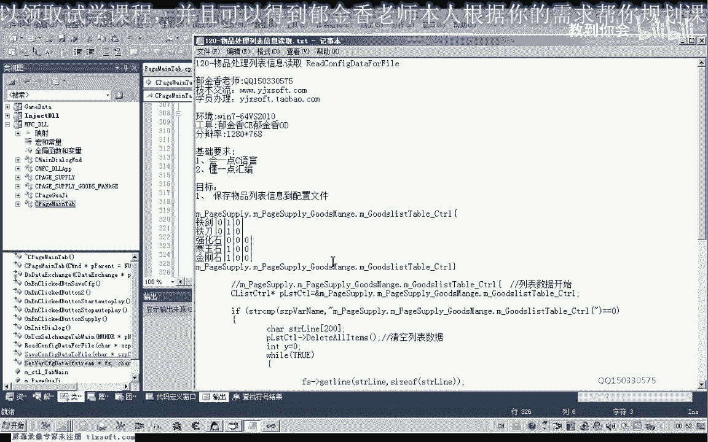

那么首先呢我们也是要对它的开始来进行一个判断，那么如果他读取的这个这一行的这个名字哈，嗯如果是等于我们的这个字串，那么说明呢我们定位到了我们的这个物品处理列表这里，那么它的这个结束的条件的话。

也是我们后边的这个结束条件啊，这一点上边呢它是相同的，好那么这两点相同的，还有数据的读取是相同的，那么不同的地方呢就是这一段这一段呢我们是对每一行的一个处理，哈哈哈哈哈。

大会还有这里呢它数据列表的一个清空的话，这里不一样，因为对空降的一个操作呢不一样，那么在这里呢我们先来定位到我们的这个控件，先用一个指针指向我们的这个控件，哈哈，那么指向控件之后呢。

这里呢我们首先呢对控件呢进行一个在载入我们数据的时候呢，我们对控件呢进行一个清空的一个操作，啊，那么这样呢我们算出所有的项啊，清空这个表格，那么清空了之后呢，我们呃再从文件里面啊读取一行啊。

从这个地方呢我们另外读取一行，那么读取一行之后呢，我们要判断它是否呢呃偏离到结束这个地方了，如果是结束的话，我们要退出这个循环，不然这个是死循环要出错，那么如果是读到了我们这个表格的结尾这一行的话。

那么我们对这个相应的数据呢进行一个拆分的一个处理，那么在这里呢我们定义两个指针变量，二变量，哈哈哈哈，那么这个指针呢我们就指向之前的这个s t r man啊，指向它的这个缓冲区进行操作。

然后呢我们再把我们的物品名单独立出来，那么这个我们用s t啊，c h啊，然后来搜索这个相应的这个字串，那么s t r嗯，然后呢我们搜索的第一个字串呢就是我们的分隔符，那么搜索到之后呢。

我们把在这个分隔符呢另外定一个尺寸啊，来指向它，看错了，那么这个分隔符我们指向它之后呢，我们对它进行一个操作p，那么这里呢我们对它的下标题，这个字符呢，这里呢我们写出一个数字，数字零。

或者是写入一个我们的字串，因为这两个他表示的数据呢实际上是一样的，都表示字串的结束，啊就是说这个字串就在这个地方，在第一个我们这个分隔符这里就结束了，那么从这里结束的话。

那么前面的这个字串的话就会变成铁剑啊，也就是物品名这个s t呃，这个p line这里的话就指向了我们的这个物品名了，那么指向物品名的话，这个时候呢我们就把它设置为我们的第一个项目啊，在这里。

那么插入我们的第一个项目，它也有几种格式在这里，那么我们只需要了啊一个字串和一个下标的一个格式，那么这个下标呢我们可以呃每次来都插入第一行也是可以的，那么后边这里呢也就是我们的新浪或者是sr呢。

那么这样的话实际上因为它之前那里加了这个铁剑，在后边的话它加了一个结束符，那么这个字串的话实际上就只有前面这里读到这里就结束了，但是这个指针的话，我们啊pi这个指针的话，我们来加1+1之后的话。

他就跳过了这个分隔符，这个结数字算，那么就会指向零这个标志，也就是他的第一个，那么之后呢我们只要再加二的话，那么他又会指向下一个一，再加热呢，它会指向这个位置啊，指向这个零这个位置。

因为我们指向这个零的话，加一是这个分隔符加热了，就是后面的数据项，同样的在这个位置的时候，我们再给它加上一些呢，也是这个风格符，加二的话是后面的这个理，那么所以说我们可以通过不断的加二元。

就把后边的这几个项的数据呢就全部取出来了，那么在后边的话一共有三项，那么我们也可以用一个for循环来进行处理噗，那么这个for循环呢我们用x坐标来表示，它代表的是我们这一行的这个指向就是列。

小于等于三啊，这这是加强，那么因为前面的话，实际上呢呃第一项呢它已经有处理了，我们只需要对1~3项的数据来进行一个处理，弄完处理之后呢，在这里的话嗯，在这里处理完之后啊，它赋值为零之后呢。

也就是他在他原原来的字数上基础上呢，跳过两个字节，我们看一下啊，应当是加一就可以了，不足为敌呃，加一就应当是指向第一个零了，因为他之前指向这个风格，加一就是指向第一个零啊，所以说这个时候加一指向第一个。

好像数数我们把它叫做第一项数据，那么指向这里之后呢，然后呢我们在这里进行一个循环的一个操作，那么首先我们对这个pi呢进行判断，那么如果等于一，它的这个字符如果等于一的话。

那么我们就对相应的项呢呃进行一个就是说数据来进行一个设置，px country and sett，那么它的像的话应该就是你们我们之前的话，因为之前的这里用的是零，然后后面的这个项的话就是它的x坐标啊。

就表示因为这个地方为一了，那么操作完了之后呢，我们下呃移到下一个项，那么如果我们现在是在这个位置的移到下一个项的话，我们就需要了加上两个字符，加上这个风格，还有呢要加二两才能够指向这个位置。

所以说在这里我们处理完之后呢，我们就是p a p加不值为二哈，指向下一个就去下，那么这样的自然而然的就进行下一次循环，然后循环完之后就行了，当然这里的话我们最好呢是把它添加在纬度啊，这是最好的。

那么要添加到尾部的话，这里呢我们最好再设立一个y坐标啊，也是也就是来表示某一行啊，那么在这个y日循环之外呢，我们对这个y坐标来进行赋值，y赋值为零啊，从第零行开始。

那么在这里的话我们呢也就是呃第一个呢是插入的这个项目，插入的位置的话就在第零行，那么这样每一行我们处理完了之后啊，一行处理完，这是融资一行，这一行就是那么一行处理数据处理完之后呢。

我们就把y的坐标呢要加一啊，要指向下一行，y加上，那么这样的话啊，你们就可以了，我们再来看一下吧，然后这个地方是艺术，这个地方是y，我们可以注意一下ney，好的我们编译生成一下。

那么我们先先来看一下哈上一节课的这个游戏里面的这个配置文件。

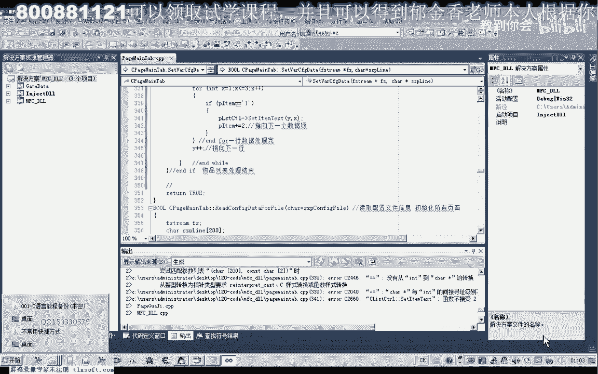

我们看能不能够把它正确地读取出来。

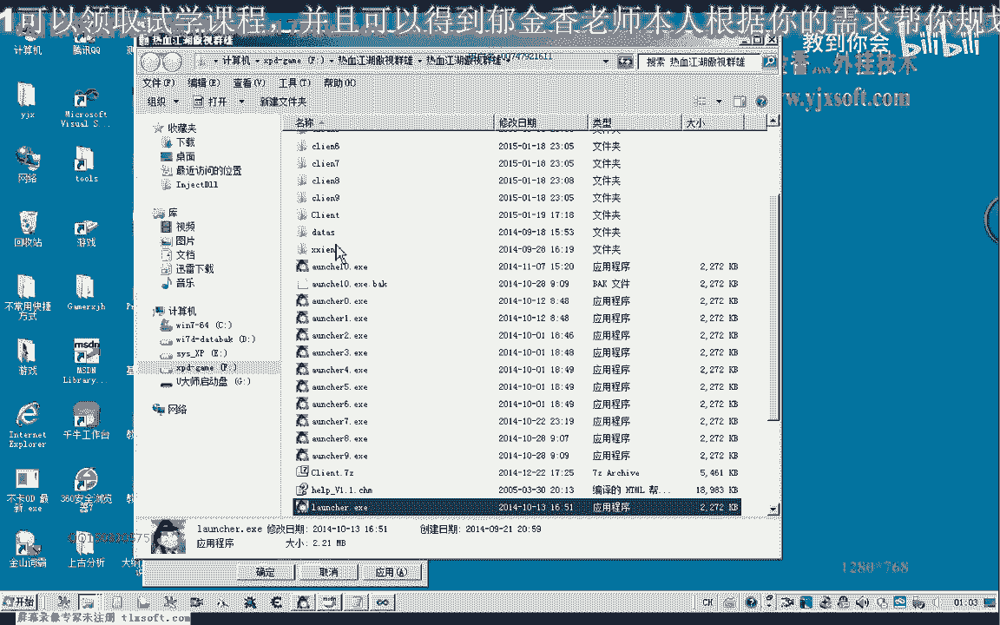

那么这是上一节课我们写的这个配置文件在这里边。

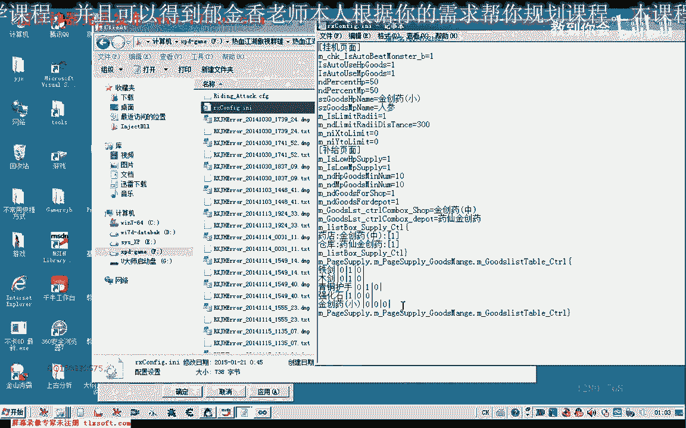

那么我们读取一下啊，运气看能不会不会把它读取出来，那物品处理，那么这个时候的话我们发现的话啊，这个相应的数据的话，它没有被读取出来，那么其他的这个补齐项的话啊，都是读取正确的，那么我们再来看一下啊。

这是一个条件的起始的一个条件。

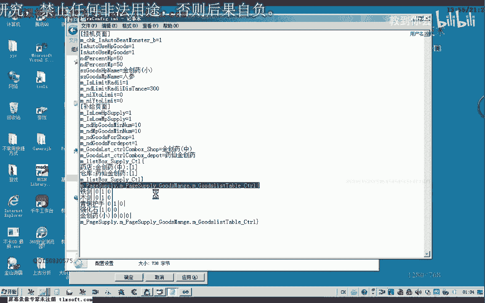

我们再来看一下之前的一个代码，那么这里我们完成了之后啊，这里我们清空了整个表格，那么我们看添加的位置是不对的，那么我们在这里呢加上一段调试信息，看一下他有没有执行到这一段，好，好的再编译生成一下。

哦对了，这里是错的哈，刚才编译没有生成，应该是p i t0 啊，就等于这个字符一的时候，我们进行这样的一个操作，最后呢这里我们还需要有一个数据的一个项目啊，在这里我们也是没有进行一个相应的设置。

那么在这里的话我们需要的就是这个勾选的打上一个go，在这个地方好的，我们再次生成一下，那么这里呢是字符类型的，好那么我们再重新注意一下。

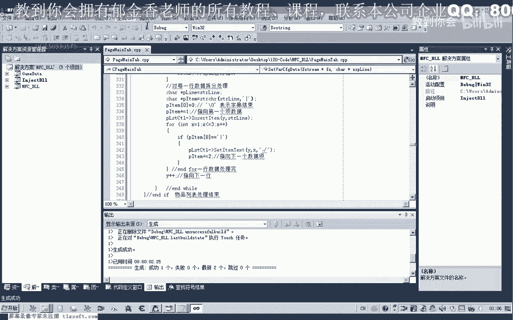

但是这个时候的话读取的数据也不对啊，只有强化是一个是被选中的，那么我们看一下相应的配置文件，铁剑哈，还有就是青铜破手啊，这一类的呃，都是选中，那么也就是说物品名是对的，但是我们选中的这个对象的还不对。

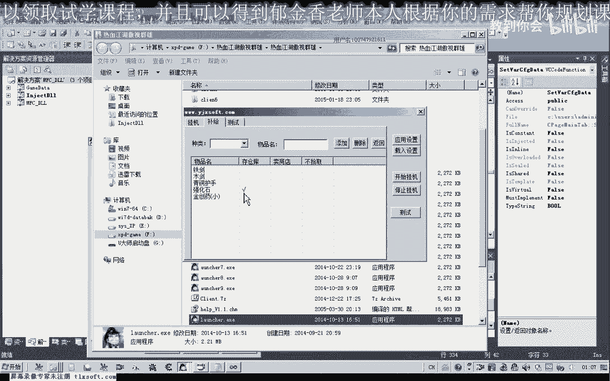

就强化是一个行，再次载入一下设置也是不对的，我们再来看一下我们的代码，那么我们再来看一下我们执行的流程，那么首先呢在这里呢我们呃，指向我们的一行数据，然后呢我们搜索我们的这个分隔符，那么搜索之后呢。

我们把它拆分这个数据啊，分成一个数据名呃，一个物品名以及后面的这个项，然后呢我们再加一指向第一个数据下，也就是零或者是一，那么指向这个数据项之后呢，我们就进入循环，然后进进行一个判断。

那么判断之后如果这里是唯一的话，那么我们进行设置，然后呢指向下一项，但是如果是为零的话，那么我们这里呢你就继续进行下一次循环，那当时为零的时候呢，这这个我们就没有指向下一个数据项。

那么因为这个下下一个数据线的话，我们应该放在这个判断的外边，那么呃因为放在里边的话，如果在这里字符它等于零的话，它就不会指向下一项，那么一直都是判断的第一项，那么就造成了我们这里的呃。

它不能够设置相应的这个数据啊，不能勾选好的，那么既既然知道了这个逻辑的错误，那我们修改一下啊，重新编译一下，那么这个时候我们再来看一下他选择的这个配置文件是否正确，那么这个时候勾选的项的话要多一些。

那么首先呢嗯111啊，前面三个都是妖，第四个强化石，这里是腰精创要小，这里都没有勾选好的，我们把它修改一下啊，然后呢金创药小蓝我们也是存到仓库啊，利用一下设置，我们看一下。

好的这个时候来保存也是成功的啊，这里选了两项啊，最后这两个都是第一项，然后呢我们再重新，嗯重新再运行一下，看一下可不可以把我们的这个默默认的这个数据来进行嗯载入。

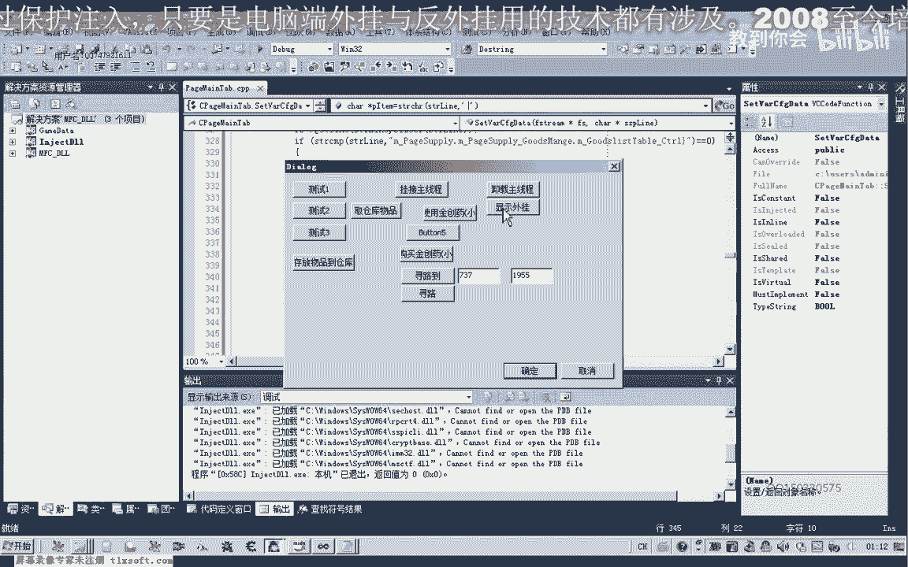

那么这个时候我们再比较一下，啊铁剑木剑青铜肤色啊，强化石轻松要小那么好的，那么这样所有的物品的话，我们都添加到这里面去了，那么还有其他的，比如说我们的飞龙枪嗯，还有其他的我们看一下啊。

嗯比如说我们的太极战，那这这些如果是捡到的话。

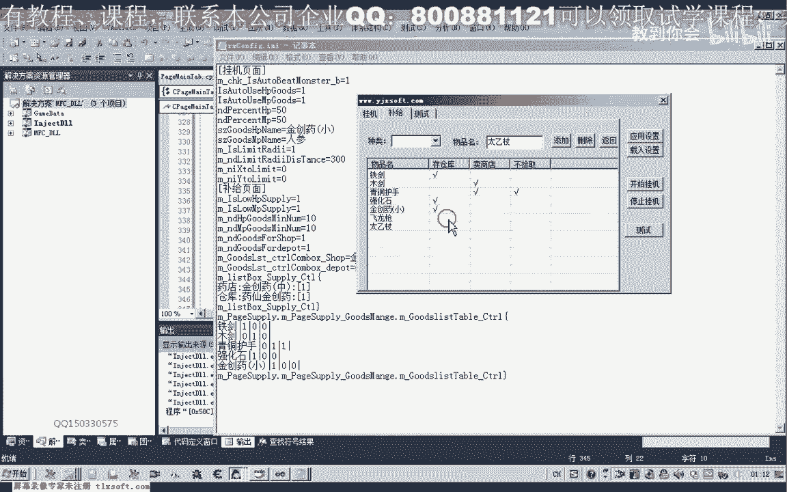

我们就存仓库，再次应一下设置，再次查看一下我们的信息，那么查看之后呢，在这里呢我们呃应用设置之后呢，我们在这里呢可以呢进行一些修改啊，这里删除的这个语句呢，我们还没有，那么然后呢我们再次载入设置。

我们可以看到它就能够恢复我们相应的这个设置，那么同样的这些数据的话，如果我们是有更改错的话，那么我们再再次在设置的时候呢，它会进行相应的初始化，好的，那么这节课呢我们就讲到这里。

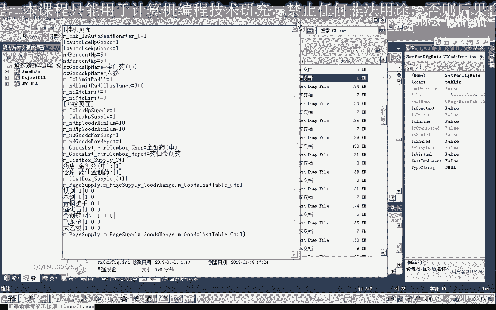

那么我们下一节课呢，那么就是关于配置文件的这个这个相关的内容的话，我们就讲到这里了。

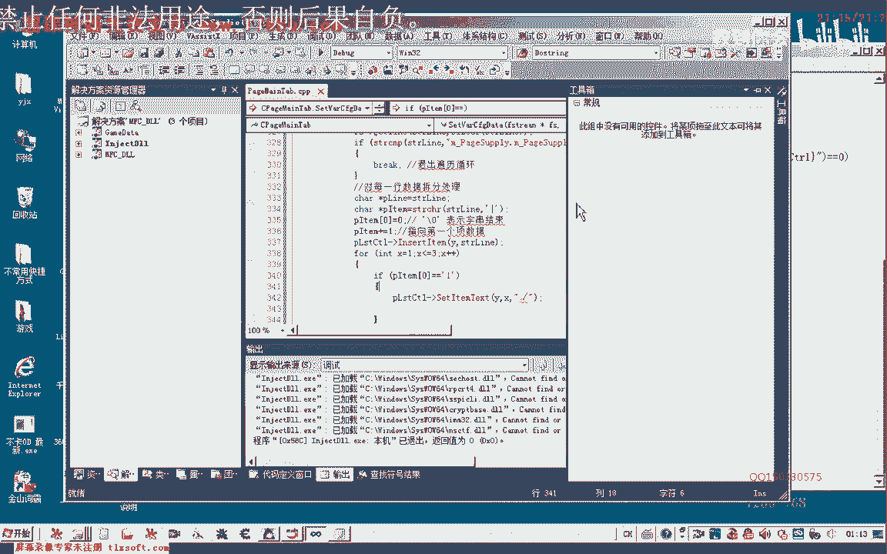