# 郁金香老师C／C++纯干货 - P10：021-分析动作数组与攻击捡物功能 - 教到你会 - BV1DS4y1n7qF

我是郁金香老师，qq 15033057，欢迎大家参加预期项技术编程培训，那么今天我们这节课分析的为我们主要是为我们这个挂机打怪做准备，呃，那么首先呢我们要分析出攻击怪物的这个功能。

那么这个功能呢它实际上封装在我们的这个动作里面，那么动作里面呢它就有一项就是攻击怪物，那这个动作呢它一共有12项，它是一个嗯动作的一个数组，那么我们可以那么分析的思路呢。

我们就可以从这个动作的数买入什么，那么这个动作因为在比如说使用攻击的时候，他肯定要去访问这个数组里面的这个相应的一个数据，或者说访问这个对象，那么我们就可以从这个来入此。

然后我们选中某一个的时候来数开的尺寸会变，那么这个时候会把呃这个动作数组里边的啊，某一些数据来写到呃相应的一个变量地址点，但是如果我们把它放回去，那么这个地址的词呢它也会改变，如果我们选了捡东西这个啊。

那么这个时候呢它这个变量里面的数据也会变啊，那么我们可以通过这个变化的数据来来找到呃，对呃呃来找到这个动作数组里面的某一个对象，然后通过这个对象呢，我们再来找到这个数组啊，找到这个数据好的。

那么我们具体来看一下该怎么操作，首先我们把c一打开，然后附加到我们的游戏里面，那么首先呢我们一般说这个鼠标指针没有变的时候，也就是没有忘那一个变量里面写词啊，这个时候呢它的数值呢应该是零啊。

当然这只是可能啊，因为我们立项的话都只是猜测，然后再去分析验证是不是这样，没有分析出出结果之前呢，我们都不能够断定百分之百的就是这样，那么我们先做一下啥事，好那么这个时候呢扫出了很多的结果是零。

那么我们选中比如说选中这个攻击，那么相应的那一个变量它写写入了一个数据，用来表示攻击啊，攻击的一个数据就写在这个变量里面去了，可能是写的是这个对象的一个地址，或者是与这个对象能够表示这个攻击的一个数据。

或者是一个i d，那么这个时候的话他肯定不会用零来表示，那么我们就收比零大的一个数值，好那么这个时候呢还有3万多个，然后我们就把它放回去，那么放回去之后，这个鼠标是没有变化，这个时候呢是一个精确的数字。

那我们可以多收几次啊，那么这个时候结果就比较少了，还有1000多个，那么我们可以反复的扫，反复的扫一下，好然后呢我们再次选中攻击啊，让这个鼠标的指针呢呃这个图标来有变化。

那么这个时候呢肯定它的数值就是比大的一个数值，而且的话这一段时间呢它不会有变动，我们没有去更改它，那么也是一个未变动的一个数值，好然后我们把它放回去，那么这个时候呢它的应该是一个精确的数值零。

那么再一次选中它，比零大的一个数字，嘟嘟好，那么我们放回去，这是什么精确数值为，但这个时候呢数值呢依然比较多比较多，那么我们还可以怎么选择呢，那么我们在选中它之后是一个非零的一个数值。

比零大的一个数字啊，这个时候呢它没有变动，有变动，那么我们把它放回去之后再选一下它，它也没有变动，放回去我们另外选一个对象，这个时候呢它变动搜一下变动的数字，然后呢再说一下未变动的数值，好。

好把这个放过去，再选中一个数字，那么最后呢选中的是这个数值，那我们选中一心用16进制来查看一下，最后就剩下一个数值，那么这个呢可能就是我们的这个对象，那么我们把这个对象来记录一下哈。

因为这个时候它显示的是一个很大的一个地址，那么这种数据一般是一个对象，那么我们首先选中对象，一对象一记录下它的一个数字，然后呢我们选中对象二，也记录下它的一个数字，然后我们再选中对象三啊。

也记录下他们探究的数字，那么我们对象的这个数值我们取得了对象的地址，我们取得，那么这几个对象的话，他应该是在如果是要找它的对象数组的话，那么这几个数字呢它应该是相邻的，是挨着一起的啊，挨在一起。

那么实际上呢我们可以嗯这个时候呢就可以搜16进制的啊，这个数数值，这是第一个，那么这个时候呢我们一共呢会输出三个数字，123，那么我们查看一下它的内存空间内存区域。

来比较一下是不是连续的放了我们这三个对象，那么我们看前面是自己啊5050低位的啊，这是第一个，第二个呢是5298啊，也是的啊，第三个呢5410啊，也是的，那么这个呢也是一个对象数组，第一个啊。

这个时候我们的动作对象对，那么我们再来看第二个，看一下它的内存空间内存区域，那么我们发现了这个的话啊，我是一啊，也是一样的，它也是我们的动向啊，这个动作对象数组，那么再看这个内存空间的。

我发现这个里面它成的也是的，也是这一片数据，但是我们要找的话，我们还要呃接下来我们用d进入到附加到游戏里面啊，继续分析。

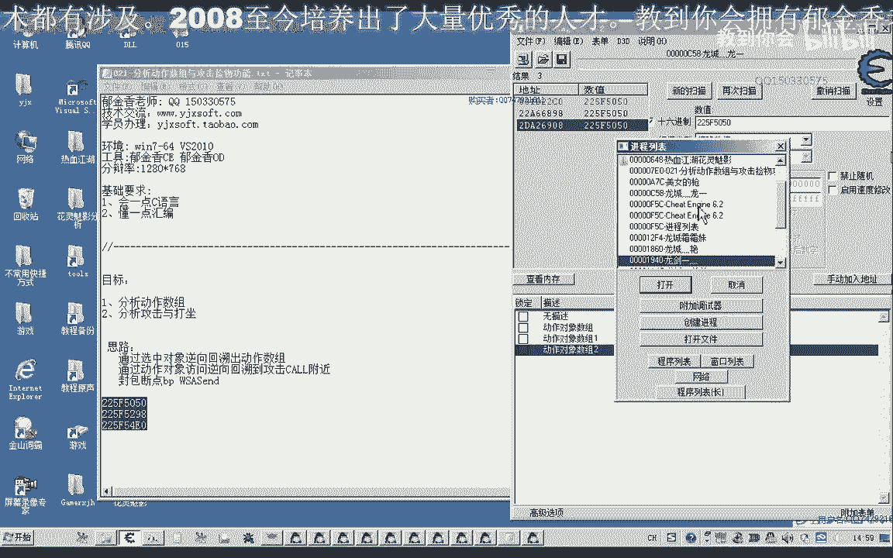

那，么我们把找到的这三个嗯动动作对象的数出来都进行一下对比，看哪一个是我们所要的或者是三个都可以用。

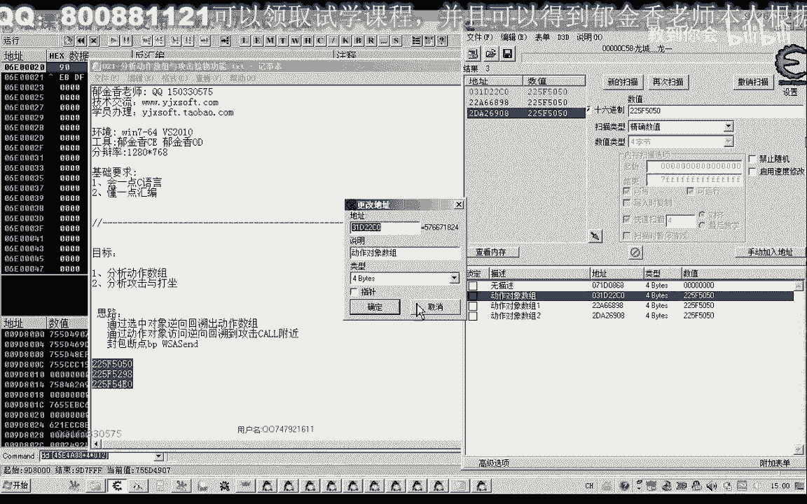

当然这个的话是直接找到的，是一个基地址，但是我们看一下它里面的对象的话，非常的多啊，非常的多太多了啊，那么我们可以在这里下个断点看一下，一si 1 si的来源，这个数组呢非常的大啊。

可能它是一个总的上一节课好像我们也分析到了这个数组，那么上次上次我们在分析的时候呢，呃这个740这个地方呢，它也包含了我们的背包的嗯，这个相关的一些数据也在这里面，那么可能的话也就是说我们这个地址的话。

那我们把它记录一下，那么这个地址呢它可能是一个啊各种对象都在列举的，这个我至少是我们的背包对象，还有我们的上一节课分析的应该是周围的怪物啊，怪物对象也在里面，还有就是我们今天的一个动作，动作对象。

玩家对象好像都在里面，啊啊啊。

那么这个呢它可能是一个总的对象，那么我们可以来跳过了，因为它我们要找的应该是一个干净的。

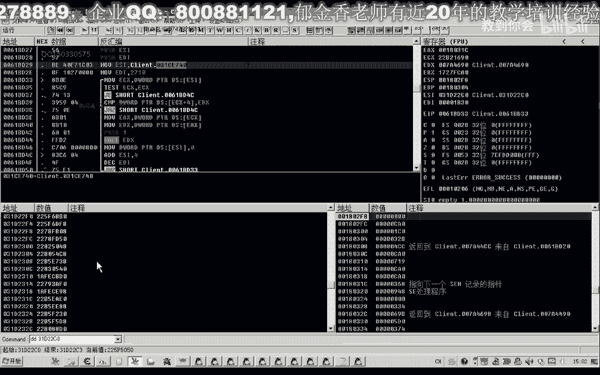

干净的一个等等对象地址。

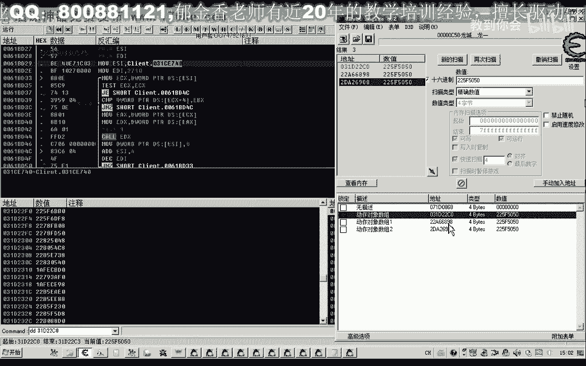

然后我们再看第二个放，那么这个的话它包含的比较少，一般34678 90 11 12个，那我们再看到这里的刚好是12个对象，12个对象，所以说它包含的一样的。

那么这个表呢比较干净一点啊，那么最有可能是我们的对象，这个可以用的，那我们再看最后一个是不是也是很干净。

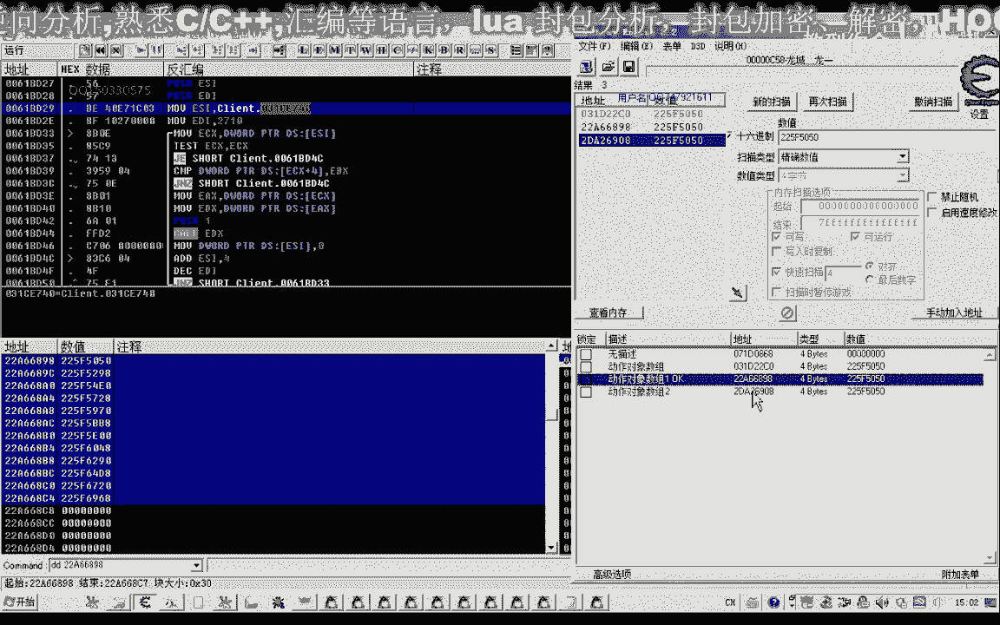

那么这个呢它也有一大片，我们发现了这个要多一些方向啊，这个里面包含的数据太多了。

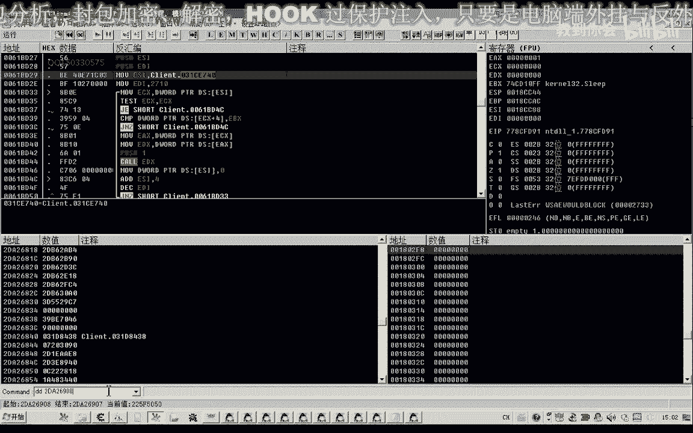

我们不方便使用，那么我们重点呢就找第二个，好第二个，那么也就是这个，那么但是这个呢我们找到了它不是像这个一个绿色的一个机子。

所以说我们还需要查，那么我们在这里呢给它下一个断点，那么内存访问的断点e bx，那么在这里呢我们能够找到一bx来源于这个地址，来源于e d i加410+1 i什么，那么我们在这里下载断了。

把这个段给删掉，重新让它跑起来，那么我们能够看到这个时候e d i n等于这个数值，e s i呢我们看一下等于零，那么是从开始到这样的，那么也就是说他公式的话，我们可以这样表示，加上410+45下标。

5d i，你再再下一次短右键，右键的数字是这个，这样是不对的啊，那么可能这个地方呢它对很多绿色的，比如说我们背包它的一个偏移是420，可能他也会从这里访问啊，然后我们重新在这里把这个数据复制一下。

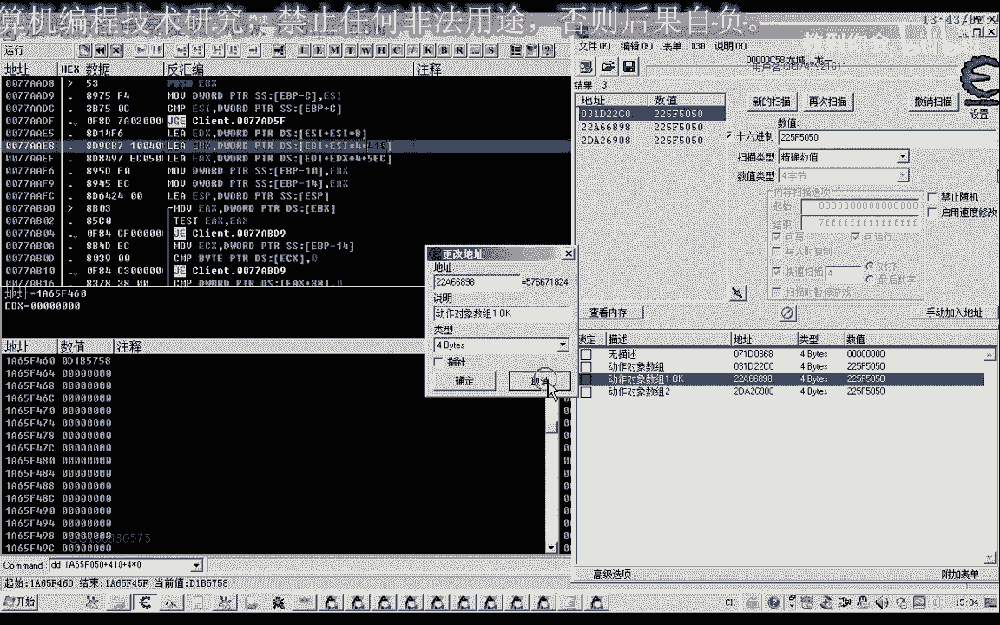

到这里，重新给它下一个黄昏断点，再试一下，另外找一个地图一比x，那么再跑一下，还是到了这个地方bx，那我们看一下现在的e d i等于多少，等于这个数是多少，第一题要加什么，四不是41啊，应该是这个数值。

删掉为什么断了，那么接下来我们就要找这个api的一个来源。

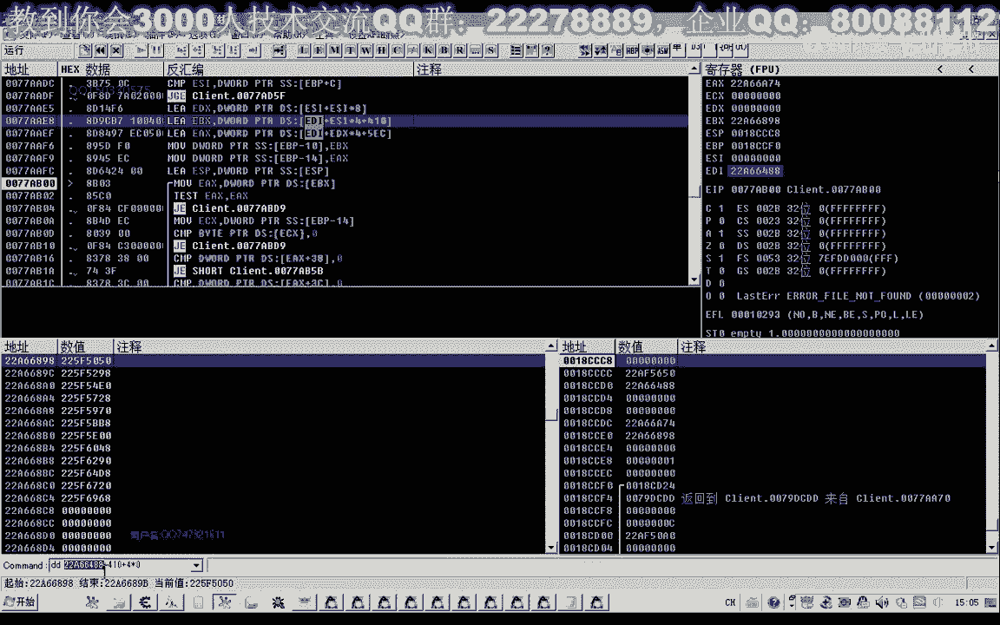

用c来讲一下，那么这个时候呢我们也找到两个地址，第一个第二个这两个机子，看一下，第一个是31k9 k98 ，那么我们在里面搜一下。

那么在这里面呢恰好一个3a3129298 ，那么这个呢呃我们直接就把它用上，能够在里面收到的肯定就是我们的机制。

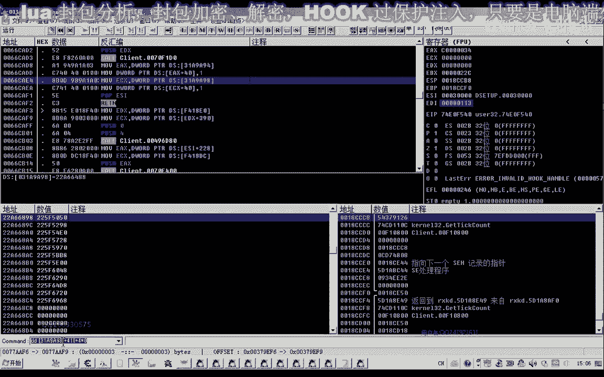

那么最后呢它的一个表示方式呢就这样表示的，这就是我们的对象，动作对象录，那么找到了这个对象数组之后啊，那么接下来呢我们要找一下它的一个使用，它的一个使用，也就是说我们主要的目的呢是要找出这个攻击。

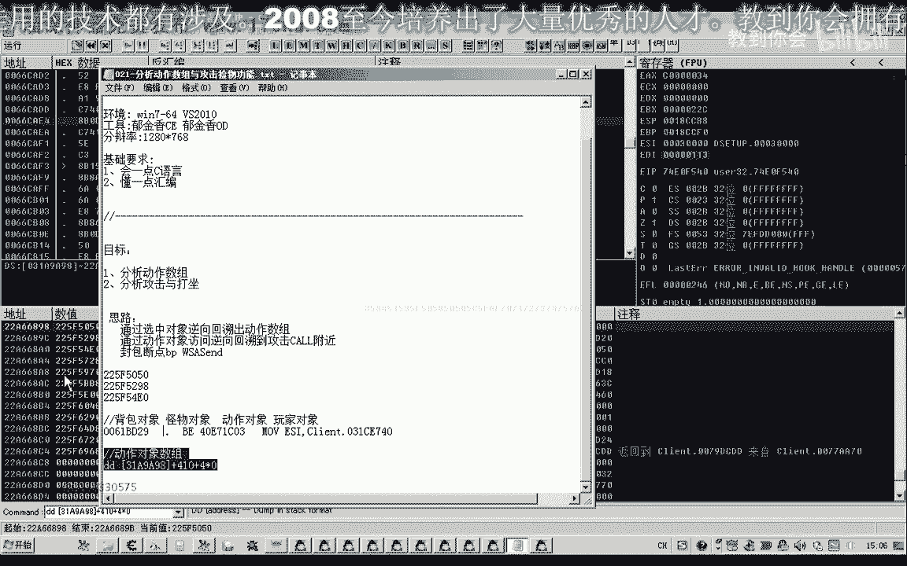

还有就是我们的捡东西啊，这些我们有用啊，比如说这个攻击的扣，那么这个攻击的破的话，他肯定要怎么样啊，他是在下的是012，这里是攻击对象，那么在我们在使用它的时候，它肯定会来访问这个对象。

那么我们可以在这上面呢给它下一个内存好用的一个断联，但是它马上就会断下来，那么马上断下来的话，这样变对我们分析的话不是很方便，那么我们可以先退出。

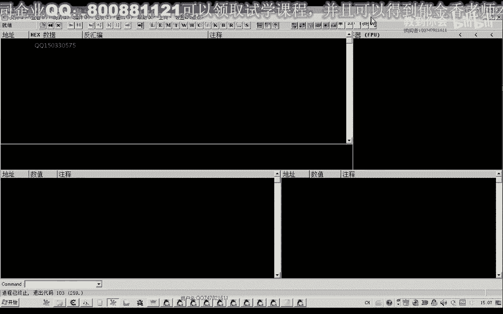

退出之后我们用c来分析这个功能，刚才我是找到的是这个地址，3669298了，嘉陵是第一个啊，加四呢是第二个，我们的这个对象加八，也就是我们的攻击对象，3129位9号，如果在这个地址先读出来。

它是一个指针，三角的指针，这里面应该是加八，就指向我们的公式，31292982，加上看起来再来看一下这个公式，要加一个410，再加一个，还有一个410的一个偏移，那么这里应该是四一化产品。

那么这就是我们的攻击的那个对象，攻击的对象，那么我们要找这个攻击库的话，我们就可以从这个和数据流程这个工具后的对象，那我们就找一下访问了这个，我们要找的是这个地址的，存放了这个地址的这个数据。

这里改成2k668 a t，那么这个地方呢才是存放着我们的攻击对象和这个数据，那么然后呢我们找一下访问的这个地址代码好切换到游戏里，注意这边的一个变化，那么我们点一下鼠标右键的时候呢。

它将使用攻击这个功能，好那么这个时候呢他就攻击相应的一个怪物权，那么在选的时候呢，他这两句代码呢只执行了一次，这两句代码我把它记下来，那么这两句代码的话应该就在我们嗯，那么攻击获得一个附近的。

那么还有呢我们这个其他的动作，后来它也是可能也是在这个附近，我们点一下右键，这个没有反应，我点减弱，这个，那也没什么反应，那么我们先来把攻击的啊，这个先分析出来，把调试器先卸载掉，再附加一次。

这个时候打错了，那么我们用d啊。

这个时候再次附加进我们的游戏。

那么附加标游戏之后呢，刚才在这两个地址呢，我们点攻击的时候呢，他被访问了被访问了，首先我们嗯转到这个地址，那么因为在这个地址的前面或者是后面，他就最有可能是调用了我们的攻击扣。

因为在这里的话它取出了我们的这个相应的这个攻击的一个对象啊，取出来，那么取出来之后呢，后面做了一些判断啊。

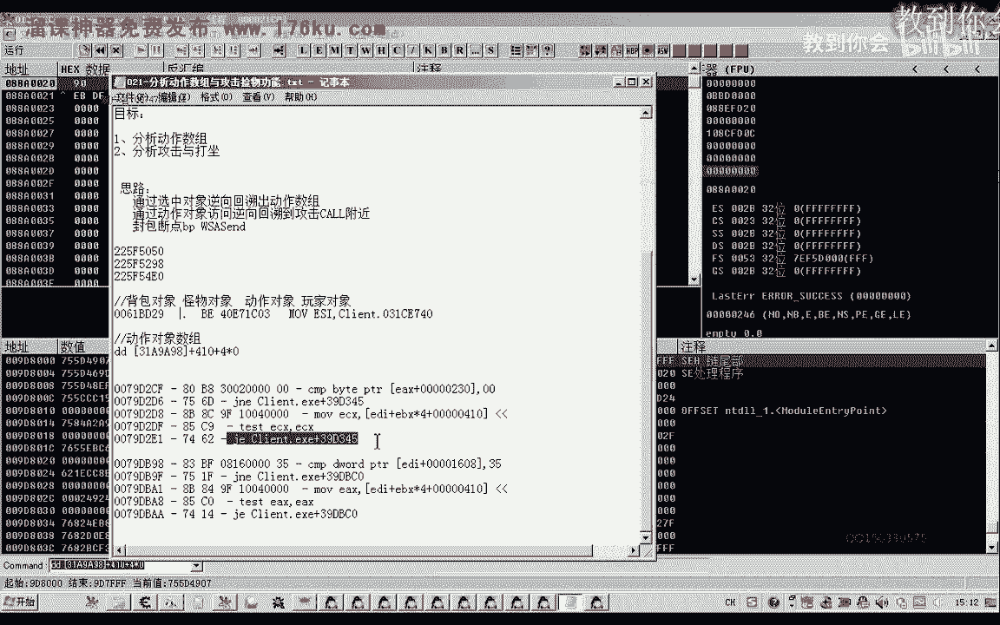

然后呢我们可以从这里开始跟一下，看有没有像这个攻击的一个后。

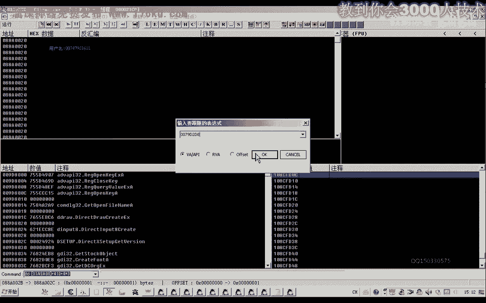

那么在这里呢我们给它下一个段，下段之后呢，我们再次进到游戏，把线程里面都会写，那么再次我们进到游戏里面把这个动作调出来。

点一下我们的这个相应的，比如说挑衅这个啊，运气调息的这个，那么这个呢我们进入到这里，我们看一下1b x这个时候代表的是我们动作对象，数组的下标是从零开始的，第二个呢是一啊，第二个是一。

那么如果我们使用其他的啊，比如说我们使用第四个啊，这个呢它的下边呢是三，看一下这里的高亮显示，高亮显示，然后我们按f8 向下跟，那么首先呢它把相应的这个对象取出来，比如说这个是三的话。

就是减物的这个对象先取出来取来取出来之后，我们看一下后面有没有跟这个空啊，如果后面没有网，我们就跟前面啊，这里有个空，但这个库呢没有任何的参数传进去，那么我们再往后等一下，这里有一个下标e bx被压战。

这里是我们的下标，哈哈哈，那么上一节课我们分析过前面几个，我们分析过背包的这个物品的一个使用空，那么它也有一个类似的这样的一个库里，跟这个框就是呃差不多的啊，那么这个扩的话。

它就有可能是我们的嗯这个相应的对象使用的一个孔，那么第二个呢，这里是商，第三个呢ec x呢等于这就是三个参数，一个是下标三五啊，就是这三个，那么这个ecx我们看是什么啊，就是来源于e d i488 。

这个数据是我们看一下488的成分的东西，哈哈这个数字来恰好就是我们22a66488 ，这是在最前面这个，我们来看一下，看一下就是这里面所放的这个数字，那么所以说这里1c x的话，就这啊这个数值。

那么几个参数都有了，接下来我们可以来测试一下，那么我们以打坐的这个为例，它的下标是为一，你再次跟一下，先跟一下，按下f打错，让f8 现在后面的这个扣下断，先在这里下一个断腿人。

那么这个时候呢我们看一下这两个参数没有变，那这个1b x呢变成了一，也就是说我们打坐的啊，做到这个库，好那么接下来呢我们用我们的代码注入器来测试一下啊，然后呢六six 60啊，读出里面的值。

就把我们的这个呃6466488这个读出来对象，然后再扣呃0079340，然后我们注入到游戏里边，看有没有效果，先把这个窗口也看一下，让我们看一下输入，注入代码啊，后来诸多事之后呢，也不出错啊。

也没有效果，那么说明这个扣的话可能不是的，不是的，我们再继续再分析一下呃，比如说我们看第一个走好，它也会断下这里的eb x来点音频，那么我们再往后边再更一下吧，再跟一下之后呢。

我们发现这里的e b x0 啊，这e d i是我们的那个488，它的机子数数，他又把这个第一个对象来取出来了，也就是相应下边的这个数组和对象取出来，然后做判断看它是否为空，如果为空的话。

就跳到后面来执行，如果这里不为空呢，它将执行这个空啊，将执行这个库，那么我们再来测试一下这个孔，那么这个库的话我们看一下它的参数性，那么它它的参数来是dx来源于我们的这个对象加四在这个地方嗯。

然后呢另外还有一个ecx来来源于嗯这个机子加27岁，那么我们也对用这个来写一下，都做一下相应的一个测试，那么这个写呢写的话要比较复杂一些，首先呢我们e d x下边的地址，我们以二为例。

二的话我们看一下这个动作是什么啊，一马运气调息这个某一，第二个应该是用一，然后呢它的机子给它补充下值一第二咳咳咳嗯，因为既然要从这个地方来，要读出来，啊。

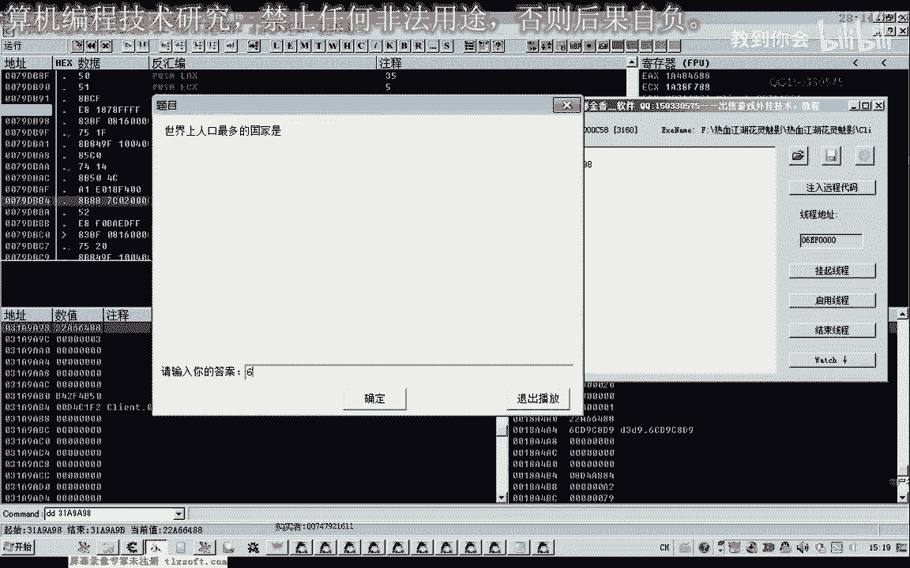

读出来也就是我们的相应的那个664，然后把这个字读出来，那么读出来之后呢，他要要取e x51 a x，等一个e d i加410，加上我们的前的1v x，或者是四神1p x，好这一句我们写好之后。

接下来这句的e d x照着他的写，e d x1 x加上4c lt e x加上我们的1n x x41810 ，没事，当然也可以直接在这里呢把代码按下空格键，然后把它复制，复制好了之后呢，粘贴出来啊。

这也是一种发病，然后呢再复习一dx或16796b，然后呢我们输入到游戏里面再看一下，那么这个时候呢他打错了啊错误，那么说明呢我们调用了这里面的相应的一个数字，那么我们看看他能不能够攻击怪物。

那么我们需要先选定一个怪物啊，这个是走跑，我们先把它调成跑开关状态，然后呢再选定一个怪物，把这里调成二，调到下边，也就是这个攻击，那么这个时候呢他开始去攻击怪物。

那么那这样的话说明的话我们的这个过程才是我们的动作使用口，而这个eb x呢就是我们动作的下标，那么我们要调用哪一个库的话，在这里改它的下标就行了，0~11共12个动作，全部在里面，什么节目开店嗯。

攻击怪物，这些人全部都在里面。

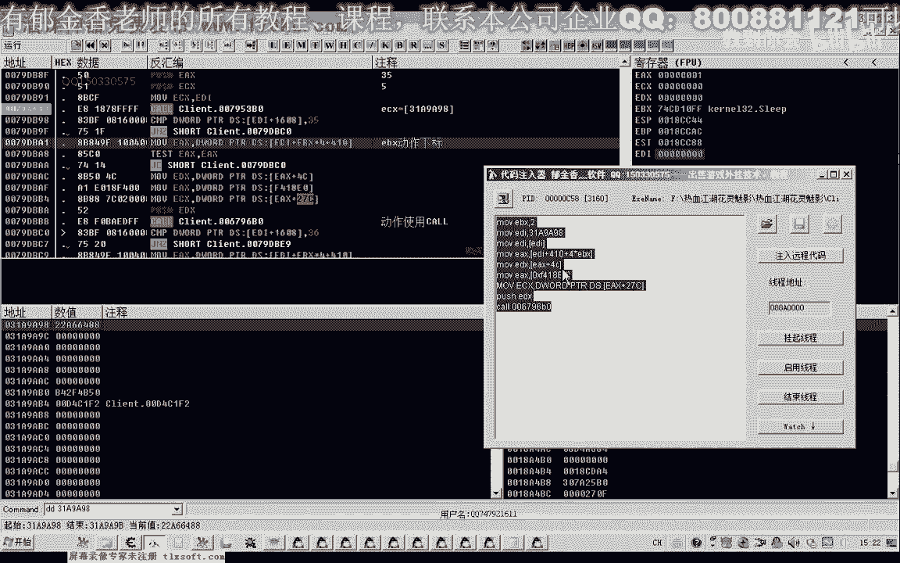

让我们把它复制一下。

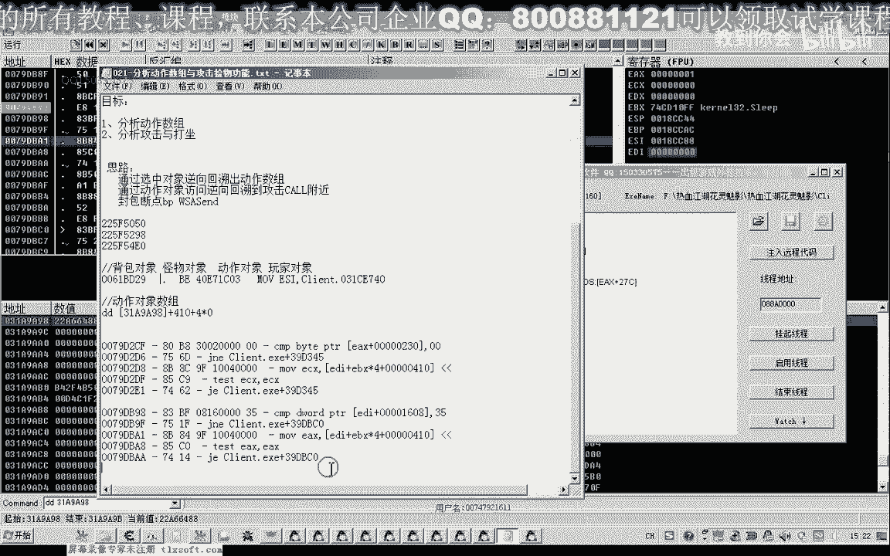

就是这个点，那么这个代代码呢，这段代码呢我们就把它复制出来，方便以后更新的成。

啊我们是从从这样的这两句话，啊，那么这个呢我们暂时就没有用了，1b x我们也跟到了这个地方，以及这个地方。

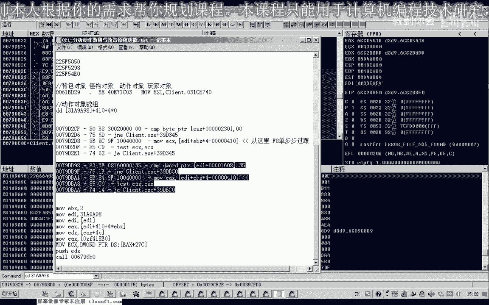

看一下a一啊，刚好是第二个的。

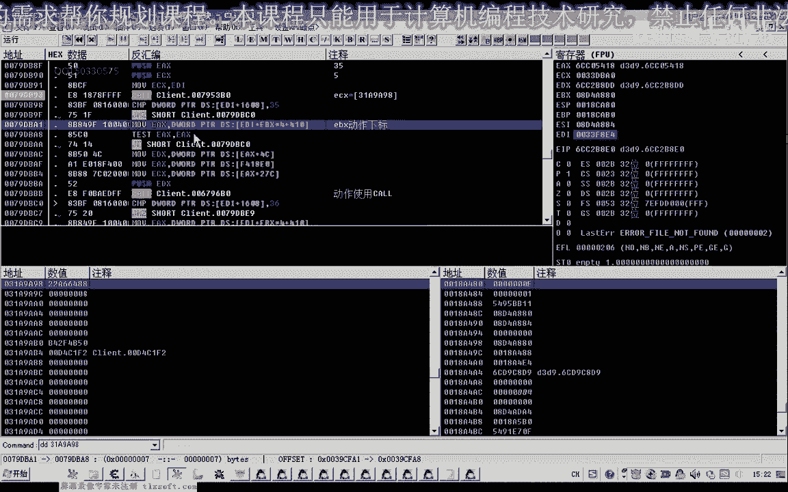

这个后面这个空刚好是在在在后面的这个这个位置，好我们保存一下，那么下一节课呢我们再对这个对象数组啊，动作对象数组这个数据来进行封装，以及它的功能的一个使用的一个封装。

那么这节课呢我们就主要是分析这篇数据啊。

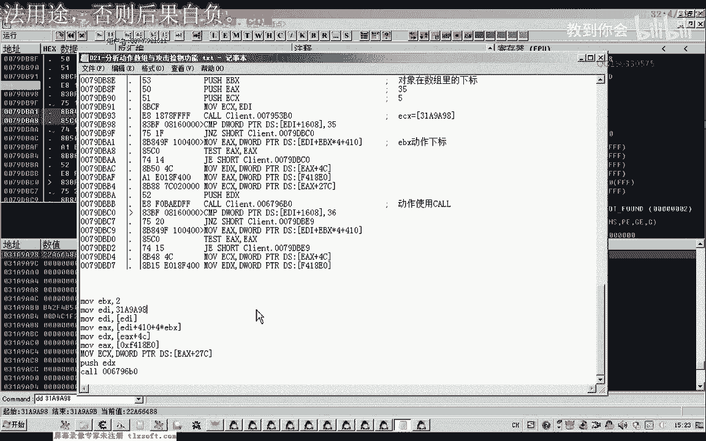

为我们后面的一个挂机的一个功能做一个准备好的，那么我们下一节课再见。

