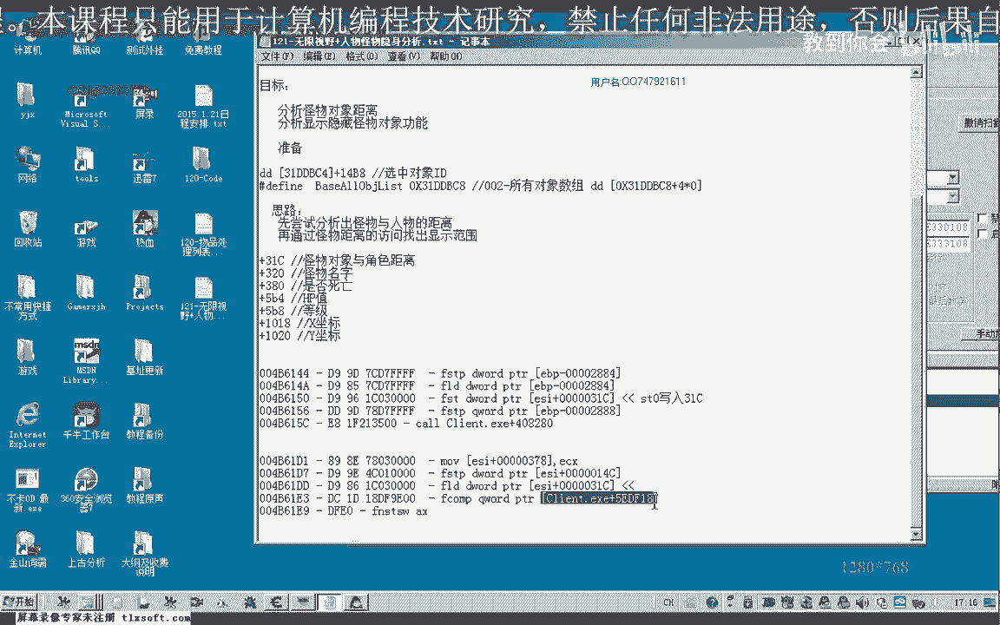
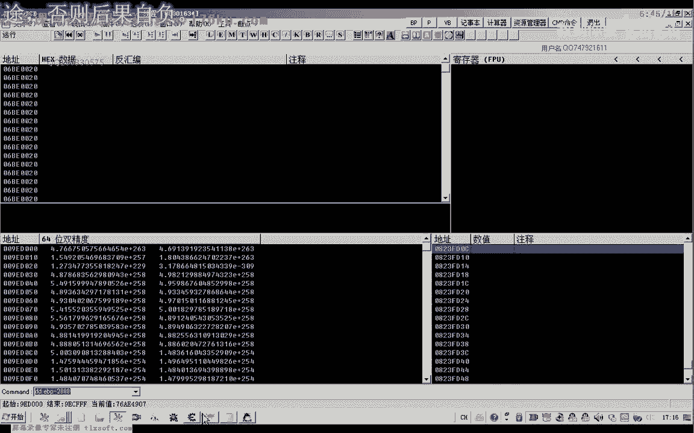
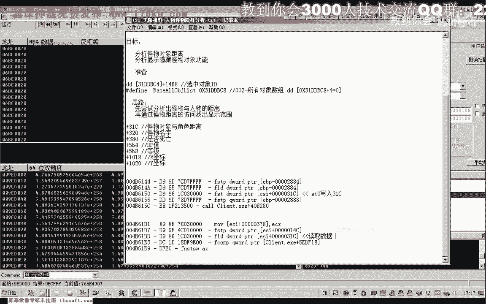
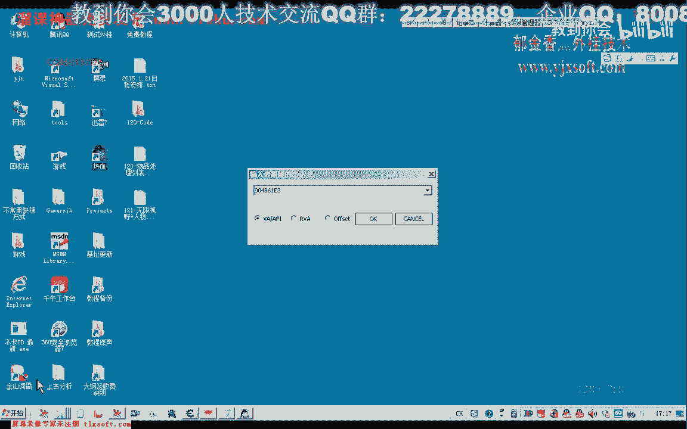
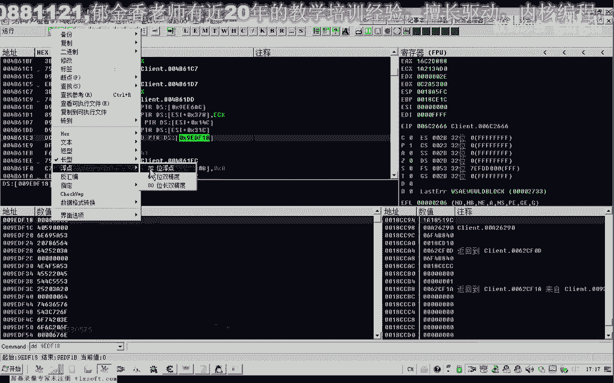
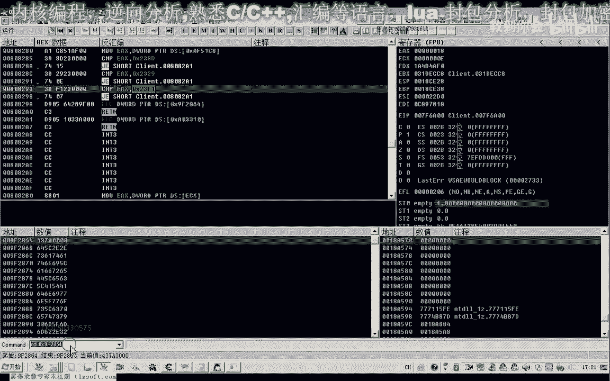
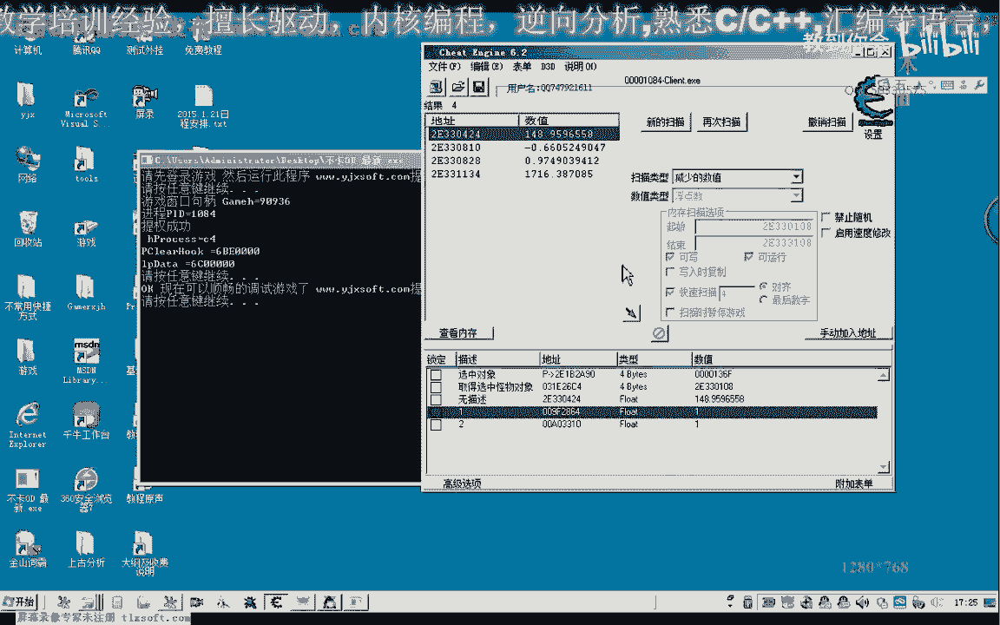
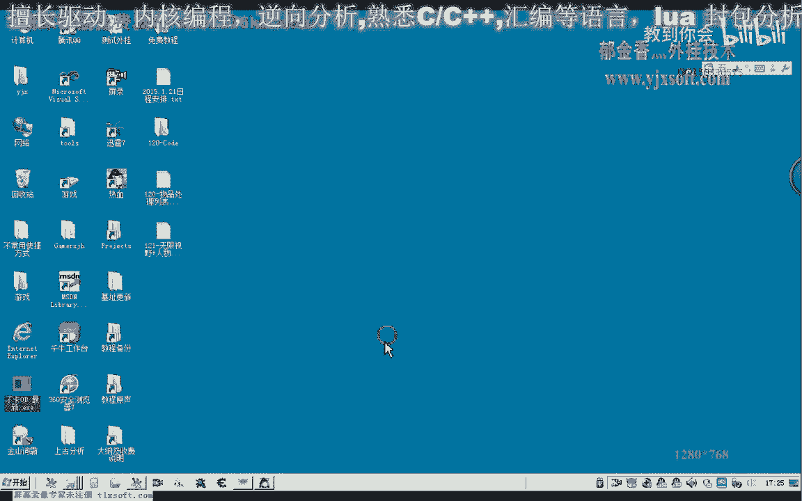

# P110：121-无限视野+人物怪物隐身分析 - 教到你会 - BV1DS4y1n7qF

大家好，我是郁金香老师，那么这节课呢我们一起来分析一下啊，这个无限视野以及这个人物怪物的呃隐身的一个分析，那么首先我们打开游戏，那么我们在分析之前呢，我们先要理一下思路啊，那么无限的视野的话。

我们一般来说周围的这个怪物对象，它存在的时候呢，呃他都会去判断啊怪物与我们这个玩家角色之间的一个距离，那么如果这个距距离它超出了它一个设定的一个数值的话，那么这个怪物呢它就不会显示。

那么只有这个怪物与我们人物的距离呢，它在规定的范围之内呢，它才会显示，那么我们只需要把这个距离的一个判断给他找出来之后，对它进行修改的话，那么我们把它修改到啊，我们就可能够实现一个事业了，更加的广阔啊。

也就是所谓的无限的一个视野，那么如果我们把这个距离的判断数值跟它改小，那么我们就能够达到呃呃这个人物怪物的一个人隐藏的一个功能，那么肯定呢它会与我们怪物对象的本身的一个坐标呢，它会把它计算出来呃。

计算出一个怪物到我们人物角色之间的一个距离，它可能是存在的，如果不存在的话，它也有类似啊计算的一个函数啊，那么我们可以从这个坐标或者是他计算出来的怪物，与我们玩家角色之间的一个距离啊，他肯定有一个判断。

那么我们只要把这个关键的这个语序给它找出来，那么我们就能够对它进行一个修改，那么首先呢我们上次因为之前的话，我们怪物于我们人物之间的距离呢，都是我们自己编写函数呢呃来实现的。

那么今天呢我们来找一下关注他有没有一个距离的一个属性，那么要找的话，我们可以来先选中一个怪物，那么一四比八这个地方的话是我们嗯选中怪物的i d，那么这个时候的话我们有选中任何的这个怪物的话。

它就是f f选中对象啊，这个地方，那么这个时候我们在在我们的视野范围之内的话，没有这个怪物对象，那么我们直到往前移动哈，距离比较近的时候呢，它才会有一个，才会有怪物对象的一个显示。

那么我们选中了这个野猪，那么我们看一下它的一个i d是一二bf，也就是在我们所有对象数组里面的一个嗯下标，那么我们取得他的对象的话，我们就可以了，通过这个所有对象的一个机制。

加上这个幺二pf下角乘以它的所谓的一个宽度，那么取得挂一个对象，那么取得这个怪物对象之后呢，我们把它相应的数值呢啊复制出来，那么作为我们要搜索的一个起始的一个地址。

那么然后呢后边呢我们在它的基础上呢呃加上2000哈或者是3000，那么这样的话呃一个怪物对象的一个大小的话，它最多也就是3000字节左右啊，所以说在这里的话，我们选择啊把这里来改为三。

那么这就是它的一个范围，那么它的这个范围的话，我们这里选择类型的时候呢，一般会是佛点类型，我们的距离的话一般会是火点，那么我们尝试搜一下火点类型，然后呢这个时候的话我们的对象的距离的话。

实际上它也是在变动的，那么当时呢我们远离这个目标的时候呢，这个数字呢它应当是变大啊，那么我们搜一下嗯变动的数值，或者是最好是搜一下增加的数值，然后我们再一次呢离它比较近的啊。

那么这个时候的话我们再搜一下嗯减少的数值，那么最有可能怀疑的话可能就是这个啊这个数字，那么我们再离他近一些嗯，那么我们来看一下吧，幺九那么离他远的时候，2746啊，离得近的时候呢。

三幺远离他的时候387395，那么这边的话这个就应该是它的一个距离，那么我们来访问一下这个地址，那么主要我们看他周围有没有这个比较的这个指令啊，有比较的这个指令的话，可能就是与我们的这个怪物呃。

就是以这个具体相关的一个判断，那么可能就是我们要找的这个数值，那么以后呢它有两个地方对它不断的进行访问，那么这两个地方的话都比较可疑啊，也就是我们的一个突破口，那么这是第二个地方。

那么从这里呢我们来看一下啊，这里呢我们是从s t t0 里边的取数据，然后写入到31c啊，偏移，那么这里是写入数据的话，它的可能性呢要少要小一点啊，那么记得是，那么也可能是从之前的代码呢。

他之前有一个代码，那么计算出来结果啊放到了我们的st t0 这个浮点寄存器里边啊，然后呢向里边写入，那么后边的话呃可能这个库里面呢有相应的这个判断，那么这里的话他直接呢也就是载入我们的这个嗯。

相当于是我们怪物对象的一个属性的，这个就是我们的怪物对象与角色的距离，那么这里的话直接就是载入一个距离，与我们的这个这个地址来进行比较，那么极有可能这个地址呢就是我们需要修改了这个数据。

那么我们用o d来附加进去看一下啊，这样我们可以看得更加的直观一些，好让他跑起来，那么在这里边呢我们也可以跟他下段。

也可以直接地转到这个相应的地址，那么这里呢我们直接转到呃，因为这里呢它有一个要compare的指令呢，比较的指令它的可能性要大一点，而且这里这里的话是读取我们的数据啊，录取到我们的sd那边去。

那么我们看一下这个这个机子的话，极有可能就是我们要找的这个机子，那么我们看一下它里面的一个数数值，但是我们发现这个地方的话它是一个零。

它也就是判断这个距离呢是否为零啊，嗯然后呢再进行一个测试，这里是一个文明的一个测试啊，接z啊，那么最后呃那么可能是另外一个，我们再从另外一个地方来看一下。

那么博士的话可能就在它的一个附近，那么这里呢他是从前面啊，可能是这个库里边啊，把我们的数值计算出来之后嗯，然后呢这个2884啊，这里它应当是这个相应的一个距离。

你看一下应当是这个库里边它把它计算出来了啊，计算出来之后我们进去看一下，可能这里呢是计算我们相应数值的，这就很棒了，那我就讲，那么这个时候呢他把我们的可能这个就是我们怪物的一个距离。

它通过这个过来来计算，就像我们之前写的这个扩一样，那么计算出来之后呢，保存到这个变量里面啊，然后呢又把他压到我们的这个站里边，121，最后呢写入到我们的这个怪物对象里面，把我们的这个距离。

那么写入之后呢，它这里又有一个ftp啊，又把它保存到我们288这个变量里边去了，嗯保存之后，那么我们进去看一下，那么这里有一个空啊，后边呢这里呢也有一个比较的一个指令，那么我们看一下它里面是怎么操作的。

然后呢我们再按f8 ，那么f8 之后我们看到这里有个250出来了哈，也是一个法点数，那么它与我们的这个e b p减288比较啊，那么这个e b p，减2888，那么刚才我们看到的。

那么这个的话实际上就是我们的一个呃64位精度的一个距离啊，怪不到我们的距离，也就是这个1s加31c，只是我们的e s i加31c，这个地方呢它是半进度的啊，是float啊，也是一个具体121。

那么这两个进行一个比较，那么这个250的话可能呢就是我们的这个范围距离，但是这个250的话突然之间就冒出来了啊，但是我们要注意到这里执行了一个空，那么可能关键关键就在这个库里面，那么我们进去看一下。

按下回车键，那么我们发现的话，最后呢他在这个s t t0 的数据呢来源于我们的f l d这两个地方，这里有一个接一，那不是这个数字呢，就是这个数字啊，这两个数值这里好的，那么我们把断点去掉啊。

然后再进去看一下，那么这里有两个数字，那么我们看一下嗯，第二个数字，首先，那么这里的话他用的关键字然是低位，那么这里他是破解类型的，那么这里的话数字呢比较大啊，是10万啊，大家看。

那么我们再来看一下前面这一个，那，么说明250的话不是从这个地方来的，那么这个4370a，嗯会不会就是之前的这个一个区域的这个判断啊，这里那么我们来看一下它的佛顶。

那么这个呢就是我们的250，那么我们把这两个机子呢，这个也是我们的呃，可是怪物的一个诗句，那么我们可能通过修改它的话，就能够实现我们的呃一个无限的一个四驱，或者是隐藏我们的这个怪物，好的。

那么这个呢我们表明一啊，这个呢比较大，我们也可以尝试修改它，那么这个呢我们表明二，标记为二，这里我们类型来选浮点类型，好的再移到游戏里边，我们看一下啊，好那么这个时候呢我们是能够看到远处怪物的。

那么我们修改一下这个数字，那这样的话叫远处的，的怪物栏就消失掉了，如果我们把它修改更小一些了，那么所有的怪物栏都消失掉了，那么我们也可以把这个数值来改变，改的比较大，那么这个很远的怪物呢。

它都显示出来了，这这上边的怪物，那么如果改成日本名的话，那么肯定远处的怪物了，就没有了，就消失掉了，那么也可以改为r2 啊，166，那么再改小一点的话，那么周围的怪物呢也会消失。

那么在这个时候的话就只有一两个怪物了，那么我们这是我们找到的第一个啊，看来也是有用的，那么第二个的话，这个呢我们把它改小一点，看有什么反应，那这个的话目前的话好像看不出来多大的效果。

那么重要的呢可能就是第一个啊这个视觉啊，第二个呢暂时呢呃看不出来这个所谓的一个效果，那么可能这个呢是对于其他的呃，其他某个对象的一个判断，暂时我们不知道，好的，那么这节课的分析呢我们就到这里了。

通过修改他的话，我们就能够隐藏我们的这个怪物，那么我们把它标记一下怪物的一个具体可隐藏怪物，那么按减号退回来，那么这个地方呢才是关键的地方，关键，好的这一段特征码呢我们把它复制下来。

那么这节课我们就到这里，那么关键字呢从这个地方进去啊，这里是关键。

好的。

