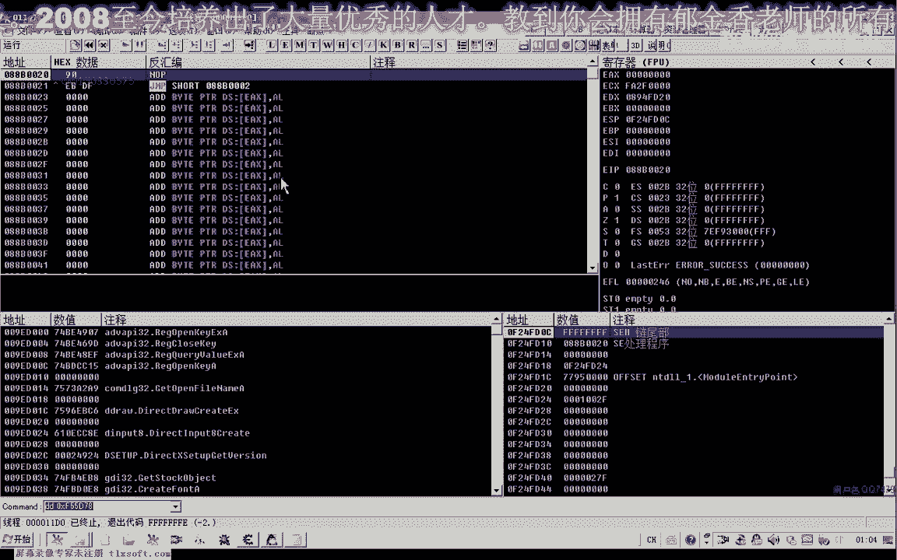
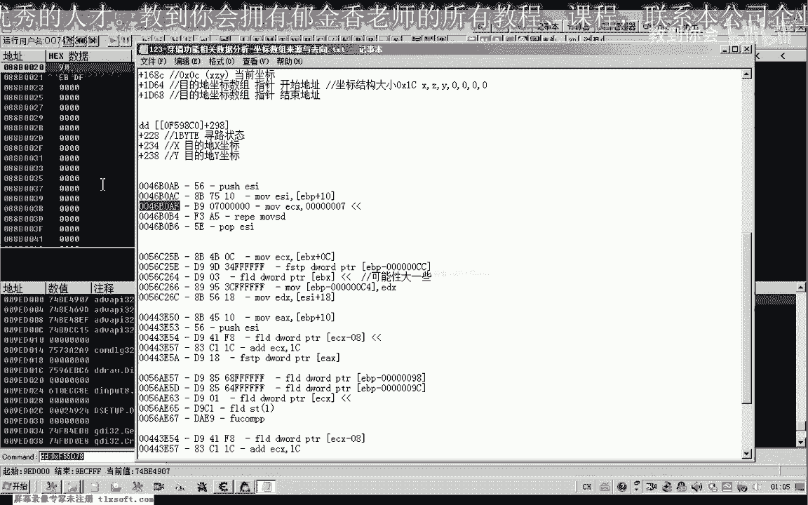
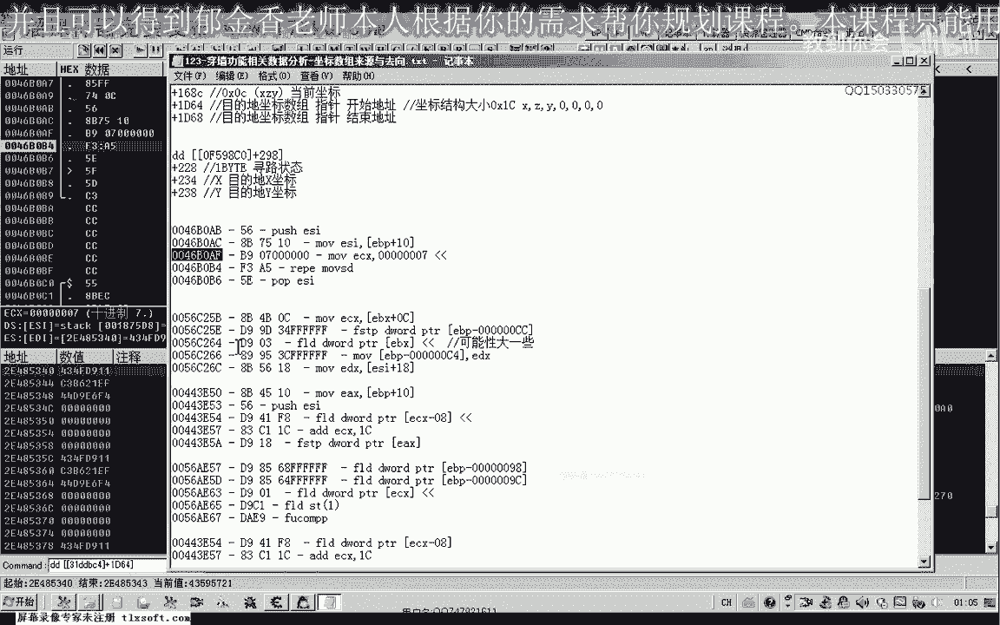
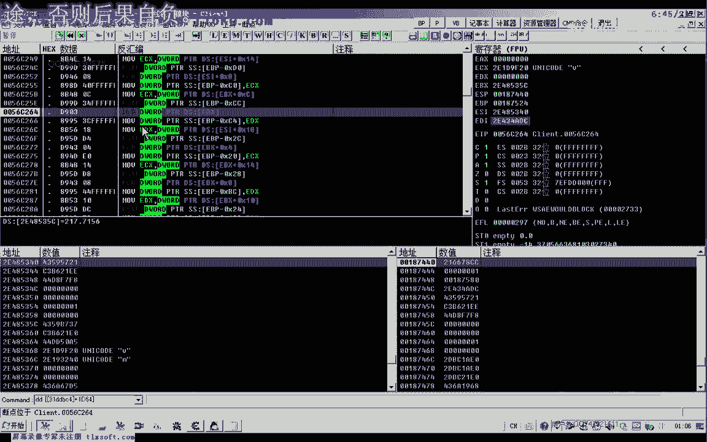
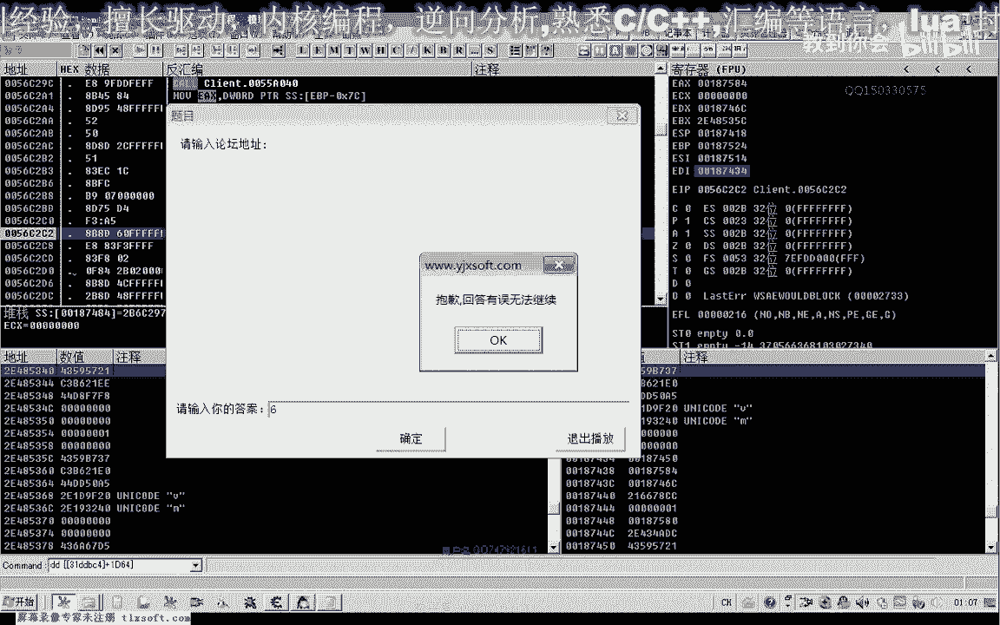
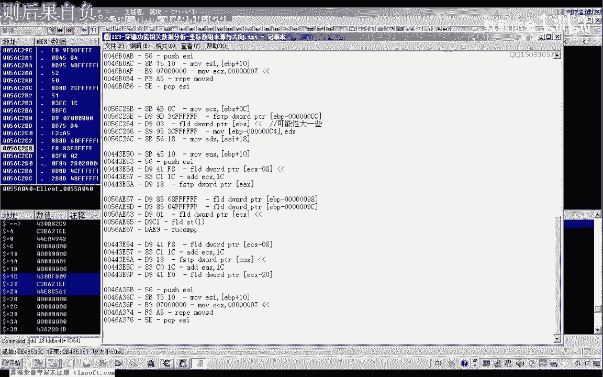
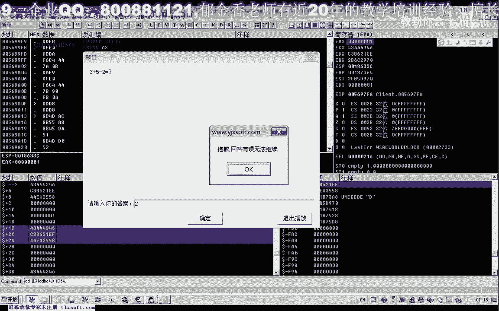

# P112：123-穿墙功能相关数据分析-坐标数组来源与去向 - 教到你会 - BV1DS4y1n7qF

大家好，我是郁金香老师，那么这节课呢我们继续来分析这个穿墙的相关数据，那么我们这节课呢主要从这个坐标数组的呃来源去啊，来源或这个去向呢去分析，也就是说访问了这个坐标数组的这个大的代码来分析嗯。

那么首先我们打开我们的c，打开c一之后呢，我们呃访问一下我们的1964的啊，这个也就是我们的这个坐标数组，那么数组里面的第一个呃坐标，那么我们对它进行一个反问，因为这个障碍判断的这个代码的话。

它可能就在他的一个周围，在它的一个附近啊，他会用到我们的这个嗯坐标的这个数组，那么有两种情况，那么一种情况呢它就是先判断这条直线啊上有没有，那应当是这种情况哈，他先产生一个直线的一个坐标序列。

然后呢他再去判断这个直线的坐标序列里边嗯，这个相应的坐标点有没有这个障碍物存在啊，那么应该是先产生这个想先向这个呃我们的这个数组列表里边呢，呃写入我们的这个坐标序列啊，直线的，然后呢再去通过判断。

如果是有障碍的话，他再通过一些算法来绕过这个障碍啊，可能是这种情况，那么无论是哪种情况，肯定都要对我们的这个坐标序列呢呃进行一个访问啊，也就是我们的1。64这个地方，那么注意啊。

这是我们的呃坐标序列里面量啊，第一个数组，那么第二个数字的话应当是那加上ec啊，这个地方我们上一节课判断的，那么ec那么这里呢我们应当是1334的这样一个结构，好的，那么我们从这里来啊。

访问一下这个地址，找出访问了这个指针指向地址的代码，那么然后呢我们啊走几步，好那么我们走到有这个有障碍的时候，我们看一下他走的这个路径的话，好像是不一样的，有障碍和我们的障碍。

那么我们看一下没有障碍的时候啊，我们再重新来一遍，那么没有障碍的时候啊，这是，那么没有障碍的情况，他会访问这几个数字，那么如果是有障碍了啊，那么我们后边呢这里增加了几行啊，那么增加了几行。

那么也就是说这后面的这几行的话，可能与我们这个障碍啊，判断他的关系呢可能要大一些，那么我们先把这个这几个地方呢先把它记录下来，那么这是正常的情况下产生的这个直线的路径啊，那么他可能也会判断在这里啊。

那么最有可能的实际上是在这个地方判断卡，那么在之前的话，这里像是像是写入的吧，我们都都进行分析一下，那么可能性最大的话应该是这个地方啊，那么在后面的话应该是他可能是判断了啊，有这个障碍了。

然后呢这里是在计算我们的这个要绕过呃，这个障碍的一些相关的一些代码可能什么，那么也就是说第二个访问的它的可能性的话，最大在它的周围，那么这些呢都是相关的代码啊，那么其中呢可能这个代码啊可能性要大一些。

那么因为呢我们就是说这里呢它是一个呃访问的代码，那么这里可能是一个生成的代码，向那里写入啊，先写入，然后再访问，而且就是说无论有没有障碍，他都会去判断啊，这是正常的啊，判断呢它有无障碍。

那么可能在他的一个上层的一个库啊，对这个进行一个访问。

反正就在它的一个周围可能性比较大，那么我们再用t来分析一下。

但是这种分分析的话比较耗时间哈，那么可能是运气好的话，可能几天一两周可能都分析不出来，那么运气不好的话呃运气好的话可能也有一两天的时间啊，因为它周围涉及的数据比较多啊。

要跟着这个地方，那么我们看一下啊，首先呢我们还是转到这个地方，看他究竟是写入还是访问。

那么如果是访问的话，我们就从这里开始看啊，这里呢我们按一下f2 ，然后随便点个地方，那我们看一下目的地坐标是340，那么我们看一下e s f e d i呢是340，340。

表示了从ei这个地方写入我们的这个坐标，那么是写入的呢，我们先把它越过啊，怎么说呢，他应当是通过我们的观察的话，它应当是呢要先生成这个路径啊。

直线的可能是直线的，然后呢再去判断，那么我们在这里的话嗯。

他可能对我们障碍的一个判断的话，可能性要大一些，我们从可能性大的进行一个分析，那么就从这个地方，那么而且我们发现了这里也是一个循环，那么它可能是循环来判断这个获取这个整个序列，这样判断。

那么而且这里是一个两层的一个循环，我们可以看到好的，那么我们再次啊访问一个地方，然后呢我们跟一下这个从这里访问这个数据之后啊。

它的一个趋向，还有周围他有没有空啊，如果他周围存在一个扩的话，它可能是这种形式的啊，扩什么什么地址，然后呢呃有一个ex呢，它会对这个ex的数据来进行一个判断，常配ex什么什么的。

或者是test ex什么什么，然后后面的是一个跳转jz或者是jn z啊，可能是这类的比较多，然后或者是把这个判断的值啊保存到了我们的一个数值里面，这一类的，那么我们主要找这种括号，那么如果这个扩的话。

它是对这个呃我们的这个坐标进行判断的话，那么我们再进去看一下，看能不能不能够找到这个障碍的相关的代码，那么我们首先看这个库啊，嗯那么这里的话看起来像是一个坐标，那这个扩的话。

我们看它的ex的话没有利用起来啊，那么可能的话这种可能性也比较喜欢。

那。

么我们再来看这个库哈，那么这个过来这里有一个比较啊，ex等于二什么什么的，那么我们看它的一个返回值，那么返回值呢他是一啊，它是一，那么我们再次对这个地方呢，那么这里呢既然有比较，后面也有这个跳转。

那么可能它的一个返回值的话，嗯那么也有可能的话就是我们的这个扩的一个判断，那么我们在这里呢跟一个条件判断啊，看还有没有等于其他值的情况，那么如果他这个时候等于一，那么如果还有不等于一的情况的话。

那么可能就是因为他至少应该有两种状态，但是这里他有一个嗯compare e x等于二的话，看来的话它也是有有这个状态的，嗯至少还有一种状态呢是等于二，那么我们再来看一下，看他有没有其他的这个情况出现。

那么我们目前还没有发现有这种情况出现，放不下来，说明他的这个数值的话一直是挺明晰的啊，那我们再次在它前面下断再看一下，那么断一下之后，我们看一下它的参数有哪些。

那么首先我们看一下它的这个参数与我们的这个目的地有什么呃关联，那么我们可以看到它的第一个参数的话是取得他的第二个坐标啊，这个有点奇特，取得第一个坐标，因为第一个坐标我们在之前在某个位置就已经取出。

取出来了去，落地就这个标啊，这个是从从这个坐标数组里面取的第一个坐标嗯，那么我们看一下这个库，进去看一下这个库它究竟有多少个参数啊，那么从在前面来看的话，它只有三个参数，也就是这三个坐标压进来了啊。

但是我们还是为了保险起见啊，进去看一下它究竟有多少个参数，那么从这里能够看到的话，return 0 x28 ，那么一共有十个参数啊，r8 的话，那么也就是从这里的话也是要到24。

那么后边这三个还有这里有个一，这里有三个参数，它又代表是什么数字，我们转进去看一下，那么这里也有一个坐标6a那么我们再看下边，那么这个我们就看不懂了，是一个什么数字，gb 6 f什么什么。

再看一下这里啊，那么这里我们就更看不懂了，但这个的话呃这里是一个坐标6a这里是c9 ，那么6a的话，我们应该有76a啊，多少多少，好像是他的第一个坐标。

我们看到这里我们坐标序列里面的第一个坐标和第二个坐标，那么它都传进去了，哈里嗯，那么很大可能这个过程就是对我们的一个目的地坐标的一个判断啊，对目的地坐标的一个判断。

那么或者它里边应当有一些对这个障碍物和相关的一些代码，那么所以说我们在这里呢，我们跟进进进来看一下啊，这个库哈哈哈，那么我们注意凡是有空的地方呢，我们注意看他后面呢有没有这个比较它的一个结果。

那么跟到这个地方我们看一下它也有两个参数，一个是c9 ，一个是76a啊，这里呢我们也能够看到两个参数，我们进进这个货看一下，有这个扩的参数的话就更多了啊，你应该x484416 。

那么这些一大片上都是它的这个参数，这个库就比较复杂了啊，但是呢我们能够看到两个比较明显的字，那么也就是在我们的这个坐标序列里面啊，第一个坐标路径啊，这是第一个点，这是第二个点，那么既然有这两个点的话。

它应当是在计算这两个点之间有没有障碍物啊，那么像这种课的话，最有可能是这种情况，那么我们看一下它的一个返回值，又来看一下，那么正常情况，这个时候呢他返回的数字是零，他对他做了一个判断，如果是零呢就跳转。

那么应当说还有另外一种可能就是为非零的情况下啊，表示可能是有障碍，那么我们再让它先跑起来，在这里我们下一个断点，那么ex，那不等于零的情况下，我们给它下一个断点，那么好像是没有障碍的话啊。

这个时候我们看一下啊，这个库我们该去掉了，这里呢我们也给他注释一下哈，可能啊船的目的地坐标，一坐标或目的地坐标，对对一，元素一二啊进去，那么可能是啊，这个只是说可能是，障碍啊，判断相关的函数，好的。

那么我们把这段来哈复制一下。

啊然后再让他跑起来，那么这个时候呢我们发现呢这样走的话没有断下，那么我们点这个墙壁，那么这个墙壁的话，这个时候我们就应当是有障碍了，那么我们可不是一啊，这里那么不是一的话，这里呢也是一个非零的一个数值。

反正是有障碍啊，好像它才会产生这个数值，那么我们再测试一下，那么继续有障碍哈，两个点以上可能不是有障碍的，哎呦这个时候还穿墙了啊，这个时候你有点，那么可能它是另外的有一个时间差，那么直接这样就穿墙了。

我们发现，在这里停了一下知识啊，那我们看一下有没有穿墙，的确穿墙了，那么看来的话它应当是有一个时间差，另外还有一个线程呢，它可能是在像服务器里边的啊，不断地发送我们的这个数据。

那么这里呢他打了一个时间差，那么另外一个函数呢它在移动啊，嗯可能是这样啊，那么我们再次看这个墙本来是穿不过的啊，这里卡了一个时间差，那么我们这里暂停了之后呢，他就实现了这个穿墙的这个功能了。

这个有点也是算发现了一个bug啊，那么证明的话有这样的一个表现法，证明我们可能比这个呃离我们的这个呃穿墙的这个功能的话，可能是不远的啊，嗯那么有障碍的时候，我们还是发现它这里呢返回的数值呢就大于零。

这是个好形象，也将案情况e x大于e x不等分级，那么我们再测试一下啊，没有障碍的情况，那么这个时候不会断下，那么一旦我们点这个障碍的地方呢，就断下了，就断线。

那么说明的话这个库呢就是一个障碍判断的一个库啊，嗯那么将来啊这个呢应该是一个障碍判断库，关键的地，啊那么既然这个地方是障碍的判断扩的话，那么我们而且调用这个库的地方，我们发现非常多。

那么我们就可以来把它的返回到这个地方呢，我们发现啊，因为看一下啊，这里再返回，然后呢这个数字啊再再倒回来看一下这个是脏的判断库啊，那么我们跟进去，那么看一下它返回到这个地方返回了啊。

但这里呢我们看一下它有一个跳转taste x e，那么如果等于非零的情况下的话，它跳转了等于零呢，可能就是从这里来就返回了啊，那么从等于零的话，它始终会从这里返回，那么这里的话应当是不障碍的情况下返回。

那么因为只有这个ex呢，它等于零的时候才会执行到这个地方，那么我们看一下是不是这样，那么无障碍啊，那么我们看一下啊，这个无障碍的情况啊，这里的e x等于一啊啊，他跳转了，那么这里可能是无障碍的。

那么跳转的话，我们继续看一下他从什么地方反过，那么反正在这个地方的话肯定是等于零的时候才会，那么反正是从这个地方返回的，ex都表示成功的，我们不管它嗯，再继续往后看，啊这里就是一个循环了啊。

那么循环的话我们也跳过啊。

仔细看一下后面有什么地方不是返回的，那么这里呢也有一个地方啊。

返回一，那么这个地方的话，我们在这里下一个段啊，看一下ex，那么也是为零的啊，这个地方，那么我们在这里看一下有没有ex-0的情况，啊再次看一下啊，那么这个时候呢都是为零的。

那么我们点一下这个墙有障碍的物品，那么我们发现呢这个有障碍的情况下，也是从这个地方放回，那么我们就可以从这个地方来来修改啊，嗯修改尺寸x的，嗯嗯嗯，让水或者防卫有障碍情况。

那么大致呢我们就可以来修改这个地方，把这段特征码复制一下，那么可能的话我们如果是运气好的话，我们就修改刚才这个地方呢，可能就能够实现我们穿墙的这个功能，当然我们刚才看到的它有一个卡时间。

好像也也能够实现这个穿墙啊，把这个时间一卡啊，他就穿穿过这个墙去了，那么我们再次看一下能不能够穿墙，那这个地方还是不能穿，这个有点奇怪，再下一个段看一下，好那么放一下再让它跑起来。

那么我们发现这个地方的话，而且这个时候呢跑过来了啊，我卡这个地方呢能够穿墙啊，我们看一下，肯定还有其他活动的一个县城，那么有很多，那么只有哪一个地方被占据，都是激活，那，那么的话我们暂时呢就分析到这个。

那么下一节课呢我们再分析一下，看还有没有其他地方的一个判断，那么这个地方的话应当就是一个比较关键的这个地方好的。

