# P113：124-穿墙功能相关数据分析-路径坐标数组去向跟踪 - 教到你会 - BV1DS4y1n7qF

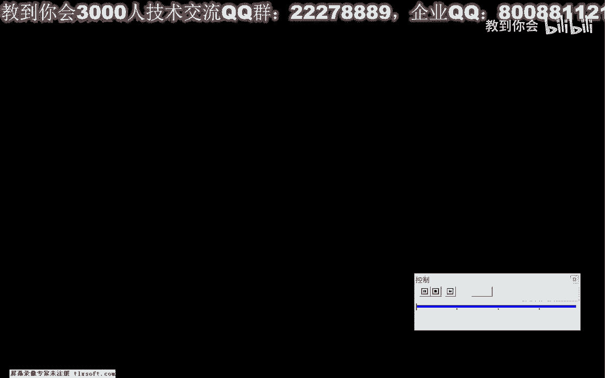

大家好，我是郁金香老师，那么这节课呢我们继续分析我们呃与穿墙相关的一些数据，那么我们继续跟一下啊，因为上一节课我们也是分析到了一个比较关键的位置啊，但是最终经过我们的测试了，嗯，还是没有通过。

那么像这种情况的话，可能还有其他的地方呢，呃还对这个障碍相关的有这个检测啊，或者是有这个判断，那么我们继续跟踪下边的这个地址啊，也就是它的一个趋向继续往下跟，那么当时呢我们只分析了这一个地址。

那么后边呢呃还有几几个地方，那么我们继续来跟一下。

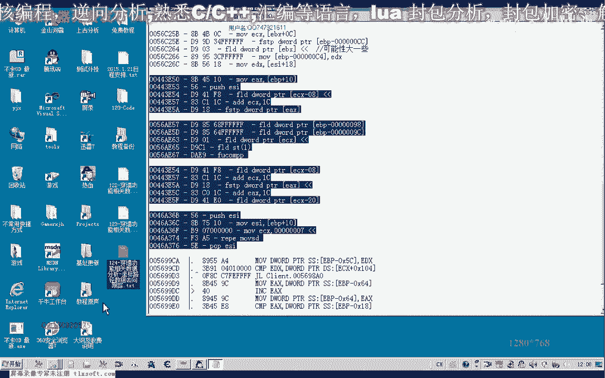

那么首先呢用d来附加到我们的游戏里边。

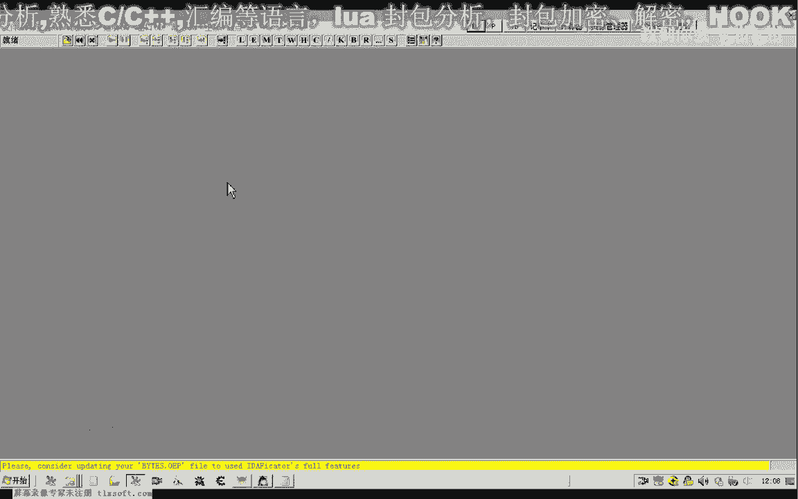

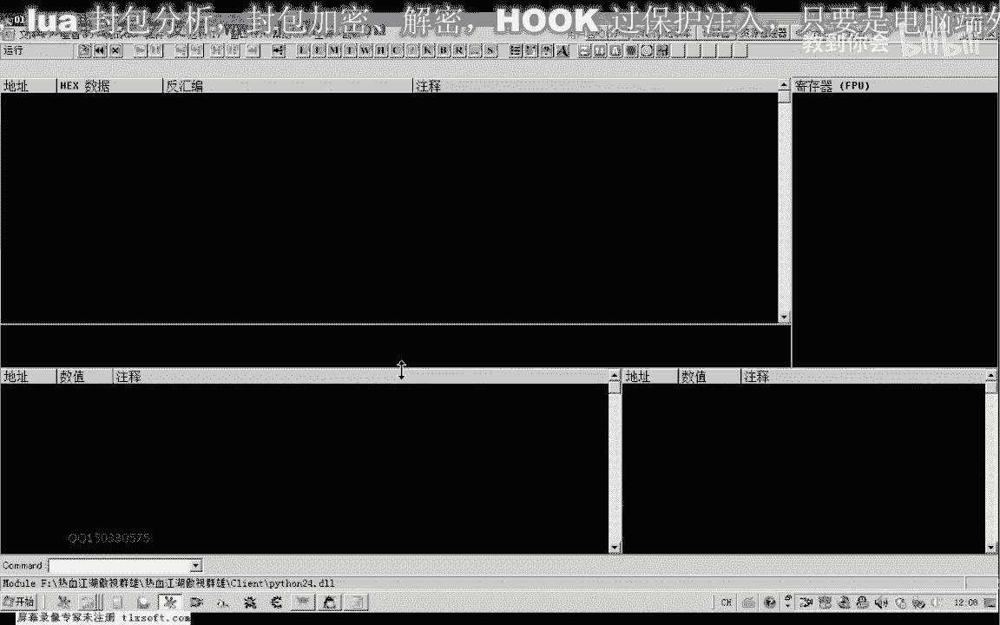

那么这个时候呢我们先转到第二个地址啊，这里呢也是一个呃访问我们的这个目的地坐标路径的啊。

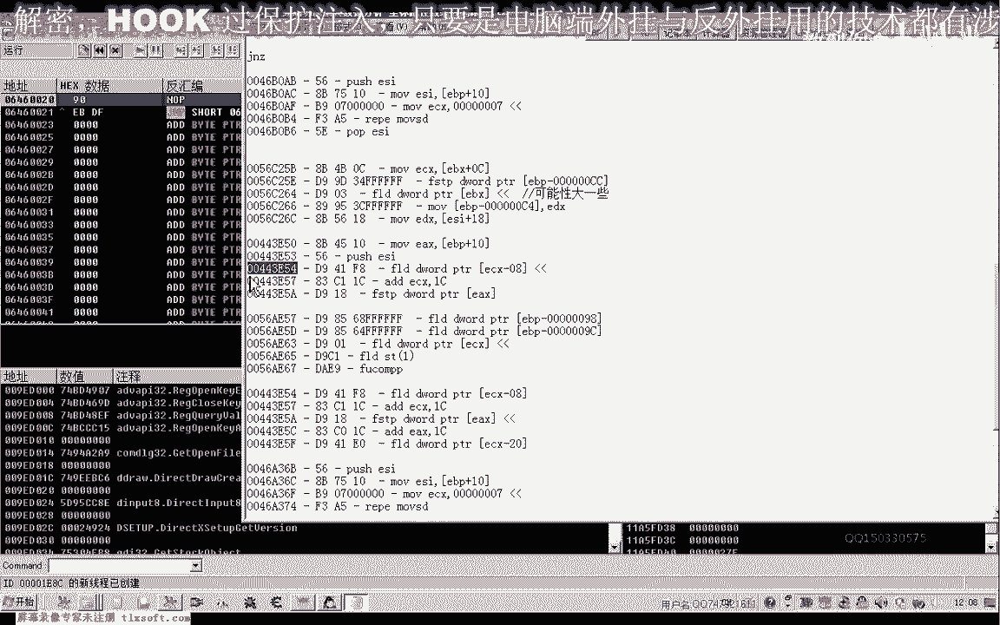

第一个元素的一个地址，好的，那么我们在这个地方下段啊，然后呢嗯走上几步啊，呃点这个走路或者是寻路应应该都会断一下，我们再试一下啊，如果是选六的话，也会断一下，都是访问了这个地方的呃，那么这个地方的话。

我们看一下载入的是ec x，那我们看一下e4 x是什么数据，e4 x啊，那么这里的话看起来有点相似的一个坐标啊，这里应该是一个坐标，再看一下吧，啊它前面这里呢还有一个坐标呃，你是在入这个地方。

a d d e c x加c啊，我们知道这个加塞的话啊，它的这个e c呢是它这个目的地坐标的一个结构的一个大小，应该是，然后来移向我们的下一个作表达，是我们看一下，嗯但是这里呢也不是太像。

反正也就是与我们坐标相关的一些数据，那么我们继续往下来检测，呃，这里把这个坐标读出来之后呢，它可能呢也会有两个点的一个判断啊，第一个这个坐标序列与第二个坐标序列的一个判断啊，一直往下跟啊。

这个时候呢往向后，但是这里的话它虽然说读出来了啊，读出来之后呢，这个ex的值呢它没有利用起来，那么像这种情况的话，这个地方呢一般呢不会是与我们的这个障碍相关的这个判断啊。

那么判断的话他应当呢这这几局的应当被忽略掉，二，那么直接呢有一个判断，那么可能呢像像这种类型的话，那可能性呢要大一些，那么我们再来看一下这个ex，那么这个扩的话。

后面呢它的这个返回值的话依然没有利用起来，那么所以说我们这一部分的这个判断的话可能不很重要啊。

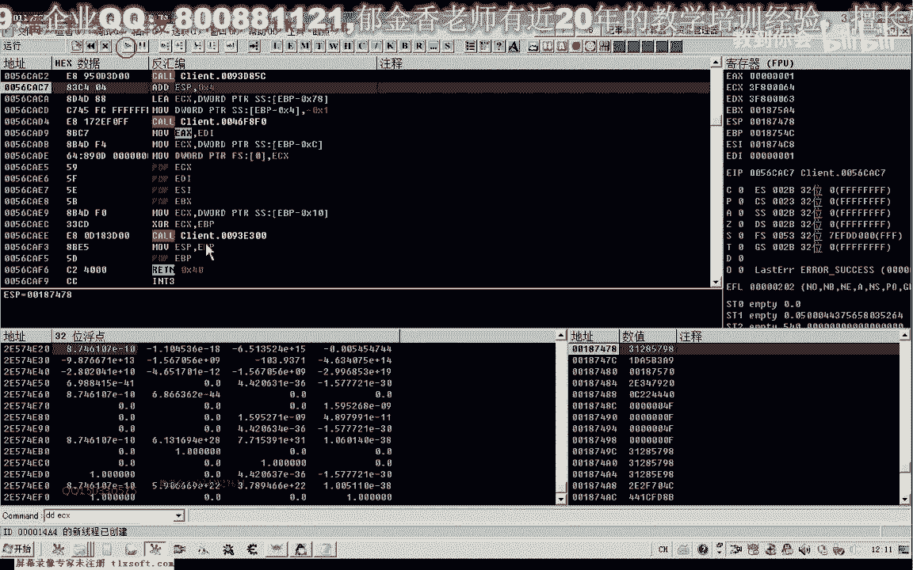

啊暂时呢我们越过，那么我们再来看一下这个地址56a的这个判断。

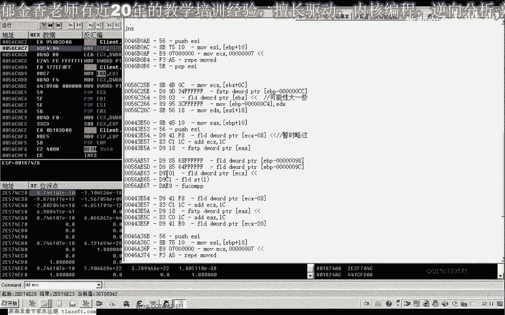

好那我们在这个地方下断，然后呢再让它走上几步，但是这个地方它现在它不断下了，这个有点奇怪，那么好像他是很特殊的时候才断桥，好像是遇到这个障碍物的时候呢，嗯遇到这个障碍的这个墙在这个坐标的时候啊。

嗯好像是这个时候断下的，放下来几次，那么我们先把它去掉，再重新在这个地方下端看一下，那么这个时候呢他实际上他把这个墙来穿过了，嗯，那么这里有一点奇怪阴影啊，好的，那么我们再次点这个墙。

那么也就是说这个目标它是障碍的时候呢，它会在这个地方断一下。

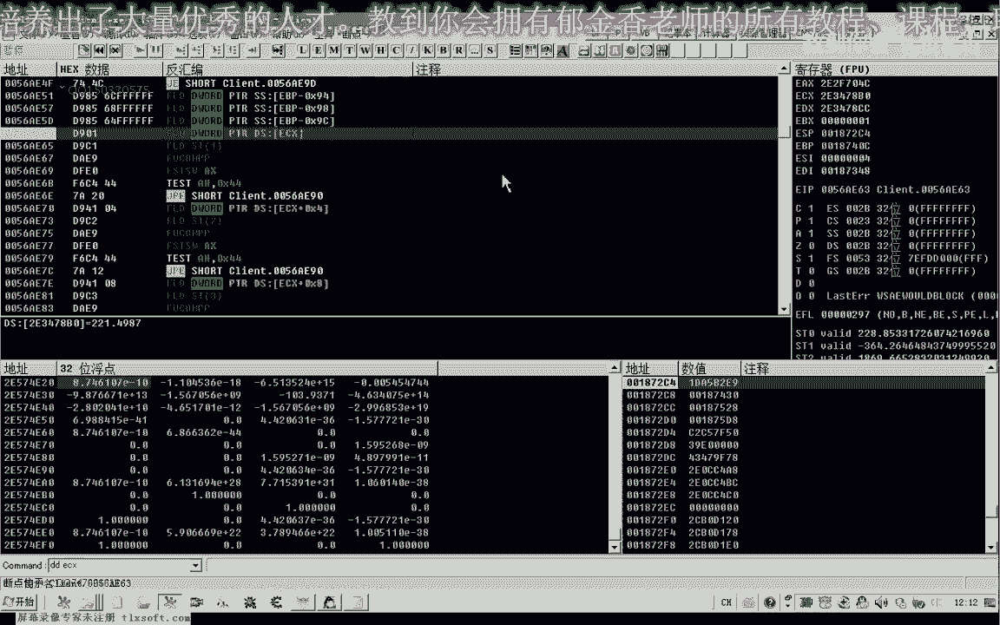

那么证明他的这个之前的某一段地址呢，可能有这个呃障碍的判断，然后呢跳到了这里，咳咳咳咳咳，那么我们发现的话它跳转的来源的话是从下边啊跳转过来的，我们下去看一下，从这个地方来，它有一个跳转往上跳嗯。

然后呢这里e cx了，我这个一dx了嗯，再进行一个判断，那么我们看一下ec x我e d x是什么，那么这个b0 加上e c的话，两个就相等了，然后就会跳到上边去呃，非零的时候往到上边跳。

不等于零往上边跳呃，然后等于零的时候呢往下边跳，好像这个呢有一点像我们的这个人物角色的这个目的地，坐标数组的一个起始地址和结束的这个地址。

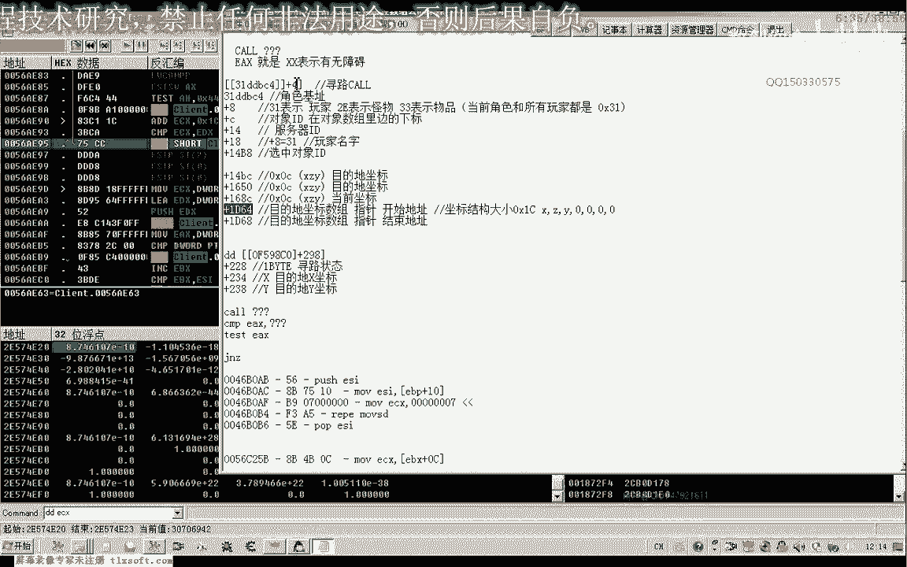

有一点像，那么我们加上一个1d6 式来看一下啊，b0 ，这里是c c，那么实际上这里呢它是在判断判断我们的目的地，嗯坐标数字骗你是否结束吧，那么因为这里呢它是它的一个结束的一个标志啊。

这两个呢它在判断嗯，那么我们再再到这个地方下一个段哈，那么这个时候呢两个相等的ec x相等的话，那么我们当然，就会有跳转，他一直在循环的骗你啊，做什么呢，我们再进来看一下这段代码，那么这里的话。

这里还有一些跳蚤，那么这里呢他也没有这个相应的扣啊，进行一个跳转，e c x1 d x，那么这里我们看应该是进行了一个判断哈，看下1a x和ec x e e c，那么这个b0 的话ex了，我们很熟悉。

而这个加四的话，e c e d这是b01 ，是一八，那么恰好了，也就是这个1。64呃，加上我们的1。68，那么这里呢他也是做一个判断，然后再这下面呢进行一个循环的判断，那么也有可能是这种情况啊。

也就是说呃他在这个或者上层的一个扩有有这个判断，然后呢如果是有障碍的话，才到这个库里面来来进行相关的这个偏离这些数据，那么我们先返回到上一层空来看一下它是不是这样的，是不是有障碍才进这个空。

那么如果是这样的话，他可能是要通过啊，有了这个障碍之后呢，他通过了呃这个过来计算啊，绕过这个障碍的这个物品，那么也可能是这样的一个功能，那么我们执行的返回，那么执行到返回之后的话。

我们发现了是这一个空五六为410，好那么我们在这个地方呢下一个段，那么先我们这样走的时候，我们看一下，没有障碍的时候呢，它不会断下，那么这个时候呢目的地呢有障碍之后呢，他才会断下，才会执行到这个库。

那么这个条件的话应当还在前边啊，那么这里也有两个，这里是一个坐标，我们能够看出来，那么这个地方数据窗口这里也是一个坐标，这两个坐标的话可能就是在我们1。64的坐标一或者是二啊，两个连续的坐标。

那么可能他也是在计算这两个点，这是否有这个障碍物，那么我们可以看一下a1 ，我，a一我们找一下部位，a一的有没有，那么我们再来看一下这里面的相关的数据呃，有一个为d4 的。

那么我们再来看一下七体四幺题62，这里呢它就是它的第一个坐标，好像是七体四，从这里来看的话，那么我们还是再理一下思路啊，就是说嗯有障碍的时候会执行到这里，咳咳，为障碍的时候呢，啊不执行这段代码。

那么也就是说这肯定是在这个代码之前，他有这个有障碍或无障碍的一个判断，那么我们再一次来嗯，返回到上一层扣看一下，所以在里面返回看一下，那么这里的话我们也能够看到两个坐标，a一呃，我这个。

这里还有一个目目的地坐标哈，气体四，那么很有可能的话，也就是说它是通过这个货来来纠正啊，我们的本来是他是走的一个直线的一个路径，那么直线路径呢，但是呢他就是说判断有障碍之后呢。

然后再通过呃这个过来计算计算怎么绕道啊，怎么绕道来执行啊，可能是这样的一个功能，那么这里呢它也有两个坐标啊，那么我们返回去看一下，那么就跟到了这个循环里边，那么我们在这里下段再看一下。

那么我们先把断点来取消掉，在在这里下断，然后没有障碍的情况下，我们走上几步，再次试一下，那么这个时候的话我们发现呢这个扩的话啊，无论是有障碍还是无障碍嗯，他好像都会断一下，那么我们再来看一下嗯。

是没有障碍的时候来返回的是数据呢是e啊，e x那么我们看一下它哎，这个库好像我们上一节课，好像上一节课已经有，有这个分析了，让我们看一下上一节课的分析，啊6b65056 b啊，650啊，对了。

我们上一节课已经有这个分析了，上一节课的话应当是在这个框里边呃，这个位置最终呢我们是分析出来的，这个位置呢是进行了这个坡的一个判断啊，那么我们再备注一下。

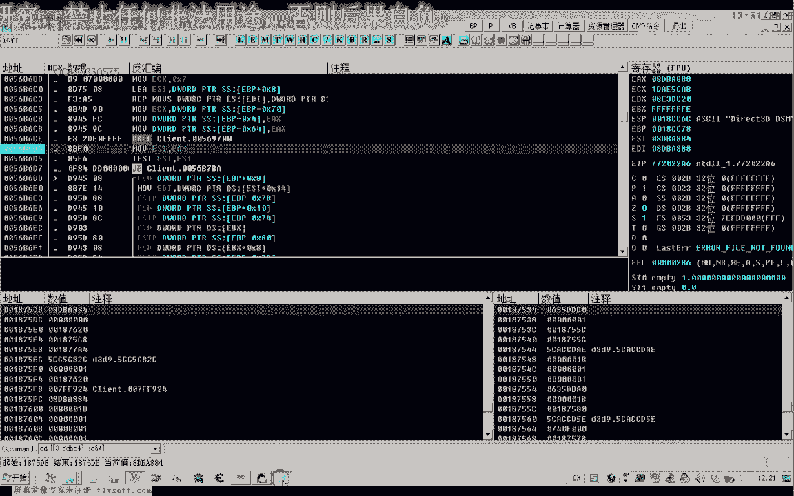

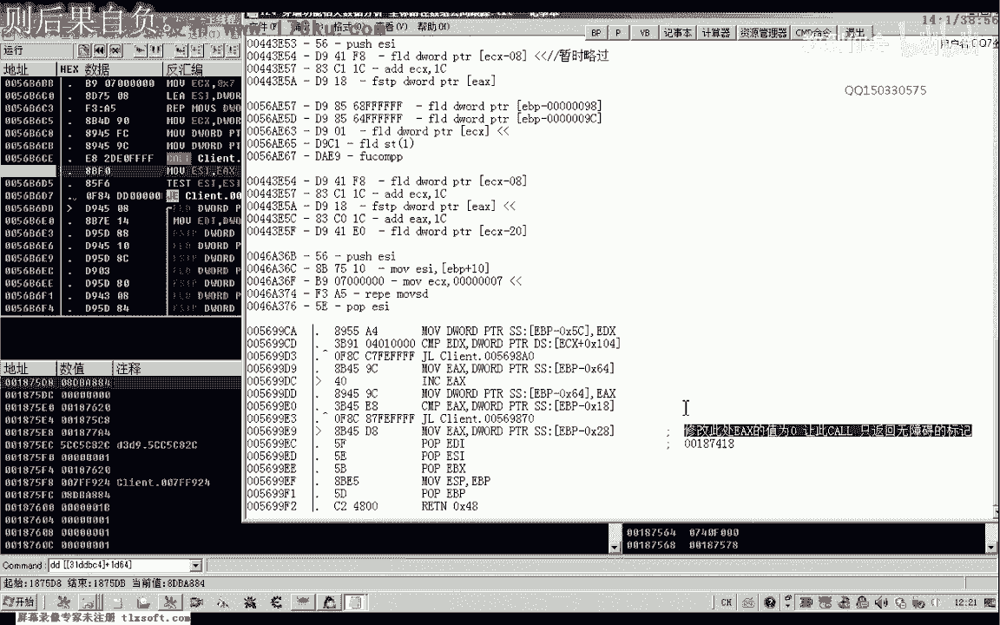

那么修修改这个地方也可以哈，也能上啊，当时呢我们是，修改的这个库里边的某一个地方，那么我们再来看一下，那么因为上一节课的这个注释呢，呃被抹掉了，所以说这个时候呢让我们多费了一些时间，应该是这个位置。

那么也就是通过我们两个这个呃目的地坐标的这个数组的话，实际上都能够跟到这个地方，我看了啊，都是能够跟到这个地方，然后呢它都是用这个扩来来做的一个相应的一个检测，那么我们先把这个地方呢进行一下修改。

然后呢再去进行后续的一个操作，因为我们确定了这个过来，它也是有这个判断的，那么可能呢我们不能呃，就是说不能够穿墙的目的呢，他可能还有其他的地方进行判断啊，那么也就是我们刚才是执行到这里边的这一段哈。

好的，那么我们再继续看下边的一个数组的一个趋向。

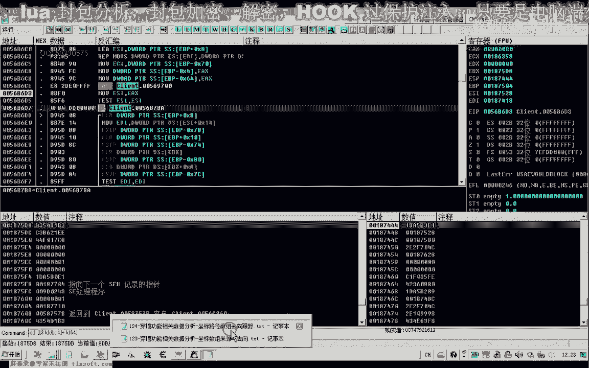

嗯，刚才的这个地方呢也分析了，这个地方呢也能够找到，从这里也能找到我们的第一个嗯障碍判断函数附近，那么我们现在需要找的是另外一种情况啊，因为这就是我们现在改了这个函数之后呢。

它还是不能够实现我们的这个穿墙的这个目的，那么说明的话还有其他的函数呢再进行判断。

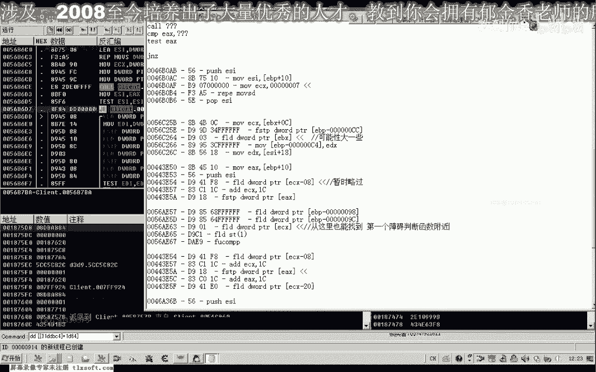

那么我们继续再找一下哈，找找一下443呃，一诶这个地方看一下，那么我们在这里呢，下一个段啊，好走路的时候呢，它会断下，那么我们看一下现在的，坐标啊b0 呃，结束的这个是八比四，不是啊，10641068。

啊八比零啊，818哈，这个时候呢托尔他应当也是产生了我们的相应的这个呃，目标的路径可能已经产生了啊，然后呢在这里呢也是来返回，也是来访问的这个坐标，那么我们看一下它周围有没有这些判断的函数啊。

主要是但是这里呢它就是一个循环啊，然后就完成了，然后呢执行到上一层的这个空执行到这里，但是呢它的ex呢也没有利用起来，然后因为因为他的ex呢是从这个呃呃临时变量里面进去的，这里呢ex来等于一。

那么我们看一下返回之后它的情况，但是呢这里呢他马上就把他的这个结果来进行来，抑或那抑或之后呢，也就是说这个函数啊嗯与我们的这个障碍呢，它也是没有太大的关系啊。

就是说他也不是以他的返回结果来来做一个判断有无障碍的，那么我们只有来呃，继续再更一下，啊，那么我们看一下e s i，那么这里有没有坐标相关的数据，现在是看不出来啊，继续往下走。

那么这里有一个坐标的一个出现嗯，ex那么这里有一个ec啊，值得我们注意，那么这个e d i的话呃，应当是我们可能就是我们的那个坐标，那么我们看一下有没有这样的一个环境，是以七。

这里在我们的四期这个列表里面v9 啊，那那我们看一下这个e x加44a7 是什么，首先我们看一下ex，那么ex的话，我们发现呢就是它的这个腰骶六四的这个我们目的地坐标，数组的起始地址。

然后呢因为它的结构的话，一个结构的大小呢是0x1 c啊，然后这里呢它有一个e d x 14呃，这样来计算的，那么也就是对他的数组的里面的某一个数字的一个访问啊，那么也是坐标相关的，那么我们继续看一下吧。

然后他又载入了一个数字178178，那么也可能就是说这个扩，它是用来判断我们的这个有无障碍的这个情况，或者是，好我们继续跟一下啊，这个需要很需要很多时间和耐心性，这一，那么根的时候呢。

我们注意这个佛点站的一个变化，还有这个堆栈的呃，这些关键数字的一个变化啊，这个库好像比较大，那么我们返回返回到上一层再试一下吧，上一层的话返回到了这个地方，那么这个地方我们再pass掉啊。

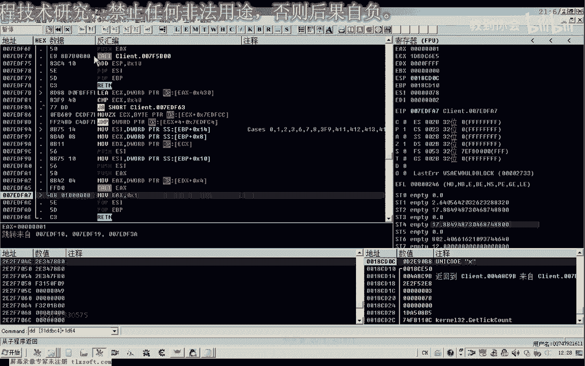

看一下嗯，最后的话我们除了刚才的这个地方，或者是123的，靠着这个地方，那么我们在这个地方。

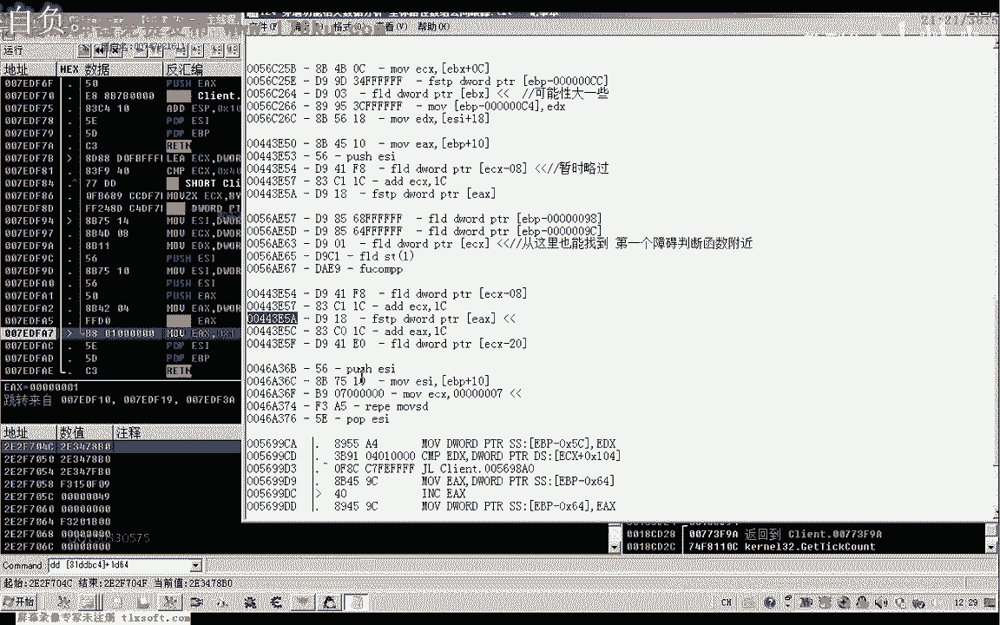

我们刚才好像已经用过了，这里是初战，那么出站的话是改变我们相应的这个数值，可能是这个坐标的一个更改，这个地方我们应当要给你一下，因为这个好像也忘了，我们刚才这个地方有没有跟加上ec啊，跟过的。

我们做一个标记，这个地方好像是跟过的，然后出站它是把这个数值呢呃写入到我们的e x里面，那么它的数据来源呢是我们的e c x减八，那么ex减八的话来源于什么地方，我们看一下，mac到e si。

那我们再来看一下e和x的数值b0 起始地址，然后呢加ec，每次e4 x也加1c，咳，那么我们再次返回到上一层，再看一下，再继续更一下，那么这里的话我们还有一个条件的一个判断啊，然后呢，再进到这里。

那么我们在这里呢再看一下，如果有障碍的情况，会不会断到这个地步，点这个墙啊扭上来，在这里，可以，di的一个数字的一个，转到前面看一下啊，这个e d i，嗯e d i的话。

56b650 好像也是这个地方进行了一个判断啊，然后呢有无障碍啊，好像这个函数就是有个障碍，我们再看一下嗯，前面的这个过程。

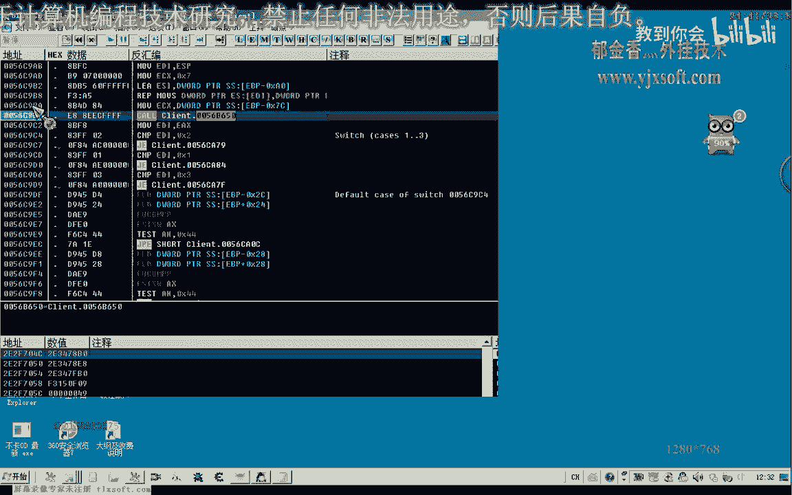

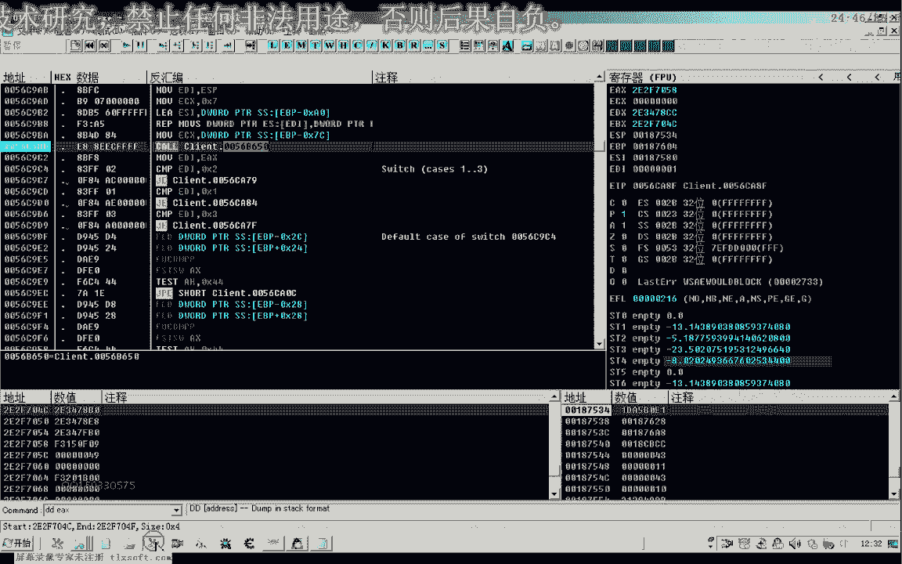

看一下123的这个过程，对了这个地方呢我们把它注释一下啊。

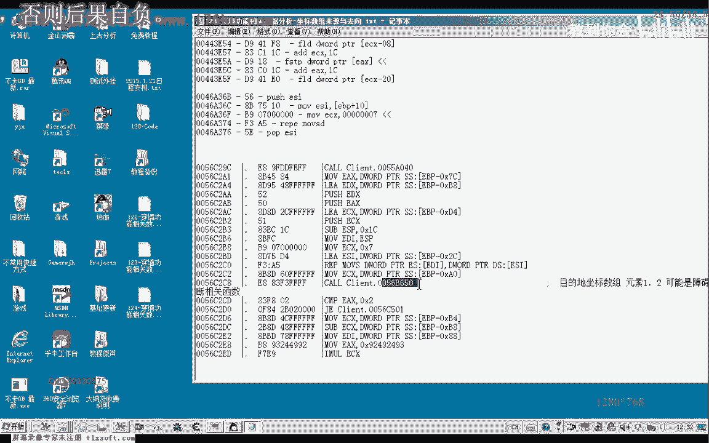

呃设置一个标签啊，这样便于我们观察，它也是在这里边进行了判断之后，把这个e d i把它的返回值放到e d i里边啊，然后进行了一些判断呢，跳到了我们的这个这个框里边，那么所以说我们找到的这个函数的话。

还是这个地方在这里呢，我们给它设置一个标签啊，为了方便障碍判断，嗯有个障碍返回，您有障碍返回返回，非零子应该是没障碍，不障碍，返回卡尼卡这个地方，然后呢我们再加上一个注释，在这个地方好。

然后按减号退回来，那么这样的话我们分析的时候呢就好分析一些，好的，那么我们有有关于这个数组去向的，这几个数据好像都已经分析了，还有最后一个没有分析，那么这个地方我们再看一下，46a啊，这里是一个坐标。

不记得，那我们在这里下一个段看一下，那他会断下好几次，好像是在不停的更新我们的这个坐标，那么我们再次看一下我们的目的地，坐标地址，再看一下好像是没有变化，我们看一下e s i的一个数字，1s i哦。

它是把我们的这个坐标来读出来，写到另一个目的地坐标里面去啊，然后如果我们要继续的跟这个目的地坐标的趋向的话，就要去跟这个2。75c070 这个地方了。

他把我们的这个呃目的地坐标的这个数据来啊进行了移动啊，移动了到了其他的一个机制，好的，那么我们再重新把断点取消之后呢，重新下一个段啊，然后呢我们再走两步，这个是我们能够看到我们的这个目的地坐标的数组呢。

它的数据呢移动到了这个e d i的这个机子里面去看，我们来看一下di这个地方，那么等一会儿的话，我们要跟的话，就是要跟这这个i开始的这个地方，啊不对，那么我们看一下这里边的这个相关的数据，用火点出来。

看一下ti的，那么这里也仅有几个相应的这个坐标的一个序列，那么我们再跟一下呃这个地址的一个趋向，那么我们重新再走上写步，然后呢我们按一下f7 啊。

我们把e d i的这个数字来记录下来好那么这是我们的一个坐标，加上e c e d i加上ec那么循环不断的，它是不断的把我们的这个坐标数组里面的数据了哈，复制到e d i所在的这个数据。

那么di所在的数据呢，它的这个地址的话是从bp加一零这里传过来的，那么ebp加一零的话呃，从这里来看呢，应该是上边的第三个谱写的这个参数嗯，应该是这里最早谱写的这个，那么我们返回的话也就是这个ex。

嗯也就是说这里呢它也是一个我们目的地坐标的一个数据，物体这售票数出，那么我们要继续的跟他的这个判断的话，我们可能就要从这个呃这个地址来开始跟，e s i。

那么我们来看一下这个e s i它是一个什么机制啊，重新的我们让它跑起来，那么再一次让它断下，看一下si的一个数字，那么我们看一si这里的一个数值的话，e si加四。

那么这里的话它也像是一个数组的一个起始地址或一个结束地址啊，那么加上四这个地方他也就是这个二二比73068，然后呢这个di加四呢就是我们的我们看一下di的一个数字，那么e d i到这个的话。

恰好就可能就是我们的目的地的一个数啊，也就是我们之前的这个人物角色的这里的相关的一个数字，我们用拼音来表示一下啊，恰好就是这个地方，那么我们也把它注注意一下哈，这是人物角色属性，加上1964啊。

这个eti的数字，好的，那么我们把这一段来也注释一下。

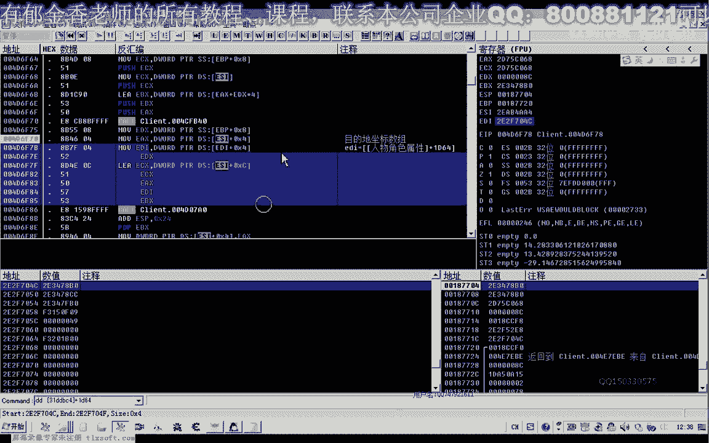

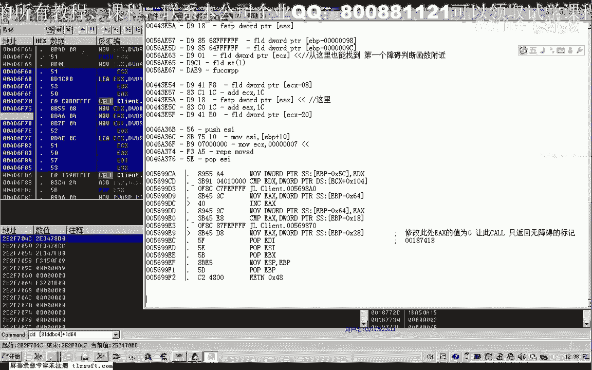

那么再跟它的趋向的话，接下来的话我们就是要找这个啊e s i啊，这个地方开始了，那么我们往往前面找一下它是不是一个对象，这一大片数据看下来我们看不太懂啊，好的。

那么我们直接来继续的跟踪一下这个e i的一个趋向，那么这个时候呢我们这一段过了之后呢，我们可以对呃1s2 加四这个地方呢来进行访问的一个断点，等这个扩之后，当然这里它也返回了哈，返回之后呢。

e si加四复制为1a x，这一题有些看不懂啊，然后我们再次断一下，再看一下嗯，一si的数值把它记录下来啊，e si加四，那么这这是一个起始地址，那我们把一si的数字呢也先记下来哈，咚咚咚。

那我们也可以用c来搜一下这个二级，来看一下究竟是一个他的这个指针存放在什么地方，看对我们也没有帮助，然后找不到这个地方啊，那么我们直接就找它的一个趋向，那么我们再找一下这个过之后呢。

我们呃把这个库执行完之后，那么呢我们找一下他对这个目标数组的一个访问的一个地方嗯，内存的访问，然后呢我们把这个断点呢取消掉。

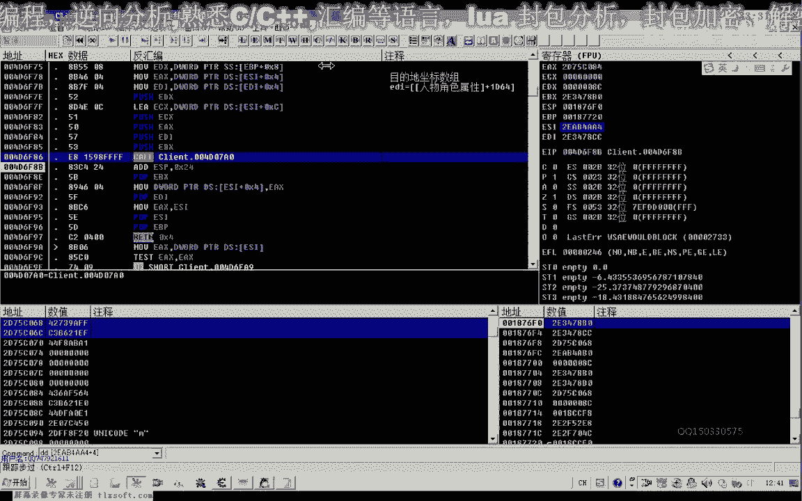

这里复制一下。

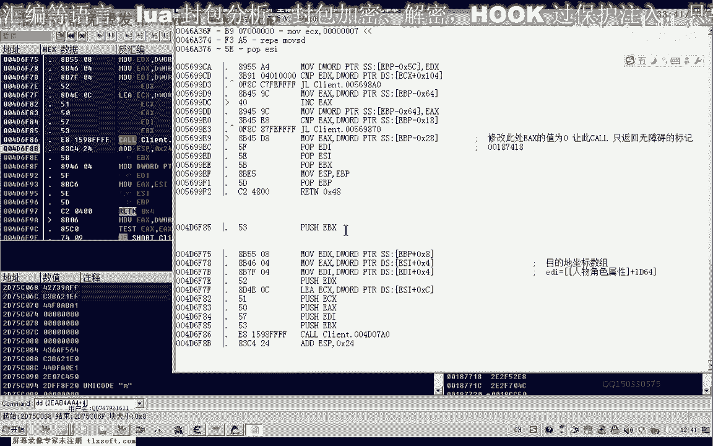

然后呢我们让它跑起来，这次我们走远一点，再看一下，三然后呢在这个对这个地方呢，我们在下一个内存访问的断点，再让它跑起来，一si 2。3，结果还是往这个地方来进行了，一个写入的一个操作，啊。

那么或者我们换一个思路来跟哈，如果这里跟不下去的话，当然这里也应当也可以跟，当然好像比较费时间，那么我们可以换一个思路的话，如果呃如果是没有障碍的话，他肯定呢就要对我们的这个目的的坐标呢进行修改啊。

进行一个写入的一个操作，因为要移动这个坐标，还有我们的这个当前坐标，它也应当要更改，适应当是更改这个当前的坐标应当是，当前的人物坐标啊。

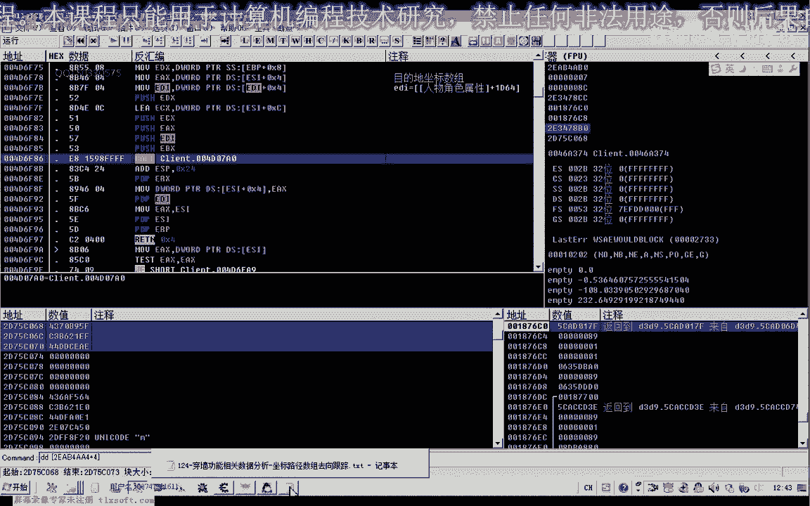

那么如果也就是说呃有障碍的话，他就不会去更改我们的这个当前坐标，那么我们再来看一下对当前坐标的一个访问啊，因为这些呢都是与坐标相关的。

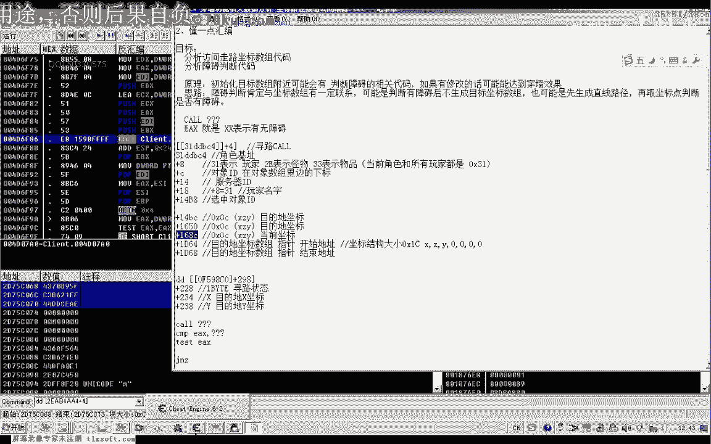

那么我们先把这个ot呢退出来。

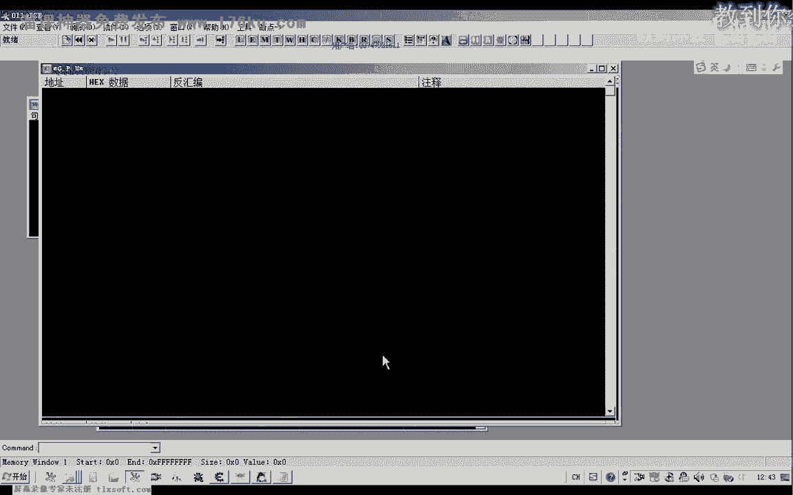

不知道，好那么这个是我们的当前坐标，我们对他呢呃找一下改写了这个地址的代码，那么我们看一下这是正常的情况下哈，正常的情况下的话，它就是这样走路啊，就只有了这前面的这一段代码呢会来修改我们的这个坐标。

那么如果我们遇到这来，我们看是什么情况，那么遇到障碍之后呢，我们发现的话他走的这个路径的话，它不一样啊，这里有障碍的情况，那么有障碍的话是这个地方呢他会修改它啊，呃4d9 这个这个榜有障碍。

那么我们现在的也就是说要它是一个无障障碍的一个情况啊，那么这个地方呢它是无障碍的，它会如果是无障碍的话，就会朝这个地方来执行啊，也就是会执行到这里f s t p啊，什么什么168c这里。

那么我们看一下没有障碍的时候呢，这是正常的情况下，那么也就是说在这个代码的附近的话，可能就有一个障碍的一个判断，有障碍的话，它就会执行在下面的这个代码是底多少多少，如果说没有障碍了。

它才会执行这个视野这个地方，那么我们也可以从这个地方呢来分析，那么好的这个就流程是作业啊，大家先去分析一下啊，这个从这里呢开始入手分析，呃找了一下啊，有没有呃，附近有没有来这个障碍判断相关的，好的。

那么这节课呢我们先到这里哈，呃这个数据的走向哈，因为像穿墙这种功能的话，它不是说分析出来马上就分析出来的，嗯像这种变态的功能的话，都需要一个好的一个思路和很多的时间啊，好的。

那么我们下一节课呢嗯再一起来分析这个数据的一个走向。

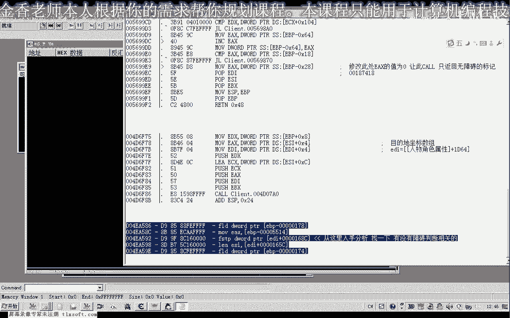