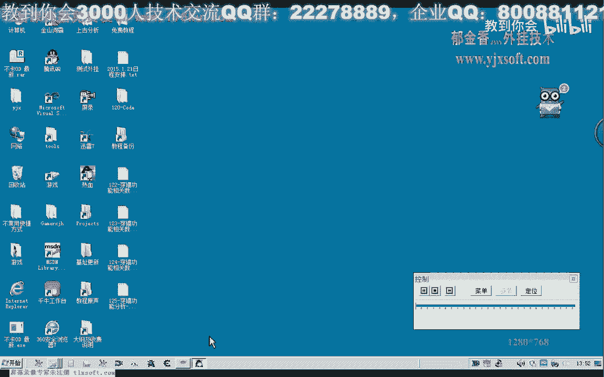
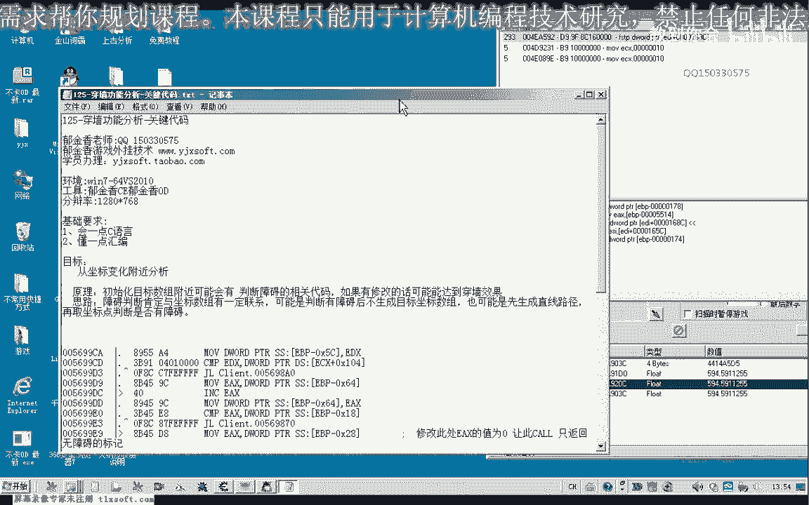
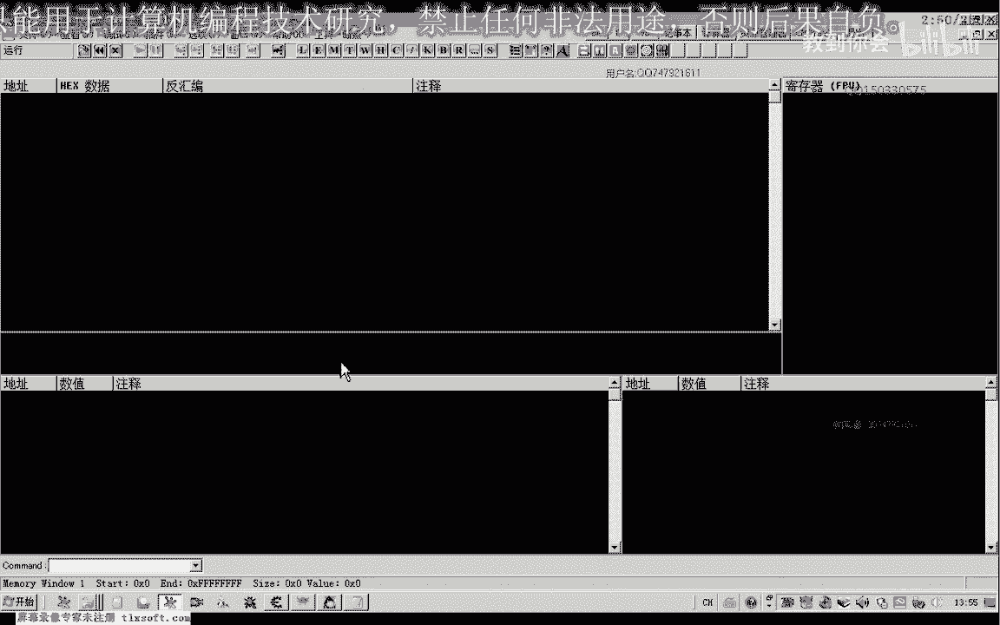
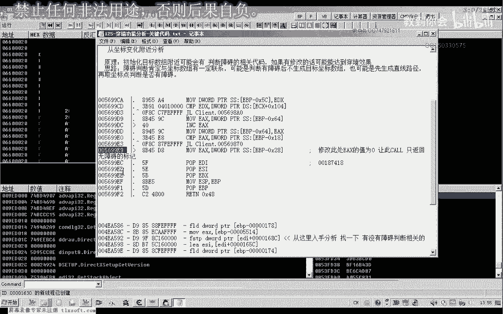
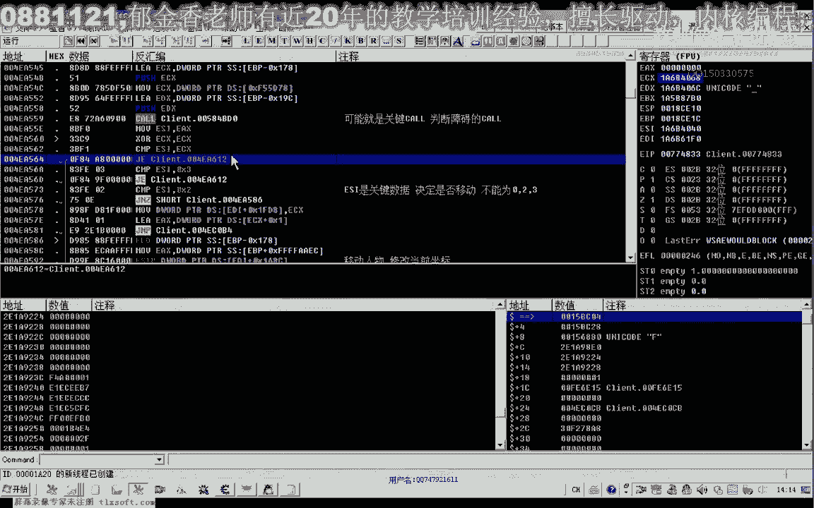
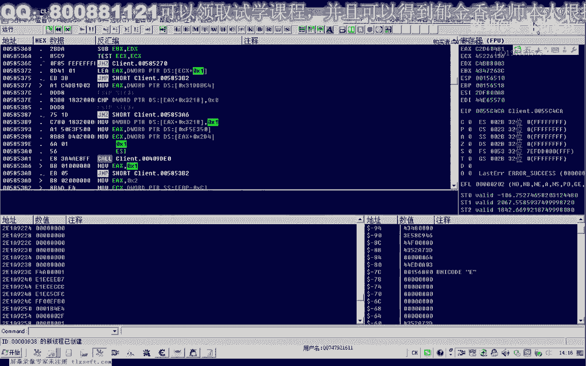
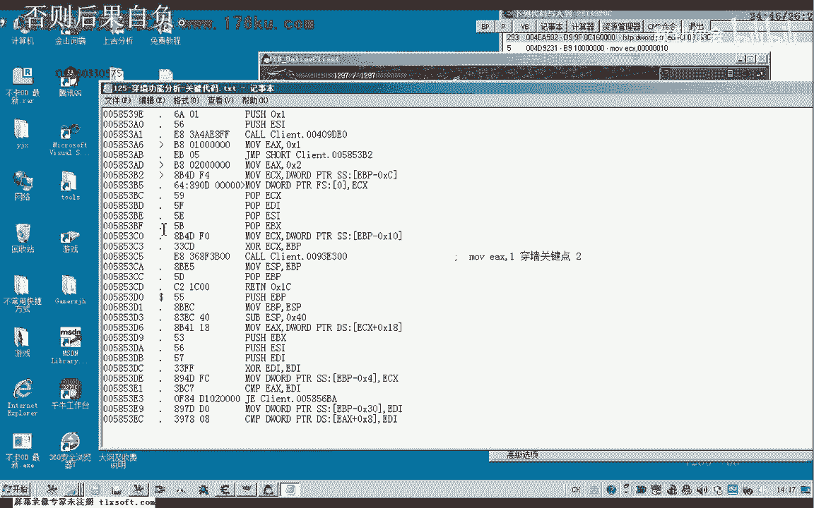
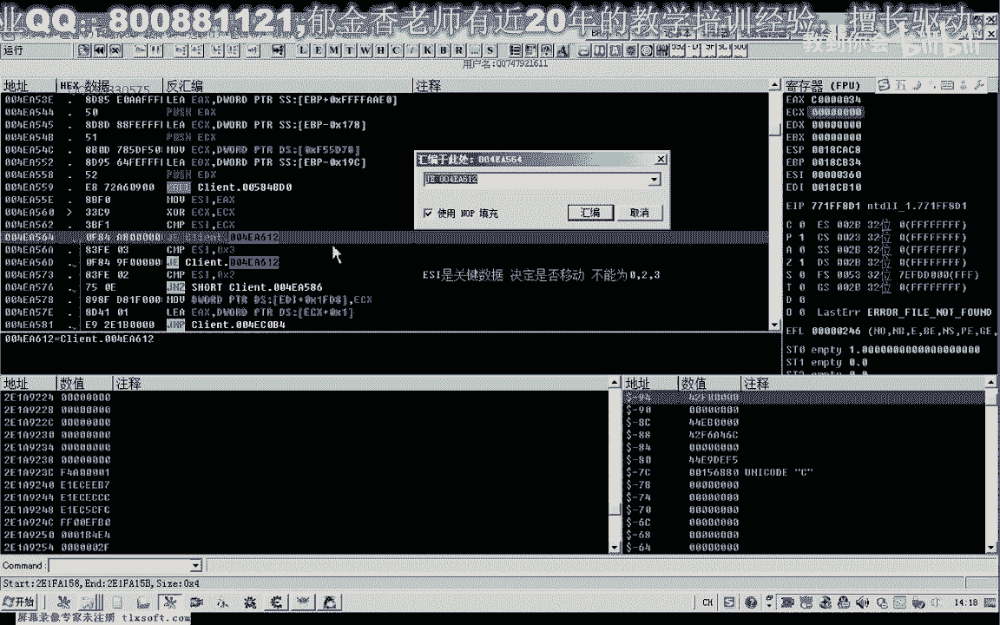

# 郁金香老师C／C++纯干货 - P114：125-穿墙功能分析-关键代码 - 教到你会 - BV1DS4y1n7qF

大家好，我是郁金香老师，那么这节课呢我们接着上一节课的代码，来继续分析一下有关穿墙的这部分功能，那么上一节课呢我们讲到的是呃，我们已经分析到了一个比较关键的位置啊，也就是这个地方我们把它复制过来。

这是我们分析到的啊，那那么第二个地方呢，我们是从呃需要从这几个地方来分析入手，也就是对我们这个1680c坐标的一个访问的啊，那么我们理论上来说的话啊，他要修改这个坐标的话，就是在移动我们的人物的位置。

那么要移动这个位置呢，它在前边呢就有一个判断，那么两点之间要移动到的目的地地址与我们的当前当前地址呢，这个坐标地址时间呢，它是否是畅通的，中间有没有障碍啊，它要进行一个实施的一个判断。

那么我们再来看一下，用c来我们来说明一下这个原理，嗯168c5 ，那么我们打开122相关的代码，对了，我们之前有保存一个相关的这个坐标，嗯，那么也这就是我们当前的这个坐标，那么我们的这个原理的话。

也就是说他会什么呢，那如果是这前边有这个障碍的话，那么他就不会去改变这个坐标，那么如果你看没有障碍了，这几点呢它都会去改变啊，那么当前面哈这个时候我们注意一下175。

那么这个时候我们鼠标这个时候实际上已经点击了这个地方了，但是但是这里的话他没有任何的反应啊，他不会去修改这几个坐标，那么我们点点击，如果是点击在后边的话，他就会去修改这几个坐标。

那么说明在这几个地址的前边的话，应当是有呃相关的课来进行实事的判断，判断两点两点之间呢是否有这个障碍，那么我们现在就需要找到这个扣，或者是他有可能是扩，也有可能是相关的一个代码的一个判断。

那么判断之后呢，我们就要找到这个关键的这个位置，那么或者是修改这个判断的一个结果，或者是修改这个关键的跳转的这个地方，让他要达到我们人物移动的这个目的。

那么首先呢我们用我们的电量附加到游戏里边。

那么我们先把之前的这个人进行一下处理，呃，之前是这个位置已经有一个函数的判断了，那么因为我们发现了修改这个位置的话。

并不能够实现我们相关的嗯，这个穿墙的功能说明他判断的这个地方的话应当不止一处好，那么这个的话我们已经解决了啊，他返回的这个地方，这是第一个，障碍20多啊，有障碍应当是一，应该是一个非零啊。

大于零不是伤害大于零，大于零，啊，好那么我们接着来分析第二个啊，从这个地址转到这个地址去看一下它的一个跳转的一个来源，那么这里呢应当就是我们的移动人物，修改当前坐标，那么我们先分析一下，嗯。

那么也就是说我们看一下，从这里的话能够看到一个跳转，那么这里一个跳转的话，但是呢如果不跳转的话，也没有影响，那么关键的是这里啊他会来什么呢，从上面的分析来看的话，那么从这一句来跳转的话。

如果是这里跳转了，那么我们的人物呢就不会移动，就不会移动，那么也就是说呃这一句判断非常的重要，他是这里判断一si等于二，那么这个e si不等于二的话，不能够等于二，等于二的话。

那么呢我们的人物呢就不会移动了啊，也就是说我们的这个e si的数值的话相当的关键，它是用来判断有障碍或者是无障碍的，可能是这样一个数字，那么e si来应该是一个关键数值啊，来决定它是否是否移动啊。

因为如果这个e s i等于二的话，那么这里呢跳转了就不会实现，那么就会执行到这里，那么呢就会跳过这个人物的移动啊，就跳到后面去了，这段代码呢根本就不会执行，那么只有了这个e s a不等于二的时候呢。

那么呢它才会来进行跳转，跳转到这里来执行，那么还有一种情况，那么也就是e si等于3=3的时候呢，它也会跳过，那么也不能够等于三，那么也不能够等于二啊，我们看一下成片e s i2 ，不能等于三。

也不能等于二，那么也就是说不能等于三，不能等于二，那么前面呢我们看一下，那么甚至的话这个e来不不能为零，那么也也就是说这个ei的数据化不能稳定，还有呢不能为二，不能为三。

这几个数字它可能呢都是一种状态啊，分别表示的可能是不同的这个障碍，那么我们再往前面走一下，那么这里有一个跳转，那么也就是说执行到这段代码的话，有两种可能，一种可能呢是从这个库执行之后呢。

呃在执行的这段代码，另一种可能呢是从这两个地方来跳过来的，那么我们来看，如果不是跳转的情况呢，就是调用的这个过来执行，那么这个过来最终它的返回值给了e s i，那么这就是一个关键的一个括号卡路，嗯嗯。

看看能不错的，那么如果是没有障碍的话，他这个数字呢肯定不能够等于23，那么可能这个数字是为一，也可能是四五这一类的，反正不是不等于零，我1232023这几个数字不能够出现在他的这个库里面。

那么我们在这个地方呢下一个断点，看它有没有经过这里，那么我们发现这个地方调不会断下来啊，那么说明它的这个来源的话，不是从这里的顺序执行下来的，而是呢这个跳转这里跳转下来的，那么我们先转到第一个jp这里。

那么第一个奖品的话，我们看一下一这个e si，它是对es si的这个数值来进行判断的，那么我们就要找这个es si的一个来源，看什么地方对于这个es i进行了协助，那么我们发现呢是在这个地方。

而这个ex呢它来源于这个扩，那么这个扩的话我们发现了与这个扩呢是同一个扩，那么所以说这里的话应当啊，应该还是可能是我们的战略判断库，因为是同一个空嘛，那么在这里面添加上相应的这个注释。

那么我们在这个地方呢，下一个断点，啊这个时候会断一下，我们上来的时候会断一下，那么看有障碍的时候哈，点障碍这个所在的地址，那么有障碍的时候，好像它不会断下，嗯有时候呢好像也会断下，他要有一个转身的时候。

好像才会断，那么我们看一下它的返回值，那么这个时候的话他可能是没有状态哈，呃它不会跳转，因为这个时候返回的值呢是一啊是一，它就不会跳转了，那么这个移动的这个过来的移动人物的这段数据呢。

我们看它就会不会执行，那么我们来看一下这个库有没有呢，不等于一的情况，那么我们在这里呢下一个条件的断点，不等于一的情况啊，我们看会不会有，那么这个时候呢ex呢等于零啊，我们刚才说的它不能够等于023啊。

这几个数字都不能等，那么这个时候的话，移动的这个过来就不会被执行了，这里呢我们就怎么来就跳过了，跳过了这个关键的这个数据啊，它不等于二，也不等于三啊，应该是不等于二，不等于三，但是呢它等于零。

只要是023这几个当中的一个了，他都不会来移动我们的人物坐标，那么所以说呢我们要现在要想办法做测试呢，就是要想办法让这个call哈，在之前的这个括它的返回值要让它为一。

那么这个呢我们可以说呢呃就是一个关键的点，这个扩啊，呃要让他这返回30=1啊，那么可能达到，但好像强度呢，好的，那么我们进去看一下，那么这个函数的参数的话好像还比较多，那么我们先看一下它的参数，这些。

嗯参数的话123467个啊，这个不少，那我们转到第一个数据窗口看一下，这里是两个坐标，那么可能是计算这个点击与点二之间，它们是否有这个相应的啊障碍，看是否有障碍，而且我们发现的话。

以及形成中间这个坐标是相同的点点进行，反正他就是前面这一部分我们看都是相同的，说明他们移动的距离的话应该是比较小啊，比较小的，那么我们再来看第二个，那么这里呢也是一个坐标啊，那么这里的话好像是一个坐标。

也是一些坐标的一些序列啊，那么可能就是计算我们两个点之前是否有障碍的车型这样一些呃功能，那么我们我们跟进去看一下，按一下f7 ，看一下它是从什么地方返回的，ex的这个数值。

那么我们看最后它屏占的时候是平了多少，究竟的参数的个数有多少，当然为了不影响这个获得其他的功能，因为它设计的代码比较多，那么我们最好是在它尾部啊，在这个位置的时候呢，嗯来修改ex的一个数字，然后再返回。

但是它的数据呢又来源于这个库里面去了啊，那么我们再看一下这一段，最后来退出，那么我们看这个库它有几个参数，我跟进去看一下，啊啊啊，这话还是比较大好的，马上要到这个结束的地方了。

那么这里呢我们按一下f7 进去，看一下他最终的一个数值是从什么地方返回的，那么是从这个地方就返回了啊，我们看到好像它不影响ec x，它是只是做了一个比较，然后就返回了，好像ex的数值呢它也没有被改变啊。

再次我们再看一下e x等于零，那也是你的，e和e x等于e b p e x，那么这里呢他就执行了一句啊，一个比较，那么我们看这里是否是可以这样改，但是他这里也有一个跳转，麻烦的。

就是在这个地方它可能会跳到下边这个地方去执行，那么这个地方的话不是很好修改的，那么我们先可以这样啊，因为可以先在这个函数的后边来进行一个修改嗯，修改这个e si的这个数字。

那么我们把这个mo 1 i等于这样的修改，但是这样占的字节比较多，我们可以这样来修改一下mode s，也占的比较多哈，啊这个si的话好像他没有这个sl，没有这一问，只有一个a的话，这位有，下。

那么我们再看一下该怎么修改呢，当然还有一个直接的地方呢，也就是我们在第一次比较这个e i的，我们看一下有对这个e s i进行比较的地方呢，我们都对它进行相应的修改，那么从这里呢呃跳转跳转到这里来。

那么这个时候呢他对我们的呃e4 x来进行了一个呃一活的一个处理，与零进行一个比较，那么我们在这里呢我们可能可以跟他做一些手脚好，那么我们让它不跳转，那么也就是说我们把这一段语气来给它更改掉。

那么我们就可以这里呢如嗯你这边喜爱，对一，这样的话设计的也比较多，或者这里我们就直接给他改道哈，直接就跳转到这里来执行，相比，341286，再看一下这样好的，那么我们这样修改之后，再看一下。

这样的话就能够达到一个穿墙的一个功能了，但是最好我们还是能够修改那个函数的一个返回值啊，这个时候呢也可以任意的穿墙嗯，去我们想要的这个地方，好的，那么这节课的分析的话，我们就到这里了。

那么当时我们发现的话，从刚才那个地方修改的话，我们这里寻路的话，好像它又有问题啊，那么从这个地方直接跳转过来，那么因为还有有二和三的这种情况，那么我们看一下有没有jsi不等于一和零的情况。

在这里我们下一个条件段，但是他也没有执行到这两个啊，那刚才的这个修改为什么会有这个相应的，那么我们还有一种情况呢是转到这前边来进行一个，再分析一下它还有没有更好的一个地方进行一个修改，1s2 啊。

判断啊，这个是修改人物移动，关键的这个空，接成，嗯，那么它一般是等于一啊，只要我们不让它等于一就行了，那么应当是在这个地方哈，它等于一的话，那么这里的比较的话它就不为零，不等于面积再看一下。

那么应当是可以修改这个地方哈，如果这个e s i它返回值为零的话，呃，表示了有这个障碍，要让它的返回值等于一，那么它等于这里呢我们可以来把它改为打lop掉啊，一直不让他跳跳啊，因为他有障碍的时候。

我们比呢会进行一个跳跳，那么我们要这一句的话，应该也可以实现这个完美的一个这个地方，这个时候我们寻路就可以用了，那么这里也可以进行一个穿墙的一个操作，当然我们最好的这个方法呢。

我还是建议啊在这里边来修改这个嗯，可以尝试修改这个ex的一个返回值好。

那么我们在做测试，那么这个时候呢有障碍啊，不能够跳转，那么我们可以修改这个库。

对调整它的地方也比较多，那么我们提到它的五一步，好像是应应当是这个位置，在走路试一下，应该是这个位置，那么这里的话，因为我们可不可以直接的啊-1 x啊，一来试一下，好。

那这样的话它也能够完美地进行穿墙以及这个行动，好的，那么这样的话我们的穿墙功能呢嗯就实现了，那么我们就作为这个地方修改，one two one two three，好我们把它复制，好的。

那么这节课呢我们就到这里，下节课我们再见，车车车，那么这两个的话是一个地方不放第一个，那么第二个呢是在这里。

那么还有一些关键的代码，我们都把它发出来，啊，好的，那么这节课的分析就到这里。

