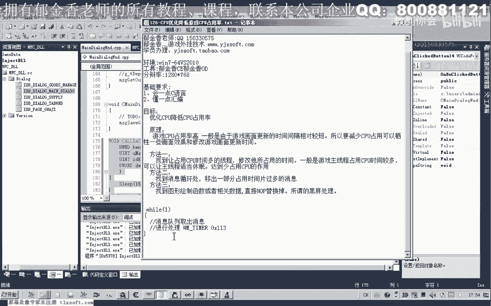

# 郁金香老师C／C++纯干货 - P115：126-CPU优化降低游戏CPU占用率 - 教到你会 - BV1DS4y1n7qF

大家好，我是郁金香老师，那么这节课呢我们一起来看一下哈，游戏当中cpu的这个优化，也就是降低我们游戏对cpu的一个占用率啊，那么呢主要的话游戏值对我们的cpu，占用比较高的，一般是由于这个游戏画面啊。

画质这方面的话，他对于cpu这方面的占用相对的多一些哈，那么呢它会有一些就是呃定时器，或者是有一个单独的一个线程，它可能呢来不断的更新我们游戏的画面，那么我们如果能够找到这些相关的数据呢。

那么我们就可以达到一个呃，cpu优化的一个作用，当然还有一种比较，通用的一种做法啊，呃比较通用的做法呢，我们就是强制的让这个游戏的主线程呢，呃进行一个啊定时的啊，进行一个呃休眠的一个状态啊。

也就是说就像我们工作一样，那么工作了啊，几秒钟的时候，我们让它休息一两秒钟的时间啊，那么这样呢也可以减少我们cpu的一个占用，那么我们先来看一下比较通用的这种做法，那么这种的话在去找个教程里面呢。

我们也有用过啊，那么我们再再次来看一下，那么我们直接来用代码来实现哈。

做一个试炼，打开120克的代码，那么打开之后呢，我们切换到我们的这个资源窗口，那么添加两个测试的按钮，那么实际上呢我们也就是用一个定时器啊，不断的呃，就是说呃挂接在我们的主线程上啊，然后呢。

让他进入一个就定时的，来让它休息一会儿啊，那么这样的话，我们也能够在一定程度的来减少，我们的这个游戏的cpu占用时间，那么我们现在看一下它的占用时间的话，大概是30%到40%左右啊，的这样一个时间啊。

cpu占用率占用啊，这个时间片的话，那么我们可以来在这里呢，在我们的主线程上哈设计一个定时器，啧啧，那么呢第一个传进来的是我们游戏的窗口，句柄，那么第二个呢是这个它的一个i p。

那么这里呢我们设置1000，那么后边的话这里是它的一个呃毫秒数，那么这个呢我们可以尽量的设置小一点，那么后边的话，这里呢是一个窗口的一个回调函数，那么这里呢。

我们需要给它设置一个回调函数，那么回调函数的格式呢，我们可以参考相应的呃m sdn，或者是百度上找一下，那么复制一下哈，不调函数的格式。

那么在这里呢我们让它休息一会儿上，就可以用这个sleep了，来阻塞它哈，让他休息啊，达到我们减少cpu占用的一个效果，当然这个数值呢不能够设得过大哈，这个数值呢尽量设置小一点呃，也不能够过小啊。

大概经测试的话，大概是十左右的话比较好吧，这个数值，然后呢在后边的话啊，这里呢就把我们的窗口的回调函数了啊，传进来就可以了，好的，那么我们先编译生成一下。

啊因因为当时他的这个回调函数。

这里的，好，那么另外一个按钮呢，我们用来呃关掉这个定时器，那么第一个呢也是我们游戏的窗口句柄，那么第二个呢是我们的这个呃d，那么这个i d呢，最好我们把它定义成一个红，三二，那么这这样的话。

增加一个我们代码的一个考阅读性，好的，那么我们来看一下具体的一个效果，那么好我们看一下现在的一个占占有率，那么现在这个游戏的呃。

cpu占有率的话是35%，到40%左右，那么我们点一下哈优化，那么我们再来看一下cpu的占占有率的话，大概在10%左右啊，10%以下哈，那么这样的话就大大的减少了我们cpu，而且我们这个时候的话。

还不影响我们游戏的一些操作，这个都没有影响啊，那么我们甚至呢当然我们一旦取消之后啊，那么这里的话占有率的话，他一下子就高上来了，就高上来了，那么这个数值呢，我们还可以呢适当的调大啊。

但是呢一般不超过15，那么如果再继，续的，当然这个数字过大之后的话啊，他可能就会呃产生黑屏啊这一类的，那我们再来看一下，那么这个时候的话，我们的这个速度的话就会稍微的慢一点啊。

这个时候的话也是效果也是差不多哈，也是10%以下，那么我们可以调整的这个参数呢，可以是这个数值啊，这个数字呢我们把它调大之后，比如说我们调为100啊，那么这个呢我们可以设为一个进度条，来调整1~100。

那么是100的话，可能效果就不是很明显，那么也就是说100ms的时间呢，那么我们再让我们的cpu来休息一段时间，那么在这个时候的话，他这个cpu占有率的话下降的呢就比较少啊，就比较少。

大概只下降了5%左右，那么我们再试一下其他的数值，那么这个时候呢是28%，大概是下降了10%左右，那么所以说这这个数字的话，我们可以作为一个呃参数的一个接口，来提供给，就是说这个玩家来进行。

或者是设置成一个进度条啊，来设置这个数字啊，最后呢我们就可以达到一个cpu的优化了啊，那么这个很简单啊，这种当然这种的呃，这种方式呢它的效果的话也是普普通通啊，不是最好的，那么最好的效果的话。

肯定是要结合我们后面的方法二，和我们的这个方法三来实现，那么我们在这里呢也顺便说一下，这个方法二和，方法三的一个呃原理，因为我们的这个游戏的话，它也有一些消息的一些处理啊，那么消息的一个处理的话。

它在一个循环里面，那么首先呢它会从我们的消息队列里面，消息队列里面的啊取出这个消息啊，然后呢再进行相应的调理啊，分就是说分类的一个处理，把不同的消息来进行一个不同的一个处理，那么像我们这种的话呃。

它可能呢，也可能它也是用的一个定时器来进行，一个处理，定时器，那么w这个碳啊，消息呢它是1130x的113，那么它也可能是这一种，那么我们可以甚，至可以用我们的工具啊，spa加加来来看到。

那么我们来到游戏里面看一下，那么我们来看一下这些消息，那么我们可以发现的话，有很多很多的消息，那么他不断的在闪动的呢，一共有492268108，然后又是492268啊，1000这个是我们的啊，是啊。

我们设设置的这个是1000啊，那么1000这个的话我们是设置的50秒，他中间间隔了很长的一段啊，大概就是说其他这几个消息执行，补六次的话，呃，然后呢，我们的这个这个定时器来才执行一次，那么极有可能的话。

它就是我们的这个游戏的相，相对于这个绘图的这个功能的话，就是在这几个哈回调函数里面的话，它占用的cpu占用率比较高，那么我们就是说呢，可以来找到相关的数据哈，最好的我们可以来对这几个定时器呃。

的这个时间间隔来进行一个调整，那么我们可以看出的话，它的这个间隔比较短，那么我们最好是能够呃，获得他的这个id和这个回调函数之后呢，那么我们把它进行重新的设置功能呃，那么大家也可以下去试一下。

那么就是说调整一下，我们所看到的这几个定时器的，一个时间间隔啊，那么我们可以通过这种方式呢也能够啊，理论上也能，够起到一个这个cpu的优化，那么这个呢我们就作为这节课的作业哈，大家下去自己尝试一下。

那么下一节课呢我们一起再来研究一下呃，这三个定时器好的，那么这节课呢我们就先到这里。

