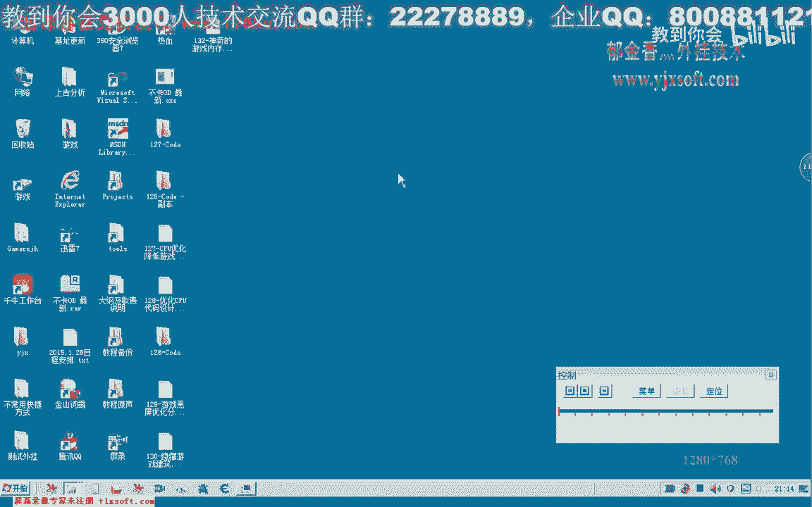
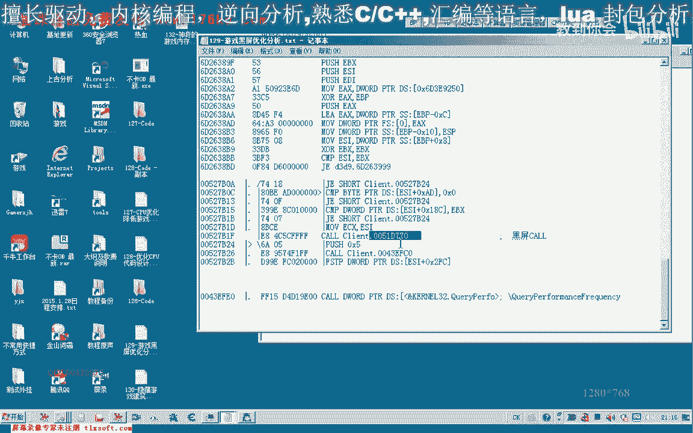
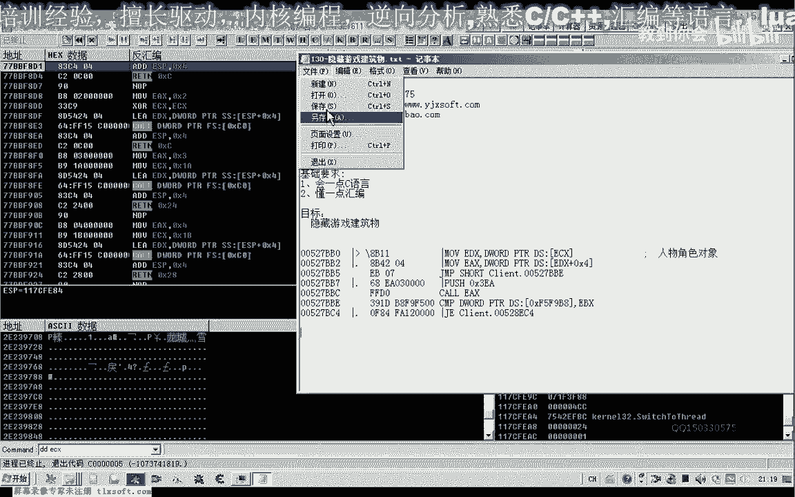
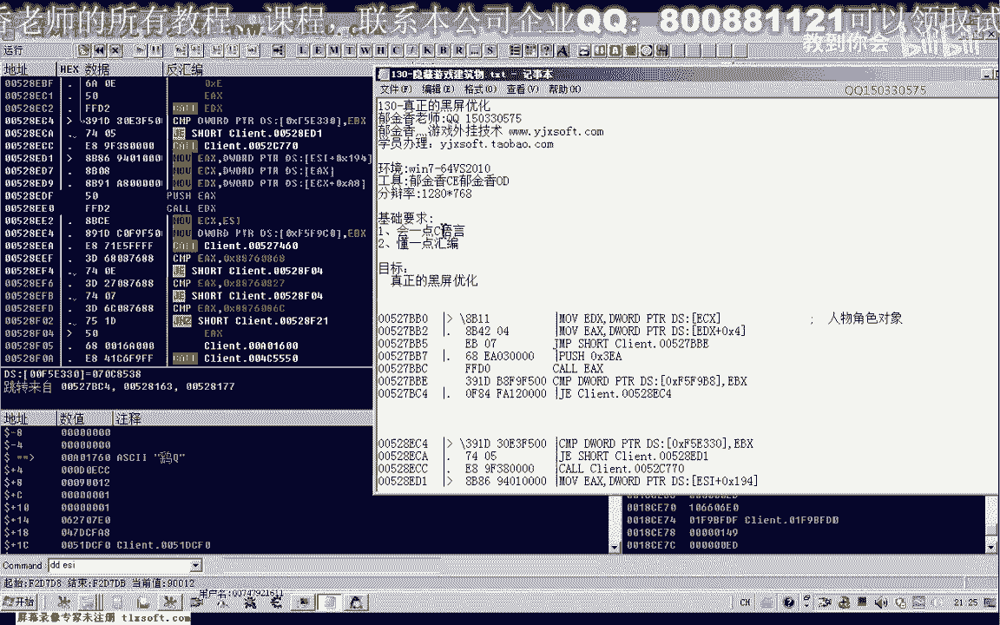
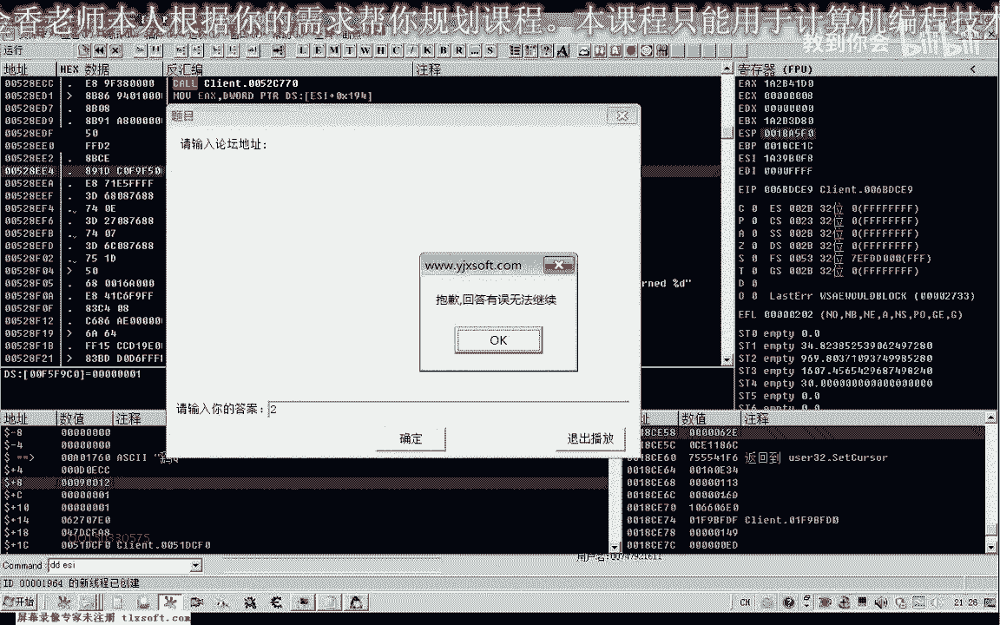
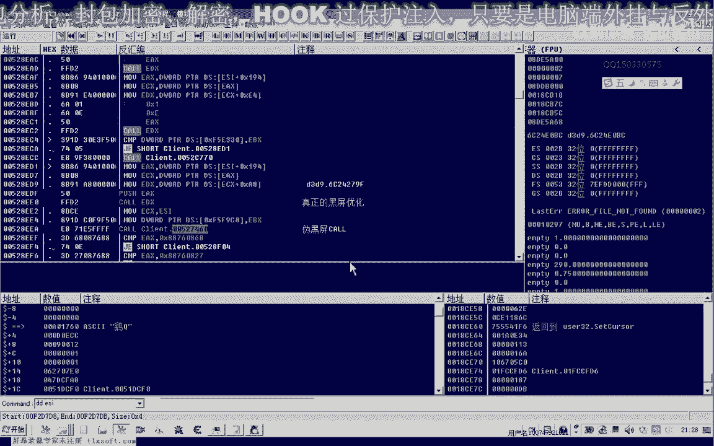
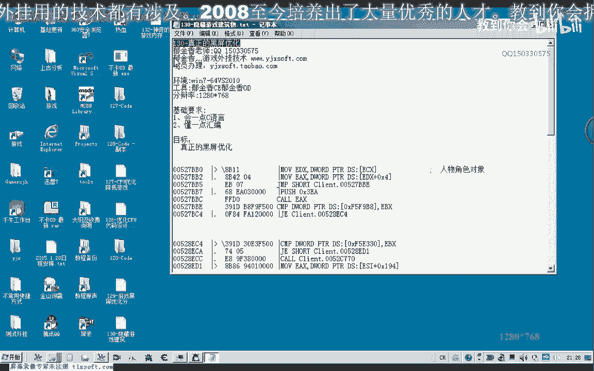
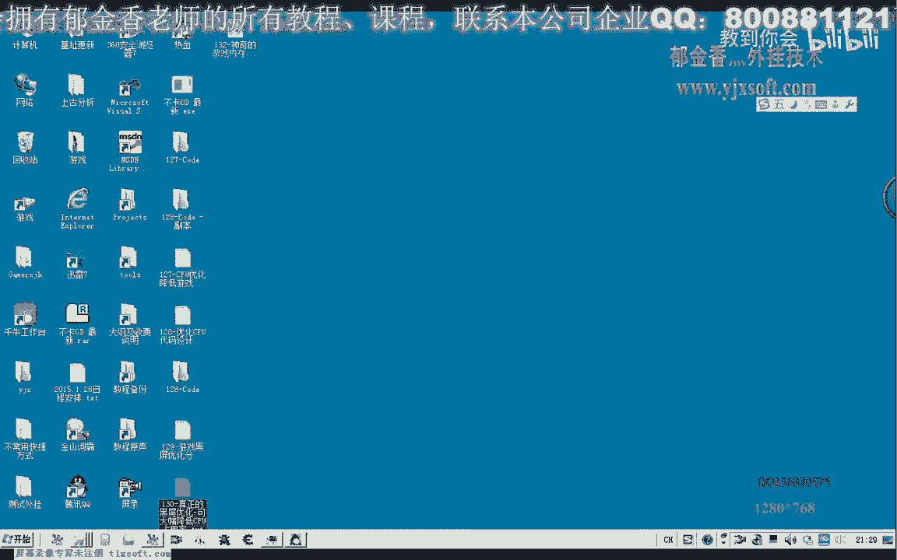

# 郁金香老师C／C++纯干货 - P119：130-真正的黑屏优化-可大幅降低CPU占用率 - 教到你会 - BV1DS4y1n7qF

大家好。

我是郁金香老师，那么这节课呢我们继续来分析呃，有关我们游戏建筑物的啊这个隐藏，那么首先呢我们先打开129课哈分析的相关数据，那么我们从它相关的这个地址来继续分析，那么就是我们黑屏。

这里的话他有可能这个库里面有可能就包含了这些呃对象，或者是建筑物的这些画面的一个更新，那么也可能是在这个扩的后面，它可能呢是单独的呃来完成的，那么几种可能呢都是有可能的嗯。

那么我们先转到这个库里边看一下。

那么这是我们上一节课分析的这个黑屏的这个库，那么我们从这里呢，呃再往下面再跟一下，看一下下面的这些库，好按下f8 ，那么我们看一下这个空它有一些什么功能啊，这个扣我们上一节课已经有更了一下啊。

它里边也没有循环，也没有其他的，只有一个定时的啊，相关的嗯，那么我们再往下点跟一下，那么这里呢有一个地方啊，也是一个扩，那么我们跟到这个库里边去看一下，那我们首先看一下这个ecx是什么。

那么这个ec x的话实际上是我们的人物角色对象啊，从这里来看嗯，那么我们这个空我们跟进去看一下先，那么这是可能是与我们人物角色来相关的一些操作啊，那么这里有个get啊。

也有一个计时的一个getting tic count这个函数，那么我们看一下这个货有几个参数，先看一下，这个扩比较大啊，它里面是实现的功能呢可能也比较多，那么我们还有一种办法呢，也就是不跟进去看。

他直接看这里的堆栈的一个e s p的一个变化啊，它执行前与执行后的一个变化，那我们看一下现在e s p的值是呃148啊，那么我们按下f8 ，他出不起了，那么执行到这里的时候，我们看一下3a。

现在是e58 啊，这是3a，那么可以看到呢，它只有三个参数嘛，那么只有三个参数的话，我们可以在这里呢这样一些sp的字了，只能直接加零碎，那么就把这个过来跳过了，那么我们看一下啊。

因为它后面这里呢还有一个语句句啊，呃让它出错了，那么我们可以下次改的时候呢，我们可以从这个地方看，这个地方呢我们直接跳到啊，跳到这个地址来执行二七比比一这个地方，啊这样的话我们就跳过这个空好的。

我们把这这一部分呢记录一下，然后再重新启动一下游戏。

那我们再次转到我们分析的这个地址。

那么首先呢我们在这里呢给它设置一个jp。

那么这里呢没有参数的一个压战呢，我们就到后面了，我们就不用啊恢复这个堆栈了，好的，那么我们再次进来看一下，那么这个时候的话我们可以看出来这个库的话。

暂时呢我们看不出来它与我们这个绘图的界面有什么直接的关系，嗯那么我们继续往后执行，那么接下来会往下面来跳转，那么这里呢也有一个d3 d9 啊，相关的嗯，一段操作，那么这里呢也是取出的啊，相关的。

那么可能这里呢也是一个呃这个界面绘制啊，相关的，那么我们看它的这个参数的一个个数是多少，那么我们主要是看一下这个扩执行之后这个堆栈的一个变化，现在呢他e s p的是五四啊，执行完了之后呢，呃变成了八。

那么所以说在这里呢我们可以让e s p的值呢呃加四，当然这里只有两个字节啊，它不够，那么不够的话，我们可以把这几句呢啊都不掉，看着恐惧，那么我们再次在这个地方下段看一下这个e si的是什么。

那么e s i的话我们可以看到，这里的话它可能不是属于我们这个所有对象里边的嗯，因为加八这个位置，它的这个数字来太大了啊，这个地方那么暂时呢我们不知道它是一个什么对象啊。

但是可能是与我们界面相关的一个东西，好的，那么我们这个时候呢来看一下我们的一个画面，那么我们发现的话，这个时候的画面的话是真正的啊黑屏了啊，呃没有任何的一个，那么上一节课好像我们的颜色的话它不一样啊。

也是黑屏，虽然说那么可能是前面的这个人他是呃用来，而且这个时候的cpu的话占有率的话啊，非常的低啊，非常的低，我们可以看到只有3%左右，那么这个的话应当呢还是真正的一个黑屏的一个优化啊，黑屏的一个优化。

那么虽然说三零节课呢，我们那里呢那可能是它是用于处理我们的一些图形图像的这个缓冲区，然后到了这个库这里呢才进行我们的这个画面的一个绘制啊，那么所以说我们要实现真正的一个黑屏的话，应当是在这个地方才对。

好那么我们撤销一下，那么撤销之后的话，我们可以看一下，这个时候cpu的话使用率的话一下子就上来了啊，呃那么我们这里的话应该还是一个真正的，黑屏优化，那么我们记住这个扩的这个地址就在这个地方啊。

第3d结构啊，黑屏优化，那么我们也可以直接转到这个地址去，给他做一个和这个相应的hook比特，直接在这里来进行一个优化，它也是能够黑屏啊，也能够黑屏。

也就是hook我们的b3 d9 来实现好的，那么这节课呢我们上一节课虽然说也分分析了一个黑屏，那个那一个呢是五黑屏，那么这个呢是我们真正的一个黑屏的一个空，那么这节课的内容呢实际上非常的简单啊。

我们把真正的这个黑屏的优化呢啊分析出来了啊，那么前面的这个是伪黑屏的嗯，那么这节课呢我们暂时来，那就讲到这里，那么下一节课呢我们在再来更新我们的这个人物啊，或者是我们的建筑物相关的啊，好的。

那么我们下一节课再见，我们可以把前后的这个代码呢都给它复制一下。

作为一个特征码，这里呢它绘制了这个图形之后呢，每次呢它也会啊休息100ms的时间，好像是啊，这个100ms是从前面跳转过来，然后我们再下一个断点看一下他。

绘制了这个，那么它进行了一个图像界面的一个更新之后呢，那么这里还有一个扩哈，他进去了好像可能是发发了一个消息，就让我们把这个县城来挂起了，这个时候，那么我们把这个破落不掉了，再做一下三四。

这个也没有参数可以直接的落，但是呢它有一个返回值，这个库哈，唯一的它是有一个返回值，然后呢可以做一个什么比较这一类的啊，同样是能够达到一个黑屏的一个效果，这，这个很奇怪哈。

这个过来好像也那么应该是真正的这个黑屏过的话，应该还是上边这一个只是说这两个过的话，他都能够达到黑屏的一个作用，但是这个黑屏我们看一下cpu的一个占有率，它有没有下降。

那这个我们看一下它是一个假的一个黑屏库啊，这个也是一个虽然说它能够效果上能够达到黑屏的话，那但是呢我们可以看到它实际上的话cpu的占有率呢它们有下降下来，那么只有来把这两个地方呢弄不掉。

那么这个时候呢他才是真正的这个cpu的占有率才会下来啊，而且这个地方还不能够还要也需要恢复一代码，这个地方这是伪黑屏扣。

那么实际上这里呢还有一个有一个字串啊，可以很方便的用来定位这个特征码到成好的，那么这节课我们先把我们的这个内容呢告一段落，那么我们下一节课了再来分析这个隐藏建筑啊。

