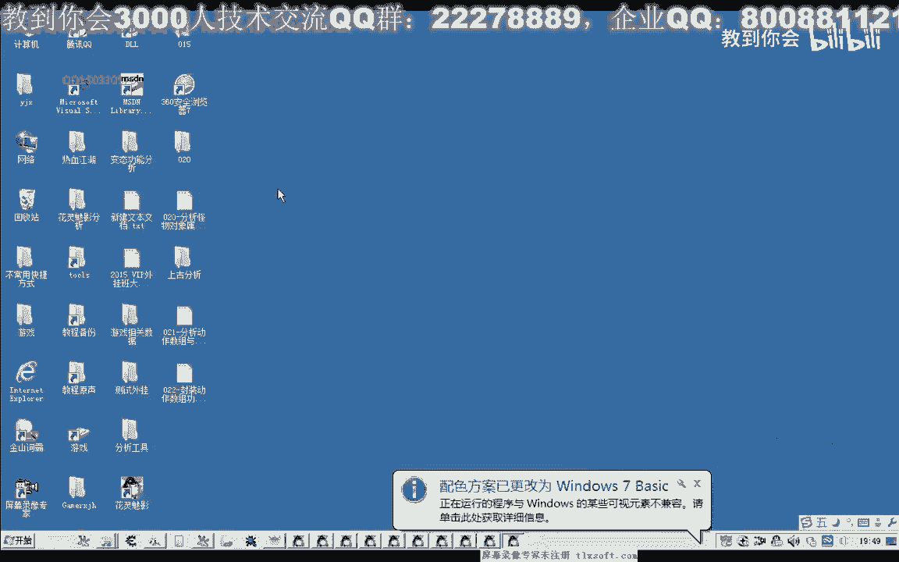
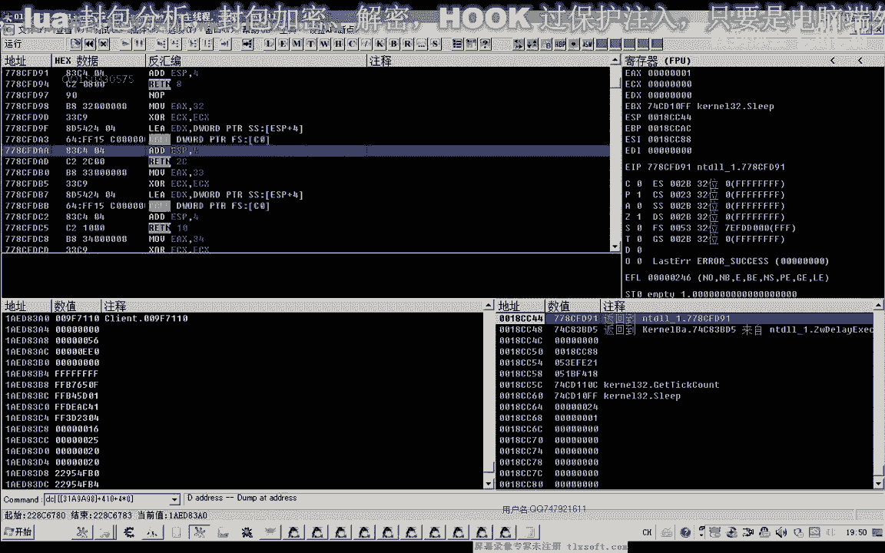
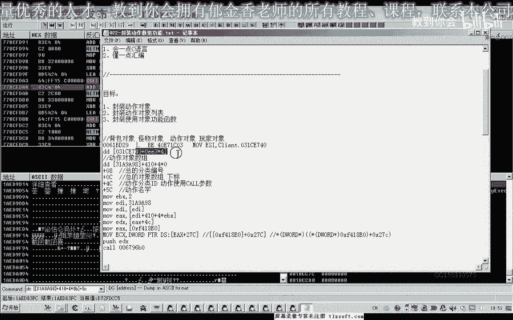
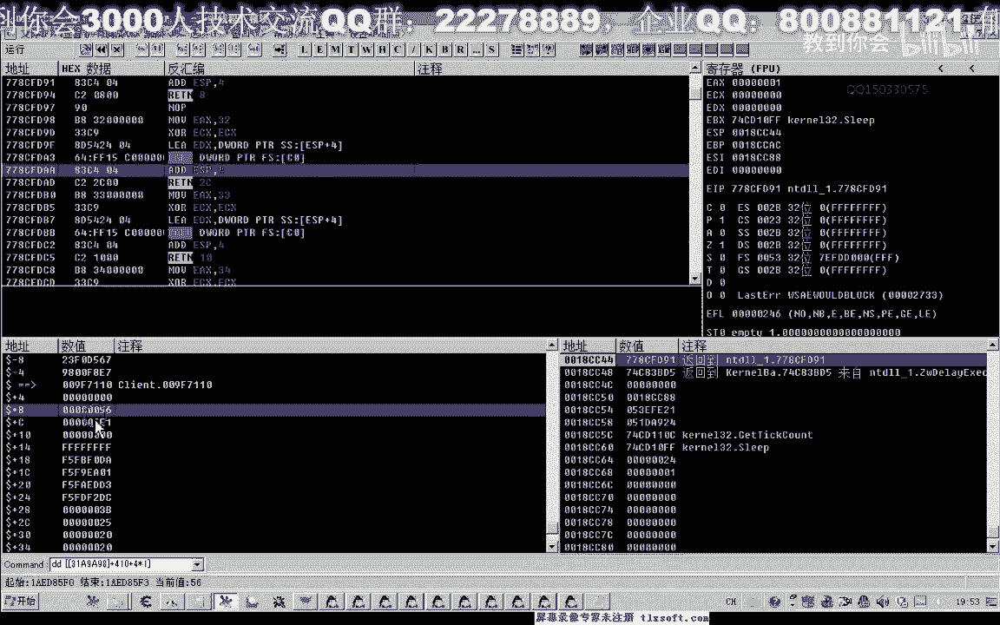
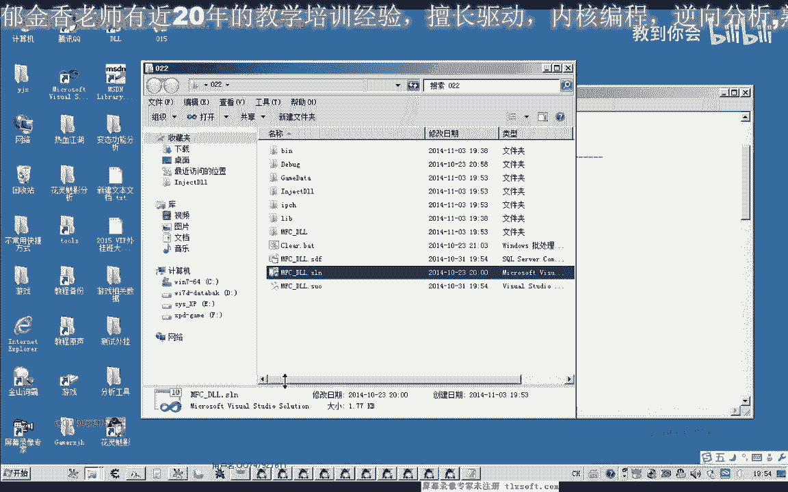

# P11：022-封装动作数组功能 - 教到你会 - BV1DS4y1n7qF

好好大家好。

我是郁金香老师，qq 15033057，欢迎大家参加郁金香技术编程培训，那么今天这节课呢，我们继续对下一节课的动作对象呢的一些属性啊进行一下分析，然后我们对这个动作的啊对象以及这个使用对象啊。

使用多个对象的功能函数来进行一个封装，那么我们打开我们的路径，把我们的呃动作对象数组组织进去。

快点，那么这是我们的十个对象，这是它的地址，那么我们转到他相应的地址去看一下，用dc来显示。

那么我们发现呢这个位置大概是c这个位置是它的一个名字，这样，最后呢我们这个是11啊，最大的这个是实验室民币啊，详细查看我们一共是12个，详细查看，那么也就是说他的这个偏移。

名字的偏移与我们背包的这个偏移化是一样的，都是在舞台这个位置，但另外还有呢我发现了0c这个位置呢是我们另外一个啊，这个数组的下标还在。

因为它还有一个比较大的一个对象数组，那么通过这个的话来访问的话，他也是这个地方，但是这个对象的话相当的大啊，他有好几千里面有几千个对象啊，是一个总的一个对象数组。

那么这个呢也是在前几集跟我们分析的时候就发现了这个问题，我们在分析周围的呃，玩家周围的怪物背包的对象的时候呢，我们就发现了啊，这个机子31c e7 是你这个它是一个组合对象，而每个对象里边呢。

得加8+12这个位置呢恰好就是保存的这个一个大的一个数组，里面的一个下标，包括我们所找到的这个，他的加c啊，这个偏移也就是他呃大的一个数组里面的一个下调大对象，数组那一个对象流里面的话。

所有的对象基本上都包含在里边，那么加八这个呢它如果我们是玩家的话，这里是三一，如果是怪物的话，这里是二一啊，这是一个总的一个分类编号，如果我们将4c这个位置上一节课，我们分析了加4c这个位置的话。

它是用来我们一个小的一个分类动作的一个分类编号，前面是一个大的一个分类编号，但是目前为止在前面这两个偏移的对于我们来说的话，嗯暂时还没有任何意义，没有用，那么暂时没有用的话。

我们就不把这两个属性呢加进去。

那么这是对我们有用的属性的，就是一个是动作的分类id，一个是动作的名字，好的，那么我们先封装这个对象结构。

打开我们20号的代码。

那么我们的og可以退出了这个少。

我要你快乐，我爱你，那么打开之后呢，我们先转到我们的机子搬运啊，添加我们的列表的一个机子，那么它的一个机制的话也就是啊这个a98 把它复制一下，或者把这个公式复制一下，11112，咳咳。

那么还有一个呢是我们扩啊，它相应的一个扩的一个机子也没把它写在，那么另外还有一个机子呢，也就是这个扩的呃，ecx这里，那么这个ec x呢它是先通过这前面这个机子，然后呢读出来之后加上2t c啊。

最后呢得到这个e c x里面，那么我们也可以把它写成一个公式，在这里按照这后面的一个写法，那么首先呢我们通过，通过这一串公式，那么我们读出就相当于这条汇编汇编指令啊。

就相当于这条汇编指令得到e x等于零，然后这个数字读出来之后呢，我们再加上后面的27c啊，然后这里这个括号再把它读出来，其实里面的数值，那么这一个公式就代表的是这两条汇编指令啊。

相当于所以说在这里呢我们可以直接把这个公式的不知道，好的机子的话就是这几个，那么机子定义好了之后呢，我们接下来呢写他的一个相关的一个数据结构，工作对象的一个结构，咳咳咳咳，那么多动向啊。

这个动作对象结构的第一个就是它的名字叫西，那么第二个也就是达到我们用的到这里的，然后我们建议动作注意下数，那么他一共有12个成员，接下来呢我们对这个数组呢进行一个初始化。

最后他的一个反问词呢就是一个指针，那么先编辑一下，在这里我们把这个相应的偏移啊，不是把它前面来，然后注释掉啊，进行相应的初始化，那么初始化的时候呢，我们先把这先前面一个阶层计算出来啊。

涉及到我们指针读数据的一个操作呢，那么先做一个异常的处理，那么这里呢我们也可先提前跟他初始化一下，那么第一个对象的地址呢，我们就是先把这个数字取出来，那么这个数字呢我们定义成了红。

那么80啊xx然后呢取出来之后，我们再加上一个410，这就是我们第一个对象的地址，存放的地方，也就是相当于指针，那么它取出来之后呢，然后呢再用一个for循环骗你，那么第一个也就是我们的文字，那。

么名字的话就等于我们这个对象的一个地址，那么我们先取出对象地址，那么对象地址的话就等于这个公式，那么公式后面还有四神谕，还有一个下标，加上我们的四乘以的下标，那么这里面的数字呢，我们要把它取出来。

才是对象的地址，这样的话我们把对象地址取出来了，那么对象地址呢这里呢加上一个它的一个偏移，c这个地方是名字，然后把这个公式复制一下，那么后面呢是它的一个分类，加4c这个地方这里的类型要变一下提货。

并且要把它读出来，因为它不是指针的，好，那么再编译一下，那么说实话好了之后呢，我们也向前面的这个结构这样定义，我们再定一个啊测试的打印，我们相关的信息，这个前缀呢可以加也可以不加，可以省略掉，哈哈哈哈。

那么我们把前面的这一段复制一下，啊，那么我们要打印的呢，首先是名字，名字后面呢是我们的下标，那么下标后面呢是我们的ip，就反映这三个数字，那么第一个来名字，听历史，下标啊停滞，然后呢是我们的下标i。

最后一个是听音，我们的it就是这这些，温度的id再编一下，那么好的这样我们定义好了之后呢，我们就可以来定义一个对象出来，然后转到我们的这个动态链接库单元，进行一个相关的一个测试。

那么测试我们在这个位置把这前面的这两句注释掉，嘟嘟嘟嘟嘟，咳咳咳咳，啊这样打印我们的调试信息就可以了，好的，那么我们再进一下，来了，那么等会呢我们要因为这里我看了多个游戏窗口。

可不能是输入这个游戏窗口，那么这个叫龙城龙吟，那么我们在这里改一下前面的代码，再给他加一个标题，天天叫天天咕咕，好那么我们输入一下，那么输入进去之后，我们打开我们相应的调试信息，查分的查看的工具。

首先挂在主线程测试，那么我们看一下，一共是11个i j，它是文物失去智能显示的话是从8001~8008这些，或者就是把腰给你要拿这个这几个分类啊，又有一些不同啊，你空了是11个，第一个是凹轴啊。

东西捡东西逃脱好，那么这些信息我们呃测试好了之后呢，我们就可以对动作使用的这个函数来进行封装的，也就是上一节课我们写的这个空，我们可以对它进行一下封装，那么这个扩展首先它有一个压战。

也就是压战的这个参数呢，我们已经取出来在4c这个位置，那么还有一个就是这个e4 x我们也取出来了啊，那么这个时候我们要写的话就很好奇，我们再添加一个乘以函数，哒哒哒哒，那么我们先封装一个函数啊。

通过下标来使用啊，嗯然后呢我们到后面添加五个代理，哈哈哈，哈哈哈，同样的这里呢我们也要对这个指针进行操作，因为要用到这个公式啊，如果我们的数据，那么所以说呢我们先加上一个异常的结构图啊，不是不合比例。

刚看见你，二五那，么还有一个参数，那么这个参数我们需要先把它取出来，然后在前面呢我们编一个第三个问题，1954，那么这个参数来就指向我们前面的那一个红，莫克斯就指向这个红，那么我们先在这里这个红。

注意不能够直接写到这里来用，能够直接写到这里来用，因为这边的话它不支持这样的语句，那么我们先把它读出来之后呢，我们再把这个变量的数据传到e4 x啊，然后呢再进行一个压战，这是e4 x的，指对了。

还有一个要压战的一个数字啊，也就是我们要复习的这个参数，那么要写的这个参数呢，我们也很方便去n g推拉机，不是我们的next time，那这里不是有一个谈了一个下标进来的数组的下标分金。

然后呢取他的这个ip就行了，就是实在这个位置，这样我们就取出来，那么我们再把这个数字进行压正，进入看最好的，我们是这样解以后e x e t标记，然后破形e x。

那么这样的话理论上呢我们就能够使用相应啊下标的这个动作了，那么我们来进行一下相应的测试，新编辑，那么编译成功了之后呢，我们切换到我们的测试单元，那么这一行呢我们就可以去死掉了，在这个是不是。

下不为那日的话就是攻击是攻击嗯，但是这里呢我们测试它打住啊，打住的话下标是唯一，但是实际上是二好了，那么我们输入我们的代码，然后来化解主线程，把游戏窗口弹出来，我们测试，这时候点了没有效果啊。

你先看一下调试信息的内，呃说明我们这个代码呢没有更新的调，他谈的还是这个调试信息，嗯应该是这个单元我们需要重新编译一下，好再注入一下我们的代码，跨界主线材料，测试啊。

这个时候呢我们的动作呢这样就成功了就成功了，然后调用这个呢它实际上就是执行的这个动作，那么如果我们要攻击的话，可以来宣选中一个怪，然后呢我们把这个代码再改一下，改成二级卡，嗯嗯，好那我们再输入下来。

首先灌进我们的主线程，然后移到游戏里面，看到这个怪物攻击他，这个时候呢他就开始攻击我们的怪物了好了，那么这节课呢我们就讲到这里，那么这里呢给大家留了一份作业啊，那么策略呢。

要求呢就是把这个函数来进行重建啊，重新的进行一个封装，那么他奉上的要求呢就是要通过我们的动作的名字啊，来使用它，这里呢路由器呢就要求是抢新的类型，30，嗯重重力要求封装成这种形式也可以使用。

这个是一个作业，希望大家能够自己动手完成，当然前面也有一些类似的一个例子。

比如说在前面哈背包的，背包这里使用背包物品，这里我们就封装了两个函数，一个是通过下标来来完成的，另外一个呢就是通过我们的名字来完成的。

