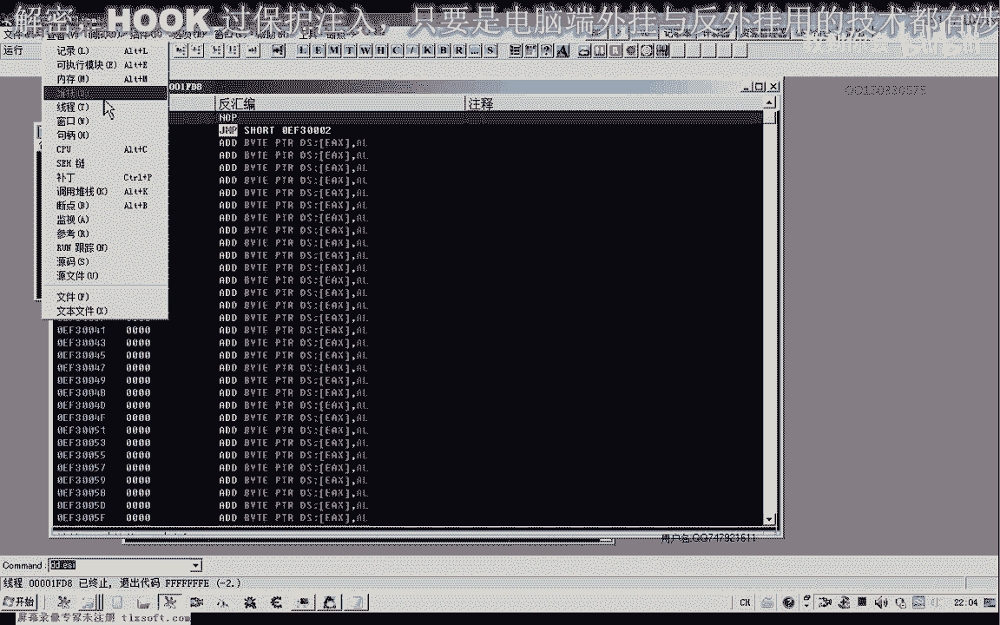
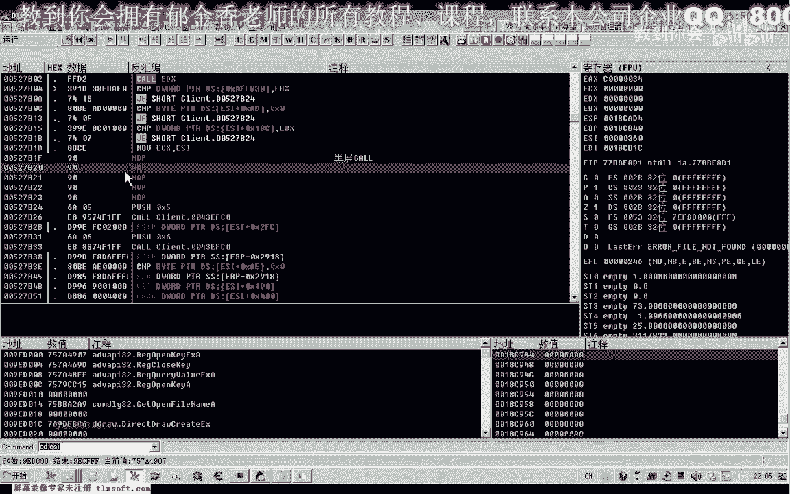
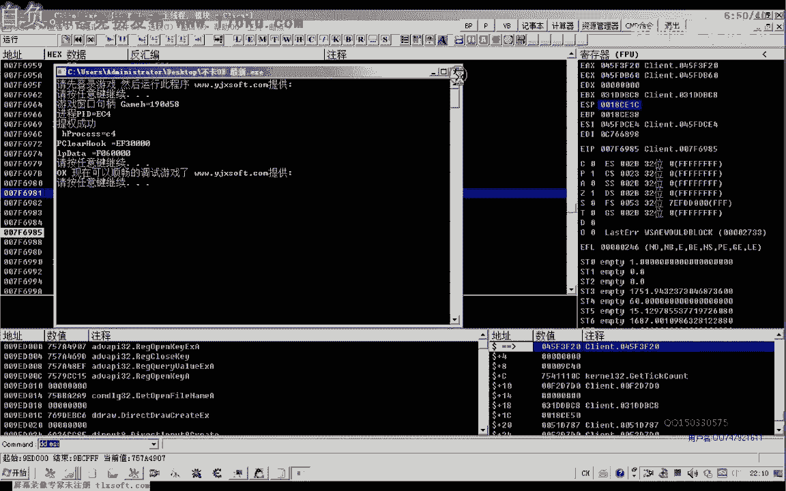
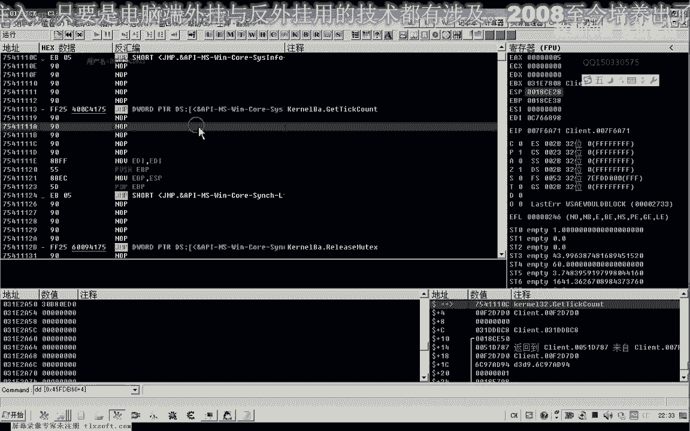
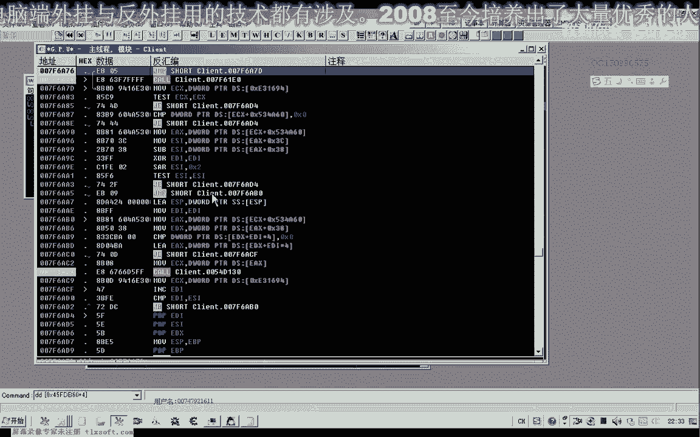
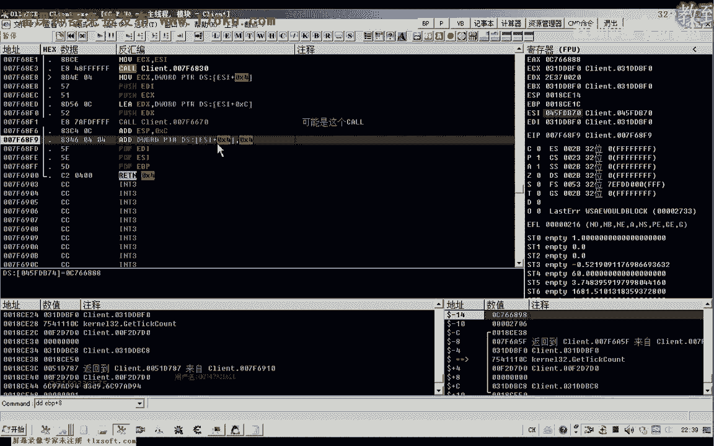
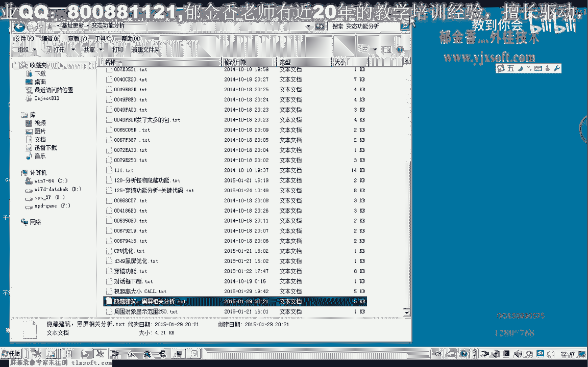

# 郁金香老师C／C++纯干货 - P120：131-隐藏建筑物分析 - 教到你会 - BV1DS4y1n7qF

大家好，我是郁金香老师，那么这节课呢我们呃分析一下哈建筑的一个隐藏啊，嗯那么我们这节课呢，首先呢从这两个黑屏优化的这两个地方开始分析哈，另外的一个有一个黑屏的这个扩。

那么既然我们找到的这个呢是一个真正的一个黑屏优化的话，那么说明这个扩的话，它可能是管理我们的嗯，也就是相关的一个游戏画面的一些数据的一个准备哈，可能是在这个扣扣里边啊。

那么我们可以从这个扩里边呢开始了呃进一步的一个分析，那么呃看一下它是不是与我们的这个人物界面啊，或者是我们的建筑物啊，这个场景呢相关的呃一些数据是不是在这里面。

那么我们先用来o d来附加进去。

然后呢我们再转到我们黑屏的啊，这个五黑屏库这里啊。

嗯，那么转到这个地方之后呢，我们再次把这个地方弄不掉啊，看一下，那么这个时候呢它是一个伪黑屏，它cpu的这个占用率的话。

它不会大幅的下降啊，虽然说有一定的这个下降。

它不会有很大幅度的一个下降，那么呢我们呃也就是说所有关于场景的，比如说我们对话框啊，呃还有我们的人物角色呀这一类的啊，画面的一个更新的一个相关的数据呢，可能都是由这个扩来准备的，嗯。

那么我们跟到这个库里边来看一下，那么这里呢它也有一个括啊，这里有一个比较，那么我们看一下这个库里面它的参数有多少，这个库看起来还有一点大哈，呃它没有相关的参数，那么我们先把这个库进行一下logo。

然后我们在这个时候呢。

我们发现了有关黑屏的话，可能就是这个孔哈，这个库呢也是一个伪黑屏扩。

过啊可能是管理对象，就像绘制数据的，那么我们把这个地方呢直接把它复制一下，那么既然这里边的话，那它是管理我们这个对象数据进行绘制的，那么里面它肯定有进行分类。

那么这个分类的话一般呢它会有一个循环这一类的啊，然后呢循环之后呢对他的这个对象类型的一个判断啊，然后来进行分类可以，那么我们继续往里边看一下，那么这里呢也有一个破啊，那么我们进进来看一下。

这个坡的话也比较大，那么比较大的话可能还不是很好分析，那么我们首先在这个地方下断看一下它能执行前后堆栈的一个变化，因为我们这个扩比较大的时候呢，我们去找他的这个返回地址的话比较麻烦。

也就是找对太比较麻烦，那么我们看这个地方usp的一个变化呃，执行之后呢从1c啊变到二八，那么证明他的这个参数的话还是比较多的，那么我们再次来看一下嗯，现在的usp呢是ec啊，然后呢我们按一下f8 。

那么这个时候呢是二八，那么他一共呢有从这里来看的话，它一共有三个这个参数啊，这里是二八，那么呢这里是ec，那么中间呢它们相差三个地方呃，那么所以说在这里的话，我们应该是a a tp e s p啊。

0c好才对的才是对的啊，那么我们从这个地方呢把它弄啊，把这段过来，把它logo一下，嗯那么我们发现这个扩的话与我们的这个数据处理的话，好像是没有关系的，那么我们接着来往后来看一下吧。

看这个地方会不会执行，那么这个括我们来看一下它前后一个参数的一个变化，ec，按下f8 嗯，从这里的话看它没有没有相应的一个变化啊，数字的话，那么只有这个地方呢有一个变化，那么在这里的话。

我们可以直接把这个地方的logo掉，再看一下，那么对我们的画面的话也是没有影响的，那么我们继续往后来看一下，这个数值就比较多了啊，这个地方，看一下这个地方有没有被执行到，看一下它参数的一个个数。

按下f8 也没有变化啊，这里呢它是这个因为这个扩的话，我们可以看到它虽然说有三个参数，但是它是在这个地方评价的，所以说呢在这里呢这种困难我们可以直接落户，他们有这个影响。

那么证明影响到我们这个图像数据的处理的话，是有其他的这个扩，那但是这个地方的话又比较大啊，那么我们更新一下它的流程，从这个地方，那么可能这样更一下的话，可能会快一点，但是这个也不能够呃。

这里的话我们可以看到呃，他就是对我们的这里有什么3331，二一应当是在对我们的这个对象的话进行相关的一个分类了哈，这个是我们呃比如说我们的灵异啊，3331，这都是我们的usp加八这个对象相关的这个数值。

那么在这里的话，它应当是对我们这个这个对象的数据的话再进行一个分类啊分类，然后呢在这里呢来调用一个相关的一个扩，那么这这应当是我们的呃周围的可能是一个怪物的一个列表，然后可能是从这里。

然后呢再进去进去啊，那么我们按减号再退回来看这个库会不会被执行啊，那么这个库呢也会被执行，那么他呢嗯我们看一下里面的一个返回值呢，14，那么我们要屏障的话，这个地方呢我们需要a d d e s p加四。

好的，那我们再来看一下它的一个变化，那么我们发现了这个时候呢依然黑屏了啊。

那么这个呢也是一个我们可以跟他取名一个啊黑屏相关的一个扩，那么证明我们的这个画面数据的话，可能就是由这个库来处理的，你中画面处理相画面相关数据处理，弄不掉这个黑皮，好的。

那我们要把这个相关的扩展进行一下注释，那么我们进去看一下它有几个空，那么这里呢进来又有好几个括哈，这里是复习一个零，那么这里呢也有一个括号，可能有两三个括，那么我们在这个地方呢，先下一个断点。

好像没有断下来，这个地方也没有断下来，这个地方还是没有断下来啊，这个地方断下来了嗯，那么这个地方断下来的话，说明这个地方的卡性比较大，那么我们进去看一下，但是这个地方断下来之后的话。

他就只有短短的一句话，那么我们先把它弄不掉看一下，那么这个看起来实际上它实际上不像啊，因为它这个涉及到的指令太少了，那么看起来的话，这个过来与我们的这个界面的话没有太大的关系，那么应当是前面的几个空。

那么我们返回去再看一下，这里会被调用到，我们按f7 看一下它执行的一个流程。

那这里有点奇怪啊，看起来这个地方好像是很像，那么有可能是它的一个返回值啊，这里好像是一个循环，它在循环的执行这个扩，那我们再分析一下，那么这里呢是一个大的一个循环啊，那么循环的话可能会执行到这里。

那么我们先把这个过来啊，这个扩呢会执行到，那么说明的话可能这个扩的可能性呢还要大一些，反复的会执行这个空，那么我们看一下ec x是什么，那么就这个意思。

x的话是我们的人物角色的这个空啊，这里也是哈40f这样进去，那么最后呢他好像还有一个返回值，也会对它进行一个影响，那么我们先把这个这个扩呢，先把它呃做一个加配，这本来跳过这个扩折执行。

我们来看一下7f6 k30 ，那我们就跳到这个后面来执行，跳过之后我们来看一下，这个地方呢它也会被执行到，那么证明这几个课的话可能都有啊，都有相关的一些，但是我们刚才的这个扩的话。

看一下它与我们的黑屏的话是没有关系的，我们做江北这个地方到哪里去了，我们看一下，乱剪好吧，再退一下，这个地方我们做了一个价格，那么我们再回到上一层去看一下，请下一，这个扩也没有啊关系。

那么可能还是7f6 这个括号嗯会伪黑屏，那么我们在听到这个框里面去看一下7f6830 ，就这几个货呢，我们再进行断点啊，下一下断啊，最终呢是断在这个地方，啊反扑的是断在这个地方。

那么我们在这里注释一下啊，好是这个孔，那么当然这个库的话我们还是看到的，刚才好像我们已经修改过了这个库，它好像，代码太少了，可能不是，那我们再看一下它的一个走向，回到7f6 这个地方调用的，再按f8 。

我们往下跟一下，哒哒哒，零二往下，那么这个地方呢是黑屏7f6 ，然后呢我们再往下执行一下，那么这个库的话应当是相关的一个库啊，但是呢我没有找到他，就是直接的与我们的这个建筑物相关的。

那么建筑物相关的话可能是另外一个空，那么我们再跟一下它附近相关的，再按下f8 ，但之前的话我们看到他又没有执行其他的这个扩嗯，这个地方好像执行了一个括，这个框有没有被执行，只做了一些比较啊。

这个地方那么可能取决定作用的是是这个ex的一个返回的一个数值，可能是，那么我们看一下它的返回值有一些什么特别的地方，那么这个ex返回值的话，看起来像是一个对象，这里看起来的话像是一个对象的一个地址啊。

这里是3亿，再看一下，那么这里是五八，那么我们从这里，我们下一个路程断点看一下，啊这个断点我们取消掉，那么从这里来看的话，它可能是呢呃这里到一个循环里面去了啊，我们就是这里呢是一个对象加八的这个位置。

那么也就是我们再退回来，那么这个扩展功能的话，我们大致我们是知道了它返回，最终呢它返回一个呃ex，那么这个ex呢是一个对象，我们再来看一下是不是这样的，那么我们先把内存的访问断点呢先取消掉啊。

这个时候呢ex那我们找一下这个ex它的一个来源，那么这个ex的话上它是来源于我们的e s i诶加四这个地方，而e si加s的话，它是来源于上一层的这个e c x，那么大概呢他就做了这样一个市场。

这个扩的话，那么就是从这里来，从这个e s i里面把我们的假设这个地方呢，把我们的这个对象取出来啊，这个时候就取出来一个对象，五八这个这个响应，那我取出来之后呢，然后实际上就可以返回了，从这个地方。

那么后面的话相当于都没有做其他的事情，那么这个库里面可能做了一点点事情啊，但是这个扩的话它也没有改变我们的ex的值，那么ex的话来源于我们的，我们看一下f7 ，不过了，1a x。

那我们再再到这个地方来下一个断点，再看一下，这是ex的数值，那么我们看进到这个库里面，它有没有改变，那么我们发现的话，这里的话它也没有改变我们ex的数值，那么所以说这个空呢它好像是无关紧要的好。

然后就返回到上一层，然后我们再跟一下这个ex的一个走向，然后呢就每次呢把这个ex加八里面的这个数据的把它取出来，进行一个比较，那么会不会是这种情况啊，我们推想一下，他就是可能是不断的在骗你啊。

某个可能就是我们这个对象数组啊，周围的这个对象数组，那么这里呢可能是我们的这个周围的对象列表，那么我们进去看一下会不会是这种情况，那么看起来有点像这种情况，再加四，那么这里呢他看起来的话。

这个45f t60 的话就有点像是一个呃，可能是与我们界面相关的一些呃，需要绘制图像的一个对象，那么他把这个对象，然后呢呃是一个机制，然后呢传到我们的这个库里边，然后再取出里面的某一个对象。

取出来之后呢，可能他会做一些处理啊，就是说这个对象是否还需要绘制这一类的，那么这里呢他做一个判断，那么我们看一下，如果等于二一啊，或者是等于某一个数值，那么在这里呢它都有一个等号。

那么在这里的话我们看一下jn z啊，不等于co分零二，不等于零的话，与二进行比较，与三进行比较的时候呢，直接跳到这里来，那么我们把这个撤销还原看一下，三三嗯，312 亿都会了，来到这个地方。

那么从这个来看的话，可能是人形的这个怪物呢，它会到这里来来进行一个数据的一个处理，那我们看一下周一回到我们的城里边哈，看一下有没有人形的这个npc，啊这里有一些人形的npc。

那么我们看一下在这个地方的话，如果把它跳过了，我们人形的npc会不会进行一个绘制，这里跳到的是7f56 a30 ，那么我们看一下，这个时候的话我们看一下周围的这个npc的话，那同样是在的。

但是在的话我们有一点呢就是选中它的时候，它上面的这个血条没有了，那么这个的话可能就是一个血条绘制的啊，相关的，那么这个时候我们选中的话，就有一个血条，那么这个呢可能是我们的角色对象，和血条的一个形式。

或者是我们的选中，选中画面的一个显示，但是我们在这里看的话，它也没有存放这个数据的一个缓冲区，好像也没有改掉它的这个数据，那么一直呢它是在这里做一个循环，嗯这个有点看不懂啊。

那么我们再看一下后面这里呢还有几个空啊，那么这些空看会不会执行到，那么我们先分析一下后面的啊，后面这个框呢也会被执行到，那这个扩的话有一个比较大的一个循环，那么从这里的一个比较来看的话。

感觉的话这个扩的话可能呢更像一个呃，这个是我们的人物角色，这个是怪物啊，那么这个库的话看起来的话更像是我们的呃，相应的这个对象的一个绘制的一个空，那么我们先把这个框弄不掉，看一下。

看一下他e s p的一个数值，usp呢是128，然后我们按一下f8 。

然后看一下对象里面的一个变化，这个时候的话我们的e s p呢它没有变化，那么说明这个货的话，我们可以来。

都漏不掉，弄不掉之后呢，我们看一下它的一个变化，那么我们发现的话，这个困难它也与我们的这个图像的一个处理有关系啊，那么这两个括的话实际上都有这个律师的作用，但是我们不知道他们之间的一个关系。

那么这个库呢它不断的在循环里边哈，取出这个对象，好像是我们再来看一下嗯，ex的一个变化，那么我们在这个地方来看一下下个断点，那么我们可以看到的话，他应当是不断的从这个扩里边呢取出这个相应的对象而已啊。

然后把这些对象呢取出来，进行一个循环，可能进行了某些处理，那么我们再跟一下，ex注意ex相关的，ax，但是这里的话它就从这个ecx里边取这个数据出来了，好像这个ex的话没有多大的这个作用啊。

感觉你再看一下呃，ex是这个数值，那么看这个ex呢它有没有利用起来，但是每次呢它加的是ebx，在这里，然后呢这里呢它是从ebx里面取出来的，那么这里的话看起来的话，实际上是在偏离我们的ebx这个数据。

3d，那我们在这里来看一下这个断点，那么这些呢我们把它恢复一下，再听这个课来看一下吧，不断地取出来，那么我们关键看一下他写入的这个数值，也没有明信，这里呢做一些相应的判断，一bx啊。

然后呢是把我们的这个这里是传入了一个对象进去，那么我们看一下这个对象传进去之后，这个参数它做了一些什么，然后我们看一下啊，首先呢它把它取到di里面来，然后呢与我们的ex来进行一个比较啊，指示。

e d i，然后呢又与我们的这个e s i来进行一个比较，然后呢与我们的看一下这个ex是从什么地方取出来的，e b p加八，然后与我们的这个e s i加八来进行比较，我们看一下e s i加八是什么。

ex，好那么我们再往后边看一下，主要是看看一下他有没有写入的这个数据，1n x啊，bp加八，再看一下，我们全新的就是一个参数，bf 0这个啊也就是一bx，然后这个e bx呢在这里呢成了这个e d i。

它又传到这个扩里面去了，ex，一dx，5d，也是，加四。

那可能是我们忽略了某一些东西啊，这个课里面的话，应当是呢对我们的这个ebx这个对象的某一些地方的话，应当是进行了一些写作的一些标志进行一些区分，就是可能也是做一个距离的判断什么什么的。

然后就是说这个对象需不需要。

把这个进行一个绘制，那么真正的一个绘制的话，应该是在这后面啊，这个扩进行了一个处理，那么我们再进去看一下，如果看不到的话，我们直接分析后面的一个空啊，取出来哈，取到e d i。

e d i的一个数字bc 8，然后我们看一下di的一个趋向，di又进到这个库里面去了，bc 8，又到了哦，这里ex又传了一个数据进去，然后呢这里的b48 号到了e4 x这里。

那么e4 x呢又把这个相应的数据呢又进行了一次读取，那么读取之后呢，把它写到了这个ea x里边，那么这里有一个显著的一个操作，那么这个操作的话，那么可能是呢也就是排除那某些要绘制的这个对象。

可能是往这个ex这个列表里面起n e a x的话，来源于我们上一个参数看一下嗯，加c啊，也就是说它把它写到了这个e s应该是e s i加四这个地方里面，这个地址就明确了，好像看起来做了一些记录啊。

记录到我们的这个e s i这边，那么可能是这样的哈，也就是说它不断的对这个整个所有的对象哈，可能是进行周围的对象来进行偏离，那么哪些对象我们是需要来进行我们画面的一个更新啊。

那么在这里呢它进行一个偏离的处理，然后这里呢再对我们的数据来可能是进行一个更进一步的一个处理，那么我们在进到这里去看一下，在这里下一个断点，然后我们再往下面跟一下，311170，这个好像是所有对象。

这里有很多很多的列表，然后呢我们就进到了一个循环的里边，很大的一个循环，那么我们那么一般来说的话，可能是循环里面呢它可能会分开的啊，处理每一个对象的一个数据，那么我们找一下这个循环里面的这个扩。

啊这里有两个库啊，前面有一个，后面有一个啊，那么我们执行到这里的时候，我们看一下这个空，它里面管的是一个什么数据，那么我们进进来看一下这个框呢，它也没有这个相应的参数，看起来的话它是没有参数的。

至少这里直接return，那么我们直接把它落不掉，但是这里呢我们看ex它的这个后面的这个返回值，好像也没有被利用起来，那么我们再来看一下画面嗯，这个时候我们发现的话这个库啊我们找到了一些有用的数据。

我们看一下，那么所有有关窗口相关的，还有这地面的一些贴图的话啊，发生了一些变化，地面的贴图没有啊，但是cpu的占用率呢是没有下降的，那么这个时候我们的所以说这个扩的话应当是关于地面贴图的。

还有我们的背包的这些东西没有菜单没有了嘛，哈菜单相关的一个绘制按tab键盘，我们的背包也打不开了，下面的f一到f 10了也没有了，好那么我们记录一下，而且调用这个地方的话，调用这个库的地方比较多。

那么如果我们直接去看看有有什么效果这个地方，那么我们再进入到游戏里面，那么我们看一下这个时候的话，实际上人物角色所有的这个画面的话都不动啊，都不动了，那么说明的话应当是这个扩的话。

它关系到关系到我们它的参数不一样的话，可能是关系到我们所有的这个对象的一个数据的一个处理啊，可能都是在这个框里面的这个地方，那么目前确定的是这个菜单以及我们f一是f 10，还有我们的背包。

那么这些数据都是由这个过来会来进行这个处理的，还有地面的一个贴图，那么可能是由于参数的不一样，它可能还有其他的一些功能，那么这个扩的话，那么我们再来看一下前面这个框呢，哦1310啊。

这个是我们看一下e4 x，先看一下e4 x是什么，那么在这里的话，我们暂时来看不出来这个ecx是一个什么数据，但是我们看先看一下这个堆栈，按一下新号啊，在在这里定下定位到我们的e s p嗯。

e s p来应该是120，看一下好ac就是这个地方，那么我们按一下f2 之后啊，它的参数也是0c啊，那么我们在这里的a d p e s p啊，加上零碎啊，在前面这个库进行一下处理，看一下它的一个效果。

那么这个时候呢直接的出错了，说明我们这个破的话，可能他有一些数据呢需要到二需要用到哈，进行处理之后呢，后面的地方可能会用到，那么我们再来看一下，是这一句啊，因为我们在这里落魄掉之。

后呢后面这个语句呢受到了影响，那么所以说呢造成出错，好那么这节课由于时间的关系呢，我们呃就先分析到这里，那么下一节课呢我们接触这个地方呢，嗯继续分析。

