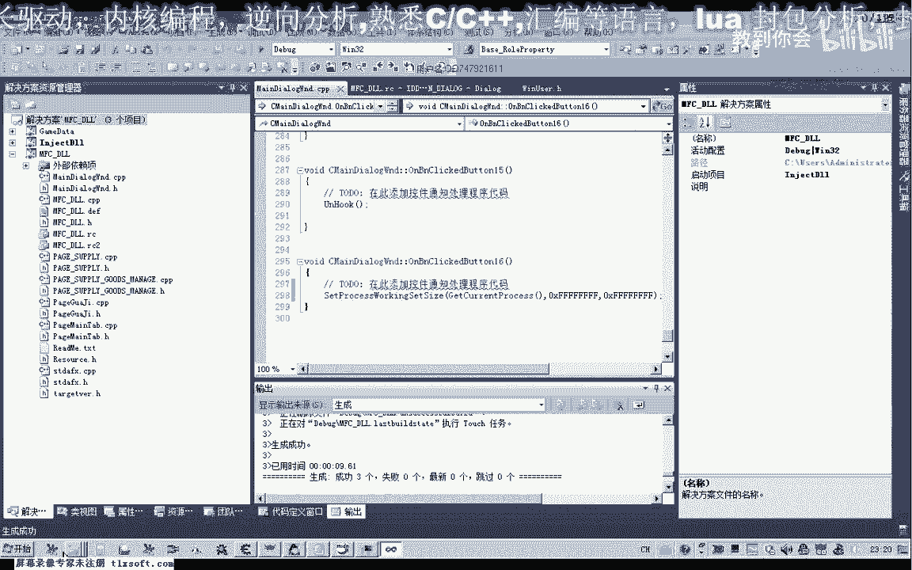
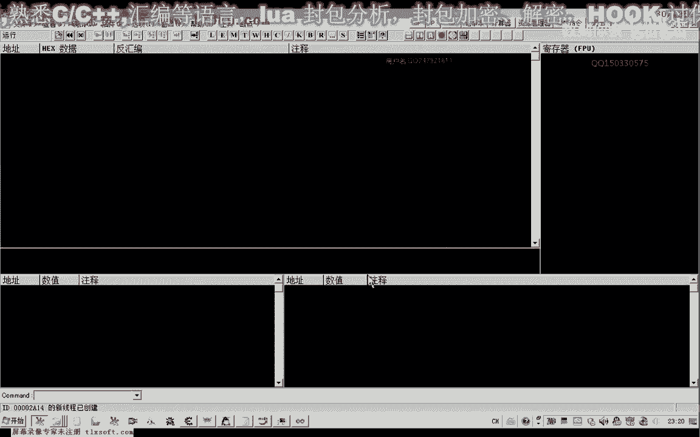
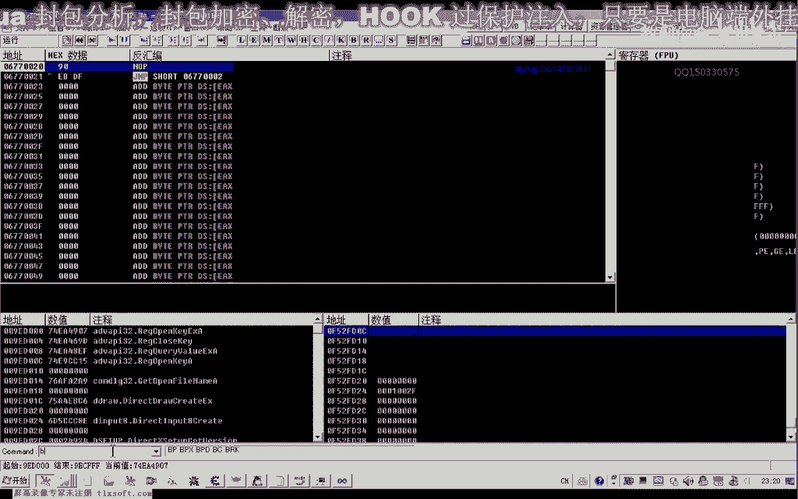
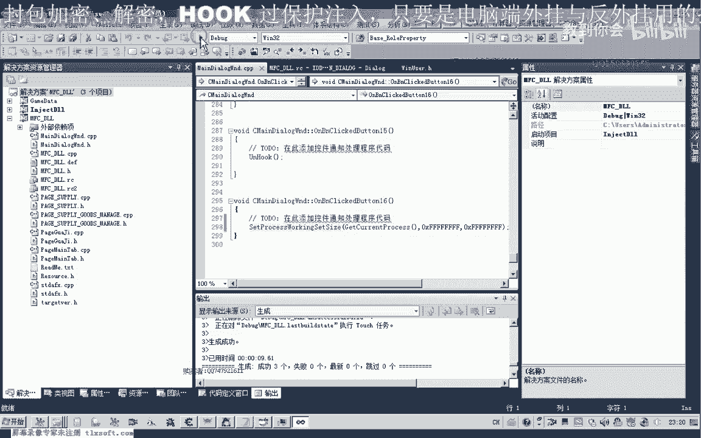
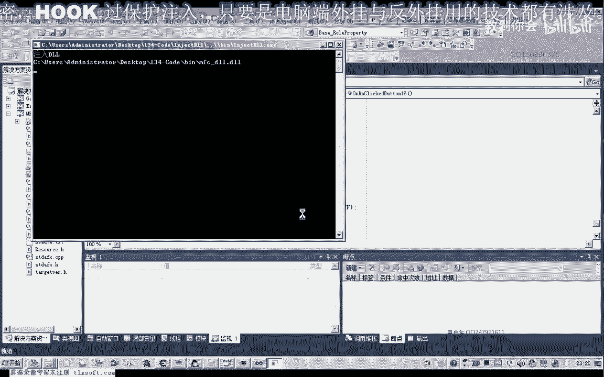
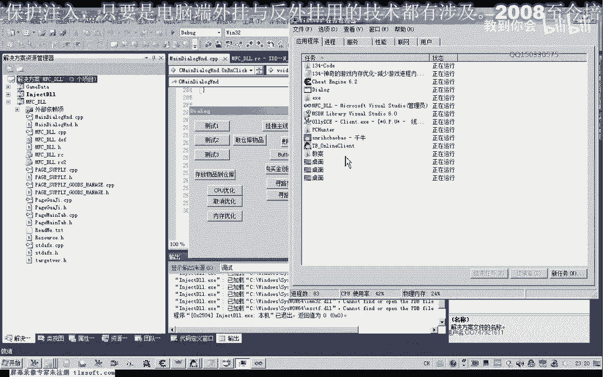
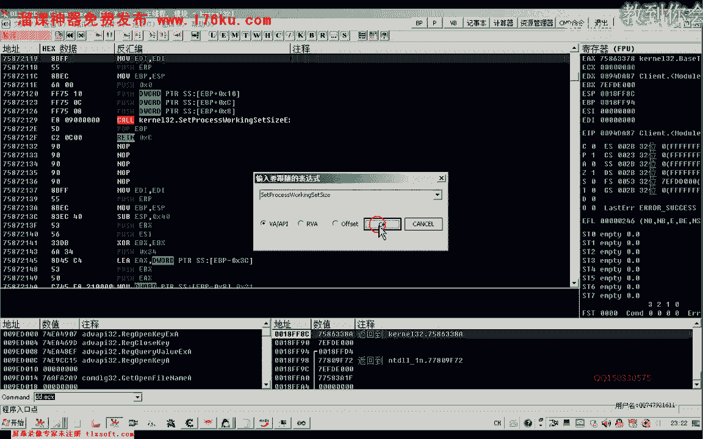
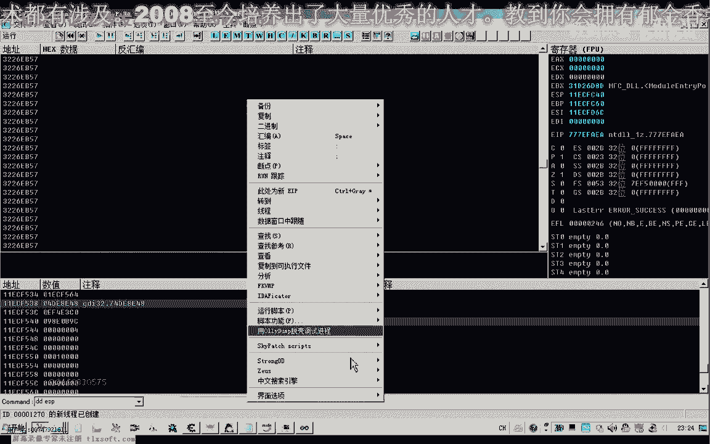
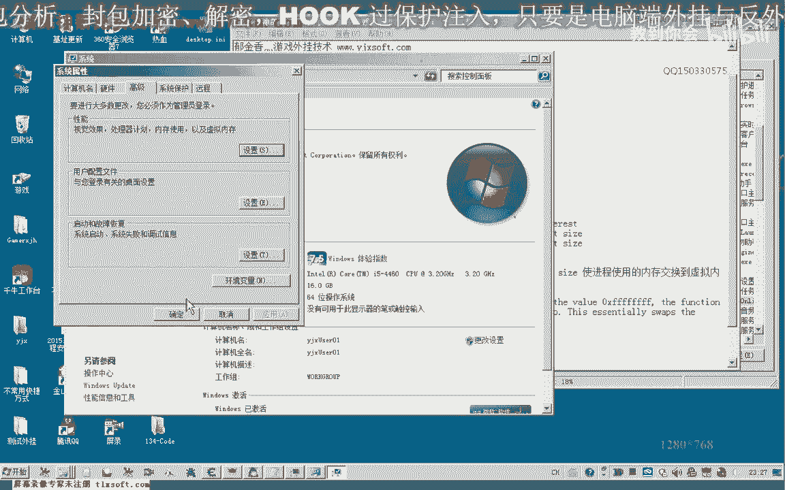

# P123：134-神奇的游戏内存优化-减少游戏进程内存占用 - 教到你会 - BV1DS4y1n7qF

大家好，我是郁金香老师，那么这节课呢我们来探讨一下嗯游戏内存的一个优化，那么实际上这个内存优化的一个函数的话，它实际上呢是一个呃a api函数，它可以设置来把我们的呃这个物理内存的这个数据呢。

交换到我们的这个虚拟内存去啊，也就是用我们的硬盘啊这一类的来做一个虚拟对称，那么这是它的一个本质哈，嗯那么我们来看一下md的一个说明，那么其中呢它有这样一条哈，他说如果这个参数二和这个参数三啊。

也就是这两项，那么如果这两项啊同时为零，x f f啊，那么实际上呢也就是我们的整形的16进制呢，也就是八个f，那么如果为这个数字的时候呢，那么它的本质的话，实际上呢就是把我们的这个物理内存呢啊。

交换到我们的呃这个虚拟内存上面去啊，进行一个置换，那么从而能够达到一个少占用内存的一个目的啊，当然当然这个函数的话，嗯建议呢就是说呃建议在我们加载好游戏的时候呢，只使用一次啊就行了啊。

那么实际上它本质上是不能够真正意义上呃减少我们内存的一个使用，它只是把我们啊物理内存的一个数据来进行一个置换啊，形成一个页面文件呢保存到我们的硬盘上啊，那么如果呃这些数据它不是经常的使用。

那么我们可以用这种方法来进行一个转化，来达到一个有效啊高效地利用一个物理内存的一个目的，那么当然这个功能的话听起来还是挺神奇的哈，有不少这个软件或者是外挂了，它都有这样带来这样一个功能。

那么比如说我们现在来看一下，那么现在我们游戏的内存的一个占用占用率的话，大概是618兆，那么我们打开第128课的代码，那么我们调用这个函数来进行一下尝试，那么转到了测试啊，这里呢我们随便选一个按钮啊。

可以取名为内存优化，那么我们再看一下这个函数的说明，第一个呢它是一个进程的句柄，当然如果是本地进程的话，我们就直接用函数来取得啊，直接用函数来取得就可以了，那么这里的话我们就可以这样来写，get it。

我们获得当前进程的一个具体嗯，然后呢后边这两个数字呢为零，x f f1234 啊，那么还需要一个f，那么实际上也就是我们的-1，好的，那么这个时候呢我们编译生成一下。

然后我们用u o d r进去加载，来看一下它的这个参数。

这个时候呢我们在这个函数上下一个断点。

然后让我们进行一下出租。

那么我们看一下现在的内存占用的话。

嗯是625兆的样子，那么我们进行一下内存的优化，那么当然会先断在这里，那么这个时候我们可以看到它这里的话，实际上这两个数字呢都是等于-1啊，传进来的这个三个参数的话，三个参数来全部都是辅音。

那么实际上我们有一个简单的写法呢，也就是直接穿三个这个-1进来就可以了，那么我们看到usp这里，那么如果这里我们整数的有符号数呢就是-1，那么16进制的数呢就是这个f f那么一共有三个参数呃。

为什么我们的进程句柄也等于-1呢，因为我们的这个实际上这个辅音呢它是一个五句柄啊，也就是我们的所谓的这个解体，如果是当前进程的这个函数的话，那么实际上它就是一个啊，转到这个地方，先让它跑起来。

然后我们转到这个系统的模块，这里呢应当是我们的这个mfc，mfc里面呢有一个同名的这样的一个符号。

那么所以说它会定位到这个地方来，那么如果我们另外打开一个o d来看一下。

那么从这里过去哈，该体啊也就是我们的啊当前的进程的句柄过去的话，实际上呢它的一个返回值的话，从这里就能够看到，实际上他始终都都是返回的一个-1啊，做的一个5g品啊，相当于是这样的嗯。

那么我们这个我们把它退出一下，不管它，然后我们再来看一下。

这个时候执行完了之后，我们看一下它这个游戏的cpu内存的占占有率。

那么这个时候的话只有十多兆啊，那么刚才的话我们这个游戏进程呢，它一共有600多兆的这个内存的占用率啊，现在的话只有几十兆，那么这样的话看起来的话效果很明显。

那么实际上他呃对于我们就是说呃不明白这个原理的人的话，感觉呢很神奇啊，但是这个功能呢不要反复的使用，那么反复的这个循环使用的话，它比较伤伤这个硬盘，因为你经过一段时间的运行之后的话，这个内存的占有率来。

他可能还会逐渐的会增加上去啊，那么只是说我们在使用的当时呢，它看起来这里呢比较神奇哈，那么我们更实际上可以看到这个绿色的话，它会缓慢的增长，那么因为它要用到相关的数据的时候呢。

它实际上也要从我们的呃硬盘上来，把这个要用到的这个数据呢只换到我们的内存里边来啊，那么如果你的这个cpu啊内存比较小的话，就能够看到那个硬盘的灯呢会不断的闪啊，所以说如果说这个用的次数比较多的话。

那么有一点伤这个硬盘。

好的，那么这里也有个简写的形式啊，那么我们刚才通过汇编也看了，那么实际上呢我们这里呢可以把它写成写成好几个数量，这两种形式的调用呢实际上都是一样的，我们可以用符号数来调用啊，传入啊，三个-1就行了。

三个-1，那么第一个-1呢实际上就代表了这个啊当前进程的这个句柄，当前进程的句柄它是一个固定的一个词啊，那么这一点我们要注意，当然你第二次再调用这个函数的时候，实际上它就不用没有这个明显的这个效果了。

只有第一次调用的时候呢，它有这个明显的效果，好的，那么这节课呢我们就讲到这里，那么我们下一节课了再见，那么实际上我们所说的这个虚拟内存的话哈，那么我们说穿呢，实际上它也不是很神奇。

那么这个虚拟内存呢也就是我们这里边啊设置的啊，这个在硬盘上的一个呃分页文件啊，这个就是我们的虚拟内存，那么实际上它是设置在我们的硬盘上的啊，那么呃在win xp的这个系统下的话。

我们打开呃打开这个工具属性啊，我们把这个隐藏文件把它显示出来的时候，那么我们就可能啊就可以看到这个啊page file。s y s，那么这个就是所谓的啊所谓的我们的一个呃这个页面文件啊。

那么这个文件的话实际上我们内存大的呢，大的话我们可以把它取消掉啊，或者把它设置小一点，当然如果你这个页面文件设置为零的话，那么刚才的这个函数的话，可能执行就没有效果。

嗯那么这里呢我们可以把它自己手动的设置一下啊，这样可以节省一些呃硬盘。

好的，那么这节课呢我们就讲到这里。