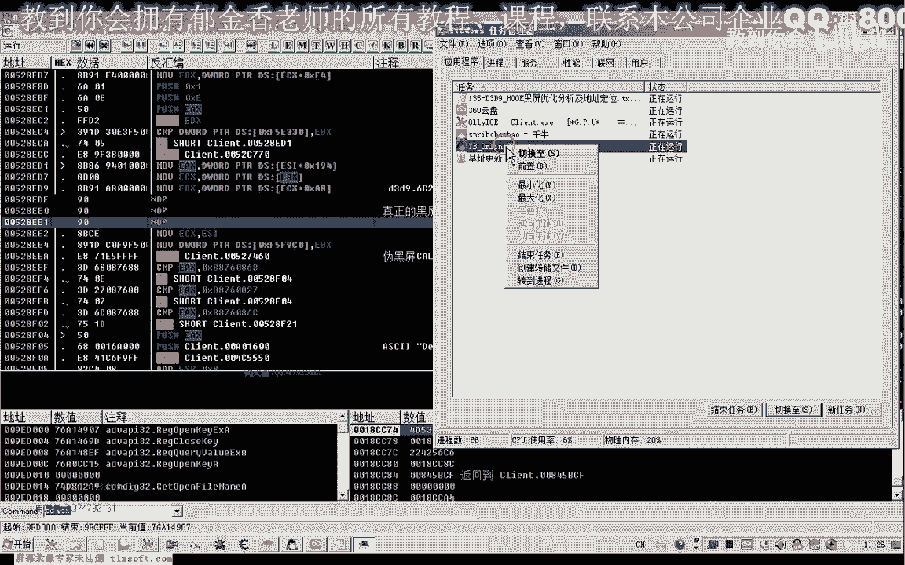
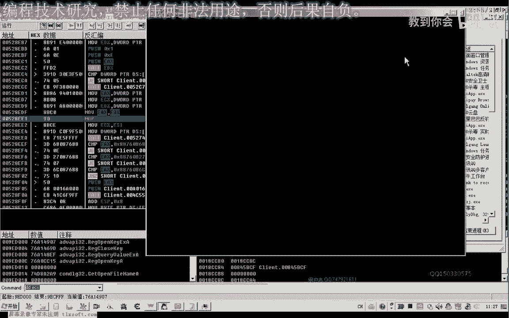
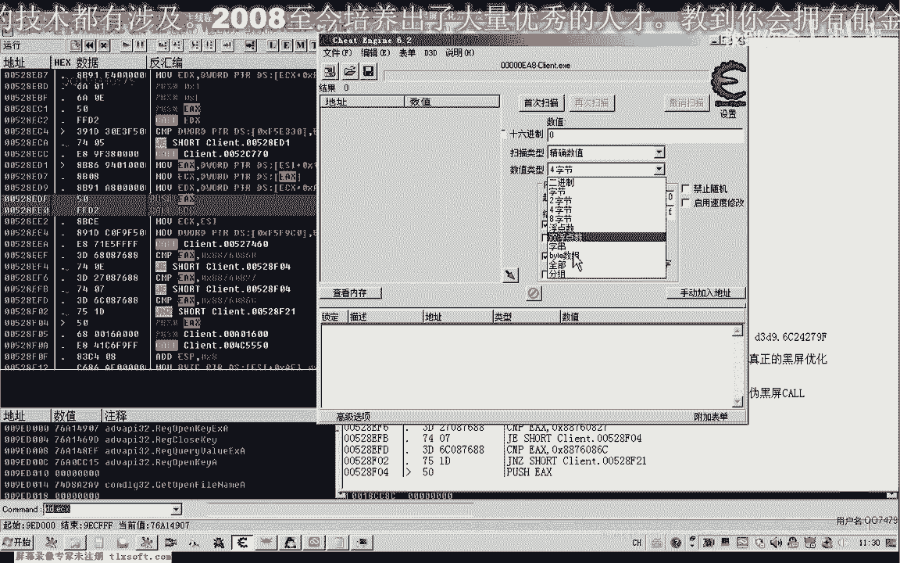
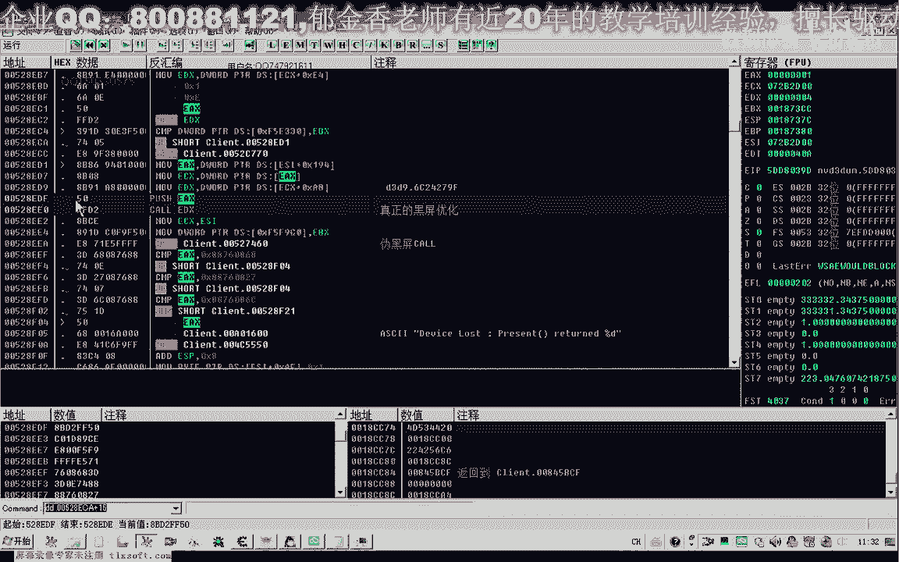
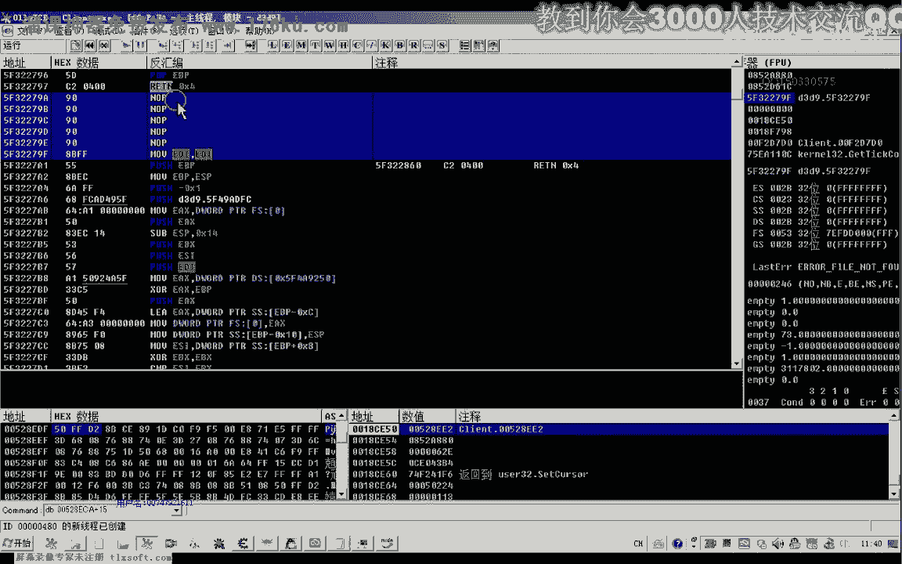
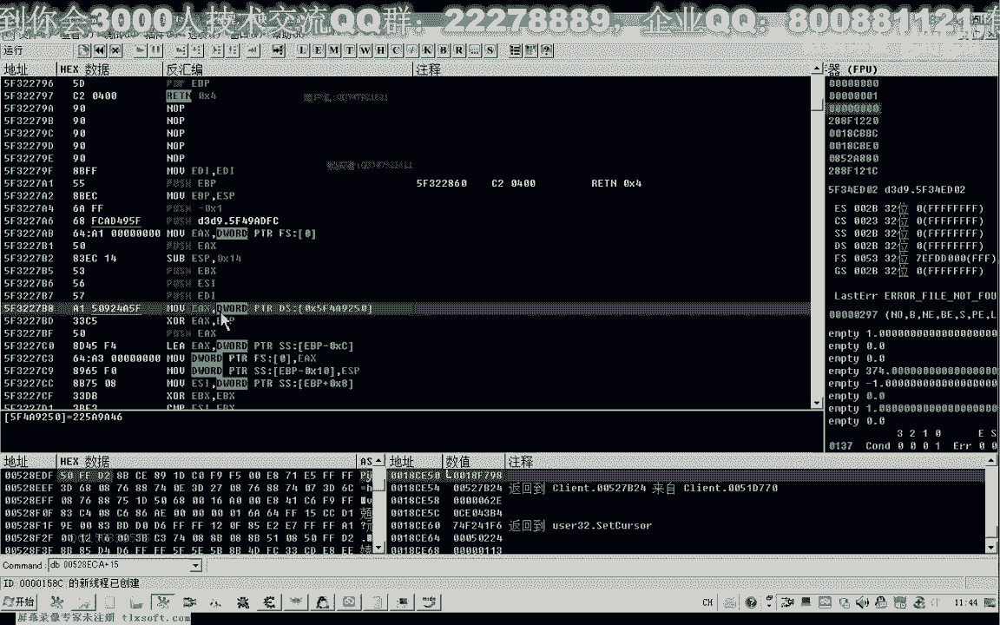
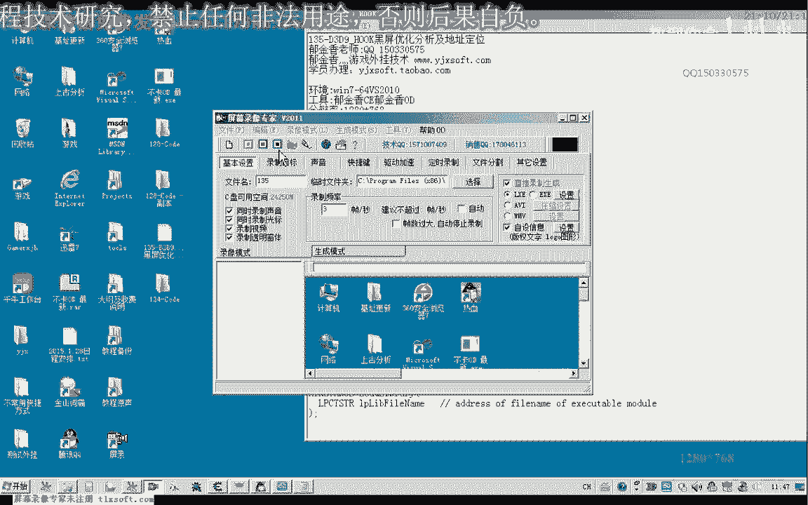

# P124：135-D3D9_HOOK黑屏优化分析及地址定位 - 教到你会 - BV1DS4y1n7qF

大家好，我是郁金香老师，那么这节课呢我们将整理一下黑屏优化的一个特征吧，还有一个呃d3 d9 的这个动态链接库的一个黑屏优化的一个，相关地址的一个定位，那么我们先打开我们的ot。

大头那么实现我们的黑屏优化的话，呃有两个地方哈都可以实现一个真正的黑屏优化，那一个是我们跳过这个获得一个执行，在主线程里边实现。

那么一个是在这个地方，那么第二个呢我们是进到这个d3 d9 里面去，直接对这个动态链接库里面的这个代码进行修改，让它直接返回来实现黑屏优化，那么这两种方式的话，实现的原理实际上都是一样的。

也就是不让它真正的呃更新这个图形，绘制这个图形，那么以达到一个节省我们cpu占用率的一个作用，那么首先呢我们可以从把这两个地址呢把它落魄掉啊，呃这两个地址lop掉了。

我们可以简单的也可以来进行我们的这个真正的黑屏的一个处理，那么这个时候呢游戏的cpu占用率呢它也会下降得很低啊。

那么实际上这种优化的话，给我们的呃cpu的比另外一种cpu优化的方式的话还要好一些哈，黑屏的优化嗯，另外的那种cpu的话，它是呃让我们的这个cpu进行强制的一个休眠呃。

它数据的话得不到一个及时的一个处理，实际上，那么另外一种优化呢，呃当然我们先把这个呢可以记录一下哈，这一段呢我们把它落魄掉啊，呃萝卜条呢或者是把它写写成啊，相应的这个无用的指令都是可以的啊。

比如说我们把它写成木啊，e x e x啊这一类的啊也是可以的啊，那么这样它也能够达到一个cpu占用率的一个降低啊，只要我们指令不改错啊，那么这里呢他不会出错的，那么这个是一个真正意义的一个黑屏啊。

真正意义的一个黑屏的一个处理，这就是那么除了这种方式之外，我们也可以把它记录一下，这里的一个hook，这是我们的主线程的一个号口，和平优化，嗯嗯那么我们提取一下它的一个特征码来定位，那么这个特征码的话。

我们直接可以就从这个地址这里定位，定位后面的就可以了，当然实际上最好的提取方式呢是从这个地方开始提取啊，然后加上相应的一个偏移，因为这这段特征码的话，一般呢它变化的可能性比较小，那么我们从这里开始提取。

那么从这里提取的话，它具有一个比较一个唯一性啊，那么因为后面的这一段呢会被罗卜掉啊，所以说在后面的这一段的话，我们就可以不提取了，就用这前面的这一段就可以了，好的。

然后呢我们打开c看一下它能不能够正确地定位到我们的这个地址。

那么这样定位的地址的话，它有两个地方，一个是527，一个是528，那么我们这个地方呢是58呃，在这里呢我们还可以加上一个e8 在前面的，从这个地方开始定位，那么从这个地方开始定位的话，前面的是七四啊。

然后星星因为这个呢它可能最有最大的可能性啊，这种跳转的话他肯定有变化，那么这里呢是一八，一八，然后呢，12345678，那么我们最好的让他去有一个唯一啊，唯一性，那么我们再来搜索一下。

那么这个时候的话他收到的地方的话就只有一个了啊，58呃，e c a这个啊，但是这样的话实际上它的搜索效率呢也不是挺高的，嗯可以考虑加上这一句，啊那那暂时就用这个啊来作为我们的一个特征吧。

那么但是呢它距离我们这个后面的一个距离，我们来计算一下，那么它的一个偏移的话嗯，就是呢我们这个地址来减掉我们前面的这个地址，那么我们计算一下这个偏移是多少，那么这个偏移是16进制的幺五，十进制的二幺啊。

那么我们这里呢加上幺五，那么我们再来看一下，对不对，这样加起来加上我们的腰嗯，那么加上药物的话。

我们就定位到啊50f f d r r b啊，如果我们用d b a来看的话，更加的清晰，那么我们需要替换的就是这三个字节啊，那么这三个字节呢我们只要把它替换成全部的九零就可以了啊。

那么我们也可以用在c一里面呢来改它也可以好的，那么在这个定位之后呢，那么我们来看一下第二种方式的一个定位，那么第二个方式呢我们就是来要跑到这个dx里边，d3 d9 的这个函数里边。

但是d3 d9 呢它是一个动态链接库啊，如果我们每次重新加载游戏之后的话，这个函数的地址呢它都会变化啊，那么一种方式呢我们也可以通过呃定位它的一个机制呃，然后去搜索特征码。

那么另外一种方式呢呃更简单一些呢，就是我们加上它的偏移啊，啊在这里，然后下段之后呢，我们看一下dx现在的一个数值啊，那么这个数值的话来看他与我们上次这个第三，第九的地址的话就不一样了。

啊它为什么不一样呢，因为他每次他加载的这个模块的机子了，它不一样，那么我们看一下它模块的机制是多少啊，第三第九，那么它模块的机子呢我们可以看到是5f3 啊，后面五个零啊，那么这是它的一个入口。

那么它的机子是5f3 的话，那么这个5f3 的话，我们可以用一个low的library来取得，那么另外一种情况呢，我们可以通过两个函数来获取msd里边这个有个有个load lib。

那么这个呢它可以获取啊一个模块的一个剧本，那么这个句柄的话实际上就是它的一个机制，那么呢呃除了这个函数之外的话，还有另外的一种，还有另外的一个函数啊，还有一个getting more handle。

那么还有这个呢它也是一样的，也是模块的名字取得的也是一个模块的地址，那么实际上的话呃，这两个函数呢它都可以来返回我们的一个呃模块的一个地址啊，那么一般呢我们这个动态链接库已经载入之后呢。

一般我们是用这个get more handle，它取得它的剧比呢实际上就是它的一个呃机子，这个就是取得的一个机制返回值啊，那么在这里的话我们他已经载入之后呢，我们就直接可以简化的，可以不加啊。

不加他的这个路径名，直接呃取模块的名字就可以了，那么要取得他的机子的话，也就是那个53f的话，那么我们直接就可以了，在这里呢，加上一个第三个，第九个第lol啊，这样就可以取得他的地址了。

那么现在的话我们就这样呢。

就等于相当于等于我们的这里的这个五三，还有f啊，嗯5f3 这个啊，第三第九，那么它这个地址我们要怎么计算出来呢，那么实际上它等于这个取得的模块地址，再加上一个偏移，那么这个是偏移是多少呢。

我们需要跟他算出来，那么最终呢才能够得到这个地址，那么偏移的话，现在我们的模块地址就是3f00 啊，那么偏移的话就用这个来减掉我们第三第九的呃，不是呃5f3 d6634 ，那么他就得到这个偏移了啊。

那么在这里呢我们把这个公式呢把它带进去就可以了，夹在这个地方，那么我们也可以把它直接计算出来啊，加上我们后边这一部分，那么最终呢得到的值的话啊，就是这个它的一个机制。

当然这里呢我们也可以直接把它计算出来，计算出来的话我们就是前面的这个呃5f3 呢，我们把它去掉的后面的偏移就可以了，那么最终的公式呢嗯就是这一个，那么这两项我们加起来的话，就能够得到它的一个机子。

那么得到它的机子之后，那么我们怎么做呢，那我们先转到这个地址，那么我们当然因为他这里的话push ex它只有一个参数，那么我们可以按f7 跟进去，当然后面这里我们也能够看到它是return 04。

return 04呢就是一个c a20400 ，那么我们只需要在它的函数的首部啊，这个地方，那么前面的写上一个return啊，这个地方或者是这个地方都可以，因为前面这个是个瓜子粒，没有任何作用的。

它就是用来hook的时候呢，用来定位的，实际上哈就是hook的时候用来定位的，那么我们只要再把这个八bf f录不了，把它写成c20400 ，那么也能够定位之后呢，也能够达到我们实际的这个效果。

好那么我们复制一下这一段，那么这一段的话它也相当于是一个d3 d9 的一个特征码，前面他这个不是英特尔。

三是洛夫哈，这里它与我们普通的函数还不一样，好的，那么这个的地址能够定位了，定位之后呢，我们直接往里面嗯，写一个我们的这个c20004 就可以了啊，return 4啊，在这里呢我们也可以写入。

那么它的一个地址的定位呢，就直接根据我们之前的那个加法啊，但是呢我们在写之前呢，我们也需要把之前的这几个字节呢需要把它保存一下啊，需要把它，因为我们恢复的时候呢，我们需要用到这三个字节啊。

那么之前的呃我们这个地方呢它也是那也是处理了三个字节，那么把这三个字节落不掉啊，或者是做其他的都可以，那么这是呃这里的一个地址的一个进攻定位，他需要来搜索这个特征码之后呢，加上这个幺五啊。

那么一共呢有这两个地址好的，那么我们把它整理一下啊，这里那么在整理的时候呢，我们需要给它定义，就生成地址的时候呢，需要给它定义两个红啊，那么都是一个黑屏的一个处理，less black。

啊那么一个呢我们是主线程单元的一个hook来实现，那么这个地址呢到时候我们通过代码来生产，那么第二个呢我们是，vs，当然这个名字你可以自己定义哈，这是我的一个命名的一个方式。

当然后面呢它是生成之后的一个地址，那么这个地址的话我们可以通过它的一个特征码的一个定位来生成，那么一个是由特征码定位来生成，那么另外一个呢我们是呃通过，通过搜索这个特征码来生产。

那么我们把这一段冷啊复制之后呢，提到前边啊，那么这是我们的呃，第三第九啊，这是我们的主线程的二口，第一个通过搜索这段特征吧，然后加上幺五偏移呃，取得他的地址，可可的地址。

那么第二个呢也就是我们的这个地址，当然实际上我建议的话呃，用方式一可能要好一点，因为这个第三第九的呃，因为不同的系统啊，他的这个这个特征码它可能不一样，因为它的动态链接库可能不一样，因为它版本不一样。

这个第三地球的版本，那么可能的话，当然具体用哪一种方式呢，这个看你自己啊，那么这两种方法呢这里都给get出了哈，那么在这里的话它是写入一个return 4啊就可以了，写入这三个字节。

那么前面的呢我们是呃写入三个90就可以了啊。

九三个九零，或者是我们刚才这里加的呃。

mobiex啊，这个也看一下，或者是其他三字节的指令，或者是8b3090 都可以，那么我们把这两个呢都注释一下，在这个地方，那么要写入的啊，hook的数值，for the dead。

那么等于我们的呃8b c c0 ，还有九零，那么或者是我们的20x900 x90 ，这是九零，那么这两个参数作为一个合格的标准呢都是可以的，那么下面这种呢它的一个hook的一个数据的话呃。

要有一点改变啊，当然就是这个c2 ，我们的c200400 ，当然这个只是为了好看，那么后面这个小于八的数值的话，可以不加这个16进制0x的前缀也是可以的，当然后面的这个0x90 。

那这个备用的就不能用了，在这个地方好的，这就是我们的这个数据，那么我们在这里呢给大家留一个作业哈，那么作业的话就是按照第56课的哈，这个代码呢来生成最后的这个改写的，把后壳改写的这个地址。

把它自己的生存成一个，好的，那么这一节课我们就讲到这里，那么下一节课呢我们一起来完成这个作业哈，当然能够独立地完成是最好。

