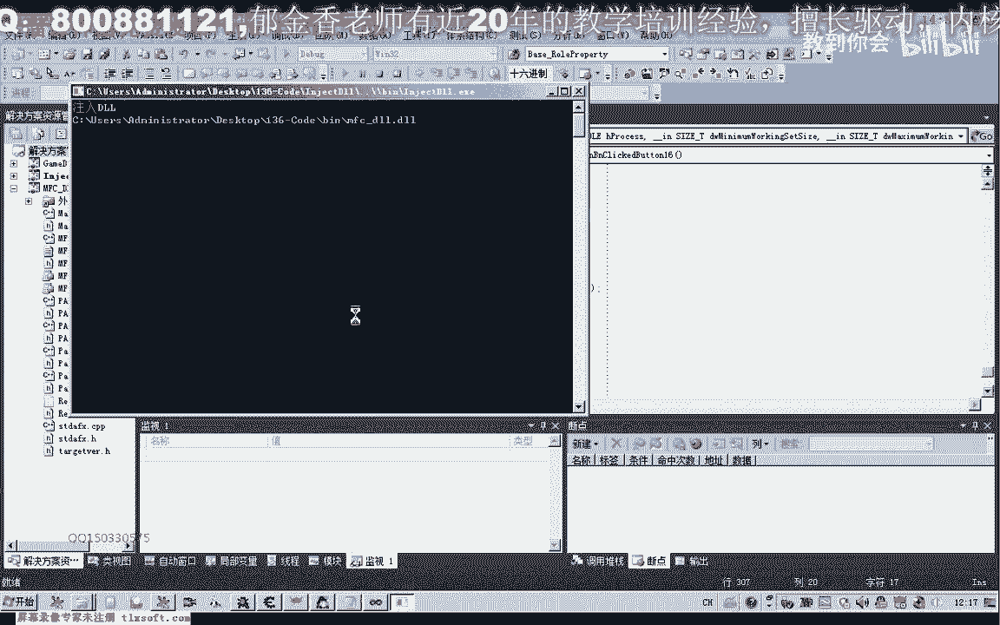

# 郁金香老师C／C++纯干货 - P125：136-自动生成黑屏优化基址BaseBlackScreen - 教到你会 - BV1DS4y1n7qF

大家好，我是俞錦相老師，上一期我們一起分析了怎麼來實現我們的黑屏優化的兩種方式，我們都進行了討論，一種是主線程的一個hook，一個是第三第九的動態鏈接庫的一個hook，那麼我們現在再來整理一下。

那麼第三第九的話，我們就是搜索特徵碼，特徵碼它一共有兩種方式，8B3090，那麼它實際上就是這兩條指令，我們在這裡再把它注釋一下，那麼如果是前面一種方式，它就是這幾條指令的一個機器，相當於是。

那麼第二種方式就是log，三個log來實現相應的一個hook，那麼但是要實現這些相應的hook的話，我們都需要先對它的一個機子來進行定位，那麼這一節我們就是要自動的生成這兩個機子。

那麼前面的一個機子的話，主要我們就是通過搜索特徵字，特徵字串，那麼我們在第56課的代碼，我們有講過，那麼我們再次打開第56課的代碼，那麼前面我們用到的機子的話，一共有21個機子，打開的文件打開錯了。

當時這個，機子定位的。

對了，我們還有一個機子定位的同一件，主要是在這裡面來實現的，那麼一件更新機子的，那麼之前的話，實際上我們已經有更新，第二，一共有21個機子，那麼這裡是第22個，那麼我們可以把它的代碼來進行一下複製。

修改就可以了，在它的基礎上，那麼我們把第21個機子複製一下，在這裡，那麼這裡來改為22，首先我們把特徵字串，這個字串複製進來，然後它的一個偏移，我們也給它加上，那麼這三行我們都可以加在這裡。

然後在這裡的話，我們只需要搜索一個就可以了，加上相應的一個處理，那麼這裡我們把它的特徵碼複製出來，放到特徵碼，搜索這裡，那麼另外下面這裡我們有一些改動，當然進程不需要改動，那麼這個地址我們需要改動。

那麼這裡我們取它前面的528，這三個數字，528，那麼這樣的話，我們是跟它搜索一個它的一個起始地址，搜索的，那麼搜索的範圍，我們在它的基礎上再加上1萬，那麼這樣的話，我們就能夠大大的節省搜索的時間。

不然的話它會搜索很慢，它整個進程都要搜索，它從400開始搜索的話就比較慢，因為距離它的距離比較遠，那麼我們以這種方式來搜索的話就比較快，就比較快，而且它的變動的話，如果你怕它變動的話。

這裡數字我們還可以設小一點，設成527都可以，這樣的話，它距離就比較近，距離比較近，那麼這裡設好了之後獲得這個機制，但是這個機制，我們它距離我們這裡還有一個15個字節的，一個的一個偏移。

那麼我們也需要把它讀取出來，那麼這個時候我們需要讀取機制加上，腰尾的偏移，那麼讀取完了之後，在這裡定義紅的時候，我們這個是主線程的，這個紅黑屏優化的，那麼我們在這裡需要改一下，那麼這裡是R2。

後面我們肯定這裡也要進行一個修改，黑屏優化，主線程，黑屏優化，機制，那麼在下面這一行，我們也需要同樣的進行修改，在上面這一行，我自己想，因為這裡它是顯示在屏幕的，那麼這裡修改之後的話。

那麼這下面它是寫到文件的，做了一些修改，那麼這裡，好的，那麼我們編譯生成一下，看一下它生成的地址是多少，對了，這裡還需要另外一個參數，它要需要寫到文件的詳益的指針，需要一個，好，那麼我們來看一下。

那麼現在生成的這個是多少，是8B2，這個明顯的是錯了，我們生成的地址，那麼正確的地址的話，應當是在這個位置，528110這個位置才是正確的，那麼我們看一下為什麼這裡它會出錯，再來檢測一下，那麼這裡的話。

首先它是一個掃描到的一個地址，那麼我們要看一下它這個地址是否正確，那麼如果這個地址準確的話，它在這裡再加上我們的要，出現成黑屏優化，那麼我們把它搜索到的地址，我們也打印出來看一下。

那麼我們看一下這個地址究竟是多少，對了，這裡我們不需要進行讀取，這裡我們多了一句，因為平時的我們這個機制的話，我們都需要了再加上一個讀取，那麼這裡我們應當是直接打印出來就行，這一行我們應該注釋掉。

這一點有一點不同的，實際上這裡我們就是直接打印了，搜索的地址，應該就考驗了，因為平時我們要讀取這個機制的話，是因為在這個位置它還需要讀取的，這種它還有一個括號，那麼我們才需要從這個地方開始我們的讀取。

比如說F5F930，這種我們才需要這種讀取方式，那麼我們再來檢測一下，這個時候應該就對了，528ECA，528ECA，對，它搜索到的地址，那麼我們應該加上，還要加上一個遙股，但是我們加上之後。

不需要把它讀取出來，那麼這裡我們需要做一個改動，那麼這裡我們不需要這個函數來讀，那麼我們直接加上就可以了，像這裡，直接加上偏移就可以了，那麼我們審閱讀取的這一步，528EDF，528EDF。

那麼這個時候地址定位就準確了，那麼然後我們就可以往這裡寫入3個90，就能夠實現我們真正的一個黑屏優化了，那麼這是第一個地址的一個定位，當然我們在這裡的話，還有另外的一個地址，我們也需要進行一個定位。

當然這個定位的話，我們就需要在我們的動態鏈接庫裡面，加入我們的代碼才可以，那麼這個的方式又有一些不一樣，因為它是動態生成的，實際上我們不需要生成這個機制，不需要生成這個機制。

那麼這裡我們可以了把它進行一個初始化，也就是在動態鏈接庫，這裡我們可以把它定義成一個全局變量的一個形式，那麼這個變量，那麼這個變量的話，我們在動態鏈接庫載入的時候，我們把它進行一個初始化，那麼好的。

我們把這裡另外打開一個，這裡我們的生成已經成功了，成功的時候，我們再來看一下，獲取一下它的一個機制，那麼這個時候，我們就能夠自動的出現成黑屏優化機制了，自動就可以出來，當然另外一個的話。

我們需要了打開134克的代碼，那麼因為這個地址，它不能夠在我們的，它不是固定的機制，所以說我們不能夠把它生成一個紅，我們需要動態的進行一個定位，那麼動態定位的話，我們就把它寫在測試1這裡。

那麼動態的定位的話，我們來看一下，看一下我們的資料，就是這一段，然後把它注釋掉，注釋掉之後，我們首先取得它的一個模塊的機制，再加上這個偏移，實際上就是這一句，那麼我們在這裡給它定義這樣的一個全局變量。

然後對它進行複製就可以，那麼全局變量，我們在一個地方把它進行一個初始化，就等於這一句，好的，然後我們獲得了它的一個機制之後，我們打印出調試信息，好，那麼我們在這裡也把它編譯生成一下，那麼看起來很簡單。

也就兩句代碼就完成了，關鍵是要明白它的一個原因，那麼在這裡，我們還需要對它強制的進行轉換一下，因為一個是Trivial，一個是Dword類型的，那麼實際上它本質的都是同一個類型。

那麼只是這裡邊它需要強制的進行轉換一下，對了，這裡它也需要，如果是這裡是-1的話，它也需要進行強制的轉換一下，Handle，這是上一期課，那麼本質上這兩句代碼也是一樣的，那麼我們打開調試信息的查看工具。

點一下測試。

那麼我們再來看一下，這裡可能沒有完全的編譯，重新再編譯一下，編譯生成一下，那麼這個時候我們可以把我們的OD退出來，因為這個時候地址是沒有變的，就是79F的要重新啟動遊戲之後才會有變化。

那麼這個時候我們可以把我們的Od退出來，因為這個時候地址是沒有變的，重新啟動遊戲之後才會有變化，那麼這個時候我們可以把我們的Od退出來，因為這個時候地址是沒有變的，重新啟動遊戲之後才會有變化。

那麼這個時候地址是沒有變的，重新啟動遊戲之後才會有變化，那麼這個時候地址是沒有變的，所以我們可以把Od退出來，那麼這個時候地址是沒有變的，那麼這個時候地址是沒有變的，所以我們可以把Od退出來。

那麼這個時候地址是沒有變的，好，那麼這個時候地址是沒有變的，所以我們可以把Od退出來，那麼這個時候地址是沒有變的，所以我們可以把Od退出來，那麼這個時候地址是沒有變的，所以我們可以把Od退出來。

那麼這個時候地址是沒有變的，所以我們可以把Od退出來，那麼這個時候地址是沒有變的，所以我們可以把Od退出來，所以我們可以把Od退出來，那麼這個時候地址是沒有變的，所以我們可以把Od退出來。

那麼這個時候地址是沒有變的，所以我們可以把Od退出來，那麼這個時候地址是沒有變的，所以我們可以把Od退出來，那麼這個時候地址是沒有變的，所以我們可以把Od退出來，那麼這個時候地址是沒有變的。

所以我們可以把Od退出來，那麼這個時候地址是沒有變的，所以我們可以把Od退出來，那麼這個時候地址是沒有變的，所以我們可以把Od退出來，那麼這個時候地址是沒有變的，所以我們可以把Od退出來。

那麼這個時候地址是沒有變的，所以我們可以把Od退出來，所以我們可以把Od退出來，那麼這個時候地址是沒有變的，所以我們可以把Od退出來，那麼這個時候地址是沒有變的，所以我們可以把Od退出來。

那麼這個時候地址是沒有變的，所以我們可以把Od退出來，那麼這個時候地址是沒有變的，所以我們可以把Od退出來，那麼這個時候地址是沒有變的，所以我們可以把Od退出來，那麼這個時候地址是沒有變的。

所以我們可以把Od退出來，那麼這個時候地址是沒有變的，所以我們可以把Od退出來，那麼這個時候地址是沒有變的，所以我們可以把Od退出來，那麼這個時候地址是沒有變的，所以我們可以把Od退出來。

那麼這個時候地址是沒有變的。

所以我們可以把Od退出來，那麼這個時候地址是沒有變的，所以我們可以把Od退出來，那麼這個時候地址是沒有變的，所以我們可以把Od退出來，那麼這個時候地址是沒有變的，所以我們可以把Od退出來。

那麼這個時候地址是沒有變的，所以我們可以把Od退出來，那麼這個時候地址是沒有變的，所以我們可以把Od退出來，那麼這個時候地址是沒有變的，所以我們可以把Od退出來，那麼這個時候地址是沒有變的。

所以我們可以把Od退出來，那麼這個時候地址是沒有變的，所以我們可以把Od退出來，那麼這個時候地址是沒有變的，所以我們可以把Od退出來，那麼這個時候地址是沒有變的，所以我們可以把Od退出來。

那麼這個時候地址是沒有變的，所以我們可以把Od退出來，那麼這個時候地址是沒有變的，所以我們可以把Od退出來，那麼這個時候地址是沒有變的，所以我們可以把Od退出來，那麼這個時候地址是沒有變的。

所以我們可以把Od退出來，那麼這個時候地址是沒有變的。

所以我們可以把Od退出來，那麼這個時候地址是沒有變的，所以我們可以把Od退出來。

那麼這個時候地址是沒有變的，所以我們可以把Od退出來，那麼這個時候地址是沒有變的，所以我們可以把Od退出來，那麼這個時候地址是沒有變的，所以我們可以把Od退出來，那麼這個時候地址是沒有變的。

所以我們可以把Od退出來，那麼這個時候地址是沒有變的，所以我們可以把Od退出來。

那麼這個時候地址是沒有變的，所以我們可以把Od退出來，那麼這個時候地址是沒有變的，所以我們可以把Od退出來，那麼這個時候地址是沒有變的，所以我們可以把Od退出來，那麼這個時候地址是沒有變的。

所以我們可以把Od退出來，(音樂)，(音樂)。

那麼可以看到，5F300就是它的機子，這裡它取得的，那麼如果它加載的機子變了，那麼這裡它會跟著變，那麼只要我們的偏移對了，它計算出來的地址，始終都會是對的，好，那麼這幾個我們暫時就討論到這裡。

那麼機子我們既然定位好了之後，那麼下一節我們就一起來看一下，怎麼來實現我們的hook，那麼實際上實現hook也比較簡單，就是往地址裏面寫入數據就行了，那麼大家自己下去先完成一下，那麼這裡就是自己寫代碼。

代碼完成兩種方式的APU化，取消這個優化，也就是一個hook，與我們的反hook，hook與hook，那麼也就是說我們要優化的話，那麼有時候我們不需要優化了，我們需要還原，那麼這兩個功能。

大家把它寫成函數，把它寫好，當然兩種方式的都把它寫一下，好的，那麼這幾個我們就講到這裡，那麼這裡我們就把它寫成，優化就這樣也可以，代碼我們把它複製出來，那麼我們就把它複製出來，那麼我們就把它複製出來。

那麼我們就把它複製出來，那麼我們就把它複製出來，那麼我們就把它複製出來，那麼我們就把它複製出來，那麼我們就把它複製出來，那麼我們就把它複製出來，那麼我們就把它複製出來，那麼我們就把它複製出來。

那麼我們就把它複製出來。

那麼我們就把它複製出來。

那麼我們就把它複製出來，那麼我們就把它複製出來，那麼我們就把它複製出來，那麼我們就把它複製出來，那麼我們就把它複製出來，那麼我們就把它複製出來，那麼我們就把它複製出來，那麼我們就把它複製出來。

那麼我們就把它複製出來，那麼我們就把它複製出來，(音樂)。

