# 郁金香老师C／C++纯干货 - P127：138-分析游戏气功对象数组及属性 - 教到你会 - BV1DS4y1n7qF

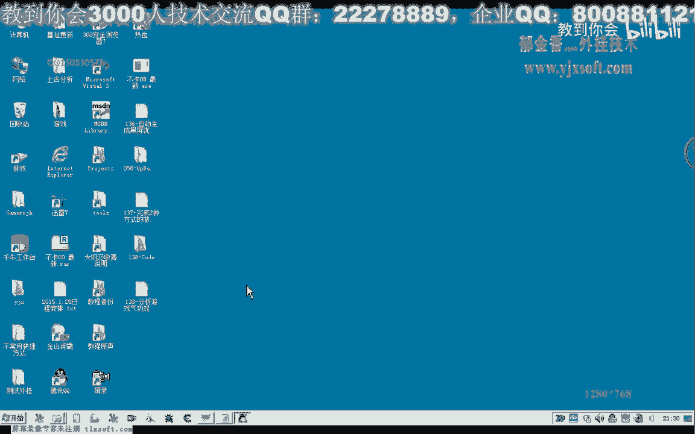

大家好，我是郁金香老师，那么这节课我们主要分析一下气功对象的数组，那么以及它的属性，那么在分析之前呢。

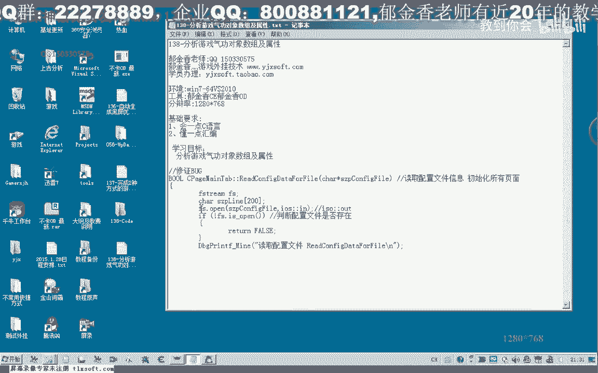

我们先把137课的代码里面的有一个bug改一下，这个先选中我们的内视图one table，然后这里read combo代替profile，那么这里添加一个判断文件是否存在的代码。

那么如果这个这个文件它已经成功的打开了，我们才继续的执行后面，那么如果没有成功的打开，那么我们就直接返回，如果没有再去判断的话，那么在后边的这个循环呢可能就会一直的执行啊。

那么造成了我们的这个窗口界面呢显示不出来啊，嗯会一直的循环好的。

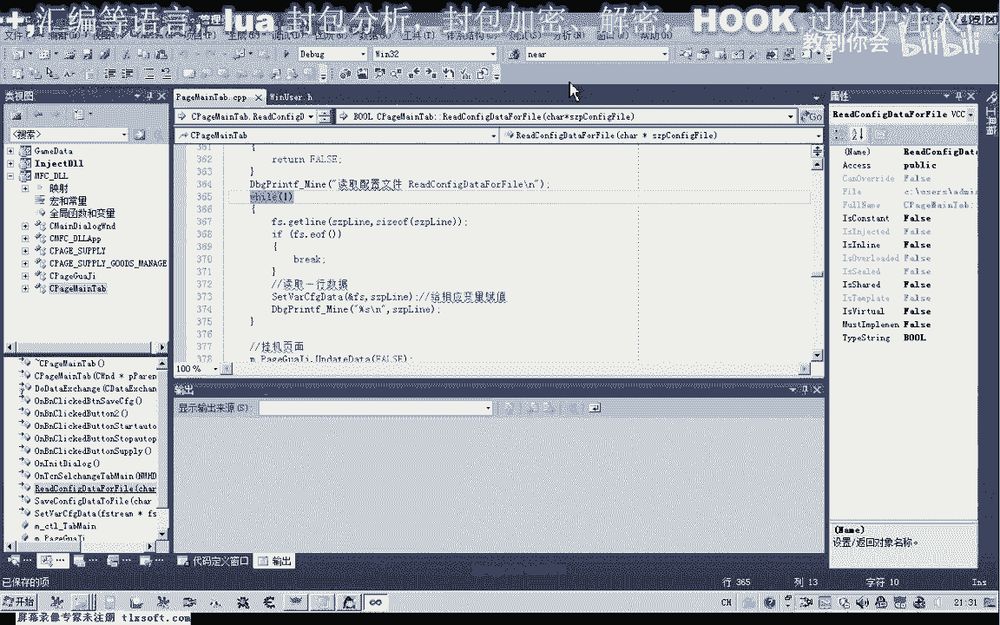

那么接下来呢我们开始分析我们的数据，那么打开我们的c e不加到游戏里面，那么附加到游戏里边之后，我们来看一下哈，在分析之前呢，最好所剩的气功的点数的话，最好是嗯多一点啊，方便我们我们分析。

那么一般来说呢我们的这个对象的这个这个点数的话，呃，在这个对象属性里面，可能它也会存在这样一个属性词，那么某一个气功它加了多少点，当然在最前面的课程里面呢，我们已经分析过呃。

有两个数组它都都是以字节类型的，用来存放到我们的这个气功的点数，但是气孔的这个对象呢我们还没有分析，那么今天呢我们以这个以花钱供嗯这个气功能为例，那么现在的点数呢是14点。

那么在这里呢我们选一次角搜一下14，然后我们再让它点出来，加一点收腰五呃，那么收两下之后呢，这个时候就出来了哈，它相应的这个数字就出来了呃，出来之后我们来看一下它的一个访问，那么前面这两个机子的话。

好像是我们之前分析的这个气功点数的数组，我们先来看一下它的内存区域，那么它的内存区域的话，我们这里呢一五是零，f表示移花接木，那么前面的这个年龄呢应当是幺五，这里有个ea，e a e c。

这个看不太出来啊，这个我们暂时做一个标记，这个可能不是数据，那么我们再来看一下这个数字，它的热情区域，那么这里是零五，一四来代表前面的这个狂风万破，它加了20点，这里0c表示这里的破天一剑。

加纳斯12点，这个零六表示的莲花灰灰飞舞啊，加了六点，这个是九点啊，这个幺四呢16星级的幺四代表29，那么这个是气功点数的输出，3333，那么我们再来看一下这个的类型区域，你们俩要，冥币呃。

这个的话看起来有点像是一个我们的对象，但是不知道是不是，那么我们先在这里呢加上一个访问啊，然后这个呢我们也加上一个访问，包括这个气功，气功的数组呢也加上一个访问，好，这下面的也加上一个访问。

然后呢我们再次，呃更改它的数值，那么首先我们来看一下气功数组2f这个，这个呢他没有访问，我们不管他，那么这里呢也是一个读取的访问，那么我们应该是要找写入的。

那么这里的话也应当是一个我们看查看一下反汇编嗯，也是一个赋值的一个语句啊，然后下边呢有一个呃数据的一个移动啊，sd啊，数据块的一个移动，从1i i来移到我们的d i d点，那这个2806。

机库呢它移动了015啊，一共呢也就是0~15了，一共有这里一共有16 16个单元，那数据的一个移动，我们看一下这个18118，看一眼看一下这个8118是什么，8118好像是这个。

那这些的话都不像是我们的对象啊，那么可能的话我们是搜错了，那么说错了的话也有几种情况，也有可能我们是收的时候呢不小心哈漏掉了某些数据，那么还有另外一种情况呢，可能就是连他的对象的话也是随机的呃生成的。

那么我们在这里单击了某一项数据之后呢，它的这个对象呢可能是重新生成的，那么这样的话它来达到一个保护数据的一个物体，也可能是啊，那么我们先尝试一下，搜一下变换的一个数字，那么我们再重新搜一下，收未知的啊。

首先呢我们修一下四字节，然后呢我们说一下啊，v变动的数值，那这样说的话比较多，那么然后呢我们点一下这个移花接木，然后我们搜一下变动的数值，然后呢再反复的时候未变动的数值，这里我们说错了，我们当时。

我们应当是收四字节才对，这个地方，那么再重新搜一下公共支出是，然后呢在这里点击之后呢，我们搜一下变动的数值，然后再使用微微变动的数值，而且这个数字的话我们看一下呃，如果是对象的话。

它是一个地址肯定是大于一八，那么如果呢是我们表示的点数呢，它也应当要大于一七，那么这里呢我们搜一下比一五大的这个数值啊，或者是比17~17大的这个数值，好然后呢我们再改动一下它呃。

这个时候呢搜一下变动的数字还是比较多一点，然后说一下未变动的数值，那么我们再走动几步啊，这个时候呢再来说下未变动的数值，啊然后呢我们再最后一次啊加一下这个对象，20搜一下电动的数字。

然后呢再设未变动的数值，但是这个数量也太庞大了哈，那么这种方法的话可能也不可取呃，不可取的话，我们可以来呃换一种思路啊，呃搜一下我们发包的时候啊，因为我们在，我们在点这个加点的这个气功的这个扩的时候呢。

嗯加点的时候应当它有一个数据向我们的服务器发送，那么在发送之前呢，他肯定也应当也要访问这个对象，因为他要从这个对象里面去取一些数字来表示啊，是呃对某一个气功进行了加点，那么也就是说这个对象的话。

它里边应该有一个身份的一个标识的一个i d，那么我们可以尝试从这个id呢来进行入手，那么如果这样我们是搜不到的话，那么我们关掉啊，关掉我们的c，那么从这种情况我们看来好像是搜不到的嗯。

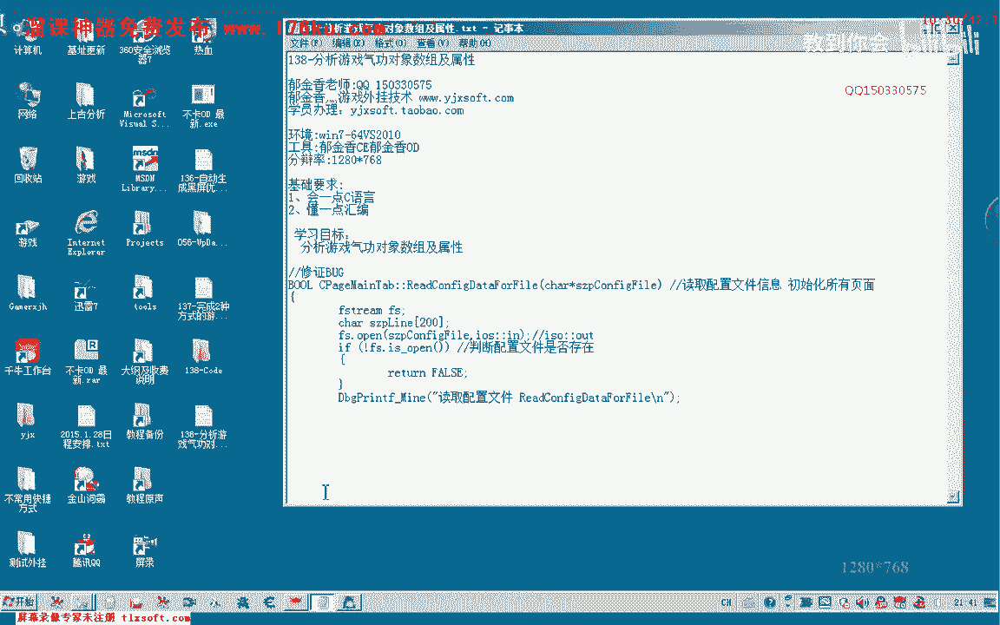

搜不到的话，我们用g来来附加，当然这个时候我们的游戏的点数呢，嗯气功的点数也用完了，我们需要另外换一个角色对象，另外换了一个对象之后呢，我们附加到游戏里边，然后我们移到我们的发包的函数上面，移动两次啊。

这个时候移动到这里之后呢，我们在上面下一个断点，然后进入到游戏找一个地方来进行加点，当然这个时候我还没有断线的时，候，还没有加点的时候，它就断线了，肯定不是的，那么我们点一下的时候啊，断下呃。

倒下之后呢，因为我们剩余的点数有限啊，那么我们把它的这个soc这个数字呢给它治理，那么发送这个包的话就不会成功，那么也就是说加点呢不会成功，那么这个时候呢我们返回集成找到他呃，加点的这个地方一层。

这里是发包的啊，然后呢再次返回，那么这个就应该是一个比较关键的位置嘛，嗯也就是我们发包数据的一个来源，那么在上层的话一般就是我们的这个相应的嗯加气功的这个扩了啊，可能就是那么我们再次返回一下。

那么这个地方的话可能就比较关键了，这个地方那么我们在这个地方呢下断，那么下段之后呢，因为他发包的话是从这个地方发出去的，那么这个参数的话，前面呢有一个谱写，它应当只有一个啊，return 04啊。

只有一个参数，那么只有一个参数的话，这里呢我们直接的a d d p s p让dsp的是来加四，或者把这个谱系啊铺起来，弄不掉，这整个几句呢low不掉，那么我们就不会调用这个功能了啊。

达到了我们的一个占地址的堆栈地址的一个平衡，好的，那么我们再次来看一下呃，比如说这个地方我们加点的时候看一下它的参数，那么我们顺便就分析了这个空，嗯1d i的数值是12d啊，不是我们所想象的啊。

一那么如果是一般情况下的话，我们数出来它的数数据应当是一啊才对，嗯，那么我们看一下它有没有区别啊，另外我们第二个哈下标应当是1012啊，这个地方应该是一，但这个时候呢他从12d来变成了121啊。

它在原有的基础上加了一，它也有一定的规律，那么我们再来这个是下标的是第四啊，第四的一个那么130啊，那么它都是从之前的这个d e f，然后三零这样加起来的，那么所以说它还是有一定的规律呃。

那么我们来看一下它的一si是一个什么数值，那么1s2 等于零一啊，那看来的话它应当是一个对象，那么我们看一下这个对象，它有没有名字，那么是不是我们想要的，这个对象的话看看来的话。

它也不是我们的这个气功的对象，嗯，那么我是气功对象呢，我们转到这个库里边去看一下呃，因为在发发包之前的话，距离发包点比较近的地方啊，在这个地方的话，我想的话应当他是要访问呃这个这个技能的这个对象的啊。

气功的这个对象，那么我们再来看一下它ec x的一个数据的一个来源，280c，280c往前面看一下，那么这里有个2806，dx那么这里的话看起来呢它像是一个数组，那么410的话，我们之前的呃。

这个数组的话一般都是从410开始的，然后呢他把它放到e4 x等于1x1 x x加四嗯，这里边进行了一个处理，相当于然后这里的ax的取出来，写到这个二七ca这边，那么二七ci的话。

实际上它就是这个2804里面的一部分啊，因为这个负数的话，我们都知道它的这个绝对值越大的话，它反而是越小这个地址，那么这个地址呢是在他后边的啊，这两个地址都是在在他后边的，那么在这里呢他取了一些数据。

那么极有可能的话，因为我们的数组的话，4105我们都知道呃，从这个游戏的一个分析来说的话，这个410呢它就是象征着我们象征着背包的这些数据啊，或者是f一到f 10这一类的，那么都是这种数组嗯。

那么我们在这个地方下段看它会不会断下来，当然我们也把这个地方呢也进行know u d d e s p假发啊，让他发送啊，失败也就是我们才有这个剩余的点数供我们做一个测试啊，这个时候来断一下，断一下呢。

我们看一下取出来取出来的ec x是不是我们的这个气功对象，那么这个时候来是d，那么按照我们之前的背包里面的对象以及技能对象啊这一类的，它的名字的话应当是在5c这个位置。

那么我们看这个地方的不是没有名字这一类的，那么这个时候呢呃5c这个位置呢它是一个正骨正骨绝技，那么这个的话恰好了，也就是我们的刚才选中的这个气功对象啊，那么如果我们在连环飞飞虎这里来的下段。

我们再来看一下执行到这一行莲花啊，这个时候呢我们看到它所取出的对象呢就是这个连环飞，嗯，然后呢我们看一下最后他在这个ax是什么，x等于c c的话是一二，返回只是幺二法这个地方，嗯，那我们再看一下啊。

另外的情况啊，如果是这个摄魂一击，他执行完了之后是什么，也是b这个是幺幺，那么如果是这个的话，就应该是a b c d e啊，这个应该是一，它也是一个序列，a b c d这个时候是幺三啊，这个有点奇怪。

幺三的话，都是一个不同的一个数字啊，按照这个时候我们再来看一下ex啊，稳固态三，那我们看一下里边它有没有一个属性等于一三的，那么是他是这个地方呢，等于一三，5c，那么这是它的起始地址，一三这个属性的话。

在4c这个地方呃，那么4c这个地方的话，我们呃记得了他之前的话呃，4c还有八这两个位置的话，那好像是我们的这个物品的分类编号i d，然后也就是说它发送到这个地方的话，可能就是我们的呃气功id。

啊松动标识，身份的一个标记啊，不同的，那么这个可能不是我们的下标啊，它是一个标记，这一类是在这个地方，那么如果我们要修炼的话，要修炼气功的话，就可以在这里发包哈，然后呢填充它相应的这个数据吧。

可能嗯也是可以修炼这个气功的嗯那么另外一种方方方法的话，就是找他的这个上层的这个库来调用，那么我们还是先把这个数组啊分析清楚啊，其他的我们先不分析，就在这个地方，我们再次下下个断点看一下。

看一下dx的一个来源，那么tx的来源呢弹离他比较近，那么又来来源于另外的一个公式，这个地方，那么我们再一次呢嗯这个是好像看一下，这个时候还没有读取出来，我们看一下e d i的数字呢啊是等于零。

那么e d i等于零，那么这里呢又像是一个数组呃，这是一个数组里边呢它再次向了一个数组，那么这个为零的话，这个我们就可以相应的可以省略，那么我们再多做一下测试呃，另外看一下这个地方它是否文明。

e d i也是为零的，那么我们看前面这个呢e d r还是没有变化，那么我们暂时来可以认为呢，呃它的偏移来源的话就是这样的一个公式替换进来，1b x加上5x368 加上4x0啊。

也就是4x0呢暂时可以忽略哈，这是我们提示啊，提示自己呢它这里呢可能是另外的一个数据，那么后边呢这个e d x呢用来加上410，再来加上一个四乘以我们的相应的一个下标，然后呢是一个对象。

那么这前面的话应当是一个对象的一个数据，我们来看一下是不是这样啊，当然e bx的值呢我们需要给它取出来，看一下e bx 1 b x的值是多少啊，是这个数值，那么我们先把它复制出来。

把ebx使得数数值呢带进去，那么我们可以看到一共有八个对象，那么这个八个对象的话，我们用dc来看一下，那么其中的一项属性呢，我们已经知道了是5c。

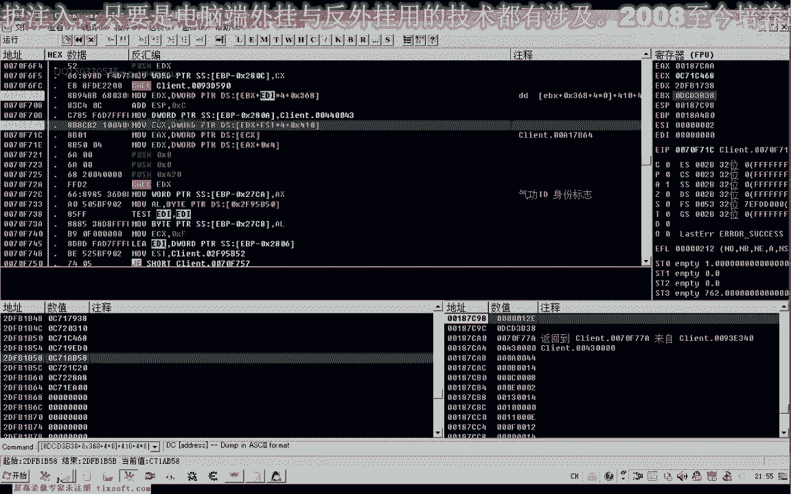

那么第一个呢是力劈华山，那么第二个呢是摄魂逆期，第三个连环飞舞飞舞，第四个是狂风万破啊，稳如泰山，那么知名度的话，这个呢就是我们所要找的嗯，这个数组它的属性呢加五色。

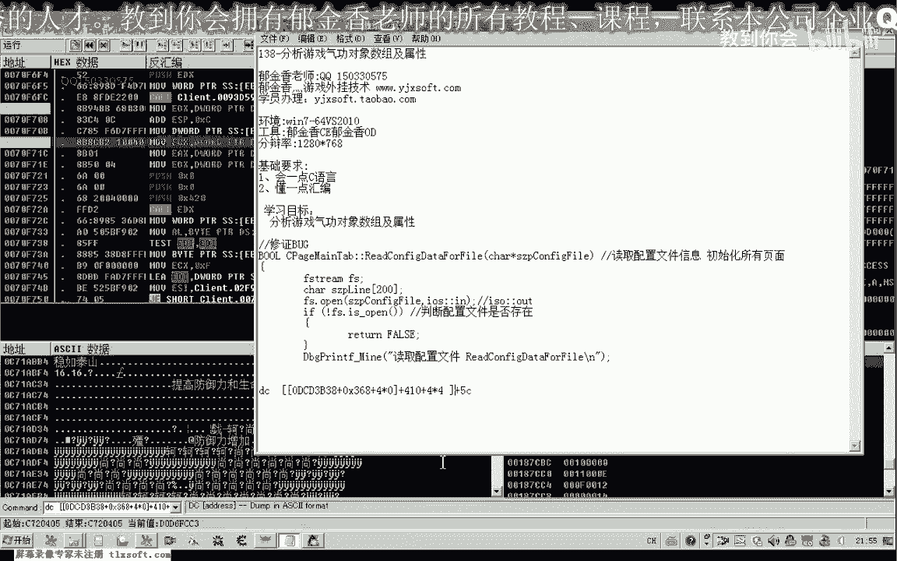

这里呢是名字，其功也不错，那么加上我们的还有一个地方好像是18还是多少，刚才我们看到有一个一三的这个标识id，40啊应该是4c这个地方。

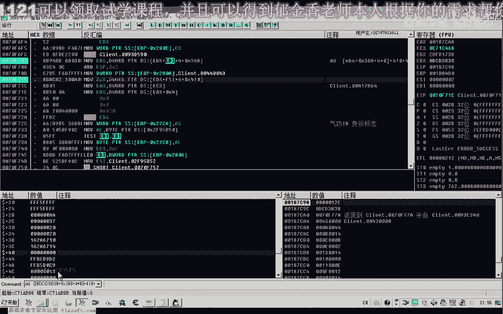

那么是在这个地方的话，可能是他的一个，id身份的一个标识，那么我们有了这个i d的一个标识呢，我们才知道他是跟某一项气功啊进行了加减，进行了对某一个对象来进行了一个操作啊。

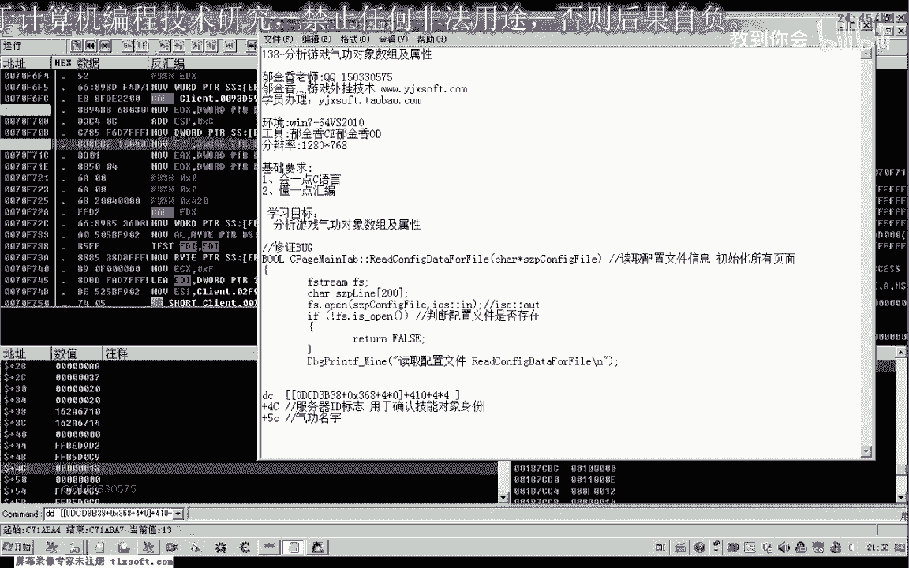

像我们的人的身份证一样，那么而且它的每一个id的话肯定肯定都是一样的啊，比如说我们第三个他的家四线这个地方，我们来看一下啊，这个地方它的标志呢也不是一样的，再看一下第一个地方是谁，第一和第三，b1 。

那么我们再看一下那么难听，加上是在这个地方，那么零呢这里是a b啊，前面的编号是a做的好的，那么我们继续来找一下这个bx它机子的一个来源，那么这个e p x的话，我们就可以直接借用这个c一工具搜一下。

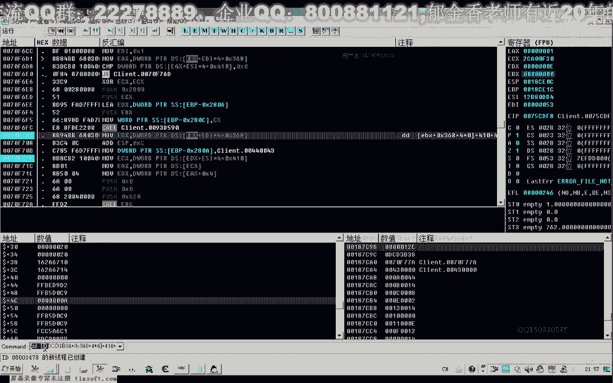

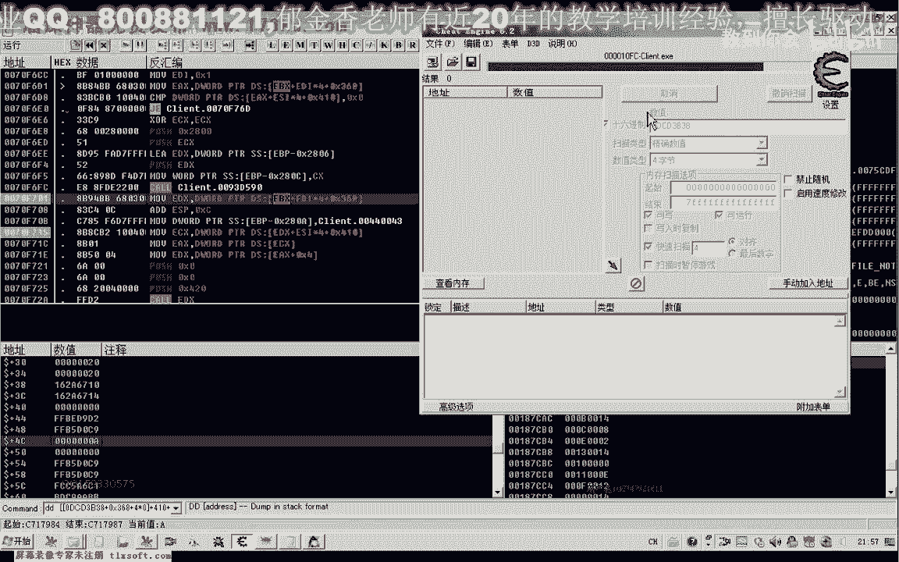

那么最后呢只有这一个地方，这个地方我们看一下它是否是一个机子，三一多少多少，那么我们搜索一下这里边，那么既然我们搜索不到的话，可能呢这个e bx的话嗯，它就不是一个机制。

那么我们看一下还有没有其他的机子，那么其他的话这里呢呃暂时还没有发现其他的这个机制在这里呢，我们先下一个断点访问一下吧，那么这里的话我们看一下它是三一db c8 。

然后e x那么ex呢是我们所有对象数组的这个下标，这个值的话，b c8 的话应当是我们所有对象数组，那么所以说这个的话应当不是的，那么这个呢我们先排除掉啊，我们直接从我们刚才的位置往前找一下。

看能不能够找到其他的机子，这是我们的1b x，我们往前面找一下，找一下ebx的来源，从这里来看的话，它的来源是e4 x，那么上一层的我们再到上一层找一下他的e x来，来源于e s i。

所以它也是来源于我们上一层的e4 x，但是这个e4 x的话它就怎么了，就断下的地方就比较多啊，可能是找不到的，你再回过头来看一下它，那么我们先把我们的这个特征码先把它抓取出来，按减号退回来。

嗯在我们现在是找到了这个地方。

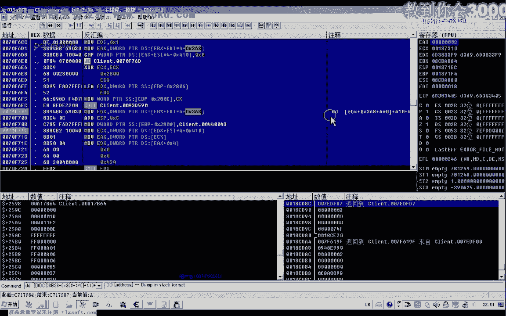

只有。

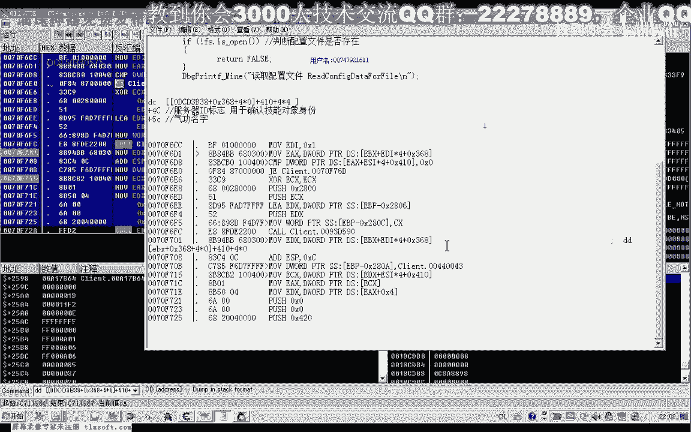

好的，那么我们把所有的断点呢先取消掉啊。

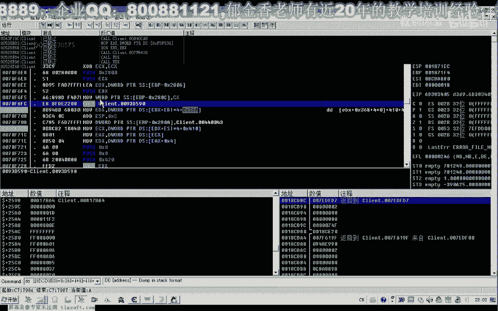

禁止先取消掉，退出来，我们再借助我们的c a e来找一下，看能不能够找到数组的这个机制，那么如果找不到它的机制的话，我们可以通过他对象的一个属性呢来进行一个相应的一个判断。

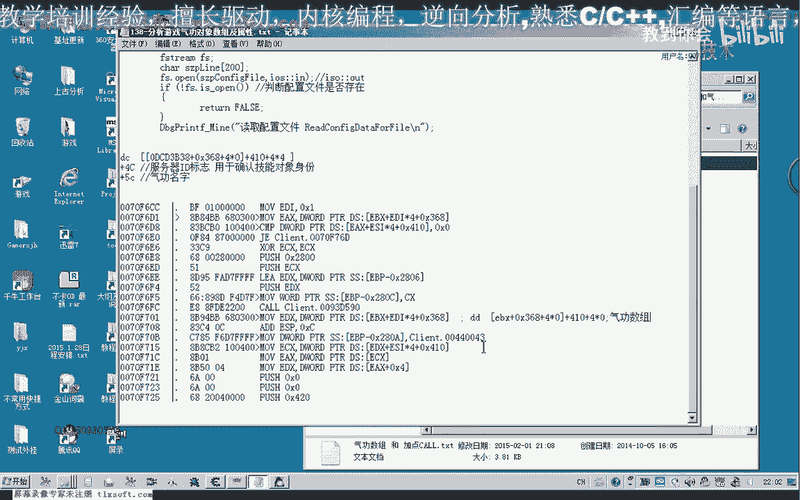

那么这个是堆栈里面的，我们先关掉啊，然后第一个地址呢我们先访问一下，这一共有100多个啊，这个比较多啊，应该说这个能够找还是能够找到的呃，使用的地方越多的话。

证明它的这个它一般都会听一个指针来保存相应的这个数据，那么没有的呢，我们先删掉，那我们主要是看一下这里面的对象有什么地方，他会反问他，这个对象的话可能应当来说的话，它还是有它的指针，那这种的话太多了啊。

很难找到啊，那么我想的话刚才的这个地方呢，它可能也是在我们所有对象数组里面去把这个对象来取出来的，那么我们可以多返回几层再再试一下啊，因为这个数量太多了，用我们的o d或指c来找的话都不是很方便。

那么再转到我们刚才的地址呃，我们下一个断点让他多回溯几次，多立项几次啊，这个地方，那么我们主要是找一下e bx啊，d c d啊，这个数这个数据，然后我们返回到上一层，来源于我们的e si，这个时候。

那么再上一层，我们再看一下嗯，这个时候的ei，我们再来看一下这个时候堆栈还有没有这个数据的存在，那么如果是来源于这个地方的话，我们在这里来给它下一个条件的一个断点，把这个数据啊复制出来。

在这个地方呢我们下下一个条件断点，我们让他断一下，好那么这个时候呢e4 x呢它断下了呃，我们再返回两层来找一下它的一个e c x的一个来源，这个时候呢但是呢又找到我们的这个e si加四里面去了。

从这里来看的话，我们再来看一下vs 2段，e s i d e4 ，那么像这种呢我建议的话啊，是就直接用这个对象属性来判断，因为它在所有对象数组的这个列表里边啊，我们直接搜索它也是很方便的。

这样去找机子的话呃，可能也找得到啊，但是能够找得到的机会啊非常的小，那么我们再继续找两层看试一下js i我们看一下来源于什么地方，又是来源于我们上一层的ex。

那么这里呢我们也需要再次的下段对这个ex进行一个条件的一个断点，那么呢它又来源于我们上一层的参数，一bp加八，那么也就是我们上一层的第一个参数应当是，这个地方就比较多了啊。

那么我们需要在这里来下一个断点，断点就是e p p加八等于这个数值，那么这个时候的话它也会不断的断向呃，我们看一下e c x的数值，148啊，e p p啊，应该是这个地方的数值上一个扩大。

这个参数我们返回去再看一下它的一个来源来源于我们的ex，而ex来来源于我们的ei，而e s i呢，我们又跳到这个所有对象数组这里来，那，么所以说最终的结果呢。

我们还是要通过这个所有对象数组来进行骗离我们的嗯，这个相应的对象，那么我们直接是访问不到的，好的，那么这节课呢我们下一节课呢再编写一个相应的函数来分析，来获取这个相应的数组的一个机制，动态的来获取。

那么它肯定也有一些特征在这里，那么至少它加上410，这个地方的话，就是我们的一片这个数据啊，加上我们的410，那么这一票出去的话又是什么，加上410，很长的一片数据哈。

这里我们之前的话应该是加上的是368。

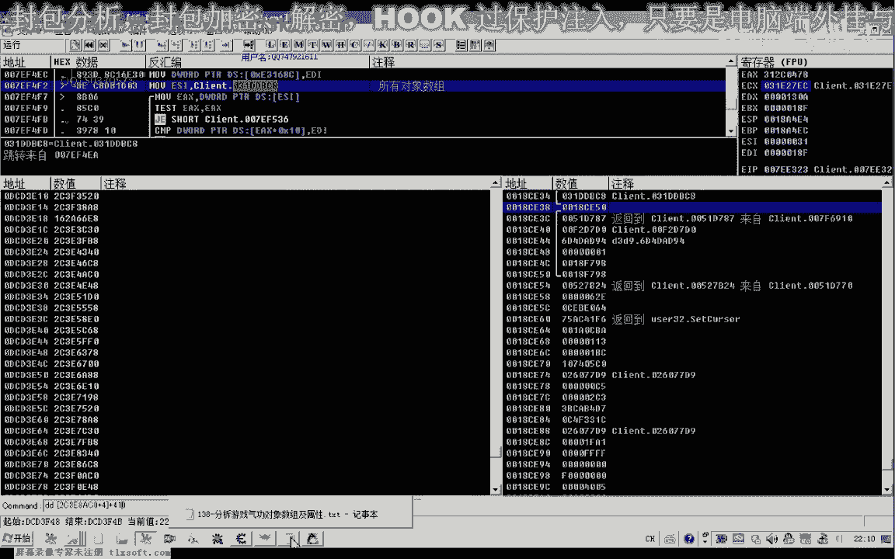

再来看一下我们的公司，加368，那么这里呢他也也也有一个数组。

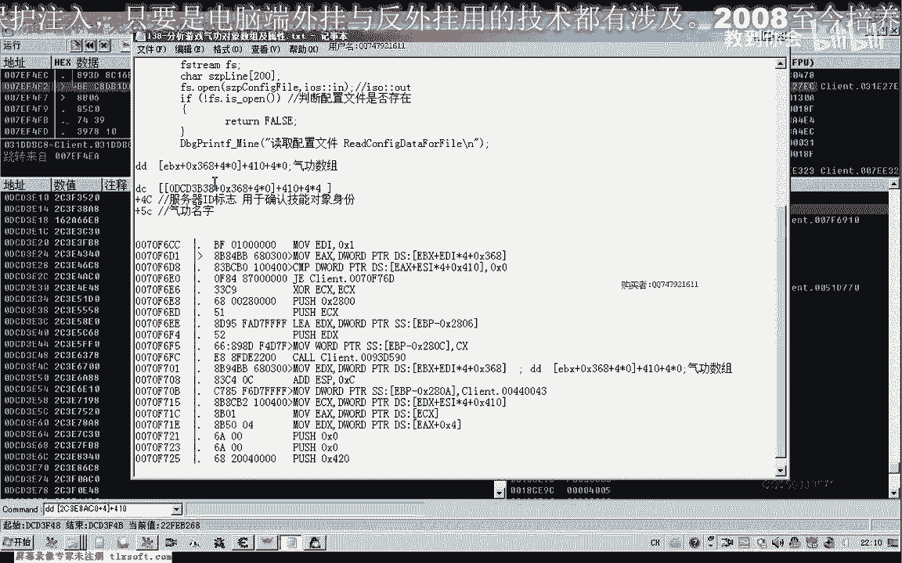

这里我们应当是加368，那你加368，他在后面的话也有很长很长的一串数组，如果我们所要的可能是这两个，加上再加上一个410好，这里呢才是我们相应的气功的对象啊，这个数出来非常的立体划算。

这个数字呢非常的复杂，在这里呢我们可以加上四神一来看一下，还能加上我们的c，啧啧啧，那么这里的话我们可以看到应当是没有任何的数值，那么只有来这里的话是谁赢才有，20，二，那么4x2这个地方究竟是什么。

我们再来看一下，嗯，嗯，对象编号来，这里是1212，加上我们的c1 d看一下，那么这片呢可能是一个空指针啊，没有这个对象存在，那么这里呢也没有对象的存在，啊，那么只有这个第一个对象呢。

它有这个相应的数据，那么这样来看的话，它可能就是这后边这一片它预留的一些呃这个空间或数组，那么这里有16个啊，这里有16个备用的啊，或者说这些基本动作了，也可能是在里边的。

那么我们再退回来看一下它的这个所谓的机子对象，它有一些什么属性。

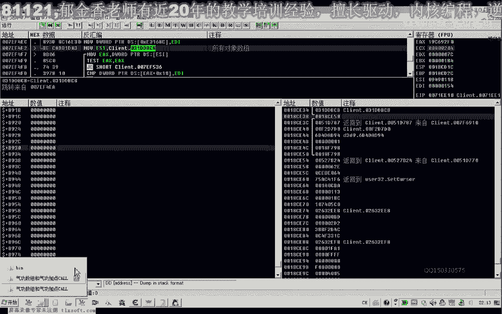

那么它的类型呢首先呢是为e0 e，那么这是它的一个类型，但是不知道他这里在后边的这些数字会不会变化，但是在后面的数值的话，实际上它都是一个大片的零，我们可以看到。

那么实际上呢我们可以就通过它的368这个地方呢来判断，这个地方它是存放着我们的这个技能对象，我们可以这样来判断，那么呢我们就返回这个地址啊，也可以这样判断，因为这里的这个对象的话。

它的对象属性呢是1d啊，我们可以看到这里的，那么它加上5c这个地方，就是这个气功的名字，好的，关于这个机子的获取呢，我们下一节课呢再设计相应的函数怎么获取，当然这个也作为一个助力哈，也对大小，坐垫啊。

这是过来适合数据，谢谢好。

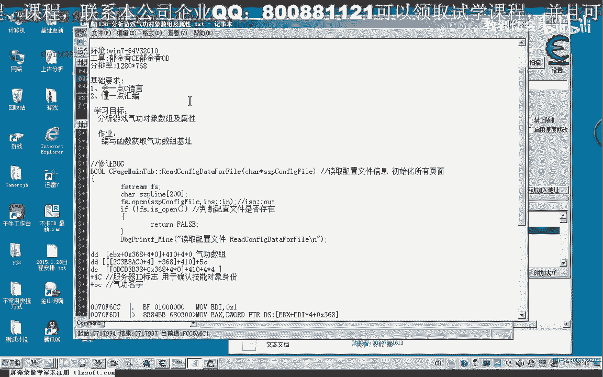