# P128：139-动态定位搞定找不到的气功数组基址 - 教到你会 - BV1DS4y1n7qF

大家好。

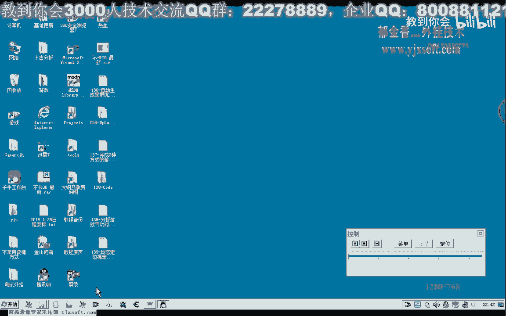

我是俞興翔老師，上一期課我們在分析氣功，宿主的時候，我們沒有找到它的機制，這期課我們再次用OT。

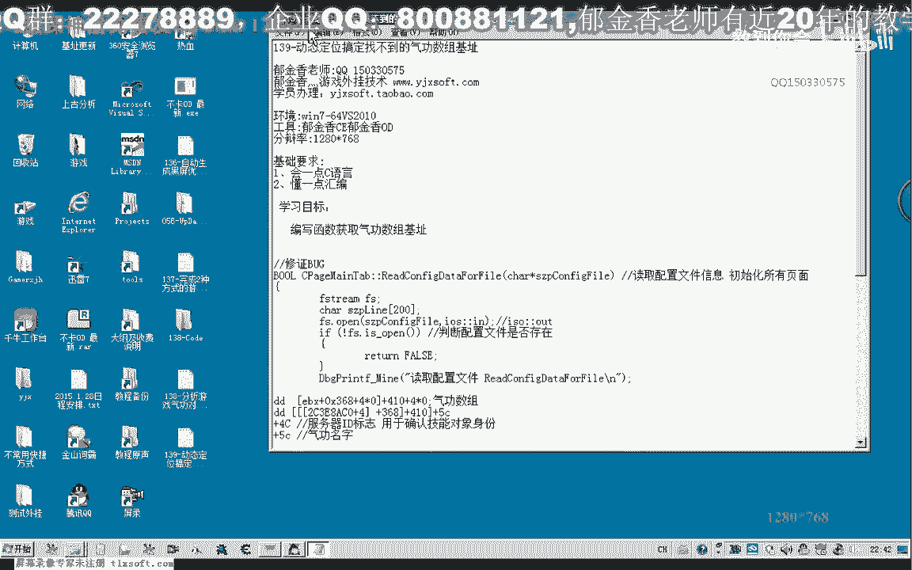

附加再找一下，如果是找不到的話。

我們就編寫函數來動態的進行定位，那麼先轉到我們之前分析的地址。

在這裡如果我們是選擇動態定位的話。

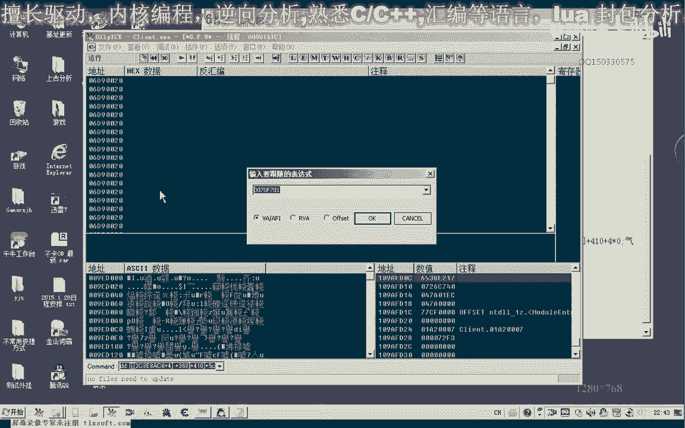

我們可以定位EDX，也可以定位EBX這個對象，或者是定位我們之前的+4的，這個對象都是可以的，到時候我們再來選擇一下，看定看片面是某一個對象，方便一些，那麼我們再次來找一下它的機制。

那麼既然我們之前的EBX機制找不到，那麼我們可以嘗試一下找一下EDX，這個對象，看還有沒有其他地方，有保存相應的機制，那麼同樣的我們把這個地方把它弄掉，這裡應該是8，前面有兩個參數，那麼好的。

我們來看一下，現在EDX的一個數字是多少，複製下來，然後我們用CAE來搜一下這個對象，那麼既然前面的找不到，我們看這個對象能否找到，那麼這個對象的話，它也是在31DE，這個對象也是在31DEEF8。

那麼這個的話可能也是我們所有對象，訴求裏面的一個數字，我們按訪問之後可以看到，在這裡的話，它也是311DDBZ8，然後EX的018Z這個地方，斷下來的，那麼所以說這個地方的話也不是我們。

所要找的相應的數據，那麼我們剩下的辦法就只有在這裡，來看一下它的屬性，我們從最近的開找，那麼EF開始找的話，那麼理論上的話，可以來省一些時間，因為它離我們的對象應當是最近的，那麼如果這個地方找到了。

我們只需要加上一個410就可以了，這個是運氣療傷，加上C，我們看一下，運氣療傷，對的，那麼這裡我們有兩種方法，都可以用來搜索到這個對象，那麼一個是我們直接把這個對象讀出來，再加上410，再加上4神隱屏。

用來判斷它的第一個對象，那麼判斷第一個對象，因為它的也有一個對應的一個類別，那麼+8這個位置等於1D，如果這個地方它等於1D，然後在它之前的對象+8這個位置，我們看它是多少，那麼這個對象我們是記一下。

氣功對象是1D+08這個位置，那麼1D是我們的一個搜索條件，這個是我們的條件之一，那麼在之前的我們在這裡備註一下，我們搜410這個，那麼這個對象等於1D，那麼我們再來看Base這個地方。

那麼它等於1F這個地方，那麼這就是我們的條件二，那麼這個這就是我們的條件一，那麼這個地方它+8，等於0X1F，那麼這是一個條件一，那麼我們看一下還有沒有其他的條件，再來看一下+8這個位置。

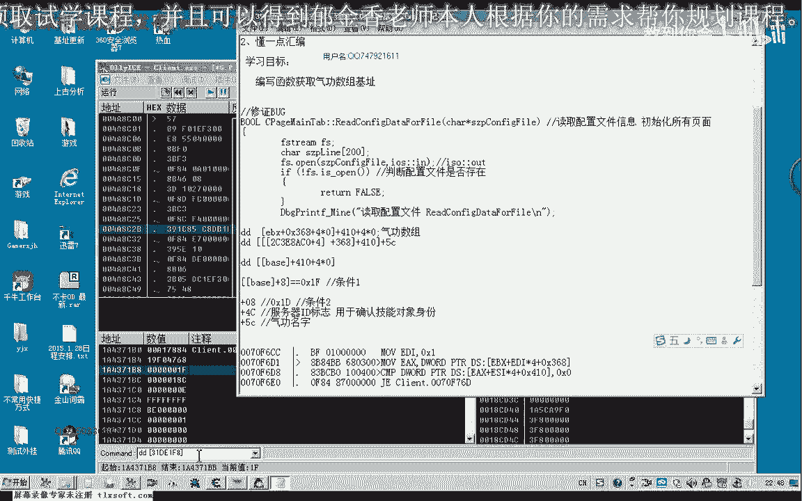

那麼我們看一下這個數字它會不會變，這頭兩個數字會不會變，或者這裡的數字它會不會有一些特別的一個數字，那麼比如說這兩個數字，這裡有一個1，但是這些數字的話，這個看起來像是一個地址，它就有一些特殊性。

可能也是動態的，那麼我們能夠利用起來的也就是這個地方，那麼這個地方它一般是一個，但是這個地方的話，遊戲更新之後，它也應當會變化，因為它是對象的成員函數，那麼唯一不變的。

我們就這個地方也是地址+4這個地方，那麼所以說這個地方的話，應當來說與我們之前的ESI的類型的話，它也是類似的，EF，那麼我們還是從後面的對象裏面來找答案，+410這個地方。

我們看一下它的裏面有哪一些比較特殊的屬性，加上我們的410，那麼這個它有沒有下標這一種，我們看一下，1那麼這裡的1它有一個1，那麼我們再來看一下2這個地方，的1它也是1，這是1D這個是-1。

那麼這幾個字應當都是固定的，我們把它複製一下，當然如果是加上它的成員函數的列表的話，我們應當就能夠搜索得到特征了，那麼我們再來看一下3這個地方，那麼也是1D，當然這個是它的一個下標，0EFF1。

那麼這一片都是相同的一個判斷，當然如果我們是加上這個列表的話，肯定是能夠收到的，我相信，它是一個相當於是一個機制，應當來說，或者通過它的對象的一個成員函數的一個地址來進行判斷，那麼比如說這個地址。

那麼這個它比較有利一些，那麼但是我們在這裏也需要定義，判斷起來就比較複雜，我們也需要把它的機制的話，也要動態的生成一個紅，然後每次對它加4這個地方，對象的加4這個地方再進行判斷。

那麼我們先看一下簡單的設計能不能夠參，再來看一下，這是3，那麼我們找一下它有沒有下標這一類的，這裏有一個A8是3，那麼我們加上4再加上A8來看一下，那麼4的話，這裏它的下標也是3，那麼，(畫面出現)。

理論上它還有一個，還有一個樹竹的下標的一個屬性，可能我想的話，這裡我們在裏面找一下數字4，那麼我們從這個地址用CE來搜一下，也很有數字4，下標這一類的，我們也可以做成是一個判斷，那麼新掃描。

然後搜一下數字4，然後它的其實地址是2310D620，2311離的太遠了，那麼我們再搜一下數字5，數字5沒有，那麼說明的話，下標的話，它不存在，但是不存在下標，它直接就是我們樹竹，下標就在這後面。

這樣計算出來，那麼我們先編寫函數，進行一下判斷，這個BASE，那麼打開我們138克的代碼，那麼我們移到測試的頁面。

然後開始設計我們的代碼，取測試1這裡，那麼在設計代碼的時候，我們需要對所有對象的列表來進行遍離，我們先把它的機子取出來，然後這裡我們需要的一個循環，我們看一下，它的對象的話，會有多大。

因為遍離到它的地方比較多，馬上就會斷下來，先把斷點刪掉，這整個樹竹的話，我們看一共應該有多大，那麼這裡的話，它應該是2710取出的下標，最大下標的話應該是2710，那麼我們在這裡也是2710。

當然也可以把它設置成一個文物，也就是說最大的數字，當然這裡我們暫時可以固化作用，或者說也設置一個文物，在這裡definesize for object list x2710。

然後在這裡define size for object list x2710，當然在這裡我們也加上一個異常的處理，可能是訪問錯了的話，我們就進行一下處理，異常處理的話，我們應該把它放在循環的裡邊。

那麼如果一旦有異常的話，我們繼續執行下一次循環，那麼在這裡我們遍離我們的對象，那麼先把我們的對象取出來，在前面我們需要建立一個NDRoboTank，我們先把它複製為0，然後我們在這裡來先取出對象。

那麼NDRoboTank，那麼複製為我們的白石，它的機子再加上一個神隱I，那麼這是我們對象的一個地址取出來，那麼取出來之後，我們就要接下來就是判斷，判斷是否是我們要找的對象，那麼樹主對象機子的話。

它有一個明顯的一個屬性，+8在這個地方等於EF，那麼所以說我們要先取出對象的類型，那麼type這個地方自然就等於8，把這個地方執行，那麼後邊的話，這裡我們最好這裡是把它設置成一個指針的形式。

那麼指針指向這裡，那麼這裡我們再強制的轉換一下，注意這裡一定要加上括號，不然就成了一個指針的運算了，後邊得出來的數據就不對，那麼在這裡我們再取出它+8的這個位置，+8這個位置，這裡恰好等於2。

+1是等於4，0、4、8，這個地方我們就取出我們的類型，取出+8位置對象類型，那麼取出來之後，我們就進行一個判斷，好，那麼如果0xef這個條件達成了之後，再判斷條件2，那麼條件2的話。

我們也是去+8這個地方，取對象的+8這個地方，它等於了1D，但是這個條件2的話，它需要有一個公式，那麼在前面的機子，+410再+4，實際上就是+410這個地方，再讀取這個對象。

那麼我們先把另外一個對象先取出來，那麼先取出對象1，對象1的第一個元素，那麼也就是我們把公式貼出來，也就是取得這個元素把它取出來，那麼也就是把這個地址實際上計算出來，那麼計算出來之後。

等會我們再讀取它裏面的+8的位置，那麼要取這個數據的話，我們這裏需要把我們的0。0。0。0。0這個地址，那麼這裏我們需要先轉換一下，410這裡，那麼我們需要把它轉換成Dword的類型。

再來加上我們的EX410，那麼這是了我們，然後在最後再轉換成真的類型，Dock大括號把它加上，這個時候我們就得到了第一個對象，也就是410的，也就是我們如果是正常的情況下，就會得到金鐘鋼器的對象的地址。

那麼獲得這個對象地址之後，我們再次取出它的+8這個位置的類型，那麼=NTobj，把這一句的複製一下，好，那麼我們在這裏再次做一個判斷，那麼這個地方我們需要它等於1D，這個時候判斷的話。

可能也有相同的對象，它這個地方也等於1D，所以說我們還需要更進一步的一個判斷，來看一下更進一步的判斷，需要一些什麼，當然我們最好是先看一下這個地方，如果這個1D它就是標明的我們的器工。

它的唯一的一個對象的ID類型，就是器工的話，那麼我們直接這樣就可以找出來，那麼我們現在怕的那些就是什麼，還有其他的對象，它也用到了1D這個對象ID來標示，那麼我們先運行一下，如果找到了這個地方。

我們先把這個對象的地址打印出來，那麼打印出來我們應該是哪一個機制了，我們來看一下，應該是加上應該是最之前的這個Space，那麼我們在這裏，另外另外定義一個變量來存放，這個需要是一個靜態變量。

Under Base器工，器工宿主，那麼最先我們把它複製為空或者是零，那麼當然在這裏的時候，如果是找到了之後，我們就把它複製為一個重新跟它複製，那麼第二次的時候，我們給它進行一個判斷。

那麼如果這個ND器工Base，它不等於空，那麼或者它本身取反，那麼我們就直接回燙就可以了，這個地方我們直接就返回，返回這個N的，或者是返回這個值，當然現在我們不是寫的函數。

我們最好現在把它放在一個函數裏面去，設計成一個函數，GWGAP器工Base，那麼如果執行到最後都沒找到，那麼這裏直接返回空，那麼或者這裏找到了，也是返回這個相應的數值，好，那麼我們再來看一下我們的設計。

那麼這裏還需要定義一個變量，定義一個變量，用來臨時的存放這個可能式的機制，那麼這裏我們取得的，如果是就是說我們運氣好，就會取得這個相應的機制，當然我們需要讀出來，實際上我們這裏需要把這個數值讀取出來。

複製給這個指針，或者這裏直接這樣寫，直接這樣寫之後，我們要做一個判斷，那麼如果這個值等於0的話，那麼我們繼續continue，繼續下一次循環，也就是所在了，它沒有這個對象，這個地址它是空的。

如果不為空的話，我們nbps複製為，dwc，那麼我們把裏面的對象的，那麼取對象的地址出來，311TTPCF，那麼我們這裏演示一下，311TTPCF，311TTPCF，311TT。

那麼如果這個地方它有數據，我們就把相應的數據，ERDF80取出來，那麼如果這裏它為0的話，我們肯定就取不出來數據，那麼這裏我們需要，那麼首先我們是獲得它的機制，+4+4這樣加走，加走了之後。

我們需要用這個語句，這個語句，我們需要這裏只是指向了某一個機制，指向了之後，我們通過指定的一個操作，需要讀出這裏面對象的數據。

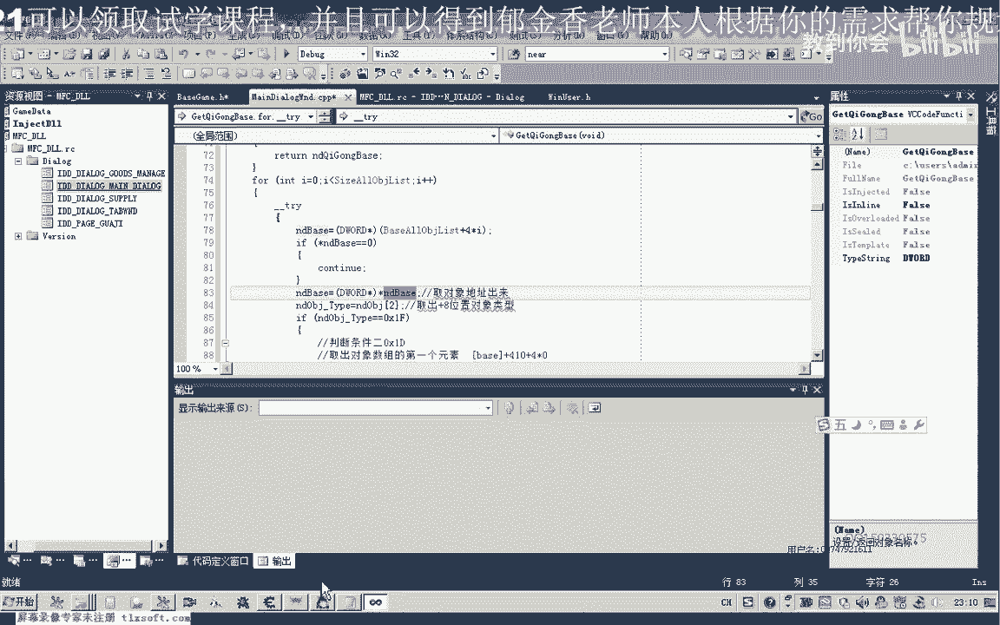

比如說這個ERCF8，那麼讀出來之後，這個是另外的一個對象的一個地址。

就存放在這裏邊了，那麼存放在這裏邊之後，這裏我們再對它進行一個讀取的操作，+8這個位置讀取出來，進行一個判斷，判斷如果等於EF，那麼我們接著後面的一個操作，那麼這裏的話就應該是NDBS。

加上我們的410，那麼410之後，這個時候它轉換了，實際上也是一個指針，NDBS，這個時候它已經變化了，變成了相應的地址，加上410，然後再取對象的+8的位置，如果這兩個條件我們都達成。

那麼我們就給靜態變量進行一個複製，那麼就複製為我們的NDBS，那麼這個NDBS就是我們之前所取出來的對象，也就是列表裏面的某一個數字，那麼如果這個是的話，那麼它的+8這個位置就應當是我們的ED。

應該是EF，然後它在裏面+410這個位置是ED，取出來，那麼這個時候我們就把它，這裏就返回，Tab，好的，那麼我們看一下是否能夠取得我們正常的機制，如果不行的話，我們還需要加上其他的條件，好的。

那麼我們編輯生成一下，然後這裏我們需要強制的把類型轉換一下，那麼我們測試一下，這裏的話，所找到的數字是0，我們看一下為什麼會是0，正常情況下的話都應該不是0的，可能是我們的代碼有誤。

那麼首先我們是取得對象的地址取出來，對象地址我們+8的這個位置來取出來，那麼我們首先看一下，在這裏我們取出的數字對不對，Type，遍體的Type的這個類型，我們看對不對，那麼還有條件2，這裏Type的。

再重新生成一下，我先清零一下，21，然後這裏就出錯了，那麼可能是我們只遍體到了這一部分數據，條件2這裏它取出來的這個類型的話一直為0，看來是，那麼條件2的話一直沒有達成，這裏它的這個類型。

我們再來看一下我們的公式，那麼條件1取出來的這裏是正確的，那麼我們應當把它放在這個地方，EF這個判斷成立了之後，我們再把它的這個類型來打印出來，這個是我們的條件1，如果條件2達成的話，應該是在這個地方。

那麼看這個條件2的話，它一直來取出來的是0，沒有達成，那麼我們看一下語句的話，可能是出現在這個地方，首先我們ndbase，它是取出了對象的地址，對象的地址加上了410，那麼這裏的話，我們還應當要取一道。

要取這個對象的話，需要有一個讀的一個動作，那麼需要了先把它讀取出來，然後再進行一個條件1的判斷。

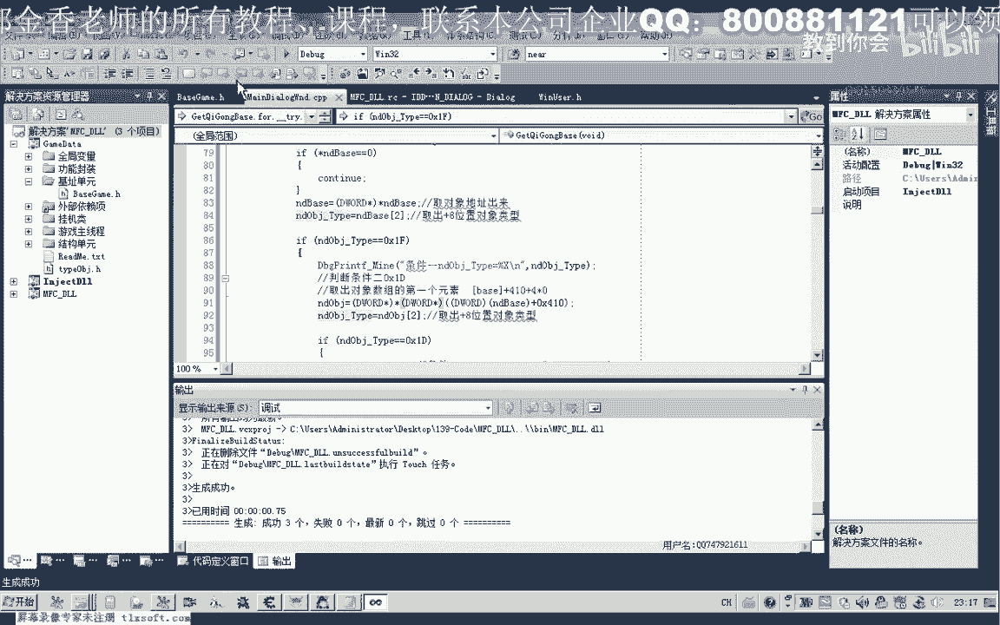

那麼這個時候來找到一個ES3710，那麼附加一下遊戲，那麼。

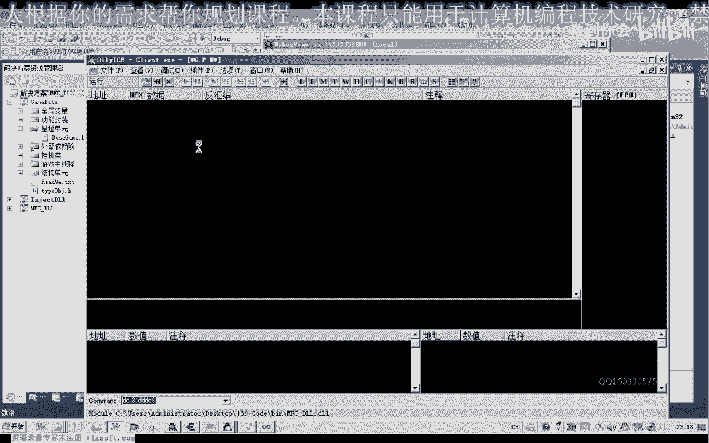

加上我們的410來看一下，但是這裏我們發現的話，這個也不對，這裏它為20，我們再來看一下，我們的信息，這裏應該是ES，我們這裏寫錯了，ES3710，這裏是EF，那麼EF再加上一個410。

那麼這裏可能就是我們的這個宿主，那麼再加上一個，我們用連線來看一下，金鐘。

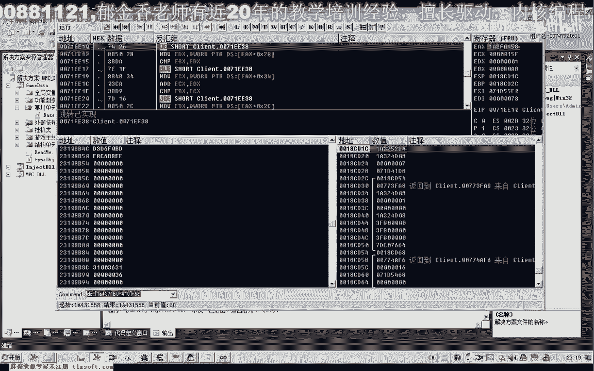

剛寫，後來這裏再加上一個410，410，運氣療傷，4102，連環分離，4103，狂風萬暴，那麼看來的話是不需要我們其他的一個條件的一個，判斷了，那麼就是這兩個條件，我們就能夠找到。

當然我們再回到我們之前的這個地址，從這裏我們來做一下核對，看我們找到這個對象是否是正確的，這裏我們之前有下一個斷點，看來這個斷點被取消掉，幸好我們沒有修練這個氣功，如果是修練氣功的話，這裏就會異常。

就會退出了，那麼我們在這裏把它落空掉，這個地址，好的，我們再想辦法讓它斷下來，看一下我們的EBX找的對不對，然後我們在這裏隨便狂升降四，下標應該是6，7，1234667，7的話，它的下標是6。

然後我們看一下EBX的一個數值，那麼這個時候的話，EBX是前根的這個數值，那麼我們還需要了這裏有個EX，這裏看沒有被執行到，氣功ID，那麼這裏的話應該還有另外的一段數據。

但是我們這裏看一下我們原來的代碼是什麼，我們剛才複製出來的70870B，然後這是我們的715715，這裏是這段指令，我們把它恢復一下，那麼這裏應該是這段指令才對，然後EX。

所以說我們應該是找EDX取出來，那麼我們看一下EDX的，恰好就是我們找的ES什麼，再來對比一下，那麼這裏是ES37EB0，那麼恰好我們訴訟的機制是找對了，找對的，那麼就OK了，這個地方，好的。

那麼這節我們就講到這裏，那麼氣功的機制，我們就已經找對了，把它注釋一下，這個地方通過什麼樣的方式來獲取氣功的對象，那麼實際上我們不是找到的這個BASE，而是找到的這個地址。

我們已經把它的地址機制取出來了，那麼我們就通過這個公式來獲取它下面的這些數據，在這個地方，我們注釋一下，或者我們可以這樣的來表達，然後這裏加上C是氣功對象地址，加上還有一個4C，是我們氣功的ID。

當然還沒有發現其他還有用的，其他有用的數據，我們暫時還沒有發現，那麼這幾個我們暫時就只有分析到這裏。

當然我們還可以來分析一下它的其他的屬性，暫時還沒有發現有用的屬性，那這裏有個1，那麼1會不會是表示它的可用這一類的，我們來看一下，那麼這裏的話，它一共8個，倒數第三個的話，它的下標是5。

那麼我們看一下第五個是否可用，這裏也是1，那麼是否可用的話，它應當有一個標記，那麼如果這裏沒有標記的話，我們可以把它與之前的加點的這個數據給它關聯起來，就能夠獲得它相應的下標所在的位置。

已經加了多少個點，那麼我們在後面的分析當中來再完成，實際上我們之前很早以前我們就已經有這個數據，當然我們上一期的分析的時候。

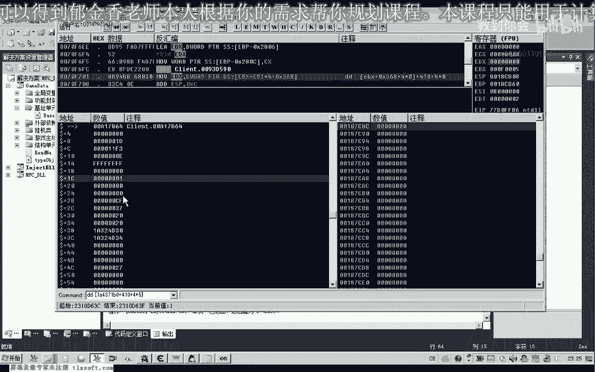

實際上已經找到了這幾個數據，那麼這裏但是沒有記錄下來，好，那麼這幾個我們的這個數據的機制的話，已經通過我們的編程已經過去了，那麼後邊我們再來分析這個氣功加點的相關的函數。

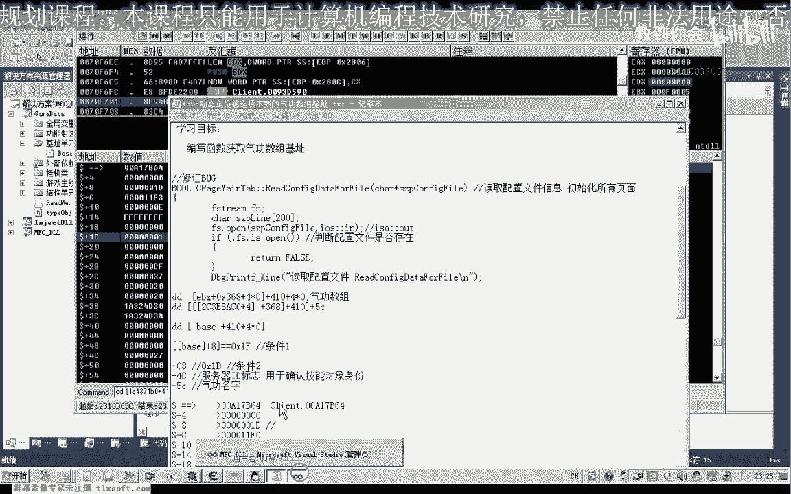

複製一下。

那麼這樣寫的好處是什麼，我們還有一個就是修正bug，不需要了，那麼這裏我們用了一個靜態變量，它的好處就是了，不會反復的去騙你，那麼一空了，只要注入遊戲之後，我們只需要騙你一次，那麼第二次的時候。

它不會空，我們直接就返回這個機制了，那麼後面再多就省略了，這樣的算法的話就非常的優化，那麼如果不加上在前面這一段的話，那麼每次都會去找這個循環，那麼這樣的算法就非常的低下。

相當於我們在這裏是跟它人湊了一個機制。

好的那麼我們下一節課再見，這節課我們就到這裏。

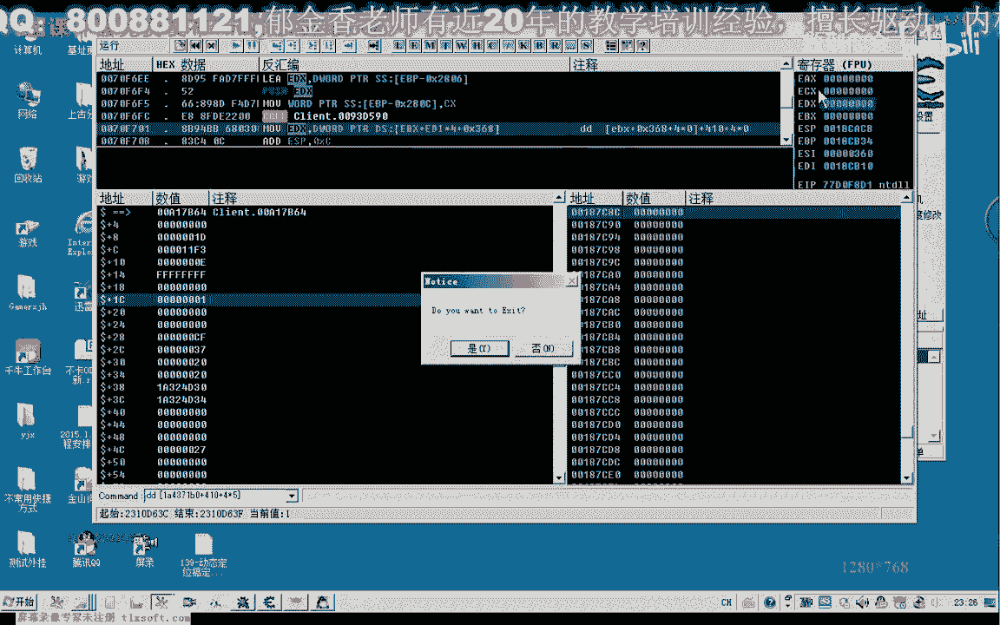

【過去的事物】。