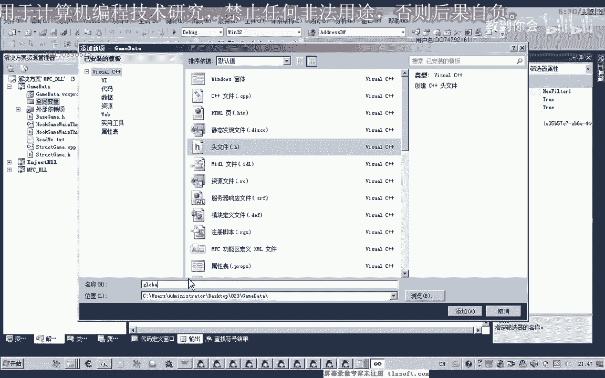

# P12：023-封装完善动作使用CALL-重复包含头文件 - 教到你会 - BV1DS4y1n7qF

大家好，我是玉溪香老师，qq 633057，那么这节课呢我们继续对上一节课的代码进行一个完善，以及完成我们第22课的作业啊，他们存在啊，这个u是x型，这个确啊，那么它的参数呢我们要求是动作的名字好的。

那么我们打开第26课的代码。

700，转到我们的源代码单元，回到最后，啊那么首先呢我们可以呢先骗你整个这个数组，获得它的下标，然后呢再调用上边一个函数，那么当然呢也可以完全的重启，那么我们把里面的代码，把前面聘你的代码写一下。

嗯这里是偏离到一块啊，干脆我们重新写过也可以，其实很简单，要写到进行一个变量全i下边呢是0~11，前面我们进入了一个活动，你这个是直接使用，我们就直接使用，这里是12i加项。

嗯就这里我们需要加上结构的一个前缀专用率啊，进行一个限定，那么首先这个名字呢，我们能用的名字传进来的这个参数来作为一个比较，那么如果最终比较的结果这两个相等的话，那么我们就直接使用它就行了。

那么直接使用这个下标就ok了，往前放，这个很简单，首先呢我们骗你整个动作列表，那么它的名字与我们常见的来到这个参数的名字来进行比较，但是比较之前呢我们要进行一个初始化的一个操作。

在前面呢我们要做一个初始化，好我们要给你的体现，当然这个也s的前缀呢，我们可以不要直接这样调用，也可以直接这样调用，哈哈哈，那么初始化了之后呢，我们进入整课，当然在这里呢我们也可以把初始化的这样啊。

写到这里边呢，也可以先这几道题，然后，再进行片面都是可以的，那我们出示一下，那么初始化了之后比较这个名字啊，然后呢这个就是他所在的一个下标嘛，就不用另外再去编写一个函数。

那么我们之前的对稿的这个使用的话，那么另外呢我们多了一个函数嗯，多少在流水平的啊，这个标题库是一dex类，通过这个名字呢去查询它的一个下标，那么这里呢我们越过了这个函数，直接这样写也可以好。

那么写好之后呢，我们来做一下相应的一个测试，那么在测试的时候呢，我们这里来讲，实际上直接就可以传我们的动作的名字，比如说啊运气调试就可以直接这样用，嗯这里呢我们进行一下优化啊，每次我们使用的时候呢。

我们都要来创建一个啊这个结构的对象的话，这样很麻烦，我们把这个结构对象的声明呢，我们把它放到一个全局的单元里面，在这里呢我们添加一个全局变量的语态，哈哈。

哈哈哈。

那么这个单元里面呢我们在对我们这些辩论呢进行一个定义，当然在定义之前，我们需要包含相应的一个图片，啊啊添加了全文件之后呢，呃这个图文件之后呢，我们在其他单元要使用的时候，在包含这个全局变量的这个单元。

那么比如说这个是我们的动作数，那么前面呢我们还有更高的速度，8888，然后除了背包数值呢，我们还有机会给他做一个数据，这个呢我们都把它放在这个全局的单元里，然后我们要到其他地方要使用它的时候。

我们直接包含这个单元来就行，那么包含了这个单元呢，我们这个struct connect这个单元我们就不需要包含，因为在这个途径里面，它也包含过，当然有时候让我们这里呢啊如果我们出现了这种。

有时候不得不重复包含一个单元的时候呢，我们也可以这样做啊，如果这里它包含了这个单元的话，它就会提示很多很多啊，从定义的啊，那么有时候为了方便使用呢，我们可以在这个相应的结构单元里面嗯。

加一个红的一个定义，最后一条无指令，那么这个红指令呢在前面我们编写啊，这个第八个问题啊，到时候呢我们也用过啊，那么只是用的不一样，当时我们是这个第八个，我们定义了我们在编译呢。

在编译的时候呢才编译这段代码，那么今天我们要用的呢是如果他没有定义啊，我要红，那么这里这个红灯你自己我们自己写，那么如果它没有定义这个红的话，那么我们在编译后面这个单元啊，这个n的移到最后，那。

么这样呢，如果这个人未定义，那么我们就执行下面的这个代码啊，同时呢我们就定义这个红，那么第二次他在啊再报案这个通鉴，再运行到这段代码的时候呢，那么这个盒呢也有了，在这个地方定义过了啊。

所以说呢这个条件呢它不成立，后面的这些代码困难，在第二次被包含的时候，它不会被编译，那么也就不会出现这样的错误了，那么这样写的话，我们就可以让我们把这个头文件来多次被包含。

当然这个windows可见的它里面呢也有一个类似的啊这样的一个处理，所以说这个windows单元呢它可能会反复的包含啊或者包，那么这也是一个技巧啊技巧，那么比如说这个文件。

那么我们也可以给它加上这样一句，预防它会重复的包含，那么这个移到我们定义的结束，那么这里呢我们也给他写一个红，如果如果这个没有定义了，我们在第一次的视频就定义一下这，啊那么这个途径呢也可以去多次的画完。

好那么接下来呢我们进行一下我们的测试啊，在这里我们用了这个运气调息，那么我们看一下测试有没有效果，那么这个时候要把我们的游戏啊显示出来，先挂解我们的主线程，然后呢把游戏显示出来，然后按一下测试。

这个时候呢它就运行了调息了，那么如果我们要打某一个怪物，我们先选定一下这个怪物站起来，那么选定了之后，我们看一下他第二个动作叫什么啊，叫工期，那么我们在这里呢我们也可以改成我们的攻击。

那么这段代码的可读性的话，它会更高一些，那么编写代码的时候呢，我们书写也更方便，如果我们直接传我们的这个下标进去的话，肯定介意啊，那么我们以后再修改我们的，代码的时候呢可能就不知道该怎么修改了。

因为代码的可读性太低了，好的话，我们再次输入，把我们攻击那个外挂界出现起来，这个时候它就会跑去了，之前我们攻击了一个命令，那么现在呢我们就还差一个选中怪物的一个命令，那么选中了怪物之后呢。

我们就可以再用这个攻击的动作了去嗯，恭喜我们的怪物了，那么我们就可以实现部分啊挂机的一个功能，不能挂机的功能好的，那么这节课呢我们就讲到这里，那么我们下一节课再见。

啊这个上一节课的座位的话是非常的简单的，就短短的几句代码就能做完成，好的。

