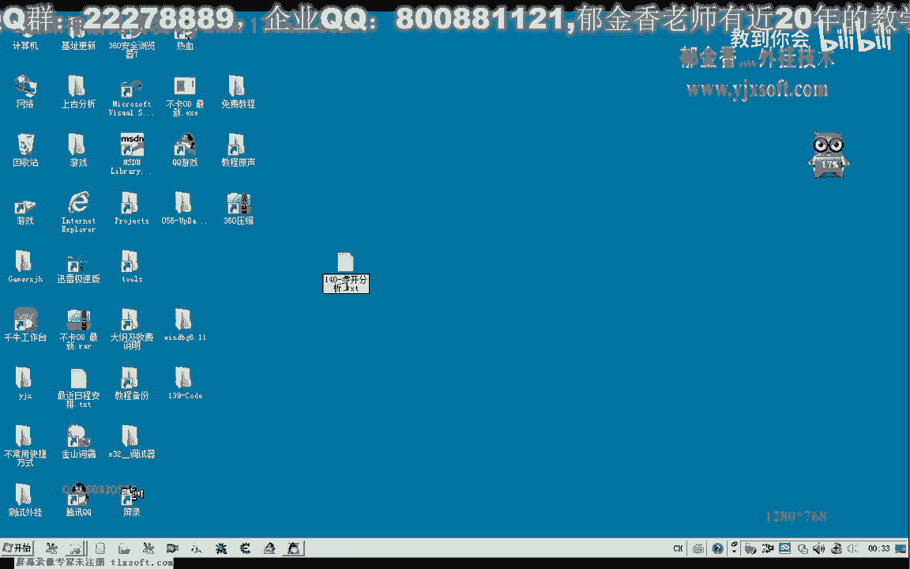
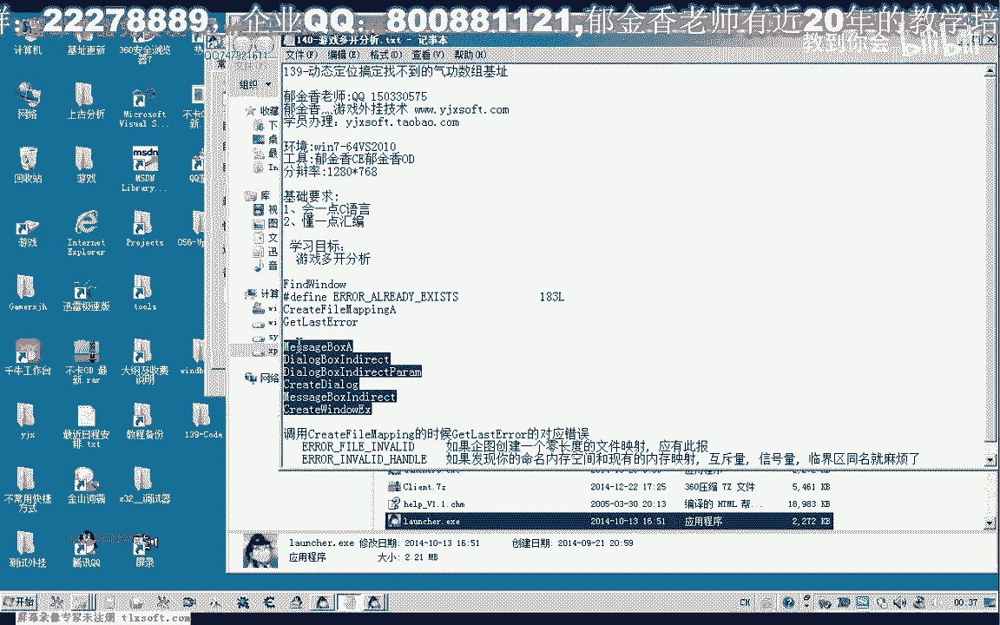
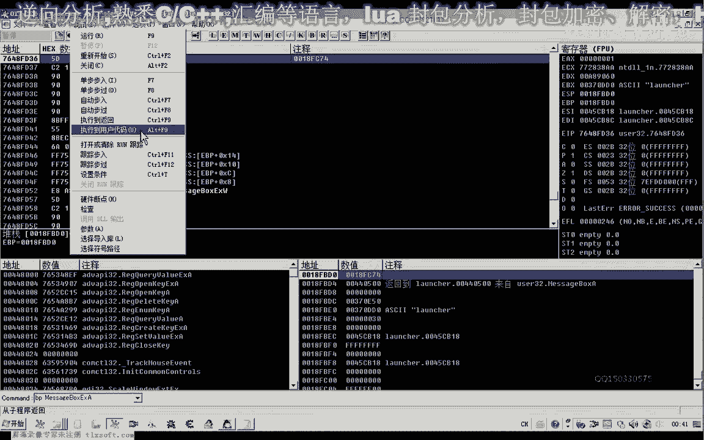
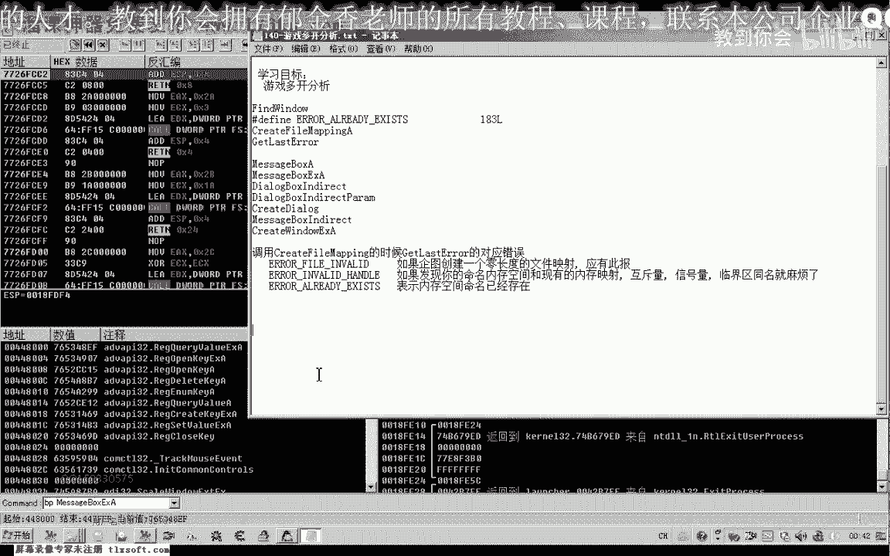
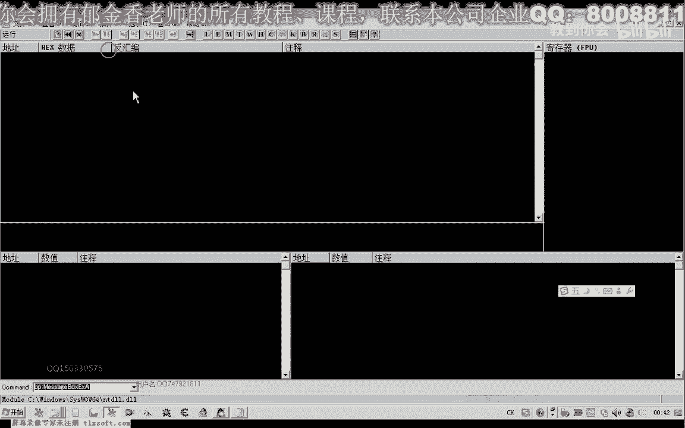
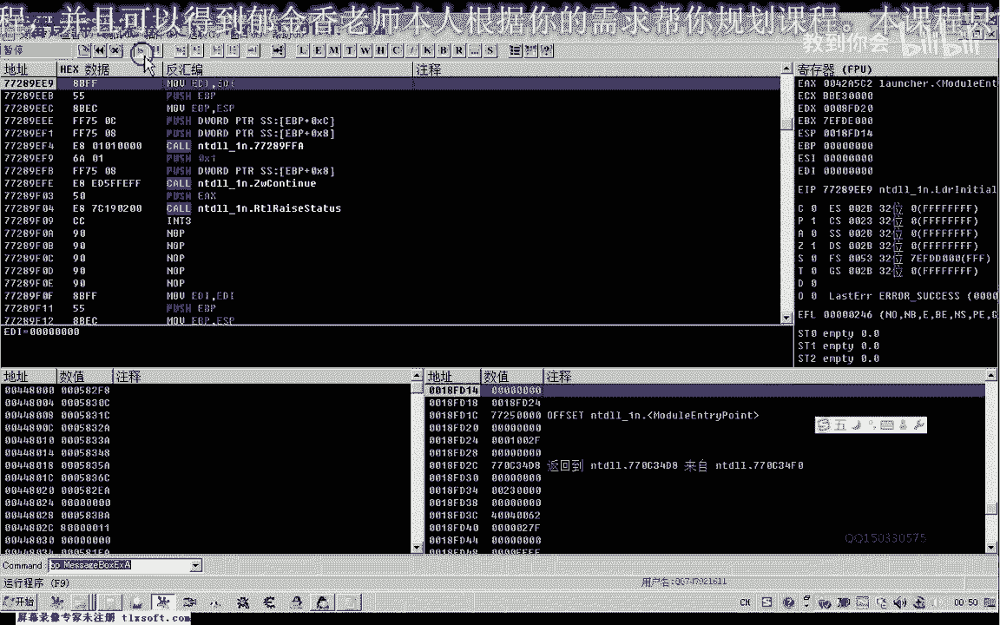

# 郁金香老师C／C++纯干货 - P130：141-游戏多开分析 - 教到你会 - BV1DS4y1n7qF

大家好，我是郁金香老师，那么这节课呢我们分析一下啊，游戏的多开的一个分析。

当然游戏多开的话，它有很多的这个方法来对抗我们的多开呃，比如说我们常用的可以枚举我们的这个窗口吧，on the window，或者是查找我们窗口的标题，或者是呃查找我们窗口的这个类比。

当然还有也就是我们的呃创建我们的共享内存这一类的，那么我们今天来看一下，这里已经打开了一个游戏，那么我们在多开的时候呢，它就会弹一个窗口出来哈，说目前呢呃什么正在自动更新或者程序运行中嗯。

要加一个参数来关闭运行中的程序啊啊否则的话无法运行这个程序，那么也就是说他在启动我们，这个登录器的时候啊，有限的这个登录器的时候呢，那么他肯定有这个代码检测到了我们的这个游戏的一个运行，运行的一个状态。

然后再谈的这个窗，那么谈到这个窗口的话，一般呢我们是用这个呃message box，那么或者还有其他的几个函数来实现的，这个具体呢我们可以查一下，那么实际上我们在后边呢能够看到啊。

或者是这个max message box啊，ex或者是这个message box啊，in direct啊这一类的，这就是我们这个窗口相关的这个函数，或者是这个大来的box。

在下面的这几个函数可以说都是与我们创建这个窗口相关的，那么我们可以对这几个函数来呃进行下段哈，理论上，那么当然还有一个create大了，那么这几个呢都是用来创建这个窗口的。

还有一个proof window，好像另外还有一个message box，我们看msbox index，那么这几个呢都是与我们窗口相关的啊，创建复制一下，另外还有一个top window和这个函数。

那么这几个函数的话都是用来创建我们的一个呃对话框窗口的，那么我们可以分别对这几个窗口来进行下段，那么也就是说我们在，运行这个游戏的登录器的时候呢，他可能就是说判断了已经我们开启了这个游戏。

那么然后呢再出现了这个弹窗，那么理论上来说的话，我们就可以对这几个啊嗯窗口啊，创建窗口的这个函数，这里下段，那么就能够嗯回溯啊，呃逆向到我们嗯对我们这个有些多开的相关的判断的一个位置。

好的，那么我们接下来呢先打开我们的d找到我们的这个窗口创建的位置。

那么我们先打开og。

那么这个时候呢呃我们可以把这个游戏的登录程序了，加载一下，然后呢我们再对它下段可以从这个message box开始，然后还有一个msp的ex，那么实际上这个max box啊。

a实际上就是调用的这个mmx box 1 x a那么我们进行一个下段，后面的这几个呢，我们也可以下一个断点，那么这里呢我们还有一个多字节的字符，激活一个，也就是我们的这个x编码过一个宽字符的一个uc呃。

a和w那两个版本的这个函数，嗯那么这个函数如果是没有的话，我们接着来看一下啊，这个函数，这后面这一个d p下一个a啊，这个函数量能够下断，然后呢，我们还有一个就是创建这个窗口的。

那么人认不到这个标识符的话，我们在后面加a再e x a，那么这个的话没有的话，可能呢它最终的是调用这个college window。

调用这个版本的这个api函数来来创建的好的，那么我们让它跑起来，那么这个时候呢我们可以看到就是我们刚才弹出的那个啊，目前呢呃正在自动更新，或者是我们的这个游戏了，已经在运行当中。

那么说明的话它在它之前的代码就已经有判断了，检测到我们的这个游戏已经在运行了，那么所以说我们从这里来把断连取消掉啊，从这里返回一下，那么从这里的话就能够返回到它的一个附近啊，这里有一个跳转。

我们可以看到嗯，这里跳转到了我们这里非零非零的一个数字cp ex e s i，那么这个ex我们找一下它的一个来源来源于e bx，e p x来源于就我们一bp减七零，u p p减七零的话。

这里他写入了一个字节的名，这bx啊取得了一个比建议，那么我们再移到前面来看一下，这个是一个深的message window windo，好然后呢这上面呢还有一个函数，我们转到这个函数来看一下。

再转到他的前边啊，在嗯嗯执行到返回，我们再看一下吧，这个时候已经检测到了，再重新开始一下，按下回车啊，进行一个下段嗯，断到这里，然后呢把断点暂时取消掉啊，执行到返回平，再执行到返回一下。

然后是到这个位置啊，这里呢我们备注一下哈，可能就是说这个判断可能是一个关键的一个判断，然后呢我们把这里呢啊复制一下，在这里，然后呢我们下一个断点，那么在这里的话它也是检测一个指定的模块是否来已经加载。

到时候我们看一下这个模块的话，bt modefine，这里呢是一个空的一个句柄，possible，等会我们看一下这个passer是什么，然后再让跑跑跑起来，把这里做一下记录。

再重新的让他跑起来。

那么我们从这个下段的这个情况来看的话，这一段语句它好像没有被执行到啊，也就是说这个地方的断点呢它没有效，那么可能的话是从这个上边这里呢呃直接跳转过去的，他的一个判断的话，应当还在前边接一。

taste x i，那么ex i我们找一下它的一个来源，这里呢都没有对e x i这个集成器进行复制，再往前面找，而这个e si呢它来源于我们上一层的ex，那么我们在这里下一个断点再重新执行一下。

那么我们看一下它上一层的来源，什么时候调用到这这个扣它的e4 x的来源，那么我们从这里看到的话，e4 x的话，它来源于我们可能是来源于这个机子嗯，再往前边来看的话，他为什么要对这个e4 x进行。

那么我们需要在这里呢加上一个断点，判断一下，执行这个货之后呢，ec x的数字呢也没有发生变化啊，这前面的话有一个创建一个我们啊，这个页面是只读类型的一个呃共享哈，共享内存啊。

相当于是然后呢这里呢有一个get get lasy啊，最后的一个错误判断，如果这个b07 的话，它是表示什么呢，呃b07 呢也就是183a6 啊，呃也就是我们16进制的啊，b7 。

第七呢也就是我们的183，那么这个b7 的话标示呢它是一个错误啊。

就是说我们这个create fire map建立这个共享内存啊，如果他的这个名字哈，这个共享内存的名字它已经存在的话，那么用它来获取的话，最后呢返回的代码来就应该是b07 ，那么也就是说它可能是这样的。

也就是说我们第一次运行游戏的时候呢，它就会调用这个create fire map呢，然后第二次我们在调用这个函数的时候，他可能创建了就会失败啊，最后就会返回一个错误。

就是说表示我们指定的内存呢已经创建了，然后呢他通过这后面的一个判断的话啊，coe x，如果这里相等的话，不相等，则跳转相等的话就会执行到这里，最终呢这里应当就是我们刚才的这个弹框。

这里进去之后就是我们的这个相应的一个弹框，好像是我们再退回来看一下，bp message box下一个段，然后从这里来返回，返回之后呢，我们再看下一层的一个房，这里看不到，好像，再返回一下，那么这里啊。

然后再返回一层，那就应该是在这个框里边啊，不知道他是怎么跳过去的，可能这里呢有一个jp啊，这样呢可能跳过去了，是通过这个跳转来过去的，那么关键的东西呢，反正就是在这里边来打开的。

我们的呃来进行我们游戏多开的一个判断，那么我们再按减号再退回来，关键的代码的话，好像是在这里了，那么通通过这个这个分析的话，我们可以来发现的话，它是通过这两个函数来判断的话。

可能是呃一个是我们创建呃这个呃共享的一个内存，然后呢最后呢通过这个gusty lagri就是获得最后一个错误的代码，这两个函数这样来进行判断的，那么如果来这里呢。

他获得了也就是我们的啊指定的这个共享平台已经存在的话，嗯那么这里呢我们就啊g n z就不会跳转，如果这个代码它等于b7 的话，就不会跳转，那么如果不等于b7 了，它可能就会跳转。

那么这里呢就是我们的刚才我们看一下，这里就是这个弹窗的在后面啊，再把这一段复制一下，那如果是的话，我们理论上来可以通过呃这里的一个判断，那么我们可以来把这里的j n z或者是这个b7 。

我们可以把它改一下啊，比如说改成b一啊，这类的话他可能就不会进行跳转了，就不会存在啊，永远这里这个跳转的话永远都不会啊，或者是把这个弄不掉，应该也可以，那么我们再次重新来运行一下。

那么我们当时在这个位置判断的时候呢，我们要改它，再重新开始一下，那么在这里判断的时候呢，我们把这个b7 啊把它改一下，或者是把后面的这个jn z把它落不掉啊，不让它进行一个啊。

应该是直接进行一个跳转才对啊，或者把这里改成一个价格，那么就这样改的话呃，理论上的话也能够可以做文档也sa，那么这里来创建我们的可能是一个登录的一个窗口进行一个创建好，那么这个时候的话可能就。

能够呃这个登录器呢就能够正常的打开，就能够实现我们的这个多开啊，这个时候呢就能够呃出现两个窗口，那么我们还有一种方法呢，也就是我们重新开始之后呢。

直接改这个地方，把这个地方直接跳过去啊，改为这个家门，让我们的这个检测的这个窗口来把它跳过，跳过这个检测，那么这样的话也可以啊，那么我们尝试一下，看可不可以多开啊，这个时候呢我们也能够打开两个登录窗口。

按这个导入窗打开这个窗口之后呢，我们再次登录了这个客户端的时候呢，他也会出错啊，登录的时候呢也会出现一个错误，那么说明这个客户端的话，他可能还有另外的一个检测啊，那么我们在下节课再继续的进行一个分析。

那么这节课呢我们暂时到这里，按减号退回来啊，关键的这个关键的这个地方的话，这里是一个，这里是多看，关键跳出，调整判断，当然这只是我们登录器的一个多开的一个判断，那么它在客户端里面呢还有另外的一个判断。

那么我们需要呢嗯再进行接下来的一个分析，好的。