# 郁金香老师C／C++纯干货 - P131：142-分析游戏启动过程 - 教到你会 - BV1DS4y1n7qF

你好，我是郁金香老师，那么这节课呢我们分析一下我们游戏的一个启动的一个过程。

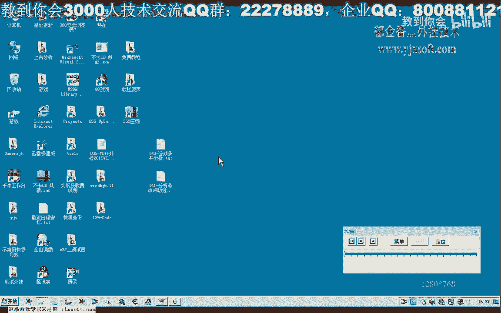

那么为我们后边的这个制作，我们的这个自动登录，以及或者是制制作我们的游戏登录器啊，做一个准备，那么另外呢对于我们分析多开的话可能也有一些帮助，那么首先呢我们要准备一些知识啊。

也就是我们关于这几个呃启动我们呃外部程序的一个api函数，那，么一般有这三个函数哈，它又有不同的几个版本，那么我们可以来先对这几个函数来下段。

当然最终的话它一般呢也是通过这个创建进程的这个函数来来实现的，那么也就是说这几个函数呢，它最终可能也都要执行到最终的这个位置的话，应该是要执行这个函数这个代码，这里是他他的一个必经之路啊，应该是好的。

那么我们实际上只对这个地方呢下断点应当就可以了啊，那么这几个函数呢它也可能会调用到，那么我们先打开我们的呃。

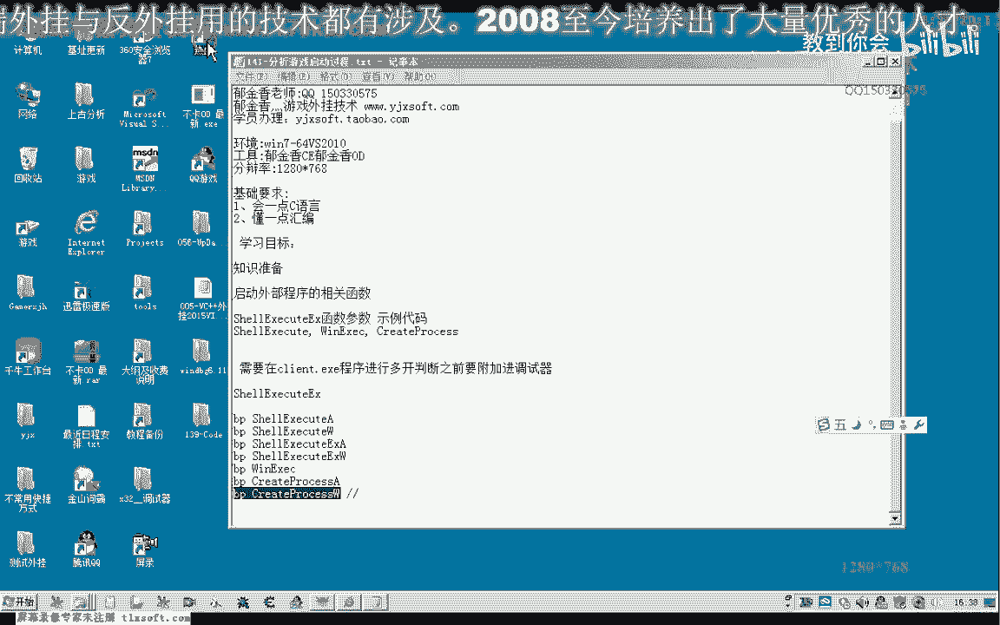

应该是先打开我们的这个调试器吧。

然后呢再下一个断点。

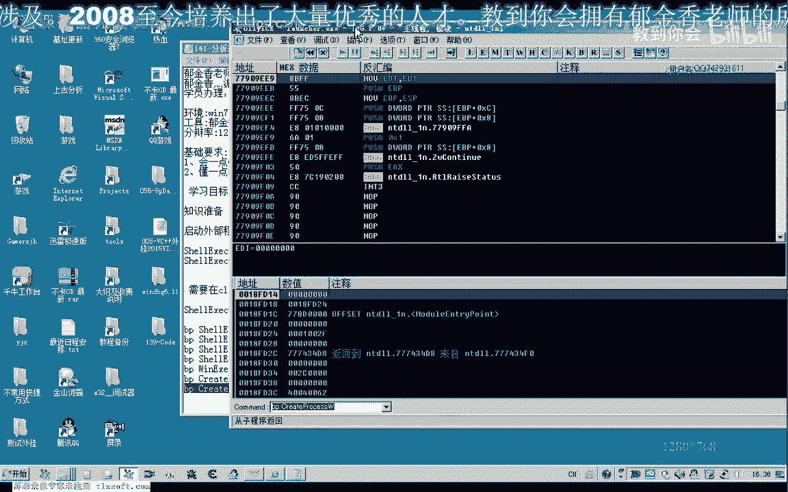

当然实际上只需要下这一个断点就可以了啊。

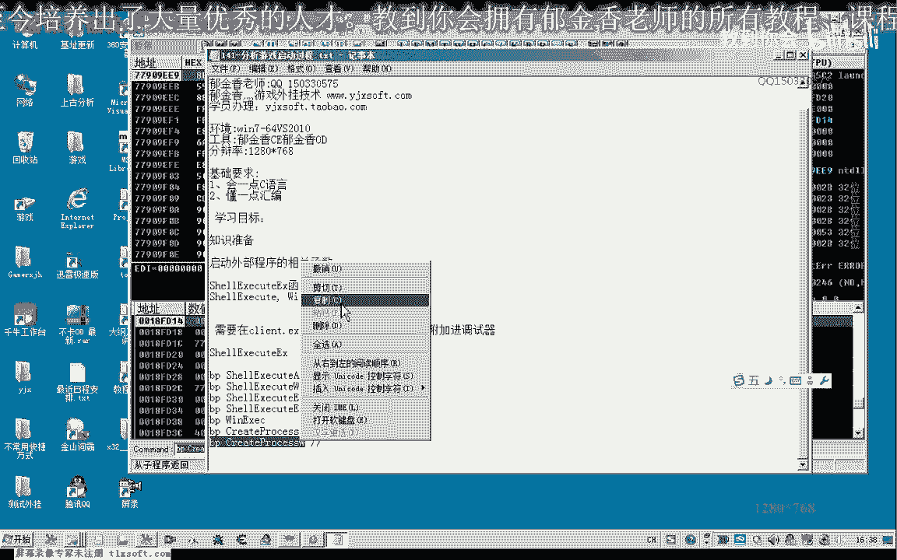

要让他先跑起来，相应的模块载入之后呢，我们这个时候呢才够下断，不然的话他会说一个位置的一个标识符。

那么其他这几个断点呢我们也可以下啊。

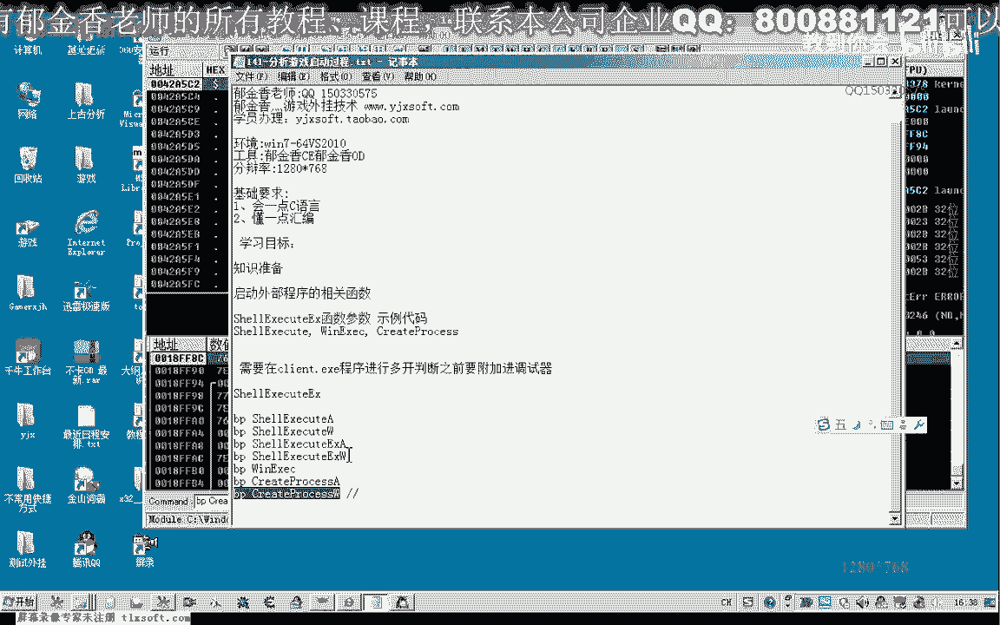

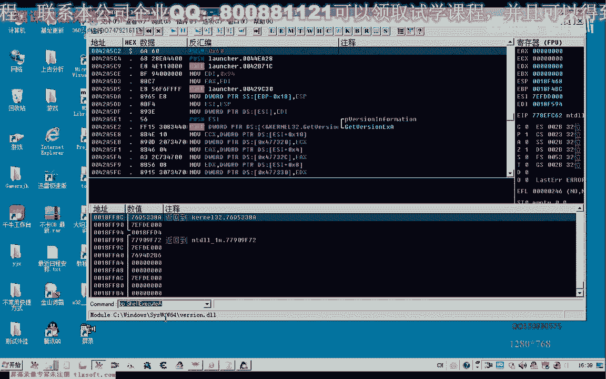

好。

那么我们看一下它是调用的呃。

比如说我们这里选网通四区啊，当然这个时候呢就相当于我们是在设置一个它程序的一个启动参数，我们都知道有一个命令行啊，命令行的话后面呢它可以跟一些参数，那么等一会我们就能够看到，那么这个时候我们点开始。

我们就能够看到了，它实际上呢就是调用了一个api函数，当然我们这个时候呢需要先分析一下，那，么实际上我们从这个堆栈里边呢也能够看到一些参数，这里应当是一个服务器的一个地址端口，而后面的可能是一个。

嗯其他的声音一个什么什么参数啊，具体是什么，这个感觉不出来啊，现在还嗯，然后我们再看一下啊，这是它的一个第一个流程啊，复制一下，当然这个函数呢它的一个具体的一个说明的话。

我们可以在论坛这里能搜一下它相关的这个数据，那么这几个外部外部程序哈，呃相关的api函数呢在论坛里边呢都有说明啊，到时候呢嗯，可以看一下。

好的，我们再次，让他跑起来看一下执行到什么地方去了。

那么这个时候呢他又会去调用这个cl啊，w ew这个版本的这个函数，那么这里呢我们也能够看到呃进程的名字以及后面的这个参数，好复制一下，好再次运行起来。

那么最后呢我们可以看到它是用这个create process斯哈，w这个版本的这个函数来呃，来做了另外的一些设置啊，另外的一些设置，那么相关的一个创建的这些标志的话，可以到论坛去看参考一下啊。

相关的资料，那么这里呢我们所需要的的话就只是这个命令行啊，我们需要的也就是这个命令行把它复制一下，那么命令行的话就是这一行啊，那么后边呢这里呢是它的一个参数，相当于。

这个地方就是它的参数要登录的一个服务器，以及服务器的一个端口的相关的参数，那么我们有了这些数据，我们对于我们有什么好处呢，那么我们就可以了，在这个游戏加载的时候，他做的一些判断呢我们就可以了啊。

如果这里面它有一个多开的判断啊，比如说登录到这里的时候，他就说呃这个什么重复的登录，或者是什么其他的这一类的判断的话，我们就可以来分析，那么我们先把它关掉。

那么这个时候呢我们就可以脱离我们的这个登录器啊，直接来来打开对，当然你需要找到这个游戏所在的目录啊，然后呢嗯先选中它的目录。

啊这是1p的客户端，那么然后呢再是我们这里提取的一个参数，当然在前面他已经有提取这个参数了，我们用之前的这个需要ex第一个参数就行，这就是它的一个参数。

那么我们就可以来把这个参数来加在这个o d的后边，那么这样的话我们就可以脱离我们的登录器啊，直接的嗯直接的来调用我们的程序的客户端，那么我们也可以甚至我们可以自己写一个登录器啊。

那么如果是他通过登录器来防止的多开的话，那么我们直接来自己写登录器啊，就能够解决这个问题的应用，那么这样这样的话我们打开之后呢，这样我们就不用这个登录器来打开了，那么直接打开这个客户端。

也把我们相应的参数呃传送进去了，那么比如说我们刚才采取的这个参数的话。

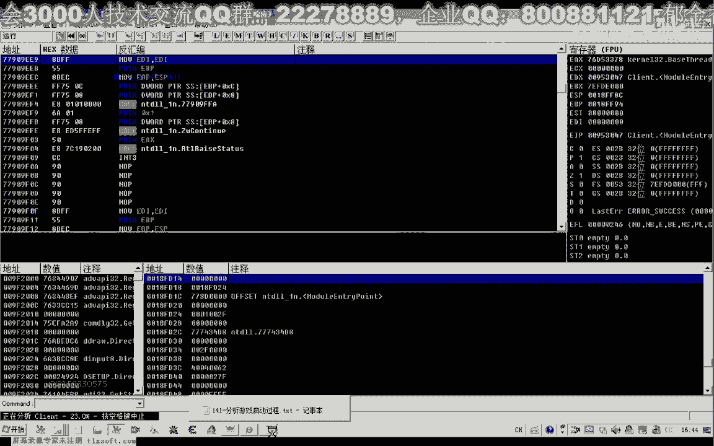

从这里能努力从他的这个域名的一个命名方式来看的话，你能够看到它是一个市区啊，可能后边呢呃它可能是这两个参数，有可能是表示什么啊，其他的啊或者是表示的是网通什么什么这类的，也可能好的，我们先让他跑起来。

那把断点呢这个时候全部禁止掉，然后让这个进程来跑起来，那么这个时候呢它比较慢哈，那么我们进行一下登录看一下，这个时候把所有的这个断点的都删除掉，当然这里呢它可能是有一些反调式的这个手段哈。

在登录的时候呢，它为了保护这个账号封闭嘛，他可能是创建了这个调试的这个钩子啊，这一类的嗯，那么要说说这个时候登录的话，它也会出现一些错误，但是呢我们可以用其他的这个程序来这样来呃加载啊。

分析他之前登录的这一部分的这个代码，那么或者是制作这个登录器的时候的话，我们呢可以直接调用这个相应的这个函数。

来来创建我们的游戏的一个客户端进程，就可以脱离我们一个登录器的一个呃检测控制。

那么从而达到一个多开的一个目的。

那么这里呢我们可以看到很多的这个键盘的这个呃钩子，可以试着来把它取消掉，然后这里呢我们试图用鼠标来登录一下，那么可能他是有定时器的这个判断啊，那么运气好的话，绕过了这个定时器的这个判断了。

应该能够通过它来打开我们的一个客户端。

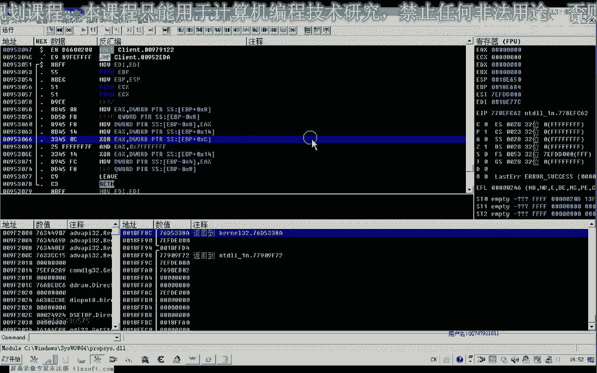

那么实际上我们也可以把它的这个命令行提取出来哈，呃直接进行运行，那么这这是它前面的呃这个名字啊，那么再加上它命令行的一个参数就可以了，或者是直接把命令行啊复制出来。

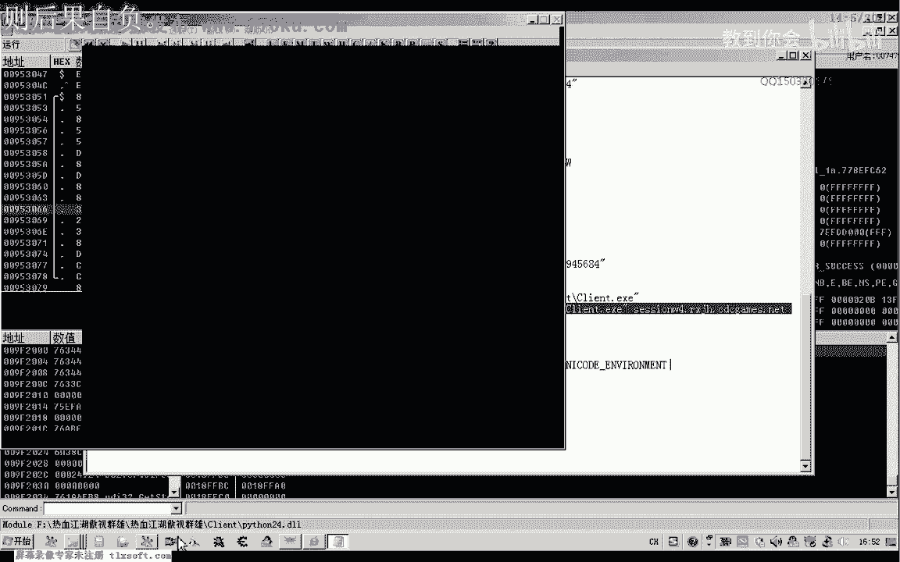

或者说我们直接在命令行这里呢直接运行。

嗯。

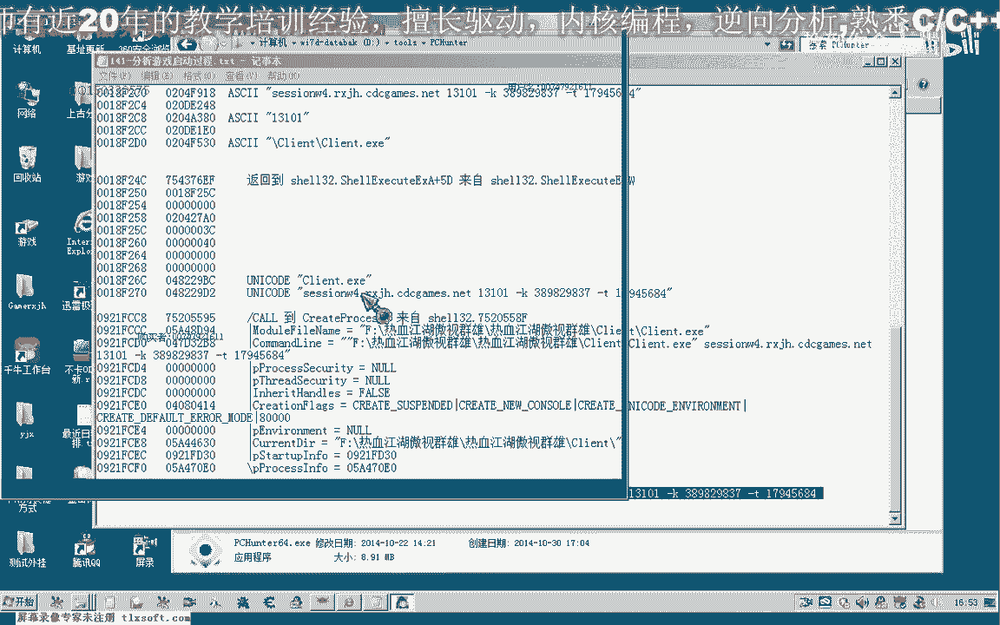

嗯嗯嗯，那这样的话我们也能够看到他选择的这个服务器的话，也是我们的市区的这个服务器啊，市区的呃，那么如果我们是选择了其他的区的话，我们也可以来继续通过刚才的方法来获取啊。

其他的一个参数通过我们的这个登录器啊。

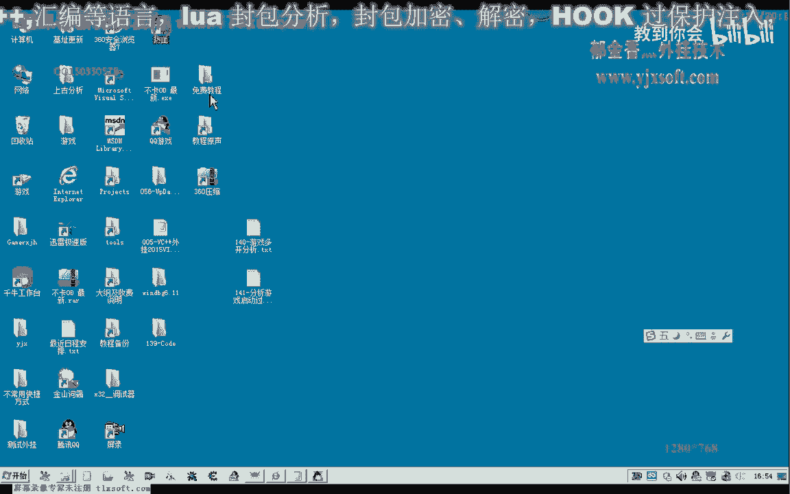

当然我们需要了嗯。

先夹在这个登录器，然后我们直接从这个cot process w啊，这个参数这里来来获取它的一个命令行。

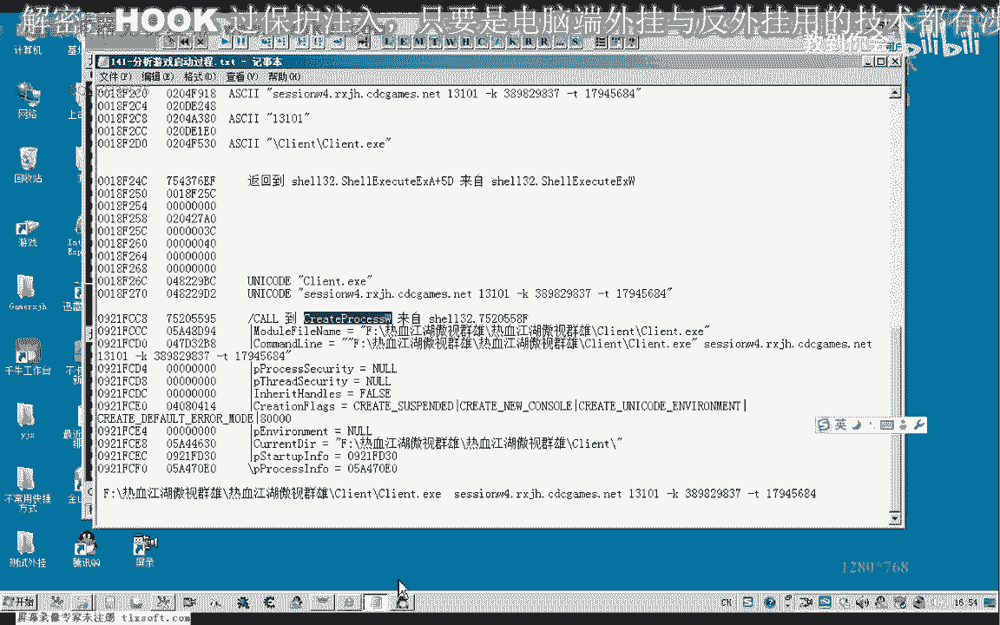

那么比如说我们选网通的山区，当然这个时候它的参数来肯定就会有变化，那么我们可以通过这个参数的一个变化的话，就能够把它的呃登录参数来提取出来，那么提取出来之后的话，我们就可以直接来来调用这个函数来呃。

写一个我们自己的一个登录器。

那么实际上知道了这个原理的话就很简单了，那么我们看一下它的一个命令行是多少，这是山区和市区的一个区别，那么我们发现的话啊，首先呢是域名这里不相同，还有后边的这个参数呢它也是不一样的。

那么或者是他在后面的话，也有可能是与时间相关的一个数数字啊，这两个可能是变化的啊，我们再来看一下这两个参数知识，那么如果我们还是选择四驱啊，看一下，那么时间不同的时候呢，它传入的参数是否是一样的。

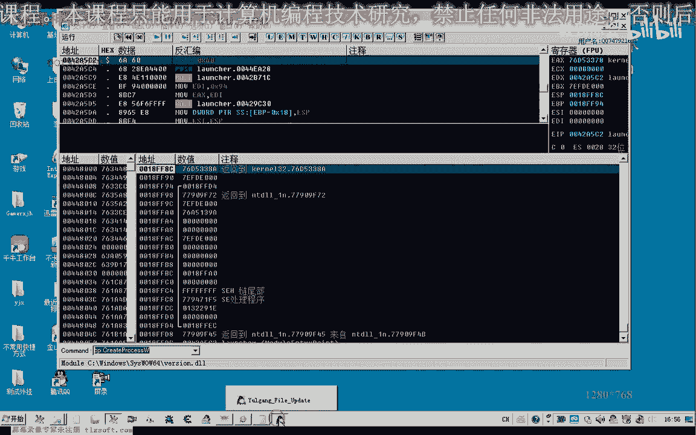

然后我们点一下开始，同样是断在这里，那么我们主要看一下这个命令行，command嗯，这是选择的四驱，那么我们发现的话，这后面的这个数字呢它也是不相同的，那么这两个的话可能呢是与我们时间有关系的啊。

与时间相关的一个数据，这个呢它是在变动的，应当是，10031，这个可能是开了一个端口啊，这一类的，当然这个的话如果我们要自己写登录器了啊，关键的数据呢就是我们前面的它连接的一个啊服务器。

那么我们推测的话，这里呢就是呃可以这样的改，那么后面的我们可以暂时不变动它，那么如果是网通日趋的话，那么可能就是这里来改为二，那么我们可以做一下测试嗯，在这里运行就可以直接。

那么这里呢符号我们需要所删掉了，啊这个不同的区呢它的这个账号的话需要不同的激活啊，要做这个测试的话，我们需要每一个区呢都需要把这个账号啊，需要来把它激活才行，那么网通一区的话。

那么很有可能来这里呢就是一啊它的运笔，那么后面呢这里呢可能呢都可以不变化啊，都可以不变化，当然后面的这几个参数的话呃，还可以进一步的分析一下，那么这几个呢我们站起来就到这个地方啊。

呃那么后面呢我们在再继续的深入的进行一个分析，好的。