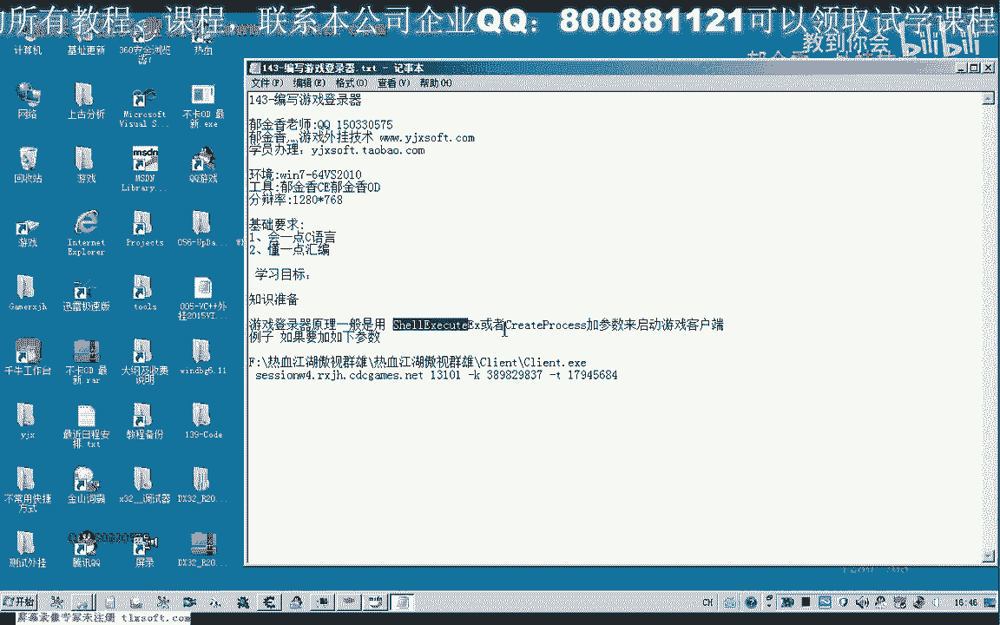

# P132：143-编写游戏登录器 - 教到你会 - BV1DS4y1n7qF

大家好，我是郁金香老师，那么在上一节课我们简单的分析了游戏的登录的一个目测啊，了解了这个游戏啊，启用我们游戏客户端的一个原理，那么我们知道了这个原理的话，我们也可以写一个简单的登录器啊。

那么在上一节课的话，我们所以这里呢采取了一些参数啊，比如说是这个参数。

那么我们可以通过这些参数的话呃，自己来调用这两个api函数啊，理论上就可以写一个登录器嗯，但是我们后面的这前面的这个参数的话，我们很好理解，那么这个参数呢应当是我们的服务器的。

要登录的一个服务器的一个地址嗯，在后面这个参数的话，还有这两个参数，那么它的意义呢我们暂时还不知道，但是这几个参数呢我们可以尝试哈，直接套用上去，看可不可以登录啊，正常的登录。

那么我们先来尝试一下写这样一个，登录器，那么在写之前呢，我们再次分析一下，它传递的一些参数是怎么传递的。

那么首先我们用ot来加在我们的调试器那来加载我们的登录器。

来摘取一下它传递的参数是怎么传递的啊。

在此那么我们直接来调用简单的这个函数，调用这个c2 ex这个在这个地方呢，下一个bp断定先让它跑起来，那么跑起来之后呢，这个时候我们在选这些游戏大区的时候呢，实际上它就是对一个参数的一个初始化。

那么我们在这里呢我以这个网通社区为例啊，当然其他的区的话，他后面的这个参数呢肯定不一样，至少是这个呃服务器的地址它不一样，好的，那么我们但是这些呢它实际上服务器的地址呢它都是有规律的啊。

都是用数字来编号的，这里就是四，那么我们这个时候点游戏开始的时候，它将继续调用我们的api函数来打开我们的游戏的客户端，在这里呢我们能够看到它的一些参数啊，嗯这个时候它的参数呢前面的这个参数没有变化。

但是后面的这两这三个参数呢都有了一些变化，但是我们不知道用以前的参数，脑的参数能不能够呃成功的打开我们的游戏，那么我们只有先进行一下尝试，那么在尝试之前呢，我们先分析一下它的一个参数。

那么这是它的一个亚战的一个参数，那么它的参数呢我们与这个希尔exclusion ex呢进行一个比较，因为它的参数呢实际上只有一个就是一个指针地址，那么也就是说在这里的话。

它这个参数呢就是这个f2 d4 这个地址，那么我们转到在数据窗口里面嗯，转到这个地址去的话，这个2d4 从这个地方开始的，那么我们从这里来采取，它就是这样的一个缓冲区，这就是它缓冲区的一个，数据。

那么我们先把这个缓冲区的数据呢复制出来，再进行一一的对比，它这里呢有一个share exclu啊，info这样的一个结构，那么我们再来跟他对应起来，那么第一个呢是cp size。

那么实际上就是这个结构的大小，那么第二个呢是一个for master，那么这个呢我们直接填充四零进去就行了，后面这个呢是一个就是调用这个函数的一个窗口的一个呃i d啊，窗口的句柄。

那么后边这里呢是一个lpv 12这样的一个参数啊，也是一个字串，那么一般呢我们有时候是写的啊，open表示用来打开，但是这里的它是一个空指针，因为这里是为零。

那么后面呃这个i love you file呢，它等于是一个相对的一个地址，就是这个客户端啊，我们的拍了屁，对应起来，那么再下来呢这个是它的参数，我们把它复制一下，等一会等一会儿我们写程序的时候会用到。

那么在后面这一串呢就是它加的参数，当然这个x呢可以去掉，那么在后面呢这里呢应当是它的目录，但是呢没有显示出来，这个地方是指向它的一个目录，当然我们这里呢可以显示一下啊，那么是目录的话。

这个地方呢应当用dc来表示，这里呢我们看到它是汉字的话，可能因为这个原因呢没有显示出来，那么如果我们用db来显示一下，我们可以看到嗯这个5c啊，这个斜杠后面呢，实际上就是零就是零。

我们把这一串呢啊复制一下，那么在后面的话我们看一下它是一个什么参数，这里呢一个呃n秀啊，表示了它是否显示，那么这个n秀呢它等于一啊，实际上也就是等于我们的true啊，他呢也表示一个增值。

那么后面的这些呢全部是零，那么为零的话，我们就可以用一个main city来把整个这个结构来初始化那个set，然后把它的地址呃传进去就可以了，在这里呢我们可以给定义一个这样的一个变量。

在它的前面定义一个变量，求inf，那么然后呢对它进行一个初始化就行，嗯，好的，接下来的话我们有了这些数据呢，呃接下来我们就可以编写程序，写我们自己的登录器了啊，可以尝试，那么这里呢我们可以暂时把它关掉。

调试器，我们所需要的数据来嗯，已经取得了，那么接下来呢我们就可以开始写我们的调试器，在这里呢我们打开，打开我们的vs平台。

那么创建一个登录器的一个项目，天，然后这个因为我们的游戏呢是多字节的x和类型的，这里呢我们不用这个ui库，这个库呃，然后点完成，然后调整一下我们窗口的大小，那么调整大小之后呢，我们就可以了。

在上面呢添加，比如说我们这个呢可以改一下名字啊，这个呢我们就叫做登录，那么这个呢我们就叫取消或者是关闭都可以，在这里呢我们还给它添加几个按钮，那么这个呢比如说就是网通一区啊，这个是网通二区。

那么这个呢是网通的山区，那么我们再加一个哈，那么其他的来自己下去啊，获取一下，把它排列好了之后呢，这里呢我们就取一个啊叫通社区，那么选好之后呢，我们在这里呢就可以给它添加一个相应的代码。

我们可以来直接的把它写成一个函数啊，另外的写一个函数来登录我们的这个相应的这个区，那么比如说我们另外写一个vi，good no，那么这里呢我们呃用一个整数来设置一个相应的一个游戏的一个区。

比如说我们这里就叫做，那么默认呢我们设置为广东四区啊，它的下标为三，那这里呢我们可以用一个switch的一个结构，来跟他传输一个相应的一个数字或者是其他的，当然这里呢我们就只写网红四区的代码。

如果是你自己要把它写全的话，可以下去自己进行尝试一下，那么这里呢我们设计关键的就是要调用的这个函数，刚才我们能用到的c e x，那么在用这个函数之前呢，我们需要来，先定一个结构，那么理论上这样就可以了。

但是呢我们刚才还采取了一些参数，那么这些参数呢我们需要来给他布置，那么我们来看一下第一个cp size，那么这个呢实际上就属于我们的size of，水库。

那么或者是直接的用我们所获取的这个值3c给它填充进去，那么第二个值呢直接是四零，那么我们给它填充进去，那么实际上它这里边的话也有相应的值在这里，那么可能就是这里面的某一个值的一项。

我们可以把这些值呢复制一下这个for mask呃，进去看一下，那么恰好了这个红的紫的就是等于四零啊，那么我们恰好啊，实际上这里呢就是对这个红进行了一个操作啊，对它进行一个复制。

那么下面一个呢是我们的这个窗口的句柄，那么我们为零，那么为零的实际上我们就不用复制，我们直接可以用调用mac之前呢初始化一下我们的这个数组，那么这样呢我们就把整个结构的所有数据呢就复制为这个数字零。

这里呢我们需要转换一下，可能，去达到一个地址好的清零之后呢，我们接下来再对一些非零的数值来进行复制，那么这个呢我们也可以不复制了，凡是为零的我们可以不复制，那么这里呢它是一个字串的一个地址嗯。

那么也就是我们的这个，要打开的一个客户端，但是这里我们需要改一下，为什么，因为它的一个登录器的话，它取得应当是一个相对的一个地址，那么这里呢我们取的话需要它的一个目录的一个地址。

应该是啊目录就是在在后面的这个目的。

那么我们再看一下之前的分析。

那么这里的话我们把它的目录的地址复制过来，那么我们可以在之前呢定义一个红，那么这里呢最好我们是用全部性笔啊，这样不容易出错，当然这里呢我们还要注意的，这里因为一个斜杠表示表示的是一个转义字符。

那么这样的话路径就不对，我们必须给它添加双斜杠，那么另外还有一个呢是设置我们的游戏的一个呃路径，做一个工作的一个目录，我们需要给它设置好，那么这里呢呃有一些变动在它的基础上。

因为它登录器的目录和我们的本身这个程序的这个目录不一样，当然最后还有一个呢就是要显示的这个凡是n修，这个呢我们需要把它设置一下，这个呢复制为一或者是true啊，这两个指的都是相同的，相同的。

那么这个fire来求取等等于我们的game plan好，那么还有一个目录的名字，点个lp dk，这个肯定pass，那么这样的话基本上我们就写好了啊，再检测一下，看还有没有其他地方需要复制的。

还有一个参数，就还有这个参数，这里，那么我们把参数复制下来，嗯，那么实际上不同的区域的话，它也就是这个参数啊，可能不一样呃，那么我们就可以了，只求在这一个地方可能就可以了，当然这个我们也去测试了。

那么这里选择的时候呢，实际上我们是按照登录器来写的话，呃这里呢就是，就是初始化我们的参数，这里呢才是登录，那么在这里的话我们可以这样来写，而全局的一个变量在这里呢，我们直接这样给它清理。

那么这一行呢代码呢我们就不需要了啊，初始化的清零的话，我应当也是需要的，因为我们可能要多次选择，那么在这最终的时候呢，这里呢我们就只调用一句就行了啊，登录的时候呢，我们直接调用这一句代码就行了。

那么这一句代码执行之后呢，我们还需要了有一个等待的一个动作哈，因为我们登录之后呢，我们的这个登录器能会退出，那么我们看一下它的一个剧本是多少啊，等待它就是说这个游戏来返回的时候呢，我们才退出。

等游戏客户端退出的时候，让我们登录器才进行一个退出的一个操作，还有这个时候我们需要隐藏啊，执行之后呢，我们这个登录器呢本身呢就隐藏掉，害，羞温度，那么最后呢执行到这里来执行这个on，ok啊，退出退出。

那么大致上就是这样，那么在这里的时候呢，我们就调用这个跟lg啊，这个我们叫初始化，初始化这个相应的一个数据啊，实际上就做这个操作，那么这里呢我们登陆的是市区。

我们传入的参数呢就是三相当于是预留了一个接口，那么网通三区的时候呢，这里呢我们就跟它传入一个参数二来做一个区别，那么网通二区的时候呢，这个时候呢我们给它传入一个参数一，那么往网通一区的时候呢。

呃我们给他传送一个参数零，当然要完善的话，我们还需要在这里面来写一个开始结构，那么根据我们传进来的这个参数呢，然后呢对我们的在后面的这个参数来进行一个相应的一个更改，当然这里就没有了啊。

这里呢我们不做这方面，的晚上我们先来测试一下嗯，选择这里呢，我同事去初始化，那么初始化了之后呢，我们在这里呢打开我们的游戏客户端，好的我们运行一下，那我先说实话，然后再登录，那么这个时候登录之后呢。

实际上我们的登录器呢它还没有关闭，还在在进程里面，要等我们的游戏客户端退出的时候呢，他才会退出，这个时候呢我们就能够进入到游戏里边去了，那么这个时候登录的时候时候来速度比较慢啊，好的。

那么这个时候呢我们看看到，如果这个时候游戏啊他退出，那么它会我们的登录器呢会有一个等待的一个动作哈，他等游戏退出之后呢，它才会执行到，那么这个时候呢登陆器呢它也会解解除掉了啊。

也会从我们的进程里面消失啊，因为这是因为这里有一个等待的一个女婿，好的，那么这节课呢我们就就写到这里啊，我们的登录器啊，那么其他的大家可以呢去采取一下其他区的呃这个参数，那么把它进行完善。

还有就是说我们可以动态的来获取我们游戏的动态的设置，我们这个这个游戏的客户端的这个地址啊，这一类的，或者对他的这个路径呢这些进行修改啊，都是可以的，好的，那么这节课呢我们就讲到这里。

那么我们下一节课再见。

