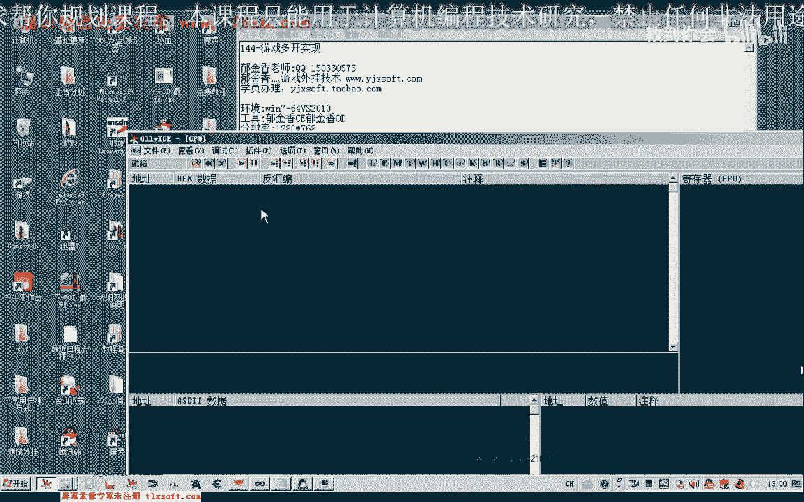
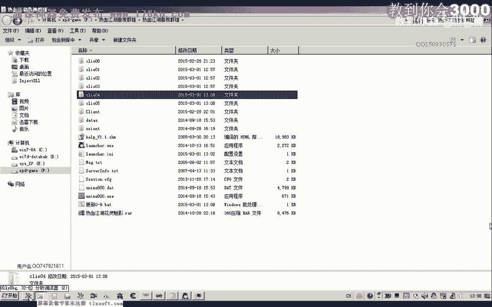
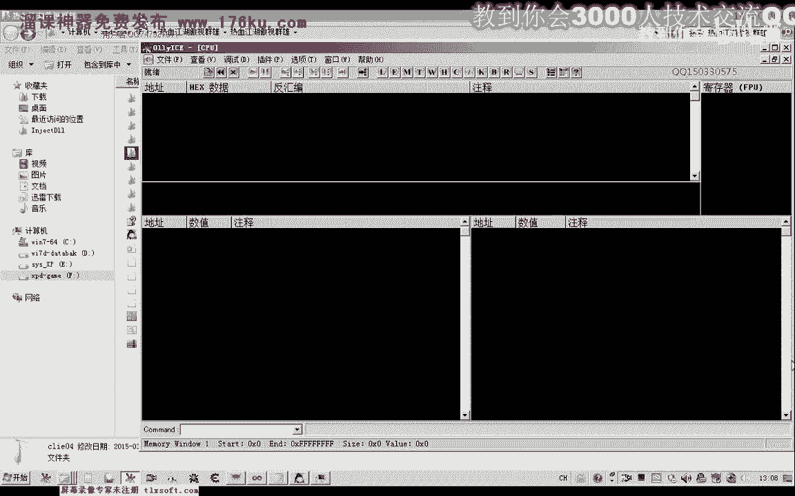
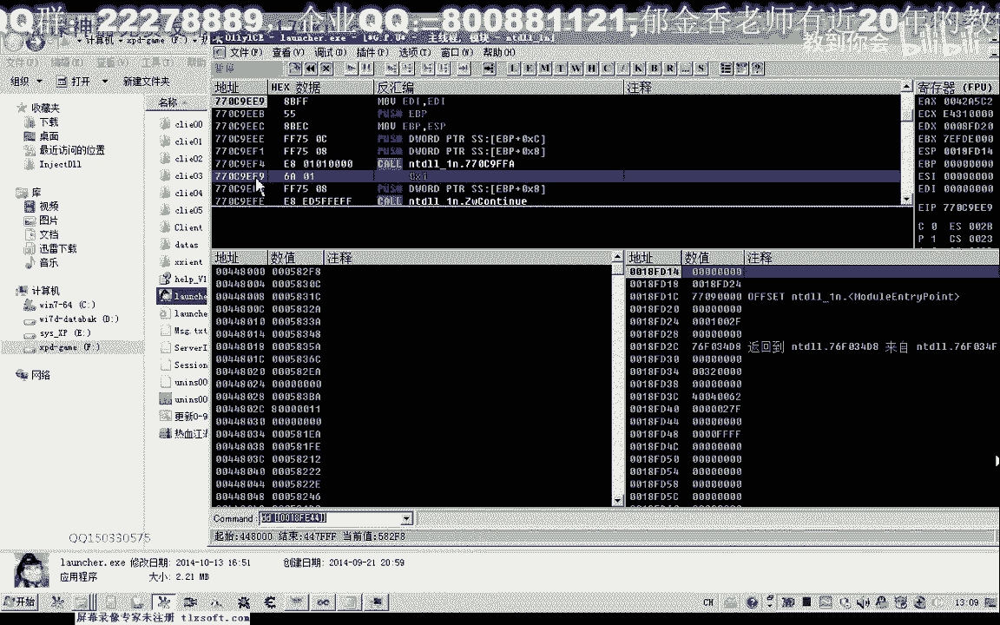
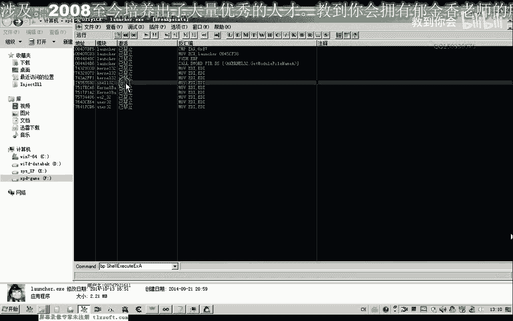
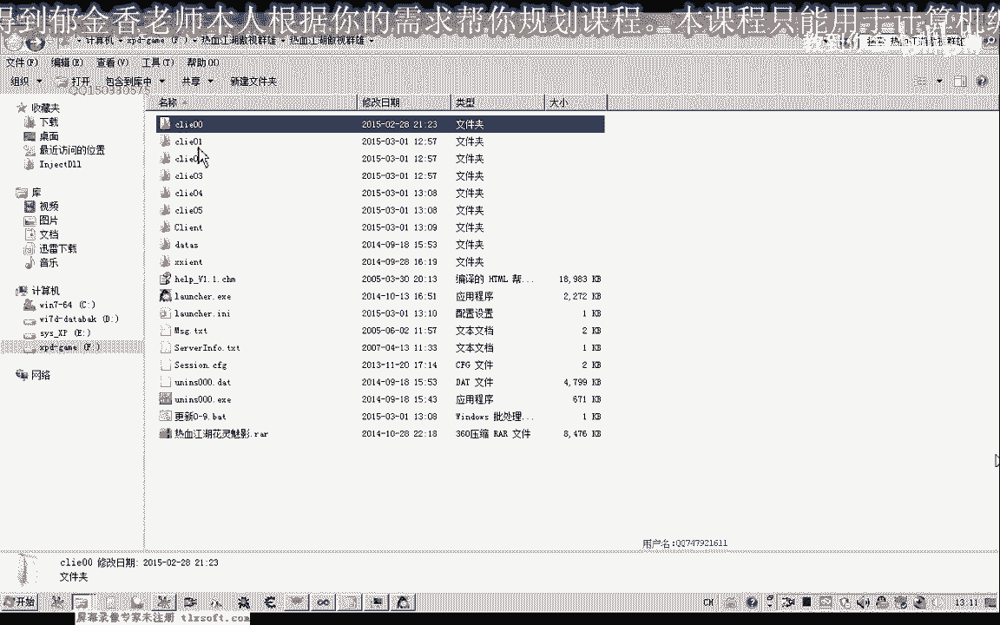
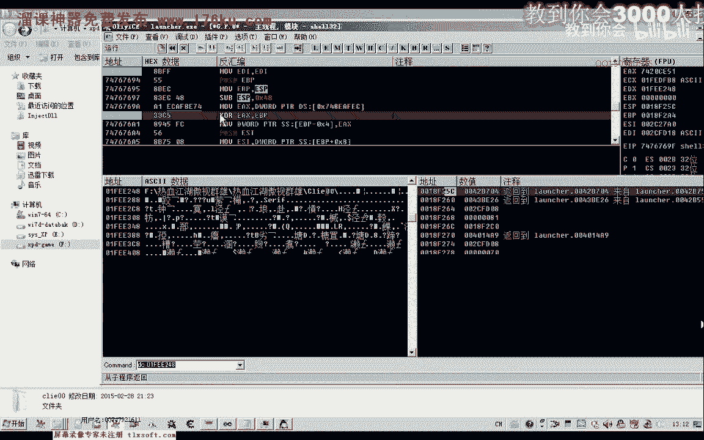
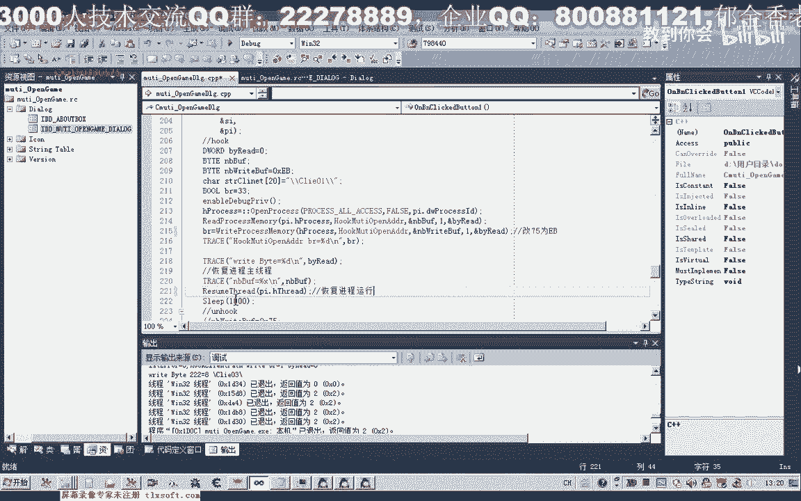

# P133：144-游戏多开实现-过登录器检测 - 教到你会 - BV1DS4y1n7qF

大家好，我是郁金香老师，那么这节课呢我们继续的呃，分析游戏的多开，那么我在这里呢写了一段测试的一个代码，那么我们先来看一下它的一个效果，那么首先呢我在这里呢自己啊写了一段代码，来启动我们呃游戏的客户端。

那么在启动的同时呢，就对他的一些代码来进行一些呃实施的一些修改啊，嗯这样呢来达到一个啊多开的一个目的，那么通过它来来启动的这个客户端，那么实际上呃这个登录端，实际上这个登录器呢已经被我们呃它的代码呢。

已经经过我们自己的一些修改了，所以说呢他不会把检测到我们游戏的一个多开，它可以绕过游戏的多开，好那么我们接着来看第二个游戏，那么这个时候呢他就不会有呃相关的这个提示。

而且能够正常的正常的登录我们的游戏了，这个时候就可以，那么如果再加上我们这个呃游戏优化的这个功能啊，降低cpu啊，呃这个占用率率的这个功能的话，我们至少能就能够呃开十开或者是20开都有可能。

如果是在内存足够的这个情况下，我，不知道，好的，这个时候呢我们能够实际上的话，它可以主要如果是你的电脑速度足够快的话，理论上可以实现啊，无数k啊，这个时候啊随便有多少态度都是可以的啊，你们上，好的。

那么我们展示了这个多开的这个功能，那么接下来呢我们来嗯具体来说一下它实现的一个原理，那么它的原理的话，在之前呢我们已经有过一些呃，分析它的检测呢主要是两个方面，一个是登录端的一个检测啊。

如果我们正常的启启动啊，而不是呃绕过这个多开保护的话，那么我们开第二个登录器的时候呢，他就会提示啊，它就会提示了，就是目前哈自动更更新什么什么的，请关闭啊，运行中的这个程序。

那么这个检测的话也就在这个代码段位置啊，这个时候呢我们需要把它的这个比较呢需要跳过这个呃j n z，也就是说它比较呃不等于每次我们就如果是等于这个比期的话，表示了我们就是说呃这个客户端已经打开了哈。

登录器已经打开打开过，那么在这里呢我们需要把这个jn z来改为价格哈，就是说一直来比较的话都是啊没有打开我们的这个登录端的啊，也就是说这个ex的话呃判断呢一直就不等于这个b7 。

那么这样呢我们就能够跳过一个检测，那么实际上呢呃这里的改为降本之后呢，它由以前的这个机器码七五来改成了1b，那么所以说呢这里呢第一点呢我们登录器呢需要这个七五改成这个b，这样才可以啊，这样才可以。

但改了之后呢，他他还有一个问题，它除了我们登录器的一个检测呢，它的这个客户端应当也有一个检测，那么当我们第二个啊，比如说我们的登录器啊，没有问题，那么我们，那么我们的游戏的客户端呢。

它实际上还有它的一个检测啊，那么这个检测呢经过测试之后呢，我发现呢它是对可能是对这个游戏路径的一个呃客户端的一个检测，如果这个资金路径的这个客户端它已经启动了啊，也就是我们这个任务管理器哈。

这个进程列表里面的呃，某一个路径的这个客户端已经启动之后呢，它也是不能够登录的。

那么我们用的这个o d打开。

我们进行一下尝试，那么首先呢我们也是改掉这个地方，把七五改成我们的vp，完了出来，我们需要先改改了之后呢，呃这个时候呢才能够启动，不然的话这个登录器呢是不能够启动的，那么我们重新再开始一下。

那么这里呢实现了，实际上呢也有一个呃与我们之前的这个hook呢它不一样，它必须是在这个呃登录去为未完完全的这个运行之前，我们就需要修改这个代码啊，那么这个修改代码的时机的话需要把握的很好才可以。

也就是在这个主线程它的这个代码的话段呢已经加载了之后呢，我们就需要修改，不能让它全部运行起来再修改，这样的话我们就来不及啊，所以说我们在这里呢呃做这一段的时候呢，我们需要呢自己创建这个进程。

并且呢把这个进程呢需要把它挂起啊，不让它运行，而让我们把这个代码修改完成之后，我们再让这个呃进程呢再让它跑起来啊，我们编写的代码的一个过程就是这样，好那么这个时候呢我们的呃。

这样就能够跳过我们的登录器的一个检测，然后呢他会去调用我们的这个西游，调用我们的客户端啊的这样一个过程，那么实际上它客户端运行之后呢，它也会有一个检测啊，它会检测这个它的一个命令行。

相当于是检测这个进进程的，那么我们再来看一下它的这个参数，那么它的这个参数里边的话，在这个地方呢也是他的一个当前的目录，当前的目录这个位置呢相当于是命令行，这里是命令行的一个参数。

这是我们的呃运行的一个目录，那么这个运行的目录呢也就是在这个目录下边啊，在这个目录下面，那么我们现在所要改变的也就是它的这个默认目录啊，这样改变了之后呢，他检测它的这个命令行的话啊，大致了就不一样了。

呃就是说他跟之前的这个命令行运行路线呢就不一样，这样呢就能够绕过我们客户端的一个检测啊，呃经过测试的话，但是呢这里呢我们还有一些如果这个路径改变了，那么在指定路径下来。

我们也需要把它的一个就是说我们游戏的客户端呢也需要复制过去啊，相应的数据啊，那么这一点呢我是通过批处理文件来实现的啊，我们一步一步的来先了解一下大致的一个结构。

那么在这里呢因为它客户端已有一个检测，它检测的是这个路径啊，大概也就是检测的这个路径啊，那么所以说在这里呢我把它的这个客户端的这个目录屏做了一些修改，其他的都没有变。

那么这是正常情况下的这个client，那么这里呢我通过一个这个批处理文件啊，那么在这里呢首先呢我们先建立相应的目录，那么这里呢我只建了四个目录啊，理论上呢能够四开，那么如果还需要更多的呢。

那么我们可以把这个目录呢建大一点，也可以通过这个呃吸人命令来来调用这个外外部的这个批处理文件啊，这样也可以，那么这里呢我们可以一直加啊，这里加到啊可以无限的加，理论上，噗，那么理论上这里可以无限的加。

但是呢他这个分配的空间来说的话啊，最好呢我们这个空间呢不能够啊大于它这个字符的空间，这里呢是六个字节，那么我们在改的时候呢，这里呢也要保证的是六个字节，那么我们可以改的话就都可以改到是从呃这个范围的话。

我们可以从这个0000，那么到我们的f f啊，理论上可以到这么多，那么这么多的话足够我们多看了，那么实际上我们只需要最后两位啊，就完全是足够了，只需要改后面这两位，那么改的时候来这里。

后面如果我们还需要继续的多开的话，我们可以再建一些啊，这个再复制一些目录，当然最终呢我们可以通过编程的手段来实现调用这个外部的这个命令，也可以随机的我们自己来生产啊。

然后呢我们需要把它下面的所有数据呢啊，复制到我们新生成的这个目录下边去，比如说灵符这个为例，那么我们保存一下哈，那么这个时候呢它就会自动的把所有的这个呃下面的数据来复制一份，到我们新建的目录下。

比如说这个是040，但零四这里呢下面是空的，因为我们没有写啊，复制的代码，零五下面呢这里也没有啊，那么我们再来看一下，那c l i0 ，好我们再执行一下，那么只复制到零三这个位置啊。

然后呢后面的好像就退出了copy系统，找不到指定的路径，c a l i嗯啊，那么我们再来看一下这个目录，零可能是创建者的不正确盘c，然后i10 c l i10 啊，这个目录名不对。

所以说他退出了10t那么把再把这个复制一下，啊这里改为了一个四，好那么这个时候呢所有的这个数据呢就复制过去了，那么在这下面呢也有相应的我们的游戏的这个客户端，那么这个时候的话。

它的路径呢与我们默认的这个客户端的话肯定就不一样了，就可以逃避一个客户端的一个游戏多开的一个检测啊，当然是以这个游戏为例来说啊，那么这个时候的话，我们再通过o d来演示一下它的一个呃多开的一个过程。

啊。

好我们把这个登录器啊放到里边去，首先呢我们需要来修改的是这个地方的代码，要逃过登录器的一个过一个登录器的一个剪辑。

呼呼呼呼呼。

那么第二点呢我们需要来过一个客户端的一个检测啊，那么客户端的话我们需要了再启用客户端，这里的下一个断点小x semt mix需要在这里呢下一个断点。

好的，那么我们先让它跑起来，那么这里的断点的话，我们知道了这个位置呢它是一个呃相应的一个结构啊，那么结构呢我们来看一下这个结构，首先呢在这个位置呢是它要运行的这个客户端的名字。

那么这里呢这个位置在参数后面的话，也就是他的这个目录啊，当前要运行的一个目录，那么我们就需要改这个地方，当然第一次运行的时候呢，我们可以改也可以不改，那么要改的话，这里呢我们改为呃零一。

这个n这里呢改为零一啊，那么这样改改了之后呢，与我们之前这里修改的这个目录呢。

呃对应起来也可以从零零开始，好那么这个时候呢我们就可以让它运行起来，啊这样的话它就能够正常的进行登录，那么如果第二次的话，路径与这个相同的话，他登录的话又会出现问题啊，又会出现问题。

那么这个时候呢我们再重新运行一下这个客户端。

然后呢我们转到这个地方去修改这个登录器这边的一个检测，再降盘，然后让它跑起来，那么跑起来之后呢，我们在这里啊，选区之后呃，在我们启动我们客户端的时候呢，它再次会调用这个希尔这个地方嗯。

来启动我们的这个外部程序，那么我们再次来看一下，那么实际上就是加一八这个位置，嗯就是它的这个当前目录，那么在这里的话，如果我们继续使用一个相同的目录啊。

那么这个时候他最终的话是不能够呃躲过我们客户端的一个检测的，那么如果我们这个时候是相同的一个目录，如果我们再次登录其他的账，这个账号，那么这个时候呢他就会让你来请你重新登录啊，请您重新登录。

那么经过反复的这个呃猜测啊，然后与这个验证，那么最终呢我确定的是，他可能是对这个相应的路径呢做了一个这个检测啊，也可能是对这个文件打开来做了一个判断啊。

那么最终呢我们可以通过这个修改这个目录屏呢来躲开哈，那么也就是保证雨这个运行当中的这个客户端的路径呢不一样，就能够躲过了这个检测啊，那么我们嗯做的这个方法，我们再来演示一下。

那么首先呢我们实现多开也是在，这个登录器启动的时候呢，我们先改登录器的这个检测啊，这里来改为jp，然后再次启动参数，这里的，那么这里呢我们需要来，改为与之前的这个客户端栏不一样的一个名字。

这里呢我们改为零一啊，而且呢这个路径呢必须也要存在，必须要在这个地方，那么如果不存在的话，自己来编程的复制一下这个目录，或者最简单的方法就是用这样的批处理命令的来实现b a t啊，这是鉴鉴定目录啊。

这是复制文件，当然也可以用c加加编程啊，那样显得呢要复杂一些，那么零一这个目录呢也是存在的，到时候来就启动一下啊，这个client这个目录当然直接这样启动是不行的。

它必须要有一个参数在后面呢，我们可以看到它有一个参数的这个地方，啊这个呢它有一些参数，而且后面这个参数的话，它可能也是从服务器了那边发过来的一个验证啊，然后呢又通过一些加密的一些手段的加密之后又跟他呃。

又给他回复过去哈，所以说这里呢涉及到一个相当复杂的一个算法啊，这个参数k那么这个参数t呢经过分析呢，它是一个当前的一个时间一个时间，而这个13102啊，这个呢比较固定，这个比较固定在后面这个参数的话。

它是一个加密的一个参数，那么所以说我们自己写登录器的话，呃那么显得比较复杂，那么我们注意最方便的呢，也就是在它原有的登录器上面来进行修改好，那么这个时候呢我们就可以把路径来给它进行一些修改。

那么修改修改好了之后呢，我们再让它运行起来，听到，那么这个时候呢我们就能够正常的登录了，那么只要保证了我们后面每一个这个客户端，它的一个目录与之前的一个客户端的一个目录呢啊，只要保持不一致的话。

那么我们就能够啊就能够实现啊完美的一个多开了啊，就像我写的这个程序一样啊，那么我们先来大致的看一下它的一个代码的一个流程，那么实际上呢它也是因为我们之前的话，在这里呢在获客这个我们登录器的这个代码的话。

我们需要来先让它运行起来之后呢，先要暂停，它要挂起，那么我们要实现这样一个功能的话，我们这里来可以用这个quit process啊出来创建一个进程，那么创建进程它中当中的一个参数呢。

就是啊新进程的这个主线程呢不以暂停的一个状态呢被创建，那么只掉直到了用这个resume cd函数来调用时来才运行啊，用这个函数来恢复它，那么这样它就是暂停的，那么这个进程创建之后。

暂停的话也就跟我们这个状态是一样的，就相当于我们暂停在这里了啊，暂停在这里了，他没有跑起来，所以说他没有执，在没有执行到这个代码之前，还没有执行到这个代码的时候呢，我们就把这个代码跟它修改成键盘。

这个时候才有用，那么我们代码来实现的话嗯，就是直接到这里来对它进行对这个地址来407bf a这个地方啊，这里定义的一个红啊，对这个地方呢进行写入，写入了一个字节啊。

那么这一个字节的数据呢就在我们前面的就是这个eb，就是这个1p这里我们写入的这这个缓冲区的数据了，就把我们的七五来改回来一批，那么这一点我们修改好了之后呢，我们再恢复我们的县城。

用这个这里呢我们恢复进程，那么就相当于我们和地里边的啊这个运行啊，这个时候呢让它跑起来，那么刚才的这段代码呢，他也就呃会被顺利地执行，那么甚至我们恢复运行之后，我们还可以了，等待等待一段时间。

然后呢再把我们的这个代码给它恢复过去，那么如果这个游戏的检测比较强的话，那么我们还可以在这里啊进程运行了啊，几秒的时间之后呢，我们再把这个71b呢再改为七回，再把这个代码来给他还原进去。

这样呢就能够逃避我们其他的一些啊变态的检测啊检测，然后我们在最后这里的也就是改一个客户端，这个呢比较复杂一点啊，比较复杂一点，它的一个原理呢。

我们就是用这个spring来腐化s p p i t f来来格式化这个字串，然后生成了类似于这种路径，点击是我们的clean呃，九九啊这样一类的数字的一个路径。

那么原理呢我们这节课呢我们暂时呢就分析到这里，那么具体的代码测试呢，我们呃留在下一节课，我们一起来写，或者大家也可以下去，下去之后呢，自己写一下相应的多开代码，好的，那么这节课呢我们先讨论到这里。

