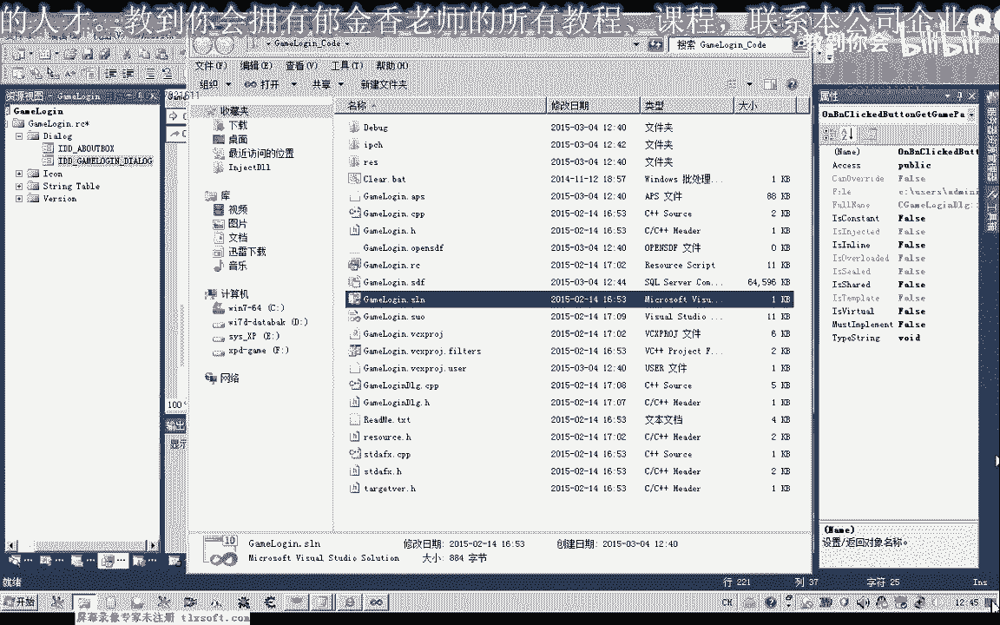
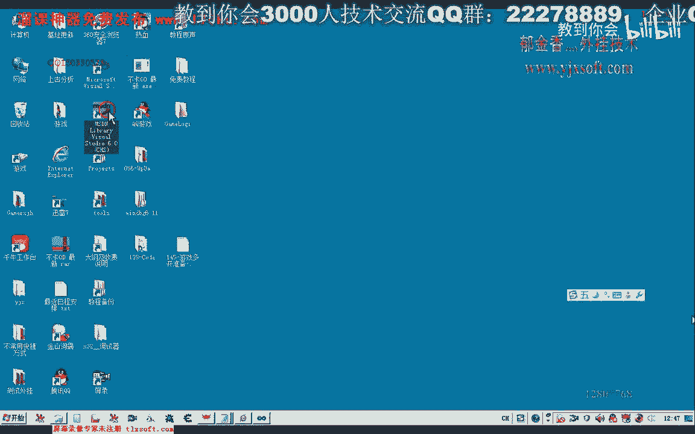

# P134：145-游戏多开准备-获取游戏路径 - 教到你会 - BV1DS4y1n7qF

大家好，我是郁金香老师，那么我们在前面的测试当中呢，我们知道嗯需要呢在多开的时候呢，我们需要自己啊复制这个相应的客户端的这个目录，当时我们是用的一个批处理文件啊来进行的处理，但是呢它有它的一些局限性啊。

比如说他不能够通过一个批处理文件呢，它不能够检测指定这个目录是否存在，那么我们每次都会来来去重新来创建这个建立这个相应的这个目录，然后每次呢我们都都会去重复的复制这个数据过去。

但是我们自己来编程来复制的话，它就可以呢呃更加的精确，那么它可以呢先检测这个指定的目录它全部存在，那么如果它已经存在了，说明这个相应的文件呢它已经复制过去了，我们就用不着再进行复制啊。

当然我们还可以进行文件的大小以及版本啊这些更复杂的一些检测呃，那么检测如果这个相应的比如说这个clean 00这个里面的目录，这个文件的呃，修改的时间。

或者是它的大小与我们最新的这个目录里面的文件的一个大小，如果它不相相同的时候呢，那么我们呢对这个文件呢这些进行更新，那么这些的话我们用这个批处理文件呢来处理的话，它都不能够达到，他都不能够达到。

所以说呢在这节课呢我们先呃在最近的这节课呢，我们就来探讨一下怎么来进行这个文件的文件夹的这些一些检测，是否和指定的文件夹如果存在，我们就不再重复的去复制这些文件，那么如果比如说这个指定的这个领土。

这个文件夹，如果它不存在的话，那么我们在建立这个相应的目录，再把我们客户端最新的这个文件呢全部呢再把它复制过去啊，那么实际上呢我们的系统呢也提供了相应的这些接口函数来实现的，那么在实现它之前呢。

我们可以了，需要先知道游戏的一个目录啊，那么这节课呢我们先来讨论一下啊，怎么获取这个游戏的路径，这个目录以及相关的代码，它主要是涉及到两个api的函数啊。

等一个一个呢是这个打开我们这个浏览窗口的这样的一个函数，另外呢我们是把这个浏览窗口它获取的一个相相应的这个目录表呢，呃转化成我们相应的这个路径的这样的一个形式啊，所以说这里我们需要用到两个函数。

那么另外呢文件的目录以及文件的复制呢，就是一个文件操作的一个函数模式方案和pati这个函数，那么这一节节课我们先来了解一下前面的这两个函数，我们把之前的代码打开，这个跟啊游戏登录的这个代码。

我们把它打开一下。

然后呢我们切换到我们的资源视图，嗯那么在这里登录之前呢，我们先做一下选择啊，嗯先设置一下我们游戏的这个目录，在这里呢我们再给它添加一个相应的一个按钮，当然我们之前的做法呢是固化的啊。

也就是直接把这个游戏的目录自传染啊，放到里面去啊，但是这样通用性不是很强，哈哈哈，那么在这里呢我们就可以把之前的这两个红呢，把它替换成我们的一个全局变量啊，这个时候那么我们在这里呢就把它改变一下。

来来来，首先是客户端的一个地址，然后呢是我们游戏的一个目录的一个地址，那么这两个地址呢我们把它设置为全局变量的形式啊，那么等会让我们再来来获取它的一个游戏的一个目录，一个地址啊，嗯那另外再建建一个变量。

好的，那么这几个变量建立之后呢，我们全部人都在我们的，这个函数里面呢来进行一个初始化，刚才我们说到了，需要用到的是是两个这个api函数，那么第一个呢我们就是显示一个浏览嗯对话框，那么呢它有一个参数啊。

在这里呢我们需要用到这个lose inform，那我们先，定义一个这样的一个结构，当然这个结构呢它有一些数值呢我们可以嗯作为一个设置，另外呢我们也需要对它进行一个初始化，这个结构。

首先呢是它的一个副窗口的一个设置，那么在这里呢我们这个数值呢可以为空，就是桌面啊，也可以不设置，不设置的话，因为我们之前在初始化的时候升平呢，它就是空，那么也可以复制为嗯，就是这个窗口化，把出风口。

那么另外呢这里呢还有一些回调函数呢，这个我们也可以不设置，这里是显示的一个标题啊，这个我们可以设置一下它的标题呢，呃实际上也就是窗口里面显示的一段啊信息啊，比如说在这里呢我们就说啊请选这游戏所在目录上。

安装部落或者是那么这里我们可以把它写细致一点。

就是这个登录器的这个所在的目录。

那么我们可以直接说这个lunch的ex一所在的这个目录，我们把它找出来，那么另外呢它还有一些标志哈，比如说这个呢它是要设置一个返回的一个数值，也就是你选择的某一个目录，或者是选择了某一个名字。

那么呢它的需要了一个返回的一个缓冲区，那么这个我们可以复制设置为空啊，那么也可以另外的给它设置一个，当然这个参数呢实际上对于我们现在来说是它是没有什么啊用处的。

当然这里我们也可以来设计一个这样的一个缓冲区，好然后呢这个就是它缓冲区的一个地址，另外它还有一些标记啊，那么这个标记呢它比较重要，那么这个标记里面呢它可以指定嗯，就是我们这个窗口显示的一些样式啊。

那么我们来看一下m s经验里面的一个说明。

那么这里呢他如果是选中了这个b f e d f t box呢，它会显示一个编辑框啊，这个时候呢会弹出一个连体框，那么另外呢它可以与其他的这个标志来进行一些主播，那么这里我们如果选中了，这个选项啊。

那么它会显示了这个目录以及这个目录下面的呃，这个文件会显示文件和这个目录都会显示，那么这一点呢也是我们所需要的，因为我们需要找到这个拉姆起跳ex e这个文件，那么我们就需要这两个。

当然最后这里呢它还有一个痕迹return，那么最后呢这个系统呢它会返回来一个目录，如果你选择的这个目录，啊如果你选择错误的话，这个ok这个按钮会变灰啊，那么我们来看一下。

那么所需要的话也也就是这三个参数吧，可能那么我们先编译运行一下，看一下现在它的一个效果，那么实际上我们看到他加了这个b f e d i t box之后呢，它这里呢就会有一个这个编辑框出现。

如果没有加这个标记的话，这个编辑框呢就不会出现呃，还有呢我们在这里呢它加了一个哦，还有这个呃我们的这个display啊，那么如果我们选中了啊，某一个这个选中的这个名字呢，按了确定之后呢，之后呢。

它会保存到这个size display这个缓冲区里面，我们可以继续来看一下，啊最后呢我们选中这个垃圾文件啊，然后按确定，当然这个时候呢我们没有打印出我们的调试信息，我们可以把调试信息打印出来。

看一下最后这个size play的一个结果，妈，当然如果这里呢不要这个e d i t box的话，他最后呢呃就不会显示这个相应的编辑框，啊这上面的这个编辑框呢他就找不到了，这个时候。

这个时候我们最后选中的是这这个啊文件名，如果我们是选的这个client，那么最后呢这个size player，他的数里面保存的数据呢就是这个我们选中的数据，如果我们最后选中的是他。

那么最后我们按下确定之后呢，这里呢它输出的信息呢就是这个size display，如果它为空的话，当然也就不会呃，我会保存这个相应的数据，另外这里如果我们不加上这个标记的话。

那么呢它里面的这个文件好像是不会被显示的，那么这个时候呢它只会显示这个目录，那么这个时候打开来里面它的所有的文件啊，就看不到了啊，如果要显示文件的话，我们必须来再把这个标记呢加上。

好那么最后呢还有一个bf 1 d i t的，这个我们加上这个呢可以自己输入它的一个路径也是可以的，当然我们最后我们所要所需要取得的应当是呃它的一个路径哈，游戏所在的一个目录路径。

那么我们实际上需要用到它的一个返回数值，因为它的一个返回数值呢也是一个结构，这个atti divist，那么这个呢它是一个相互相相应的，也是一个表格啊，这个时候这个i j k，那么这个表格的话啊。

应该是一个指针，那么指向的是这样的一个表格，但这个表格呢我们还需要用另外一个函数来转换，才能够转换成我们的呃，所常用的这个目录路径啊。

需要把它转换过来才可以有一个get possible idlist啊，那么从这个idlist里面获取这个相应的路径，当然这里也需要用到一个缓冲区，那么这个缓冲区的话，我们之前已经这个定义了啊。

在这前面的，在这个位置有一个电音，好好，修改一下，在前面那个不修改，这个我们把它修改一下，好那么这个缓冲区呢就用来获取它的一个返回值，那么最后呢这里呢我们也可以把用户调试信息来把它打印出来。

那么比如说我们选择这个目录，然后按确定我们看一下，他就会把最后选择到这个名字，以及他所在的目录呢会返回，那么当然我们还可以做一个相应的判断啊，到时候也就是说我们最后选择它，如果不是这个游戏的这个名字啊。

也就是说不是选择了这个名字的话，我们就呃所选择错误啊，或者说在这个路径下面，我们没有检测到这个文件呢，我们就说呃这个选择的路径啊错误，那么这个时候我们可以看到它实际上呢最后返回的路径呢。

就是这个路径就是这个路径，所以说在这里呢最后呢我们也可以给它做一个相应的一个判断，判断一下最后它的一个这个size display得出一个数值。

如果这个size d display它不等于我们的这个lt p e x e的话，那么我们就说了这个选择的路径是错误的，就抱着提示一个对于用户来进行一个提示啊。

所以说这个size display呢说起来呢它还是有一定用处的啊，那最后呢我们可以做一个判断，哒哒哒哒哒哒哒哒哒，嗯，打了，那么如果这个时候我们选择错了之后返回来这里呢，它就会有一个提示啊。

就会有一个错误的一个提示，那么如果选择对了的话，他就不会有这个提示，就ok了，好那另外呢我们再把上面的这两个字出来做一下修改，把它的一个呃路径呢给它计算出来嗯我们来看一下，首先呢我们要获得这个路径的话。

我们需要获得这前面的这个路径，在前面的这个路径取出来之后呢，我们再要要加上，那么后面所在的要加上一个相应的一个后缀，the pass and clean，我们看一下啊，应当来说的话。

我们只需要把它的这个路径取出来就ok了，实际上实际上后面的这个long起跳ex一了，我们需要把它去掉呃，这样的话才能够保证了我们的路径能才是正确的，那么这样的话我们可以来，可以先找一下哈。

在我们的这个字串里面找一下这个相应的这个字串，然后来进行一个替换，那么我们可以用s t i s t r a，那么这个函数来来搜索它的一个子串，在我们的，size跟hod 2里面进行搜索。

那么搜索的指出来也就是我们前面的这个拉琴啊，e x1 ，那么如果他搜索到的话，它最重要csp的这个数值呢，它会大于大于零，也就是说它不等于我们的，它不等于空，那么这个时候呢我们对它进行一个判断。

那么实际上这里有错误的话，我们就返回后面这段呢我们就不用再执行啊，如果在他后面啊没有找到这个lunch的x一的话，那么在这里呢我们就可以了，不需要这个相应的这个判断都可以。

那么我们直接来往这个csp里面写数零啊，也就是我们的字符的一个结束啊，结束的字符，然后在这里呢我们再打印出我们的相应的一个路径就可以，因为之前在这里呢他就反过来，所以说这里的话他必定他不可能为零。

肯定是可以找到的，当然为了安全起见呢，在这里呢我们还可以加上一个一个csp等一个判断，那么如果这个cs p它不是一个空气值呢，我们再来进行这个协助，不然的话这里会报错啊，那么我们再来看一下处理的结果。

好那那这次呢我们最后的最终的这个取得的这个路径，那么这个路径有了之后的话，那么其他的这个我们就很方便，活成我们后面的这个相应的客户端的这个地址呢，我们就很好过去了。

在这里呢我们也可以把这个客户端的配置了，也进行一个，那么这个客户端的地址的话，我们就等于把这个游戏所在的目录的一个地址先给它复制过去，然后呢我们再用sr，再给它添加这个相应的字串键，追加到后面就可以了。

真compass，谁给老21n t啊，那么理论上的话，这样我们就可以找到它的这个这个相应的这个地址twice，然后呢我们再输出，那么这这是最终的这个地址输出的啊。

一个是我们浪起他所在的就是一个是clem所在的这个地址，那么另外一个呢我们就是要活成我们其他的呃，这个多看目录的这个地址，那么这个地址的话，我们在这里边呢实际上有相应的在登录的。

这个按钮里面呢有活成相应的这个地址，这里是登录啊，那么登录的时候呢，我们还需要来进行一个检测啊，也就是在选区的时候看一下，那么这里呢没有涉及到多开，还没有那么多开的话。

我们还需要呢要改变一个这个目录的这个地址，那么也就是最终呢要修改的这个c2 info呢，它里面的一个参数，那么我们需要进行一个检测，这里呢有一个跟clean pass啊。

那么这个路径呢我们需要来对它进行修改，实际上我们是需要，好的，那么这个修改了，我们在把相应的这个目录建成了之后呢，我们在下一节课呢再继续进行探讨，那么这节课呢我们就先分析到这里，好的。

