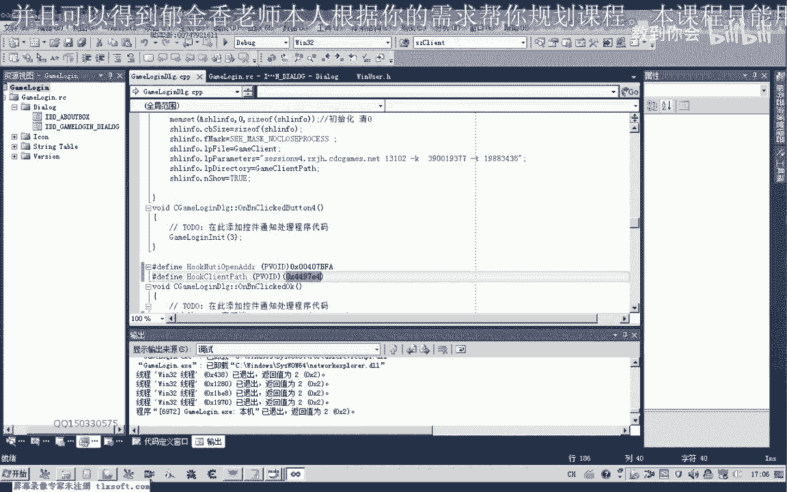
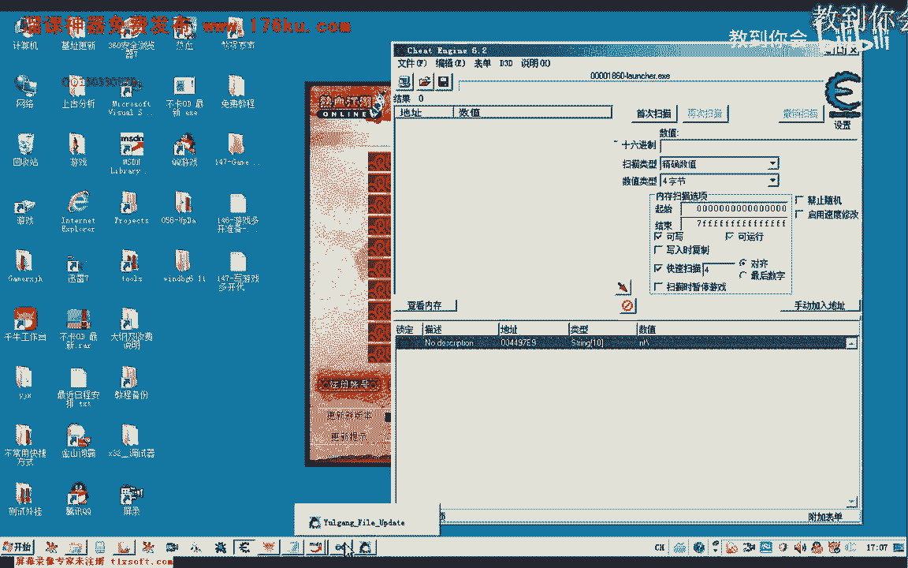
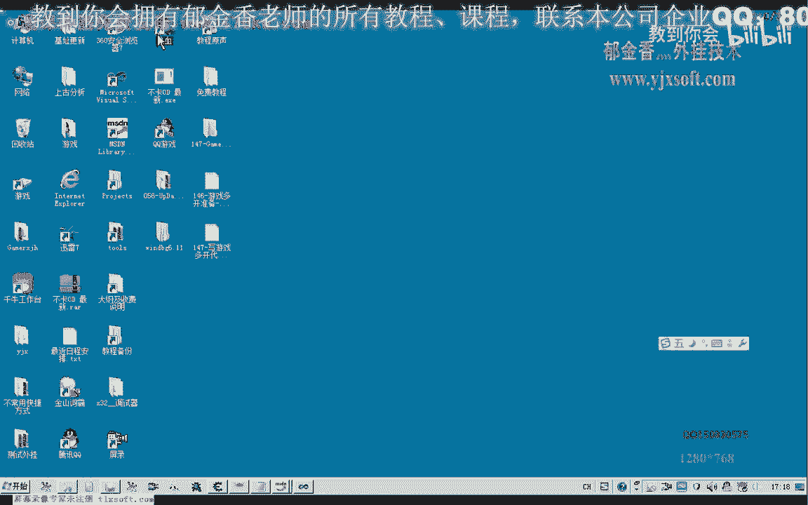
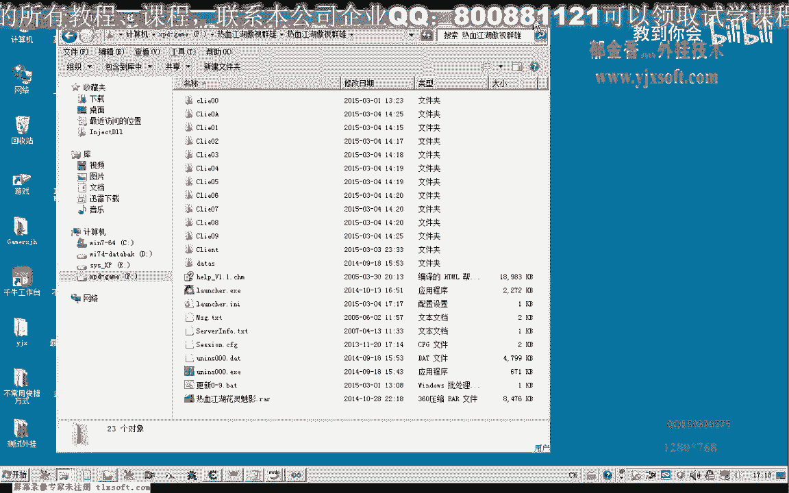
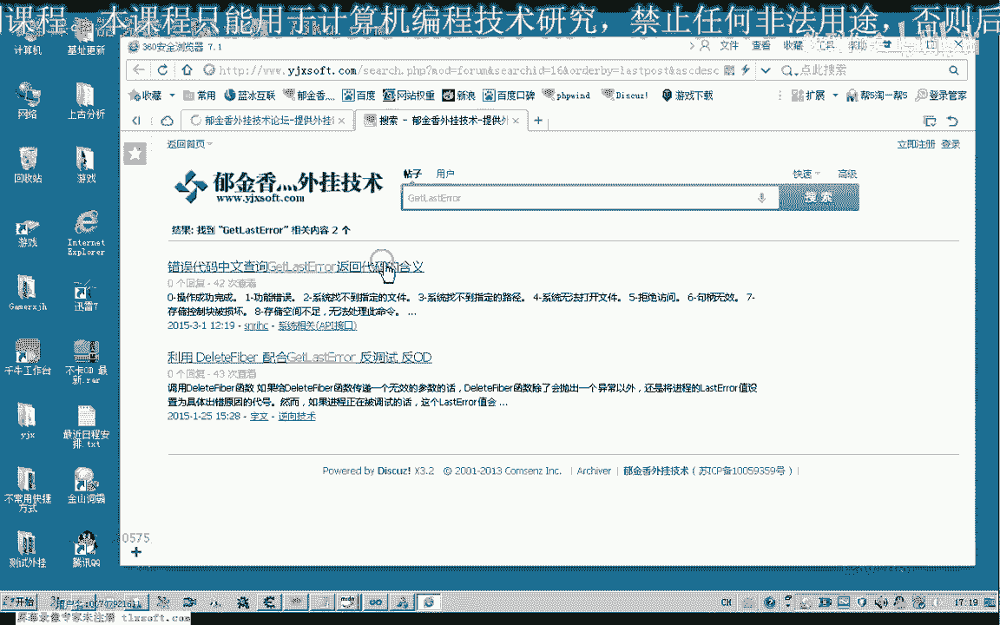
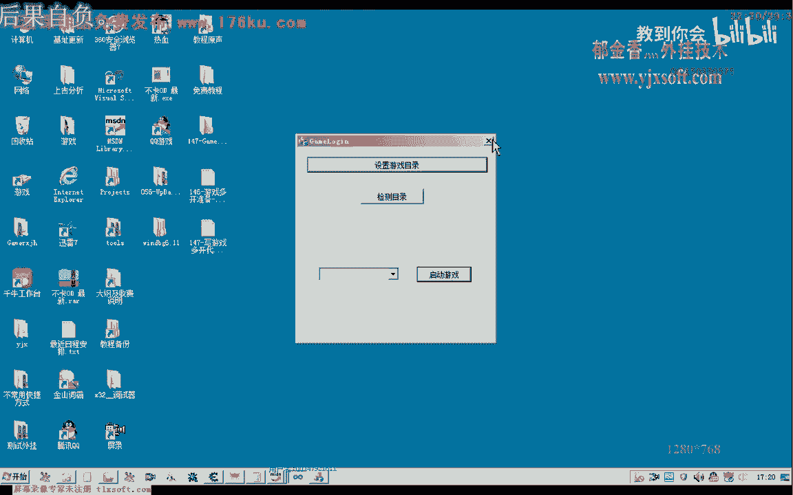
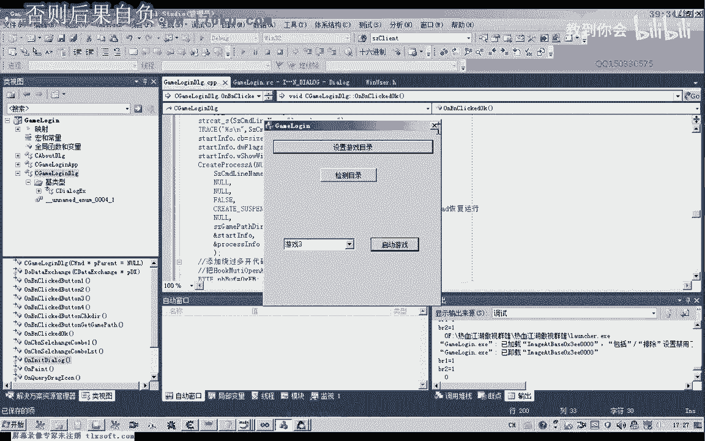

# 郁金香老师C／C++纯干货 - P136：147-写游戏多开代码 - 教到你会 - BV1DS4y1n7qF

大家好。

我是郁金香老师，那么这节课让我们一起来编写游戏多开的代码，先打开146克的代码，然后我们在启动游戏这里，这两行因为我们要实现的是多开，不是登录器，那么所以说在这两行的话，我们需要来把它进行一个修改。

需要把它注视掉，而且在这里的话，我们在启动我们的客服端这里，我们需要来也需要把它注视掉，而不是我们直接的启动客服端，那么这是我们启动客服端的代码，那么在这里我们启动客服端的话，是由我们的登录器来完成。

而不是由我们去更改它，那么所以说我们先要打开游戏的登录器，那么主要我们用Creative Process来完成，用它来打开我们的游戏的登录器，那么这个函数我们先做一下了解，它有几个必要的一个参数。

必须的一个参数，那么第一个也就是命令行，还有一个就是我们的当前目录，以及我们指向我们的一个开始的一个信息，主要是用来显示窗口，还有这个是返回进程的一些信息，当然最重要的是一个创建的标志。

那么创建标志我们需要把它设置为暂停的一个状态，需要设置这个标志，然后我们再用Resume Sealed来恢复这个进程，因为如果我们不采用这个标志的话，那么一旦创建之后。

它就已经执行了我们的检测游戏多开的代码，那么就实现不了多开，那么我们必须要把它暂停掉，创建进程之后，然后再把它pass掉，修改过检测的代码之后，再让它这个进程来执行，以达到绕过多开的一个目的，好的。

那么我们先来创建游戏的登录器，那么游戏登录器，我们也需要通过之前的代码来获得我们游戏的运行的一个目录，在这里的话，我们之前已经获得了，我们打个比方，已经在获得了游戏路径的情况下，那么我们来使用这个函数。

那么使用这个函数，我们需要传递的参数，我们需要先把它准备好，那么其中两个是结构，那么我们需要在这里的定义相应的信息，结构信息，那么另外一个来使用作为一个返回的一个进程的一个信息，好。

然后有了这两个结构之后，我们就可以直接的调用这个函数，那么我们来看一下，它有很多的参数，那么之前的这些，我们都可以把它复阅掉，然后第二个参数，命令行这个我们必须要要是它的一个全路禁评。

那么在这里它的一个全路禁评的话，我们需要另外的定义一个次算来对它进行一个活程，然后是由我们的，这个游戏的路径里面再来加上登录器的一个名字，那么这个是我们去掉的一个登录器的一个名字。

这个时候我们把它相当于是恢复过来，再加上登录器的一个名字，那么这是它的第二个参数，那么第三个参数，我们可以默认的可以把它复阅掉，那么第4个参数，我们可以是否继承，这个我们也可以。

那么在下面一个标志是我们的进程创建的一个标志，那么这个标志的话就是我们的一个关键，那么我们需要把它挂起，在创建进程的时候，我们可以在这个标志上面把它加上这个名字来订阅这个标志。

那么现在我们可以看到这个标志是我们的一个关键的一个标志，那么这个标志是我们的一个关键的一个标志，那么还有一个设置一个当前的一个目录，那么这个目录的话就等于我们这个游戏所在的，这个目录。

那么后面是两个相关的一个信息，是一个结构指针，start，嗯嗯嗯嗯嗯嗯嗯嗯嗯嗯嗯嗯嗯嗯嗯嗯嗯嗯嗯嗯嗯嗯啊，我們還需要來進行一下轉換，我們現在是在做一個轉換，我們現在是在做一個轉換。

我們現在是在做一個轉換，我們現在是在做一個轉換，我們現在是在做一個轉換，我們現在是在做一個轉換，我們現在是在做一個轉換，我們現在是在做一個轉換，我們現在是在做一個轉換，我們現在是在做一個轉換。

我們現在是在做一個轉換，我們現在是在做一個轉換，我們現在是在做一個轉換，我們現在是在做一個轉換，我們現在是在做一個轉換，我們現在是在做一個轉換，我們現在是在做一個轉換，我們現在是在做一個轉換。

我們現在是在做一個轉換，我們現在是在做一個轉換，我們現在是在做一個轉換，我們現在是在做一個轉換，我們現在是在做一個轉換，我們現在是在做一個轉換，我們現在是在做一個轉換，我們現在是在做一個轉換。

我們現在是在做一個轉換，我們現在是在做一個轉換，我們現在是在做一個轉換，我們現在是在做一個轉換，我們現在是在做一個轉換，我們現在是在做一個轉換，我們現在是在做一個轉換，我們現在是在做一個轉換。

我們現在是在做一個轉換，我們現在是在做一個轉換，我們現在是在做一個轉換，我們現在是在做一個轉換，我們現在是在做一個轉換，我們現在是在做一個轉換，我們現在是在做一個轉換，我們現在是在做一個轉換。

我們現在是在做一個轉換，我們現在是在做一個轉換，我們現在是在做一個轉換，我們現在是在做一個轉換，我們現在是在做一個轉換，我們現在是在做一個轉換，我們現在是在做一個轉換，我們現在是在做一個轉換。

我們現在是在做一個轉換，我們現在是在做一個轉換，我們現在是在做一個轉換，我們現在是在做一個轉換，我們現在是在做一個轉換，我們現在是在做一個轉換，我們現在是在做一個轉換，我們現在是在做一個轉換。

我們現在是在做一個轉換，我們現在是在做一個轉換，我們現在是在做一個轉換，我們現在是在做一個轉換，我們現在是在做一個轉換，我們現在是在做一個轉換，我們現在是在做一個轉換，我們現在是在做一個轉換。

我們現在是在做一個轉換，我們現在是在做一個轉換，我們現在是在做一個轉換，我們現在是在做一個轉換，我們現在是在做一個轉換，我們現在是在做一個轉換，我們現在是在做一個轉換，我們現在是在做一個轉換。

我們現在是在做一個轉換，我們現在是在做一個轉換，我們現在是在做一個轉換，我們現在是在做一個轉換，我們現在是在做一個轉換，我們現在是在做一個轉換，我們現在是在做一個轉換，我們現在是在做一個轉換。

我們現在是在做一個轉換，我們現在是在做一個轉換，我們現在是在做一個轉換，我們現在是在做一個轉換，我們現在是在做一個轉換，我們現在是在做一個轉換，我們現在是在做一個轉換，我們現在是在做一個轉換。

我們現在是在做一個轉換，我們現在是在做一個轉換，我們現在是在做一個轉換，我們現在是在做一個轉換，我們現在是在做一個轉換，我們現在是在做一個轉換，我們現在是在做一個轉換，我們現在是在做一個轉換。

我們現在是在做一個轉換，我們現在是在做一個轉換，我們現在是在做一個轉換，我們現在是在做一個轉換，我們現在是在做一個轉換，我們現在是在做一個轉換，我們現在是在做一個轉換，我們現在是在做一個轉換。

我們現在是在做一個轉換，我們現在是在做一個轉換，我們現在是在做一個轉換，我們現在是在做一個轉換，我們現在是在做一個轉換，我們現在是在做一個轉換，我們現在是在做一個轉換，我們現在是在做一個轉換。

我們現在是在做一個轉換，我們現在是在做一個轉換，我們現在是在做一個轉換，我們現在是在做一個轉換，我們現在是在做一個轉換，我們現在是在做一個轉換，當然這兩個地址了，我們先把它複製過來，我們先把它複製過來。

(音樂)，(音樂)，這個是進程劇本，我們打開之後，然後是它的一個起始地址，要寫入的地址了，我們直接把它傳入進來，那麼要寫入的一個緩衝區，我們需要在之前給它準備一下，(音樂)，然後要寫入的大小是一個字節。

最後這裡是實際寫入的字節數，這裡我們可以另外給它傳一個數據出來，By Red，(音樂)，那麼理論上的話，這樣我們就能夠實現多開了，但是我們還是做一下檢測，檢測一下這個函數是否執行成功了。

那麼如果執行成功的話，它會返回一個非0的數值，那麼這裡是傳入它的一個地址，好的，我們再重新來看一下，首先也是設置它的一個目錄，那麼這裡的BR是唯一的，那麼唯一的這個時候，我們就可以開啟多個登錄器。

那麼這個時候，第一步，第一個多開的這個項，實際上已經被繞過了，那麼我們接下來要做第二項，繞過我們客服端的一個檢測，那麼也就是需要修改一個它的路徑，讓它客服端啟動的時候，需要修改一個路徑，那麼這個路徑。

它也保存在我們這個登錄器裏面，那麼我們直接修改它的地址就可以了，那麼它的地址的話，在449714這個地方，那麼我們來用這個CE來看一下這個地址。

那麼這個地址實際上它是一個字串，我們只需要把這個相應的數據來跟它寫進去，那麼實際上我們只需要寫的，應當是這個NT這個地方，NT這個地方的話大概是09，從這個位置開始寫，那麼我們再把這個地方做一下修改。

或者也可以直接從14這個地方改也是可以的，但是要改的話，我們就需要改的是整個字串，從斜槓這個地方開始改，那麼我們先需要來自己形成這樣一個字串，把這個字串我們複製一下，那麼從這個地方開始改。

那麼我們現在生成的一個格式的話，是這種格式，00到我們的09，這類的或者是0A0B的這種格式，那麼所以說在這裏，我們也需要給它這個緩衝區的話，也需要生成這樣的格式才可以。

那麼我們可以把前面的這段複製一下，也需要給它生成一個這樣的緩衝區，緩衝區，然後，然後，好，(音量注意)，(音量注意)，(音量注意)，(音量注意)，(音量注意)，(音量注意)，(音量注意)，(音量注意)。

♪ 音乐 ♪，♪ 音乐 ♪，注意这里有个转移字符，是一个双斜杠才表示一个斜杠，那么在这里我们需要改动的是这个地方，那么它这个地方的一个改动，我们是通过这个Combo Box来改动。

它里面所选择的这个数字，来进行一个改动，那么在这里我们需要为它关联相应的变量，♪ 音乐 ♪，♪ 音乐 ♪，♪ 音乐 ♪，♪ 音乐 ♪，好的，那么我们在这里我们通过我们列表框里面选择的数值来更改。

它的这个来更改相应的一个字串，♪ 音乐 ♪，♪ 音乐 ♪，那么它当前选择的这个相应的下标的话，我们就可以作为它的客户端路径的后边的这两个字，那么我们在这里来用另外建立一个Armbit，♪ 音乐 ♪。

那么这样我们只取它的一个字节就行，然后用PRMTF来格式化它，♪ 音乐 ♪，那么这样的话我们就能够生成一个我们固定格式的一个字串，♪ 音乐 ♪，类似于这样的一个字串，或者是那么当然这里这个字串的话。

它可以很大，可以从00到FF可以容纳256个不同的路径，当然还有更多的需要的话，我们可以从这前面可以改，这里可以改为3X，那么这样的话，当然我们一般来说的话，一个游戏最多几十开上百开的话就已经够了。

所以说在这里的话，我们只用2X来就够了，那么这个路径生成之后，我们把它追加到把它写到我们的相应的进程里面去，把前面的这一段复制一下，♪ 音乐 ♪，然后这里是我们要修改的一个地址。

那么这里是它的一个缓冲区，当然现在缓冲区我们变了变成size，当然在前面的地址符号我们也可以不要了，那么这里我们需要，它的一个需要写的一个字节数，字节数的话就是字串的一个长度，♪ 音乐 ♪，好的。

那么我们再重新编译申请一下，♪ 音乐 ♪，♪ 音乐 ♪，但是我们要注意到，这个时候BR2它写入的数据，返回之为0，说明的话，这里它没有写入成功，我们可以复加到里面去看一下，那么如果这里写成功的话。

它应该是00，这个地方应该是从00这里开始，或者是03，应该是02这一类的，那么所以说这里的话，我们还要找一下原因，它为什么写入失败了，那么我们可以把它的最后的一个错误代码。

抓出来看一下，get master，好的，那么我们再次编译申请一下，刚才这里路径设置错了之后。

另外的复制了一个文件，我们把它删掉。

那么再次运行我们测试一下，那么我们从这里来我们能够看到有一个错误代码是998，那么它的错误代码的话，我们可以来到论坛去查询一下，它是一下是一个什么意思，在这里我们搜索一下，然后一到998这里。

那么这里他说的是内存的一个访问无效，内存的分配或者是一个访问无效，但是我们这个地址它是存在的，而我们写入这个内存的话。

它需要的是一个读写的一个属性，当然在这里的话，我们是需要写入的一个属性，那么如果不存在的，我们可以尝试来用另外的一个函数来更改这个页面的一个属性。

那么这里我们可以用这个Virtual Protect来更改一下它的一个属性，这里我们更改十个字节大小的一个属性，那么它新的一个属性，我们来进来看一下，它有哪些属性，那么我们至少需要一个写入的一个属性。

配置，ReadWrite，那么我们选这个可读可写可执行，那么完成了之后，我们再把相应的属性给它恢复过去，好的，那么我们再次测试一下，那么这个时候的话，我们可以发现了它写入是成功的。

我们再用这个C1来附加进去看一下，那么这个时候它写入的地址是00，看来是页面属性的一个问题，那么我们再次启动第6个登录器，再用C1我们进去看一下，那么这里它还是00。

那么实际上我们这是因为我们没有另外选择的原因，这里我们要自动的要选择一下启动的游戏的时候，这里是01了，那么理论上这样的话我们就能够实现，多开，那么我们再来测试一下。

那么这样我们就能够达到一个完美的多开，多开，好，有點氣味，他剛剛好，起了氣味，為什麼，這個，我還看了一段，我還看了一段，我都還沒看完，是誰，好像也沒看完，可是他今天，他今天晚上，坐在我面前。

他前面還不肯排隊，他現在就沒有進來，他現在是沒有進來，他現在是有點氣味，他剛才說什麼，我們這節課，大致的內容就到這裡，當然我們還可以做一些細節上的一個修改，比如說，我們在這段代碼後邊，我們還可以。

讓他自動的列表，自動的移到下一個，自動的選擇下一個，當前選擇的下標，讓他自動的+1，另外，我們默認的讓他選擇第一個下標，在這裡，內視圖裏面我們再做一些修改，嗯，嗯，(錄影起點)，(錄影起點)，好的。

那麼我們再次運行，(錄影起點)，那麼這樣的話，它啟動第一次之後，它自動的就會移到下一個選擇的這個地方，(錄影起點)，好，那麼再次啟動的時候，它就是另外的一個路徑，這個時候來保證我們兩個登錄器裏面的路徑。

它不一樣，(錄影起點)，這是00，下面這個是01，那麼這樣就能夠打到了繞過客戶端的一個多刊，還有繞過一個登錄器的一個多刊，從而實現真正意義上的一個多刊，對於這個遊戲來說，(錄影起點)，好的。

那麼這節課我們就交流到這裏，那麼我們下期再見。

谢谢大家，(今天的時間差不多，下次見)。