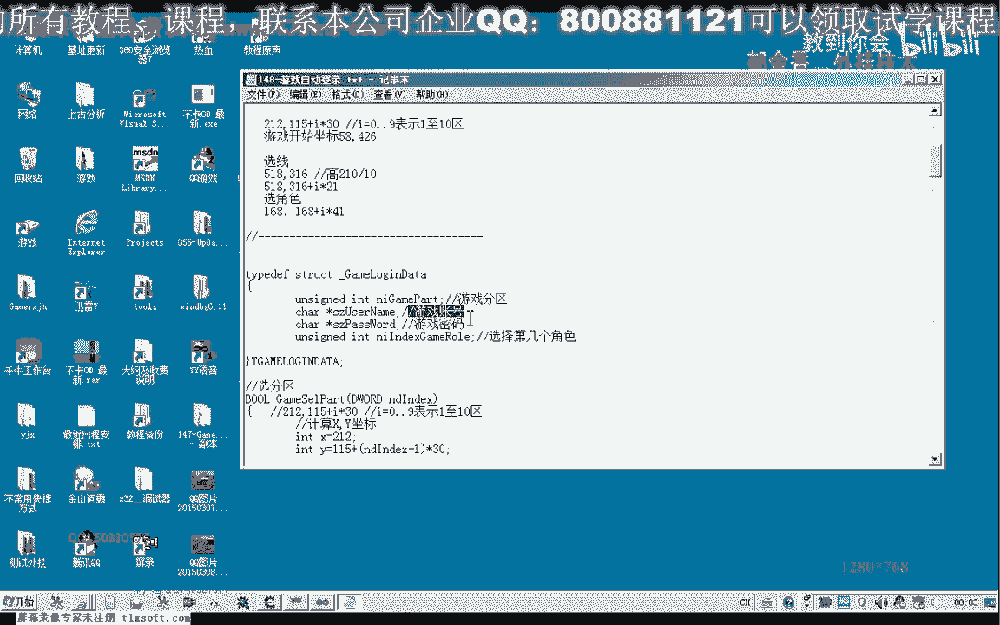
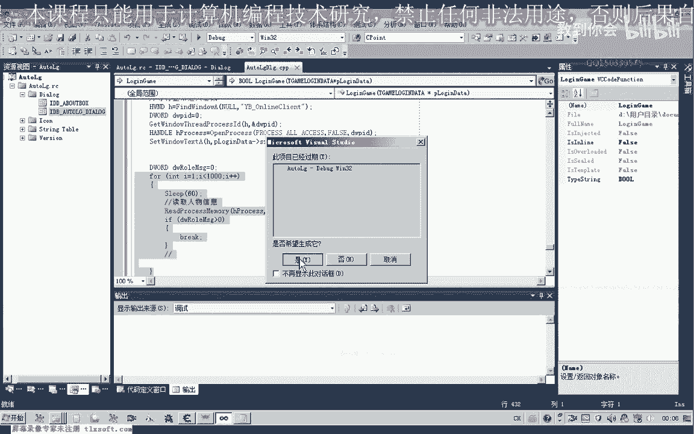
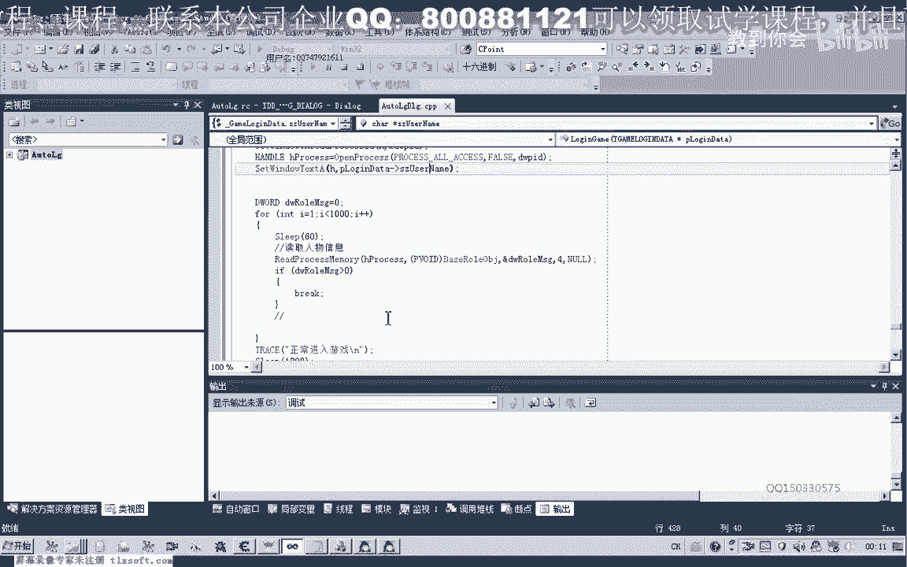

# P137：148-游戏自动登录原理 - 教到你会 - BV1DS4y1n7qF

大家好，我是郁金香老师，那么这节课呢我们呃来大致的看一下自动登录的一个设计，那么游戏的自动登录呢，一般来说我们都是通过呃按键的一个模拟来实现的，那么这种设计的话也比较有通用性，那么我们先来看一下呃。

以这个热血江湖为例，来看一下它的一个登录设计，那么首先呢我们肯定是要按照之前多开的一个过程过程，先打开游戏的登录器，然后用鼠标模拟呢来选区啊，那么在选区的时候我们就需要了呃获得这个相应的坐标点啊。

那么这个呢我们在后边等的过程里面呢详细的分析啊，呃那么我们先来看一下这个代码的一个打字的设计啊，反正这里呢主要是用鼠标模拟点击，比如说我们选择网通四区，点击这个坐标，然后呢点击之后呃。

等待一段时间之后呢，再点击游戏开始啊，那么游戏开始之后呢，我们再等待一段时间或者写相应的代码来判断游戏的客户端，正常的打开了之后呢，然后我们输入它的一个账号或密码，那么呃游戏的相对复杂一点的。

可能就是输入这个密码以及选择这个人物相关的信息，那么另外呢还有一个就是在不同的电脑上，它的时间啊，登录的时间不一样嗯那么为了提高这个效率的话，我们可以来写一些判断的代码。

当然如果是嗯在设计的时候不考虑这个效率的话，我们可以了，尽量的把这个等待的时间设长一点，那么我们先来看一下我写的一部分代码啊。

那么首先呢我设计了一个结构用来存放呃，它相应的游戏的选区以及游戏的角色和选择的呃，还有我们的呃账号封闭嘛这一些信息，那么最终我们设计好之后呢，我们可可以实现一个批量的一个登录啊。

然后把我们嗯大量的账号呢保存在一个文件里面啊，当然现在只是测试阶段啊，一个测试的一个阶段，然后登录的这个库呢设计在这个logo里边，那么首先呢我们这个呢也是先创建一个登录器的客户端。

通过这个college process，然后创建之后呢，把这个登录器的进程来挂起，挂起之后呢，然后呢我们呃修改多开相关的代码，这个在我们之前已经呃做过测试，然后呢把这个七五这一次节来改为1b啊。

跳过一个多开的检测，然后呢我们再恢复这个相应的一个线程啊，当然之前的话我们为了躲开绕过它一个目录路径的一个检测呢，我们还需要呢在这里呢可视化它的一个呃目录路径啊，在这个登录器里面，然后我们再恢复啊。

这样这一部分前边这一部分呢是为了实现一个多开而设计的，那么这后边的话就根据我们传进来的一个账号的一个信息啊，也就是选择的分析了分区哈，通过鼠标模拟啊，进入到这个库里边啊，来模拟我们鼠标的一个点击啊。

那么鼠标点击之后呢，我们等待一段时间，或者另外写一个代码来判断，那么这个判断呢也就是说呃他把这个分区的信息呢嗯初始化好，那么游戏开始的按钮呢呃呈现出来啊，那么接下来呢我们就点击这个开始游戏。

开始游戏之后呢，我们要等待一段时间啊，要让我们的客户端启动，要让我们的这个账号和密码的这个框来弹出来，然后呢我们再用键盘啊模拟来输入我们的这个嗯用户名，那么用户名输入完了之后呢，我们再输入我们的密码。

在前面呢，我们需要按下一个tab键啊，做一个切换啊，或者用鼠标来模拟给某一个位置登录也是可以的，当然这里用回车键呢登录呢要方便一些，然后呢再是自动选线，选线之后呢。

呃选项之前呢我们需要把这个窗口呢把它置换到顶端啊，然后让这个窗口来获得一个焦点，嗯然后呢再次选择一个教主角色，那么角色选择选择完了之后呢，我们在这里呢，因为呃角色选了之后登录到游戏的时间呢。

等待的时间比较长啊，这里为了提高效率呢，我们呃就用一个循环来判断这个游戏是否正常的登录了，嗯这里呢我设置的是呃一个一分钟的一个判断，在这一分钟之内呢不停的啊，每隔60ms呢就去读取一次人物的信息。

那么如果读取出来了，那么我们就退出这个循环，就表示已经正常的进入到我们的这个游戏里面，那么当然这里呢我们也可以直接的，你可以直接设计为实力，那么可能的话这个等待的时间就比较长啊。

没有我们这种循环的判断呢效率这么高啊，那么我们也可以把这个循环直接把它注释掉啊，等待一分钟或者两分钟之后呃，再来了，进行一个接下来的操作，比如说我们开启外挂啊这一类的，自动开启，自动开启挂机啊。

自动去任务啊这一类的，好的，那么我们先来测试一下。

嗯，啊这个时候呢都是我们的代码呢，它自动的在控制我们的啊鼠标以及我们键盘的一个输入，好这个时候呢他需要等待一段时间，当然这个期间的话啊，我们是不能够去控制鼠标的一个操作的啊，进行一个操作的。

需要它自动进行的，至少呢我们需要这个游戏的窗口呢需要自前啊，需要前置，而且这个时候呢我们选中人物角色之后呢，我们需要把它的标题需要改一下，因为不然的话我们多个窗口之间呢，我们就无法的呃不方便啊。

进行一个分辨，因为下一个下一个客户端启动的时候呢，它也是同样的标题的话，我们就不能呢对它的窗口来进行一些相关的操作，那么这个时候进正常的进入游戏之后呢，它会自动的打开第二个客户端。

然后呢他等待一段时间之后呢，会再次的输入第二个账号，我第二个密码，啊然后呢它会自动的去选择我们的呃人部，等待一段时间之后选择轮毂，然后选择完了之后呢，他会把这个他的标题名来设置为账号的一个名字啊。

这样呢就完成了一个自动的登录啊，当然这里呢我还打印了一些调试的一些信息嗯，大家可以把所有的这个调试信息呢都打印出来啊，这样的对我们呃调试这个角色呢有一些呃有一些帮助啊，这样的话，好的。

那么大致呢我们就是这样的一个设计啊，那么下一节课呢我们再一步一步的详细的来呃，来介绍一下哈，这个数据的一些提取啊，啊还有我们账号密码的呃，输入的这些函数的啊设计，那么这节课呢我们就大致的介绍到这里了。

大致我们就用了这些技术啊，那么大家也可以下去呃，先自己编写代码进行一下尝试，好的，那么我们下一节课了再来讨论这些细节的东西。

